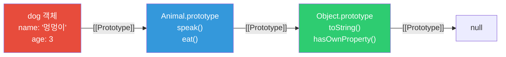
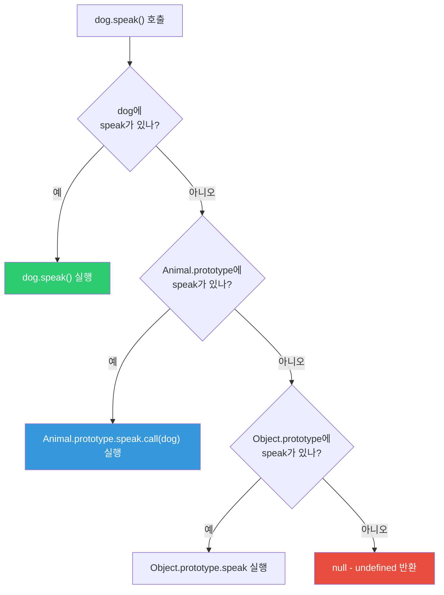
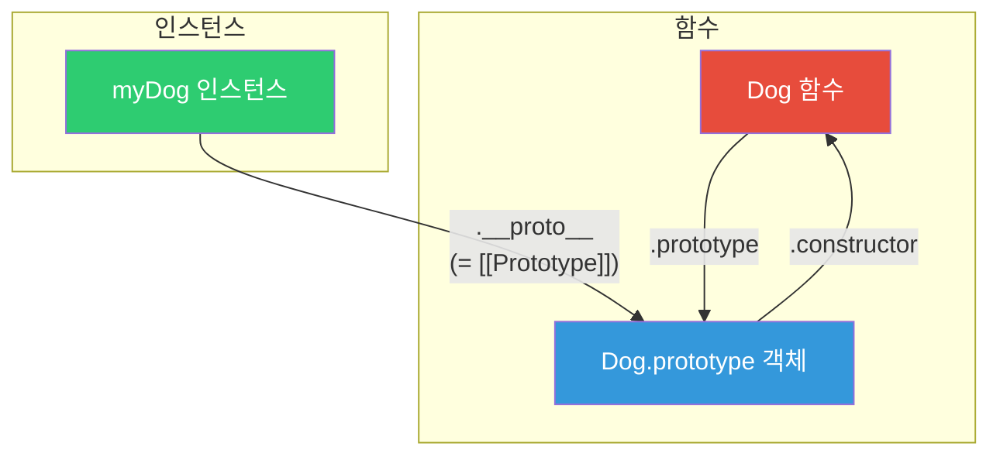
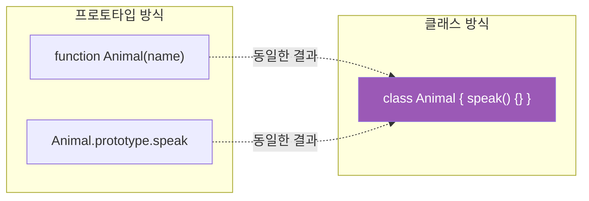
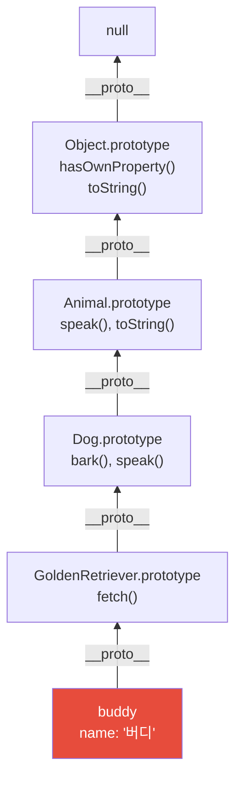

## 가족 레시피 전수

할머니의 김치 레시피가 있습니다. 어머니는 이 레시피를 받아서 자신만의 변형을 추가했고, 딸은 어머니의 레시피를 기반으로 또 다른 변형을 만들었습니다.

딸이 레시피에서 특정 재료를 찾으면:
1. 먼저 **자신의 레시피**에서 찾습니다
2. 없으면 **어머니의 레시피**에서 찾습니다
3. 없으면 **할머니의 레시피**에서 찾습니다
4. 거기도 없으면 "없는 재료"라고 합니다

이것이 **프로토타입 체인**입니다.

---

## 1. 프로토타입이란?

자바스크립트의 모든 객체는 `[[Prototype]]`이라는 숨겨진 속성을 통해 다른 객체를 가리킵니다.



```javascript
const animal = {
  type: '동물',
  eat() {
    console.log(`${this.name}이(가) 먹습니다`);
  }
};

const dog = {
  name: '멍멍이',
  bark() {
    console.log('왈왈!');
  }
};

// dog의 프로토타입을 animal로 설정
Object.setPrototypeOf(dog, animal);

dog.bark();  // '왈왈!' - 자신의 메서드
dog.eat();   // '멍멍이이(가) 먹습니다' - 프로토타입에서 찾음
console.log(dog.type); // '동물' - 프로토타입에서 찾음
```

---

## 2. 프로토타입 체인 탐색

속성을 찾을 때 체인을 따라 올라갑니다.



```javascript
function Animal(name) {
  this.name = name;
}

Animal.prototype.speak = function() {
  console.log(`${this.name}이(가) 소리를 냅니다`);
};

function Dog(name, breed) {
  Animal.call(this, name); // 부모 생성자 호출
  this.breed = breed;
}

// Dog.prototype이 Animal의 인스턴스를 가리키도록
Dog.prototype = Object.create(Animal.prototype);
Dog.prototype.constructor = Dog;

Dog.prototype.bark = function() {
  console.log(`${this.name}: 왈왈!`);
};

const myDog = new Dog('초코', '리트리버');
myDog.bark();   // '초코: 왈왈!' (Dog.prototype)
myDog.speak();  // '초코이(가) 소리를 냅니다' (Animal.prototype)
myDog.toString(); // [object Object] (Object.prototype)
```

---

## 3. __proto__ vs prototype

이 두 가지가 가장 많이 혼란을 일으킵니다.



```javascript
function Dog(name) {
  this.name = name;
}

const myDog = new Dog('초코');

// prototype: 함수의 속성, 인스턴스의 __proto__가 될 객체
console.log(Dog.prototype); // { constructor: Dog }

// __proto__: 인스턴스의 속성, 실제 프로토타입 체인
console.log(myDog.__proto__); // { constructor: Dog }

// 두 개는 같은 객체를 가리킴
console.log(myDog.__proto__ === Dog.prototype); // true

// 더 안전한 접근법
console.log(Object.getPrototypeOf(myDog) === Dog.prototype); // true
```

---

## 4. Object.create()

프로토타입을 명시적으로 설정하며 객체를 생성합니다.

```javascript
// Object.create(proto, properties)
const vehicle = {
  type: '탈것',
  describe() {
    return `${this.name}은 ${this.type}입니다`;
  }
};

const car = Object.create(vehicle);
car.name = '소나타';
car.type = '자동차';

console.log(car.describe()); // '소나타은 자동차입니다'
console.log(Object.getPrototypeOf(car) === vehicle); // true

// null 프로토타입 - 완전히 빈 객체
const pureObject = Object.create(null);
// toString, hasOwnProperty 등이 없는 순수한 해시맵
pureObject.key = 'value';
// pureObject.toString(); // TypeError!
```

---

## 5. ES6 Class - 프로토타입의 문법적 설탕

`class` 문법은 프로토타입 기반을 더 보기 좋게 표현한 것입니다.



```javascript
// ES5 프로토타입 방식
function Animal(name) {
  this.name = name;
}
Animal.prototype.speak = function() {
  console.log(`${this.name}: 소리`);
};

// ES6 클래스 방식 (위와 완전히 동일한 동작)
class Animal {
  constructor(name) {
    this.name = name;
  }

  speak() {
    console.log(`${this.name}: 소리`);
  }

  // 정적 메서드
  static create(name) {
    return new Animal(name);
  }
}

// 클래스도 결국 함수
console.log(typeof Animal); // 'function'
console.log(Animal.prototype); // { constructor: Animal, speak: [Function] }
```

---

## 6. 상속 패턴 비교

### 프로토타입 체인 상속 (ES5)

```javascript
function Animal(name) {
  this.name = name;
}

Animal.prototype.speak = function() {
  return `${this.name} speaks`;
};

function Dog(name, breed) {
  Animal.call(this, name); // super() 역할
  this.breed = breed;
}

Dog.prototype = Object.create(Animal.prototype);
Dog.prototype.constructor = Dog;

Dog.prototype.bark = function() {
  return `${this.name} barks!`;
};
```

### ES6 클래스 상속

```javascript
class Animal {
  constructor(name) {
    this.name = name;
  }

  speak() {
    return `${this.name} speaks`;
  }

  toString() {
    return `[Animal: ${this.name}]`;
  }
}

class Dog extends Animal {
  constructor(name, breed) {
    super(name); // Animal.call(this, name) 역할
    this.breed = breed;
  }

  bark() {
    return `${this.name} barks!`;
  }

  // 메서드 오버라이드
  speak() {
    return `${super.speak()} (woof!)`; // 부모 메서드 호출
  }
}

class GoldenRetriever extends Dog {
  constructor(name) {
    super(name, 'Golden Retriever');
  }

  fetch() {
    return `${this.name} fetches!`;
  }
}

const buddy = new GoldenRetriever('버디');
console.log(buddy.fetch()); // '버디 fetches!'
console.log(buddy.bark());  // '버디 barks!'
console.log(buddy.speak()); // '버디 speaks (woof!)'
console.log(buddy instanceof GoldenRetriever); // true
console.log(buddy instanceof Dog);             // true
console.log(buddy instanceof Animal);          // true
```

---

## 7. 프로토타입 체인 시각화



---

## 8. 믹스인 패턴

자바스크립트는 단일 상속만 지원하지만, 믹스인으로 여러 기능을 조합할 수 있습니다.

```javascript
// 믹스인 함수들
const Serializable = {
  serialize() {
    return JSON.stringify(this);
  },
  deserialize(data) {
    return Object.assign(this, JSON.parse(data));
  }
};

const Validatable = {
  validate() {
    return Object.keys(this).every(key => this[key] !== null);
  }
};

const Loggable = {
  log() {
    console.log(`[${this.constructor.name}]`, JSON.stringify(this));
  }
};

// 믹스인 적용
class User {
  constructor(name, email) {
    this.name = name;
    this.email = email;
  }
}

// 여러 믹스인 조합
Object.assign(User.prototype, Serializable, Validatable, Loggable);

const user = new User('홍길동', 'hong@example.com');
user.log();                   // [User] {"name":"홍길동","email":"hong@example.com"}
console.log(user.validate()); // true
console.log(user.serialize()); // '{"name":"홍길동","email":"hong@example.com"}'
```

---

## 9. hasOwnProperty vs in 연산자

```javascript
function Person(name) {
  this.name = name;
}
Person.prototype.greet = function() {
  return `Hi, I'm ${this.name}`;
};

const person = new Person('홍길동');

// in: 프로토타입 체인 전체 검색
console.log('name' in person);   // true (own)
console.log('greet' in person);  // true (prototype)
console.log('age' in person);    // false

// hasOwnProperty: 자신의 속성만 검색
console.log(person.hasOwnProperty('name'));   // true
console.log(person.hasOwnProperty('greet')); // false!

// for...in: 프로토타입 포함 열거
for (const key in person) {
  if (person.hasOwnProperty(key)) {
    console.log('own:', key); // name만
  } else {
    console.log('inherited:', key); // greet
  }
}

// Object.keys: 자신의 열거 가능한 속성만
console.log(Object.keys(person)); // ['name']
```

---

## 10. 프로토타입 오염 공격

```javascript
// 위험! 프로토타입 오염
const payload = JSON.parse('{"__proto__": {"isAdmin": true}}');
Object.assign({}, payload);

const victim = {};
console.log(victim.isAdmin); // true - 오염됨!

// 모든 새 객체가 영향받음
const anotherObj = {};
console.log(anotherObj.isAdmin); // true!

// 방어 방법
function safeMerge(target, source) {
  for (const key of Object.keys(source)) {
    if (key === '__proto__' || key === 'constructor') {
      continue; // 위험한 키 무시
    }
    target[key] = source[key];
  }
  return target;
}

// 또는 Object.create(null) 사용
const safe = Object.create(null);
// __proto__가 없어 오염 불가
```

---

## 11. 성능 - 프로토타입 체인 길이

```javascript
// 체인이 길수록 탐색 비용 증가
class A { methodA() {} }
class B extends A { methodB() {} }
class C extends B { methodC() {} }
class D extends C { methodD() {} }

const d = new D();
d.methodA(); // 체인: d → D.prototype → C.prototype → B.prototype → A.prototype

// 성능 최적화: 자주 쓰는 메서드는 직접 할당
class OptimizedD extends C {
  constructor() {
    super();
    // 자주 호출되는 조상 메서드를 직접 캐싱
    this.methodA = A.prototype.methodA.bind(this);
  }
}
```

---

## 12. 극한 시나리오 - 동적 프로토타입 변경

```javascript
function Animal() {}
Animal.prototype.speak = function() {
  return 'generic sound';
};

const dog = new Animal();
const cat = new Animal();

console.log(dog.speak()); // 'generic sound'

// 프로토타입 메서드 변경 - 모든 인스턴스에 즉시 영향
Animal.prototype.speak = function() {
  return 'new sound!';
};

console.log(dog.speak()); // 'new sound!' - 기존 인스턴스도 영향받음
console.log(cat.speak()); // 'new sound!'

// 위험! 내장 프로토타입 수정 (절대 금지)
Array.prototype.first = function() {
  return this[0]; // 모든 배열에 first() 추가
};

[1, 2, 3].first(); // 1 - 동작하지만...
// 다른 라이브러리와 충돌 가능
// 미래 ECMAScript 표준과 충돌 가능
```

---

## 13. 정리 - 프로토타입 핵심 개념

```mermaid
mindmap
  root((프로토타입))
    기본 개념
      모든 객체는 프로토타입 보유
      체인을 따라 속성 탐색
      null이 체인의 끝
    주요 API
      Object.create()
      Object.getPrototypeOf()
      hasOwnProperty()
    클래스와의 관계
      class는 문법적 설탕
      내부는 프로토타입 기반
      extends로 상속
    주의사항
      프로토타입 오염
      내장 프로토타입 수정 금지
      체인 길이 성능 영향
```

프로토타입은 자바스크립트의 근본 메커니즘입니다. ES6 클래스 문법을 사용하더라도 내부적으로는 프로토타입이 동작합니다. 이를 이해하면 상속, 믹스인, 성능 최적화를 더 깊이 있게 다룰 수 있습니다.
