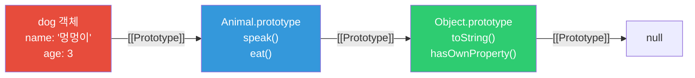
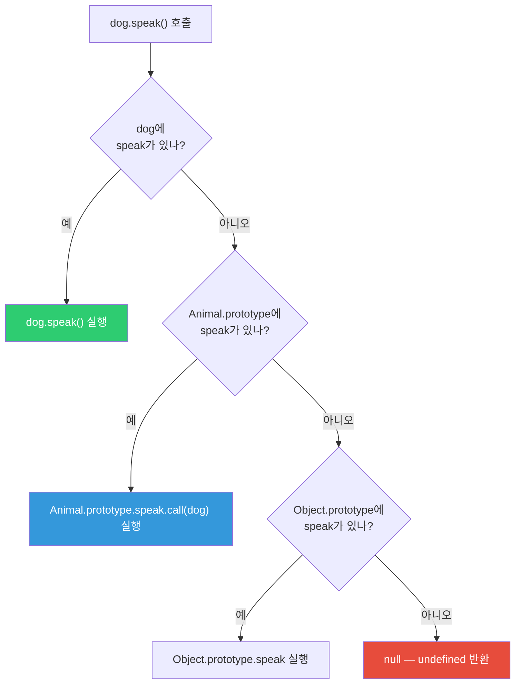
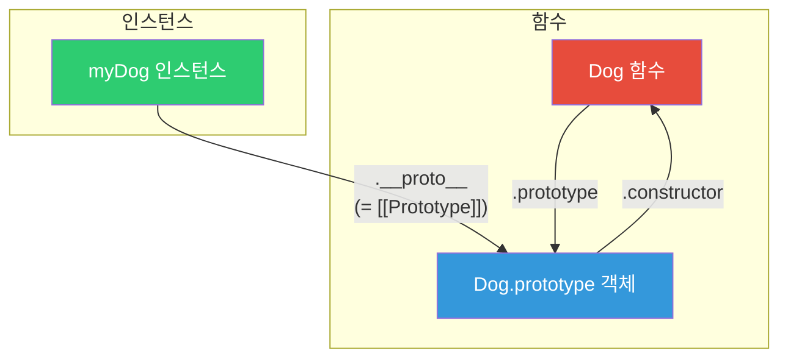
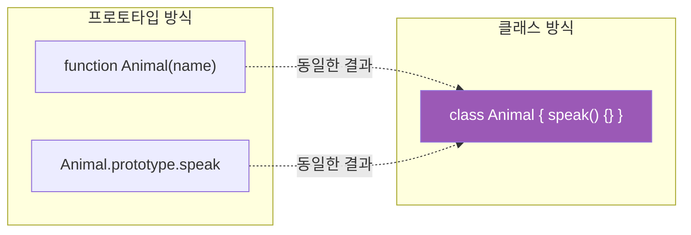
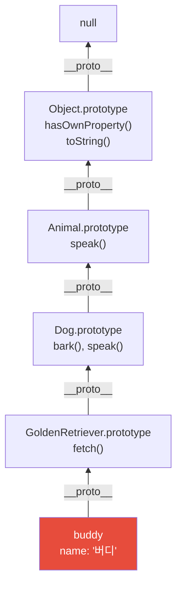

## 가족 레시피 전수

할머니의 김치 레시피가 있습니다. 어머니는 이 레시피를 받아서 자신만의 변형을 추가했고, 딸은 어머니의 레시피를 기반으로 또 다른 변형을 만들었습니다.

딸이 레시피에서 특정 재료를 찾으면:
1. 먼저 **자신의 레시피**에서 찾습니다
2. 없으면 **어머니의 레시피**에서 찾습니다
3. 없으면 **할머니의 레시피**에서 찾습니다
4. 거기도 없으면 "없는 재료"라고 합니다

이것이 **프로토타입 체인**입니다. 자바스크립트의 모든 상속이 이 원리로 동작합니다.

---

## 1. 프로토타입이란?

자바스크립트의 모든 객체는 `[[Prototype]]`이라는 숨겨진 속성을 통해 다른 객체를 가리킵니다. 속성을 찾을 때 자신에게 없으면, 이 체인을 따라 올라가며 찾습니다.



```javascript
const animal = {
  type: '동물',
  eat() {
    console.log(`${this.name}이(가) 먹습니다`);
  }
};

const dog = {
  name: '멍멍이',
  bark() {
    console.log('왈왈!');
  }
};

// dog의 프로토타입을 animal로 설정
Object.setPrototypeOf(dog, animal);

dog.bark();  // '왈왈!' — 자신의 메서드
dog.eat();   // '멍멍이이(가) 먹습니다' — 프로토타입에서 찾음
console.log(dog.type); // '동물' — 프로토타입에서 찾음
```

---

## 2. 프로토타입 체인 탐색 — 어떻게 속성을 찾는가

속성을 찾을 때 체인을 따라 올라갑니다. 찾지 못하면 `undefined`를 반환합니다 (에러가 아닙니다). 단, 함수를 찾지 못하면 호출 시 에러가 납니다.



```javascript
function Animal(name) {
  this.name = name;
}

Animal.prototype.speak = function() {
  console.log(`${this.name}이(가) 소리를 냅니다`);
};

function Dog(name, breed) {
  Animal.call(this, name); // 부모 생성자 호출
  this.breed = breed;
}

// Dog.prototype이 Animal의 인스턴스를 가리키도록 설정
Dog.prototype = Object.create(Animal.prototype);
Dog.prototype.constructor = Dog;

Dog.prototype.bark = function() {
  console.log(`${this.name}: 왈왈!`);
};

const myDog = new Dog('초코', '리트리버');
myDog.bark();   // '초코: 왈왈!' — Dog.prototype에서 찾음
myDog.speak();  // '초코이(가) 소리를 냅니다' — Animal.prototype에서 찾음
myDog.toString(); // '[object Object]' — Object.prototype에서 찾음
```

---

## 3. `__proto__` vs `prototype` — 가장 헷갈리는 부분

이 두 가지는 자바스크립트 입문자가 가장 많이 혼란스러워하는 개념입니다.

- **`prototype`**: 함수(생성자)의 속성. "new로 만들어질 인스턴스의 `[[Prototype]]`이 될 객체"를 가리킵니다.
- **`__proto__`**: 인스턴스(객체)의 속성. 실제 프로토타입 체인, 즉 `[[Prototype]]`에 접근하는 방법입니다.

> 비유: `prototype`은 설계도 창고("이 공장에서 만들어지는 제품은 이 부품들을 갖게 된다"), `__proto__`는 실제 제품이 갖고 있는 "원본 설계도 링크"입니다.



```javascript
function Dog(name) {
  this.name = name;
}

const myDog = new Dog('초코');

// prototype: 함수의 속성
console.log(Dog.prototype); // { constructor: Dog }

// __proto__: 인스턴스의 속성 (실제 프로토타입 체인)
console.log(myDog.__proto__); // { constructor: Dog }

// 두 개는 같은 객체를 가리킴
console.log(myDog.__proto__ === Dog.prototype); // true

// 더 안전한 현대적 접근법 (권장)
console.log(Object.getPrototypeOf(myDog) === Dog.prototype); // true
```

`__proto__`는 표준이 되긴 했지만, 직접 사용보다 `Object.getPrototypeOf()`를 쓰는 것이 권장됩니다.

---

## 4. Object.create() — 프로토타입을 명시적으로 설정

`Object.create(proto)`는 `proto`를 프로토타입으로 하는 새 객체를 만듭니다. `new` 키워드 없이도 프로토타입 기반 상속을 구현할 수 있습니다.

```javascript
const vehicle = {
  type: '탈것',
  describe() {
    return `${this.name}은 ${this.type}입니다`;
  }
};

const car = Object.create(vehicle);
car.name = '소나타';
car.type = '자동차';

console.log(car.describe()); // '소나타은 자동차입니다'
console.log(Object.getPrototypeOf(car) === vehicle); // true

// null 프로토타입 — 완전히 빈 순수 해시맵
const pureObject = Object.create(null);
// toString, hasOwnProperty 등이 없는 순수한 키-값 저장소
pureObject.key = 'value';
// pureObject.toString(); // TypeError! — Object.prototype 메서드 없음
```

`Object.create(null)`은 프로토타입 오염 공격을 방어할 때 유용합니다. 어떤 상속된 속성도 없는 순수한 맵이 됩니다.

---

## 5. ES6 Class — 프로토타입의 문법적 설탕

`class` 문법은 프로토타입 기반을 더 읽기 쉽게 표현한 것입니다. 내부 동작은 완전히 동일합니다.

> 비유: 아파트 설계도를 손으로 그리는 것(ES5 프로토타입)과 CAD 프로그램으로 그리는 것(ES6 class)의 차이입니다. 결과물인 아파트(객체)는 같습니다.



```javascript
// ES5 프로토타입 방식
function Animal(name) {
  this.name = name;
}
Animal.prototype.speak = function() {
  console.log(`${this.name}: 소리`);
};

// ES6 클래스 방식 (위와 완전히 동일한 동작)
class Animal {
  constructor(name) {
    this.name = name;
  }

  speak() {
    console.log(`${this.name}: 소리`);
  }

  static create(name) {
    return new Animal(name);
  }
}

// 클래스도 결국 함수입니다
console.log(typeof Animal); // 'function'
console.log(Animal.prototype); // { constructor: Animal, speak: [Function] }
```

---

## 6. ES6 클래스 상속 — extends와 super

```javascript
class Animal {
  constructor(name) {
    this.name = name;
  }

  speak() {
    return `${this.name} speaks`;
  }
}

class Dog extends Animal {
  constructor(name, breed) {
    super(name); // 반드시 먼저 호출 — Animal의 constructor 실행
    this.breed = breed;
  }

  bark() {
    return `${this.name} barks!`;
  }

  // 메서드 오버라이드 — 부모 메서드를 덮어씀
  speak() {
    return `${super.speak()} (woof!)`; // 부모 메서드도 호출 가능
  }
}

class GoldenRetriever extends Dog {
  constructor(name) {
    super(name, 'Golden Retriever');
  }

  fetch() {
    return `${this.name} fetches!`;
  }
}

const buddy = new GoldenRetriever('버디');
console.log(buddy.fetch()); // '버디 fetches!'
console.log(buddy.bark());  // '버디 barks!'
console.log(buddy.speak()); // '버디 speaks (woof!)'
console.log(buddy instanceof GoldenRetriever); // true
console.log(buddy instanceof Dog);             // true
console.log(buddy instanceof Animal);          // true
```

`super()`를 constructor 안에서 가장 먼저 호출해야 하는 이유가 있습니다. 부모 클래스가 `this`를 초기화하기 전에는 자식 클래스에서 `this`에 접근할 수 없습니다. `super()` 호출 이전에 `this`를 쓰면 ReferenceError가 납니다.

### 프로토타입 체인 시각화



---

## 7. 믹스인 패턴 — 다중 상속의 대안

자바스크립트는 단일 상속만 지원합니다. 여러 기능을 조합하고 싶을 때는 믹스인을 사용합니다.

> 비유: 레고 블록처럼 생각하세요. 기본 몸통(클래스)에 원하는 블록(믹스인)을 붙여서 기능을 조합합니다. extends는 한 번만 쓸 수 있지만, 믹스인은 여러 개 붙일 수 있습니다.

```javascript
const Serializable = {
  serialize() {
    return JSON.stringify(this);
  },
  deserialize(data) {
    return Object.assign(this, JSON.parse(data));
  }
};

const Validatable = {
  validate() {
    return Object.keys(this).every(key => this[key] !== null);
  }
};

const Loggable = {
  log() {
    console.log(`[${this.constructor.name}]`, JSON.stringify(this));
  }
};

class User {
  constructor(name, email) {
    this.name = name;
    this.email = email;
  }
}

// 여러 믹스인 한 번에 적용
Object.assign(User.prototype, Serializable, Validatable, Loggable);

const user = new User('홍길동', 'hong@example.com');
user.log();                   // [User] {"name":"홍길동","email":"hong@example.com"}
console.log(user.validate()); // true
```

---

## 8. hasOwnProperty vs in 연산자 — 어디서 찾느냐의 차이

```javascript
function Person(name) {
  this.name = name;
}
Person.prototype.greet = function() {
  return `Hi, I'm ${this.name}`;
};

const person = new Person('홍길동');

// in: 프로토타입 체인 전체 검색
console.log('name' in person);   // true (own 속성)
console.log('greet' in person);  // true (prototype 속성)
console.log('age' in person);    // false

// hasOwnProperty: 자신의 속성만 검색
console.log(person.hasOwnProperty('name'));   // true
console.log(person.hasOwnProperty('greet')); // false! prototype 속성

// for...in을 쓸 때는 반드시 hasOwnProperty로 필터링하세요
for (const key in person) {
  if (person.hasOwnProperty(key)) {
    console.log('own:', key); // name만
  } else {
    console.log('inherited:', key); // greet
  }
}

// Object.keys: 자신의 열거 가능한 속성만 (권장)
console.log(Object.keys(person)); // ['name']
```

`for...in`에서 `hasOwnProperty` 체크를 빠뜨리면 프로토타입에서 상속받은 속성까지 순회하게 됩니다. 예상치 못한 동작의 원인이 됩니다.

---

## 9. 프로토타입 오염 공격 — 보안 취약점

프로토타입을 잘못 다루면 보안 취약점이 생깁니다. 실제로 많은 라이브러리에서 발견된 취약점입니다.

```javascript
// 위험! 프로토타입 오염
const payload = JSON.parse('{"__proto__": {"isAdmin": true}}');
Object.assign({}, payload);

const victim = {};
console.log(victim.isAdmin); // true — 오염됨!

// 모든 새 객체가 영향받음
const anotherObj = {};
console.log(anotherObj.isAdmin); // true!
```

왜 이게 위험한가요? 공격자가 API를 통해 `{"__proto__": {"isAdmin": true}}`같은 데이터를 보내면, 서버의 모든 객체에 `isAdmin: true`가 주입될 수 있습니다.

```javascript
// 방어 방법 1: 위험한 키 필터링
function safeMerge(target, source) {
  for (const key of Object.keys(source)) {
    if (key === '__proto__' || key === 'constructor' || key === 'prototype') {
      continue; // 위험한 키 무시
    }
    target[key] = source[key];
  }
  return target;
}

// 방어 방법 2: Object.create(null) 사용
const safe = Object.create(null);
// __proto__가 없어 오염 불가
```

---

<details class="extreme-scenario-details">
<summary class="extreme-scenario-summary">
<span class="extreme-scenario-icon">🔥</span>
<span class="extreme-scenario-label">극한 시나리오 — 클릭하여 펼치기</span>
<span class="extreme-scenario-toggle"></span>
</summary>
<div class="extreme-scenario-body">

<div class="extreme-scenario-content" markdown="1">

```javascript
function Animal() {}
Animal.prototype.speak = function() {
  return 'generic sound';
};

const dog = new Animal();
const cat = new Animal();

console.log(dog.speak()); // 'generic sound'

// 프로토타입 메서드 변경 — 기존 인스턴스 모두 영향받음!
Animal.prototype.speak = function() {
  return 'new sound!';
};

console.log(dog.speak()); // 'new sound!' — 기존 인스턴스도 영향받음
console.log(cat.speak()); // 'new sound!'
```

이 동작이 왜 중요한가요? 라이브러리가 이미 만들어진 인스턴스에 새 기능을 추가할 때 활용됩니다. 하지만 내장 프로토타입을 수정하는 것은 절대 하면 안 됩니다.

```javascript
// 절대 금지 — 내장 프로토타입 수정
Array.prototype.first = function() {
  return this[0];
};

[1, 2, 3].first(); // 1 — 동작하지만...
// 다른 라이브러리와 충돌 가능
// 미래 ECMAScript 표준과 충돌 가능
// 팀원이 예상치 못한 동작에 혼란
```

---
</div>
</div>
</details>

## 정리 — 프로토타입 핵심 개념

```mermaid
mindmap
  root((프로토타입))
    기본 개념
      모든 객체는 프로토타입 보유
      체인을 따라 속성 탐색
      null이 체인의 끝
    주요 API
      Object.create()
      Object.getPrototypeOf()
      hasOwnProperty()
    클래스와의 관계
      class는 문법적 설탕
      내부는 프로토타입 기반
      extends로 상속
    주의사항
      프로토타입 오염
      내장 프로토타입 수정 금지
      체인 길이 성능 영향
```

프로토타입은 자바스크립트의 근본 메커니즘입니다. ES6 클래스 문법을 사용하더라도 내부적으로는 프로토타입이 동작합니다. 이를 이해하면 `instanceof`가 어떻게 동작하는지, 메서드를 prototype에 정의하는 것이 왜 성능상 좋은지, 그리고 보안 취약점을 어떻게 방어하는지까지 모두 연결됩니다.
