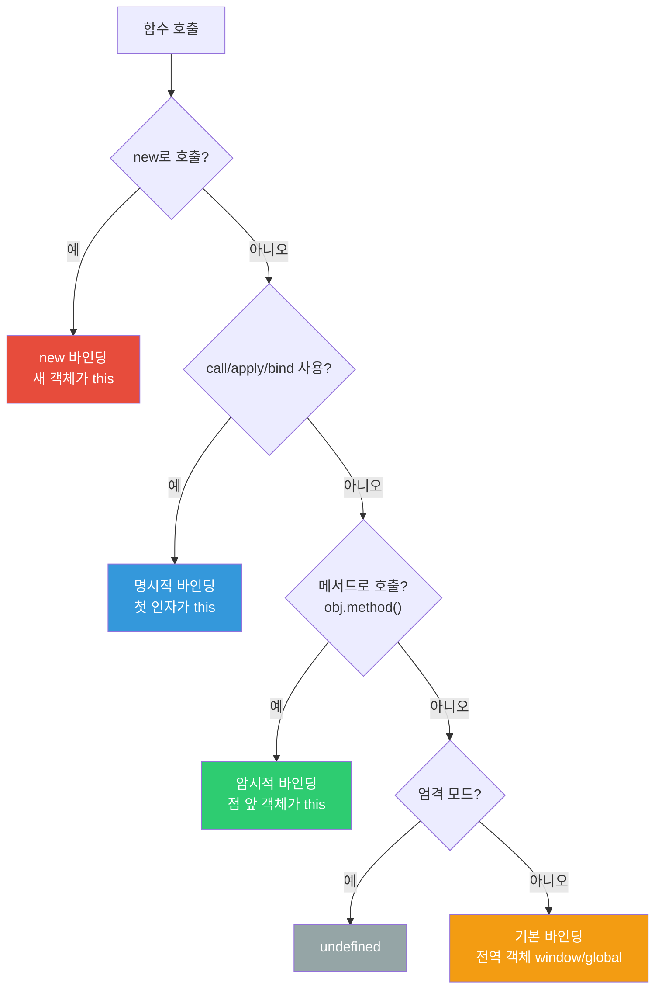
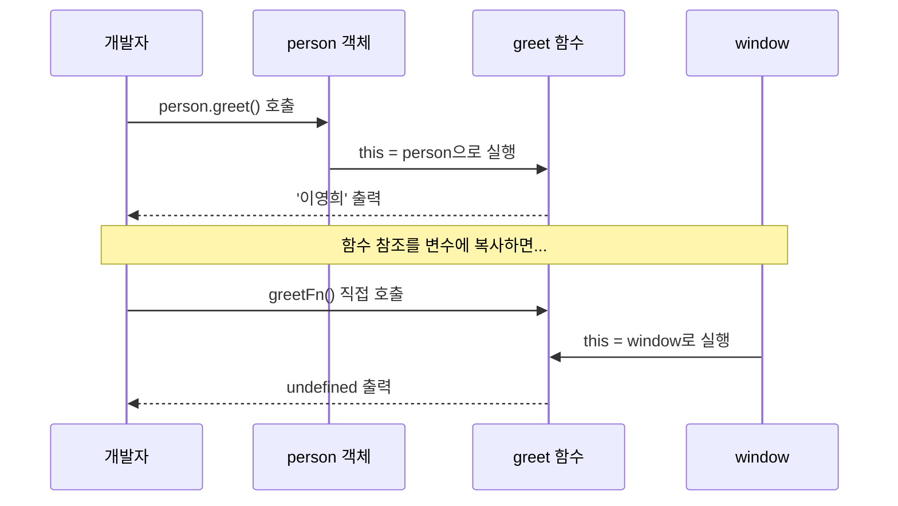
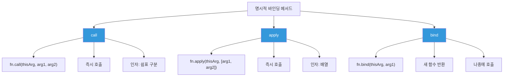
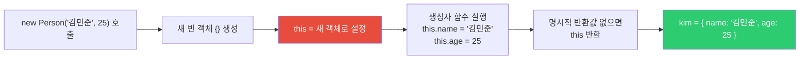
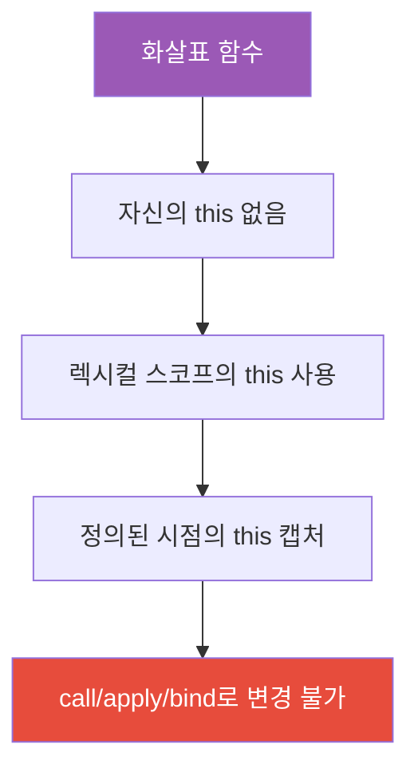
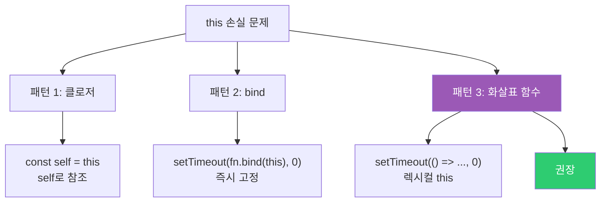

## 맥락에 따라 달라지는 "나"

회사 동료에게 "저 분이 누구예요?"라고 물으면 "우리 팀 시니어 개발자요"라고 답하겠지만, 고향 친구 모임에서 같은 질문을 받으면 "내 고등학교 동창이야"라고 답합니다. 동일한 사람을 가리키는데, **어디서 어떻게 물어보느냐에 따라 답이 달라지는 것**입니다.

자바스크립트의 `this`가 정확히 이 방식으로 동작합니다. 동일한 함수 코드라도, **어디서 어떻게 호출했느냐에 따라 `this`가 가리키는 대상이 완전히 달라집니다.** 이것이 자바스크립트를 처음 배울 때 가장 혼란스러운 개념 중 하나인 이유입니다.

> 비유: 명함에는 "김개발"이라고만 써 있습니다. 회사에서 받으면 "개발팀 팀장"이고, 운동 동호회에서 받으면 "농구 주장"입니다. 명함(함수 코드)은 같은데 맥락(호출 방식)이 `this`를 결정합니다.

---

## 1번 다이어그램 - this 바인딩 결정 전체 지도



이 다이어그램이 `this`의 모든 진실입니다. 복잡해 보이지만, **위에서 아래로 순서대로 적용**하는 단순한 규칙입니다. `this`가 헷갈릴 때마다 이 순서도를 따라가면 반드시 답을 찾을 수 있습니다.

| 바인딩 종류 | 우선순위 | 조건 |
|------------|---------|------|
| new 바인딩 | 1 (최고) | `new` 키워드로 함수 호출 |
| 명시적 바인딩 | 2 | `call`, `apply`, `bind` 사용 |
| 암시적 바인딩 | 3 | `obj.method()` 형태로 호출 |
| 기본 바인딩 | 4 (최저) | 일반 함수 호출 |

---

## 2. 기본 바인딩 — 아무도 주인이 없을 때

가장 기본적인 경우입니다. 그냥 함수를 그냥 호출할 때 발동합니다.

> 비유: 길에서 혼자 걷다가 스스로에게 "나 누구야?"라고 물으면, "나는 지구라는 행성의 주민"이라는 아주 포괄적인 대답이 나옵니다. 자바스크립트에서 그 "지구"가 `window` 전역 객체입니다.

```javascript
function showThis() {
  console.log(this);
}

showThis(); // 브라우저: window 객체, Node.js: global 객체
```

왜 전역 객체가 `this`가 될까요? 이유는 자바스크립트에서 전역에서 선언한 모든 것은 사실 전역 객체의 프로퍼티이기 때문입니다. `showThis()`는 사실 `window.showThis()`와 같고, 점 앞의 `window`가 `this`가 됩니다.

### 엄격 모드에서의 차이

```javascript
'use strict';

function showThis() {
  console.log(this); // undefined
}

showThis();
```

엄격 모드에서는 기본 바인딩이 `window`가 아닌 `undefined`가 됩니다. 왜냐하면 `'use strict'`는 "암묵적으로 전역을 가정하는 위험한 동작을 막겠다"는 선언이기 때문입니다. 만약 이걸 모르면 엄격 모드에서 `this.name`에 접근할 때 `TypeError: Cannot read properties of undefined`가 왜 뜨는지 이해할 수 없습니다.

### 중첩 함수에서의 함정 — 가장 흔한 버그

```javascript
const person = {
  name: '김철수',
  greet() {
    console.log(this.name); // '김철수' — 메서드 호출이므로 OK

    function inner() {
      console.log(this.name); // undefined! — 기본 바인딩 적용
    }
    inner(); // 주의: 메서드가 아닌 일반 함수 호출
  }
};

person.greet();
```

> 비유: 팀장(greet)이 팀원(inner)을 불러서 업무를 지시하는데, 팀원은 "나는 누구 소속이지?"를 모릅니다. 왜냐하면 팀장이 팀원에게 정식으로 임명장을 주지 않고 구두로 부탁했기 때문입니다. 이것이 바로 `this` 손실입니다.

만약 이걸 안 하면? `inner()` 안에서 `this.name`을 쓰면 `undefined`가 나오고, `this.someMethod()`를 호출하면 `TypeError`가 발생합니다. 오래된 코드베이스에서 자주 발생하는 버그입니다.

---

## 3. 암시적 바인딩 — 점(.） 앞이 주인

점(`.`) 앞에 있는 객체가 `this`가 됩니다. 가장 직관적인 규칙입니다.

```javascript
const person = {
  name: '이영희',
  greet() {
    console.log(`안녕하세요, ${this.name}입니다`);
  }
};

person.greet(); // '안녕하세요, 이영희입니다' — person이 this
```

> 비유: `person.greet()`는 "person이라는 사람에게 greet를 시켜라"입니다. 그러니 greet 안에서 `this`는 당연히 그 사람, 즉 `person`입니다.

### 암시적 바인딩 손실 — 가장 흔한 버그

여기서 가장 중요하고 가장 많이 실수하는 부분이 나옵니다.

```javascript
const person = {
  name: '이영희',
  greet() {
    console.log(`안녕하세요, ${this.name}입니다`);
  }
};

// 함수를 변수에 할당하면 바인딩이 사라집니다!
const greetFn = person.greet;
greetFn(); // '안녕하세요, undefined입니다' — window가 this
```

왜 이런 일이 생길까요? `person.greet`를 변수에 담는 순간, 그것은 더 이상 "person의 greet"가 아니라 그냥 "greet 함수"입니다. 누구의 소속도 아닌 함수를 호출하면 기본 바인딩이 적용됩니다.



### 콜백으로 전달할 때의 함정

```javascript
const button = {
  label: '클릭',
  handleClick() {
    console.log(this.label); // undefined! button 객체가 아님
  }
};

// 이벤트 리스너에 메서드 전달 — 바인딩 손실
document.getElementById('btn').addEventListener('click', button.handleClick);
// button.handleClick이 addEventListener에 의해 일반 함수로 호출됨
// this는 이벤트 타깃(버튼 DOM 요소)가 됨
```

이것을 모르면 React 클래스 컴포넌트나 일반 이벤트 핸들러에서 `this`가 왜 예상과 다른지 이해할 수 없습니다.

---

## 4. 명시적 바인딩 — 내가 직접 지정

`call`, `apply`, `bind`로 `this`를 직접 지정합니다. "이 함수를 실행할 때 `this`는 반드시 이것이어야 해"라고 강제하는 방식입니다.

> 비유: 임시직 직원(함수)을 여러 팀에 파견할 때, "오늘은 개발팀 소속으로 일해"(call), "내일은 디자인팀으로"(apply/bind)처럼 소속을 직접 지정합니다.

### call() — 즉시 호출, 인자를 쉼표로 전달

```javascript
function introduce(job, city) {
  console.log(`저는 ${this.name}, ${job}, ${city} 거주입니다`);
}

const person = { name: '박지민' };

introduce.call(person, '개발자', '서울');
// '저는 박지민, 개발자, 서울 거주입니다'
```

### apply() — 즉시 호출, 인자를 배열로 전달

```javascript
introduce.apply(person, ['디자이너', '부산']);
// '저는 박지민, 디자이너, 부산 거주입니다'
```

`call`과 `apply`의 차이는 단순히 인자 전달 방식뿐입니다. 배열 형태로 이미 가지고 있다면 `apply`가 편하고, 개별 인자라면 `call`이 편합니다.

### bind() — 새 함수 반환, 즉시 호출 안 함

```javascript
const boundIntroduce = introduce.bind(person, '기획자');
// 나중에 호출
boundIntroduce('대전');
// '저는 박지민, 기획자, 대전 거주입니다'
```

`bind`는 즉시 실행하지 않고 **`this`가 영구적으로 고정된 새 함수를 반환**합니다. 이 함수는 나중에 아무리 다른 방식으로 호출해도 `this`가 바뀌지 않습니다.



### 실용적인 예제

```javascript
// 유사 배열 객체에 배열 메서드 사용 (구형 코드에서 자주 보임)
function sum() {
  // arguments는 배열처럼 생겼지만 배열이 아닙니다
  const args = Array.prototype.slice.call(arguments);
  return args.reduce((a, b) => a + b, 0);
}

console.log(sum(1, 2, 3, 4, 5)); // 15

// Math.max로 배열 최댓값 구하기
const numbers = [3, 1, 4, 1, 5, 9, 2, 6];
const max = Math.max.apply(null, numbers); // 9
// ES6 이후: Math.max(...numbers)로 더 간단하게
```

---

## 5. new 바인딩 — 새로 태어나는 객체

`new` 키워드로 함수를 호출하면 새 객체가 `this`가 됩니다. 이것이 가장 높은 우선순위를 가집니다.

> 비유: 공장에서 제품을 생산할 때(new), 새로 만들어진 제품 자체가 "나"(this)가 됩니다. 설계도(함수)는 같아도, 생산된 제품(인스턴스)은 각자 독립적입니다.

```javascript
function Person(name, age) {
  // new로 호출하면 자바스크립트가 내부적으로:
  // 1. 새 빈 객체 {} 생성
  // 2. this = 새 객체로 설정
  this.name = name;
  this.age = age;
  // 3. 명시적 반환값이 없으면 this 반환
}

const kim = new Person('김민준', 25);
console.log(kim.name); // '김민준'
```



### 만약 new를 빠뜨리면?

```javascript
function Counter(start) {
  this.count = start;
}

// new로 호출 — 올바른 사용
const counter1 = new Counter(0);
console.log(counter1.count); // 0

// new 없이 일반 호출 — 전역이 오염됩니다!
const counter2 = Counter(0); // undefined 반환
console.log(window.count); // 0 — window.count가 생겨버림!
```

이것을 모르면 왜 전역 변수가 갑자기 생기는지 이해할 수 없습니다. `new`를 빠뜨리면 `this`가 `window`가 되어 전역 오염이 발생합니다.

---

## 6. 화살표 함수 — 완전히 다른 세계

화살표 함수는 앞서 설명한 4가지 규칙을 전혀 따르지 않습니다. 화살표 함수에는 **자신만의 `this`가 없습니다.** 대신 **정의된 시점의 바깥 스코프 `this`를 그대로 사용**합니다.

> 비유: 일반 함수는 "내가 어디서 불렸느냐"에 따라 정체가 결정되는 용병입니다. 반면 화살표 함수는 "내가 어디서 태어났느냐"에 충성하는 세습 신하입니다. 태어난 순간의 주인(this)이 영구히 고정됩니다.



```javascript
const person = {
  name: '최수영',
  greetLater() {
    // 일반 함수: 콜백으로 전달되면 this를 잃어버림
    setTimeout(function() {
      console.log(this.name); // undefined
    }, 1000);

    // 화살표 함수: 바깥(greetLater)의 this를 그대로 캡처
    setTimeout(() => {
      console.log(this.name); // '최수영'
    }, 1000);
  }
};

person.greetLater();
```

왜 화살표 함수가 이렇게 동작할까요? 이유는 콜백 안에서 `this`를 잃어버리는 문제가 너무 자주 발생했기 때문입니다. 화살표 함수는 그 문제를 해결하기 위해 설계된 문법입니다.

### 화살표 함수를 쓰면 안 되는 곳

```javascript
const obj = {
  name: '테스트',

  // 잘못된 사용: 메서드로 화살표 함수 사용
  greet: () => {
    console.log(this.name); // undefined — 전역 this를 캡처함
  },

  // 올바른 사용: 메서드는 일반 함수
  greetCorrect() {
    console.log(this.name); // '테스트'
  }
};

// 이벤트 핸들러에서도 주의
button.addEventListener('click', () => {
  console.log(this); // window — 이벤트 타깃이 아님
});

button.addEventListener('click', function() {
  console.log(this); // button — 올바른 이벤트 타깃
});
```

> 비유: 화살표 함수는 세습 신하이기 때문에, 새 주인(객체)을 섬기는 메서드로는 어울리지 않습니다. 메서드는 객체에 속해야 하므로 일반 함수를 사용해야 합니다.

---

## 7. 이벤트 핸들러에서의 this

이벤트 핸들러에서 `this`는 특별한 규칙이 있습니다. addEventListener로 등록된 핸들러에서 `this`는 이벤트가 발생한 DOM 요소가 됩니다.

```javascript
const handler = {
  prefix: '[공지]',

  handleClick: function(event) {
    console.log(this);        // <button> DOM 요소 — handler 객체가 아님!
    console.log(this.prefix); // undefined
  }
};

const button = document.getElementById('btn');

// 문제: this가 button DOM 요소가 됨
button.addEventListener('click', handler.handleClick);

// 해결 1: bind 사용
button.addEventListener('click', handler.handleClick.bind(handler));

// 해결 2: 화살표 함수 래퍼
button.addEventListener('click', (e) => handler.handleClick(e));

// 해결 3: 클래스 필드 화살표 함수 (React 클래스 컴포넌트 방식)
class MyComponent {
  prefix = '[공지]';

  handleClick = () => {
    console.log(this.prefix); // 항상 '[공지]' — 화살표 함수이므로 this 고정
  };
}
```

---

## 8. 클래스에서의 this

ES6 클래스에서의 `this`는 인스턴스를 가리킵니다. 단, **클래스는 자동으로 엄격 모드**이므로 바인딩이 손실되면 `undefined`가 됩니다.

```javascript
class Animal {
  constructor(name) {
    this.name = name;
  }

  speak() {
    console.log(`${this.name}이(가) 소리를 냅니다`);
  }
}

class Dog extends Animal {
  speak() {
    super.speak();
    console.log(`${this.name}: 왈왈!`);
  }
}

const dog = new Dog('멍멍이');
dog.speak();
// '멍멍이이(가) 소리를 냅니다'
// '멍멍이: 왈왈!'

// 바인딩 손실 주의!
const speak = dog.speak;
speak(); // TypeError: Cannot read properties of undefined
         // 클래스는 엄격 모드 → this = undefined
```

이것을 모르면 React 클래스 컴포넌트에서 이벤트 핸들러를 등록할 때 왜 `this.setState is not a function` 에러가 나는지 이해할 수 없습니다.

---

## 9. React 클래스 컴포넌트에서의 this 바인딩 문제

클래스형 컴포넌트를 사용하던 시절 가장 흔한 실수였습니다. 현재는 함수형 컴포넌트가 표준이지만, 레거시 코드를 읽으려면 반드시 알아야 합니다.

```javascript
class MyComponent extends React.Component {
  constructor(props) {
    super(props);
    this.state = { count: 0 };

    // 방법 1: constructor에서 bind
    this.handleClick1 = this.handleClick1.bind(this);
  }

  handleClick1() {
    // bind 하지 않으면 this가 undefined (클래스는 엄격 모드)
    this.setState({ count: this.state.count + 1 });
  }

  // 방법 2: 화살표 함수 클래스 필드 (가장 권장)
  handleClick2 = () => {
    this.setState({ count: this.state.count + 1 });
  };

  render() {
    return (
      <div>
        <button onClick={this.handleClick1}>클릭1 (bind)</button>
        <button onClick={this.handleClick2}>클릭2 (화살표)</button>
        {/* 방법 3: 인라인 화살표 — 매 렌더링마다 새 함수 생성 (성능상 비권장) */}
        <button onClick={() => this.setState({ count: this.state.count + 1 })}>
          클릭3 (인라인)
        </button>
      </div>
    );
  }
}
```

---

## 2번 다이어그램 - this 고정하는 3가지 패턴

`this` 손실 문제를 해결하는 세 가지 방법을 비교합니다.



```javascript
const service = {
  baseUrl: 'https://api.example.com',

  // 패턴 1: 클로저로 this 보존 (구식 방법)
  fetchData_closure() {
    const self = this; // this를 변수에 저장
    setTimeout(function() {
      console.log(self.baseUrl); // self 참조
    }, 1000);
  },

  // 패턴 2: bind 사용
  fetchData_bind() {
    setTimeout(function() {
      console.log(this.baseUrl);
    }.bind(this), 1000);
  },

  // 패턴 3: 화살표 함수 (권장)
  fetchData_arrow() {
    setTimeout(() => {
      console.log(this.baseUrl); // 렉시컬 this — 깔끔
    }, 1000);
  }
};
```

---

## 10. this 디버깅 — 실전 퀴즈

직접 예측해 보세요.

### 퀴즈 1

```javascript
var name = '전역';

const obj = {
  name: '객체',
  arr: [1, 2, 3],

  printNames() {
    this.arr.forEach(function(item) {
      console.log(this.name, item); // ??
    });

    this.arr.forEach((item) => {
      console.log(this.name, item); // ??
    });
  }
};

obj.printNames();
```

정답:
- 일반 함수 forEach 콜백: `전역 1`, `전역 2`, `전역 3` (this = window)
- 화살표 함수 forEach 콜백: `객체 1`, `객체 2`, `객체 3` (this = obj)

왜냐하면 일반 함수는 forEach에 의해 일반 호출되므로 기본 바인딩(window)이 적용되고, 화살표 함수는 `printNames` 메서드의 렉시컬 `this`인 `obj`를 캡처하기 때문입니다.

### 퀴즈 2

```javascript
function makeAdder(x) {
  return function(y) {
    return x + y;
  };
}

const add5 = makeAdder(5);

const calculator = {
  value: 100,
  add5: add5,

  addToValue(n) {
    return this.value + n;
  }
};

console.log(calculator.add5(3));       // ??
console.log(calculator.addToValue(3)); // ??
```

정답:
- `calculator.add5(3)`: `8` — 클로저로 `x=5`를 기억, `this`와 무관
- `calculator.addToValue(3)`: `103` — `this = calculator`, `value = 100`

---

## 11번 다이어그램 - this 결정 최종 알고리즘


이 5단계 체크리스트만 있으면 어떤 `this` 문제도 해결할 수 있습니다.

1. **화살표 함수**: 정의된 곳의 `this`를 그대로 사용 (변경 불가)
2. **new**: 새 객체가 `this`
3. **call/apply/bind**: 내가 지정한 것이 `this`
4. **obj.fn()**: obj가 `this`
5. **fn()**: window (엄격 모드: undefined)

`this`가 헷갈릴 때마다 위 순서대로 체크해 보세요. "이 함수가 화살표 함수인가? → new인가? → call/apply/bind인가? → 점 앞에 뭔가 있나? → 없으면 전역" — 이 5개 질문으로 반드시 답을 찾을 수 있습니다.
