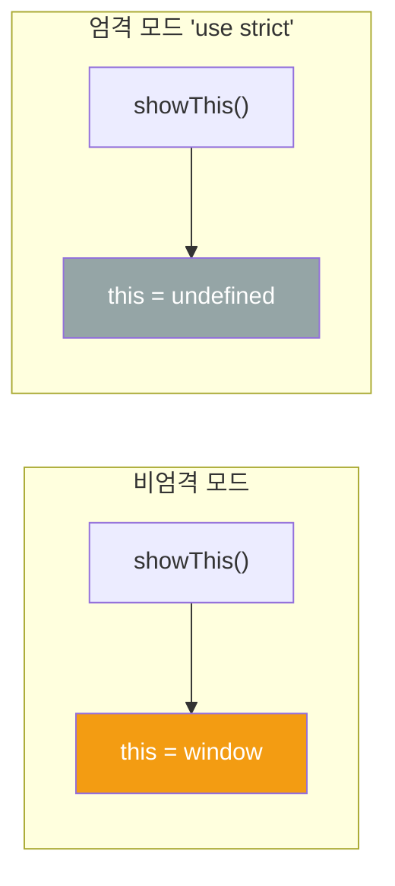
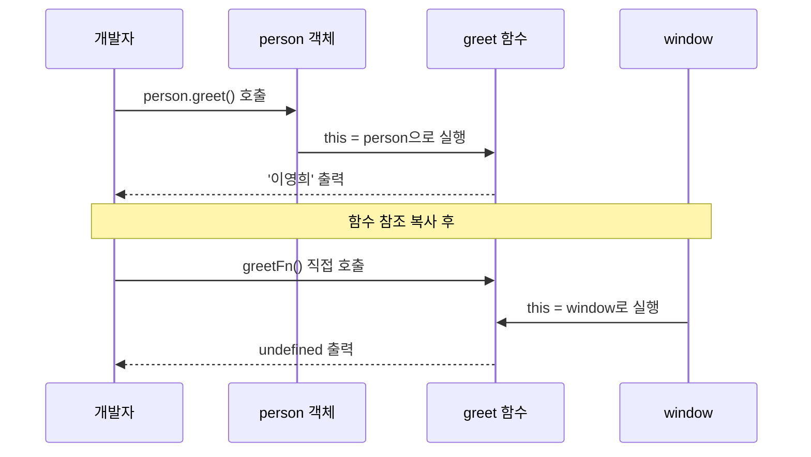
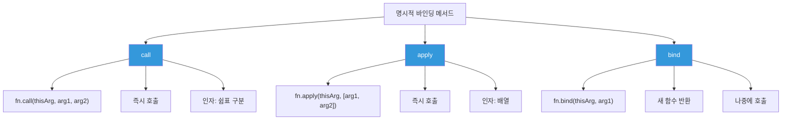
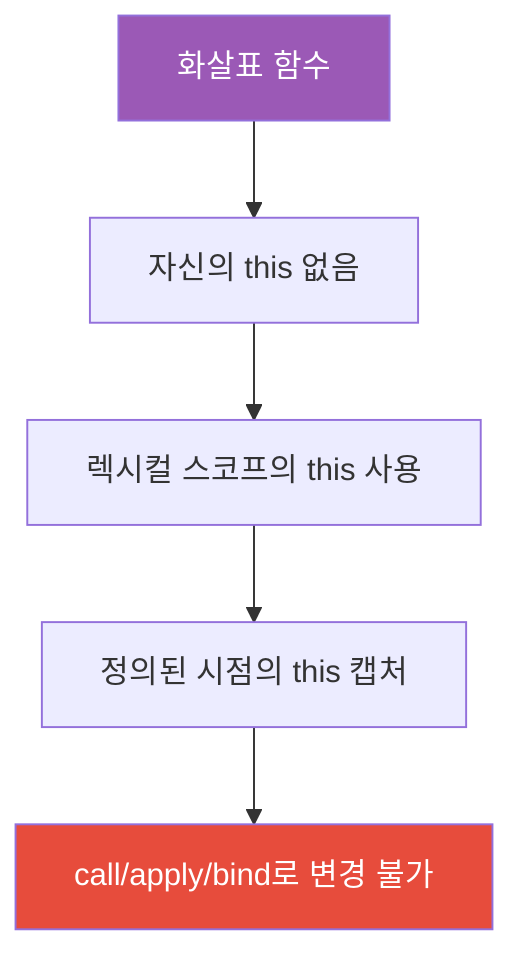
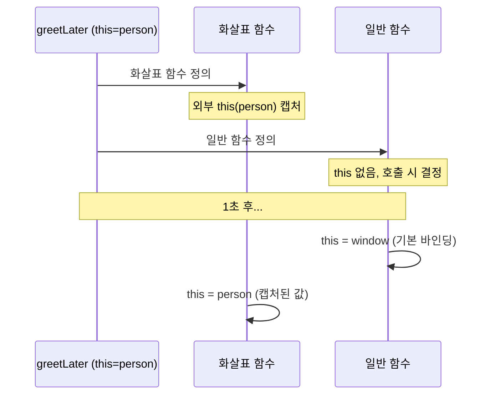
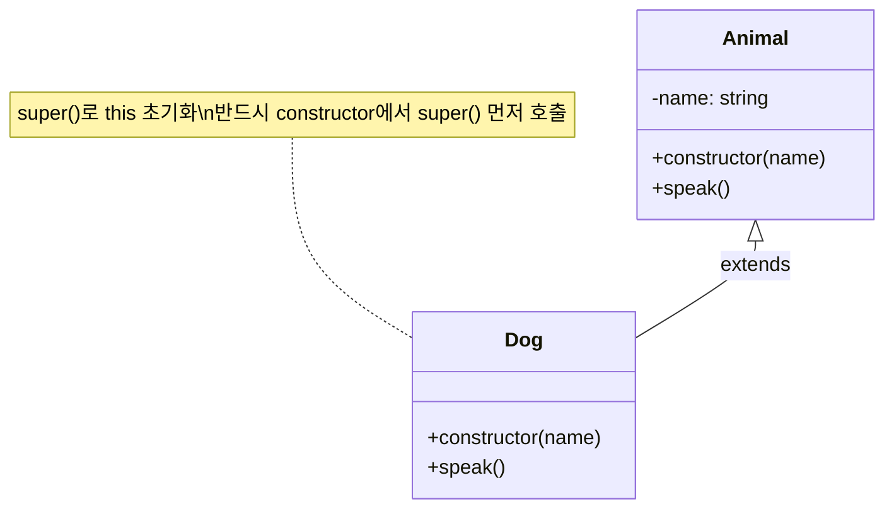
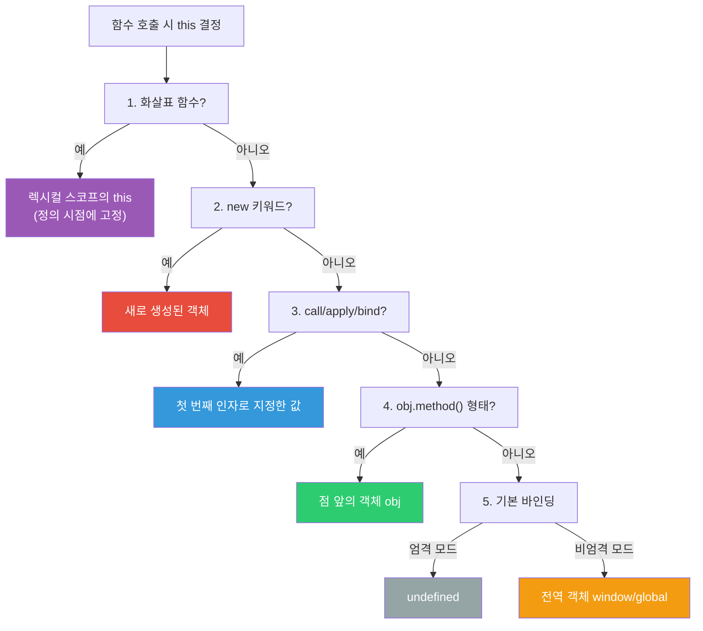

## 명함을 건네는 상황

회사 회식에서 누군가가 "저 사람이 누구예요?"라고 물으면, 대답은 **맥락에 따라** 달라집니다.

- 회사에서 물으면: "우리 팀 개발자요"
- 동창 모임에서 물으면: "내 고등학교 친구야"
- 가족 모임에서 물으면: "내 사촌이에요"

**`this`도 마찬가지입니다.** 동일한 코드라도 **어디서, 어떻게 호출되느냐**에 따라 `this`가 가리키는 대상이 완전히 달라집니다. 이것이 자바스크립트 초보자들이 가장 많이 혼란스러워하는 부분입니다.

---

## 1. this 바인딩 결정 규칙 전체 지도

```mermaid
flowchart TD
    A[함수 호출] --> B{new로 호출?}
    B -->|예| C[new 바인딩<br/>새 객체가 this]
    B -->|아니오| D{call/apply/bind 사용?}
    D -->|예| E[명시적 바인딩<br/>첫 인자가 this]
    D -->|아니오| F{메서드로 호출?<br/>obj.method()]
    F -->|예| G[암시적 바인딩<br/>점 앞 객체가 this]
    F -->|아니오| H{엄격 모드?}
    H -->|예| I[undefined]
    H -->|아니오| J[기본 바인딩<br/>전역 객체 window/global]

    style C fill:#e74c3c,color:#fff
    style E fill:#3498db,color:#fff
    style G fill:#2ecc71,color:#fff
    style I fill:#95a5a6,color:#fff
    style J fill:#f39c12,color:#fff
```

| 바인딩 종류 | 우선순위 | 조건 |
|------------|---------|------|
| new 바인딩 | 1 (최고) | `new` 키워드로 함수 호출 |
| 명시적 바인딩 | 2 | `call`, `apply`, `bind` 사용 |
| 암시적 바인딩 | 3 | `obj.method()` 형태로 호출 |
| 기본 바인딩 | 4 (최저) | 일반 함수 호출 |

---

## 2. 기본 바인딩 (Default Binding)

가장 기본적인 경우 - 그냥 함수를 호출할 때.

```javascript
function showThis() {
  console.log(this);
}

showThis(); // 브라우저: window 객체, Node.js: global 객체
```

### 엄격 모드에서의 차이

```javascript
'use strict';

function showThis() {
  console.log(this); // undefined
}

showThis();
```



### 중첩 함수에서의 함정

```javascript
const person = {
  name: '김철수',
  greet() {
    console.log(this.name); // '김철수' - 메서드 호출

    function inner() {
      console.log(this.name); // undefined! - 기본 바인딩 적용
    }
    inner(); // 메서드가 아닌 일반 함수 호출
  }
};

person.greet();
```

---

## 3. 암시적 바인딩 (Implicit Binding)

점(`.`) 앞에 있는 객체가 `this`가 됩니다.

```javascript
const person = {
  name: '이영희',
  greet() {
    console.log(`안녕하세요, ${this.name}입니다`);
  }
};

person.greet(); // '안녕하세요, 이영희입니다' - person이 this
```

### 암시적 바인딩 손실 - 가장 흔한 버그

```javascript
const person = {
  name: '이영희',
  greet() {
    console.log(`안녕하세요, ${this.name}입니다`);
  }
};

// 함수를 변수에 할당하면 바인딩 손실!
const greetFn = person.greet;
greetFn(); // '안녕하세요, undefined입니다' - window가 this
```



### 콜백으로 전달할 때의 함정

```javascript
const button = {
  label: '클릭',
  handleClick() {
    console.log(this.label); // undefined!
  }
};

// 이벤트 리스너에 메서드 전달 - 바인딩 손실
document.getElementById('btn').addEventListener('click', button.handleClick);

// button.handleClick이 addEventListener에 의해 일반 함수로 호출됨
// this는 이벤트 타깃(버튼 DOM 요소)가 됨
```

---

## 4. 명시적 바인딩 (Explicit Binding)

`call`, `apply`, `bind`로 `this`를 직접 지정합니다.

### call() - 즉시 호출, 인자를 쉼표로 전달

```javascript
function introduce(job, city) {
  console.log(`저는 ${this.name}, ${job}, ${city} 거주입니다`);
}

const person = { name: '박지민' };

introduce.call(person, '개발자', '서울');
// '저는 박지민, 개발자, 서울 거주입니다'
```

### apply() - 즉시 호출, 인자를 배열로 전달

```javascript
introduce.apply(person, ['디자이너', '부산']);
// '저는 박지민, 디자이너, 부산 거주입니다'
```

### bind() - 새 함수 반환, 즉시 호출 안 함

```javascript
const boundIntroduce = introduce.bind(person, '기획자');
// 나중에 호출
boundIntroduce('대전');
// '저는 박지민, 기획자, 대전 거주입니다'
```



### call/apply 실용 예제

```javascript
// 유사 배열 객체에 배열 메서드 사용
function sum() {
  // arguments는 배열이 아님
  const args = Array.prototype.slice.call(arguments);
  return args.reduce((a, b) => a + b, 0);
}

console.log(sum(1, 2, 3, 4, 5)); // 15

// Math.max로 배열 최댓값 구하기
const numbers = [3, 1, 4, 1, 5, 9, 2, 6];
const max = Math.max.apply(null, numbers); // 9
// ES6: Math.max(...numbers)
```

---

## 5. new 바인딩 (new Binding)

`new` 키워드로 함수를 호출하면 새 객체가 `this`가 됩니다.

```javascript
function Person(name, age) {
  // 1. 새 빈 객체 생성
  // 2. this = 새 객체
  this.name = name;
  this.age = age;
  // 3. 새 객체 반환
}

const kim = new Person('김민준', 25);
console.log(kim.name); // '김민준'
```

```mermaid
flowchart LR
    A["new Person('김민준', 25) 호출"] --> B[새 빈 객체 {} 생성]
    B --> C["this = 새 객체로 설정"]
    C --> D["생성자 함수 실행<br/>this.name = '김민준'<br/>this.age = 25"]
    D --> E["명시적 반환값이 없으면<br/>this 반환"]
    E --> F["kim = { name: '김민준', age: 25 }"]

    style C fill:#e74c3c,color:#fff
    style F fill:#2ecc71,color:#fff
```

### new와 일반 호출 비교

```javascript
function Counter(start) {
  this.count = start;
  this.increment = function() {
    this.count++;
  };
}

// new로 호출 - 올바른 사용
const counter1 = new Counter(0);
counter1.increment();
console.log(counter1.count); // 1

// 일반 호출 - 전역 오염
const counter2 = Counter(0); // undefined 반환
console.log(window.count); // 0 - 전역이 오염됨!
```

---

## 6. 화살표 함수 (Arrow Function)의 this

화살표 함수는 완전히 다른 규칙을 따릅니다.



```javascript
const person = {
  name: '최수영',
  greetLater() {
    // 일반 함수: this를 잃어버림
    setTimeout(function() {
      console.log(this.name); // undefined
    }, 1000);

    // 화살표 함수: 외부의 this를 그대로 사용
    setTimeout(() => {
      console.log(this.name); // '최수영'
    }, 1000);
  }
};

person.greetLater();
```

### 화살표 함수 this 렉시컬 바인딩 시각화



### 화살표 함수를 쓰면 안 되는 곳

```javascript
const obj = {
  name: '테스트',

  // 잘못된 사용: 메서드로 화살표 함수 사용
  greet: () => {
    console.log(this.name); // undefined - 전역 this 캡처
  },

  // 올바른 사용: 메서드는 일반 함수
  greetCorrect() {
    console.log(this.name); // '테스트'
  }
};

// 이벤트 핸들러에서도 주의
button.addEventListener('click', () => {
  console.log(this); // window - 이벤트 타깃이 아님
});

button.addEventListener('click', function() {
  console.log(this); // button - 올바른 이벤트 타깃
});
```

---

## 7. 이벤트 핸들러에서의 this

```javascript
const handler = {
  prefix: '[공지]',

  handleClick: function(event) {
    // 이벤트 핸들러로 등록 시 this = 이벤트 타깃 (button)
    console.log(this); // <button> DOM 요소
    console.log(this.prefix); // undefined - handler 객체가 아님!
  },

  handleClickBound: function(event) {
    console.log(this.prefix); // '[공지]'
  }
};

const button = document.getElementById('btn');

// 문제: this가 button DOM이 됨
button.addEventListener('click', handler.handleClick);

// 해결 1: bind 사용
button.addEventListener('click', handler.handleClickBound.bind(handler));

// 해결 2: 화살표 함수 래퍼
button.addEventListener('click', (e) => handler.handleClick(e));

// 해결 3: 클래스 필드 화살표 함수 (React 방식)
class MyComponent {
  prefix = '[공지]';

  handleClick = () => {
    console.log(this.prefix); // 항상 '[공지]'
  };
}
```

---

## 8. 클래스에서의 this

```javascript
class Animal {
  constructor(name) {
    this.name = name;
  }

  speak() {
    console.log(`${this.name}이(가) 소리를 냅니다`);
  }
}

class Dog extends Animal {
  constructor(name) {
    super(name); // 부모 생성자 호출, this 초기화
  }

  speak() {
    super.speak(); // 부모 메서드 호출
    console.log(`${this.name}: 왈왈!`);
  }
}

const dog = new Dog('멍멍이');
dog.speak();
// '멍멍이이(가) 소리를 냅니다'
// '멍멍이: 왈왈!'

// 바인딩 손실 주의
const speak = dog.speak;
speak(); // TypeError in strict mode (클래스는 자동으로 엄격 모드)
```



---

## 9. React에서의 this 바인딩 문제

클래스형 컴포넌트에서 자주 발생하는 문제입니다.

```javascript
class MyComponent extends React.Component {
  constructor(props) {
    super(props);
    this.state = { count: 0 };

    // 방법 1: constructor에서 bind
    this.handleClick1 = this.handleClick1.bind(this);
  }

  // 방법 1: 생성자에서 bind
  handleClick1() {
    this.setState({ count: this.state.count + 1 });
  }

  // 방법 2: 화살표 함수 클래스 필드 (권장)
  handleClick2 = () => {
    this.setState({ count: this.state.count + 1 });
  };

  render() {
    return (
      <div>
        {/* 방법 1: 생성자 bind */}
        <button onClick={this.handleClick1}>클릭1</button>

        {/* 방법 2: 화살표 클래스 필드 */}
        <button onClick={this.handleClick2}>클릭2</button>

        {/* 방법 3: 인라인 화살표 (매 렌더링마다 새 함수 생성 - 비권장) */}
        <button onClick={() => this.setState({ count: this.state.count + 1 })}>
          클릭3
        </button>
      </div>
    );
  }
}
```

---

## 10. 소프트 바인딩

`bind`는 이미 바인딩된 함수에 재바인딩이 안 됩니다. 소프트 바인딩은 이를 보완합니다.

```javascript
// 하드 바인딩 (bind) - 재바인딩 불가
const obj1 = { name: 'obj1' };
const obj2 = { name: 'obj2' };

function greet() {
  console.log(this.name);
}

const boundGreet = greet.bind(obj1);
boundGreet.call(obj2); // 'obj1' - call이 무시됨!

// 소프트 바인딩 구현
Function.prototype.softBind = function(obj) {
  const fn = this;
  const curried = function() {
    const ctx = (!this || this === (window || global)) ? obj : this;
    return fn.apply(ctx, arguments);
  };
  curried.prototype = Object.create(fn.prototype);
  return curried;
};

const softBound = greet.softBind(obj1);
softBound.call(obj2); // 'obj2' - 재바인딩 가능
softBound();          // 'obj1' - 기본값으로 obj1 사용
```

---

## 11. 실전 디버깅 - this 문제 해결 패턴

```mermaid
flowchart TD
    A[this가 예상과 다름] --> B{화살표 함수인가?}
    B -->|예| C[렉시컬 스코프의 this 확인<br/>정의 시점의 외부 this]
    B -->|아니오| D{어떻게 호출됐나?}
    D --> E[obj.fn() 형태]
    D --> F[fn() 단독 호출]
    D --> G[new fn()]
    D --> H[fn.call/apply/bind]

    E --> E1[obj가 this]
    F --> F1[window 또는 undefined]
    G --> G1[새 객체가 this]
    H --> H1[첫 인자가 this]

    style C fill:#9b59b6,color:#fff
    style E1 fill:#2ecc71,color:#fff
    style F1 fill:#f39c12,color:#fff
    style G1 fill:#e74c3c,color:#fff
    style H1 fill:#3498db,color:#fff
```

### this 고정하는 3가지 패턴

```javascript
const service = {
  baseUrl: 'https://api.example.com',

  // 패턴 1: 클로저로 this 보존
  fetchData_closure() {
    const self = this; // this를 변수에 저장
    setTimeout(function() {
      console.log(self.baseUrl); // self 참조
    }, 1000);
  },

  // 패턴 2: bind 사용
  fetchData_bind() {
    setTimeout(function() {
      console.log(this.baseUrl);
    }.bind(this), 1000); // 즉시 바인딩
  },

  // 패턴 3: 화살표 함수 (권장)
  fetchData_arrow() {
    setTimeout(() => {
      console.log(this.baseUrl); // 렉시컬 this
    }, 1000);
  }
};
```

---

## 12. 극한 시나리오 - 모든 규칙이 충돌할 때

```javascript
function Foo() {
  // new로 호출되면 this = 새 Foo 인스턴스
  this.value = 42;

  return { value: 100 }; // 객체를 명시적으로 반환하면?
}

const foo = new Foo();
console.log(foo.value); // 100 - 명시적 반환 객체가 우선!
// 단, 원시값 반환은 무시됨

function Bar() {
  this.value = 42;
  return 'ignored'; // 원시값 반환은 무시
}
const bar = new Bar();
console.log(bar.value); // 42 - this가 반환됨
```

### getter/setter와 this

```javascript
const temperature = {
  _celsius: 0,

  get fahrenheit() {
    return this._celsius * 9/5 + 32; // this = temperature
  },

  set fahrenheit(value) {
    this._celsius = (value - 32) * 5/9;
  }
};

temperature.fahrenheit = 212;
console.log(temperature._celsius); // 100

// 구조분해 할당 시 this 손실!
const { fahrenheit } = temperature;
// fahrenheit getter를 직접 호출하면 this가 undefined/window
```

---

## 13. 실전 퀴즈 - 출력값 예측

### 퀴즈 1

```javascript
var name = '전역';

const obj = {
  name: '객체',
  arr: [1, 2, 3],

  printNames() {
    this.arr.forEach(function(item) {
      console.log(this.name, item); // ??
    });

    this.arr.forEach((item) => {
      console.log(this.name, item); // ??
    });
  }
};

obj.printNames();
```

**정답:**
- 일반 함수 forEach: `전역 1`, `전역 2`, `전역 3` (this = window)
- 화살표 함수 forEach: `객체 1`, `객체 2`, `객체 3` (this = obj)

### 퀴즈 2

```javascript
function makeAdder(x) {
  return function(y) {
    return x + y;
  };
}

const add5 = makeAdder(5);

const calculator = {
  value: 100,
  add5: add5,

  addToValue(n) {
    return this.value + n;
  }
};

console.log(calculator.add5(3));      // ??
console.log(calculator.addToValue(3)); // ??
```

**정답:**
- `calculator.add5(3)`: `8` (클로저, x=5, y=3, this 무관)
- `calculator.addToValue(3)`: `103` (this = calculator, value=100)

---

## 14. 정리 - this 결정 알고리즘



### 핵심 기억법

1. **화살표 함수**: 정의된 곳의 this를 그대로 사용 (변경 불가)
2. **new**: 새 객체가 this
3. **call/apply/bind**: 내가 지정한 것이 this
4. **obj.fn()**: obj가 this
5. **fn()**: window (엄격 모드: undefined)

이 5가지 규칙만 완벽히 이해하면 어떤 this 문제도 해결할 수 있습니다.
