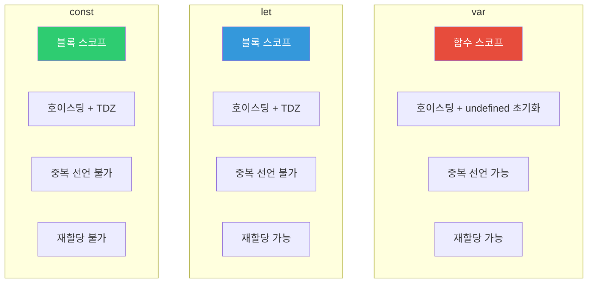
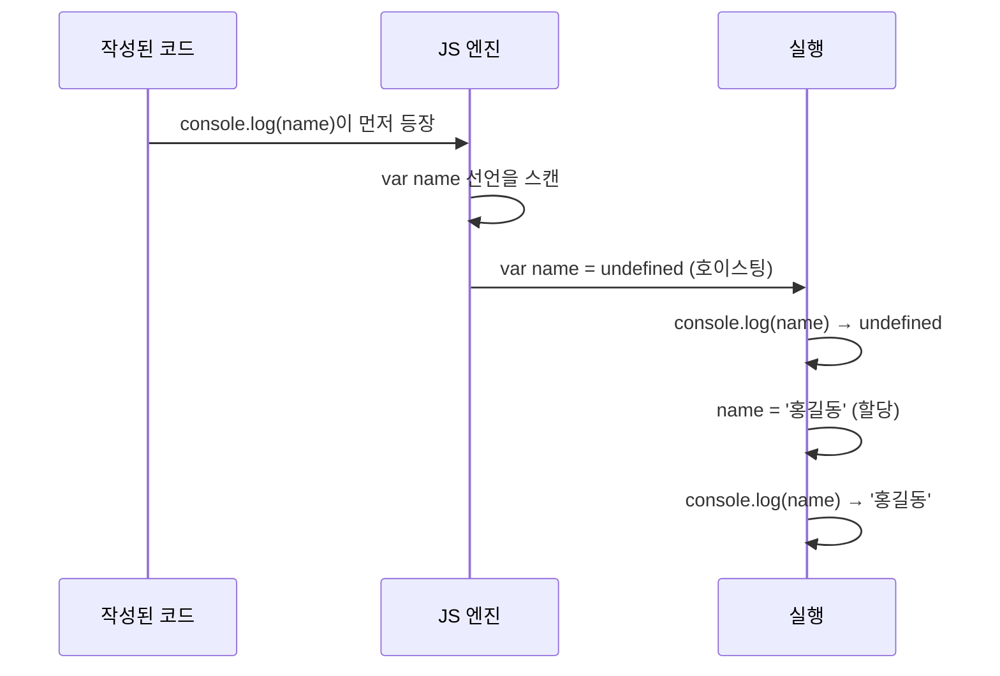
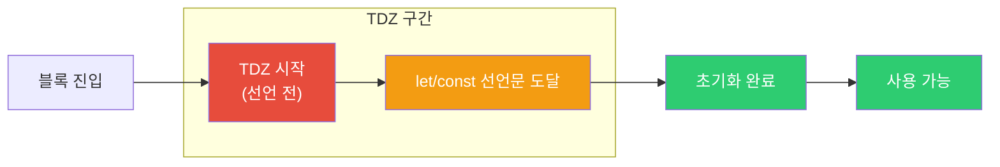
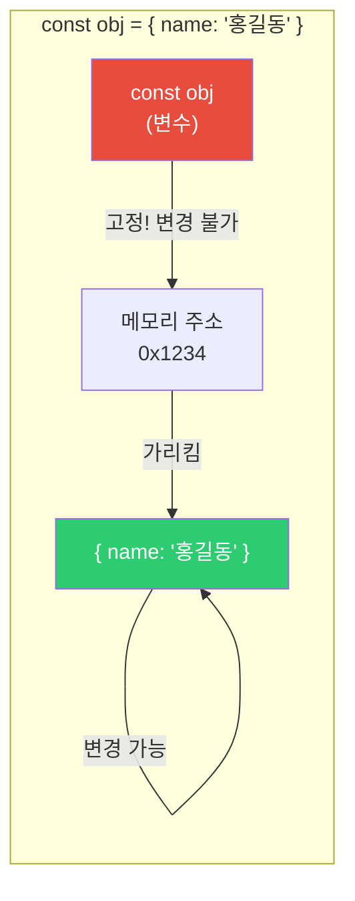
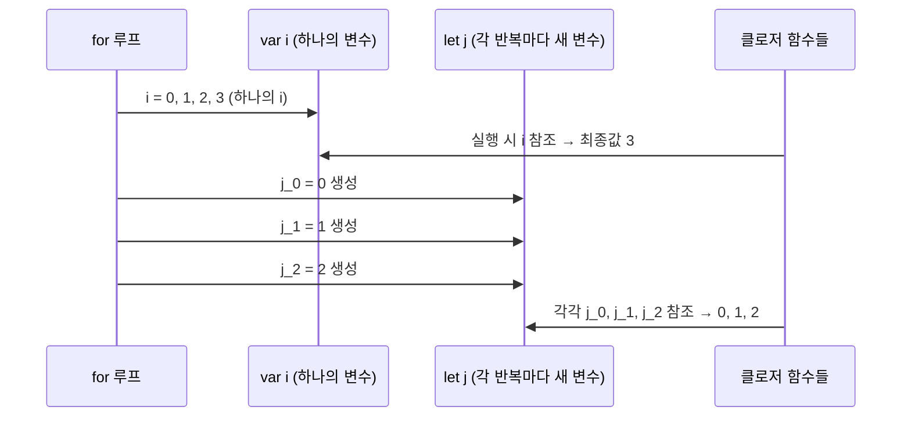
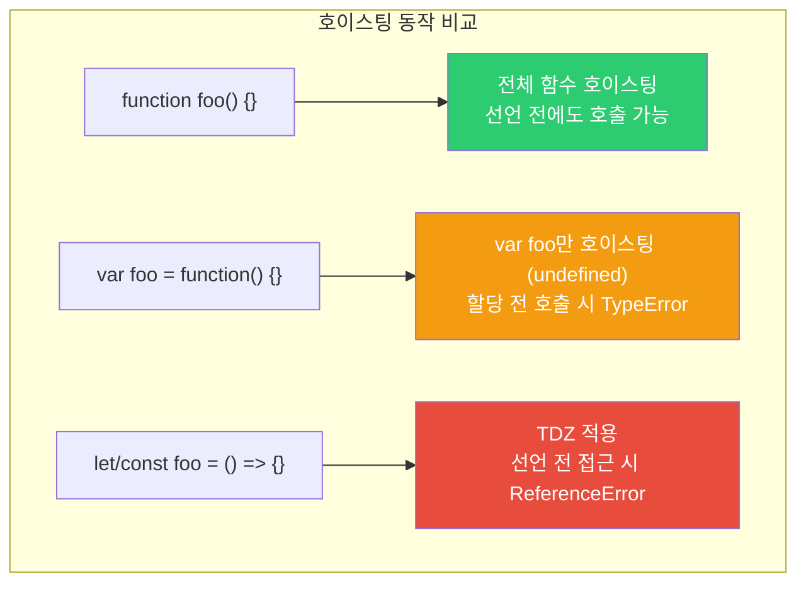
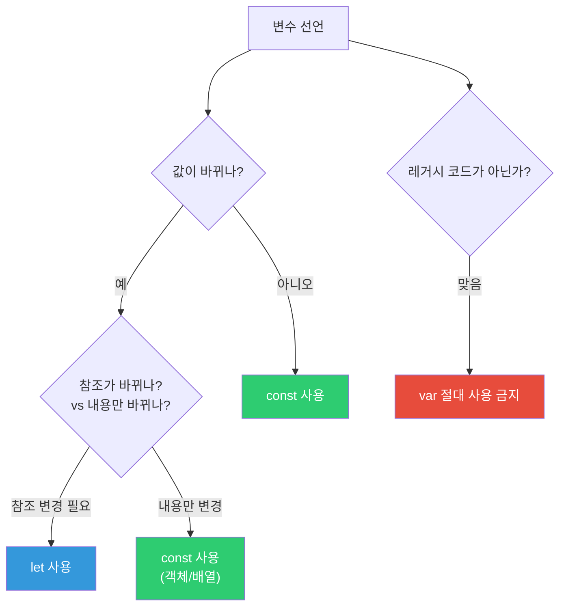
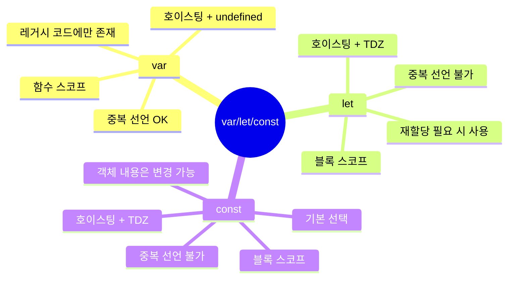

## 아파트 입주 이야기

아파트를 분양받았다고 상상해 보세요.

- **var**: 계약서 쓰는 날부터 집이 존재합니다. 단, 이사는 나중에 합니다. 빈 방이지만 주소는 있어요. 그리고 같은 단지에 같은 호수를 두 번 분양받을 수도 있습니다 (중복 선언 가능).
- **let**: 계약서 쓰기 전까지 집에 들어갈 수 없습니다. 주소도 없고, 들어가려 하면 경비원(엔진)이 막습니다.
- **const**: let과 같은데, 한번 이사 들어가면 절대 이사를 못 갑니다. 집 내부는 바꿀 수 있지만 주소 자체는 고정.

이 비유 하나만 이해해도 세 키워드의 핵심 차이가 잡힙니다. 이제 각 개념을 하나씩 파헤쳐 봅시다.

---

## 1. 선언 방식 비교 총람

세 키워드를 나란히 놓으면 이렇습니다.



표로도 한 번 정리합니다.

| 특성 | var | let | const |
|------|-----|-----|-------|
| 스코프 | 함수 스코프 | 블록 스코프 | 블록 스코프 |
| 호이스팅 | undefined로 초기화 | TDZ (접근 시 에러) | TDZ (접근 시 에러) |
| 중복 선언 | 가능 | 불가 | 불가 |
| 재할당 | 가능 | 가능 | 불가 |
| 전역 객체 속성 | 전역에서 선언 시 window.x = x | 아님 | 아님 |

---

## 2. 스코프 차이 — var가 왜 위험한가

스코프(Scope)는 "변수가 살아있는 영역"입니다. 여기서 var와 let/const의 차이가 극명하게 드러납니다.

> 비유: var는 방 하나짜리 집에서 사는 것과 같습니다. 침실, 거실, 주방 어디서나 같은 물건을 집어들 수 있어요. 반면 let은 방마다 자물쇠가 달린 집입니다. 침실에 있는 물건은 침실 밖에서 꺼낼 수 없습니다.

### var는 함수 스코프

```javascript
function testVar() {
  if (true) {
    var x = 10; // if 블록 안에서 선언
    console.log(x); // 10
  }
  console.log(x); // 10 — if 블록 밖에서도 접근 가능!
}

testVar();
// console.log(x); // ReferenceError — 함수 밖은 불가
```

`var x`는 if 블록 안에 써 있지만, 실제로는 함수 전체에서 살아있습니다. 이게 왜 문제냐면, 개발자가 "이 변수는 if 안에서만 쓸 거야"라고 생각해도 코드가 그 의도를 반영하지 않기 때문입니다. 팀원이 나중에 그 변수를 if 바깥에서 참조해도 에러가 나지 않습니다.

### let/const는 블록 스코프

```javascript
function testLet() {
  if (true) {
    let y = 20;
    const z = 30;
    console.log(y, z); // 20, 30
  }
  // console.log(y); // ReferenceError — 블록 밖 접근 불가
  // console.log(z); // ReferenceError
}
```

`{}`로 감싸진 어떤 블록이든, 그 안에서 선언된 let/const는 밖에서 보이지 않습니다. 의도를 코드에 정확히 반영할 수 있는 이유가 바로 이것입니다.


---

## 3. 호이스팅 — "선언이 위로 올라간다"는 말의 진짜 의미

호이스팅(Hoisting)은 자바스크립트 엔진이 코드를 실행하기 전에 **선언을 먼저 읽는** 동작입니다. 마치 교수님이 수업 시작 전에 출석부를 훑어보는 것처럼, 엔진은 코드를 실행하기 전에 어떤 변수와 함수가 있는지 미리 파악합니다.

> 비유: 도서관 사서가 책을 배치하기 전에 목록 카드를 먼저 만들어 놓는 것과 같습니다. 카드(선언)는 존재하지만, 책(값)은 아직 자리에 없습니다.

### var 호이스팅 — 선언은 올라가지만 값은 안 올라간다

```javascript
console.log(name); // undefined (에러 아님!)
var name = '홍길동';
console.log(name); // '홍길동'
```

위 코드가 에러 없이 실행되는 이유는, 자바스크립트 엔진이 실제로 이렇게 처리하기 때문입니다.

```javascript
var name; // 선언만 상단으로 이동 (호이스팅)
console.log(name); // undefined — 값은 없지만 변수는 존재
name = '홍길동'; // 할당은 원래 자리에서 실행
console.log(name); // '홍길동'
```

만약 이걸 모르면 `console.log(name)`이 `undefined`를 출력했을 때 "어? 왜 에러가 안 나지?"라며 혼란스러워집니다. 에러가 안 나는 게 오히려 더 위험한 이유이기도 합니다.



### let/const 호이스팅과 TDZ — "올라가긴 하지만 접근은 막힌다"

```javascript
// console.log(age); // ReferenceError: Cannot access 'age' before initialization
let age = 25;
console.log(age); // 25
```

`let`과 `const`도 호이스팅됩니다. 그런데 왜 에러가 날까요? **TDZ(Temporal Dead Zone, 일시적 사각지대)** 때문입니다.

블록에 진입하는 순간부터 let/const 선언문에 도달하기 전까지의 구간이 TDZ입니다. 이 구간에서 변수에 접근하면 에러가 발생합니다.



```javascript
{
  // TDZ 시작 — x는 호이스팅됐지만 초기화되지 않음
  // console.log(x); // ReferenceError!

  let x = 10; // 이 시점에 초기화
  // TDZ 종료

  console.log(x); // 10 — 이제 접근 가능
}
```

### TDZ가 필요한 이유 — "명확한 에러가 숨겨진 버그보다 낫다"

```javascript
// var의 위험한 예 — 조용히 undefined를 반환
console.log(config); // undefined — 오류처럼 보이지 않음
// ... 500줄의 코드 ...
var config = { debug: true };

// let으로 명확한 에러 발생 — 즉시 문제를 알 수 있음
// console.log(config); // ReferenceError — 선언 전 접근
let config = { debug: true };
```

var는 잘못 쓰면 `undefined`를 조용히 뱉습니다. 디버깅할 때 이 `undefined`가 어디서 왔는지 추적하기가 매우 어렵습니다. let은 즉시 에러를 발생시켜서 문제를 바로 알 수 있습니다. 에러는 친구입니다.

---

## 4. 중복 선언 — var가 또 하나의 지뢰를 심는 방법

```javascript
// var: 중복 선언 허용 (버그의 원인)
var user = '김철수';
var user = '이영희'; // 에러 없음, 조용히 덮어씀
console.log(user); // '이영희'

// let: 중복 선언 에러
let product = '사과';
// let product = '배'; // SyntaxError: Identifier 'product' has already been declared

// const: 중복 선언 에러
const PI = 3.14;
// const PI = 3.14159; // SyntaxError
```

var로 같은 변수를 두 번 선언해도 에러가 없습니다. 이게 왜 문제냐면, 1000줄짜리 파일에서 실수로 같은 이름을 두 번 선언했을 때 아무도 알려주지 않습니다. 이전 값이 조용히 사라집니다.

let/const는 이런 실수를 **컴파일 시점에** 바로 잡아줍니다.

---

## 5. const의 참조 불변 vs 값 불변 — 헷갈리는 포인트 정리

const를 쓰면 "값이 절대 안 바뀐다"고 오해하는 분들이 많습니다. 정확히는 **바인딩(참조 주소)이 불변**입니다.

> 비유: const는 "이 변수가 가리키는 창고 주소는 절대 바꿀 수 없다"는 뜻입니다. 창고 안에 있는 물건은 얼마든지 추가하거나 바꿀 수 있습니다.

```javascript
const arr = [1, 2, 3];
arr.push(4);          // 가능! 배열 내용 변경
arr[0] = 99;          // 가능!
console.log(arr);     // [99, 2, 3, 4]

// arr = [1, 2, 3];   // TypeError: Assignment to constant variable
// 창고 주소 자체를 바꾸는 건 불가

const obj = { name: '홍길동' };
obj.name = '김철수';  // 가능! 객체 속성 변경
obj.age = 25;         // 가능! 새 속성 추가

// obj = {};           // TypeError — 새 객체로 교체는 불가
```



### 완전한 불변을 원한다면 Object.freeze()를 쓰세요

```javascript
const config = Object.freeze({
  apiUrl: 'https://api.example.com',
  timeout: 3000
});

config.apiUrl = 'http://hacked.com'; // 조용히 무시됨 (엄격 모드에서 에러)
console.log(config.apiUrl); // 'https://api.example.com' — 변경 안 됨

// 주의: 얕은(shallow) 동결만 됩니다
const nested = Object.freeze({
  server: { host: 'localhost', port: 3000 }
});

nested.server.port = 9999; // 동작함! 중첩 객체는 동결 안 됨
```

`Object.freeze()`는 딱 1단계만 동결합니다. 깊은 불변성이 필요하면 재귀적으로 freeze를 호출하거나, Immer 같은 라이브러리를 활용하세요.

---

## 6. for 루프에서의 차이 — 가장 유명한 var 버그

자바스크립트를 배우다 보면 반드시 한 번은 이 버그를 마주칩니다.

```javascript
// var: 루프 변수가 공유됨 (클로저 버그)
const funcs = [];
for (var i = 0; i < 3; i++) {
  funcs.push(function() {
    return i; // 루프 종료 후 i = 3
  });
}
console.log(funcs[0]()); // 3 — 예상: 0
console.log(funcs[1]()); // 3 — 예상: 1
console.log(funcs[2]()); // 3 — 예상: 2
```

왜 이럴까요? `var i`는 블록 스코프가 없으므로 루프가 끝나도 **하나의 `i`만 존재**합니다. 루프가 끝나면 그 `i`는 3이 됩니다. 세 함수 모두 같은 `i`를 참조하고 있으니 모두 3을 반환합니다.



`let`을 쓰면 **각 반복마다 새로운 바인딩**이 생성됩니다. 즉, 반복마다 독립적인 `j`가 존재합니다.

```javascript
// let: 반복마다 새 바인딩 생성
const funcs2 = [];
for (let j = 0; j < 3; j++) {
  funcs2.push(function() {
    return j; // 각 반복의 j를 캡처
  });
}
console.log(funcs2[0]()); // 0
console.log(funcs2[1]()); // 1
console.log(funcs2[2]()); // 2
```

이 차이 하나만으로도 `var` 대신 `let`을 써야 하는 이유가 충분합니다.

---

## 7. 전역 스코프에서의 차이 — var는 window를 오염시킨다

```javascript
var globalVar = 'var';
let globalLet = 'let';
const globalConst = 'const';

console.log(window.globalVar);   // 'var' — 전역 객체의 속성이 됨
console.log(window.globalLet);   // undefined — 전역 객체 속성 아님
console.log(window.globalConst); // undefined
```

전역에서 `var`로 선언하면 `window` 객체에 속성이 추가됩니다. 이는 서드파티 라이브러리나 다른 스크립트와 이름이 충돌할 위험이 있습니다. `let`과 `const`는 별도의 스코프에 존재해서 이런 충돌을 방지합니다.

---

## 8. 함수 호이스팅 vs 변수 호이스팅 — 함수 선언식의 특별함

변수와 달리, 함수 선언식은 **전체가** 호이스팅됩니다.

```javascript
// 함수 선언식: 전체가 호이스팅됨
sayHello(); // 'Hello!' — 선언 전에도 호출 가능!

function sayHello() {
  console.log('Hello!');
}

// 함수 표현식: 변수처럼 호이스팅됨
// sayBye(); // TypeError: sayBye is not a function
var sayBye = function() {
  console.log('Bye!');
};

// const 함수 표현식
// sayHi(); // ReferenceError: Cannot access 'sayHi' before initialization
const sayHi = function() {
  console.log('Hi!');
};
```

이 차이를 모르면 "함수 선언식은 어디서 호출해도 되는데, 왜 화살표 함수는 순서가 중요하지?"라는 혼란이 생깁니다.



---

## 9. 실전 가이드 — 언제 무엇을 쓸까



규칙은 간단합니다.

1. **기본적으로 `const` 사용** — 선언 순간 "이 값은 바뀌지 않는다"고 의도를 표현
2. **재할당이 필요할 때만 `let`** — 루프 카운터, 상태 변수처럼 값이 바뀌는 경우
3. **`var`는 절대 사용 금지** — 예측 불가능한 동작을 유발하는 레거시

```javascript
// 실전 코드 패턴

// 상수값 — const
const MAX_RETRIES = 3;
const API_BASE_URL = 'https://api.example.com';

// 배열/객체 — const (내용은 변경 가능)
const users = [];
users.push({ name: '홍길동' }); // OK

// 재할당 필요 — let
let currentPage = 1;
for (let i = 0; i < 10; i++) {
  currentPage++;
}

// for...of에서도 const 가능 (각 반복마다 새 바인딩)
const items = ['a', 'b', 'c'];
for (const item of items) {
  console.log(item); // 각 반복마다 새 const 바인딩
}
```

---

## 10. 호이스팅 퀴즈 — 직접 예측해보기

이론을 알았다면 코드를 보고 출력값을 예측해보세요. 이게 진짜 이해의 척도입니다.

```javascript
// 퀴즈 1: 출력값은?
var x = 1;
function test() {
  console.log(x); // ??
  var x = 2;
  console.log(x); // ??
}
test();
```

정답은 `undefined`, `2`입니다. 함수 내부의 `var x`가 함수 상단으로 호이스팅되기 때문에, 첫 번째 `console.log`는 전역 `x = 1`이 아니라 함수 내 `var x = undefined`를 봅니다. 이 동작이 바로 var가 혼란스러운 이유입니다.

```javascript
// 퀴즈 2: 에러가 나는 줄은?
let a = 1;
{
  // console.log(a); // (A) — ReferenceError! TDZ
  let a = 2;
  console.log(a); // (B) — 2
}
console.log(a); // (C) — 1
```

(A)에서 `ReferenceError`가 발생합니다. 블록 안에서 `let a`가 호이스팅되어 TDZ에 있기 때문에, 전역 `a`가 보이지 않습니다. 블록 스코프의 `let a` 선언이 같은 블록 안의 전역 변수를 "가립니다".

---

## 11. TypeScript에서의 const — 타입 추론에도 영향을 준다

TypeScript를 쓴다면 const와 let의 차이가 타입 추론에도 영향을 미칩니다.

```typescript
// const는 리터럴 타입으로 추론
const x = 42;        // type: 42 (숫자가 아닌 정확히 42)
let y = 42;          // type: number

const obj = { name: '홍길동' };         // type: { name: string }
const obj2 = { name: '홍길동' } as const; // type: { readonly name: '홍길동' }

// as const: 깊은 불변성 + 리터럴 타입
const config = {
  endpoint: '/api',
  retries: 3
} as const;

// config.endpoint = '/other'; // Error! readonly
```

`as const`는 `Object.freeze()`보다 강력합니다. 타입 레벨에서 불변성을 강제하기 때문에, 컴파일 시점에 잘못된 변경을 막아줍니다.

---

## 정리



현대 자바스크립트에서는 `var`를 사용할 이유가 없습니다. `const`를 기본으로 사용하고, 재할당이 필요한 경우에만 `let`을 사용하세요. 이 원칙을 따르면 코드가 의도를 명확하게 전달하고, 예측하기 어려운 버그도 사전에 방지할 수 있습니다.
