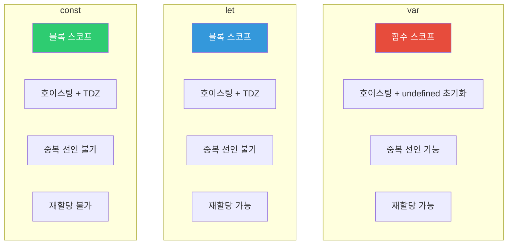
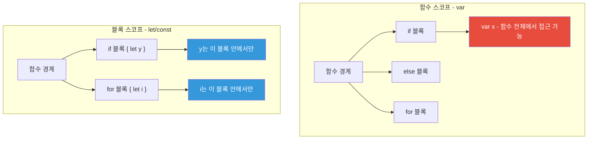
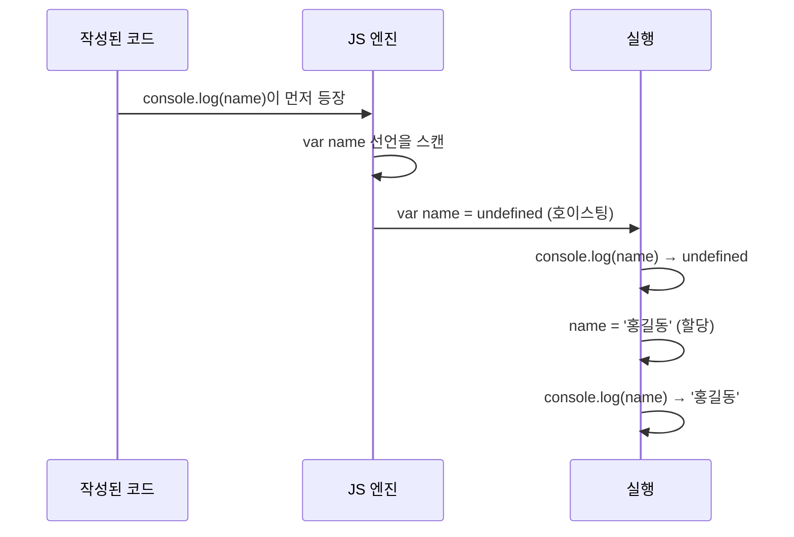
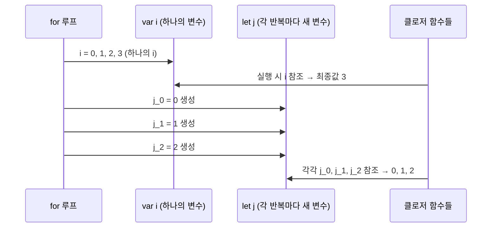
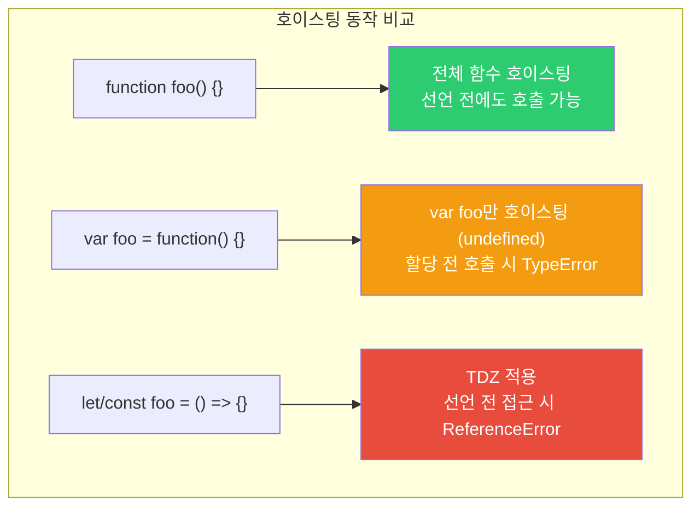
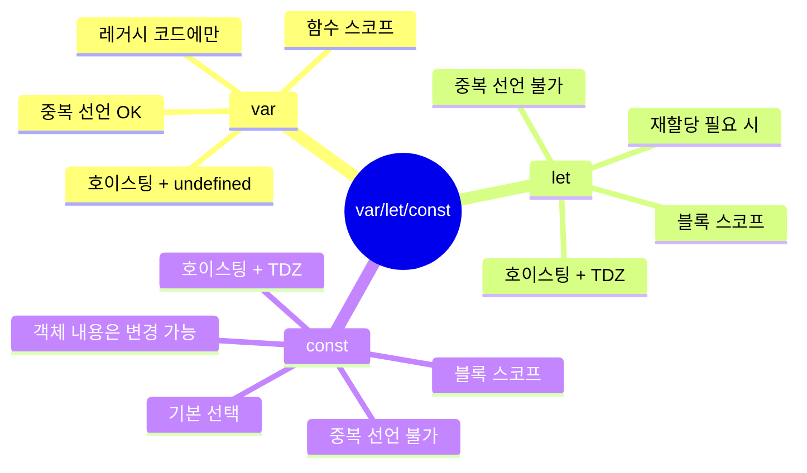

## 아파트 입주 이야기

아파트를 분양받았다고 상상해 보세요.

- **var**: 계약서 쓰는 날부터 집이 존재합니다. 단, 이사는 나중에 합니다. 빈 방이지만 주소는 있어요. 그리고 같은 단지에 같은 호수를 두 번 분양받을 수도 있습니다 (중복 선언).
- **let**: 계약서 쓰기 전까지 집에 들어갈 수 없습니다. 주소도 없고, 들어가려 하면 경비원(엔진)이 막습니다.
- **const**: let과 같은데, 한번 이사 들어가면 절대 이사를 못 갑니다. 집 내부는 바꿀 수 있지만 주소 자체는 고정.

---

## 1. 선언 방식 비교 총람



| 특성 | var | let | const |
|------|-----|-----|-------|
| 스코프 | 함수 스코프 | 블록 스코프 | 블록 스코프 |
| 호이스팅 | undefined로 초기화 | TDZ (접근 시 에러) | TDZ (접근 시 에러) |
| 중복 선언 | 가능 | 불가 | 불가 |
| 재할당 | 가능 | 가능 | 불가 |
| 전역 객체 속성 | 전역에서 선언 시 window.x = x | 아님 | 아님 |

---

## 2. 스코프 차이

### 함수 스코프 (var)

```javascript
function testVar() {
  if (true) {
    var x = 10; // if 블록 안에서 선언
    console.log(x); // 10
  }
  console.log(x); // 10 - if 블록 밖에서도 접근 가능!
}

testVar();
// console.log(x); // ReferenceError - 함수 밖은 불가
```

### 블록 스코프 (let, const)

```javascript
function testLet() {
  if (true) {
    let y = 20;
    const z = 30;
    console.log(y, z); // 20, 30
  }
  // console.log(y); // ReferenceError - 블록 밖 접근 불가
  // console.log(z); // ReferenceError
}
```



---

## 3. 호이스팅 (Hoisting) 메커니즘

호이스팅은 선언을 코드 상단으로 끌어올리는 동작입니다. 하지만 `var`와 `let/const`의 동작이 다릅니다.

### var 호이스팅

```javascript
console.log(name); // undefined (에러 아님!)
var name = '홍길동';
console.log(name); // '홍길동'

// 자바스크립트 엔진이 실제로 처리하는 방식:
var name; // 선언만 상단으로 이동
console.log(name); // undefined
name = '홍길동'; // 할당은 제자리
console.log(name); // '홍길동'
```



### let/const 호이스팅과 TDZ

```javascript
// console.log(age); // ReferenceError: Cannot access 'age' before initialization
let age = 25;
console.log(age); // 25
```

`let`과 `const`도 호이스팅됩니다. 하지만 **TDZ(Temporal Dead Zone)**가 존재합니다.

```mermaid
flowchart LR
    A["블록 진입"] --> B["TDZ 시작<br>("선언 전")"]
    B --> C["let/const 선언문 도달"]
    C --> D["초기화 완료"]
    D --> E["사용 가능"]

    subgraph "TDZ 구간"
        B
        C
    end

    style B fill:#e74c3c,color:#fff
    style C fill:#f39c12,color:#fff
    style D fill:#2ecc71,color:#fff
    style E fill:#2ecc71,color:#fff
```

```javascript
{
  // TDZ 시작 - x는 호이스팅됐지만 초기화되지 않음
  // console.log(x); // ReferenceError!

  let x = 10; // 이 시점에 초기화
  // TDZ 종료

  console.log(x); // 10 - 이제 접근 가능
}
```

### TDZ가 필요한 이유

```javascript
// var의 위험한 예
console.log(config); // undefined - 오류처럼 보이지 않음
// ... 500줄의 코드 ...
var config = { debug: true };

// let으로 명확한 에러 발생
// console.log(config); // ReferenceError - 즉시 문제 발견
let config = { debug: true };
```

---

## 4. 중복 선언

```javascript
// var: 중복 선언 허용 (버그의 원인)
var user = '김철수';
var user = '이영희'; // 에러 없음, 덮어씀
console.log(user); // '이영희'

// let: 중복 선언 에러
let product = '사과';
// let product = '배'; // SyntaxError: Identifier 'product' has already been declared

// const: 중복 선언 에러
const PI = 3.14;
// const PI = 3.14159; // SyntaxError
```

---

## 5. const의 참조 불변 vs 값 불변

`const`는 **바인딩(참조)**이 불변이지, **내용**이 불변이 아닙니다.

```javascript
const arr = [1, 2, 3];
arr.push(4);          // 가능! 배열 내용 변경
arr[0] = 99;          // 가능!
console.log(arr);     // [99, 2, 3, 4]

// arr = [1, 2, 3];   // TypeError: Assignment to constant variable

const obj = { name: '홍길동' };
obj.name = '김철수';  // 가능! 객체 속성 변경
obj.age = 25;         // 가능!

// obj = {};           // TypeError
```

```mermaid
graph LR
    subgraph "const obj = { name: '홍길동' }"
        OBJ_VAR["const obj<br>("변수")"]
        OBJ_VAL["메모리 주소<br>0x1234"]
        OBJ_DATA["{" name: '홍길동' "}"]
    end

    OBJ_VAR -->|"고정! 변경 불가"| OBJ_VAL
    OBJ_VAL -->|"가리킴"| OBJ_DATA
    OBJ_DATA -->|"변경 가능"| OBJ_DATA

    style OBJ_VAR fill:#e74c3c,color:#fff
    style OBJ_DATA fill:#2ecc71,color:#fff
```

### 완전한 불변을 원한다면: Object.freeze()

```javascript
const config = Object.freeze({
  apiUrl: 'https://api.example.com',
  timeout: 3000
});

config.apiUrl = 'http://hacked.com'; // 조용히 무시됨 (엄격 모드에서 에러)
console.log(config.apiUrl); // 'https://api.example.com'

// 단, 얕은(shallow) 동결만 됨
const nested = Object.freeze({
  server: { host: 'localhost', port: 3000 }
});

nested.server.port = 9999; // 동작함! 중첩 객체는 동결 안 됨
```

---

## 6. for 루프에서의 차이 - 유명한 버그

```javascript
// var: 루프 변수가 공유됨 (클로저 버그)
const funcs = [];
for (var i = 0; i < 3; i++) {
  funcs.push(function() {
    return i; // 루프 종료 후 i = 3
  });
}
console.log(funcs[0]()); // 3
console.log(funcs[1]()); // 3
console.log(funcs[2]()); // 3

// let: 반복마다 새 바인딩 생성
const funcs2 = [];
for (let j = 0; j < 3; j++) {
  funcs2.push(function() {
    return j; // 각 반복의 j 캡처
  });
}
console.log(funcs2[0]()); // 0
console.log(funcs2[1]()); // 1
console.log(funcs2[2]()); // 2
```



---

## 7. 전역 스코프에서의 차이

```javascript
var globalVar = 'var';
let globalLet = 'let';
const globalConst = 'const';

console.log(window.globalVar);   // 'var' - 전역 객체의 속성
console.log(window.globalLet);   // undefined - 전역 객체 속성 아님
console.log(window.globalConst); // undefined
```

---

## 8. 함수 호이스팅 vs 변수 호이스팅

```javascript
// 함수 선언식: 전체가 호이스팅됨
sayHello(); // 'Hello!' - 선언 전에도 호출 가능

function sayHello() {
  console.log('Hello!');
}

// 함수 표현식: 변수처럼 호이스팅
// sayBye(); // TypeError: sayBye is not a function
var sayBye = function() {
  console.log('Bye!');
};

// const 함수 표현식
// sayHi(); // ReferenceError: Cannot access 'sayHi' before initialization
const sayHi = function() {
  console.log('Hi!');
};
```



---

## 9. 실전 가이드 - 언제 무엇을 쓸까

```mermaid
flowchart TD
    A["변수 선언"] --> B{"값이 바뀌나?"}
    B -->|"예"| C{"참조가 바뀌나?<br>vs 내용만 바뀌나?"}
    B -->|"아니오"| D["const 사용"]
    C -->|"참조 변경 필요"| E["let 사용"]
    C -->|"내용만 변경"| F["const 사용<br>("객체/배열")"]
    A --> G{"레거시 코드가 아닌가?"}
    G -->|"맞음"| H["var 절대 사용 금지"]

    style D fill:#2ecc71,color:#fff
    style E fill:#3498db,color:#fff
    style F fill:#2ecc71,color:#fff
    style H fill:#e74c3c,color:#fff
```

### 규칙

1. **기본적으로 `const` 사용** - 의도치 않은 재할당 방지
2. **재할당이 필요할 때만 `let`** - 루프 카운터, 상태 변수
3. **`var`는 절대 사용 금지** - 예측 불가능한 동작

```javascript
// 실전 코드 패턴

// 상수값 - const
const MAX_RETRIES = 3;
const API_BASE_URL = 'https://api.example.com';

// 배열/객체 - const (내용은 변경 가능)
const users = [];
users.push({ name: '홍길동' }); // OK

// 재할당 필요 - let
let currentPage = 1;
for (let i = 0; i < 10; i++) {
  currentPage++;
}

// 루프에서 const도 가능 (for...of, for...in)
const items = ['a', 'b', 'c'];
for (const item of items) {
  console.log(item); // 각 반복마다 새 const 바인딩
}
```

---

## 10. 극한 시나리오 - 호이스팅 퀴즈

```javascript
// 퀴즈 1: 출력값은?
var x = 1;
function test() {
  console.log(x); // ??
  var x = 2;
  console.log(x); // ??
}
test();
```

**정답:**
- 첫 번째 `console.log(x)`: `undefined` (함수 내 var x가 함수 상단으로 호이스팅됨)
- 두 번째 `console.log(x)`: `2`

```javascript
// 퀴즈 2: 에러가 나는 줄은?
let a = 1;
{
  // console.log(a); // (A) - ReferenceError! TDZ
  let a = 2;
  console.log(a); // (B) - 2
}
console.log(a); // (C) - 1
```

**정답:** (A)에서 `ReferenceError` - 블록 안에서 `let a`가 호이스팅돼 TDZ에 있음

---

## 11. TypeScript에서의 const

```typescript
// TypeScript는 const 리터럴 타입 추론
const x = 42;        // type: 42 (리터럴 타입)
let y = 42;          // type: number

const obj = { name: '홍길동' };  // type: { name: string }
const obj2 = { name: '홍길동' } as const;  // type: { readonly name: '홍길동' }

// as const: 깊은 불변성 + 리터럴 타입
const config = {
  endpoint: '/api',
  retries: 3
} as const;

// config.endpoint = '/other'; // Error! readonly
```

---

## 정리



현대 자바스크립트에서는 `var`를 사용할 이유가 없습니다. `const`를 기본으로 사용하고, 재할당이 필요한 경우에만 `let`을 사용하세요. 이 원칙을 따르면 예측 가능하고 안전한 코드를 작성할 수 있습니다.
