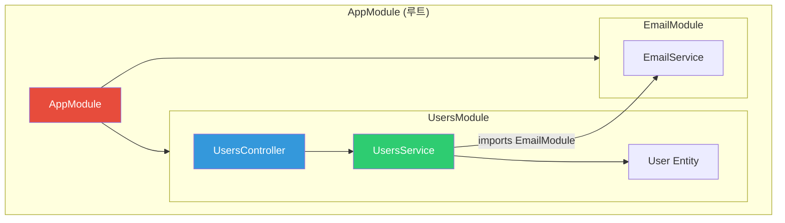
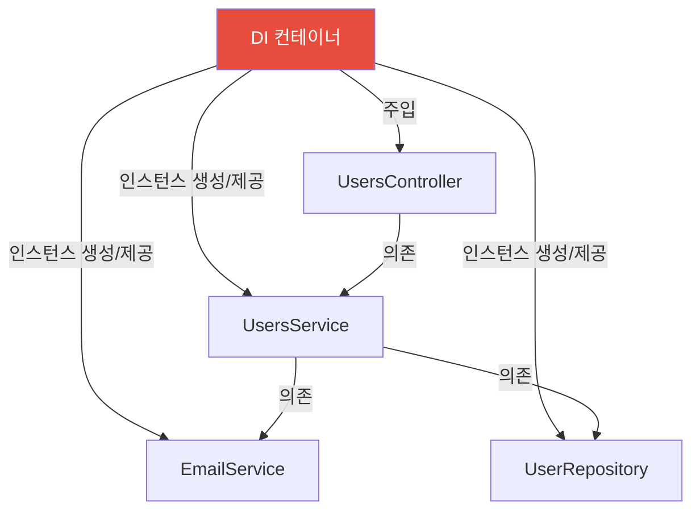
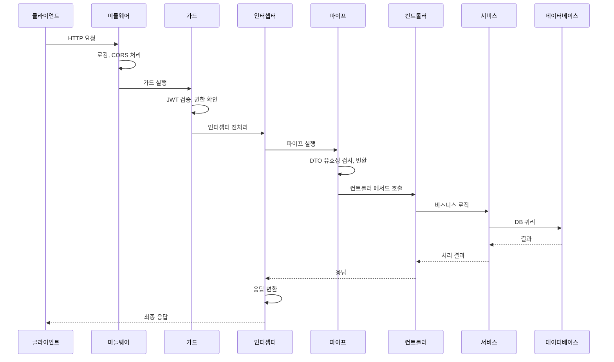
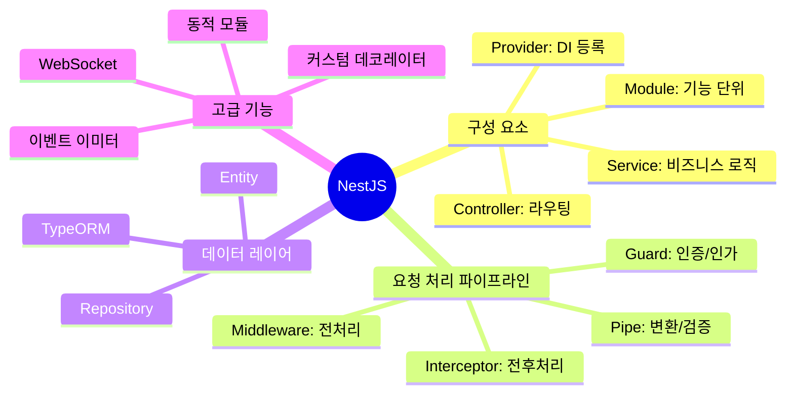

## 대형 병원 시스템

NestJS의 구조는 대형 병원과 비슷합니다.

- **모듈 (Module)**: 각 진료과 (내과, 외과, 소아과)
- **컨트롤러 (Controller)**: 접수창구 - 환자(요청) 접수
- **서비스 (Service)**: 의사 - 실제 진료(비즈니스 로직)
- **미들웨어**: 병원 입구 체온계 - 모든 방문자 체크
- **가드 (Guard)**: 보안 요원 - 입장 권한 확인
- **파이프 (Pipe)**: 접수 폼 검증 - 정보가 올바른지 확인
- **인터셉터**: 원무과 기록 - 모든 진료 전후 기록

---

## 1. NestJS 아키텍처 개요

```mermaid
graph TD
    CLIENT["클라이언트"] --> MW["미들웨어"]
    MW --> GUARD["가드 ("인증/인가")"]
    GUARD --> INTERCEPTOR1["인터셉터 ("전처리")"]
    INTERCEPTOR1 --> PIPE["파이프 ("유효성 검사")"]
    PIPE --> CTRL["컨트롤러"]
    CTRL --> SERVICE["서비스 ("비즈니스 로직")"]
    SERVICE --> REPO["레포지토리 (DB)"]
    REPO --> SERVICE
    SERVICE --> CTRL
    CTRL --> INTERCEPTOR2["인터셉터 ("후처리")"]
    INTERCEPTOR2 --> CLIENT

    style GUARD fill:#e74c3c,color:#fff
    style PIPE fill:#f39c12,color:#fff
    style SERVICE fill:#2ecc71,color:#fff
    style INTERCEPTOR1 fill:#3498db,color:#fff
```

---

## 2. 모듈 (Module)

NestJS의 기본 구성 단위입니다.

```typescript
// users/users.module.ts
import { Module } from '@nestjs/common';
import { TypeOrmModule } from '@nestjs/typeorm';
import { UsersController } from './users.controller';
import { UsersService } from './users.service';
import { User } from './entities/user.entity';
import { EmailModule } from '../email/email.module';

@Module({
  imports: [
    TypeOrmModule.forFeature([User]), // 레포지토리 주입
    EmailModule                        // 다른 모듈 가져오기
  ],
  controllers: [UsersController],
  providers: [UsersService],
  exports: [UsersService]              // 다른 모듈에 UsersService 공개
})
export class UsersModule {}
```



### 동적 모듈

```typescript
// database/database.module.ts
@Module({})
export class DatabaseModule {
  static forRoot(options: DatabaseOptions): DynamicModule {
    return {
      module: DatabaseModule,
      providers: [
        {
          provide: DATABASE_OPTIONS,
          useValue: options
        },
        DatabaseService
      ],
      exports: [DatabaseService],
      global: true // 전역 모듈로 설정
    };
  }
}

// app.module.ts
@Module({
  imports: [
    DatabaseModule.forRoot({
      host: 'localhost',
      port: 5432,
      database: 'mydb'
    })
  ]
})
export class AppModule {}
```

---

## 3. 컨트롤러 (Controller)

HTTP 요청을 처리하는 라우팅 레이어입니다.

```typescript
import {
  Controller, Get, Post, Put, Delete, Patch,
  Param, Body, Query, Headers, Req, Res,
  HttpCode, HttpStatus, ParseIntPipe, UseGuards
} from '@nestjs/common';
import { ApiTags, ApiOperation, ApiBearerAuth } from '@nestjs/swagger';
import { UsersService } from './users.service';
import { CreateUserDto } from './dto/create-user.dto';
import { UpdateUserDto } from './dto/update-user.dto';
import { JwtAuthGuard } from '../auth/guards/jwt-auth.guard';

@ApiTags('users')
@Controller('users')
export class UsersController {
  constructor(private readonly usersService: UsersService) {}

  @Get()
  @ApiOperation({ summary: '모든 사용자 조회' })
  findAll(@Query('page') page = 1, @Query('limit') limit = 10) {
    return this.usersService.findAll({ page, limit });
  }

  @Get(':id')
  findOne(@Param('id', ParseIntPipe) id: number) {
    return this.usersService.findOne(id);
  }

  @Post()
  @HttpCode(HttpStatus.CREATED)
  create(@Body() createUserDto: CreateUserDto) {
    return this.usersService.create(createUserDto);
  }

  @Patch(':id')
  @UseGuards(JwtAuthGuard)
  @ApiBearerAuth()
  update(
    @Param('id', ParseIntPipe) id: number,
    @Body() updateUserDto: UpdateUserDto
  ) {
    return this.usersService.update(id, updateUserDto);
  }

  @Delete(':id')
  @UseGuards(JwtAuthGuard)
  @HttpCode(HttpStatus.NO_CONTENT)
  remove(@Param('id', ParseIntPipe) id: number) {
    return this.usersService.remove(id);
  }
}
```

---

## 4. 서비스 (Service)와 의존성 주입

```typescript
// users/users.service.ts
import { Injectable, NotFoundException, ConflictException } from '@nestjs/common';
import { InjectRepository } from '@nestjs/typeorm';
import { Repository } from 'typeorm';
import { User } from './entities/user.entity';
import { EmailService } from '../email/email.service';
import { CreateUserDto } from './dto/create-user.dto';

@Injectable() // DI 컨테이너에 등록
export class UsersService {
  constructor(
    @InjectRepository(User)
    private readonly userRepository: Repository<User>,
    private readonly emailService: EmailService // 자동 주입
  ) {}

  async findAll(options: { page: number; limit: number }) {
    const { page, limit } = options;
    const [users, total] = await this.userRepository.findAndCount({
      skip: (page - 1) * limit,
      take: limit,
      order: { createdAt: 'DESC' }
    });

    return {
      data: users,
      meta: { page, limit, total, totalPages: Math.ceil(total / limit) }
    };
  }

  async findOne(id: number): Promise<User> {
    const user = await this.userRepository.findOne({ where: { id } });

    if (!user) {
      throw new NotFoundException(`ID ${id}의 사용자를 찾을 수 없습니다`);
    }

    return user;
  }

  async create(createUserDto: CreateUserDto): Promise<User> {
    const existing = await this.userRepository.findOne({
      where: { email: createUserDto.email }
    });

    if (existing) {
      throw new ConflictException('이미 사용 중인 이메일입니다');
    }

    const user = this.userRepository.create(createUserDto);
    const saved = await this.userRepository.save(user);

    // 이메일 서비스 사용
    await this.emailService.sendWelcomeEmail(saved.email, saved.name);

    return saved;
  }
}
```

### 의존성 주입 원리



---

## 5. DTO와 유효성 검사

```typescript
// users/dto/create-user.dto.ts
import {
  IsEmail, IsString, IsOptional, MinLength, MaxLength,
  IsEnum, IsDateString, ValidateNested
} from 'class-validator';
import { Type } from 'class-transformer';
import { ApiProperty } from '@nestjs/swagger';

export enum UserRole {
  ADMIN = 'admin',
  USER = 'user',
  MODERATOR = 'moderator'
}

export class AddressDto {
  @IsString()
  city: string;

  @IsString()
  country: string;
}

export class CreateUserDto {
  @ApiProperty({ example: '홍길동' })
  @IsString()
  @MinLength(2, { message: '이름은 최소 2자 이상이어야 합니다' })
  @MaxLength(50)
  name: string;

  @ApiProperty({ example: 'user@example.com' })
  @IsEmail({}, { message: '올바른 이메일 형식이 아닙니다' })
  email: string;

  @ApiProperty({ example: 'password123' })
  @IsString()
  @MinLength(8, { message: '비밀번호는 최소 8자 이상이어야 합니다' })
  password: string;

  @ApiProperty({ enum: UserRole, default: UserRole.USER })
  @IsEnum(UserRole)
  @IsOptional()
  role?: UserRole = UserRole.USER;

  @IsOptional()
  @ValidateNested()
  @Type(() => AddressDto)
  address?: AddressDto;
}

// main.ts에서 글로벌 파이프 설정
app.useGlobalPipes(new ValidationPipe({
  whitelist: true,       // DTO에 없는 속성 제거
  transform: true,       // 타입 자동 변환 (string → number)
  forbidNonWhitelisted: true, // 알 수 없는 속성 에러
  exceptionFactory: (errors) => new BadRequestException(errors)
}));
```

---

## 6. 미들웨어

```typescript
// middleware/logger.middleware.ts
import { Injectable, NestMiddleware } from '@nestjs/common';
import { Request, Response, NextFunction } from 'express';

@Injectable()
export class LoggerMiddleware implements NestMiddleware {
  use(req: Request, res: Response, next: NextFunction) {
    const { method, originalUrl } = req;
    const start = Date.now();

    res.on('finish', () => {
      const { statusCode } = res;
      const elapsed = Date.now() - start;
      console.log(`${method} ${originalUrl} ${statusCode} ${elapsed}ms`);
    });

    next();
  }
}

// 적용
@Module({})
export class AppModule implements NestModule {
  configure(consumer: MiddlewareConsumer) {
    consumer
      .apply(LoggerMiddleware)
      .exclude(
        { path: 'health', method: RequestMethod.GET }
      )
      .forRoutes('*'); // 모든 라우트에 적용
  }
}
```

---

## 7. 가드 (Guard) - 인증/인가

```typescript
// auth/guards/jwt-auth.guard.ts
import { Injectable, ExecutionContext, UnauthorizedException } from '@nestjs/common';
import { AuthGuard } from '@nestjs/passport';
import { Reflector } from '@nestjs/core';
import { IS_PUBLIC_KEY } from '../decorators/public.decorator';

@Injectable()
export class JwtAuthGuard extends AuthGuard('jwt') {
  constructor(private reflector: Reflector) {
    super();
  }

  canActivate(context: ExecutionContext) {
    // @Public() 데코레이터가 있으면 인증 스킵
    const isPublic = this.reflector.getAllAndOverride<boolean>(IS_PUBLIC_KEY, [
      context.getHandler(),
      context.getClass()
    ]);

    if (isPublic) return true;

    return super.canActivate(context);
  }
}

// 역할 기반 가드
@Injectable()
export class RolesGuard implements CanActivate {
  constructor(private reflector: Reflector) {}

  canActivate(context: ExecutionContext): boolean {
    const requiredRoles = this.reflector.getAllAndOverride<UserRole[]>('roles', [
      context.getHandler(),
      context.getClass()
    ]);

    if (!requiredRoles) return true;

    const { user } = context.switchToHttp().getRequest();
    return requiredRoles.some(role => user.roles?.includes(role));
  }
}

// 커스텀 데코레이터
export const Roles = (...roles: UserRole[]) => SetMetadata('roles', roles);
export const CurrentUser = createParamDecorator(
  (data: string, ctx: ExecutionContext) => {
    const request = ctx.switchToHttp().getRequest();
    return data ? request.user?.[data] : request.user;
  }
);

// 컨트롤러에서 사용
@Get('admin')
@Roles(UserRole.ADMIN)
@UseGuards(JwtAuthGuard, RolesGuard)
adminOnly(@CurrentUser() user: User) {
  return this.usersService.getAdminData(user.id);
}
```

---

## 8. 인터셉터 (Interceptor)

```typescript
// interceptors/response-transform.interceptor.ts
import { Injectable, NestInterceptor, ExecutionContext, CallHandler } from '@nestjs/common';
import { Observable } from 'rxjs';
import { map, tap } from 'rxjs/operators';

@Injectable()
export class ResponseTransformInterceptor<T> implements NestInterceptor<T> {
  intercept(context: ExecutionContext, next: CallHandler): Observable<any> {
    const now = Date.now();
    const { method, url } = context.switchToHttp().getRequest();

    return next.handle().pipe(
      map(data => ({
        success: true,
        data,
        timestamp: new Date().toISOString()
      })),
      tap(() => {
        console.log(`${method} ${url} - ${Date.now() - now}ms`);
      })
    );
  }
}

// 캐싱 인터셉터
@Injectable()
export class CacheInterceptor implements NestInterceptor {
  constructor(private readonly cacheService: CacheService) {}

  async intercept(context: ExecutionContext, next: CallHandler): Promise<Observable<any>> {
    const request = context.switchToHttp().getRequest();
    const key = `cache:${request.url}`;

    const cached = await this.cacheService.get(key);
    if (cached) return of(cached);

    return next.handle().pipe(
      tap(async (data) => {
        await this.cacheService.set(key, data, 60); // 60초 캐시
      })
    );
  }
}
```

---

## 9. TypeORM 연동

```typescript
// entities/user.entity.ts
import {
  Entity, PrimaryGeneratedColumn, Column, CreateDateColumn,
  UpdateDateColumn, OneToMany, BeforeInsert
} from 'typeorm';
import * as bcrypt from 'bcrypt';

@Entity('users')
export class User {
  @PrimaryGeneratedColumn()
  id: number;

  @Column({ length: 100 })
  name: string;

  @Column({ unique: true })
  email: string;

  @Column({ select: false }) // 기본 쿼리에서 제외
  password: string;

  @Column({ type: 'enum', enum: UserRole, default: UserRole.USER })
  role: UserRole;

  @Column({ default: true })
  isActive: boolean;

  @OneToMany(() => Post, post => post.author)
  posts: Post[];

  @CreateDateColumn()
  createdAt: Date;

  @UpdateDateColumn()
  updatedAt: Date;

  @BeforeInsert()
  async hashPassword() {
    this.password = await bcrypt.hash(this.password, 12);
  }
}

// TypeORM 설정
TypeOrmModule.forRootAsync({
  imports: [ConfigModule],
  useFactory: (config: ConfigService) => ({
    type: 'postgres',
    host: config.get('DB_HOST'),
    port: config.get<number>('DB_PORT'),
    username: config.get('DB_USER'),
    password: config.get('DB_PASS'),
    database: config.get('DB_NAME'),
    entities: [__dirname + '/**/*.entity{.ts,.js}'],
    synchronize: config.get('NODE_ENV') !== 'production',
    migrations: ['dist/migrations/*.js'],
    migrationsRun: true,
    logging: config.get('NODE_ENV') === 'development'
  }),
  inject: [ConfigService]
})
```

---

## 10. 예외 처리

```typescript
// filters/http-exception.filter.ts
import {
  ExceptionFilter, Catch, ArgumentsHost,
  HttpException, HttpStatus
} from '@nestjs/common';

@Catch()
export class AllExceptionsFilter implements ExceptionFilter {
  catch(exception: unknown, host: ArgumentsHost) {
    const ctx = host.switchToHttp();
    const response = ctx.getResponse();
    const request = ctx.getRequest();

    const status = exception instanceof HttpException
      ? exception.getStatus()
      : HttpStatus.INTERNAL_SERVER_ERROR;

    const message = exception instanceof HttpException
      ? exception.getResponse()
      : '서버 내부 오류가 발생했습니다';

    // 로깅
    if (status >= 500) {
      console.error('서버 오류:', exception);
      // Sentry.captureException(exception);
    }

    response.status(status).json({
      success: false,
      statusCode: status,
      timestamp: new Date().toISOString(),
      path: request.url,
      message
    });
  }
}

// main.ts
app.useGlobalFilters(new AllExceptionsFilter());
```

---

## 11. 전체 구조 흐름



---

## 12. 정리



NestJS는 **Angular에서 영감을 받은 아키텍처**로, 대규모 백엔드 애플리케이션 개발에 강력한 구조를 제공합니다. 모듈 기반 아키텍처와 의존성 주입으로 **테스트하기 쉽고 확장 가능한** 애플리케이션을 만들 수 있습니다.
