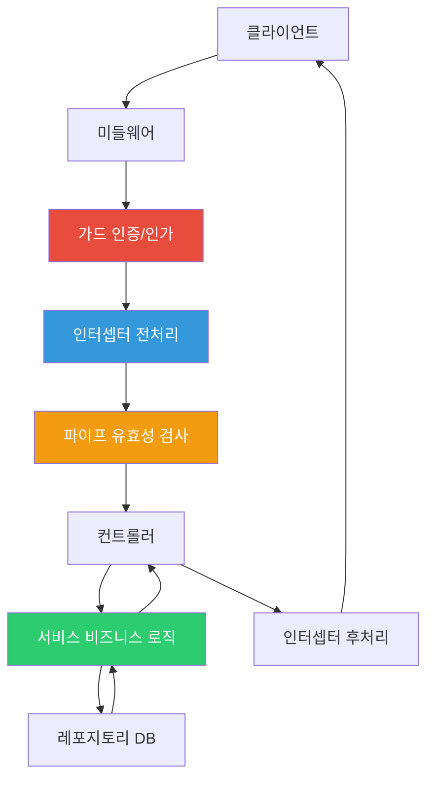
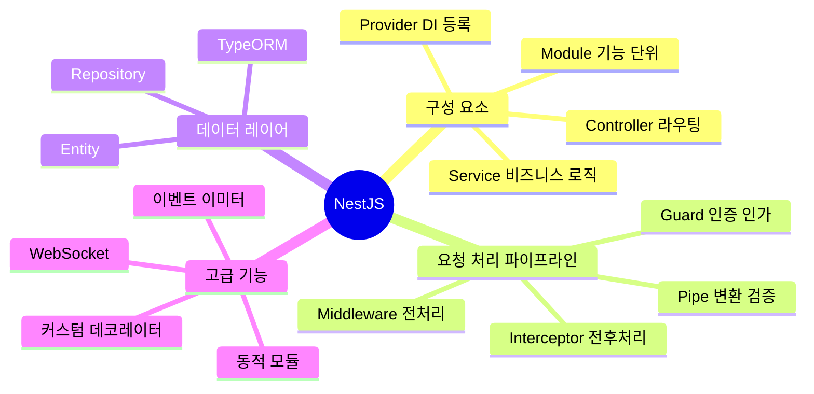

## Express로 충분하지 않은 이유

Express로 프로젝트를 시작하면 처음에는 빠릅니다. 파일 하나에 라우터, 비즈니스 로직, DB 접근 코드가 다 들어가도 동작은 합니다. 문제는 6개월 후입니다. 팀원이 늘어나고 기능이 쌓이면 "이 코드가 어디 있지?", "이 함수가 어디서 불리지?"가 반복됩니다.

NestJS는 Angular에서 영감을 받아 **모듈-컨트롤러-서비스**라는 삼층 구조를 강제합니다. 강제한다는 것이 포인트입니다. 구조를 강제하면 팀원이 바뀌어도 코드가 어디 있는지 예측할 수 있고, 테스트 작성이 쉬워집니다.

> 비유: NestJS의 구조는 대형 병원과 같습니다. 모듈은 각 진료과(내과, 외과), 컨트롤러는 접수창구, 서비스는 실제 진료하는 의사입니다. 병원에서 치과 업무가 내과 창구에서 처리되는 일은 없습니다. NestJS도 마찬가지입니다.

- **모듈 (Module)**: 각 진료과 — 관련 기능을 묶는 단위
- **컨트롤러 (Controller)**: 접수창구 — 요청을 받아 적절한 서비스에 전달
- **서비스 (Service)**: 의사 — 실제 비즈니스 로직 처리
- **가드 (Guard)**: 보안 요원 — 입장 권한 확인 (인증/인가)
- **파이프 (Pipe)**: 접수 폼 검증 — 데이터가 올바른지 확인
- **인터셉터 (Interceptor)**: 원무과 기록 — 모든 진료 전후 공통 처리

---

## 1번 다이어그램 - NestJS 요청 처리 파이프라인



이 파이프라인이 중요한 이유가 있습니다. 왜냐하면 인증, 로깅, 유효성 검사 같은 **횡단 관심사(Cross-cutting Concerns)**를 비즈니스 로직과 완전히 분리할 수 있기 때문입니다. 컨트롤러와 서비스는 순수하게 자신의 일만 합니다.

---

## 2. 모듈 — 기능의 경계선

모듈은 NestJS의 기본 구성 단위입니다. 관련된 컨트롤러, 서비스, 엔티티를 하나로 묶습니다. 모듈 경계를 잘 나누면 나중에 마이크로서비스로 분리하기도 쉬워집니다.

```typescript
// users/users.module.ts
@Module({
  imports: [
    TypeOrmModule.forFeature([User]), // 이 모듈에서 User 엔티티 사용
    EmailModule                        // 다른 모듈 가져오기
  ],
  controllers: [UsersController],
  providers: [UsersService],
  exports: [UsersService]              // 다른 모듈에서 UsersService를 쓸 수 있게 공개
})
export class UsersModule {}
```


> 비유: `exports`는 모듈의 공개 API입니다. exports에 포함되지 않은 서비스는 "이 진료과 내부에서만 쓰는 것"이고, exports에 포함된 서비스는 "다른 진료과에서도 의뢰할 수 있는 것"입니다.

---

## 3. 컨트롤러 — 요청을 받는 창구

컨트롤러는 HTTP 요청을 받아서 적절한 서비스 메서드를 호출하고 응답을 반환합니다. 비즈니스 로직은 없고 **라우팅과 요청/응답 처리만** 담당합니다.

```typescript
@ApiTags('users')
@Controller('users')
export class UsersController {
  constructor(private readonly usersService: UsersService) {}

  @Get()
  findAll(@Query('page') page = 1, @Query('limit') limit = 10) {
    return this.usersService.findAll({ page, limit });
  }

  @Get(':id')
  findOne(@Param('id', ParseIntPipe) id: number) {
    // ParseIntPipe가 파이프라인에서 문자열 ':id'를 숫자로 변환합니다
    return this.usersService.findOne(id);
  }

  @Post()
  @HttpCode(HttpStatus.CREATED)
  create(@Body() createUserDto: CreateUserDto) {
    return this.usersService.create(createUserDto);
  }

  @Patch(':id')
  @UseGuards(JwtAuthGuard) // 이 엔드포인트만 인증 필요
  update(
    @Param('id', ParseIntPipe) id: number,
    @Body() updateUserDto: UpdateUserDto
  ) {
    return this.usersService.update(id, updateUserDto);
  }

  @Delete(':id')
  @UseGuards(JwtAuthGuard)
  @HttpCode(HttpStatus.NO_CONTENT)
  remove(@Param('id', ParseIntPipe) id: number) {
    return this.usersService.remove(id);
  }
}
```

---

## 4. 서비스와 의존성 주입 — DI 컨테이너의 마법

서비스는 비즈니스 로직이 사는 곳입니다. `@Injectable()` 데코레이터를 붙이면 NestJS의 DI 컨테이너에 등록됩니다.

> 비유: DI 컨테이너는 인력 파견 회사와 같습니다. 서비스가 "저는 이메일 서비스가 필요합니다"라고 하면, 파견 회사(DI 컨테이너)가 알아서 EmailService 인스턴스를 만들어서 넘겨줍니다. 직접 `new EmailService()`를 할 필요가 없습니다.

```typescript
@Injectable()
export class UsersService {
  constructor(
    @InjectRepository(User)
    private readonly userRepository: Repository<User>,
    private readonly emailService: EmailService // NestJS가 자동으로 주입
  ) {}

  async findOne(id: number): Promise<User> {
    const user = await this.userRepository.findOne({ where: { id } });

    if (!user) {
      // NestJS 내장 예외 — 자동으로 404 응답으로 변환됩니다
      throw new NotFoundException(`ID ${id}의 사용자를 찾을 수 없습니다`);
    }

    return user;
  }

  async create(createUserDto: CreateUserDto): Promise<User> {
    const existing = await this.userRepository.findOne({
      where: { email: createUserDto.email }
    });

    if (existing) {
      throw new ConflictException('이미 사용 중인 이메일입니다');
    }

    const user = this.userRepository.create(createUserDto);
    const saved = await this.userRepository.save(user);

    // 이메일 서비스를 생성자에서 주입받았으므로 그냥 사용합니다
    await this.emailService.sendWelcomeEmail(saved.email, saved.name);

    return saved;
  }
}
```

만약 DI를 안 쓰면? 테스트할 때 `new UsersService(new UserRepository(...), new EmailService(...))`처럼 모든 의존성을 직접 만들어야 합니다. DI를 쓰면 테스트에서 가짜 서비스로 교체하기 쉬워집니다.

---

## 5. DTO와 ValidationPipe — 쓰레기는 들어오기 전에 막기

DTO(Data Transfer Object)는 "이 API는 이런 데이터를 받습니다"를 선언하는 클래스입니다. `ValidationPipe`와 함께 쓰면 잘못된 데이터가 서비스 코드까지 도달하기 전에 400 에러로 막을 수 있습니다.

> 비유: 병원 접수창구에서 "성함, 생년월일, 증상을 작성해 주세요"라는 서류(DTO)를 주고, 작성이 불완전하면 접수 자체를 거부합니다. 의사(서비스)는 항상 완전한 정보를 받습니다.

```typescript
export class CreateUserDto {
  @IsString()
  @MinLength(2, { message: '이름은 최소 2자 이상이어야 합니다' })
  @MaxLength(50)
  name: string;

  @IsEmail({}, { message: '올바른 이메일 형식이 아닙니다' })
  email: string;

  @IsString()
  @MinLength(8, { message: '비밀번호는 최소 8자 이상이어야 합니다' })
  password: string;

  @IsEnum(UserRole)
  @IsOptional()
  role?: UserRole = UserRole.USER;
}

// main.ts — 전역으로 ValidationPipe 적용
app.useGlobalPipes(new ValidationPipe({
  whitelist: true,            // DTO에 없는 필드 자동 제거 (보안)
  transform: true,            // 문자열 → 숫자 자동 변환
  forbidNonWhitelisted: true  // DTO에 없는 필드가 오면 400 에러
}));
```

`whitelist: true`가 중요한 이유가 있습니다. 왜냐하면 클라이언트가 `{ name: "홍길동", isAdmin: true }`처럼 DTO에 없는 필드를 보내도 자동으로 제거되기 때문입니다. 보안상 의도치 않은 필드가 DB에 저장되는 것을 막습니다.

---

## 6. 가드 — 인증/인가의 관문

가드는 특정 라우트에 대한 접근을 허용할지 거부할지 결정합니다. `canActivate()`가 `true`를 반환하면 통과, `false`를 반환하거나 예외를 던지면 거부됩니다.

```typescript
@Injectable()
export class JwtAuthGuard extends AuthGuard('jwt') {
  constructor(private reflector: Reflector) {
    super();
  }

  canActivate(context: ExecutionContext) {
    // @Public() 데코레이터가 있는 라우트는 인증 스킵
    const isPublic = this.reflector.getAllAndOverride<boolean>(IS_PUBLIC_KEY, [
      context.getHandler(),
      context.getClass()
    ]);

    if (isPublic) return true;

    return super.canActivate(context); // JWT 검증
  }
}

// 역할 기반 접근 제어
@Injectable()
export class RolesGuard implements CanActivate {
  canActivate(context: ExecutionContext): boolean {
    const requiredRoles = this.reflector.getAllAndOverride<UserRole[]>('roles', [
      context.getHandler(),
      context.getClass()
    ]);

    if (!requiredRoles) return true;

    const { user } = context.switchToHttp().getRequest();
    return requiredRoles.some(role => user.roles?.includes(role));
  }
}

// 컨트롤러에서 사용
@Get('admin')
@Roles(UserRole.ADMIN)
@UseGuards(JwtAuthGuard, RolesGuard)
adminOnly(@CurrentUser() user: User) {
  return this.usersService.getAdminData(user.id);
}
```

---

## 7. 인터셉터 — 공통 전후처리

인터셉터는 컨트롤러 실행 전후에 끼어들어 공통 처리를 합니다. RxJS Observable로 구현되어 있어서 응답을 변환하거나 캐싱 처리를 할 수 있습니다.

```typescript
// 모든 응답에 { success: true, data: ..., timestamp: ... } 형태 적용
@Injectable()
export class ResponseTransformInterceptor<T> implements NestInterceptor<T> {
  intercept(context: ExecutionContext, next: CallHandler): Observable<any> {
    const now = Date.now();

    return next.handle().pipe(
      map(data => ({
        success: true,
        data,
        timestamp: new Date().toISOString()
      })),
      tap(() => {
        const { method, url } = context.switchToHttp().getRequest();
        console.log(`${method} ${url} - ${Date.now() - now}ms`);
      })
    );
  }
}
```

---

## 2번 다이어그램 - 전체 요청 흐름 시퀀스


---

<details class="extreme-scenario-details" ontoggle="if(this.open){var ad=this.querySelector('.extreme-scenario-ad');if(ad&&!ad.dataset.loaded){ad.dataset.loaded='1';(adsbygoogle=window.adsbygoogle||[]).push({});}}">
<summary class="extreme-scenario-summary">
<span class="extreme-scenario-icon">🔥</span>
<span class="extreme-scenario-label">극한 시나리오 — 클릭하여 펼치기</span>
<span class="extreme-scenario-toggle"></span>
</summary>
<div class="extreme-scenario-body">
<div class="extreme-scenario-ad" style="text-align:center; margin-bottom:1.5em;">
<ins class="adsbygoogle"
     style="display:block"
     data-ad-client="ca-pub-7225106491387870"
     data-ad-slot="0000000000"
     data-ad-format="auto"
     data-full-width-responsive="true"></ins>
</div>
<div class="extreme-scenario-content" markdown="1">

### 순환 의존성

모듈 A가 모듈 B를 임포트하고, 모듈 B가 다시 모듈 A를 임포트하면 DI 컨테이너가 초기화할 때 무한 루프에 빠집니다.

```typescript
// 해결: forwardRef() 사용
@Module({
  imports: [forwardRef(() => OrdersModule)],
})
export class UsersModule {}

@Injectable()
export class UsersService {
  constructor(
    @Inject(forwardRef(() => OrdersService))
    private ordersService: OrdersService,
  ) {}
}
```

순환 의존성이 자주 발생한다면, 두 모듈이 공통 기능에 의존하는 구조로 리팩토링하는 것이 근본 해결책입니다. `forwardRef`는 임시 처방입니다.

### ValidationPipe의 whitelist가 데이터를 삭제한다

`whitelist: true` 설정 시 DTO에 정의되지 않은 속성이 자동으로 제거됩니다. 클라이언트가 보낸 필드가 사라져 버그처럼 보일 수 있습니다. 이것은 버그가 아니라 의도된 보안 동작입니다.

```typescript
// whitelist: true 설정 시
// 클라이언트: { name: '홍길동', hackerField: 'inject' }
// 서비스 도달: { name: '홍길동' }  ← hackerField 제거됨 (보안)

// forbidNonWhitelisted: true 추가 시
// 알 수 없는 속성이 있으면 400 에러 반환 (더 엄격한 보안)
```

---
</div>
</div>
</details>

## 3번 다이어그램 - NestJS 정리



NestJS는 **Angular에서 영감을 받은 아키텍처**로, 규모가 커져도 유지보수 가능한 백엔드를 만들기 위한 강제적인 구조를 제공합니다. 처음에는 보일러플레이트가 많다고 느낄 수 있습니다. 하지만 팀이 커지고 기능이 복잡해질수록, 이 구조가 있느냐 없느냐의 차이는 엄청납니다. 6개월 후의 자신을 위해 구조를 투자하는 것입니다.
