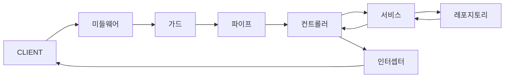
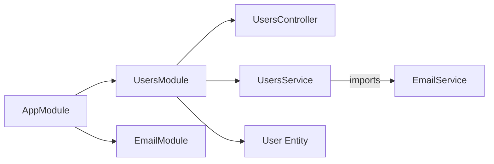
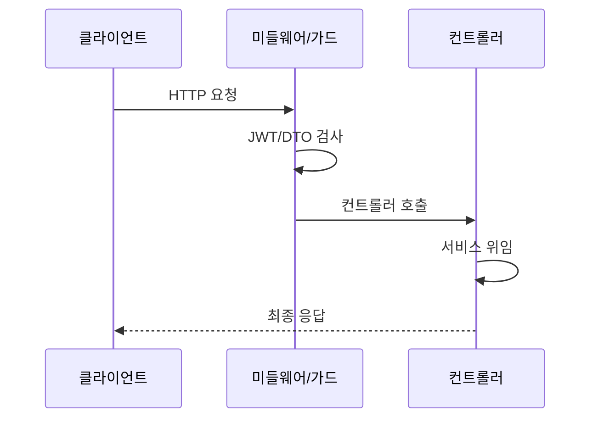
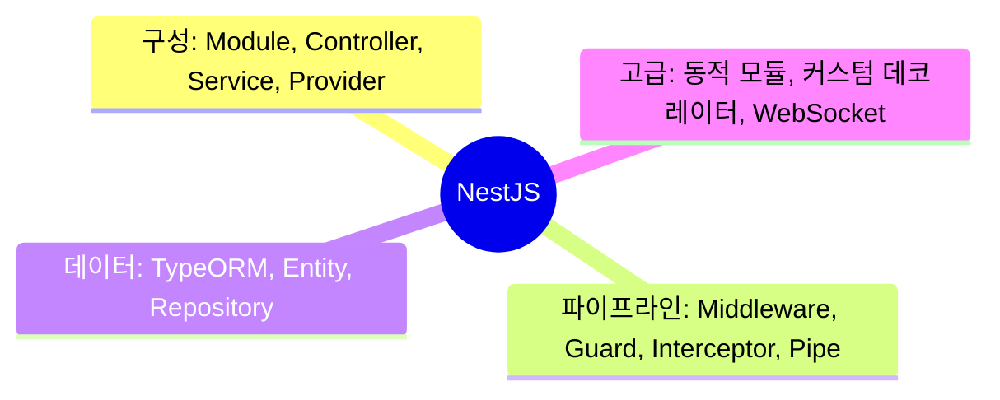

## Express로 충분하지 않은 이유

Express로 프로젝트를 시작하면 처음에는 빠릅니다. 파일 하나에 라우터, 비즈니스 로직, DB 접근 코드가 다 들어가도 동작은 합니다. 문제는 6개월 후입니다. 팀원이 늘어나고 기능이 쌓이면 "이 코드가 어디 있지?", "이 함수가 어디서 불리지?"가 반복됩니다.

NestJS는 Angular에서 영감을 받아 **모듈-컨트롤러-서비스**라는 삼층 구조를 강제합니다. 강제한다는 것이 포인트입니다. 구조를 강제하면 팀원이 바뀌어도 코드가 어디 있는지 예측할 수 있고, 테스트 작성이 쉬워집니다.

> 비유: NestJS의 구조는 대형 병원과 같습니다. 모듈은 각 진료과(내과, 외과), 컨트롤러는 접수창구, 서비스는 실제 진료하는 의사입니다. 병원에서 치과 업무가 내과 창구에서 처리되는 일은 없습니다. NestJS도 마찬가지입니다.

- **모듈 (Module)**: 각 진료과 — 관련 기능을 묶는 단위
- **컨트롤러 (Controller)**: 접수창구 — 요청을 받아 적절한 서비스에 전달
- **서비스 (Service)**: 의사 — 실제 비즈니스 로직 처리
- **가드 (Guard)**: 보안 요원 — 입장 권한 확인 (인증/인가)
- **파이프 (Pipe)**: 접수 폼 검증 — 데이터가 올바른지 확인
- **인터셉터 (Interceptor)**: 원무과 기록 — 모든 진료 전후 공통 처리

---

## 1번 다이어그램 - NestJS 요청 처리 파이프라인



이 파이프라인이 중요한 이유가 있습니다. 왜냐하면 인증, 로깅, 유효성 검사 같은 **횡단 관심사(Cross-cutting Concerns)**를 비즈니스 로직과 완전히 분리할 수 있기 때문입니다. 컨트롤러와 서비스는 순수하게 자신의 일만 합니다.

---

## 2. 모듈 — 기능의 경계선

모듈은 NestJS의 기본 구성 단위입니다. 관련된 컨트롤러, 서비스, 엔티티를 하나로 묶습니다. 모듈 경계를 잘 나누면 나중에 마이크로서비스로 분리하기도 쉬워집니다.

```typescript
// users/users.module.ts
@Module({
  imports: [
    TypeOrmModule.forFeature([User]), // 이 모듈에서 User 엔티티 사용
    EmailModule                        // 다른 모듈 가져오기
  ],
  controllers: [UsersController],
  providers: [UsersService],
  exports: [UsersService]              // 다른 모듈에서 UsersService를 쓸 수 있게 공개
})
export class UsersModule {}
```



> 비유: `exports`는 모듈의 공개 API입니다. exports에 포함되지 않은 서비스는 "이 진료과 내부에서만 쓰는 것"이고, exports에 포함된 서비스는 "다른 진료과에서도 의뢰할 수 있는 것"입니다.

---

## 3. 컨트롤러 — 요청을 받는 창구

컨트롤러는 HTTP 요청을 받아서 적절한 서비스 메서드를 호출하고 응답을 반환합니다. 비즈니스 로직은 없고 **라우팅과 요청/응답 처리만** 담당합니다.

```typescript
@ApiTags('users')
@Controller('users')
export class UsersController {
  constructor(private readonly usersService: UsersService) {}

  @Get()
  findAll(@Query('page') page = 1, @Query('limit') limit = 10) {
    return this.usersService.findAll({ page, limit });
  }

  @Get(':id')
  findOne(@Param('id', ParseIntPipe) id: number) {
    // ParseIntPipe가 파이프라인에서 문자열 ':id'를 숫자로 변환합니다
    return this.usersService.findOne(id);
  }

  @Post()
  @HttpCode(HttpStatus.CREATED)
  create(@Body() createUserDto: CreateUserDto) {
    return this.usersService.create(createUserDto);
  }

  @Patch(':id')
  @UseGuards(JwtAuthGuard) // 이 엔드포인트만 인증 필요
  update(
    @Param('id', ParseIntPipe) id: number,
    @Body() updateUserDto: UpdateUserDto
  ) {
    return this.usersService.update(id, updateUserDto);
  }

  @Delete(':id')
  @UseGuards(JwtAuthGuard)
  @HttpCode(HttpStatus.NO_CONTENT)
  remove(@Param('id', ParseIntPipe) id: number) {
    return this.usersService.remove(id);
  }
}
```

---

## 4. 서비스와 의존성 주입 — DI 컨테이너의 마법

서비스는 비즈니스 로직이 사는 곳입니다. `@Injectable()` 데코레이터를 붙이면 NestJS의 DI 컨테이너에 등록됩니다.

> 비유: DI 컨테이너는 인력 파견 회사와 같습니다. 서비스가 "저는 이메일 서비스가 필요합니다"라고 하면, 파견 회사(DI 컨테이너)가 알아서 EmailService 인스턴스를 만들어서 넘겨줍니다. 직접 `new EmailService()`를 할 필요가 없습니다.

```typescript
@Injectable()
export class UsersService {
  constructor(
    @InjectRepository(User)
    private readonly userRepository: Repository<User>,
    private readonly emailService: EmailService // NestJS가 자동으로 주입
  ) {}

  async findOne(id: number): Promise<User> {
    const user = await this.userRepository.findOne({ where: { id } });

    if (!user) {
      // NestJS 내장 예외 — 자동으로 404 응답으로 변환됩니다
      throw new NotFoundException(`ID ${id}의 사용자를 찾을 수 없습니다`);
    }

    return user;
  }

  async create(createUserDto: CreateUserDto): Promise<User> {
    const existing = await this.userRepository.findOne({
      where: { email: createUserDto.email }
    });

    if (existing) {
      throw new ConflictException('이미 사용 중인 이메일입니다');
    }

    const user = this.userRepository.create(createUserDto);
    const saved = await this.userRepository.save(user);

    // 이메일 서비스를 생성자에서 주입받았으므로 그냥 사용합니다
    await this.emailService.sendWelcomeEmail(saved.email, saved.name);

    return saved;
  }
}
```

만약 DI를 안 쓰면? 테스트할 때 `new UsersService(new UserRepository(...), new EmailService(...))`처럼 모든 의존성을 직접 만들어야 합니다. DI를 쓰면 테스트에서 가짜 서비스로 교체하기 쉬워집니다.

---

## 5. DTO와 ValidationPipe — 쓰레기는 들어오기 전에 막기

DTO(Data Transfer Object)는 "이 API는 이런 데이터를 받습니다"를 선언하는 클래스입니다. `ValidationPipe`와 함께 쓰면 잘못된 데이터가 서비스 코드까지 도달하기 전에 400 에러로 막을 수 있습니다.

> 비유: 병원 접수창구에서 "성함, 생년월일, 증상을 작성해 주세요"라는 서류(DTO)를 주고, 작성이 불완전하면 접수 자체를 거부합니다. 의사(서비스)는 항상 완전한 정보를 받습니다.

```typescript
export class CreateUserDto {
  @IsString()
  @MinLength(2, { message: '이름은 최소 2자 이상이어야 합니다' })
  @MaxLength(50)
  name: string;

  @IsEmail({}, { message: '올바른 이메일 형식이 아닙니다' })
  email: string;

  @IsString()
  @MinLength(8, { message: '비밀번호는 최소 8자 이상이어야 합니다' })
  password: string;

  @IsEnum(UserRole)
  @IsOptional()
  role?: UserRole = UserRole.USER;
}

// main.ts — 전역으로 ValidationPipe 적용
app.useGlobalPipes(new ValidationPipe({
  whitelist: true,            // DTO에 없는 필드 자동 제거 (보안)
  transform: true,            // 문자열 → 숫자 자동 변환
  forbidNonWhitelisted: true  // DTO에 없는 필드가 오면 400 에러
}));
```

`whitelist: true`가 중요한 이유가 있습니다. 왜냐하면 클라이언트가 `{ name: "홍길동", isAdmin: true }`처럼 DTO에 없는 필드를 보내도 자동으로 제거되기 때문입니다. 보안상 의도치 않은 필드가 DB에 저장되는 것을 막습니다.

---

## 6. 가드 — 인증/인가의 관문

가드는 특정 라우트에 대한 접근을 허용할지 거부할지 결정합니다. `canActivate()`가 `true`를 반환하면 통과, `false`를 반환하거나 예외를 던지면 거부됩니다.

```typescript
@Injectable()
export class JwtAuthGuard extends AuthGuard('jwt') {
  constructor(private reflector: Reflector) {
    super();
  }

  canActivate(context: ExecutionContext) {
    // @Public() 데코레이터가 있는 라우트는 인증 스킵
    const isPublic = this.reflector.getAllAndOverride<boolean>(IS_PUBLIC_KEY, [
      context.getHandler(),
      context.getClass()
    ]);

    if (isPublic) return true;

    return super.canActivate(context); // JWT 검증
  }
}

// 역할 기반 접근 제어
@Injectable()
export class RolesGuard implements CanActivate {
  canActivate(context: ExecutionContext): boolean {
    const requiredRoles = this.reflector.getAllAndOverride<UserRole[]>('roles', [
      context.getHandler(),
      context.getClass()
    ]);

    if (!requiredRoles) return true;

    const { user } = context.switchToHttp().getRequest();
    return requiredRoles.some(role => user.roles?.includes(role));
  }
}

// 컨트롤러에서 사용
@Get('admin')
@Roles(UserRole.ADMIN)
@UseGuards(JwtAuthGuard, RolesGuard)
adminOnly(@CurrentUser() user: User) {
  return this.usersService.getAdminData(user.id);
}
```

---

## 7. 인터셉터 — 공통 전후처리

인터셉터는 컨트롤러 실행 전후에 끼어들어 공통 처리를 합니다. RxJS Observable로 구현되어 있어서 응답을 변환하거나 캐싱 처리를 할 수 있습니다.

```typescript
// 모든 응답에 { success: true, data: ..., timestamp: ... } 형태 적용
@Injectable()
export class ResponseTransformInterceptor<T> implements NestInterceptor<T> {
  intercept(context: ExecutionContext, next: CallHandler): Observable<any> {
    const now = Date.now();

    return next.handle().pipe(
      map(data => ({
        success: true,
        data,
        timestamp: new Date().toISOString()
      })),
      tap(() => {
        const { method, url } = context.switchToHttp().getRequest();
        console.log(`${method} ${url} - ${Date.now() - now}ms`);
      })
    );
  }
}
```

---

## 2번 다이어그램 - 전체 요청 흐름 시퀀스



---


## 극한 시나리오

### 순환 의존성

모듈 A가 모듈 B를 임포트하고, 모듈 B가 다시 모듈 A를 임포트하면 DI 컨테이너가 초기화할 때 무한 루프에 빠집니다.

```typescript
// 해결: forwardRef() 사용
@Module({
  imports: [forwardRef(() => OrdersModule)],
})
export class UsersModule {}

@Injectable()
export class UsersService {
  constructor(
    @Inject(forwardRef(() => OrdersService))
    private ordersService: OrdersService,
  ) {}
}
```

순환 의존성이 자주 발생한다면, 두 모듈이 공통 기능에 의존하는 구조로 리팩토링하는 것이 근본 해결책입니다. `forwardRef`는 임시 처방입니다.

### ValidationPipe의 whitelist가 데이터를 삭제한다

`whitelist: true` 설정 시 DTO에 정의되지 않은 속성이 자동으로 제거됩니다. 클라이언트가 보낸 필드가 사라져 버그처럼 보일 수 있습니다. 이것은 버그가 아니라 의도된 보안 동작입니다.

```typescript
// whitelist: true 설정 시
// 클라이언트: { name: '홍길동', hackerField: 'inject' }
// 서비스 도달: { name: '홍길동' }  ← hackerField 제거됨 (보안)

// forbidNonWhitelisted: true 추가 시
// 알 수 없는 속성이 있으면 400 에러 반환 (더 엄격한 보안)
```

---
## 3번 다이어그램 - NestJS 정리



NestJS는 **Angular에서 영감을 받은 아키텍처**로, 규모가 커져도 유지보수 가능한 백엔드를 만들기 위한 강제적인 구조를 제공합니다. 처음에는 보일러플레이트가 많다고 느낄 수 있습니다. 하지만 팀이 커지고 기능이 복잡해질수록, 이 구조가 있느냐 없느냐의 차이는 엄청납니다. 6개월 후의 자신을 위해 구조를 투자하는 것입니다.

---

## 왜 NestJS인가?

| 프레임워크 | 구조 강제 | TypeScript | DI 컨테이너 | 학습 곡선 | 적합한 규모 |
|-----------|---------|-----------|------------|---------|-----------|
| **Express** | 없음 | 선택 | 없음 | 낮음 | 소규모, 프로토타입 |
| **Fastify** | 없음 | 선택 | 없음 | 낮음 | 고성능 소규모 |
| **NestJS** | 강제 (Module/Controller/Service) | 기본 | 내장 | 높음 | 중~대규모 팀 |
| **Hapi** | 중간 | 선택 | 플러그인 | 중간 | 중규모 |

NestJS는 구조가 없어서 생기는 혼돈을 방지합니다. 팀원이 어디에 코드를 두어야 할지 고민할 필요가 없고, 코드 리뷰에서 구조 논쟁이 사라집니다. Express는 자유롭지만 5명 이상 팀에서 일관성 유지가 어렵습니다.

---

## 실무에서 자주 하는 실수

**실수 1. Service를 Controller에 직접 new로 생성**

```typescript
// 위험: DI를 우회해 테스트 불가, 싱글톤 보장 없음
@Controller('users')
export class UsersController {
  private usersService = new UsersService(); // DI 컨테이너 미사용
}

// 올바른 방법: 생성자 주입
@Controller('users')
export class UsersController {
  constructor(private readonly usersService: UsersService) {}
}
```

**실수 2. Module imports 누락으로 "Cannot resolve dependency" 에러**

```typescript
// 에러: OrdersModule에서 UsersService를 쓰려면 UsersModule을 import해야 함
@Module({
  controllers: [OrdersController],
  providers: [OrdersService], // UsersService 미포함 → 에러
})
export class OrdersModule {}

// 올바른 방법: UsersModule을 imports에 추가
@Module({
  imports: [UsersModule], // UsersModule이 UsersService를 exports해야 함
  controllers: [OrdersController],
  providers: [OrdersService],
})
export class OrdersModule {}
```

**실수 3. Guard와 Interceptor, Middleware의 역할 혼동**

```typescript
// Middleware: 요청/응답 객체 수정, 로깅 — NestJS 컨텍스트 없음
// Guard: 인증/인가 — true/false 반환, 실행 컨텍스트 접근 가능
// Interceptor: 응답 변환, 캐싱, 실행 시간 측정 — before + after 처리
// Pipe: 입력 유효성 검사 및 변환

// 인증은 Guard, 응답 포맷 통일은 Interceptor, 입력 검증은 Pipe
@UseGuards(JwtAuthGuard)
@UseInterceptors(TransformInterceptor)
@UsePipes(ValidationPipe)
async getUser() {}
```

**실수 4. TypeORM N+1 문제 방치**

```typescript
// 위험: 유저마다 orders를 별도 쿼리로 로드 (N+1)
const users = await this.usersRepo.find();
for (const user of users) {
  user.orders = await this.ordersRepo.find({ where: { userId: user.id } });
}

// 올바른 방법: relations로 JOIN 한 번에 처리
const users = await this.usersRepo.find({
  relations: { orders: true },
});
// 또는 QueryBuilder로 명시적 JOIN
```

**실수 5. Global Exception Filter 없이 에러 응답 불일치**

```typescript
// 각 컨트롤러마다 try/catch 중복, 에러 포맷 제각각

// 올바른 방법: 전역 Exception Filter로 통일
@Catch()
export class AllExceptionsFilter implements ExceptionFilter {
  catch(exception: unknown, host: ArgumentsHost) {
    const ctx = host.switchToHttp();
    const response = ctx.getResponse<Response>();
    const status = exception instanceof HttpException
      ? exception.getStatus()
      : HttpStatus.INTERNAL_SERVER_ERROR;
    response.status(status).json({ statusCode: status, message: '...' });
  }
}
// main.ts: app.useGlobalFilters(new AllExceptionsFilter());
```

---

## 면접 포인트

**Q1. NestJS의 DI(의존성 주입)가 왜 테스트에 유리한가요?**

DI 컨테이너가 의존성을 외부에서 주입하므로 테스트 시 실제 구현 대신 Mock을 주입할 수 있습니다. `Test.createTestingModule()`로 테스트 모듈을 만들고, `{ provide: UsersService, useValue: mockUsersService }`로 Mock을 교체합니다. 데이터베이스 연결 없이 순수한 비즈니스 로직만 단위 테스트할 수 있습니다.

**Q2. NestJS의 실행 파이프라인 순서를 설명하세요.**

요청이 들어오면 순서대로: Middleware → Guard → Interceptor(before) → Pipe → Controller Handler → Interceptor(after) → Exception Filter(에러 시). Guard에서 false를 반환하면 403, Pipe에서 검증 실패 시 400, Exception Filter가 나머지 에러를 처리합니다.

**Q3. `@Module()` decorator의 imports와 providers의 차이는?**

`providers`는 현재 모듈 내에서 DI 컨테이너에 등록할 클래스입니다. `imports`는 다른 모듈을 가져와 그 모듈이 `exports`한 providers를 현재 모듈에서 사용할 수 있게 합니다. 다른 모듈의 Service를 사용하려면 그 모듈이 `exports`에 Service를 등록하고, 사용하는 모듈이 `imports`에 그 모듈을 추가해야 합니다.

**Q4. Interceptor로 응답 포맷을 통일하는 방법은?**

`NestInterceptor`를 구현하고 `intercept(context, next)`에서 `next.handle().pipe(map(data => ({ success: true, data })))`로 모든 응답을 래핑합니다. `APP_INTERCEPTOR` 토큰으로 전역 등록하면 모든 엔드포인트에 자동 적용됩니다. Exception Filter와 조합해 성공/실패 응답 포맷을 완전히 통일합니다.

**Q5. NestJS와 Express를 혼용할 수 있나요?**

가능합니다. NestJS는 기본적으로 Express 위에서 동작하므로 `app.use()`로 Express 미들웨어를 그대로 사용할 수 있습니다. `@nestjs/platform-fastify`로 교체하면 Fastify 기반으로 전환됩니다. 단, Fastify로 교체 시 Express 전용 미들웨어는 호환되지 않을 수 있습니다. 기존 Express 미들웨어 생태계 활용이 필요하면 플랫폼을 Express로 유지합니다.
