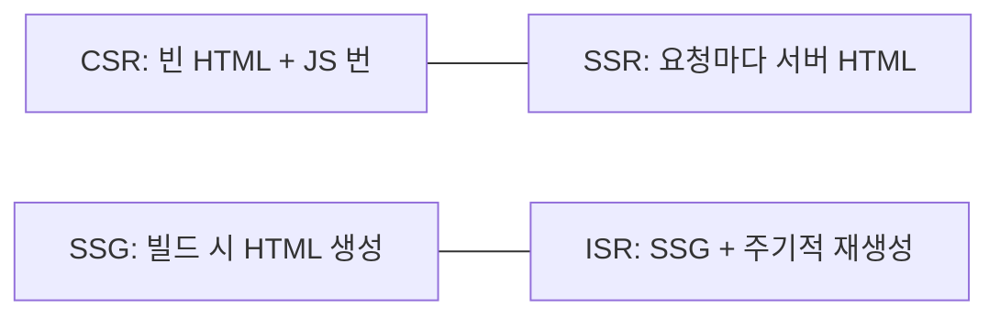
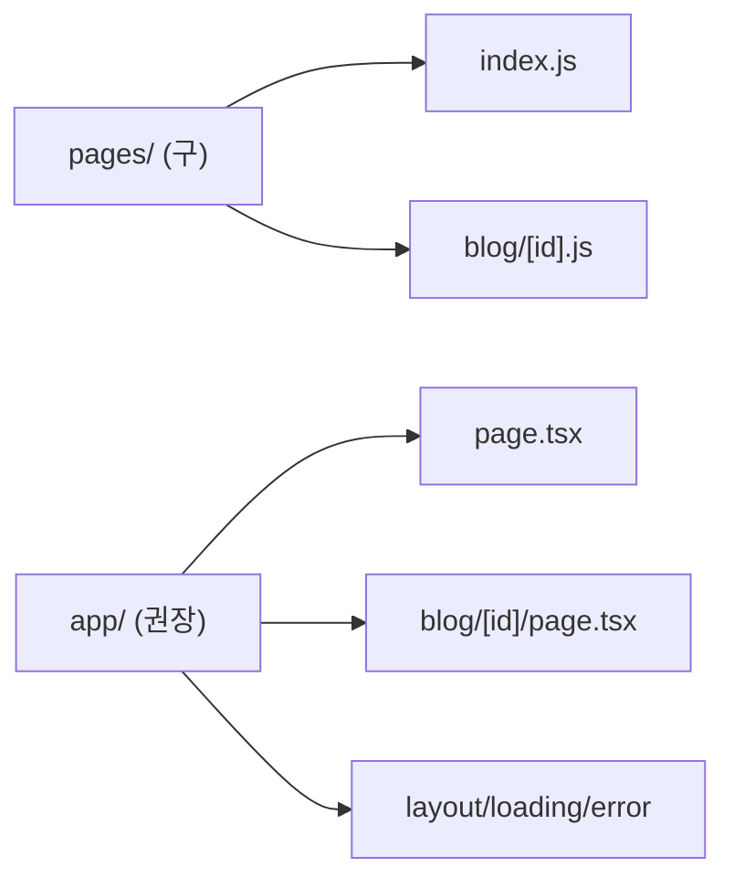
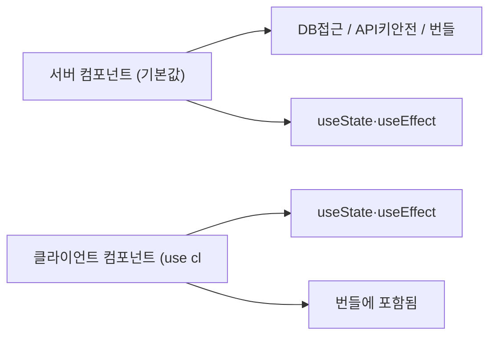
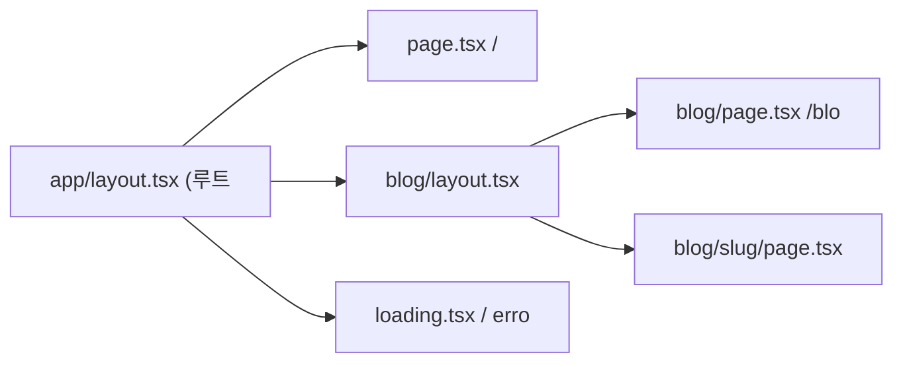
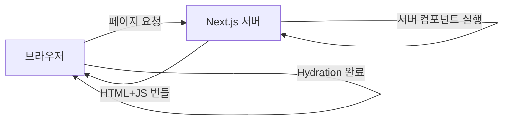

## 음식점 준비 방식으로 이해하기

같은 음식도 어떻게 준비하느냐에 따라 속도와 신선도가 달라집니다.

- **CSR (Client-Side Rendering)**: 손님이 주문하면 그때 조리 시작. 첫 번째 접시가 나오는데 오래 걸리지만, 그 다음부터는 빠릅니다.
- **SSR (Server-Side Rendering)**: 주문이 들어오면 즉시 조리해서 바로 제공. 항상 신선하지만 요리사(서버)가 바쁩니다.
- **SSG (Static Site Generation)**: 미리 대량으로 만들어 포장해 둠. 손님이 오면 즉시 제공. 매우 빠르지만 메뉴가 고정됩니다.
- **ISR (Incremental Static Regeneration)**: 포장해 두되, 일정 시간마다 새로 만들어 교체. 빠르면서도 메뉴가 주기적으로 업데이트됩니다.

왜 Next.js가 이 네 가지를 다 지원할까요? 이유는 페이지마다 적합한 전략이 다르기 때문입니다. 블로그 글은 SSG가 좋고, 사용자별 대시보드는 SSR이 필요하고, 장바구니는 CSR이 어울립니다.

---

## 1번 다이어그램 - 렌더링 전략 비교



| 전략 | 렌더링 시점 | 속도 | 신선도 | 적합한 경우 |
|------|-----------|------|--------|------------|
| CSR | 브라우저 | 초기 느림 | 항상 최신 | 대시보드, SPA |
| SSR | 요청마다 | 중간 | 항상 최신 | 사용자별 페이지 |
| SSG | 빌드 시 | 매우 빠름 | 빌드 시점 | 블로그, 문서 |
| ISR | 빌드+주기 | 빠름 | 거의 최신 | 상품 목록, 뉴스 |

---

## 2. App Router vs Pages Router

Next.js 13에서 App Router가 도입되었습니다. Pages Router는 기존 방식으로, 현재도 동작하지만 App Router가 공식 권장 방식입니다.



App Router의 가장 큰 변화는 **서버 컴포넌트**입니다. 모든 컴포넌트가 기본적으로 서버에서만 실행됩니다. 클라이언트에서 실행이 필요한 컴포넌트만 `'use client'`를 선언합니다.

---

## 3. 서버 컴포넌트 vs 클라이언트 컴포넌트

서버 컴포넌트가 중요한 이유가 있습니다. 왜냐하면 **자바스크립트 번들에 포함되지 않기 때문**입니다. DB 접근 라이브러리, 데이터 변환 로직이 아무리 무거워도 클라이언트로 전송되지 않습니다.

> 비유: 식당에서 요리사(서버 컴포넌트)는 주방에만 있고, 서빙 직원(클라이언트 컴포넌트)만 손님 테이블에 나옵니다. 요리사가 어떤 도구를 쓰는지 손님은 알 필요가 없습니다.

```jsx
// app/page.tsx — 기본이 서버 컴포넌트
async function HomePage() {
  // 서버에서 직접 DB에 접근할 수 있습니다 — 이 코드는 브라우저로 전달되지 않음
  const posts = await db.post.findMany({ take: 10 });

  return (
    <main>
      <h1>블로그</h1>
      {posts.map(post => (
        <PostCard key={post.id} post={post} />
      ))}
    </main>
  );
}

// 클라이언트 컴포넌트 — 인터랙션이 필요할 때만 선언
'use client';

import { useState } from 'react';

function LikeButton({ postId, initialCount }) {
  const [count, setCount] = useState(initialCount);
  const [liked, setLiked] = useState(false);

  const handleLike = async () => {
    setLiked(true);
    setCount(c => c + 1);
    await fetch(`/api/posts/${postId}/like`, { method: 'POST' });
  };

  return (
    <button onClick={handleLike}>
      {liked ? '좋아요 취소' : '좋아요'} {count}
    </button>
  );
}
```



---

## 4. 데이터 페칭 패턴 — fetch 옵션 하나로 전략이 결정된다

App Router에서는 `fetch` 함수의 옵션 하나로 SSG, SSR, ISR 중 무엇을 쓸지 결정합니다.

```typescript
// SSG: 빌드 시 한 번 가져와서 영구 캐시 (기본값)
async function ProductsPage() {
  const products = await fetch('https://api.example.com/products', {
    cache: 'force-cache' // 빌드 시점의 데이터를 계속 사용
  }).then(r => r.json());

  return <ProductList products={products} />;
}

// SSR: 매 요청마다 새 데이터 (캐시 없음)
async function DynamicPage() {
  const data = await fetch('https://api.example.com/data', {
    cache: 'no-store' // 캐시하지 않음 → 매 요청마다 서버에서 실행
  }).then(r => r.json());

  return <DataDisplay data={data} />;
}

// ISR: 1시간마다 백그라운드에서 재검증
async function NewsPage() {
  const news = await fetch('https://api.example.com/news', {
    next: { revalidate: 3600 } // 3600초 = 1시간마다 재검증
  }).then(r => r.json());

  return <NewsList news={news} />;
}

// 동적 경로의 SSG — 인기 글 1000개만 미리 생성, 나머지는 요청 시 생성
export async function generateStaticParams() {
  const popularPosts = await db.post.findMany({
    orderBy: { views: 'desc' },
    take: 1000,
    select: { id: true }
  });
  return popularPosts.map(post => ({ id: String(post.id) }));
}
```

---

## 5번 다이어그램 - App Router 파일 컨벤션



```
app/
├── layout.tsx          # 루트 레이아웃 (필수, 모든 페이지에 적용)
├── page.tsx            # / 페이지
├── loading.tsx         # 로딩 UI — Suspense fallback 자동 처리
├── error.tsx           # 에러 UI — Error Boundary 자동 처리
├── not-found.tsx       # 404 페이지
├── blog/
│   ├── page.tsx        # /blog 페이지
│   └── [slug]/
│       └── page.tsx    # /blog/:slug
├── (marketing)/        # 그룹 — URL에 포함되지 않음
│   ├── about/page.tsx  # /about
│   └── contact/page.tsx
└── api/
    └── users/route.ts  # /api/users API Route
```

---

## 6. API Routes — 풀스택 프레임워크의 핵심

Next.js는 API 서버도 됩니다. `app/api/` 아래에 `route.ts` 파일을 만들면 됩니다.

```typescript
// app/api/users/route.ts
export async function GET(request: NextRequest) {
  const { searchParams } = new URL(request.url);
  const page = Number(searchParams.get('page') ?? '1');

  const users = await db.user.findMany({
    skip: (page - 1) * 10,
    take: 10
  });

  return NextResponse.json({ users, page });
}

export async function POST(request: NextRequest) {
  const body = await request.json();

  if (!body.name || !body.email) {
    return NextResponse.json(
      { error: '이름과 이메일은 필수입니다' },
      { status: 400 }
    );
  }

  const user = await db.user.create({ data: body });
  return NextResponse.json(user, { status: 201 });
}
```

---

## 7. 미들웨어 — 요청이 페이지에 닿기 전에

미들웨어는 모든 요청에 대해 실행됩니다. 인증, A/B 테스트, 국제화처럼 모든 페이지에 공통으로 적용할 로직을 여기에 둡니다.

```typescript
// middleware.ts (루트 레벨)
export function middleware(request: NextRequest) {
  const { pathname } = request.nextUrl;

  // 인증이 필요한 페이지 보호
  const token = request.cookies.get('token')?.value;
  if (pathname.startsWith('/dashboard') && !token) {
    return NextResponse.redirect(new URL('/login', request.url));
  }

  return NextResponse.next();
}

// 미들웨어가 실행될 경로 설정
export const config = {
  matcher: ['/((?!api|_next/static|_next/image|favicon.ico).*)']
};
```

---

## 8. Hydration — 서버에서 만든 HTML에 생명 불어넣기

SSR/SSG 페이지는 서버에서 완성된 HTML을 보내지만, 클릭이나 입력 같은 인터랙션은 자바스크립트가 붙어야 가능합니다. 이 과정을 Hydration이라고 합니다.



### Hydration 불일치 문제

서버에서 렌더링한 HTML과 클라이언트에서 렌더링한 결과가 다르면 Hydration Error가 발생합니다.

```jsx
// 잘못된 예 — 서버와 클라이언트의 시간이 다름
function CurrentTime() {
  return <p>{new Date().toLocaleString()}</p>;
}

// 올바른 예 — useEffect로 클라이언트에서만 시간 설정
function CurrentTime() {
  const [time, setTime] = useState('');

  useEffect(() => {
    setTime(new Date().toLocaleString());
  }, []);

  return <p>{time || '로딩 중...'}</p>;
}
```

왜 이런 문제가 생길까요? 이유는 서버에서 HTML을 만들 때와 브라우저에서 React가 실행될 때의 시간이 다르기 때문입니다. React는 두 결과가 같아야 한다고 기대합니다.

---

## 9. 서버 액션 — API Route 없이 서버 코드 호출

서버 액션은 클라이언트 컴포넌트에서 직접 서버 함수를 호출할 수 있게 합니다. API Route를 만들 필요가 없어집니다.

> 비유: 예전에는 손님(클라이언트)이 주문을 메모해서 서빙 직원(API Route)을 통해 주방(서버)에 전달했습니다. 서버 액션은 손님이 직통 전화(Server Action)로 주방에 직접 주문하는 것과 같습니다.

```typescript
// app/actions.ts
'use server'; // 이 파일의 함수는 서버에서만 실행됩니다

import { revalidatePath } from 'next/cache';
import { redirect } from 'next/navigation';

export async function createPost(formData: FormData) {
  const title = formData.get('title') as string;
  const content = formData.get('content') as string;

  // 서버에서 직접 DB 쓰기 — API Route 없이
  await db.post.create({ data: { title, content } });

  // 관련 캐시 무효화
  revalidatePath('/blog');

  redirect('/blog');
}

// 컴포넌트에서 사용
function CreatePostForm() {
  return (
    <form action={createPost}>
      <input name="title" placeholder="제목" required />
      <textarea name="content" placeholder="내용" required />
      <button type="submit">작성</button>
    </form>
  );
}
```

---

**실전 구현 — SSG/SSR/ISR/CSR 완전한 페이지 컴포넌트:**

```typescript
// 1. SSG — 블로그 포스트 목록 (빌드 시 생성, 변경 거의 없음)
// app/blog/page.tsx
export const dynamic = 'force-static'; // 명시적 SSG 선언

async function getBlogPosts(): Promise<Post[]> {
    const res = await fetch('https://api.example.com/posts', {
        cache: 'force-cache',  // 빌드 시 캐시, 이후 캐시 재사용
    });
    if (!res.ok) throw new Error('Failed to fetch posts');
    return res.json();
}

export default async function BlogListPage() {
    const posts = await getBlogPosts();

    return (
        <main>
            <h1>블로그</h1>
            <ul>
                {posts.map(post => (
                    <li key={post.id}>
                        <a href={`/blog/${post.slug}`}>{post.title}</a>
                        <time>{new Date(post.createdAt).toLocaleDateString('ko-KR')}</time>
                    </li>
                ))}
            </ul>
        </main>
    );
}

// 2. ISR — 상품 목록 (1시간마다 재검증, 자주 바뀌지만 실시간 불필요)
// app/products/page.tsx
async function getProducts(): Promise<Product[]> {
    const res = await fetch('https://api.example.com/products', {
        next: { revalidate: 3600 },  // 1시간마다 백그라운드 재검증
    });
    return res.json();
}

export default async function ProductsPage() {
    const products = await getProducts();
    return (
        <section>
            <h1>상품 목록</h1>
            <div className="grid">
                {products.map(p => (
                    <ProductCard key={p.id} product={p} />
                ))}
            </div>
        </section>
    );
}

// 동적 경로 SSG — 인기 상품 200개만 빌드 시 생성
// app/products/[id]/page.tsx
export async function generateStaticParams() {
    const products = await fetch('https://api.example.com/products/popular?limit=200')
        .then(r => r.json());
    return products.map((p: Product) => ({ id: String(p.id) }));
}

export default async function ProductDetailPage({ params }: { params: { id: string } }) {
    const product = await fetch(`https://api.example.com/products/${params.id}`, {
        next: { revalidate: 3600 },
    }).then(r => r.json());

    return (
        <article>
            <h1>{product.name}</h1>
            <p>₩{product.price.toLocaleString()}</p>
            <p>재고: {product.stock}개</p>
        </article>
    );
}

// 3. SSR — 사용자별 대시보드 (매 요청마다 최신 데이터)
// app/dashboard/page.tsx
import { cookies } from 'next/headers';

export const dynamic = 'force-dynamic'; // 명시적 SSR 선언 (캐시 없음)

async function getUserDashboard(userId: string) {
    const res = await fetch(`https://api.example.com/users/${userId}/dashboard`, {
        cache: 'no-store',  // 캐시 완전 비활성화 → 매 요청마다 서버 실행
        headers: { 'X-User-Id': userId },
    });
    return res.json();
}

export default async function DashboardPage() {
    const cookieStore = cookies();
    const userId = cookieStore.get('userId')?.value;

    if (!userId) {
        redirect('/login');
    }

    const dashboard = await getUserDashboard(userId);

    return (
        <div>
            <h1>안녕하세요, {dashboard.userName}님</h1>
            <p>미읽은 알림: {dashboard.unreadCount}개</p>
            <p>오늘 주문: {dashboard.todayOrders}건</p>
        </div>
    );
}

// 4. CSR — 실시간 장바구니 (클라이언트에서만 관리)
// components/CartPanel.tsx
'use client';

import { useState, useEffect } from 'react';

export function CartPanel() {
    const [cartItems, setCartItems] = useState<CartItem[]>([]);
    const [isLoading, setIsLoading] = useState(true);

    useEffect(() => {
        // 클라이언트에서만 실행: localStorage + 서버 동기화
        const localCart = JSON.parse(localStorage.getItem('cart') ?? '[]');
        setCartItems(localCart);
        setIsLoading(false);
    }, []);

    const removeItem = (id: string) => {
        const updated = cartItems.filter(item => item.id !== id);
        setCartItems(updated);
        localStorage.setItem('cart', JSON.stringify(updated));
    };

    if (isLoading) return <CartSkeleton />;

    return (
        <aside>
            <h2>장바구니 ({cartItems.length})</h2>
            {cartItems.map(item => (
                <div key={item.id}>
                    <span>{item.name}</span>
                    <span>₩{item.price.toLocaleString()}</span>
                    <button onClick={() => removeItem(item.id)}>삭제</button>
                </div>
            ))}
            <p>합계: ₩{cartItems.reduce((s, i) => s + i.price, 0).toLocaleString()}</p>
        </aside>
    );
}

// 5. API Route — /api/products (GET, POST)
// app/api/products/route.ts
import { NextRequest, NextResponse } from 'next/server';

export async function GET(request: NextRequest) {
    const { searchParams } = new URL(request.url);
    const category = searchParams.get('category') ?? 'all';
    const page = Number(searchParams.get('page') ?? '1');

    const products = await productService.findAll({ category, page, limit: 20 });
    const total = await productService.count({ category });

    return NextResponse.json({
        data: products,
        pagination: { page, total, totalPages: Math.ceil(total / 20) }
    });
}

export async function POST(request: NextRequest) {
    // 인증 확인
    const token = request.headers.get('Authorization')?.replace('Bearer ', '');
    const user = await verifyToken(token);
    if (!user || user.role !== 'admin') {
        return NextResponse.json({ error: 'Forbidden' }, { status: 403 });
    }

    const body = await request.json();
    const { name, price, stock } = body;

    if (!name || price == null || stock == null) {
        return NextResponse.json(
            { error: '필수 필드 누락: name, price, stock' },
            { status: 400 }
        );
    }

    const product = await productService.create({ name, price, stock });
    return NextResponse.json(product, { status: 201 });
}
```

## 3번 다이어그램 - Next.js 정리

mindmap root((Next.js)) 렌더링

Next.js는 단순한 React 프레임워크가 아니라 **풀스택 프레임워크**입니다. 렌더링 전략을 페이지별로 다르게 설정할 수 있다는 점이 가장 강력한 기능입니다. "이 페이지가 얼마나 자주 바뀌는가? 사용자별로 다른 데이터가 필요한가?"라는 질문으로 전략을 결정하세요. 대부분의 경우 SSG + ISR 조합이 성능과 신선도의 최선의 균형입니다.

---

## 왜 Next.js인가?

| 프레임워크 | SSR/SSG | App Router | 번들러 내장 | 풀스택 | 학습 곡선 |
|-----------|--------|-----------|-----------|-------|---------|
| **Next.js** | 네이티브 지원 | App Router (React Server Components) | Turbopack | API Routes + Server Actions | 중간 |
| **Remix** | SSR 중심 | 없음 | Vite | Loader/Action | 중간 |
| **Gatsby** | SSG 중심 | 없음 | Webpack | 플러그인 | 높음 |
| **Vite + React** | 별도 설정 필요 | 없음 | Vite | 없음 | 낮음 |

SEO가 필요하거나 초기 로딩 성능이 중요한 프로젝트에서 Next.js는 사실상 표준입니다. CSR만으로 충분한 관리자 대시보드라면 Vite + React가 더 단순합니다.

---

## 실무에서 자주 하는 실수

**실수 1. 서버 컴포넌트에서 useState/useEffect 사용**

```typescript
// 에러: Server Component는 브라우저 API, Hook 사용 불가
// app/page.tsx (기본은 Server Component)
export default function Page() {
  const [count, setCount] = useState(0); // Error!
  return <div>{count}</div>;
}

// 올바른 방법: 'use client' 지시어 추가
'use client';
export default function Counter() {
  const [count, setCount] = useState(0);
  return <button onClick={() => setCount(c => c + 1)}>{count}</button>;
}
```

**실수 2. getServerSideProps를 남발해 정적 최적화 포기**

```typescript
// 불필요: 데이터가 거의 안 바뀌는데 매 요청마다 DB 조회
export async function getServerSideProps() {
  const data = await fetchBlogPosts(); // 1시간에 한 번 바뀌는 데이터
  return { props: { data } };
}

// 올바른 방법: ISR로 주기적 재생성
export async function getStaticProps() {
  const data = await fetchBlogPosts();
  return { props: { data }, revalidate: 3600 }; // 1시간마다 재생성
}
```

**실수 3. Image 컴포넌트 미사용으로 LCP 저하**

```tsx
// 비최적화: 브라우저가 원본 크기 그대로 다운로드


// 올바른 방법: Next.js Image로 자동 최적화
import Image from 'next/image';
<Image
  src="/hero.png"
  alt="hero"
  width={1200}
  height={600}
  priority // LCP 이미지는 priority 필수
/>
// WebP 변환, 뷰포트에 맞는 크기 제공, lazy loading 자동 처리
```

**실수 4. API Route에서 CORS 설정 누락**

```typescript
// app/api/data/route.ts
export async function GET() {
  // CORS 헤더 없음 → 다른 도메인에서 호출 시 차단
  return Response.json({ data: [] });
}

// 올바른 방법: middleware.ts에서 CORS 헤더 추가
export function middleware(request: NextRequest) {
  const response = NextResponse.next();
  response.headers.set('Access-Control-Allow-Origin', 'https://app.example.com');
  return response;
}
```

**실수 5. 환경변수 NEXT_PUBLIC_ 접두사 혼동**

```bash
# NEXT_PUBLIC_ 없음: 서버에서만 접근 가능 (DB 비밀번호 등)
DATABASE_URL=postgresql://...

# NEXT_PUBLIC_ 있음: 클라이언트 번들에 포함 (공개 API 키만)
NEXT_PUBLIC_API_URL=https://api.example.com
```

```typescript
// 클라이언트에서 DATABASE_URL 접근 시 undefined
const url = process.env.DATABASE_URL; // 서버: OK, 클라이언트: undefined
```

---

## 면접 포인트

**Q1. SSR, SSG, ISR, CSR의 차이와 각각 언제 사용하나요?**

SSR(서버사이드 렌더링)은 매 요청마다 서버에서 HTML을 생성합니다. 개인화된 데이터(대시보드, 마이페이지)에 적합합니다. SSG(정적 생성)는 빌드 시 HTML을 미리 생성합니다. 거의 바뀌지 않는 콘텐츠(블로그, 문서)에 최적입니다. ISR(증분 정적 재생성)은 SSG + 주기적 재생성으로 성능과 신선도를 균형합니다. CSR은 클라이언트에서 데이터를 가져오며 SEO가 불필요한 경우에 사용합니다.

**Q2. React Server Components(RSC)와 기존 SSR의 차이는?**

기존 SSR은 전체 페이지를 서버에서 렌더링해 HTML로 보내고, 클라이언트에서 하이드레이션합니다. RSC는 컴포넌트 단위로 서버/클라이언트를 구분합니다. 서버 컴포넌트는 번들에 포함되지 않아 JS 크기를 줄이고, 직접 DB에 접근할 수 있습니다. 클라이언트 컴포넌트(`use client`)만 하이드레이션됩니다. RSC는 스트리밍과 Suspense로 점진적 UI 로딩도 지원합니다.

**Q3. Next.js App Router와 Pages Router의 주요 차이는?**

App Router(Next.js 13+)는 `app/` 디렉토리를 사용하며 React Server Components가 기본입니다. 중첩 레이아웃(`layout.tsx`), Streaming, Server Actions를 지원합니다. Pages Router는 `pages/` 디렉토리를 사용하며 `getServerSideProps`/`getStaticProps`로 데이터를 가져옵니다. 신규 프로젝트는 App Router가 권장이지만, 기존 Pages Router 프로젝트는 혼용도 가능합니다.

**Q4. Next.js에서 SEO를 최적화하는 방법은?**

App Router에서는 `metadata` 객체 또는 `generateMetadata` 함수로 동적 메타태그를 설정합니다. `next/image`로 LCP를 개선하고, `priority` prop으로 첫 화면 이미지를 미리 로드합니다. SSG/ISR로 크롤러가 완성된 HTML을 받도록 합니다. `next-sitemap`으로 sitemap.xml을 자동 생성하고, `robots.txt`를 `app/robots.ts`로 관리합니다.

**Q5. Server Actions란 무엇이며 기존 API Route와 어떻게 다른가요?**

Server Actions는 클라이언트 컴포넌트에서 서버 함수를 직접 호출하는 방식입니다. `'use server'` 지시어를 붙인 함수는 자동으로 API 엔드포인트로 변환됩니다. 폼 제출이나 데이터 변경에서 별도 API Route 없이 서버 로직을 실행할 수 있어 코드가 간결해집니다. 단, 내부적으로 POST 요청을 생성하므로 CSRF 방어가 Next.js에 의해 자동 처리됩니다.
