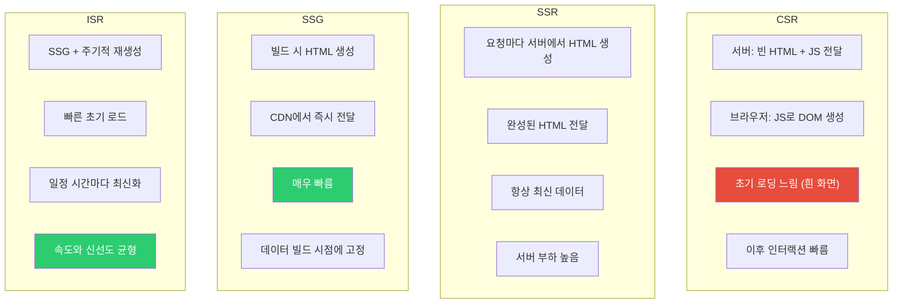
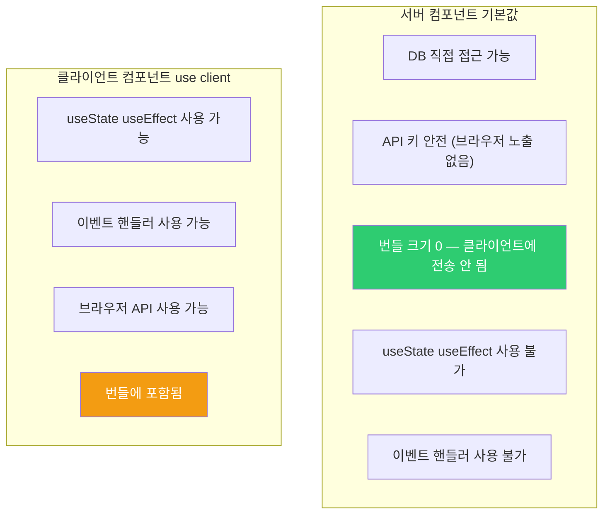
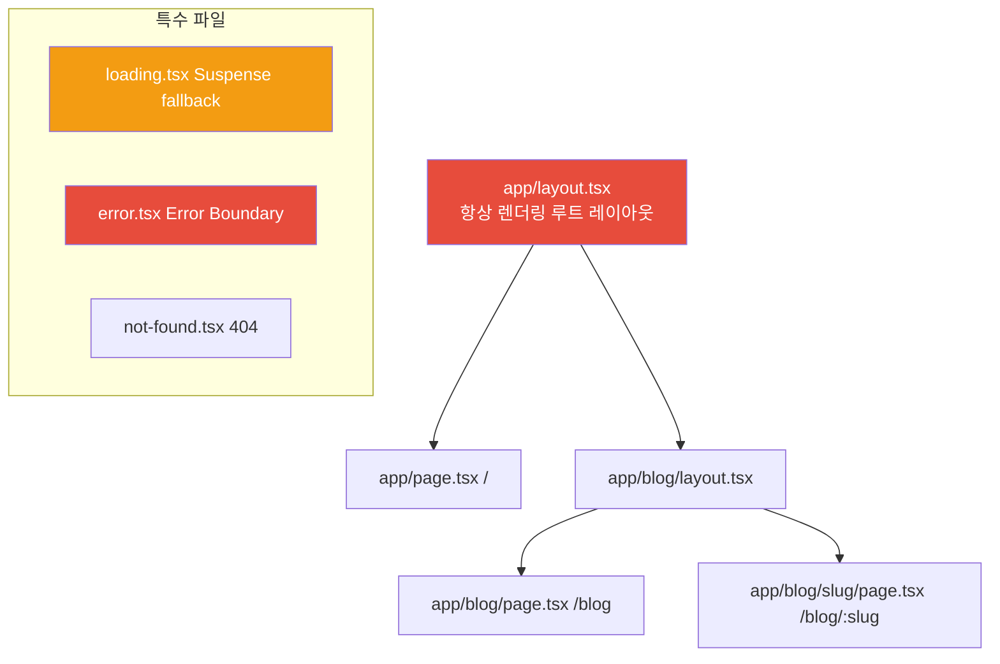
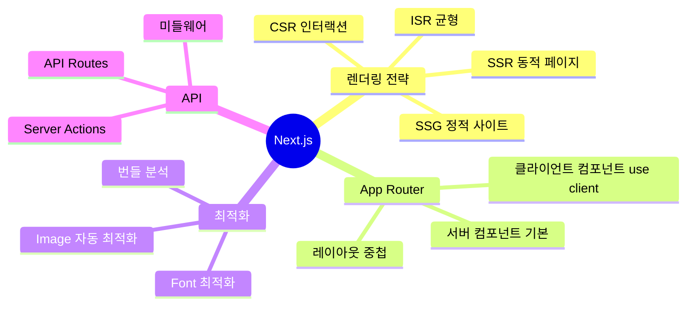

## 음식점 준비 방식으로 이해하기

같은 음식도 어떻게 준비하느냐에 따라 속도와 신선도가 달라집니다.

- **CSR (Client-Side Rendering)**: 손님이 주문하면 그때 조리 시작. 첫 번째 접시가 나오는데 오래 걸리지만, 그 다음부터는 빠릅니다.
- **SSR (Server-Side Rendering)**: 주문이 들어오면 즉시 조리해서 바로 제공. 항상 신선하지만 요리사(서버)가 바쁩니다.
- **SSG (Static Site Generation)**: 미리 대량으로 만들어 포장해 둠. 손님이 오면 즉시 제공. 매우 빠르지만 메뉴가 고정됩니다.
- **ISR (Incremental Static Regeneration)**: 포장해 두되, 일정 시간마다 새로 만들어 교체. 빠르면서도 메뉴가 주기적으로 업데이트됩니다.

왜 Next.js가 이 네 가지를 다 지원할까요? 이유는 페이지마다 적합한 전략이 다르기 때문입니다. 블로그 글은 SSG가 좋고, 사용자별 대시보드는 SSR이 필요하고, 장바구니는 CSR이 어울립니다.

---

## 1번 다이어그램 - 렌더링 전략 비교



| 전략 | 렌더링 시점 | 속도 | 신선도 | 적합한 경우 |
|------|-----------|------|--------|------------|
| CSR | 브라우저 | 초기 느림 | 항상 최신 | 대시보드, SPA |
| SSR | 요청마다 | 중간 | 항상 최신 | 사용자별 페이지 |
| SSG | 빌드 시 | 매우 빠름 | 빌드 시점 | 블로그, 문서 |
| ISR | 빌드+주기 | 빠름 | 거의 최신 | 상품 목록, 뉴스 |

---

## 2. App Router vs Pages Router

Next.js 13에서 App Router가 도입되었습니다. Pages Router는 기존 방식으로, 현재도 동작하지만 App Router가 공식 권장 방식입니다.


App Router의 가장 큰 변화는 **서버 컴포넌트**입니다. 모든 컴포넌트가 기본적으로 서버에서만 실행됩니다. 클라이언트에서 실행이 필요한 컴포넌트만 `'use client'`를 선언합니다.

---

## 3. 서버 컴포넌트 vs 클라이언트 컴포넌트

서버 컴포넌트가 중요한 이유가 있습니다. 왜냐하면 **자바스크립트 번들에 포함되지 않기 때문**입니다. DB 접근 라이브러리, 데이터 변환 로직이 아무리 무거워도 클라이언트로 전송되지 않습니다.

> 비유: 식당에서 요리사(서버 컴포넌트)는 주방에만 있고, 서빙 직원(클라이언트 컴포넌트)만 손님 테이블에 나옵니다. 요리사가 어떤 도구를 쓰는지 손님은 알 필요가 없습니다.

```jsx
// app/page.tsx — 기본이 서버 컴포넌트
async function HomePage() {
  // 서버에서 직접 DB에 접근할 수 있습니다 — 이 코드는 브라우저로 전달되지 않음
  const posts = await db.post.findMany({ take: 10 });

  return (
    <main>
      <h1>블로그</h1>
      {posts.map(post => (
        <PostCard key={post.id} post={post} />
      ))}
    </main>
  );
}

// 클라이언트 컴포넌트 — 인터랙션이 필요할 때만 선언
'use client';

import { useState } from 'react';

function LikeButton({ postId, initialCount }) {
  const [count, setCount] = useState(initialCount);
  const [liked, setLiked] = useState(false);

  const handleLike = async () => {
    setLiked(true);
    setCount(c => c + 1);
    await fetch(`/api/posts/${postId}/like`, { method: 'POST' });
  };

  return (
    <button onClick={handleLike}>
      {liked ? '좋아요 취소' : '좋아요'} {count}
    </button>
  );
}
```



---

## 4. 데이터 페칭 패턴 — fetch 옵션 하나로 전략이 결정된다

App Router에서는 `fetch` 함수의 옵션 하나로 SSG, SSR, ISR 중 무엇을 쓸지 결정합니다.

```typescript
// SSG: 빌드 시 한 번 가져와서 영구 캐시 (기본값)
async function ProductsPage() {
  const products = await fetch('https://api.example.com/products', {
    cache: 'force-cache' // 빌드 시점의 데이터를 계속 사용
  }).then(r => r.json());

  return <ProductList products={products} />;
}

// SSR: 매 요청마다 새 데이터 (캐시 없음)
async function DynamicPage() {
  const data = await fetch('https://api.example.com/data', {
    cache: 'no-store' // 캐시하지 않음 → 매 요청마다 서버에서 실행
  }).then(r => r.json());

  return <DataDisplay data={data} />;
}

// ISR: 1시간마다 백그라운드에서 재검증
async function NewsPage() {
  const news = await fetch('https://api.example.com/news', {
    next: { revalidate: 3600 } // 3600초 = 1시간마다 재검증
  }).then(r => r.json());

  return <NewsList news={news} />;
}

// 동적 경로의 SSG — 인기 글 1000개만 미리 생성, 나머지는 요청 시 생성
export async function generateStaticParams() {
  const popularPosts = await db.post.findMany({
    orderBy: { views: 'desc' },
    take: 1000,
    select: { id: true }
  });
  return popularPosts.map(post => ({ id: String(post.id) }));
}
```

---

## 5번 다이어그램 - App Router 파일 컨벤션



```
app/
├── layout.tsx          # 루트 레이아웃 (필수, 모든 페이지에 적용)
├── page.tsx            # / 페이지
├── loading.tsx         # 로딩 UI — Suspense fallback 자동 처리
├── error.tsx           # 에러 UI — Error Boundary 자동 처리
├── not-found.tsx       # 404 페이지
├── blog/
│   ├── page.tsx        # /blog 페이지
│   └── [slug]/
│       └── page.tsx    # /blog/:slug
├── (marketing)/        # 그룹 — URL에 포함되지 않음
│   ├── about/page.tsx  # /about
│   └── contact/page.tsx
└── api/
    └── users/route.ts  # /api/users API Route
```

---

## 6. API Routes — 풀스택 프레임워크의 핵심

Next.js는 API 서버도 됩니다. `app/api/` 아래에 `route.ts` 파일을 만들면 됩니다.

```typescript
// app/api/users/route.ts
export async function GET(request: NextRequest) {
  const { searchParams } = new URL(request.url);
  const page = Number(searchParams.get('page') ?? '1');

  const users = await db.user.findMany({
    skip: (page - 1) * 10,
    take: 10
  });

  return NextResponse.json({ users, page });
}

export async function POST(request: NextRequest) {
  const body = await request.json();

  if (!body.name || !body.email) {
    return NextResponse.json(
      { error: '이름과 이메일은 필수입니다' },
      { status: 400 }
    );
  }

  const user = await db.user.create({ data: body });
  return NextResponse.json(user, { status: 201 });
}
```

---

## 7. 미들웨어 — 요청이 페이지에 닿기 전에

미들웨어는 모든 요청에 대해 실행됩니다. 인증, A/B 테스트, 국제화처럼 모든 페이지에 공통으로 적용할 로직을 여기에 둡니다.

```typescript
// middleware.ts (루트 레벨)
export function middleware(request: NextRequest) {
  const { pathname } = request.nextUrl;

  // 인증이 필요한 페이지 보호
  const token = request.cookies.get('token')?.value;
  if (pathname.startsWith('/dashboard') && !token) {
    return NextResponse.redirect(new URL('/login', request.url));
  }

  return NextResponse.next();
}

// 미들웨어가 실행될 경로 설정
export const config = {
  matcher: ['/((?!api|_next/static|_next/image|favicon.ico).*)']
};
```

---

## 8. Hydration — 서버에서 만든 HTML에 생명 불어넣기

SSR/SSG 페이지는 서버에서 완성된 HTML을 보내지만, 클릭이나 입력 같은 인터랙션은 자바스크립트가 붙어야 가능합니다. 이 과정을 Hydration이라고 합니다.


### Hydration 불일치 문제

서버에서 렌더링한 HTML과 클라이언트에서 렌더링한 결과가 다르면 Hydration Error가 발생합니다.

```jsx
// 잘못된 예 — 서버와 클라이언트의 시간이 다름
function CurrentTime() {
  return <p>{new Date().toLocaleString()}</p>;
}

// 올바른 예 — useEffect로 클라이언트에서만 시간 설정
function CurrentTime() {
  const [time, setTime] = useState('');

  useEffect(() => {
    setTime(new Date().toLocaleString());
  }, []);

  return <p>{time || '로딩 중...'}</p>;
}
```

왜 이런 문제가 생길까요? 이유는 서버에서 HTML을 만들 때와 브라우저에서 React가 실행될 때의 시간이 다르기 때문입니다. React는 두 결과가 같아야 한다고 기대합니다.

---

## 9. 서버 액션 — API Route 없이 서버 코드 호출

서버 액션은 클라이언트 컴포넌트에서 직접 서버 함수를 호출할 수 있게 합니다. API Route를 만들 필요가 없어집니다.

> 비유: 예전에는 손님(클라이언트)이 주문을 메모해서 서빙 직원(API Route)을 통해 주방(서버)에 전달했습니다. 서버 액션은 손님이 직통 전화(Server Action)로 주방에 직접 주문하는 것과 같습니다.

```typescript
// app/actions.ts
'use server'; // 이 파일의 함수는 서버에서만 실행됩니다

import { revalidatePath } from 'next/cache';
import { redirect } from 'next/navigation';

export async function createPost(formData: FormData) {
  const title = formData.get('title') as string;
  const content = formData.get('content') as string;

  // 서버에서 직접 DB 쓰기 — API Route 없이
  await db.post.create({ data: { title, content } });

  // 관련 캐시 무효화
  revalidatePath('/blog');

  redirect('/blog');
}

// 컴포넌트에서 사용
function CreatePostForm() {
  return (
    <form action={createPost}>
      <input name="title" placeholder="제목" required />
      <textarea name="content" placeholder="내용" required />
      <button type="submit">작성</button>
    </form>
  );
}
```

---

## 3번 다이어그램 - Next.js 정리



Next.js는 단순한 React 프레임워크가 아니라 **풀스택 프레임워크**입니다. 렌더링 전략을 페이지별로 다르게 설정할 수 있다는 점이 가장 강력한 기능입니다. "이 페이지가 얼마나 자주 바뀌는가? 사용자별로 다른 데이터가 필요한가?"라는 질문으로 전략을 결정하세요. 대부분의 경우 SSG + ISR 조합이 성능과 신선도의 최선의 균형입니다.
