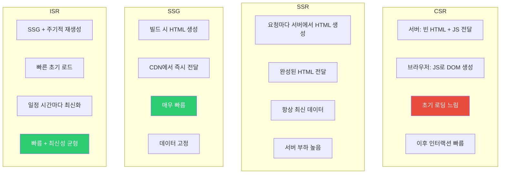
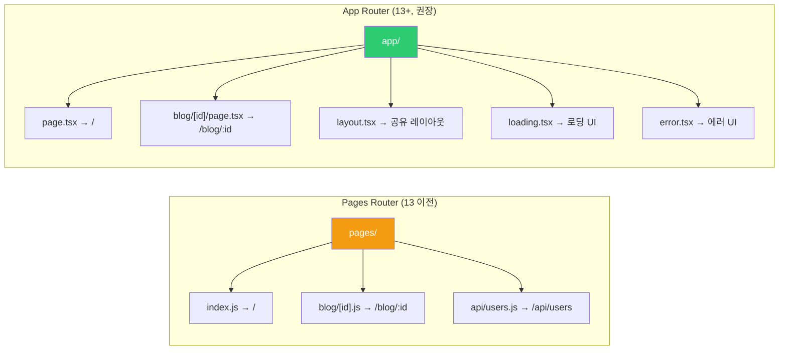
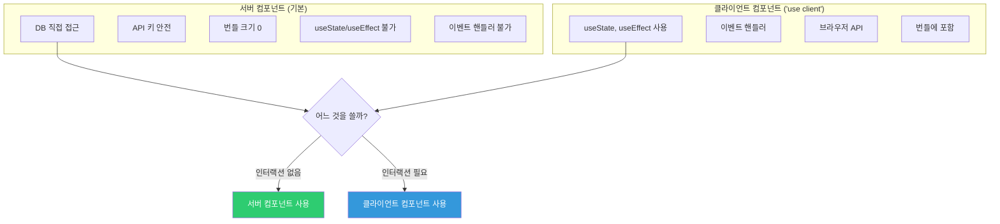
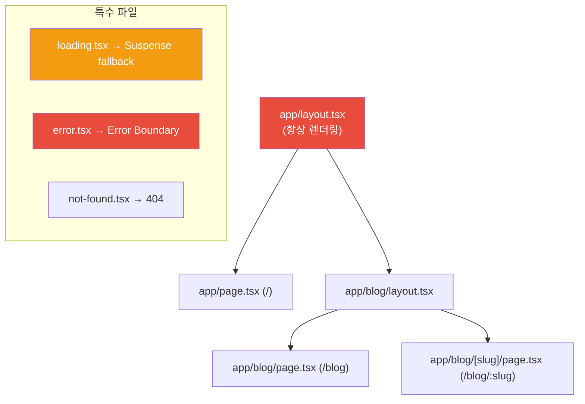
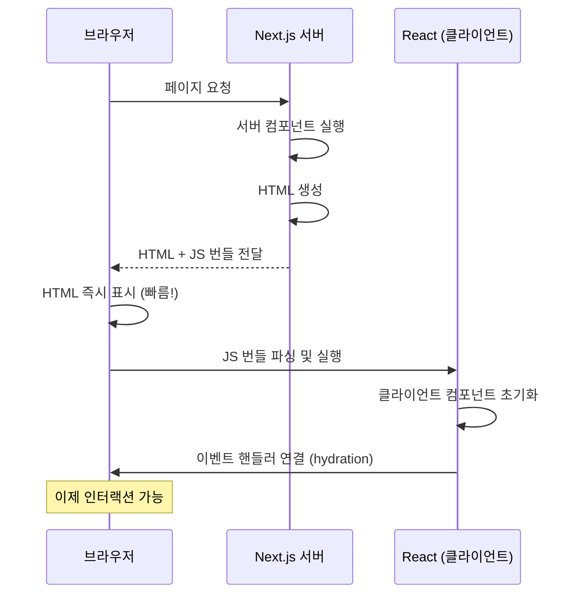
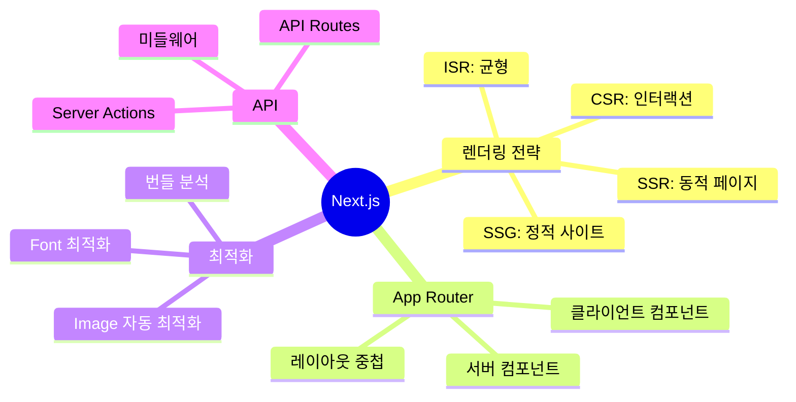

## 음식점 메뉴 준비 방식

같은 음식도 어떻게 준비하느냐에 따라 속도와 신선도가 다릅니다.

- **CSR (Client-Side Rendering)**: 주문 후 주방에서 즉석 조리. 처음엔 느리지만 이후 빠름.
- **SSR (Server-Side Rendering)**: 주문 들어오면 즉시 조리 후 제공. 항상 신선하지만 대기 시간 있음.
- **SSG (Static Site Generation)**: 미리 대량 조리해 포장. 제공 즉시 빠르지만 메뉴 고정.
- **ISR (Incremental Static Regeneration)**: 포장해두되, 일정 시간마다 재조리. 빠르면서 최신성 유지.

---

## 1. 렌더링 전략 비교



| 전략 | 렌더링 시점 | 속도 | 신선도 | 적합한 경우 |
|------|-----------|------|--------|------------|
| CSR | 브라우저 | 초기 느림 | 항상 최신 | 대시보드, SPA |
| SSR | 요청마다 | 중간 | 항상 최신 | 사용자별 페이지 |
| SSG | 빌드 시 | 매우 빠름 | 빌드 시점 | 블로그, 문서 |
| ISR | 빌드+주기 | 빠름 | 거의 최신 | 상품 목록, 뉴스 |

---

## 2. Next.js App Router vs Pages Router



---

## 3. App Router - 서버 컴포넌트

```jsx
// app/page.tsx - 기본적으로 서버 컴포넌트
async function HomePage() {
  // 서버에서 직접 DB 접근 가능
  const posts = await db.post.findMany({ take: 10 });

  return (
    <main>
      <h1>블로그</h1>
      {posts.map(post => (
        <PostCard key={post.id} post={post} />
      ))}
    </main>
  );
}

// 클라이언트 컴포넌트 명시 (인터랙션 필요 시)
'use client';

import { useState } from 'react';

function LikeButton({ postId, initialCount }) {
  const [count, setCount] = useState(initialCount);
  const [liked, setLiked] = useState(false);

  const handleLike = async () => {
    setLiked(true);
    setCount(c => c + 1);
    await fetch(`/api/posts/${postId}/like`, { method: 'POST' });
  };

  return (
    <button onClick={handleLike}>
      {liked ? '❤️' : '🤍'} {count}
    </button>
  );
}
```

### 서버 컴포넌트 vs 클라이언트 컴포넌트



---

## 4. 데이터 페칭 패턴

### App Router에서의 데이터 페칭

```typescript
// app/products/page.tsx

// SSG: 빌드 시 데이터 가져오기 (기본)
async function ProductsPage() {
  const products = await fetch('https://api.example.com/products', {
    cache: 'force-cache' // 캐시 사용 (SSG 동작)
  }).then(r => r.json());

  return <ProductList products={products} />;
}

// SSR: 매 요청마다 새 데이터
async function DynamicPage() {
  const data = await fetch('https://api.example.com/data', {
    cache: 'no-store' // 캐시 안 함 (SSR 동작)
  }).then(r => r.json());

  return <DataDisplay data={data} />;
}

// ISR: 주기적 재검증
async function NewsPage() {
  const news = await fetch('https://api.example.com/news', {
    next: { revalidate: 3600 } // 1시간마다 재검증
  }).then(r => r.json());

  return <NewsList news={news} />;
}

// 동적 params로 SSG
export async function generateStaticParams() {
  const posts = await fetch('https://api.example.com/posts').then(r => r.json());

  return posts.map(post => ({ id: String(post.id) }));
}

async function PostPage({ params }: { params: { id: string } }) {
  const post = await fetch(`https://api.example.com/posts/${params.id}`, {
    next: { revalidate: 60 }
  }).then(r => r.json());

  return <Post post={post} />;
}
```

---

## 5. 라우팅 시스템

### App Router 파일 컨벤션

```
app/
├── layout.tsx          # 루트 레이아웃 (필수)
├── page.tsx            # / 페이지
├── loading.tsx         # 로딩 UI
├── error.tsx           # 에러 UI
├── not-found.tsx       # 404 페이지
├── blog/
│   ├── page.tsx        # /blog 페이지
│   └── [slug]/
│       ├── page.tsx    # /blog/:slug
│       └── loading.tsx # /blog/:slug 로딩
├── (marketing)/        # 그룹 (URL에 포함 안 됨)
│   ├── about/page.tsx  # /about
│   └── contact/page.tsx # /contact
└── @modal/             # 병렬 라우트
    └── (.)photo/[id]/page.tsx # 인터셉트 라우트
```



---

## 6. API Routes

```typescript
// app/api/users/route.ts
import { NextRequest, NextResponse } from 'next/server';

// GET /api/users
export async function GET(request: NextRequest) {
  const { searchParams } = new URL(request.url);
  const page = Number(searchParams.get('page') ?? '1');

  const users = await db.user.findMany({
    skip: (page - 1) * 10,
    take: 10
  });

  return NextResponse.json({ users, page });
}

// POST /api/users
export async function POST(request: NextRequest) {
  const body = await request.json();

  // 유효성 검사
  if (!body.name || !body.email) {
    return NextResponse.json(
      { error: '이름과 이메일은 필수입니다' },
      { status: 400 }
    );
  }

  const user = await db.user.create({ data: body });

  return NextResponse.json(user, { status: 201 });
}

// app/api/users/[id]/route.ts
export async function GET(
  request: NextRequest,
  { params }: { params: { id: string } }
) {
  const user = await db.user.findUnique({
    where: { id: params.id }
  });

  if (!user) {
    return NextResponse.json({ error: '사용자를 찾을 수 없습니다' }, { status: 404 });
  }

  return NextResponse.json(user);
}
```

---

## 7. 미들웨어

```typescript
// middleware.ts (루트 레벨)
import { NextResponse } from 'next/server';
import type { NextRequest } from 'next/server';

export function middleware(request: NextRequest) {
  const { pathname } = request.nextUrl;

  // 1. 인증 확인
  const token = request.cookies.get('token')?.value;

  if (pathname.startsWith('/dashboard') && !token) {
    return NextResponse.redirect(new URL('/login', request.url));
  }

  // 2. A/B 테스트
  const bucket = request.cookies.get('ab-test')?.value ?? 'a';
  const response = NextResponse.next();
  response.headers.set('x-ab-test', bucket);

  // 3. 국제화
  if (!pathname.startsWith('/ko') && !pathname.startsWith('/en')) {
    return NextResponse.redirect(new URL(`/ko${pathname}`, request.url));
  }

  return response;
}

// 미들웨어 적용 경로 설정
export const config = {
  matcher: ['/((?!api|_next/static|_next/image|favicon.ico).*)']
};
```

---

## 8. Hydration



### Hydration 불일치 문제

```jsx
// 서버와 클라이언트 렌더링이 다른 경우 Hydration Error

// 잘못된 예
function CurrentTime() {
  return <p>{new Date().toLocaleString()}</p>;
  // 서버와 클라이언트의 시간이 다름 → 불일치!
}

// 올바른 예
function CurrentTime() {
  const [time, setTime] = useState('');

  useEffect(() => {
    setTime(new Date().toLocaleString());
  }, []);

  return <p>{time || '로딩 중...'}</p>;
}

// 또는 suppressHydrationWarning 사용 (주의해서)
function CurrentTime() {
  return <p suppressHydrationWarning>{new Date().toLocaleString()}</p>;
}
```

---

## 9. 최적화 기능들

### Image 컴포넌트

```jsx
import Image from 'next/image';

// 자동 최적화: WebP 변환, lazy loading, CLS 방지
function OptimizedImages() {
  return (
    <div>
      {/* 로컬 이미지 */}
      <Image
        src="/hero.jpg"
        alt="히어로"
        width={1200}
        height={600}
        priority // LCP 이미지
        quality={85}
      />

      {/* 원격 이미지 */}
      <Image
        src="https://example.com/photo.jpg"
        alt="원격 이미지"
        fill // 부모 컨테이너 채우기
        style={{ objectFit: 'cover' }}
      />
    </div>
  );
}
```

### Font 최적화

```javascript
// app/layout.tsx
import { Inter, Noto_Sans_KR } from 'next/font/google';

const inter = Inter({
  subsets: ['latin'],
  display: 'swap',
  variable: '--font-inter'
});

const notoSansKr = Noto_Sans_KR({
  subsets: ['latin'],
  weight: ['400', '700'],
  display: 'swap',
  variable: '--font-noto'
});

export default function RootLayout({ children }) {
  return (
    <html lang="ko" className={`${inter.variable} ${notoSansKr.variable}`}>
      <body>{children}</body>
    </html>
  );
}
```

---

## 10. 서버 액션 (Server Actions)

```typescript
// app/actions.ts
'use server';

import { revalidatePath } from 'next/cache';
import { redirect } from 'next/navigation';

export async function createPost(formData: FormData) {
  const title = formData.get('title') as string;
  const content = formData.get('content') as string;

  // 서버에서 직접 DB 쓰기
  await db.post.create({ data: { title, content } });

  // 캐시 재검증
  revalidatePath('/blog');

  // 리다이렉트
  redirect('/blog');
}

// 컴포넌트에서 사용
function CreatePostForm() {
  return (
    <form action={createPost}>
      <input name="title" placeholder="제목" required />
      <textarea name="content" placeholder="내용" required />
      <button type="submit">작성</button>
    </form>
  );
}
```

---

## 11. 극한 시나리오 - 대규모 SSG

```typescript
// 10만 개 페이지를 SSG로 생성해야 할 때

// 문제: 빌드 시간이 너무 길어짐
export async function generateStaticParams() {
  const allPosts = await db.post.findMany({ select: { id: true } });
  return allPosts.map(post => ({ id: String(post.id) }));
  // 10만개 → 빌드에 수 시간
}

// 해결: 인기 있는 것만 SSG, 나머지는 ISR 또는 SSR
export async function generateStaticParams() {
  // 상위 1000개만 미리 생성
  const popularPosts = await db.post.findMany({
    orderBy: { views: 'desc' },
    take: 1000,
    select: { id: true }
  });
  return popularPosts.map(post => ({ id: String(post.id) }));
}

// 나머지는 요청 시 생성 (ISR)
export const dynamicParams = true; // 기본값, 없는 경우 생성

async function PostPage({ params }) {
  const post = await db.post.findUnique({
    where: { id: params.id }
  });

  if (!post) notFound();

  return <Post post={post} />;
}
```

---

## 12. 정리



Next.js는 단순한 React 프레임워크가 아니라, **풀스택 프레임워크**입니다. 서버 컴포넌트로 번들 크기를 줄이고, 다양한 렌더링 전략으로 최적의 사용자 경험을 제공할 수 있습니다.
