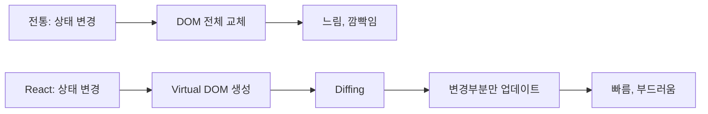
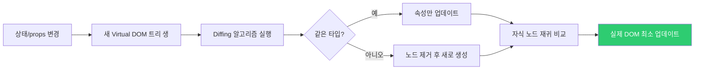
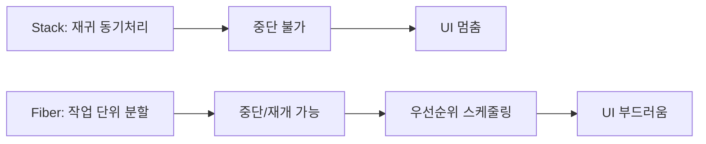
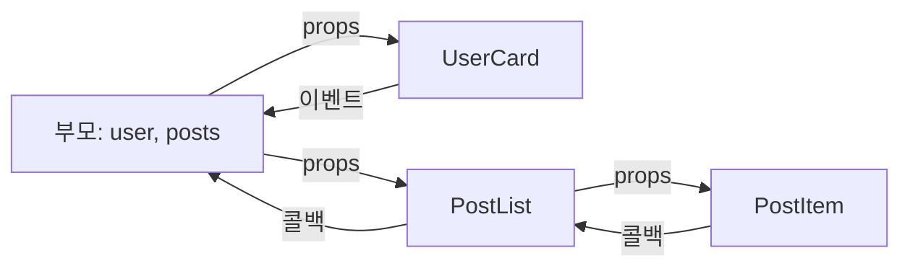
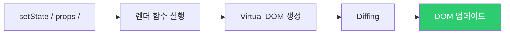
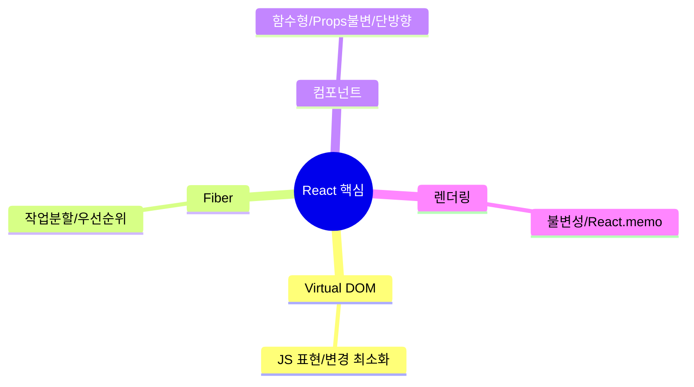

## "전체를 다시 그리지 않는다"는 아이디어

IKEA 가구를 조립한 뒤 서랍 하나가 마음에 안 든다면, 가구 전체를 분해하고 다시 조립하지 않습니다. 그 서랍만 빼서 교체합니다. 당연한 이야기지만, 웹 개발에서는 오랫동안 이게 당연하지 않았습니다.

전통적인 방식은 데이터가 바뀌면 `innerHTML`로 HTML을 통째로 다시 그렸습니다. 빠르게 깜빡이거나, 입력 중인 텍스트가 날아가거나, 스크롤 위치가 초기화되는 문제가 생겼습니다.

React가 해결한 것이 바로 이것입니다. **"변경된 부분만 정확히 찾아서 최소한으로 업데이트한다."** 이것이 Virtual DOM의 핵심 아이디어입니다.

> 비유: 건물 관리자가 매일 아침 설계도(Virtual DOM)를 들고 건물을 돌면서 실제 건물과 다른 곳을 찾아 그 부분만 고칩니다. 건물 전체를 허물고 다시 짓지 않습니다.

---

## 1번 다이어그램 - React가 해결한 것



---

## 2. Virtual DOM — 실제 DOM의 가벼운 복사본

Virtual DOM은 실제 DOM을 자바스크립트 객체로 표현한 것입니다. 실제 DOM을 직접 조작하는 것보다 훨씬 빠릅니다. 왜냐하면 실제 DOM은 레이아웃, 스타일 계산 등 많은 작업을 동반하지만 자바스크립트 객체는 그냥 메모리에 있기 때문입니다.

```javascript
// 실제 DOM (브라우저가 관리)
// <div class="container">
//   <h1>안녕하세요</h1>
//   <p>React 학습 중</p>
// </div>

// Virtual DOM (React가 내부적으로 관리하는 자바스크립트 객체)
const virtualDOM = {
  type: 'div',
  props: { className: 'container' },
  children: [
    { type: 'h1', props: {}, children: ['안녕하세요'] },
    { type: 'p', props: {}, children: ['React 학습 중'] }
  ]
};
```

### JSX는 createElement 호출로 변환됩니다

JSX는 HTML처럼 보이지만 자바스크립트입니다. 브라우저는 JSX를 직접 이해하지 못하므로, 빌드 단계에서 `React.createElement` 호출로 변환됩니다.

```jsx
// 개발자가 작성하는 JSX
const element = (
  <div className="container">
    <h1>안녕하세요</h1>
  </div>
);

// 빌드 후 실제로 실행되는 코드 (React 17 이전)
const element = React.createElement(
  'div',
  { className: 'container' },
  React.createElement('h1', null, '안녕하세요')
);
```

---

## 3. Reconciliation — 무엇이 바뀌었는지 찾기

상태가 변경되면 React는 새 Virtual DOM을 만들고, 이전 Virtual DOM과 비교해서 실제 DOM에서 무엇을 바꿔야 할지 계산합니다. 이 과정을 Reconciliation(재조정)이라고 합니다.



### Diffing 규칙 1 — 타입이 다르면 전체 교체

```jsx
// 이전
<div><Counter /></div>

// 다음 — div가 span으로 바뀜
<span><Counter /></span>
// Counter는 언마운트 후 새로 마운트됨 → state 초기화!
```

이것을 모르면 컴포넌트가 갑자기 state를 잃어버리는 버그를 이해할 수 없습니다.

### Diffing 규칙 2 — key로 리스트 최적화

```jsx
// key 없음 — 맨 앞에 추가하면?
['사과', '바나나', '딸기'].map(fruit => <li>{fruit}</li>);

// '포도'를 맨 앞에 추가하면 React는
// 사과→포도, 바나나→사과, 딸기→바나나, (새로)딸기 처럼 인식 → 비효율

// key 있음 — 정확하게 추가된 것만 처리
['사과', '바나나', '딸기'].map(fruit => <li key={fruit}>{fruit}</li>);
// '포도'를 맨 앞에 추가하면 포도만 새로 추가됐다고 정확히 인식
```

> 비유: 출석부에 이름 대신 번호만 있으면, 1번 자리에 새 학생이 오면 기존 학생들이 모두 자리를 바꾼 것처럼 처리됩니다. 이름(key)이 있으면 새 학생만 새 자리에 배정합니다.

---

## 4. React Fiber — 작업을 잘게 쪼개다

React 16에서 Fiber라는 새 재조정 엔진이 도입되었습니다. Fiber 이전에는 Virtual DOM 비교 작업이 동기적으로 진행되어 중단할 수 없었습니다. 큰 트리를 처리하다가 UI가 수백 밀리초 동안 멈추는 문제가 있었습니다.

> 비유: 기존 방식은 화물차 한 대에 모든 짐을 싣고 가는 것입니다. 짐이 많으면 출발까지 오래 기다려야 합니다. Fiber는 짐을 작은 택배로 나눠서 중요한 것부터 먼저 보냅니다.



Fiber는 두 단계로 나뉩니다. **Render Phase**는 비동기로 중단 가능하고, **Commit Phase**는 실제 DOM을 바꾸는 작업이라 동기적으로 한 번에 처리합니다.

---

## 5. JSX 심층 이해 — HTML이 아니다

JSX는 HTML처럼 보이지만 자바스크립트입니다. 몇 가지 중요한 차이가 있습니다.

```jsx
// 1. 하나의 루트 요소만 반환 가능
// 틀림
return (
  <h1>제목</h1>
  <p>단락</p>  // SyntaxError
);

// 맞음 — div로 감싸거나
return (
  <div>
    <h1>제목</h1>
    <p>단락</p>
  </div>
);

// 맞음 — Fragment 사용 (DOM에 요소 추가 없이)
return (
  <>
    <h1>제목</h1>
    <p>단락</p>
  </>
);

// 2. JavaScript 표현식은 중괄호로
const name = '홍길동';
const element = <h1>안녕하세요, {name}님</h1>;

// 3. class 대신 className
const el = <div className="container"></div>;

// 4. 이벤트는 camelCase
const btn = <button onClick={handleClick}>클릭</button>;

// 5. 조건부 렌더링
const content = (
  <div>
    {isLoggedIn ? <UserPanel /> : <LoginForm />}
    {hasError && <ErrorMessage />}
  </div>
);
```

---

## 6. Props와 단방향 데이터 흐름

React에서 데이터는 **항상 부모에서 자식으로만 흐릅니다.** 자식이 부모 데이터를 바꾸려면 부모가 내려준 콜백 함수를 호출해야 합니다.

> 비유: 회사 조직도처럼 위에서 아래로 지시가 내려옵니다. 직원이 결정을 바꾸고 싶으면 상사에게 보고(콜백 호출)해서 위에서 결정이 내려오게 합니다.



```jsx
// Props는 읽기 전용입니다
function UserCard({ user, onDelete }) {
  // user.name = '변경'; // 금지! Props를 직접 수정하면 안 됩니다
  // 왜냐하면 React가 변경을 감지하지 못해 렌더링이 안 됩니다

  return (
    <div className="card">
      <h2>{user.name}</h2>
      <p>{user.email}</p>
      <button onClick={() => onDelete(user.id)}>삭제</button>
    </div>
  );
}
```

---

## 7. 불변성 — React가 변경을 감지하는 방식

React는 **얕은 비교(Shallow Comparison)**로 상태 변경을 감지합니다. 같은 객체 참조면 바뀌지 않은 것으로 간주합니다. 그래서 배열이나 객체를 직접 수정하면 React가 변경을 감지하지 못합니다.

> 비유: 택배 시스템은 박스 겉면의 라벨(참조)만 확인합니다. 박스 안의 내용물(내부 데이터)을 바꿔도 라벨이 같으면 "같은 물건"으로 처리합니다. 새 박스(새 참조)에 담아야 "새 택배"로 인식합니다.

```jsx
const [users, setUsers] = useState([{ id: 1, name: '홍길동' }]);

// 잘못된 방법 — 직접 변형 (mutation)
users.push({ id: 2, name: '김철수' });
setUsers(users); // 같은 참조! React가 변경 감지 못함 → 리렌더링 안 됨

// 올바른 방법 — 새 배열 생성
setUsers([...users, { id: 2, name: '김철수' }]);
setUsers(prev => [...prev, { id: 2, name: '김철수' }]);

// 객체 업데이트
const [user, setUser] = useState({ name: '홍길동', age: 25 });

// 잘못됨
user.age = 26;
setUser(user); // 같은 참조 → 변경 감지 못함

// 올바름
setUser({ ...user, age: 26 }); // 새 객체 생성
setUser(prev => ({ ...prev, age: 26 }));
```

---

## 8번 다이어그램 - 렌더링 트리거



### 불필요한 렌더링 방지

부모가 리렌더링되면 자식도 자동으로 리렌더링됩니다. `React.memo`를 쓰면 props가 바뀌지 않았을 때 자식 렌더링을 건너뜁니다.

```jsx
// React.memo: props가 같으면 렌더링 스킵
const ExpensiveComponent = React.memo(function({ data, onClick }) {
  console.log('렌더링!');
  return <div onClick={onClick}>{data}</div>;
});

// 주의: 얕은 비교이므로 배열/객체는 새 참조면 다르다고 판단
// { items: [1, 2] } vs { items: [1, 2] } → 다름 (새 참조)
```

---


## 극한 시나리오

```jsx
// 무한 루프 1: useEffect에 의존성 배열 없음
function BadComponent() {
  const [data, setData] = useState({});

  useEffect(() => {
    fetch('/api/data')
      .then(r => r.json())
      .then(setData); // setData 호출 → 리렌더링 → useEffect 재실행 → ...
  }); // 의존성 배열 없음!

  return <div>{data.name}</div>;
}

// 무한 루프 2: 렌더링 중 setState 호출
function AlsoBadComponent() {
  const [count, setCount] = useState(0);

  setCount(count + 1); // 렌더링 중 상태 변경 → 리렌더링 → 반복

  return <div>{count}</div>;
}

// 해결: useEffect에 의존성 배열 추가
useEffect(() => {
  fetch('/api/data').then(r => r.json()).then(setData);
}, []); // 빈 배열: 마운트 시 한 번만 실행
```

---
## 정리



React의 핵심은 **선언적 UI** 패러다임입니다. "어떻게 DOM을 변경할지" 대신 "상태에 따라 UI가 어떻게 보여야 하는지"를 선언하면, React가 효율적으로 DOM을 업데이트합니다. 이 방식이 가능한 이유가 Virtual DOM과 Diffing 알고리즘입니다. 개념이 복잡해 보이지만 결국 "변경된 것만 최소로 업데이트한다"는 단순한 원칙에서 출발합니다.

---

## 왜 React인가?

| 라이브러리/프레임워크 | 렌더링 방식 | 학습 곡선 | 생태계 | 상태 관리 |
|--------------------|-----------|---------|-------|---------|
| **React** | Virtual DOM + Diffing | 중간 | 최대 | 별도 선택 |
| **Vue** | Virtual DOM | 낮음 | 중간 | Pinia 내장 |
| **Angular** | 실제 DOM + Zone.js | 높음 | 중간 | RxJS + NgRx |
| **Svelte** | 컴파일 타임 변환 | 낮음 | 소규모 | 내장 Store |
| **Solid** | 세밀한 반응성 | 중간 | 소규모 | Signal 기반 |

React는 라이브러리이므로 라우팅, 상태 관리, 빌드 도구를 직접 선택해야 합니다. 이는 자유도가 높지만 초기 설정 비용이 따릅니다. 반면 생태계와 커뮤니티가 가장 크고, 채용 시장에서 가장 많이 요구됩니다.

---

## 실무에서 자주 하는 실수

**실수 1. key prop 누락 또는 index 사용**

```tsx
// 위험: key 없으면 리스트 변경 시 불필요한 리렌더
{items.map(item => <Item item={item} />)}

// 위험: index를 key로 사용하면 항목 순서 변경 시 오동작
{items.map((item, index) => <Item key={index} item={item} />)}

// 올바른 방법: 안정적인 고유 ID 사용
{items.map(item => <Item key={item.id} item={item} />)}
```

**실수 2. 상태를 직접 변경(mutation)**

```tsx
// 위험: 기존 배열을 직접 수정하면 React가 변경을 감지 못함
const [items, setItems] = useState([1, 2, 3]);
items.push(4); // 직접 변경 — 리렌더 없음
setItems(items); // 같은 참조라 React가 변경으로 인식 안 함

// 올바른 방법: 새 배열 생성
setItems([...items, 4]); // spread로 새 배열
setItems(prev => [...prev, 4]); // 함수형 업데이트 (권장)
```

**실수 3. useEffect 의존성 배열 누락**

```tsx
// 위험: count 변경마다 실행돼야 하는데 최초 1회만 실행
useEffect(() => {
  document.title = `Count: ${count}`;
}, []); // count가 의존성에 없음 → 오래된 값 참조

// 올바른 방법
useEffect(() => {
  document.title = `Count: ${count}`;
}, [count]); // count 변경 시마다 실행
```

**실수 4. 조건부로 Hook 호출**

```tsx
// 에러: Hook은 항상 같은 순서로 호출되어야 함
function Component({ isLoggedIn }) {
  if (isLoggedIn) {
    const [user, setUser] = useState(null); // Rules of Hooks 위반
  }
}

// 올바른 방법: Hook은 최상위에서 항상 호출
function Component({ isLoggedIn }) {
  const [user, setUser] = useState(null);
  // 조건은 Hook 내부 또는 렌더 결과에서 처리
  if (!isLoggedIn) return null;
}
```

**실수 5. props drilling 과도 사용으로 컴포넌트 결합도 증가**

```tsx
// 위험: 5단계 이상 props 전달 — 중간 컴포넌트 불필요한 의존성
<A user={user}>
  <B user={user}>
    <C user={user}>
      <D user={user} /> {/* D에서만 실제 사용 */}
    </C>
  </B>
</A>

// 올바른 방법: Context 또는 컴포넌트 합성
const UserContext = createContext(null);
// 또는 D를 A에서 바로 조합해 내려보내는 Composition 패턴
```

---

## 면접 포인트

**Q1. Virtual DOM이 항상 실제 DOM보다 빠른가요?**

아닙니다. Virtual DOM은 DOM 조작을 배치로 묶고 최소한의 실제 DOM 변경만 수행해 일반적인 경우에 효율적입니다. 하지만 단순한 단일 업데이트에서는 직접 DOM 조작이 더 빠릅니다. Virtual DOM의 장점은 속도보다 **예측 가능성**입니다. 선언적으로 상태를 바꾸면 React가 최적의 DOM 업데이트를 결정합니다. Svelte처럼 컴파일 타임 최적화 방식이 Virtual DOM보다 빠를 수 있지만, React의 성숙한 생태계가 실용적 선택입니다.

**Q2. React의 Reconciliation(재조정) 과정을 설명하세요.**

상태 변경 시 React는 새 Virtual DOM 트리를 생성하고 이전 트리와 비교(Diffing)합니다. 같은 타입의 요소면 속성만 업데이트하고, 타입이 다르면 기존 트리를 버리고 새로 만듭니다. `key`는 형제 요소를 구분해 불필요한 재생성을 방지합니다. React Fiber는 이 과정을 청크로 나눠 우선순위에 따라 처리해 메인 스레드를 블로킹하지 않습니다.

**Q3. 함수형 컴포넌트와 클래스 컴포넌트의 차이는?**

클래스 컴포넌트는 lifecycle 메서드(`componentDidMount`, `componentDidUpdate`)와 `this.state`를 사용합니다. 함수형 컴포넌트는 Hooks(`useState`, `useEffect`)로 동일한 기능을 더 간결하게 구현합니다. 핵심 차이: 함수형 컴포넌트는 **렌더 시점의 props/state를 클로저로 캡처**합니다. 클래스 컴포넌트는 `this`를 통해 항상 최신 값을 참조하므로 비동기 핸들러에서 다른 동작을 보일 수 있습니다.

**Q4. React에서 불변성을 유지해야 하는 이유는?**

React는 상태 변경을 참조 비교(`===`)로 감지합니다. 배열을 직접 변경(`push`, `splice`)하면 참조가 같아 React가 변경을 인식하지 못합니다. 불변 업데이트(spread, `map`, `filter`)는 새 참조를 생성해 변경을 명확히 알립니다. 또한 `React.memo`, `useMemo`, `useCallback`의 메모이제이션도 참조 동등성에 의존합니다.

**Q5. React 18의 Concurrent Mode가 해결하는 문제는?**

기존 React는 한 번 시작한 렌더링을 중단할 수 없어(동기 렌더링) 무거운 업데이트가 UI를 블로킹했습니다. Concurrent Mode에서는 렌더링을 중단/재개할 수 있습니다. `startTransition`으로 긴급하지 않은 업데이트를 낮은 우선순위로 표시하면 타이핑 같은 긴급 업데이트가 먼저 처리됩니다. `Suspense`와 결합해 데이터 로딩 중 fallback UI를 선언적으로 처리합니다.
