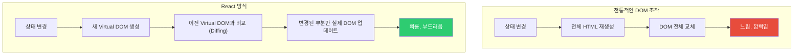
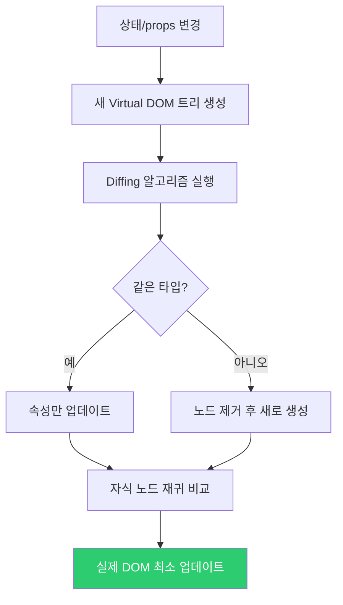
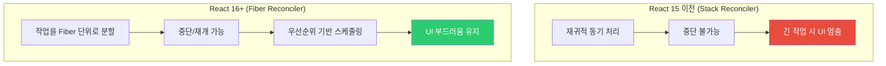
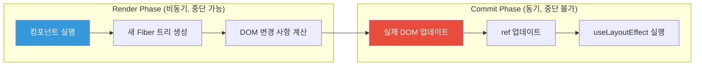
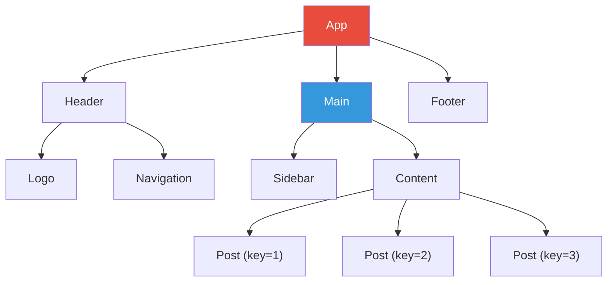
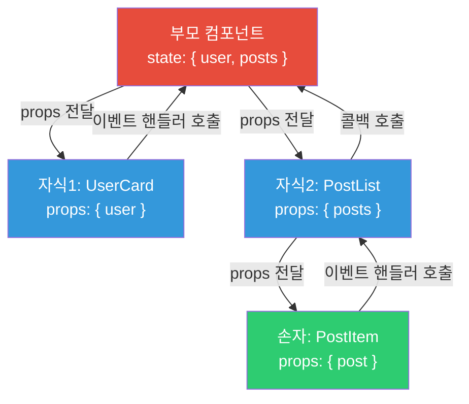
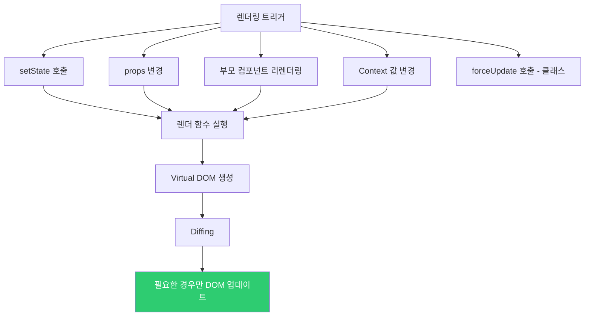
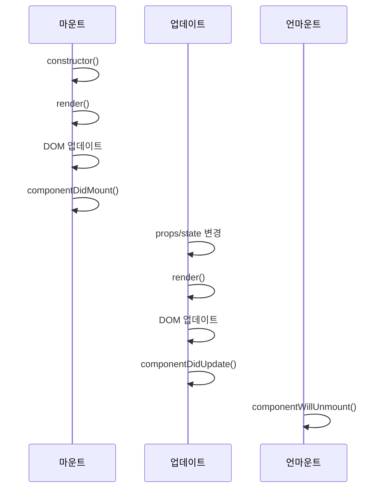
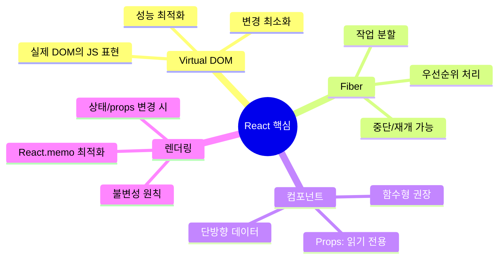

## IKEA 조립 설명서

IKEA 가구를 조립할 때, 설명서가 있으면 어떤 나사가 어디 들어가는지 알 수 있습니다. 만약 가구를 조금 바꾸고 싶다면, **전체 가구를 다시 분해하지 않고** 바꿔야 할 부분만 교체합니다.

React의 Virtual DOM이 바로 이 개념입니다. 전체 HTML을 다시 그리는 대신, 변경된 부분만 찾아서 최소한으로 업데이트합니다.

---

## 1. React란 무엇인가



---

## 2. Virtual DOM

Virtual DOM은 실제 DOM의 경량 JavaScript 표현입니다.

```javascript
// 실제 DOM
// <div class="container">
//   <h1>안녕하세요</h1>
//   <p>React 학습 중</p>
// </div>

// Virtual DOM (React가 내부적으로 사용)
const virtualDOM = {
  type: 'div',
  props: { className: 'container' },
  children: [
    {
      type: 'h1',
      props: {},
      children: ['안녕하세요']
    },
    {
      type: 'p',
      props: {},
      children: ['React 학습 중']
    }
  ]
};
```

### React.createElement

JSX는 컴파일 시 `React.createElement` 호출로 변환됩니다.

```jsx
// JSX 코드
const element = (
  <div className="container">
    <h1>안녕하세요</h1>
  </div>
);

// 컴파일 후 (React 17 이전)
const element = React.createElement(
  'div',
  { className: 'container' },
  React.createElement('h1', null, '안녕하세요')
);

// React 17+: 새 JSX Transform
import { jsx as _jsx } from 'react/jsx-runtime';
const element = _jsx('div', {
  className: 'container',
  children: _jsx('h1', { children: '안녕하세요' })
});
```

---

## 3. Reconciliation (재조정)

상태가 변경되면 React는 새 Virtual DOM과 이전 것을 비교합니다.



### Diffing 알고리즘의 핵심 규칙

#### 규칙 1: 다른 타입이면 전체 교체

```jsx
// 이전
<div>
  <Counter />
</div>

// 다음 - div가 span으로 바뀜
<span>
  <Counter />
</span>
// Counter는 언마운트 후 새로 마운트됨
```

#### 규칙 2: 같은 타입이면 속성만 업데이트

```jsx
// 이전
<div className="old" title="old" />

// 다음
<div className="new" title="old" />
// className만 업데이트, title은 그대로
```

#### 규칙 3: key로 리스트 최적화

```jsx
// key 없음 - 비효율적
['사과', '바나나', '딸기'].map(fruit => (
  <li>{fruit}</li>
));

// '포도' 맨 앞에 추가하면?
// React는 모든 항목이 바뀌었다고 인식!

// key 있음 - 효율적
['사과', '바나나', '딸기'].map(fruit => (
  <li key={fruit}>{fruit}</li>
));
// '포도'가 새로 추가됐다고 정확히 인식
```

---

## 4. React Fiber

React 16에서 도입된 새 재조정 엔진입니다.



### Fiber의 두 단계



---

## 5. 컴포넌트 구조

React 컴포넌트의 두 가지 유형:

```jsx
// 함수형 컴포넌트 (현재 표준)
function Greeting({ name, age }) {
  return (
    <div>
      <h1>안녕하세요, {name}님!</h1>
      <p>나이: {age}</p>
    </div>
  );
}

// 클래스형 컴포넌트 (레거시)
class Greeting extends React.Component {
  render() {
    const { name, age } = this.props;
    return (
      <div>
        <h1>안녕하세요, {name}님!</h1>
        <p>나이: {age}</p>
      </div>
    );
  }
}
```

### 컴포넌트 트리



---

## 6. JSX 심층 이해

JSX는 JavaScript의 확장 문법으로, HTML처럼 보이지만 JavaScript입니다.

```jsx
// JSX 규칙들

// 1. 하나의 루트 요소
// 틀림
return (
  <h1>제목</h1>
  <p>단락</p>
);

// 맞음
return (
  <div>
    <h1>제목</h1>
    <p>단락</p>
  </div>
);

// Fragment 사용 (DOM에 추가 요소 없이)
return (
  <>
    <h1>제목</h1>
    <p>단락</p>
  </>
);

// 2. JavaScript 표현식은 중괄호
const name = '홍길동';
const element = <h1>안녕하세요, {name}님</h1>;

// 3. className (class 대신)
const el = <div className="container"></div>;

// 4. 셀프 클로징
const img = ;
const input = <input type="text" />;

// 5. camelCase 이벤트 이름
const btn = <button onClick={handleClick}>클릭</button>;

// 6. 조건부 렌더링
const content = (
  <div>
    {isLoggedIn ? <UserPanel /> : <LoginForm />}
    {hasError && <ErrorMessage />}
  </div>
);
```

---

## 7. Props와 단방향 데이터 흐름



```jsx
// Props는 읽기 전용!
function UserCard({ user, onDelete }) {
  // user.name = '변경'; // 금지! Props 직접 수정 불가

  return (
    <div className="card">
      <h2>{user.name}</h2>
      <p>{user.email}</p>
      <button onClick={() => onDelete(user.id)}>삭제</button>
    </div>
  );
}

// 기본값 설정
function Button({ label = '클릭', size = 'medium', onClick }) {
  return (
    <button className={`btn btn-${size}`} onClick={onClick}>
      {label}
    </button>
  );
}
```

---

## 8. 렌더링 조건

### 언제 렌더링이 발생하나?



### 불필요한 렌더링 방지

```jsx
// React.memo: props가 같으면 렌더링 스킵
const ExpensiveComponent = React.memo(function({ data, onClick }) {
  console.log('렌더링!');
  return <div onClick={onClick}>{data}</div>;
});

// 얕은 비교로 동일 판단
// { name: '홍길동' } vs { name: '홍길동' } → 같음 (string 비교)
// { items: [1, 2] } vs { items: [1, 2] } → 다름! (배열 참조 비교)

// 커스텀 비교 함수
const SmartComponent = React.memo(Component, (prevProps, nextProps) => {
  // true 반환 시 렌더링 스킵
  return prevProps.id === nextProps.id;
});
```

---

## 9. 생명주기 (Lifecycle)



```jsx
// 함수형 컴포넌트에서 useEffect로 생명주기 대응
function MyComponent({ id }) {
  const [data, setData] = useState(null);

  // componentDidMount + componentDidUpdate
  useEffect(() => {
    fetchData(id).then(setData);

    // componentWillUnmount
    return () => {
      cleanup();
    };
  }, [id]); // id가 변경될 때마다 실행

  // componentDidMount만
  useEffect(() => {
    initAnalytics();
  }, []); // 빈 배열: 최초 마운트시만

  return <div>{data}</div>;
}
```

---

## 10. 불변성 (Immutability)

React는 얕은 비교로 변경을 감지합니다.

```jsx
// 잘못된 방법 - 직접 변형 (mutation)
const [users, setUsers] = useState([{ id: 1, name: '홍길동' }]);

// 이렇게 하면 React가 변경을 감지 못함!
users.push({ id: 2, name: '김철수' });
setUsers(users); // 같은 참조 → 리렌더링 안 됨

// 올바른 방법 - 새 배열 반환
setUsers([...users, { id: 2, name: '김철수' }]);
setUsers(prev => [...prev, { id: 2, name: '김철수' }]);

// 객체 업데이트
const [user, setUser] = useState({ name: '홍길동', age: 25 });

// 잘못됨
user.age = 26;
setUser(user); // 변경 감지 못함

// 올바름
setUser({ ...user, age: 26 });
setUser(prev => ({ ...prev, age: 26 }));
```

---

## 11. 극한 시나리오 - 무한 루프

```jsx
// 무한 루프 1: 의존성 배열 실수
function BadComponent() {
  const [data, setData] = useState({});

  useEffect(() => {
    fetch('/api/data')
      .then(r => r.json())
      .then(setData); // setData → 리렌더링 → useEffect 재실행 → ...
  }); // 의존성 배열 없음!

  return <div>{data.name}</div>;
}

// 무한 루프 2: 렌더링 중 상태 변경
function AlsoBadComponent() {
  const [count, setCount] = useState(0);

  setCount(count + 1); // 렌더링 중 상태 변경 → 리렌더링 → 반복

  return <div>{count}</div>;
}
```

---

## 12. 정리



React의 핵심은 **선언적 UI** 패러다임입니다. "어떻게 DOM을 변경할지" 대신 "상태에 따라 UI가 어떻게 보여야 하는지"를 선언하면, React가 효율적으로 DOM을 업데이트합니다.
