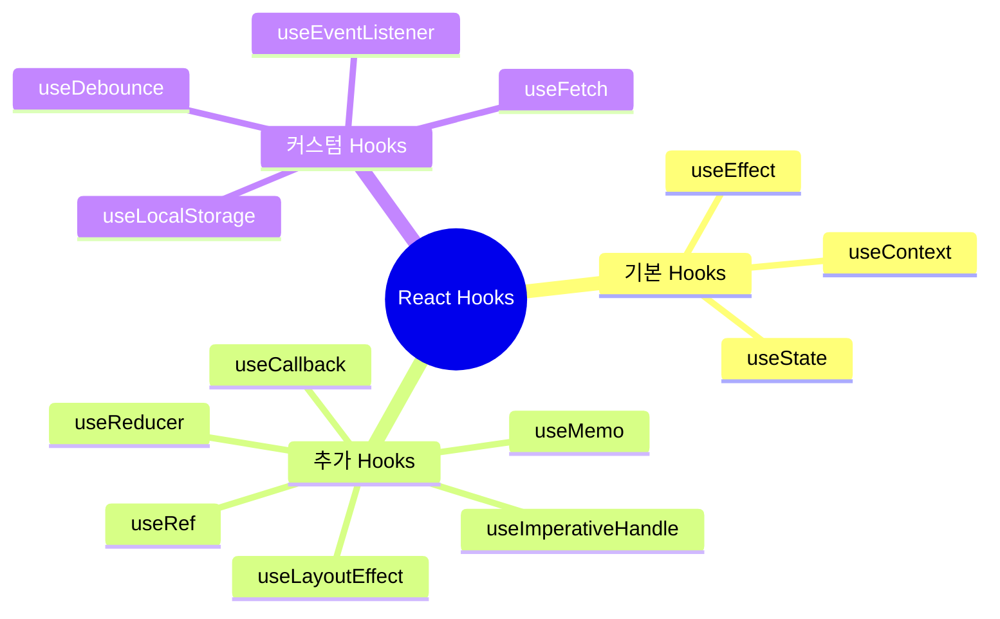
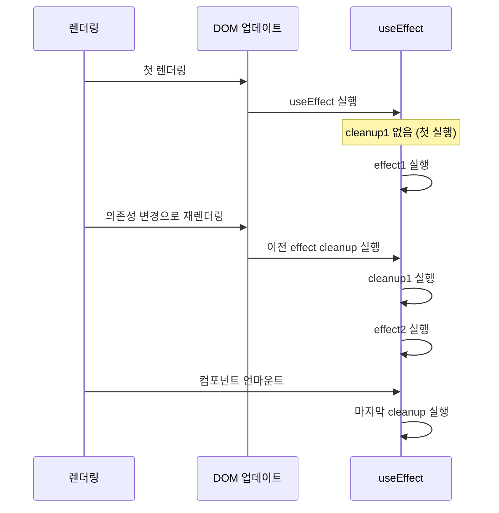
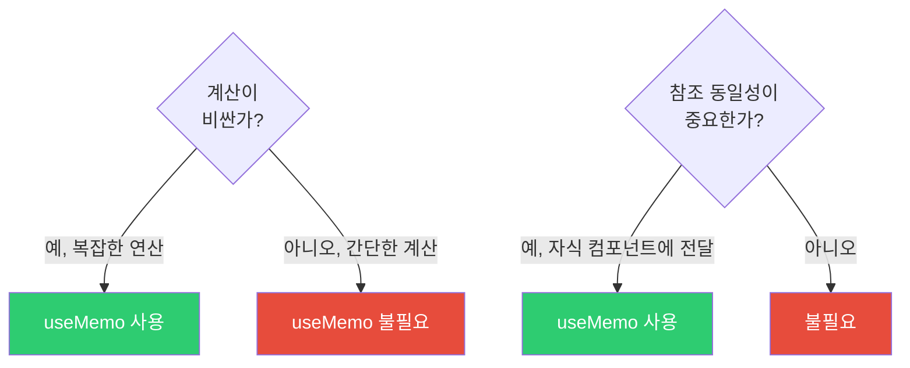
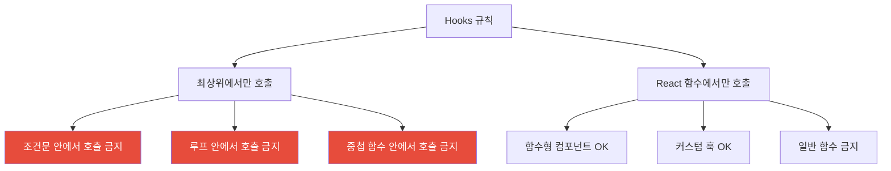
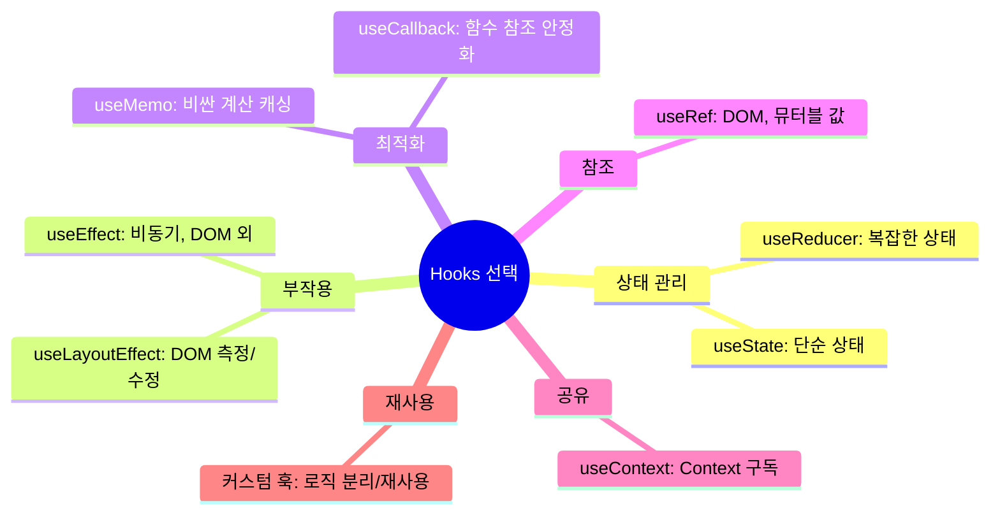

## 스위스 아미 나이프

React Hooks는 마치 스위스 아미 나이프와 같습니다. 하나의 도구에 여러 기능이 들어있지만, 각 기능을 제대로 알아야 올바르게 쓸 수 있습니다.

`useState`는 가위, `useEffect`는 칼, `useMemo`는 드라이버... 각각의 목적이 다르고, 잘못 쓰면 오히려 해가 됩니다.

---

## 1. Hooks 개요



---

## 2. useState 심층 분석

```jsx
// 1. 기본 사용
const [state, setState] = useState(initialValue);

// 2. 지연 초기화 (비용이 큰 초기값)
const [state, setState] = useState(() => {
  return expensiveComputation(); // 첫 렌더링에만 실행
});

// 3. 함수형 업데이트 (이전 상태 기반)
const [count, setCount] = useState(0);

// 잘못된 방법 - 배치 처리 시 stale 상태 문제
const badIncrement = () => {
  setCount(count + 1);
  setCount(count + 1); // 둘 다 같은 count 참조 → 1만 증가
};

// 올바른 방법
const goodIncrement = () => {
  setCount(prev => prev + 1);
  setCount(prev => prev + 1); // prev는 최신값 → 2 증가
};

// 4. 배치 처리 (React 18)
// React 18에서는 이벤트 핸들러 외부에서도 자동 배치
async function handleClick() {
  await fetchData();
  setState1(value1); // 이전: 즉시 리렌더링
  setState2(value2); // React 18: 두 setState가 묶여 한 번만 리렌더링
}
```

---

## 3. useEffect 완전 이해

### 의존성 배열의 3가지 형태

```jsx
// 1. 의존성 없음: 매 렌더링 후 실행
useEffect(() => {
  document.title = `카운트: ${count}`;
});

// 2. 빈 배열: 마운트 시 한 번만
useEffect(() => {
  const subscription = subscribe();
  return () => subscription.unsubscribe(); // 언마운트 시 클린업
}, []);

// 3. 의존성 배열: 값 변경 시마다
useEffect(() => {
  fetchUser(userId);
}, [userId]); // userId가 바뀔 때만 재실행
```

### useEffect 실행 순서



### 올바른 의존성 관리

```jsx
// 잘못된 예 - 의존성 누락
function SearchComponent({ query }) {
  const [results, setResults] = useState([]);

  useEffect(() => {
    fetchResults(query).then(setResults);
    // eslint-disable-next-line react-hooks/exhaustive-deps
  }, []); // query가 바뀌어도 재요청 안 됨!

  return <ResultList results={results} />;
}

// 올바른 예
function SearchComponent({ query }) {
  const [results, setResults] = useState([]);

  useEffect(() => {
    let cancelled = false;

    fetchResults(query).then(data => {
      if (!cancelled) setResults(data);
    });

    return () => { cancelled = true; }; // 이전 요청 취소
  }, [query]); // query 의존성 추가

  return <ResultList results={results} />;
}
```

---

## 4. useMemo - 계산 결과 메모이제이션

```jsx
// 비용이 큰 계산을 캐싱
function ExpensiveList({ items, filter }) {
  // filter나 items가 바뀔 때만 재계산
  const filteredItems = useMemo(() => {
    console.log('필터링 계산 중...'); // 얼마나 자주 실행되는지 확인
    return items
      .filter(item => item.category === filter)
      .sort((a, b) => b.score - a.score)
      .slice(0, 100);
  }, [items, filter]);

  return (
    <ul>
      {filteredItems.map(item => (
        <li key={item.id}>{item.name}</li>
      ))}
    </ul>
  );
}
```

### useMemo를 쓸 때와 쓰지 말 때



```jsx
// useMemo가 필요 없는 경우
const double = useMemo(() => count * 2, [count]); // 불필요! 그냥 계산
const double = count * 2; // 충분

// useMemo가 필요한 경우
const sortedData = useMemo(() => {
  return [...data].sort(complexSortFn).filter(complexFilterFn);
}, [data]); // data가 1000개이고 정렬이 복잡한 경우
```

---

## 5. useCallback - 함수 메모이제이션

```jsx
// 자식 컴포넌트에 전달하는 함수의 참조 유지
function Parent() {
  const [count, setCount] = useState(0);
  const [name, setName] = useState('');

  // name이 바뀌어도 handleCount는 새로 만들어지지 않음
  const handleCount = useCallback(() => {
    setCount(prev => prev + 1);
  }, []); // setCount는 안정적인 참조

  return (
    <>
      <input value={name} onChange={e => setName(e.target.value)} />
      <MemoizedChild onCount={handleCount} />
      <p>Count: {count}</p>
    </>
  );
}

// React.memo와 함께 써야 효과있음
const MemoizedChild = React.memo(function Child({ onCount }) {
  console.log('Child 렌더링');
  return <button onClick={onCount}>증가</button>;
});
```

### useMemo vs useCallback

```javascript
// useCallback(fn, deps) = useMemo(() => fn, deps)
const memoFn = useCallback(fn, deps);
const memoFn2 = useMemo(() => fn, deps); // 동일
```

---

## 6. useRef - DOM 참조와 뮤터블 값

```jsx
// 사용 케이스 1: DOM 요소 참조
function AutoFocusInput() {
  const inputRef = useRef(null);

  useEffect(() => {
    inputRef.current.focus(); // DOM에 직접 접근
  }, []);

  return <input ref={inputRef} type="text" />;
}

// 사용 케이스 2: 렌더링과 무관한 값 보존
function Stopwatch() {
  const [time, setTime] = useState(0);
  const intervalRef = useRef(null); // 렌더링에 영향 없는 값

  const start = () => {
    intervalRef.current = setInterval(() => {
      setTime(prev => prev + 1);
    }, 1000);
  };

  const stop = () => {
    clearInterval(intervalRef.current);
  };

  return (
    <div>
      <p>{time}초</p>
      <button onClick={start}>시작</button>
      <button onClick={stop}>정지</button>
    </div>
  );
}

// 사용 케이스 3: 이전 값 저장
function usePrevious(value) {
  const prevRef = useRef();

  useEffect(() => {
    prevRef.current = value;
  });

  return prevRef.current;
}

function Counter() {
  const [count, setCount] = useState(0);
  const prevCount = usePrevious(count);

  return (
    <p>현재: {count}, 이전: {prevCount}</p>
  );
}
```

---

## 7. useContext

```jsx
const UserContext = createContext(null);

function App() {
  const [user, setUser] = useState({ name: '홍길동', role: 'admin' });

  return (
    <UserContext.Provider value={{ user, setUser }}>
      <MainLayout />
    </UserContext.Provider>
  );
}

// 커스텀 훅으로 래핑
function useUser() {
  const context = useContext(UserContext);
  if (!context) {
    throw new Error('useUser는 UserContext.Provider 내에서 사용해야 합니다');
  }
  return context;
}

function UserProfile() {
  const { user } = useUser();
  return <h1>{user.name}</h1>;
}
```

---

## 8. useLayoutEffect vs useEffect


```jsx
// useLayoutEffect: DOM 측정 후 즉시 수정 필요 시
function Tooltip({ target, content }) {
  const tooltipRef = useRef();

  useLayoutEffect(() => {
    const targetRect = target.getBoundingClientRect();
    const tooltipEl = tooltipRef.current;

    // DOM 측정 후 즉시 위치 조정 (깜빡임 방지)
    tooltipEl.style.top = `${targetRect.bottom}px`;
    tooltipEl.style.left = `${targetRect.left}px`;
  });

  return <div ref={tooltipRef}>{content}</div>;
}
```

---

## 9. 커스텀 훅 설계

커스텀 훅으로 로직을 재사용합니다.

### useFetch

```javascript
function useFetch(url, options = {}) {
  const [state, dispatch] = useReducer(
    (state, action) => {
      switch (action.type) {
        case 'LOADING': return { ...state, loading: true, error: null };
        case 'SUCCESS': return { loading: false, data: action.payload, error: null };
        case 'ERROR': return { loading: false, data: null, error: action.payload };
        default: return state;
      }
    },
    { loading: false, data: null, error: null }
  );

  useEffect(() => {
    if (!url) return;

    const controller = new AbortController();
    dispatch({ type: 'LOADING' });

    fetch(url, { ...options, signal: controller.signal })
      .then(r => {
        if (!r.ok) throw new Error(`HTTP ${r.status}`);
        return r.json();
      })
      .then(data => dispatch({ type: 'SUCCESS', payload: data }))
      .catch(err => {
        if (err.name !== 'AbortError') {
          dispatch({ type: 'ERROR', payload: err.message });
        }
      });

    return () => controller.abort();
  }, [url]);

  return state;
}

// 사용
function UserProfile({ userId }) {
  const { data, loading, error } = useFetch(`/api/users/${userId}`);

  if (loading) return <Spinner />;
  if (error) return <ErrorMessage>{error}</ErrorMessage>;
  return <div>{data?.name}</div>;
}
```

### useLocalStorage

```javascript
function useLocalStorage(key, initialValue) {
  const [storedValue, setStoredValue] = useState(() => {
    try {
      const item = window.localStorage.getItem(key);
      return item ? JSON.parse(item) : initialValue;
    } catch {
      return initialValue;
    }
  });

  const setValue = useCallback((value) => {
    try {
      const valueToStore = value instanceof Function
        ? value(storedValue)
        : value;

      setStoredValue(valueToStore);
      window.localStorage.setItem(key, JSON.stringify(valueToStore));
    } catch (error) {
      console.error('localStorage 저장 실패:', error);
    }
  }, [key, storedValue]);

  return [storedValue, setValue];
}
```

### useDebounce

```javascript
function useDebounce(value, delay) {
  const [debouncedValue, setDebouncedValue] = useState(value);

  useEffect(() => {
    const timer = setTimeout(() => {
      setDebouncedValue(value);
    }, delay);

    return () => clearTimeout(timer);
  }, [value, delay]);

  return debouncedValue;
}

// 사용
function SearchInput() {
  const [query, setQuery] = useState('');
  const debouncedQuery = useDebounce(query, 300);

  const { data } = useFetch(
    debouncedQuery ? `/api/search?q=${debouncedQuery}` : null
  );

  return (
    <>
      <input
        value={query}
        onChange={e => setQuery(e.target.value)}
        placeholder="검색..."
      />
      {data?.map(item => <SearchResult key={item.id} item={item} />)}
    </>
  );
}
```

---

## 10. Hooks 규칙



```jsx
// 잘못된 사용
function BadComponent({ isAdmin }) {
  if (isAdmin) {
    const [data, setData] = useState(null); // 조건부 호출 금지!
  }

  for (let i = 0; i < 3; i++) {
    useEffect(() => {}); // 루프 안 금지!
  }
}

// 왜 금지인가: React는 Hook 호출 순서로 상태를 관리
// 순서가 바뀌면 어떤 상태가 어떤 훅인지 알 수 없음
```

---

## 11. 극한 시나리오 - useEffect 클로저 함정

```jsx
// 유명한 버그: stale closure
function Counter() {
  const [count, setCount] = useState(0);

  useEffect(() => {
    const timer = setInterval(() => {
      console.log(count); // 항상 0 출력! (클로저 캡처)
      setCount(count + 1); // count가 0으로 고정
    }, 1000);

    return () => clearInterval(timer);
  }, []); // count 의존성 누락

  return <div>{count}</div>;
}

// 해결 1: 함수형 업데이트
useEffect(() => {
  const timer = setInterval(() => {
    setCount(prev => prev + 1); // prev는 최신값
  }, 1000);
  return () => clearInterval(timer);
}, []);

// 해결 2: useRef로 최신값 참조
function Counter() {
  const [count, setCount] = useState(0);
  const countRef = useRef(count);
  countRef.current = count; // 매 렌더링마다 업데이트

  useEffect(() => {
    const timer = setInterval(() => {
      console.log(countRef.current); // 항상 최신값
    }, 1000);
    return () => clearInterval(timer);
  }, []);
}
```

---

## 12. 정리



Hooks를 올바르게 사용하는 핵심은 **의존성 배열을 정확히 관리**하고, **불필요한 최적화를 피하는 것**입니다. `useMemo`와 `useCallback`은 실제 성능 문제가 있을 때만 사용하세요.
