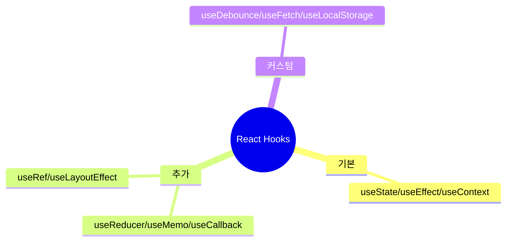
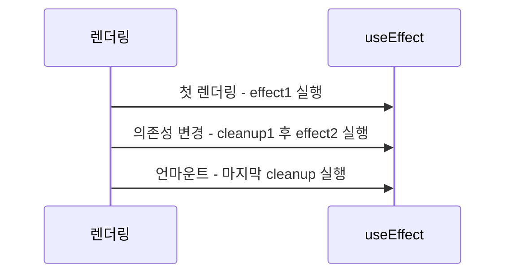
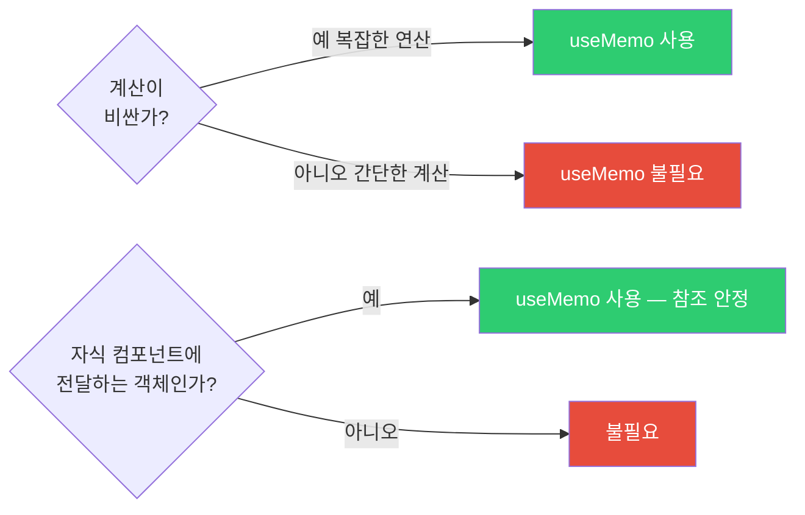
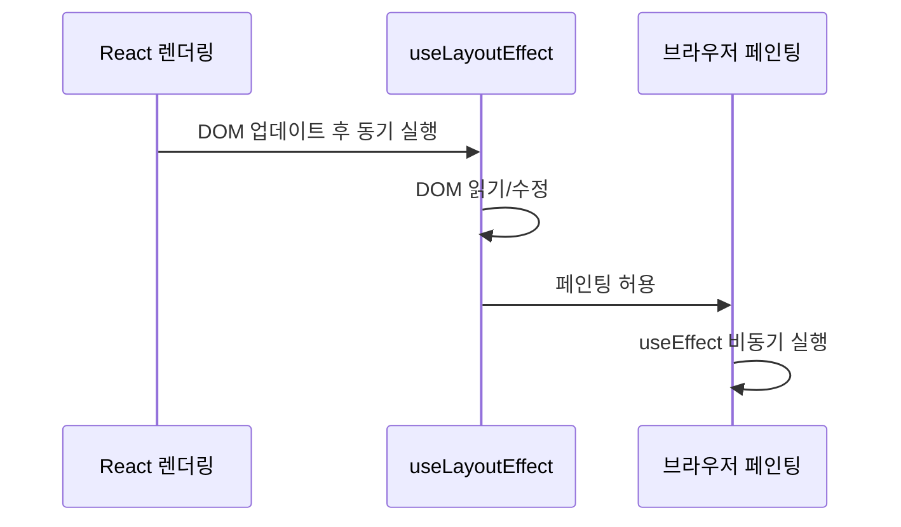
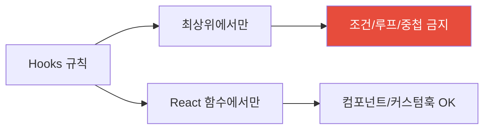
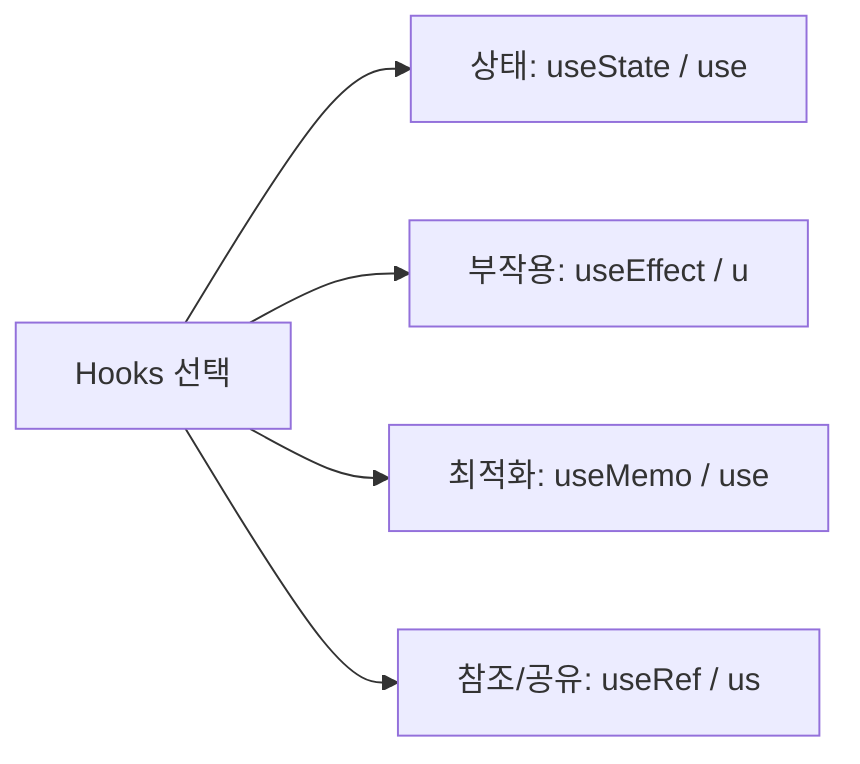

## 클래스 없이 상태와 생명주기를 다루다

Hooks가 나오기 전에는 상태(state)를 쓰려면 클래스 컴포넌트를 만들어야 했습니다. 그런데 클래스 컴포넌트는 문제가 있었습니다. `this` 바인딩 문제, 생명주기 메서드에 뒤섞인 관련 없는 로직, 로직 재사용의 어려움.

React 16.8에서 Hooks가 등장하면서 함수형 컴포넌트에서도 상태, 사이드 이펙트, Context를 모두 다룰 수 있게 되었습니다. 지금은 새 코드에서 클래스 컴포넌트를 쓸 이유가 없습니다.

> 비유: Hooks는 스위스 아미 나이프와 같습니다. `useState`는 가위, `useEffect`는 칼, `useMemo`는 드라이버. 각각 목적이 다르고, 잘못 쓰면 오히려 해가 됩니다. 각 도구의 목적을 정확히 이해해야 합니다.

---

## 1번 다이어그램 - Hooks 전체 지도



---

## 2. useState 심층 분석

### 함수형 업데이트가 중요한 이유

```jsx
const [count, setCount] = useState(0);

// 잘못된 방법 — 여러 번 호출해도 1만 증가
const badIncrement = () => {
  setCount(count + 1); // count = 0
  setCount(count + 1); // count = 0 (여전히!)
  // React가 두 업데이트를 배치 처리하는데, 둘 다 같은 count 값을 참조
};

// 올바른 방법 — prev는 항상 최신값
const goodIncrement = () => {
  setCount(prev => prev + 1); // prev = 0 → 1
  setCount(prev => prev + 1); // prev = 1 → 2
};
```

왜 이런 차이가 생길까요? 이유는 React가 여러 setState 호출을 묶어서 한 번에 처리(배치)하기 때문입니다. 그 사이에 `count` 값은 바뀌지 않습니다. 함수형 업데이트는 이전 상태를 인자로 받으므로 항상 최신값을 사용합니다.

### 지연 초기화 — 비용이 큰 초기값

```jsx
// 잘못된 방법 — 매 렌더링마다 expensiveComputation() 호출
const [state, setState] = useState(expensiveComputation());

// 올바른 방법 — 첫 렌더링에만 한 번 호출
const [state, setState] = useState(() => expensiveComputation());
```

`localStorage.getItem()`처럼 약간의 비용이 있는 초기화도 마찬가지입니다. 함수로 감싸면 최초 마운트 시에만 실행됩니다.

---

## 3. useEffect — 사이드 이펙트의 집

useEffect는 "렌더링 결과로 인한 부작용"을 처리합니다. 네트워크 요청, 구독, DOM 수정, 타이머 설정이 여기 해당합니다.

> 비유: 컴포넌트는 요리사입니다. 음식(UI)을 만드는 것이 주 업무입니다. useEffect는 요리 후 설거지(정리), 재료 주문(네트워크 요청) 같은 부업입니다. 주 업무(렌더링)가 끝난 뒤에 실행됩니다.

### 의존성 배열의 세 가지 형태

```jsx
// 1. 의존성 없음 — 매 렌더링 후 실행 (거의 쓰지 않음)
useEffect(() => {
  document.title = `카운트: ${count}`;
});

// 2. 빈 배열 — 마운트 시 한 번만 실행
useEffect(() => {
  const subscription = subscribe();
  return () => subscription.unsubscribe(); // 언마운트 시 클린업
}, []);

// 3. 의존성 배열 — 값이 변경될 때마다 실행
useEffect(() => {
  fetchUser(userId);
}, [userId]); // userId가 바뀔 때만 재실행
```

### useEffect 실행 순서



### Stale Closure — 가장 흔한 useEffect 버그

```jsx
// 버그: setInterval 콜백이 초기 count 값을 영구히 기억
function Counter() {
  const [count, setCount] = useState(0);

  useEffect(() => {
    const timer = setInterval(() => {
      console.log(count); // 항상 0 출력 — 클로저 캡처
      setCount(count + 1); // count가 0으로 고정
    }, 1000);

    return () => clearInterval(timer);
  }, []); // count 의존성 누락

  return <div>{count}</div>;
}

// 해결 1: 함수형 업데이트 (의존성 불필요)
useEffect(() => {
  const timer = setInterval(() => {
    setCount(prev => prev + 1); // prev는 항상 최신값
  }, 1000);
  return () => clearInterval(timer);
}, []);

// 해결 2: useRef로 최신값 참조
function Counter() {
  const [count, setCount] = useState(0);
  const countRef = useRef(count);
  countRef.current = count; // 매 렌더링마다 업데이트

  useEffect(() => {
    const timer = setInterval(() => {
      console.log(countRef.current); // 항상 최신값
    }, 1000);
    return () => clearInterval(timer);
  }, []);
}
```

---

## 4. useMemo — 계산 결과를 캐싱

useMemo는 비용이 큰 계산을 캐싱합니다. 의존성 배열의 값이 바뀔 때만 재계산합니다.

> 비유: 수학 시험에서 자주 쓰는 공식의 중간 결과를 메모지에 적어두는 것과 같습니다. 같은 계산을 매번 하지 않고, 숫자가 바뀔 때만 다시 계산합니다.

```jsx
function ExpensiveList({ items, filter }) {
  // filter나 items가 바뀔 때만 재계산
  const filteredItems = useMemo(() => {
    return items
      .filter(item => item.category === filter)
      .sort((a, b) => b.score - a.score)
      .slice(0, 100);
  }, [items, filter]);

  return (
    <ul>
      {filteredItems.map(item => <li key={item.id}>{item.name}</li>)}
    </ul>
  );
}
```

### useMemo를 쓸 때와 쓰지 말 때



```jsx
// useMemo가 필요 없는 경우
const double = useMemo(() => count * 2, [count]); // 불필요!
const double = count * 2; // 그냥 계산하면 충분

// useMemo가 필요한 경우
const sortedData = useMemo(() => {
  return [...data].sort(complexSortFn).filter(complexFilterFn);
}, [data]); // 1000개 데이터 + 복잡한 정렬/필터
```

---

## 5. useCallback — 함수 참조를 안정화

useCallback은 함수를 캐싱합니다. 의존성이 바뀌지 않으면 같은 함수 참조를 반환합니다. React.memo로 감싼 자식 컴포넌트에 함수를 props로 전달할 때 필요합니다.

```jsx
function Parent() {
  const [count, setCount] = useState(0);
  const [name, setName] = useState('');

  // name이 바뀌어도 handleCount는 새로 만들어지지 않음
  const handleCount = useCallback(() => {
    setCount(prev => prev + 1);
  }, []); // setCount는 안정적인 참조이므로 의존성 불필요

  return (
    <>
      <input value={name} onChange={e => setName(e.target.value)} />
      <MemoizedChild onCount={handleCount} />
      <p>Count: {count}</p>
    </>
  );
}

// useCallback이 효과 있으려면 React.memo와 함께 써야 합니다
const MemoizedChild = React.memo(function Child({ onCount }) {
  console.log('Child 렌더링');
  return <button onClick={onCount}>증가</button>;
});
```

> 비유: `useCallback(fn, deps)`는 `useMemo(() => fn, deps)`와 동일합니다. useMemo는 값을 캐싱하고, useCallback은 함수를 캐싱합니다. 함수도 값이기 때문입니다.

---

## 6. useRef — 렌더링과 무관한 값 보존

useRef는 두 가지 용도로 씁니다. DOM 요소에 직접 접근하거나, 렌더링을 유발하지 않고 값을 저장할 때입니다.

> 비유: useRef는 컴포넌트의 개인 메모장입니다. 메모장에 뭔가 적어도 컴포넌트가 다시 그려지지 않습니다. 그냥 기억해두는 것입니다.

```jsx
// 용도 1: DOM 요소 참조
function AutoFocusInput() {
  const inputRef = useRef(null);

  useEffect(() => {
    inputRef.current.focus(); // 마운트 후 포커스
  }, []);

  return <input ref={inputRef} type="text" />;
}

// 용도 2: 렌더링 없이 값 유지 (타이머 ID, 이전 값 등)
function Stopwatch() {
  const [time, setTime] = useState(0);
  const intervalRef = useRef(null); // 렌더링에 영향 없음

  const start = () => {
    intervalRef.current = setInterval(() => {
      setTime(prev => prev + 1);
    }, 1000);
  };

  const stop = () => {
    clearInterval(intervalRef.current);
  };

  return (
    <div>
      <p>{time}초</p>
      <button onClick={start}>시작</button>
      <button onClick={stop}>정지</button>
    </div>
  );
}

// 용도 3: 이전 값 저장
function usePrevious(value) {
  const prevRef = useRef();

  useEffect(() => {
    prevRef.current = value; // 렌더링 후 저장
  });

  return prevRef.current; // 이전 렌더링의 값 반환
}
```

---

## 7. useLayoutEffect — DOM 측정 후 즉시 수정

useEffect와 거의 같지만, **브라우저가 화면을 그리기 전에** 동기적으로 실행됩니다. DOM을 측정하고 즉시 수정해야 할 때 씁니다.



```jsx
// Tooltip 위치 조정 — 화면에 보이기 전에 위치 계산 필요
function Tooltip({ target, content }) {
  const tooltipRef = useRef();

  useLayoutEffect(() => {
    const targetRect = target.getBoundingClientRect();
    const tooltipEl = tooltipRef.current;

    // useEffect라면 잠깐 wrong position → jump 하는 깜빡임 발생
    // useLayoutEffect는 화면에 보이기 전에 수정하므로 깜빡임 없음
    tooltipEl.style.top = `${targetRect.bottom}px`;
    tooltipEl.style.left = `${targetRect.left}px`;
  });

  return <div ref={tooltipRef}>{content}</div>;
}
```

---

## 8. 커스텀 훅 — 로직을 재사용하는 방법

여러 컴포넌트에서 같은 로직을 쓴다면 커스텀 훅으로 추출하세요. 커스텀 훅은 `use`로 시작하는 함수입니다.

### useFetch — 데이터 페칭 추상화

```javascript
function useFetch(url, options = {}) {
  const [state, dispatch] = useReducer(
    (state, action) => {
      switch (action.type) {
        case 'LOADING': return { ...state, loading: true, error: null };
        case 'SUCCESS': return { loading: false, data: action.payload, error: null };
        case 'ERROR': return { loading: false, data: null, error: action.payload };
        default: return state;
      }
    },
    { loading: false, data: null, error: null }
  );

  useEffect(() => {
    if (!url) return;

    const controller = new AbortController();
    dispatch({ type: 'LOADING' });

    fetch(url, { ...options, signal: controller.signal })
      .then(r => {
        if (!r.ok) throw new Error(`HTTP ${r.status}`);
        return r.json();
      })
      .then(data => dispatch({ type: 'SUCCESS', payload: data }))
      .catch(err => {
        if (err.name !== 'AbortError') {
          dispatch({ type: 'ERROR', payload: err.message });
        }
      });

    return () => controller.abort(); // 컴포넌트 언마운트 시 요청 취소
  }, [url]);

  return state;
}

// 사용 — 데이터 페칭 로직이 컴포넌트에서 완전히 분리됨
function UserProfile({ userId }) {
  const { data, loading, error } = useFetch(`/api/users/${userId}`);

  if (loading) return <Spinner />;
  if (error) return <ErrorMessage>{error}</ErrorMessage>;
  return <div>{data?.name}</div>;
}
```

### useDebounce — 타이핑 중 API 요청 줄이기

```javascript
function useDebounce(value, delay) {
  const [debouncedValue, setDebouncedValue] = useState(value);

  useEffect(() => {
    const timer = setTimeout(() => {
      setDebouncedValue(value);
    }, delay);

    return () => clearTimeout(timer); // 새 타이핑이 오면 이전 타이머 취소
  }, [value, delay]);

  return debouncedValue;
}

// 사용 — 타이핑 300ms 멈추면 검색 요청
function SearchInput() {
  const [query, setQuery] = useState('');
  const debouncedQuery = useDebounce(query, 300);

  const { data } = useFetch(
    debouncedQuery ? `/api/search?q=${debouncedQuery}` : null
  );

  return (
    <>
      <input
        value={query}
        onChange={e => setQuery(e.target.value)}
        placeholder="검색..."
      />
      {data?.map(item => <SearchResult key={item.id} item={item} />)}
    </>
  );
}
```

---

### useLocalStorage — localStorage와 상태 동기화

```typescript
// localStorage 읽기/쓰기를 useState처럼 사용
function useLocalStorage<T>(key: string, initialValue: T) {
    // 초기값: localStorage에서 읽되, 실패 시 initialValue 사용
    const [storedValue, setStoredValue] = useState<T>(() => {
        try {
            const item = window.localStorage.getItem(key);
            return item ? (JSON.parse(item) as T) : initialValue;
        } catch {
            return initialValue;
        }
    });

    const setValue = (value: T | ((prev: T) => T)) => {
        try {
            // 함수형 업데이트 지원
            const valueToStore = value instanceof Function ? value(storedValue) : value;
            setStoredValue(valueToStore);
            window.localStorage.setItem(key, JSON.stringify(valueToStore));
        } catch (error) {
            console.error('useLocalStorage setValue error:', error);
        }
    };

    const removeValue = () => {
        setStoredValue(initialValue);
        window.localStorage.removeItem(key);
    };

    return [storedValue, setValue, removeValue] as const;
}

// 사용 예 — 사용자 설정 영구 저장
function ThemeSettings() {
    const [theme, setTheme, resetTheme] = useLocalStorage<'light' | 'dark'>(
        'user-theme',
        'light'
    );

    return (
        <div>
            <p>현재 테마: {theme}</p>
            <button onClick={() => setTheme('dark')}>다크 모드</button>
            <button onClick={() => setTheme('light')}>라이트 모드</button>
            <button onClick={resetTheme}>초기화</button>
        </div>
    );
}
```

### useIntersectionObserver — 뷰포트 진입 감지 (무한 스크롤/지연 로딩)

```typescript
interface UseIntersectionObserverOptions {
    threshold?: number;       // 0~1: 요소가 얼마나 보여야 트리거
    rootMargin?: string;      // 뷰포트 확장 (예: "200px"이면 200px 전에 미리 트리거)
    once?: boolean;           // true면 한 번만 감지 후 해제
}

function useIntersectionObserver(
    options: UseIntersectionObserverOptions = {}
) {
    const { threshold = 0, rootMargin = '0px', once = false } = options;
    const [isIntersecting, setIsIntersecting] = useState(false);
    const targetRef = useRef<HTMLElement | null>(null);

    useEffect(() => {
        const element = targetRef.current;
        if (!element) return;

        const observer = new IntersectionObserver(
            ([entry]) => {
                setIsIntersecting(entry.isIntersecting);
                // once 옵션: 한 번 보이면 관찰 해제
                if (entry.isIntersecting && once) {
                    observer.unobserve(element);
                }
            },
            { threshold, rootMargin }
        );

        observer.observe(element);
        return () => observer.disconnect();
    }, [threshold, rootMargin, once]);

    return { targetRef, isIntersecting };
}

// 사용 예 1: 이미지 지연 로딩 (Lazy Loading)
function LazyImage({ src, alt }: { src: string; alt: string }) {
    const { targetRef, isIntersecting } = useIntersectionObserver({
        rootMargin: '200px',  // 200px 전에 미리 로드
        once: true,           // 한 번만 감지
    });

    return (
        }
            src={isIntersecting ? src : undefined}  // 뷰포트 진입 시 src 설정
            data-src={src}
            alt={alt}
            style={{ minHeight: '200px', background: '#f0f0f0' }}
        />
    );
}

// 사용 예 2: 무한 스크롤 — 목록 끝에 도달하면 다음 페이지 로드
function InfiniteProductList() {
    const [products, setProducts] = useState<Product[]>([]);
    const [page, setPage] = useState(1);
    const [hasMore, setHasMore] = useState(true);
    const [loading, setLoading] = useState(false);

    // 목록 끝 감지 센서
    const { targetRef: sentinelRef, isIntersecting } = useIntersectionObserver({
        rootMargin: '100px',
    });

    // 센서가 보이면 다음 페이지 로드
    useEffect(() => {
        if (isIntersecting && hasMore && !loading) {
            setLoading(true);
            fetch(`/api/products?page=${page}`)
                .then(r => r.json())
                .then(data => {
                    if (data.length === 0) {
                        setHasMore(false);
                    } else {
                        setProducts(prev => [...prev, ...data]);
                        setPage(p => p + 1);
                    }
                })
                .finally(() => setLoading(false));
        }
    }, [isIntersecting, hasMore, loading, page]);

    return (
        <div>
            {products.map(p => <ProductCard key={p.id} product={p} />)}
            {/* 센티넬: 이 요소가 보이면 다음 페이지 로드 */}
            <div ref={sentinelRef as React.RefObject<HTMLDivElement>}>
                {loading && <Spinner />}
                {!hasMore && <p>모든 상품을 불러왔습니다.</p>}
            </div>
        </div>
    );
}

// 사용 예 3: 스크롤 애니메이션 트리거
function AnimatedSection({ children }: { children: React.ReactNode }) {
    const { targetRef, isIntersecting } = useIntersectionObserver({
        threshold: 0.2,  // 20% 보일 때 트리거
    });

    return (
        <section
            ref={targetRef as React.RefObject<HTMLElement>}
            style={{
                opacity: isIntersecting ? 1 : 0,
                transform: isIntersecting ? 'translateY(0)' : 'translateY(40px)',
                transition: 'opacity 0.6s ease, transform 0.6s ease',
            }}
        >
            {children}
        </section>
    );
}
```

---

## 9. Hooks 규칙



왜 이런 규칙이 있을까요? 이유는 React가 Hook 호출 순서로 어떤 상태가 어떤 Hook에 해당하는지 추적하기 때문입니다. 조건문에서 Hook을 호출하면 렌더링마다 순서가 달라질 수 있고, 그러면 상태가 잘못 매핑됩니다.

```jsx
// 잘못된 사용 — 조건부 Hook 호출
function BadComponent({ isAdmin }) {
  if (isAdmin) {
    const [data, setData] = useState(null); // 조건부 호출 금지!
  }
  // isAdmin이 true→false로 바뀌면 Hook 순서가 달라짐 → 버그
}
```

---

## 2번 다이어그램 - Hooks 선택 가이드



Hooks를 올바르게 사용하는 핵심은 두 가지입니다. **의존성 배열을 정확히 관리하고, 불필요한 최적화를 피하는 것.** `useMemo`와 `useCallback`은 실제 성능 문제가 측정되었을 때만 사용하세요. 모든 함수에 `useCallback`을 붙이는 것은 오히려 코드를 복잡하게 만들고, 메모이제이션 비용이 더 클 수 있습니다.

---

## 왜 Hooks인가?

| 방식 | 코드 재사용 | 로직 분리 | 클래스 필요 | React 버전 |
|------|-----------|---------|-----------|----------|
| **클래스 컴포넌트** | HOC/render props (복잡) | lifecycle에 분산 | 필요 | 모든 버전 |
| **Hooks** | Custom Hook으로 간결 | 관심사별 분리 가능 | 불필요 | 16.8+ |
| **HOC 패턴** | 재사용 가능 | wrapper 중첩 | 불필요 | 모든 버전 |

Hooks 이전에는 상태 로직을 재사용하려면 HOC나 render props로 컴포넌트를 감싸야 했습니다. 이는 "wrapper hell"을 만들고 DevTools에서 추적이 어려웠습니다. Custom Hook은 컴포넌트 트리를 수정하지 않고 로직을 공유합니다.

---

## 실무에서 자주 하는 실수

**실수 1. useEffect 의존성 배열 불일치 — stale closure**

```tsx
// 위험: count가 의존성에 없어 오래된 값(0)을 계속 참조
const [count, setCount] = useState(0);
useEffect(() => {
  const id = setInterval(() => {
    setCount(count + 1); // 항상 0 + 1 = 1
  }, 1000);
  return () => clearInterval(id);
}, []); // count 누락

// 올바른 방법: 함수형 업데이트로 의존성 제거
useEffect(() => {
  const id = setInterval(() => {
    setCount(prev => prev + 1); // 최신 값 보장
  }, 1000);
  return () => clearInterval(id);
}, []);
```

**실수 2. useEffect cleanup 미작성으로 메모리 누수**

```tsx
// 위험: 컴포넌트 언마운트 후에도 구독이 살아있음
useEffect(() => {
  const subscription = dataStream.subscribe(setData);
  // cleanup 없음 → 메모리 누수
}, []);

// 올바른 방법: cleanup 함수 반환
useEffect(() => {
  const subscription = dataStream.subscribe(setData);
  return () => subscription.unsubscribe(); // 언마운트 시 정리
}, []);
```

**실수 3. useCallback/useMemo 과도 사용**

```tsx
// 불필요: 원시값 메모이제이션은 비용이 이득보다 큼
const value = useMemo(() => count * 2, [count]); // 단순 계산에 오버킬

// useCallback도 의존 자식이 React.memo로 감싸져 있을 때만 효과
const handleClick = useCallback(() => {
  console.log('clicked');
}, []); // 자식이 React.memo가 아니면 아무 효과 없음

// 올바른 기준: React DevTools Profiler에서 실제 문제 확인 후 적용
```

**실수 4. useState 초기값에 함수 호출 (lazy initialization 미사용)**

```tsx
// 비효율: 렌더마다 heavyCompute() 실행 (초기값은 첫 렌더만 필요)
const [value, setValue] = useState(heavyCompute());

// 올바른 방법: 함수를 전달해 첫 렌더에만 실행
const [value, setValue] = useState(() => heavyCompute());
```

**실수 5. useRef를 상태처럼 사용해 리렌더 누락**

```tsx
// 위험: ref 값 변경은 리렌더를 유발하지 않음
const countRef = useRef(0);
const increment = () => {
  countRef.current++;
  // UI 업데이트 없음 — ref는 렌더와 무관한 값 저장용
};

// 리렌더가 필요하면 useState 사용
// ref는 DOM 참조, 이전 값 저장, 타이머 ID 등에 사용
```

---

## 면접 포인트

**Q1. useEffect의 실행 시점을 정확히 설명하세요.**

`useEffect`는 렌더링이 완료되고 브라우저가 화면을 그린 후 비동기로 실행됩니다. 의존성 배열이 없으면 매 렌더마다, `[]`이면 최초 마운트 시만, 값이 있으면 해당 값이 변경될 때 실행됩니다. DOM을 읽고 동기적으로 처리해야 한다면 `useLayoutEffect`를 사용합니다 (`useLayoutEffect`는 DOM 변경 후 브라우저 페인트 전에 동기 실행).

**Q2. Custom Hook이 일반 함수와 다른 점은?**

Custom Hook은 이름이 `use`로 시작하고 내부에서 다른 Hook을 호출합니다. 일반 함수는 Hook을 호출할 수 없습니다. Custom Hook은 Hook의 규칙(최상위에서만 호출, 조건부 호출 금지)을 따르므로 React가 Hook 호출 순서를 추적할 수 있습니다. 로직을 Custom Hook으로 추출해도 각 컴포넌트는 독립적인 상태를 가집니다.

**Q3. `useState`의 함수형 업데이트(`setState(prev => ...)`)를 언제 사용해야 하나요?**

이전 상태에 기반해 새 상태를 계산할 때 항상 사용해야 합니다. 비동기 핸들러나 이벤트 핸들러에서 최신 상태를 보장받을 수 있습니다. `setState(count + 1)` 방식은 클로저가 캡처한 `count`를 사용하므로, 배치 처리나 stale closure 상황에서 예상과 다르게 동작할 수 있습니다. `setState(prev => prev + 1)`은 항상 최신 상태를 받아 업데이트합니다.

**Q4. `useReducer`를 `useState` 대신 선택하는 기준은?**

상태 업데이트 로직이 복잡하거나 여러 상태가 함께 변경될 때 `useReducer`가 유리합니다. 구체적으로: (1) 다음 상태가 이전 상태에 복잡하게 의존할 때, (2) 여러 관련 상태를 하나의 객체로 관리할 때, (3) 액션 타입으로 로직을 명시적으로 표현하고 싶을 때, (4) 테스트 시 reducer를 순수 함수로 단독 테스트하고 싶을 때입니다.

**Q5. `useContext`의 성능 문제와 해결 방법은?**

Context 값이 변경되면 해당 Context를 구독하는 **모든** 컴포넌트가 리렌더됩니다. 자주 변경되는 값(카운터, 폼 상태)을 Context에 넣으면 성능 문제가 생깁니다. 해결 방법: (1) Context를 자주 변경되는 것과 안 되는 것으로 분리, (2) 자식 컴포넌트를 `React.memo`로 감싸 불필요한 리렌더 방지, (3) Zustand나 Jotai 같은 상태 관리 라이브러리는 구독한 값이 변경된 컴포넌트만 리렌더합니다.
