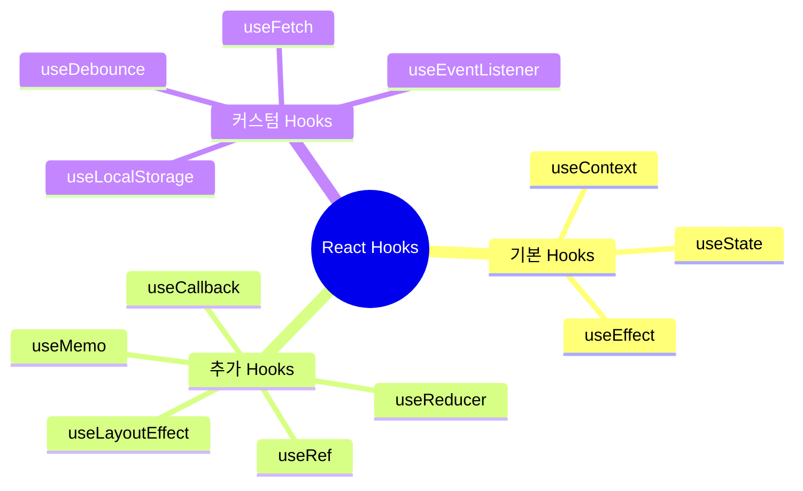
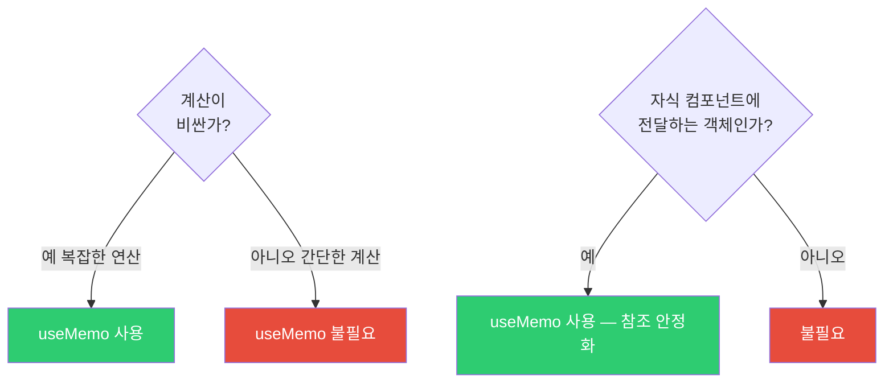
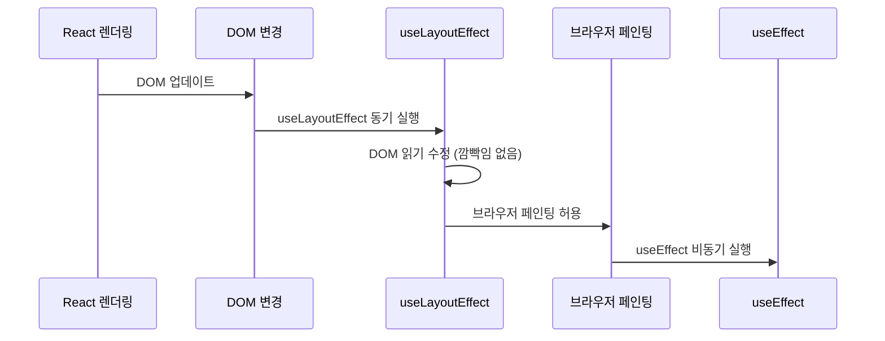
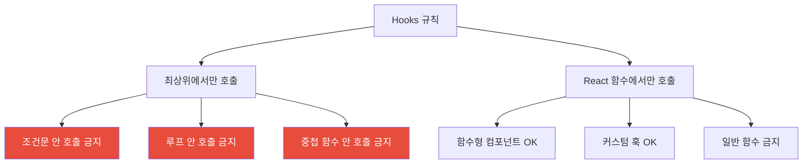
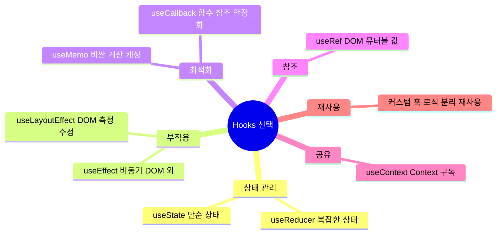

## 클래스 없이 상태와 생명주기를 다루다

Hooks가 나오기 전에는 상태(state)를 쓰려면 클래스 컴포넌트를 만들어야 했습니다. 그런데 클래스 컴포넌트는 문제가 있었습니다. `this` 바인딩 문제, 생명주기 메서드에 뒤섞인 관련 없는 로직, 로직 재사용의 어려움.

React 16.8에서 Hooks가 등장하면서 함수형 컴포넌트에서도 상태, 사이드 이펙트, Context를 모두 다룰 수 있게 되었습니다. 지금은 새 코드에서 클래스 컴포넌트를 쓸 이유가 없습니다.

> 비유: Hooks는 스위스 아미 나이프와 같습니다. `useState`는 가위, `useEffect`는 칼, `useMemo`는 드라이버. 각각 목적이 다르고, 잘못 쓰면 오히려 해가 됩니다. 각 도구의 목적을 정확히 이해해야 합니다.

---

## 1번 다이어그램 - Hooks 전체 지도



---

## 2. useState 심층 분석

### 함수형 업데이트가 중요한 이유

```jsx
const [count, setCount] = useState(0);

// 잘못된 방법 — 여러 번 호출해도 1만 증가
const badIncrement = () => {
  setCount(count + 1); // count = 0
  setCount(count + 1); // count = 0 (여전히!)
  // React가 두 업데이트를 배치 처리하는데, 둘 다 같은 count 값을 참조
};

// 올바른 방법 — prev는 항상 최신값
const goodIncrement = () => {
  setCount(prev => prev + 1); // prev = 0 → 1
  setCount(prev => prev + 1); // prev = 1 → 2
};
```

왜 이런 차이가 생길까요? 이유는 React가 여러 setState 호출을 묶어서 한 번에 처리(배치)하기 때문입니다. 그 사이에 `count` 값은 바뀌지 않습니다. 함수형 업데이트는 이전 상태를 인자로 받으므로 항상 최신값을 사용합니다.

### 지연 초기화 — 비용이 큰 초기값

```jsx
// 잘못된 방법 — 매 렌더링마다 expensiveComputation() 호출
const [state, setState] = useState(expensiveComputation());

// 올바른 방법 — 첫 렌더링에만 한 번 호출
const [state, setState] = useState(() => expensiveComputation());
```

`localStorage.getItem()`처럼 약간의 비용이 있는 초기화도 마찬가지입니다. 함수로 감싸면 최초 마운트 시에만 실행됩니다.

---

## 3. useEffect — 사이드 이펙트의 집

useEffect는 "렌더링 결과로 인한 부작용"을 처리합니다. 네트워크 요청, 구독, DOM 수정, 타이머 설정이 여기 해당합니다.

> 비유: 컴포넌트는 요리사입니다. 음식(UI)을 만드는 것이 주 업무입니다. useEffect는 요리 후 설거지(정리), 재료 주문(네트워크 요청) 같은 부업입니다. 주 업무(렌더링)가 끝난 뒤에 실행됩니다.

### 의존성 배열의 세 가지 형태

```jsx
// 1. 의존성 없음 — 매 렌더링 후 실행 (거의 쓰지 않음)
useEffect(() => {
  document.title = `카운트: ${count}`;
});

// 2. 빈 배열 — 마운트 시 한 번만 실행
useEffect(() => {
  const subscription = subscribe();
  return () => subscription.unsubscribe(); // 언마운트 시 클린업
}, []);

// 3. 의존성 배열 — 값이 변경될 때마다 실행
useEffect(() => {
  fetchUser(userId);
}, [userId]); // userId가 바뀔 때만 재실행
```

### useEffect 실행 순서


### Stale Closure — 가장 흔한 useEffect 버그

```jsx
// 버그: setInterval 콜백이 초기 count 값을 영구히 기억
function Counter() {
  const [count, setCount] = useState(0);

  useEffect(() => {
    const timer = setInterval(() => {
      console.log(count); // 항상 0 출력 — 클로저 캡처
      setCount(count + 1); // count가 0으로 고정
    }, 1000);

    return () => clearInterval(timer);
  }, []); // count 의존성 누락

  return <div>{count}</div>;
}

// 해결 1: 함수형 업데이트 (의존성 불필요)
useEffect(() => {
  const timer = setInterval(() => {
    setCount(prev => prev + 1); // prev는 항상 최신값
  }, 1000);
  return () => clearInterval(timer);
}, []);

// 해결 2: useRef로 최신값 참조
function Counter() {
  const [count, setCount] = useState(0);
  const countRef = useRef(count);
  countRef.current = count; // 매 렌더링마다 업데이트

  useEffect(() => {
    const timer = setInterval(() => {
      console.log(countRef.current); // 항상 최신값
    }, 1000);
    return () => clearInterval(timer);
  }, []);
}
```

---

## 4. useMemo — 계산 결과를 캐싱

useMemo는 비용이 큰 계산을 캐싱합니다. 의존성 배열의 값이 바뀔 때만 재계산합니다.

> 비유: 수학 시험에서 자주 쓰는 공식의 중간 결과를 메모지에 적어두는 것과 같습니다. 같은 계산을 매번 하지 않고, 숫자가 바뀔 때만 다시 계산합니다.

```jsx
function ExpensiveList({ items, filter }) {
  // filter나 items가 바뀔 때만 재계산
  const filteredItems = useMemo(() => {
    return items
      .filter(item => item.category === filter)
      .sort((a, b) => b.score - a.score)
      .slice(0, 100);
  }, [items, filter]);

  return (
    <ul>
      {filteredItems.map(item => <li key={item.id}>{item.name}</li>)}
    </ul>
  );
}
```

### useMemo를 쓸 때와 쓰지 말 때



```jsx
// useMemo가 필요 없는 경우
const double = useMemo(() => count * 2, [count]); // 불필요!
const double = count * 2; // 그냥 계산하면 충분

// useMemo가 필요한 경우
const sortedData = useMemo(() => {
  return [...data].sort(complexSortFn).filter(complexFilterFn);
}, [data]); // 1000개 데이터 + 복잡한 정렬/필터
```

---

## 5. useCallback — 함수 참조를 안정화

useCallback은 함수를 캐싱합니다. 의존성이 바뀌지 않으면 같은 함수 참조를 반환합니다. React.memo로 감싼 자식 컴포넌트에 함수를 props로 전달할 때 필요합니다.

```jsx
function Parent() {
  const [count, setCount] = useState(0);
  const [name, setName] = useState('');

  // name이 바뀌어도 handleCount는 새로 만들어지지 않음
  const handleCount = useCallback(() => {
    setCount(prev => prev + 1);
  }, []); // setCount는 안정적인 참조이므로 의존성 불필요

  return (
    <>
      <input value={name} onChange={e => setName(e.target.value)} />
      <MemoizedChild onCount={handleCount} />
      <p>Count: {count}</p>
    </>
  );
}

// useCallback이 효과 있으려면 React.memo와 함께 써야 합니다
const MemoizedChild = React.memo(function Child({ onCount }) {
  console.log('Child 렌더링');
  return <button onClick={onCount}>증가</button>;
});
```

> 비유: `useCallback(fn, deps)`는 `useMemo(() => fn, deps)`와 동일합니다. useMemo는 값을 캐싱하고, useCallback은 함수를 캐싱합니다. 함수도 값이기 때문입니다.

---

## 6. useRef — 렌더링과 무관한 값 보존

useRef는 두 가지 용도로 씁니다. DOM 요소에 직접 접근하거나, 렌더링을 유발하지 않고 값을 저장할 때입니다.

> 비유: useRef는 컴포넌트의 개인 메모장입니다. 메모장에 뭔가 적어도 컴포넌트가 다시 그려지지 않습니다. 그냥 기억해두는 것입니다.

```jsx
// 용도 1: DOM 요소 참조
function AutoFocusInput() {
  const inputRef = useRef(null);

  useEffect(() => {
    inputRef.current.focus(); // 마운트 후 포커스
  }, []);

  return <input ref={inputRef} type="text" />;
}

// 용도 2: 렌더링 없이 값 유지 (타이머 ID, 이전 값 등)
function Stopwatch() {
  const [time, setTime] = useState(0);
  const intervalRef = useRef(null); // 렌더링에 영향 없음

  const start = () => {
    intervalRef.current = setInterval(() => {
      setTime(prev => prev + 1);
    }, 1000);
  };

  const stop = () => {
    clearInterval(intervalRef.current);
  };

  return (
    <div>
      <p>{time}초</p>
      <button onClick={start}>시작</button>
      <button onClick={stop}>정지</button>
    </div>
  );
}

// 용도 3: 이전 값 저장
function usePrevious(value) {
  const prevRef = useRef();

  useEffect(() => {
    prevRef.current = value; // 렌더링 후 저장
  });

  return prevRef.current; // 이전 렌더링의 값 반환
}
```

---

## 7. useLayoutEffect — DOM 측정 후 즉시 수정

useEffect와 거의 같지만, **브라우저가 화면을 그리기 전에** 동기적으로 실행됩니다. DOM을 측정하고 즉시 수정해야 할 때 씁니다.



```jsx
// Tooltip 위치 조정 — 화면에 보이기 전에 위치 계산 필요
function Tooltip({ target, content }) {
  const tooltipRef = useRef();

  useLayoutEffect(() => {
    const targetRect = target.getBoundingClientRect();
    const tooltipEl = tooltipRef.current;

    // useEffect라면 잠깐 wrong position → jump 하는 깜빡임 발생
    // useLayoutEffect는 화면에 보이기 전에 수정하므로 깜빡임 없음
    tooltipEl.style.top = `${targetRect.bottom}px`;
    tooltipEl.style.left = `${targetRect.left}px`;
  });

  return <div ref={tooltipRef}>{content}</div>;
}
```

---

## 8. 커스텀 훅 — 로직을 재사용하는 방법

여러 컴포넌트에서 같은 로직을 쓴다면 커스텀 훅으로 추출하세요. 커스텀 훅은 `use`로 시작하는 함수입니다.

### useFetch — 데이터 페칭 추상화

```javascript
function useFetch(url, options = {}) {
  const [state, dispatch] = useReducer(
    (state, action) => {
      switch (action.type) {
        case 'LOADING': return { ...state, loading: true, error: null };
        case 'SUCCESS': return { loading: false, data: action.payload, error: null };
        case 'ERROR': return { loading: false, data: null, error: action.payload };
        default: return state;
      }
    },
    { loading: false, data: null, error: null }
  );

  useEffect(() => {
    if (!url) return;

    const controller = new AbortController();
    dispatch({ type: 'LOADING' });

    fetch(url, { ...options, signal: controller.signal })
      .then(r => {
        if (!r.ok) throw new Error(`HTTP ${r.status}`);
        return r.json();
      })
      .then(data => dispatch({ type: 'SUCCESS', payload: data }))
      .catch(err => {
        if (err.name !== 'AbortError') {
          dispatch({ type: 'ERROR', payload: err.message });
        }
      });

    return () => controller.abort(); // 컴포넌트 언마운트 시 요청 취소
  }, [url]);

  return state;
}

// 사용 — 데이터 페칭 로직이 컴포넌트에서 완전히 분리됨
function UserProfile({ userId }) {
  const { data, loading, error } = useFetch(`/api/users/${userId}`);

  if (loading) return <Spinner />;
  if (error) return <ErrorMessage>{error}</ErrorMessage>;
  return <div>{data?.name}</div>;
}
```

### useDebounce — 타이핑 중 API 요청 줄이기

```javascript
function useDebounce(value, delay) {
  const [debouncedValue, setDebouncedValue] = useState(value);

  useEffect(() => {
    const timer = setTimeout(() => {
      setDebouncedValue(value);
    }, delay);

    return () => clearTimeout(timer); // 새 타이핑이 오면 이전 타이머 취소
  }, [value, delay]);

  return debouncedValue;
}

// 사용 — 타이핑 300ms 멈추면 검색 요청
function SearchInput() {
  const [query, setQuery] = useState('');
  const debouncedQuery = useDebounce(query, 300);

  const { data } = useFetch(
    debouncedQuery ? `/api/search?q=${debouncedQuery}` : null
  );

  return (
    <>
      <input
        value={query}
        onChange={e => setQuery(e.target.value)}
        placeholder="검색..."
      />
      {data?.map(item => <SearchResult key={item.id} item={item} />)}
    </>
  );
}
```

---

## 9. Hooks 규칙



왜 이런 규칙이 있을까요? 이유는 React가 Hook 호출 순서로 어떤 상태가 어떤 Hook에 해당하는지 추적하기 때문입니다. 조건문에서 Hook을 호출하면 렌더링마다 순서가 달라질 수 있고, 그러면 상태가 잘못 매핑됩니다.

```jsx
// 잘못된 사용 — 조건부 Hook 호출
function BadComponent({ isAdmin }) {
  if (isAdmin) {
    const [data, setData] = useState(null); // 조건부 호출 금지!
  }
  // isAdmin이 true→false로 바뀌면 Hook 순서가 달라짐 → 버그
}
```

---

## 2번 다이어그램 - Hooks 선택 가이드



Hooks를 올바르게 사용하는 핵심은 두 가지입니다. **의존성 배열을 정확히 관리하고, 불필요한 최적화를 피하는 것.** `useMemo`와 `useCallback`은 실제 성능 문제가 측정되었을 때만 사용하세요. 모든 함수에 `useCallback`을 붙이는 것은 오히려 코드를 복잡하게 만들고, 메모이제이션 비용이 더 클 수 있습니다.
