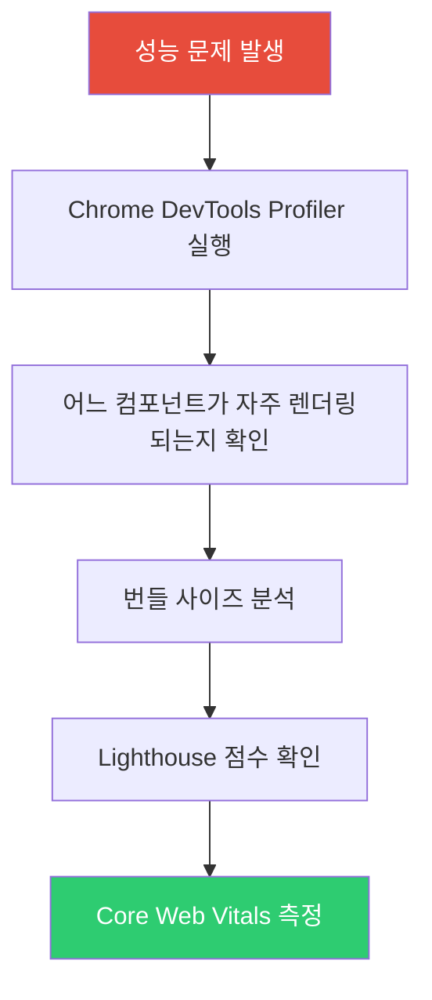
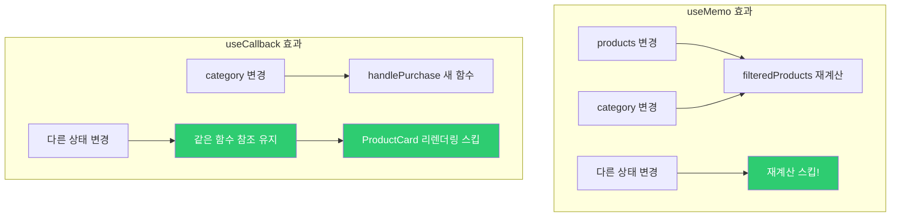
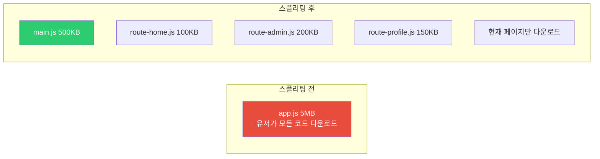
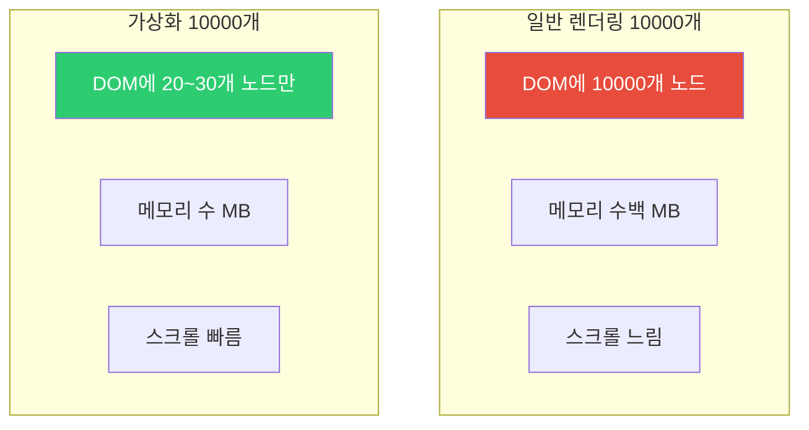
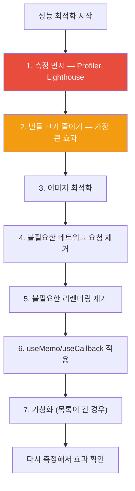

## 막히는 도로를 뚫는 방법

서울-부산 고속도로가 막힌다고 차를 더 빠르게 만들 수는 없습니다. 대신 원인을 찾아서 해결해야 합니다.

1. **불필요한 차량 줄이기** — 불필요한 렌더링 제거 (memo, useMemo)
2. **차선 추가** — 코드 스플리팅으로 번들 분할
3. **미리 길 닦기** — preloading, prefetching
4. **긴급차량 우선** — 우선순위 기반 렌더링 (React 18 Concurrent)

React 성능 최적화도 같은 논리입니다. 그리고 가장 중요한 것은 **먼저 막히는 곳을 찾는 것**입니다. 추측으로 최적화하면 복잡도만 높아지고 효과는 없습니다.

> 비유: 의사가 증상도 듣지 않고 수술부터 하지 않습니다. 진단 → 처방 순서입니다. 성능도 측정 → 최적화 순서입니다.

---

## 1번 다이어그램 - 성능 문제 진단 순서



```javascript
// React DevTools Profiler로 렌더링 시간 측정
import { Profiler } from 'react';

function onRenderCallback(id, phase, actualDuration) {
  console.log(`${id} (${phase}): ${actualDuration}ms`);
  // actualDuration이 큰 컴포넌트가 최적화 대상
}

function App() {
  return (
    <Profiler id="MyComponent" onRender={onRenderCallback}>
      <MyComponent />
    </Profiler>
  );
}
```

---

## 2. React.memo — 부모가 리렌더링돼도 자식은 건너뛰기

부모 컴포넌트가 리렌더링되면 자식도 자동으로 리렌더링됩니다. `React.memo`는 props가 바뀌지 않았을 때 자식 렌더링을 건너뜁니다.

> 비유: 회사 전체 공지가 나가도(부모 리렌더링), 내 업무와 무관한 공지라면(props 변화 없음) 나는 행동을 바꿀 필요가 없습니다(렌더링 스킵).

```jsx
// 문제: count가 바뀔 때마다 UserCard도 리렌더링
function Parent() {
  const [count, setCount] = useState(0);
  const user = { name: '홍길동', age: 25 }; // 매 렌더링마다 새 객체 생성!

  return (
    <>
      <button onClick={() => setCount(c => c + 1)}>count: {count}</button>
      <UserCard user={user} /> {/* count와 무관하지만 계속 리렌더링 */}
    </>
  );
}

// 해결 1: React.memo로 감싸기
const UserCard = React.memo(function UserCard({ user }) {
  console.log('UserCard 렌더링');
  return <div>{user.name}</div>;
});

// 해결 2: user 객체를 useMemo로 안정화 (더 근본적인 해결)
function Parent() {
  const [count, setCount] = useState(0);
  const user = useMemo(() => ({ name: '홍길동', age: 25 }), []); // 안정적인 참조

  return (
    <>
      <button onClick={() => setCount(c => c + 1)}>count: {count}</button>
      <UserCard user={user} /> {/* user 참조가 같으면 스킵 */}
    </>
  );
}
```

React.memo는 얕은 비교를 합니다. `user` 객체를 useMemo로 감싸지 않으면 매 렌더링마다 새 객체가 생성되어 React.memo가 의미 없어집니다.

---

## 3. useMemo와 useCallback 실전

```jsx
function ProductList({ products, category, onPurchase }) {
  // 1. 비싼 필터링 계산 캐싱 — products나 category가 바뀔 때만 재계산
  const filteredProducts = useMemo(() => {
    return products
      .filter(p => p.category === category)
      .sort((a, b) => a.price - b.price);
  }, [products, category]);

  // 2. 함수 참조 안정화 — onPurchase나 category가 바뀔 때만 새 함수
  const handlePurchase = useCallback((productId) => {
    onPurchase(productId, category);
  }, [onPurchase, category]);

  return (
    <div>
      {filteredProducts.map(product => (
        <ProductCard
          key={product.id}
          product={product}
          onPurchase={handlePurchase}
        />
      ))}
    </div>
  );
}
```



---

## 4. 코드 스플리팅 — 지금 필요한 것만 다운로드

번들 전체를 한 번에 다운로드하면 첫 페이지 로딩이 느립니다. 코드 스플리팅은 번들을 여러 청크로 나누어 현재 페이지에 필요한 것만 다운로드합니다.



```jsx
import { lazy, Suspense } from 'react';

// 동적 임포트 — 필요할 때 로드
const AdminPanel = lazy(() => import('./AdminPanel'));
const UserProfile = lazy(() => import('./UserProfile'));

function App() {
  return (
    <Router>
      <Suspense fallback={<LoadingSpinner />}>
        <Routes>
          <Route path="/" element={<Home />} />
          <Route path="/admin" element={<AdminPanel />} />
          <Route path="/profile" element={<UserProfile />} />
        </Routes>
      </Suspense>
    </Router>
  );
}

// 중첩 Suspense로 세밀한 로딩 상태
function Dashboard() {
  return (
    <div>
      <h1>대시보드</h1>
      <Suspense fallback={<ChartSkeleton />}>
        <HeavyChart />
      </Suspense>
      <Suspense fallback={<TableSkeleton />}>
        <DataTable />
      </Suspense>
    </div>
  );
}

// hover 시 미리 로드 — 클릭보다 먼저 준비
const loadAdminPage = () => import('./AdminPage');

<button
  onMouseEnter={loadAdminPage}
  onClick={navigateToAdmin}
>
  관리자 패널
</button>
```

---

## 5. 가상화 — 보이는 것만 렌더링

10,000개 항목 리스트를 DOM에 모두 추가하면 메모리가 폭발하고 스크롤이 느려집니다. 가상화는 화면에 보이는 20~30개만 DOM에 유지하고, 스크롤하면 위치를 다시 계산합니다.

> 비유: 도서관에 책이 10만 권 있어도, 눈에 보이는 선반 한 칸(화면)만 실제로 그립니다. 스크롤하면 다른 선반이 보이도록 교체합니다.

```jsx
import { FixedSizeList } from 'react-window';

function VirtualizedList({ items }) {
  const Row = ({ index, style }) => (
    <div style={style} className="row">
      {items[index].name}
    </div>
  );

  return (
    <FixedSizeList
      height={600}
      itemCount={items.length}
      itemSize={50}      // 각 항목 높이
      width="100%"
    >
      {Row}
    </FixedSizeList>
  );
}
```



---

## 6. 메모리 누수 방지 — useEffect 클린업

메모리 누수는 컴포넌트가 언마운트된 후에도 비동기 작업이 완료되어 setState를 호출하거나, 이벤트 리스너가 제거되지 않을 때 발생합니다.

```jsx
// 문제 패턴들
function LeakyComponent() {
  const [data, setData] = useState(null);

  useEffect(() => {
    // 언마운트 후에도 setState 호출 → 경고/메모리 누수
    fetchData().then(result => {
      setData(result);
    });

    // 이벤트 리스너 미제거 → 메모리 누수
    window.addEventListener('resize', handleResize);

    // 인터벌 미제거 → 계속 실행
    const id = setInterval(pollData, 5000);
  }, []);
}

// 올바른 클린업
function CleanComponent() {
  useEffect(() => {
    let isMounted = true;
    const controller = new AbortController();

    fetchData({ signal: controller.signal })
      .then(result => {
        if (isMounted) setData(result); // 마운트 상태일 때만 setState
      })
      .catch(err => {
        if (err.name !== 'AbortError') console.error(err);
      });

    const handleResize = () => { /* ... */ };
    window.addEventListener('resize', handleResize);

    const intervalId = setInterval(pollData, 5000);

    return () => {
      isMounted = false;        // 언마운트 표시
      controller.abort();       // 진행 중인 fetch 취소
      window.removeEventListener('resize', handleResize);
      clearInterval(intervalId);
    };
  }, []);
}
```

---

## 7. React 18 Concurrent Features — 우선순위 기반 렌더링

React 18에서 도입된 Concurrent 기능은 렌더링에 우선순위를 줍니다. 타이핑 같은 즉각적인 인터랙션은 높은 우선순위, 검색 결과 렌더링은 낮은 우선순위로 처리합니다.

```jsx
import { useTransition, useDeferredValue } from 'react';

// useTransition: 낮은 우선순위 업데이트
function SearchPage() {
  const [query, setQuery] = useState('');
  const [results, setResults] = useState([]);
  const [isPending, startTransition] = useTransition();

  const handleSearch = (e) => {
    const value = e.target.value;
    setQuery(value); // 즉시 업데이트 — 타이핑이 막히면 안 됨

    startTransition(() => {
      // 낮은 우선순위 — 더 중요한 작업이 있으면 나중에 처리
      setResults(searchItems(value));
    });
  };

  return (
    <>
      <input value={query} onChange={handleSearch} />
      {isPending ? (
        <p>검색 중...</p>
      ) : (
        <ResultList results={results} />
      )}
    </>
  );
}

// useDeferredValue: 값의 업데이트를 지연
function SearchResults({ query }) {
  // deferredQuery는 query보다 늦게 업데이트됨
  // 타이핑 중에는 이전 결과 유지, 타이핑 멈추면 새 결과
  const deferredQuery = useDeferredValue(query);

  const results = useMemo(
    () => searchItems(deferredQuery),
    [deferredQuery]
  );

  return <ResultList results={results} />;
}
```

---

## 2번 다이어그램 - 극한 시나리오 — 1만개 항목 실시간 업데이트

```jsx
// 시나리오: 실시간 업데이트되는 1만개 주식 목록
function StockTicker({ stocks }) {
  const [searchQuery, setSearchQuery] = useState('');
  const deferredQuery = useDeferredValue(searchQuery); // 검색어 지연

  // 가상화 + 메모이제이션 조합
  const filteredStocks = useMemo(() => {
    return stocks.filter(s =>
      s.symbol.includes(deferredQuery.toUpperCase())
    );
  }, [stocks, deferredQuery]);

  return (
    <div>
      <input
        value={searchQuery}
        onChange={e => setSearchQuery(e.target.value)}
        placeholder="종목 검색..."
      />
      <FixedSizeList
        height={600}
        itemCount={filteredStocks.length}
        itemSize={40}
        width="100%"
      >
        {({ index, style }) => (
          <StockRow
            key={filteredStocks[index].id}
            stock={filteredStocks[index]}
            style={style}
          />
        )}
      </FixedSizeList>
    </div>
  );
}

// 가격이 변경된 행만 리렌더링
const StockRow = React.memo(
  ({ stock, style }) => (
    <div style={style} className={stock.change > 0 ? 'up' : 'down'}>
      {stock.symbol}: {stock.price}
    </div>
  ),
  (prev, next) =>
    prev.stock.price === next.stock.price &&
    prev.stock.change === next.stock.change
);
```

적용된 최적화가 세 겹입니다. useDeferredValue로 검색 중 기존 결과 유지, useMemo로 필터링 재계산 방지, 가상화로 DOM 노드 수 제한, React.memo로 가격이 바뀐 행만 리렌더링.

---

## 3번 다이어그램 - 성능 최적화 우선순위



### 최적화 체크리스트

| 항목 | 효과 | 복잡도 |
|------|------|--------|
| 이미지 최적화 | 높음 | 낮음 |
| 코드 스플리팅 | 높음 | 중간 |
| Bundle 분석 | 높음 | 낮음 |
| React.memo | 중간 | 낮음 |
| 가상화 react-window | 매우 높음 (목록) | 중간 |
| useMemo/useCallback | 낮음~중간 | 낮음 |
| Concurrent Mode | 중간 | 높음 |

**황금률**: 측정하지 않고 최적화하지 마세요. 추측 기반 최적화는 코드 복잡도만 높이고, 잘못하면 메모이제이션 비용이 절감 효과보다 더 클 수 있습니다. React DevTools Profiler에서 실제로 느린 컴포넌트를 찾은 후에 최적화를 적용하세요.
