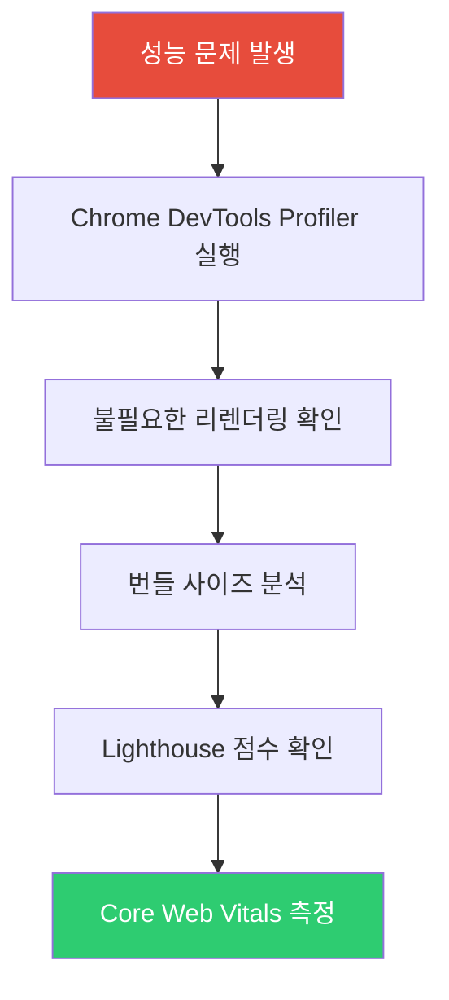
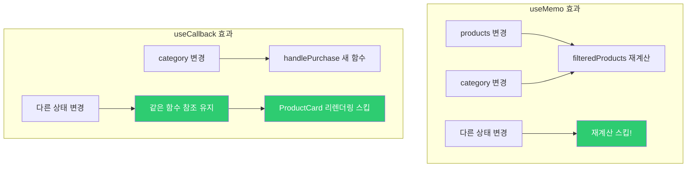
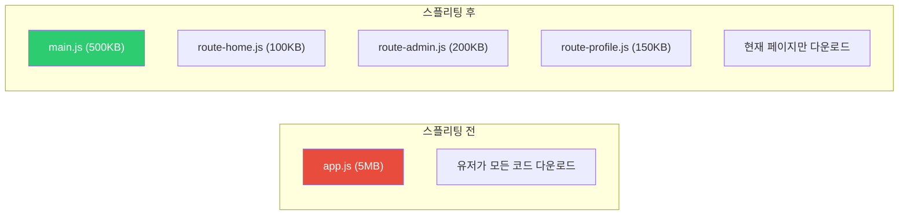
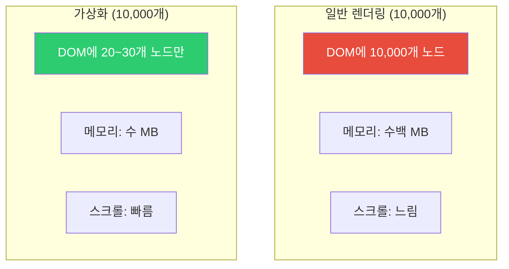
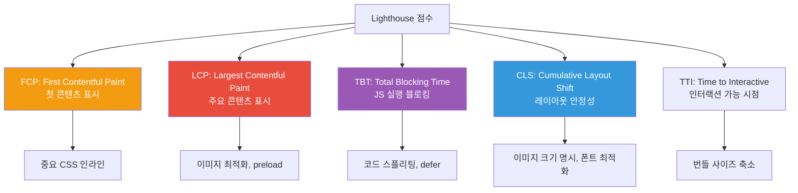

## 고속도로 정체 해결하기

서울-부산 고속도로가 막힌다고 해서 차를 더 빠르게 만들 수는 없습니다. 대신:

1. **불필요한 차량 제거** (불필요한 렌더링 제거 - memo, useMemo)
2. **차선 추가** (코드 스플리팅 - 번들 분할)
3. **미리 길 청소** (preloading, prefetching)
4. **작은 차 우선** (우선순위 기반 렌더링)

React 성능 최적화도 같은 논리입니다.

---

## 1. 성능 문제 진단

최적화 전에 먼저 병목을 찾아야 합니다.



```javascript
// React DevTools Profiler 활용
import { Profiler } from 'react';

function onRenderCallback(id, phase, actualDuration) {
  console.log(`${id} (${phase}): ${actualDuration}ms`);
}

function App() {
  return (
    <Profiler id="MyComponent" onRender={onRenderCallback}>
      <MyComponent />
    </Profiler>
  );
}
```

---

## 2. React.memo - 컴포넌트 메모이제이션

부모가 리렌더링되더라도 props가 같으면 자식은 스킵합니다.

```jsx
// 문제: 부모의 count가 바뀔 때마다 UserCard도 리렌더링
function Parent() {
  const [count, setCount] = useState(0);
  const user = { name: '홍길동', age: 25 }; // 매번 새 객체!

  return (
    <>
      <button onClick={() => setCount(c => c + 1)}>count: {count}</button>
      <UserCard user={user} /> {/* count와 무관하지만 계속 리렌더링 */}
    </>
  );
}

// 해결 1: React.memo
const UserCard = React.memo(function UserCard({ user }) {
  console.log('UserCard 렌더링');
  return <div>{user.name}</div>;
});

// 해결 2: user 객체를 안정적으로 만들기
function Parent() {
  const [count, setCount] = useState(0);
  const user = useMemo(() => ({ name: '홍길동', age: 25 }), []); // 안정적인 참조

  return (
    <>
      <button onClick={() => setCount(c => c + 1)}>count: {count}</button>
      <UserCard user={user} />
    </>
  );
}
```

### React.memo 커스텀 비교

```jsx
const ProductCard = React.memo(
  function ProductCard({ product, onAddToCart }) {
    return (
      <div>
        <h3>{product.name}</h3>
        <p>{product.price}원</p>
        <button onClick={() => onAddToCart(product.id)}>장바구니</button>
      </div>
    );
  },
  // 커스텀 비교 함수
  (prevProps, nextProps) => {
    return (
      prevProps.product.id === nextProps.product.id &&
      prevProps.product.price === nextProps.product.price
    );
    // true 반환 시 리렌더링 스킵
  }
);
```

---

## 3. useMemo와 useCallback 실전

```jsx
function ProductList({ products, category, onPurchase }) {
  // 1. 비싼 필터링 계산 캐싱
  const filteredProducts = useMemo(() => {
    return products
      .filter(p => p.category === category)
      .sort((a, b) => a.price - b.price);
  }, [products, category]);

  // 2. 함수 참조 안정화 (자식에 전달할 때)
  const handlePurchase = useCallback((productId) => {
    onPurchase(productId, category);
  }, [onPurchase, category]);

  return (
    <div>
      {filteredProducts.map(product => (
        <ProductCard
          key={product.id}
          product={product}
          onPurchase={handlePurchase}
        />
      ))}
    </div>
  );
}
```



---

## 4. 코드 스플리팅

번들을 여러 청크로 나누어 초기 로딩 시간을 줄입니다.



### React.lazy와 Suspense

```jsx
import { lazy, Suspense } from 'react';

// 동적 임포트로 코드 스플리팅
const AdminPanel = lazy(() => import('./AdminPanel'));
const UserProfile = lazy(() => import('./UserProfile'));
const Analytics = lazy(() => import('./Analytics'));

function App() {
  return (
    <Router>
      <Suspense fallback={<LoadingSpinner />}>
        <Routes>
          <Route path="/" element={<Home />} />
          <Route path="/admin" element={<AdminPanel />} />
          <Route path="/profile" element={<UserProfile />} />
          <Route path="/analytics" element={<Analytics />} />
        </Routes>
      </Suspense>
    </Router>
  );
}

// 중첩 Suspense로 세밀한 로딩 상태
function Dashboard() {
  return (
    <div>
      <h1>대시보드</h1>
      <Suspense fallback={<ChartSkeleton />}>
        <HeavyChart /> {/* 차트만 별도 로딩 */}
      </Suspense>
      <Suspense fallback={<TableSkeleton />}>
        <DataTable /> {/* 테이블만 별도 로딩 */}
      </Suspense>
    </div>
  );
}
```

### 동적 임포트 패턴

```javascript
// 조건부 로딩
async function loadFeature(featureName) {
  const feature = await import(`./features/${featureName}`);
  return feature.default;
}

// 사용자 액션 시 로딩 (prefetch)
const loadAdminPage = () => import('./AdminPage'); // 컴포넌트 정의 후

// 버튼 hover 시 미리 로드
<button
  onMouseEnter={loadAdminPage} // hover 시 사전 로드
  onClick={navigateToAdmin}
>
  관리자 패널
</button>
```

---

## 5. 가상화 (Virtualization)

긴 목록을 효율적으로 렌더링합니다.

```jsx
import { FixedSizeList } from 'react-window';

// 10,000개 항목을 DOM에 모두 추가하면 느림
// 가상화: 화면에 보이는 것만 렌더링

function VirtualizedList({ items }) {
  const Row = ({ index, style }) => (
    <div style={style} className="row">
      {items[index].name}
    </div>
  );

  return (
    <FixedSizeList
      height={600}      // 컨테이너 높이
      itemCount={items.length}
      itemSize={50}     // 각 항목 높이
      width="100%"
    >
      {Row}
    </FixedSizeList>
  );
}
```



---

## 6. 이미지 최적화

```jsx
// 1. Lazy Loading
function ImageGallery({ images }) {
  return (
    <div>
      {images.map(img => (
        
      ))}
    </div>
  );
}

// 2. IntersectionObserver를 활용한 커스텀 lazy loading
function LazyImage({ src, alt, ...props }) {
  const [isLoaded, setIsLoaded] = useState(false);
  const imgRef = useRef(null);

  useEffect(() => {
    const observer = new IntersectionObserver(
      ([entry]) => {
        if (entry.isIntersecting) {
          setIsLoaded(true);
          observer.unobserve(entry.target);
        }
      },
      { rootMargin: '50px' } // 50px 앞에서 미리 로드
    );

    if (imgRef.current) observer.observe(imgRef.current);
    return () => observer.disconnect();
  }, []);

  return (
    
  );
}
```

---

## 7. 번들 사이즈 최적화

```javascript
// webpack-bundle-analyzer로 번들 분석
// package.json
{
  "scripts": {
    "analyze": "npm run build && npx webpack-bundle-analyzer build/static/js/*.js"
  }
}

// Tree Shaking 활용
// 나쁜 예: 전체 lodash import (400KB)
import _ from 'lodash';
const result = _.map(array, fn);

// 좋은 예: 필요한 함수만 import
import map from 'lodash/map';
const result = map(array, fn);

// 또는 ES6 방식 (Tree Shaking 지원)
import { debounce, throttle } from 'lodash-es';
```

---

## 8. 렌더링 우선순위 - React 18 Concurrent Features

```jsx
import { useTransition, useDeferredValue } from 'react';

// useTransition: 낮은 우선순위 업데이트
function SearchPage() {
  const [query, setQuery] = useState('');
  const [results, setResults] = useState([]);
  const [isPending, startTransition] = useTransition();

  const handleSearch = (e) => {
    const value = e.target.value;
    setQuery(value); // 즉시 업데이트 (높은 우선순위)

    startTransition(() => {
      // 낮은 우선순위 - UI 블로킹 없이 처리
      setResults(searchItems(value));
    });
  };

  return (
    <>
      <input value={query} onChange={handleSearch} />
      {isPending ? (
        <p>검색 중...</p>
      ) : (
        <ResultList results={results} />
      )}
    </>
  );
}

// useDeferredValue: 값의 업데이트 지연
function SearchResults({ query }) {
  const deferredQuery = useDeferredValue(query);
  // deferredQuery는 query보다 늦게 업데이트됨
  // 타이핑 중에는 이전 결과 표시, 타이핑 멈추면 새 결과

  const results = useMemo(
    () => searchItems(deferredQuery),
    [deferredQuery]
  );

  return <ResultList results={results} />;
}
```

---

## 9. 메모리 누수 방지

```jsx
// 문제 패턴들
function LeakyComponent() {
  const [data, setData] = useState(null);

  useEffect(() => {
    // 1. 언마운트 후에도 setState 호출
    fetchData().then(result => {
      setData(result); // 컴포넌트가 언마운트되면 메모리 누수!
    });

    // 2. 이벤트 리스너 미제거
    window.addEventListener('resize', handleResize);

    // 3. 인터벌 미제거
    const id = setInterval(pollData, 5000);
  }, []);
}

// 올바른 클린업
function CleanComponent() {
  const [data, setData] = useState(null);

  useEffect(() => {
    let isMounted = true;
    const controller = new AbortController();

    fetchData({ signal: controller.signal })
      .then(result => {
        if (isMounted) setData(result);
      })
      .catch(err => {
        if (err.name !== 'AbortError') console.error(err);
      });

    const handleResize = () => { /* ... */ };
    window.addEventListener('resize', handleResize);

    const intervalId = setInterval(pollData, 5000);

    return () => {
      isMounted = false;
      controller.abort();
      window.removeEventListener('resize', handleResize);
      clearInterval(intervalId);
    };
  }, []);
}
```

---

## 10. Lighthouse 최적화 전략



```javascript
// Next.js에서 이미지 최적화
import Image from 'next/image';

function OptimizedPage() {
  return (
    <div>
      {/* 자동 최적화: WebP 변환, lazy loading, 크기 지정 */}
      <Image
        src="/hero.jpg"
        alt="히어로 이미지"
        width={1200}
        height={600}
        priority // LCP 이미지는 priority
      />
    </div>
  );
}
```

---

## 11. 극한 시나리오 - 1만개 항목 렌더링

```jsx
// 시나리오: 실시간 업데이트되는 1만개 주식 목록

function StockTicker({ stocks }) {
  // 1. 가상화
  const [isPending, startTransition] = useTransition();

  // 2. 검색어 지연 적용
  const [searchQuery, setSearchQuery] = useState('');
  const deferredQuery = useDeferredValue(searchQuery);

  // 3. 필터링 메모이제이션
  const filteredStocks = useMemo(() => {
    return stocks.filter(s =>
      s.symbol.includes(deferredQuery.toUpperCase())
    );
  }, [stocks, deferredQuery]);

  const handleSearch = (e) => {
    setSearchQuery(e.target.value);
  };

  return (
    <div>
      <input
        value={searchQuery}
        onChange={handleSearch}
        placeholder="종목 검색..."
      />
      {isPending && <div>업데이트 중...</div>}
      <FixedSizeList
        height={600}
        itemCount={filteredStocks.length}
        itemSize={40}
        width="100%"
      >
        {({ index, style }) => (
          <StockRow
            key={filteredStocks[index].id}
            stock={filteredStocks[index]}
            style={style}
          />
        )}
      </FixedSizeList>
    </div>
  );
}

// 개별 행 메모이제이션 (가격이 변경된 것만 리렌더링)
const StockRow = React.memo(
  ({ stock, style }) => (
    <div style={style} className={stock.change > 0 ? 'up' : 'down'}>
      {stock.symbol}: {stock.price}
    </div>
  ),
  (prev, next) =>
    prev.stock.price === next.stock.price &&
    prev.stock.change === next.stock.change
);
```

---

## 12. 성능 최적화 우선순위

```mermaid
flowchart TD
    A["성능 최적화 시작"] --> B["1. 측정 먼저"]
    B --> C["2. 번들 크기 줄이기<br>("가장 큰 효과")"]
    C --> D["3. 불필요한 네트워크 요청 제거"]
    D --> E["4. 이미지 최적화"]
    E --> F["5. 불필요한 리렌더링 제거"]
    F --> G["6. useMemo/useCallback 적용"]
    G --> H["7. 코드 스플리팅"]
    H --> I["측정 결과 확인"]

    style B fill:#e74c3c,color:#fff
    style C fill:#f39c12,color:#fff
```

### 최적화 체크리스트

| 항목 | 효과 | 복잡도 |
|------|------|--------|
| 이미지 최적화 | 높음 | 낮음 |
| 코드 스플리팅 | 높음 | 중간 |
| Bundle 분석 | 높음 | 낮음 |
| React.memo | 중간 | 낮음 |
| 가상화 (react-window) | 매우 높음 (목록) | 중간 |
| useMemo/useCallback | 낮음~중간 | 낮음 |
| Concurrent Mode | 중간 | 높음 |

**황금률**: 측정하지 않고 최적화하지 마세요. 추측 기반 최적화는 코드 복잡도만 높입니다.
