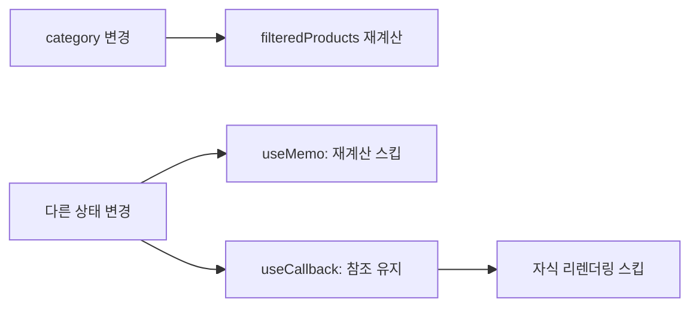
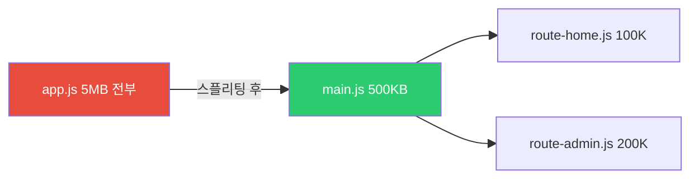
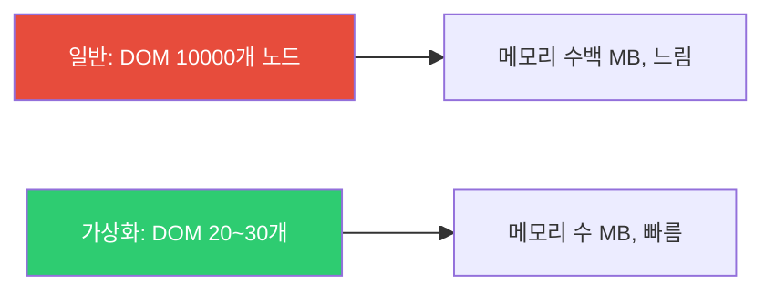
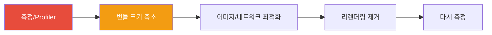

## 막히는 도로를 뚫는 방법

서울-부산 고속도로가 막힌다고 차를 더 빠르게 만들 수는 없습니다. 대신 원인을 찾아서 해결해야 합니다.

1. **불필요한 차량 줄이기** — 불필요한 렌더링 제거 (memo, useMemo)
2. **차선 추가** — 코드 스플리팅으로 번들 분할
3. **미리 길 닦기** — preloading, prefetching
4. **긴급차량 우선** — 우선순위 기반 렌더링 (React 18 Concurrent)

React 성능 최적화도 같은 논리입니다. 그리고 가장 중요한 것은 **먼저 막히는 곳을 찾는 것**입니다. 추측으로 최적화하면 복잡도만 높아지고 효과는 없습니다.

> 비유: 의사가 증상도 듣지 않고 수술부터 하지 않습니다. 진단 → 처방 순서입니다. 성능도 측정 → 최적화 순서입니다.

---

## 1번 다이어그램 - 성능 문제 진단 순서


```javascript
// React DevTools Profiler로 렌더링 시간 측정
import { Profiler } from 'react';

function onRenderCallback(id, phase, actualDuration) {
  console.log(`${id} (${phase}): ${actualDuration}ms`);
  // actualDuration이 큰 컴포넌트가 최적화 대상
}

function App() {
  return (
    <Profiler id="MyComponent" onRender={onRenderCallback}>
      <MyComponent />
    </Profiler>
  );
}
```

---

## 2. React.memo — 부모가 리렌더링돼도 자식은 건너뛰기

부모 컴포넌트가 리렌더링되면 자식도 자동으로 리렌더링됩니다. `React.memo`는 props가 바뀌지 않았을 때 자식 렌더링을 건너뜁니다.

> 비유: 회사 전체 공지가 나가도(부모 리렌더링), 내 업무와 무관한 공지라면(props 변화 없음) 나는 행동을 바꿀 필요가 없습니다(렌더링 스킵).

```jsx
// 문제: count가 바뀔 때마다 UserCard도 리렌더링
function Parent() {
  const [count, setCount] = useState(0);
  const user = { name: '홍길동', age: 25 }; // 매 렌더링마다 새 객체 생성!

  return (
    <>
      <button onClick={() => setCount(c => c + 1)}>count: {count}</button>
      <UserCard user={user} /> {/* count와 무관하지만 계속 리렌더링 */}
    </>
  );
}

// 해결 1: React.memo로 감싸기
const UserCard = React.memo(function UserCard({ user }) {
  console.log('UserCard 렌더링');
  return <div>{user.name}</div>;
});

// 해결 2: user 객체를 useMemo로 안정화 (더 근본적인 해결)
function Parent() {
  const [count, setCount] = useState(0);
  const user = useMemo(() => ({ name: '홍길동', age: 25 }), []); // 안정적인 참조

  return (
    <>
      <button onClick={() => setCount(c => c + 1)}>count: {count}</button>
      <UserCard user={user} /> {/* user 참조가 같으면 스킵 */}
    </>
  );
}
```

React.memo는 얕은 비교를 합니다. `user` 객체를 useMemo로 감싸지 않으면 매 렌더링마다 새 객체가 생성되어 React.memo가 의미 없어집니다.

---

## 3. useMemo와 useCallback 실전

```jsx
function ProductList({ products, category, onPurchase }) {
  // 1. 비싼 필터링 계산 캐싱 — products나 category가 바뀔 때만 재계산
  const filteredProducts = useMemo(() => {
    return products
      .filter(p => p.category === category)
      .sort((a, b) => a.price - b.price);
  }, [products, category]);

  // 2. 함수 참조 안정화 — onPurchase나 category가 바뀔 때만 새 함수
  const handlePurchase = useCallback((productId) => {
    onPurchase(productId, category);
  }, [onPurchase, category]);

  return (
    <div>
      {filteredProducts.map(product => (
        <ProductCard
          key={product.id}
          product={product}
          onPurchase={handlePurchase}
        />
      ))}
    </div>
  );
}
```



---

## 4. 코드 스플리팅 — 지금 필요한 것만 다운로드

번들 전체를 한 번에 다운로드하면 첫 페이지 로딩이 느립니다. 코드 스플리팅은 번들을 여러 청크로 나누어 현재 페이지에 필요한 것만 다운로드합니다.



```jsx
import { lazy, Suspense } from 'react';

// 동적 임포트 — 필요할 때 로드
const AdminPanel = lazy(() => import('./AdminPanel'));
const UserProfile = lazy(() => import('./UserProfile'));

function App() {
  return (
    <Router>
      <Suspense fallback={<LoadingSpinner />}>
        <Routes>
          <Route path="/" element={<Home />} />
          <Route path="/admin" element={<AdminPanel />} />
          <Route path="/profile" element={<UserProfile />} />
        </Routes>
      </Suspense>
    </Router>
  );
}

// 중첩 Suspense로 세밀한 로딩 상태
function Dashboard() {
  return (
    <div>
      <h1>대시보드</h1>
      <Suspense fallback={<ChartSkeleton />}>
        <HeavyChart />
      </Suspense>
      <Suspense fallback={<TableSkeleton />}>
        <DataTable />
      </Suspense>
    </div>
  );
}

// hover 시 미리 로드 — 클릭보다 먼저 준비
const loadAdminPage = () => import('./AdminPage');

<button
  onMouseEnter={loadAdminPage}
  onClick={navigateToAdmin}
>
  관리자 패널
</button>
```

---

## 5. 가상화 — 보이는 것만 렌더링

10,000개 항목 리스트를 DOM에 모두 추가하면 메모리가 폭발하고 스크롤이 느려집니다. 가상화는 화면에 보이는 20~30개만 DOM에 유지하고, 스크롤하면 위치를 다시 계산합니다.

> 비유: 도서관에 책이 10만 권 있어도, 눈에 보이는 선반 한 칸(화면)만 실제로 그립니다. 스크롤하면 다른 선반이 보이도록 교체합니다.

```jsx
import { FixedSizeList } from 'react-window';

function VirtualizedList({ items }) {
  const Row = ({ index, style }) => (
    <div style={style} className="row">
      {items[index].name}
    </div>
  );

  return (
    <FixedSizeList
      height={600}
      itemCount={items.length}
      itemSize={50}      // 각 항목 높이
      width="100%"
    >
      {Row}
    </FixedSizeList>
  );
}
```



---

## 6. 메모리 누수 방지 — useEffect 클린업

메모리 누수는 컴포넌트가 언마운트된 후에도 비동기 작업이 완료되어 setState를 호출하거나, 이벤트 리스너가 제거되지 않을 때 발생합니다.

```jsx
// 문제 패턴들
function LeakyComponent() {
  const [data, setData] = useState(null);

  useEffect(() => {
    // 언마운트 후에도 setState 호출 → 경고/메모리 누수
    fetchData().then(result => {
      setData(result);
    });

    // 이벤트 리스너 미제거 → 메모리 누수
    window.addEventListener('resize', handleResize);

    // 인터벌 미제거 → 계속 실행
    const id = setInterval(pollData, 5000);
  }, []);
}

// 올바른 클린업
function CleanComponent() {
  useEffect(() => {
    let isMounted = true;
    const controller = new AbortController();

    fetchData({ signal: controller.signal })
      .then(result => {
        if (isMounted) setData(result); // 마운트 상태일 때만 setState
      })
      .catch(err => {
        if (err.name !== 'AbortError') console.error(err);
      });

    const handleResize = () => { /* ... */ };
    window.addEventListener('resize', handleResize);

    const intervalId = setInterval(pollData, 5000);

    return () => {
      isMounted = false;        // 언마운트 표시
      controller.abort();       // 진행 중인 fetch 취소
      window.removeEventListener('resize', handleResize);
      clearInterval(intervalId);
    };
  }, []);
}
```

---

## 7. React 18 Concurrent Features — 우선순위 기반 렌더링

React 18에서 도입된 Concurrent 기능은 렌더링에 우선순위를 줍니다. 타이핑 같은 즉각적인 인터랙션은 높은 우선순위, 검색 결과 렌더링은 낮은 우선순위로 처리합니다.

```jsx
import { useTransition, useDeferredValue } from 'react';

// useTransition: 낮은 우선순위 업데이트
function SearchPage() {
  const [query, setQuery] = useState('');
  const [results, setResults] = useState([]);
  const [isPending, startTransition] = useTransition();

  const handleSearch = (e) => {
    const value = e.target.value;
    setQuery(value); // 즉시 업데이트 — 타이핑이 막히면 안 됨

    startTransition(() => {
      // 낮은 우선순위 — 더 중요한 작업이 있으면 나중에 처리
      setResults(searchItems(value));
    });
  };

  return (
    <>
      <input value={query} onChange={handleSearch} />
      {isPending ? (
        <p>검색 중...</p>
      ) : (
        <ResultList results={results} />
      )}
    </>
  );
}

// useDeferredValue: 값의 업데이트를 지연
function SearchResults({ query }) {
  // deferredQuery는 query보다 늦게 업데이트됨
  // 타이핑 중에는 이전 결과 유지, 타이핑 멈추면 새 결과
  const deferredQuery = useDeferredValue(query);

  const results = useMemo(
    () => searchItems(deferredQuery),
    [deferredQuery]
  );

  return <ResultList results={results} />;
}
```

---

## 2번 다이어그램 - 극한 시나리오 — 1만개 항목 실시간 업데이트

```jsx
// 시나리오: 실시간 업데이트되는 1만개 주식 목록
function StockTicker({ stocks }) {
  const [searchQuery, setSearchQuery] = useState('');
  const deferredQuery = useDeferredValue(searchQuery); // 검색어 지연

  // 가상화 + 메모이제이션 조합
  const filteredStocks = useMemo(() => {
    return stocks.filter(s =>
      s.symbol.includes(deferredQuery.toUpperCase())
    );
  }, [stocks, deferredQuery]);

  return (
    <div>
      <input
        value={searchQuery}
        onChange={e => setSearchQuery(e.target.value)}
        placeholder="종목 검색..."
      />
      <FixedSizeList
        height={600}
        itemCount={filteredStocks.length}
        itemSize={40}
        width="100%"
      >
        {({ index, style }) => (
          <StockRow
            key={filteredStocks[index].id}
            stock={filteredStocks[index]}
            style={style}
          />
        )}
      </FixedSizeList>
    </div>
  );
}

// 가격이 변경된 행만 리렌더링
const StockRow = React.memo(
  ({ stock, style }) => (
    <div style={style} className={stock.change > 0 ? 'up' : 'down'}>
      {stock.symbol}: {stock.price}
    </div>
  ),
  (prev, next) =>
    prev.stock.price === next.stock.price &&
    prev.stock.change === next.stock.change
);
```

적용된 최적화가 세 겹입니다. useDeferredValue로 검색 중 기존 결과 유지, useMemo로 필터링 재계산 방지, 가상화로 DOM 노드 수 제한, React.memo로 가격이 바뀐 행만 리렌더링.

---

## 3번 다이어그램 - 성능 최적화 우선순위



### 최적화 체크리스트

| 항목 | 효과 | 복잡도 |
|------|------|--------|
| 이미지 최적화 | 높음 | 낮음 |
| 코드 스플리팅 | 높음 | 중간 |
| Bundle 분석 | 높음 | 낮음 |
| React.memo | 중간 | 낮음 |
| 가상화 react-window | 매우 높음 (목록) | 중간 |
| useMemo/useCallback | 낮음~중간 | 낮음 |
| Concurrent Mode | 중간 | 높음 |

**황금률**: 측정하지 않고 최적화하지 마세요. 추측 기반 최적화는 코드 복잡도만 높이고, 잘못하면 메모이제이션 비용이 절감 효과보다 더 클 수 있습니다. React DevTools Profiler에서 실제로 느린 컴포넌트를 찾은 후에 최적화를 적용하세요.

---

## 왜 React 성능 최적화인가?

| 최적화 기법 | 해결하는 문제 | 적용 난이도 | 효과 |
|-----------|-----------|-----------|-----|
| **코드 스플리팅** | 초기 번들 크기 | 낮음 | 초기 로딩 개선 |
| **React.memo** | 불필요한 리렌더 | 낮음 | 자식 컴포넌트 리렌더 방지 |
| **useMemo/useCallback** | 계산/함수 재생성 | 낮음 | 참조 안정성 |
| **가상화(virtualization)** | 대용량 리스트 렌더 | 중간 | 수천 행 처리 |
| **이미지 최적화** | LCP, 네트워크 | 낮음 | 체감 로딩 속도 |
| **Concurrent Features** | UI 응답성 | 높음 | 인터랙션 부드러움 |

성능 최적화는 측정 → 병목 식별 → 적용 순서로 진행합니다. React DevTools Profiler, Lighthouse, Web Vitals(LCP/FID/CLS)가 측정 도구입니다.

---

## 실무에서 자주 하는 실수

**실수 1. React.memo 없이 모든 자식이 부모 리렌더와 함께 재실행**

```tsx
// 위험: ParentForm이 리렌더될 때마다 ExpensiveChild도 리렌더
function ParentForm() {
  const [input, setInput] = useState('');
  return (
    <>
      <input value={input} onChange={e => setInput(e.target.value)} />
      <ExpensiveChild /> {/* 입력마다 리렌더 */}
    </>
  );
}

// 올바른 방법: React.memo로 props가 바뀌지 않으면 스킵
const ExpensiveChild = React.memo(function ExpensiveChild() {
  return <HeavyVisualization />;
});
```

**실수 2. 인라인 함수/객체로 React.memo 무력화**

```tsx
// 위험: 렌더마다 새 함수/객체 참조 생성 → React.memo 무효
const MemoChild = React.memo(({ onClick, style }) => <div style={style} onClick={onClick} />);

function Parent() {
  return (
    <MemoChild
      onClick={() => console.log('click')} // 매 렌더마다 새 함수
      style={{ color: 'red' }}              // 매 렌더마다 새 객체
    />
  );
}

// 올바른 방법
const handleClick = useCallback(() => console.log('click'), []);
const style = useMemo(() => ({ color: 'red' }), []);
```

**실수 3. 대용량 리스트를 가상화 없이 렌더**

```tsx
// 위험: 10,000개 DOM 노드 생성 → 심각한 성능 저하
{largeList.map(item => <Row key={item.id} item={item} />)}

// 올바른 방법: react-window로 가시 영역만 렌더
import { FixedSizeList } from 'react-window';
<FixedSizeList height={600} itemCount={largeList.length} itemSize={50} width="100%">
  {({ index, style }) => <Row style={style} item={largeList[index]} />}
</FixedSizeList>
```

**실수 4. Lazy loading 미사용으로 초기 번들 비대화**

```tsx
// 비효율: 사용 전에 모든 페이지 컴포넌트를 즉시 로드
import AdminDashboard from './AdminDashboard';
import AnalyticsPage from './AnalyticsPage';

// 올바른 방법: 동적 import로 코드 스플리팅
const AdminDashboard = lazy(() => import('./AdminDashboard'));
const AnalyticsPage = lazy(() => import('./AnalyticsPage'));

// Suspense로 로딩 상태 처리
<Suspense fallback={<Spinner />}>
  <AdminDashboard />
</Suspense>
```

**실수 5. Context 값 변경으로 전체 트리 리렌더**

```tsx
// 위험: theme과 user가 같은 Context에 있으면 theme 변경 시 user 구독 컴포넌트도 리렌더
const AppContext = createContext({ theme, user, setTheme, setUser });

// 올바른 방법: 변경 빈도에 따라 Context 분리
const ThemeContext = createContext({ theme, setTheme });
const UserContext = createContext({ user, setUser });
```

---

## 면접 포인트

**Q1. React.memo와 useMemo의 차이는?**

`React.memo`는 컴포넌트를 감싸는 HOC로, props가 이전과 같으면 리렌더를 스킵합니다. `useMemo`는 Hook으로, 계산된 값을 메모이제이션합니다. `useCallback`은 함수를 메모이제이션해 불필요한 재생성을 막습니다. `React.memo`는 자식 컴포넌트 불필요 리렌더 방지에, `useMemo`는 비용이 큰 계산 결과 재사용에, `useCallback`은 `React.memo`로 감싼 자식에게 안정적인 함수 참조를 전달할 때 사용합니다.

**Q2. 리렌더가 발생하는 조건 4가지를 설명하세요.**

(1) `setState` 호출 — 상태 변경. (2) 부모 컴포넌트 리렌더 — 자식은 기본으로 따라서 리렌더. (3) Context 값 변경 — 구독하는 모든 컴포넌트. (4) `forceUpdate` (클래스 컴포넌트). `React.memo`는 (2)번을 방어하고, Context 분리는 (3)번을 최소화합니다.

**Q3. 가상화(Virtualization)가 성능을 개선하는 원리는?**

리스트의 전체 항목을 DOM에 렌더하는 대신, 현재 뷰포트에 보이는 항목만 렌더합니다. 스크롤 위치에 따라 보이지 않는 항목은 DOM에서 제거하고 새로 보이는 항목을 추가합니다. 10,000개 항목이라도 DOM에는 20~30개만 존재하므로 초기 렌더와 스크롤 성능이 극적으로 개선됩니다. `react-window`(경량)와 `react-virtual`(Tanstack)이 주요 라이브러리입니다.

**Q4. Web Vitals에서 LCP, FID(INP), CLS를 React에서 개선하는 방법은?**

LCP(최대 콘텐츠 페인트): 히어로 이미지에 `priority` 설정, 코드 스플리팅으로 JS 파싱 시간 감소, SSR/SSG로 HTML 먼저 전달. INP(인터랙션 응답): `startTransition`으로 무거운 상태 업데이트를 저우선순위로 전환, 이벤트 핸들러에서 동기 블로킹 제거. CLS(레이아웃 이동): 이미지/iframe에 width/height 고정, 동적 콘텐츠에 최소 높이 예약, 폰트 로딩에 `font-display: swap` 사용.

**Q5. `startTransition`은 어떤 문제를 해결하나요?**

검색 입력처럼 타이핑과 동시에 무거운 필터링 결과를 보여줄 때, 필터링 렌더가 타이핑 UI를 블로킹합니다. `startTransition(() => setFilteredList(...))`으로 필터링 업데이트를 낮은 우선순위로 표시하면, React는 타이핑 상태 업데이트를 먼저 처리하고 필터링은 여유가 생길 때 처리합니다. 사용자는 타이핑이 즉각 반응하는 것으로 느낍니다.
