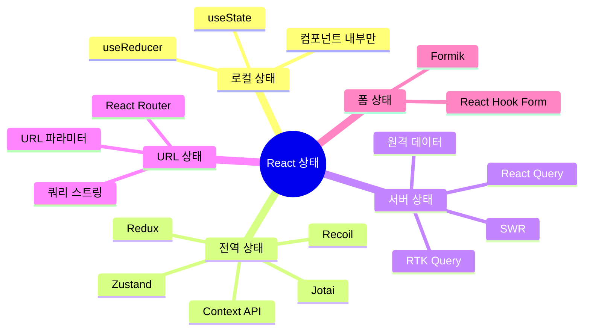
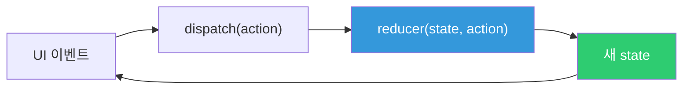
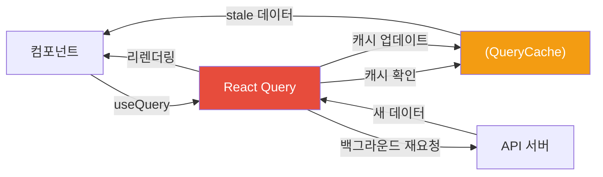
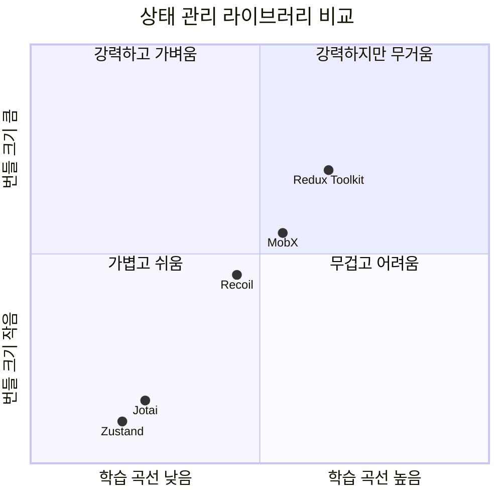
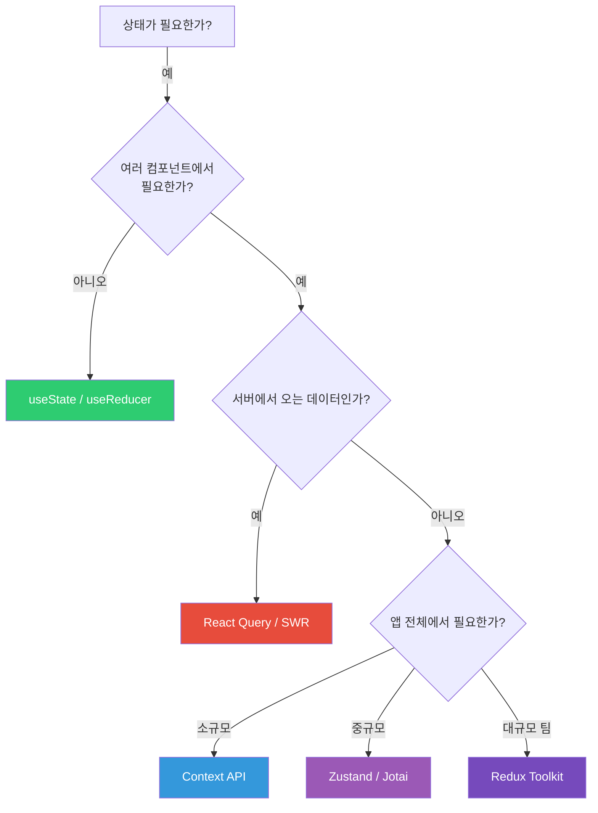

## 왜 이게 중요한가?

상태 관리는 React 애플리케이션의 복잡도와 직결된다. 상태를 어디에 두느냐에 따라 불필요한 리렌더링, prop drilling, 서버-클라이언트 데이터 불일치가 발생한다. useState로 충분한 곳에 Redux를 도입하면 과도한 보일러플레이트가 생기고, 반대로 전역 상태가 필요한 곳에 prop drilling을 방치하면 컴포넌트가 강하게 결합된다. 서버 상태(API 데이터)와 클라이언트 상태(UI 상태)를 구분하는 것이 현대 React 상태 관리의 핵심이다.

## 비유로 이해하기

가족의 가계부 관리를 생각해 봅시다.

- **소규모 가족**: 개인 지갑(useState)으로 충분. 용돈은 각자 관리.
- **중간 규모**: 가족 공동 통장(Context)으로 공유. 중요한 것만 공유.
- **대기업 수준**: 회계팀(Redux)이 모든 지출 내역 관리. 투명하고 감사 가능.
- **현대적 방식**: 앱 기반(Zustand/Recoil)으로 필요한 것만 구독.

---

## 1. 상태의 종류



---

## 2. useState - 기본 로컬 상태

```jsx
import { useState } from 'react';

function Counter() {
  const [count, setCount] = useState(0);

  // 함수형 업데이트 (이전 상태 기반)
  const increment = () => setCount(prev => prev + 1);
  const decrement = () => setCount(prev => prev - 1);
  const reset = () => setCount(0);

  return (
    <div>
      <button onClick={decrement}>-</button>
      <span>{count}</span>
      <button onClick={increment}>+</button>
      <button onClick={reset}>초기화</button>
    </div>
  );
}

// 복잡한 상태
function UserForm() {
  const [user, setUser] = useState({
    name: '',
    email: '',
    age: 0
  });

  const updateField = (field, value) => {
    setUser(prev => ({ ...prev, [field]: value }));
  };

  return (
    <form>
      <input
        value={user.name}
        onChange={e => updateField('name', e.target.value)}
      />
    </form>
  );
}
```

---

## 3. useReducer - 복잡한 로컬 상태

Redux 패턴을 컴포넌트 레벨에서 사용합니다.

```jsx
const initialState = {
  count: 0,
  history: [],
  step: 1
};

function reducer(state, action) {
  switch (action.type) {
    case 'INCREMENT':
      return {
        ...state,
        count: state.count + state.step,
        history: [...state.history, `+${state.step}`]
      };
    case 'DECREMENT':
      return {
        ...state,
        count: state.count - state.step,
        history: [...state.history, `-${state.step}`]
      };
    case 'SET_STEP':
      return { ...state, step: action.payload };
    case 'RESET':
      return initialState;
    default:
      throw new Error(`Unknown action: ${action.type}`);
  }
}

function Counter() {
  const [state, dispatch] = useReducer(reducer, initialState);

  return (
    <div>
      <p>카운트: {state.count}</p>
      <p>기록: {state.history.join(', ')}</p>
      <input
        type="number"
        value={state.step}
        onChange={e => dispatch({ type: 'SET_STEP', payload: +e.target.value })}
      />
      <button onClick={() => dispatch({ type: 'INCREMENT' })}>증가</button>
      <button onClick={() => dispatch({ type: 'DECREMENT' })}>감소</button>
      <button onClick={() => dispatch({ type: 'RESET' })}>초기화</button>
    </div>
  );
}
```



---

## 4. Context API - 전역 상태 공유

Prop Drilling 문제를 해결합니다.


```jsx
// Context 생성
const ThemeContext = createContext({
  theme: 'light',
  toggleTheme: () => {}
});

// Provider 컴포넌트
function ThemeProvider({ children }) {
  const [theme, setTheme] = useState('light');

  const toggleTheme = () => {
    setTheme(prev => prev === 'light' ? 'dark' : 'light');
  };

  return (
    <ThemeContext.Provider value={{ theme, toggleTheme }}>
      {children}
    </ThemeContext.Provider>
  );
}

// 커스텀 훅으로 편리하게 사용
function useTheme() {
  const context = useContext(ThemeContext);
  if (!context) throw new Error('ThemeProvider 안에서 사용하세요');
  return context;
}

// 사용
function ThemedButton() {
  const { theme, toggleTheme } = useTheme();

  return (
    <button
      className={`btn-${theme}`}
      onClick={toggleTheme}
    >
      테마 전환
    </button>
  );
}

// App
function App() {
  return (
    <ThemeProvider>
      <Layout />
    </ThemeProvider>
  );
}
```

### Context 성능 문제

```jsx
// 문제: value 객체가 매번 새로 생성 → 모든 구독자 리렌더링
function BadProvider({ children }) {
  const [user, setUser] = useState(null);
  const [theme, setTheme] = useState('light');

  return (
    <AppContext.Provider value={{ user, setUser, theme, setTheme }}>
      {children}
    </AppContext.Provider>
  );
}

// 해결: Context 분리
function GoodProviders({ children }) {
  return (
    <UserProvider>
      <ThemeProvider>
        {children}
      </ThemeProvider>
    </UserProvider>
  );
}
```

---

## 5. Redux - 예측 가능한 전역 상태

```mermaid
flowchart LR
    VIEW["View ("컴포넌트")"] -->|"dispatch(action)"| STORE["Store"]
    STORE -->|"reducer(state, action)"| NEW_STATE["새 State"]
    NEW_STATE -->|"상태 업데이트"| VIEW

    subgraph "Redux Store"
        STATE["State ("불변")"]
        REDUCER["Reducer ("순수함수")"]
        STATE --> REDUCER
    end

    MIDDLEWARE["Middleware<br>(redux-thunk, saga)"] -->|"비동기 처리"| STORE

    style STORE fill:#764abc,color:#fff
    style MIDDLEWARE fill:#e74c3c,color:#fff
```

### Redux Toolkit (현대적 Redux)

```javascript
// store/userSlice.js
import { createSlice, createAsyncThunk } from '@reduxjs/toolkit';

// 비동기 액션
export const fetchUser = createAsyncThunk(
  'user/fetchUser',
  async (userId, { rejectWithValue }) => {
    try {
      const response = await fetch(`/api/users/${userId}`);
      return await response.json();
    } catch (error) {
      return rejectWithValue(error.message);
    }
  }
);

const userSlice = createSlice({
  name: 'user',
  initialState: {
    data: null,
    loading: false,
    error: null
  },
  reducers: {
    clearUser: (state) => {
      state.data = null;
    },
    updateName: (state, action) => {
      if (state.data) {
        state.data.name = action.payload; // Immer가 불변성 처리
      }
    }
  },
  extraReducers: (builder) => {
    builder
      .addCase(fetchUser.pending, (state) => {
        state.loading = true;
        state.error = null;
      })
      .addCase(fetchUser.fulfilled, (state, action) => {
        state.loading = false;
        state.data = action.payload;
      })
      .addCase(fetchUser.rejected, (state, action) => {
        state.loading = false;
        state.error = action.payload;
      });
  }
});

export const { clearUser, updateName } = userSlice.actions;
export default userSlice.reducer;
```

```javascript
// store/index.js
import { configureStore } from '@reduxjs/toolkit';
import userReducer from './userSlice';
import postsReducer from './postsSlice';

export const store = configureStore({
  reducer: {
    user: userReducer,
    posts: postsReducer
  }
});

// React 컴포넌트에서 사용
function UserProfile({ userId }) {
  const dispatch = useDispatch();
  const { data: user, loading, error } = useSelector(state => state.user);

  useEffect(() => {
    dispatch(fetchUser(userId));
  }, [userId]);

  if (loading) return <Spinner />;
  if (error) return <Error message={error} />;

  return (
    <div>
      <h1>{user?.name}</h1>
      <button onClick={() => dispatch(clearUser())}>로그아웃</button>
    </div>
  );
}
```

---

## 6. Zustand - 간단한 전역 상태

```javascript
import { create } from 'zustand';

// 스토어 생성
const useUserStore = create((set, get) => ({
  user: null,
  isLoading: false,
  error: null,

  fetchUser: async (id) => {
    set({ isLoading: true, error: null });
    try {
      const user = await api.getUser(id);
      set({ user, isLoading: false });
    } catch (error) {
      set({ error: error.message, isLoading: false });
    }
  },

  updateUser: (updates) => {
    set(state => ({
      user: { ...state.user, ...updates }
    }));
  },

  logout: () => set({ user: null })
}));

// 컴포넌트에서 사용 - 필요한 것만 구독
function UserProfile() {
  const user = useUserStore(state => state.user);
  const fetchUser = useUserStore(state => state.fetchUser);

  // user만 구독, 다른 상태 변경 시 리렌더링 안 됨
  return <div>{user?.name}</div>;
}
```

---

## 7. Recoil과 Jotai - 원자 기반 상태

```javascript
// Recoil
import { atom, selector, useRecoilState, useRecoilValue } from 'recoil';

// 원자(atom): 가장 작은 상태 단위
const userAtom = atom({
  key: 'userAtom',
  default: null
});

const themeAtom = atom({
  key: 'themeAtom',
  default: 'light'
});

// 파생 상태(selector)
const userDisplayNameSelector = selector({
  key: 'userDisplayName',
  get: ({ get }) => {
    const user = get(userAtom);
    return user ? `${user.firstName} ${user.lastName}` : '게스트';
  }
});

// 컴포넌트에서 사용
function UserHeader() {
  const displayName = useRecoilValue(userDisplayNameSelector);
  const [theme, setTheme] = useRecoilState(themeAtom);

  return (
    <header className={theme}>
      <span>{displayName}</span>
      <button onClick={() => setTheme(t => t === 'light' ? 'dark' : 'light')}>
        테마 전환
      </button>
    </header>
  );
}
```

```javascript
// Jotai (더 심플)
import { atom, useAtom, useAtomValue } from 'jotai';

const countAtom = atom(0);
const doubleAtom = atom(get => get(countAtom) * 2); // 파생 atom

function Counter() {
  const [count, setCount] = useAtom(countAtom);
  const double = useAtomValue(doubleAtom);

  return (
    <div>
      <p>{count} × 2 = {double}</p>
      <button onClick={() => setCount(c => c + 1)}>+1</button>
    </div>
  );
}
```

---

## 8. 서버 상태 vs 클라이언트 상태

```mermaid
graph TD
    subgraph "클라이언트 상태"
        CS1["UI 상태 ("모달 열림/닫힘")"]
        CS2["폼 입력값"]
        CS3["선택된 탭"]
        CS4["사용자 선호설정"]
    end

    subgraph "서버 상태"
        SS1["원격 데이터"]
        SS2["캐싱 필요"]
        SS3["백그라운드 재요청"]
        SS4["동기화 필요"]
    end

    CS1 --> ZUSTAND["Zustand/Context로 관리"]
    SS1 --> RQ["React Query/SWR로 관리"]

    style ZUSTAND fill:#3498db,color:#fff
    style RQ fill:#e74c3c,color:#fff
```

---

## 9. React Query - 서버 상태 관리

```javascript
import { useQuery, useMutation, useQueryClient } from '@tanstack/react-query';

// useQuery: 데이터 가져오기
function UserList() {
  const {
    data: users,
    isLoading,
    isError,
    error,
    refetch
  } = useQuery({
    queryKey: ['users'],
    queryFn: () => fetch('/api/users').then(r => r.json()),
    staleTime: 5 * 60 * 1000,    // 5분간 fresh
    cacheTime: 10 * 60 * 1000,   // 10분간 캐시 유지
    retry: 3,                      // 실패 시 3회 재시도
    refetchOnWindowFocus: false    // 포커스 시 재요청 안 함
  });

  if (isLoading) return <Skeleton />;
  if (isError) return <Error message={error.message} />;

  return users.map(user => <UserCard key={user.id} user={user} />);
}

// useMutation: 데이터 변경
function CreateUserForm() {
  const queryClient = useQueryClient();

  const mutation = useMutation({
    mutationFn: (newUser) => fetch('/api/users', {
      method: 'POST',
      body: JSON.stringify(newUser)
    }).then(r => r.json()),

    onSuccess: (data) => {
      // 캐시 무효화 → 자동 재요청
      queryClient.invalidateQueries({ queryKey: ['users'] });

      // 또는 낙관적 업데이트
      queryClient.setQueryData(['users'], old => [...old, data]);
    },

    onError: (error) => {
      alert(`생성 실패: ${error.message}`);
    }
  });

  const handleSubmit = (formData) => {
    mutation.mutate(formData);
  };

  return (
    <form onSubmit={handleSubmit}>
      {/* ... */}
      <button type="submit" disabled={mutation.isPending}>
        {mutation.isPending ? '생성 중...' : '사용자 추가'}
      </button>
    </form>
  );
}
```



---

## 10. 상태 관리 라이브러리 비교



| 라이브러리 | 번들 크기 | 학습 곡선 | 특징 | 적합한 경우 |
|-----------|---------|---------|------|-----------|
| useState/useReducer | 0 | 낮음 | 내장 | 컴포넌트 로컬 상태 |
| Context API | 0 | 낮음 | 내장 | 간단한 전역 상태 |
| Zustand | ~1KB | 매우 낮음 | 심플 | 중소규모 앱 |
| Jotai | ~3KB | 낮음 | 원자 기반 | 세밀한 최적화 필요 |
| Recoil | ~20KB | 중간 | 원자+파생 | 복잡한 의존관계 |
| Redux Toolkit | ~15KB | 높음 | 예측 가능 | 대규모 팀 협업 |
| React Query | ~13KB | 중간 | 서버 상태 | API 집중적 앱 |

---

## 11. 상태 설계 원칙



### 좋은 상태 설계 원칙

```javascript
// 원칙 1: 파생 가능한 값은 상태로 만들지 말 것
// 나쁨
const [firstName, setFirstName] = useState('홍');
const [lastName, setLastName] = useState('길동');
const [fullName, setFullName] = useState('홍길동'); // 파생 가능!

// 좋음
const [firstName, setFirstName] = useState('홍');
const [lastName, setLastName] = useState('길동');
const fullName = `${firstName}${lastName}`; // 파생값은 계산

// 원칙 2: 서버 상태는 클라이언트에서 복제하지 말 것
// 나쁨
const [serverUsers, setServerUsers] = useState([]);
const { data: users } = useQuery(['users'], fetchUsers);
useEffect(() => { setServerUsers(users); }, [users]); // 복제 불필요

// 좋음
const { data: users } = useQuery(['users'], fetchUsers);
// React Query가 캐싱, 동기화 자동 처리

// 원칙 3: 가장 가까운 공통 부모에 상태 배치
function Parent() {
  const [shared, setShared] = useState(null); // 두 자식이 공유
  return (
    <>
      <ChildA shared={shared} />
      <ChildB shared={shared} onUpdate={setShared} />
    </>
  );
}
```

---

## 12. 극한 시나리오

### 시나리오 1: Context 값이 바뀔 때마다 전체 트리가 리렌더링된다

```jsx
// 문제: user와 theme이 하나의 Context에 묶여 있어
//       theme만 바뀌어도 user를 사용하는 컴포넌트까지 리렌더링
const AppContext = createContext({ user, theme });

// 해결 1: Context 분리
const UserContext = createContext(user);
const ThemeContext = createContext(theme);

// 해결 2: useMemo로 value 안정화
const value = useMemo(() => ({ user, updateUser }), [user]);
<UserContext.Provider value={value}>
```

Context를 분리하면 각 Context 구독자가 관련 상태 변경 시에만 리렌더링된다.

### 시나리오 2: Redux 상태는 바뀌는데 컴포넌트가 리렌더링되지 않는다

```javascript
// 문제: 객체 직접 변이
const userSlice = createSlice({
  reducers: {
    updateName: (state, action) => {
      state.data.name = action.payload; // Immer 사용 중이면 OK
      // 하지만 Immer 없이 직접 변이하면 참조가 같아 리렌더링 안 됨
    }
  }
});

// Redux Toolkit은 Immer를 내장하므로 직접 변이처럼 보이는 코드가 안전하게 동작
// 순수 Redux에서는 반드시 새 객체 반환 필요
return { ...state, data: { ...state.data, name: action.payload } };
```

### 시나리오 3: React Query 캐시가 stale한 데이터를 보여준다

```javascript
// 증상: 다른 탭에서 데이터를 수정했는데
//       이 탭은 여전히 오래된 데이터를 표시

// 해결 1: staleTime을 0으로 설정 (매번 재검증)
useQuery({ queryKey: ['users'], staleTime: 0 });

// 해결 2: 윈도우 포커스 시 재요청 활성화
useQuery({ queryKey: ['users'], refetchOnWindowFocus: true });

// 해결 3: WebSocket이나 SSE로 서버 변경 시 invalidateQueries 호출
queryClient.invalidateQueries({ queryKey: ['users'] });
```

staleTime과 refetchOnWindowFocus 설정은 데이터 신선도와 네트워크 요청 비용 사이의 트레이드오프다. 실시간성이 중요한 데이터는 staleTime을 낮게, 거의 변하지 않는 데이터는 높게 설정한다.

---

## 13. 정리

상태 관리의 핵심은 **"이 상태를 어디에 두어야 하는가?"**를 결정하는 것입니다.

1. **로컬 상태**: `useState`, `useReducer` - 컴포넌트 안에서만 사용
2. **공유 전역 상태**: `Zustand`, `Context` - 여러 컴포넌트가 공유
3. **서버 상태**: `React Query`, `SWR` - API 데이터 캐싱과 동기화
4. **복잡한 대규모**: `Redux Toolkit` - 큰 팀, 예측 가능성 필요

과도한 상태 관리 라이브러리 도입보다 **올바른 상태 분류**가 더 중요합니다.
