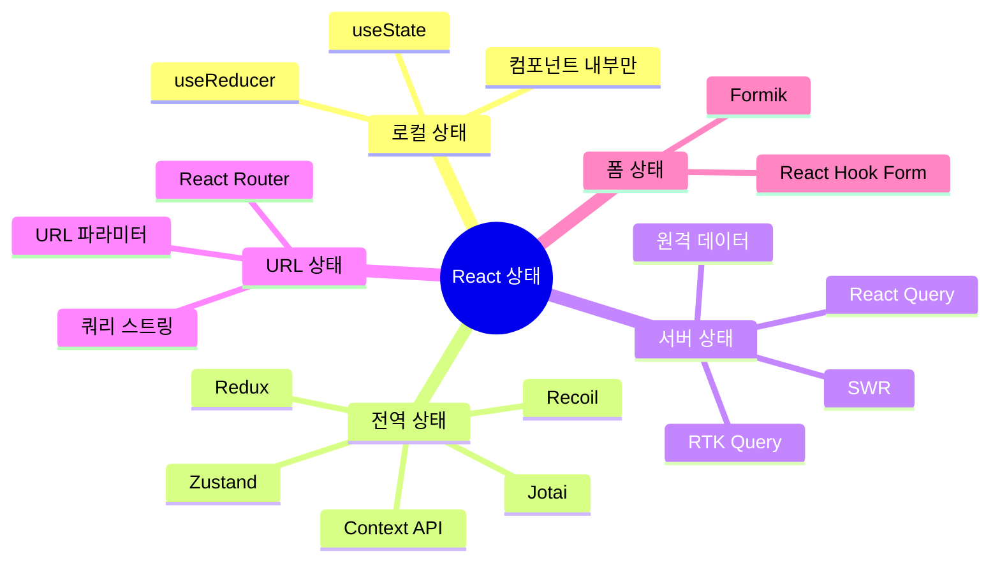
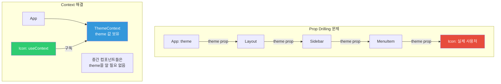
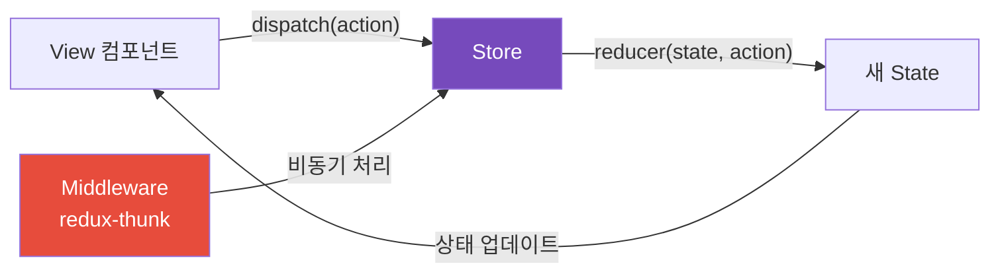
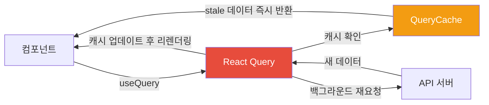
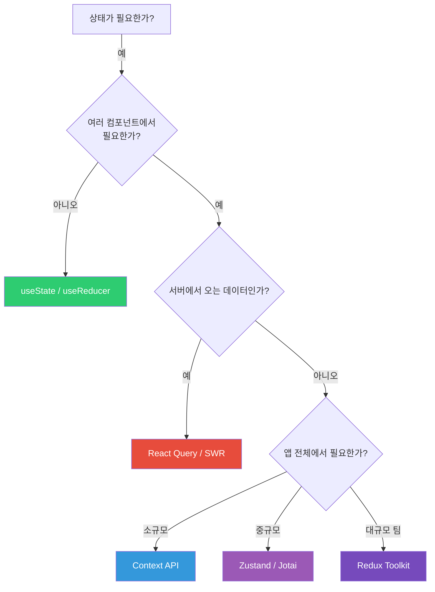

## "이 상태를 어디에 두어야 할까"라는 질문

React 개발자가 가장 많이 고민하는 것 중 하나입니다. useState로 충분한 곳에 Redux를 도입하면 파일이 4개씩 늘어나는 보일러플레이트 지옥이 됩니다. 반대로 전역 상태가 필요한 곳에 props를 5단계씩 내려보내면(prop drilling) 컴포넌트들이 강하게 결합되어 고치기 어려워집니다.

그리고 많은 개발자가 놓치는 중요한 구분이 있습니다. **서버 상태(API 데이터)**와 **클라이언트 상태(UI 상태)**는 완전히 다른 종류입니다. 이 둘을 구분하는 것이 현대 React 상태 관리의 핵심입니다.

> 비유: 가족의 가계부 관리처럼 생각해 보세요. 소규모 가족은 개인 지갑(useState)으로 충분합니다. 중간 규모 가족은 공동 통장(Context)이 필요합니다. 대기업 규모면 회계팀(Redux)이 모든 지출을 투명하게 관리합니다. 현대적으로는 앱 기반 관리(Zustand)로 필요한 것만 구독합니다.

---

## 1번 다이어그램 - 상태의 종류



---

## 2. useState — 가장 작은 단위

로컬 상태는 그 컴포넌트와 자식 컴포넌트만 필요한 상태입니다. 모달이 열려 있는지, 탭이 선택되어 있는지, 입력 폼의 현재 값처럼요.

```jsx
function Counter() {
  const [count, setCount] = useState(0);

  // 함수형 업데이트 — 이전 상태를 기반으로 할 때
  const increment = () => setCount(prev => prev + 1);
  const decrement = () => setCount(prev => prev - 1);

  return (
    <div>
      <button onClick={decrement}>-</button>
      <span>{count}</span>
      <button onClick={increment}>+</button>
    </div>
  );
}
```

---

## 3. useReducer — 복잡한 로컬 상태

여러 상태가 서로 연관되어 있고, 상태 전환 로직이 복잡할 때 useReducer가 useState보다 깔끔합니다. 상태 변경 로직이 컴포넌트 바깥에 정의되므로 테스트하기도 쉽습니다.

> 비유: 자판기와 같습니다. 자판기(reducer)는 동전 투입, 음료 선택, 취소 같은 동작(action)에 따라 정해진 방식으로 상태를 바꿉니다. 임의로 내부를 손댈 수 없고 정해진 동작만 가능합니다.

```jsx
const initialState = { count: 0, history: [], step: 1 };

function reducer(state, action) {
  switch (action.type) {
    case 'INCREMENT':
      return {
        ...state,
        count: state.count + state.step,
        history: [...state.history, `+${state.step}`]
      };
    case 'DECREMENT':
      return {
        ...state,
        count: state.count - state.step,
        history: [...state.history, `-${state.step}`]
      };
    case 'SET_STEP':
      return { ...state, step: action.payload };
    case 'RESET':
      return initialState;
    default:
      throw new Error(`Unknown action: ${action.type}`);
  }
}

function Counter() {
  const [state, dispatch] = useReducer(reducer, initialState);

  return (
    <div>
      <p>카운트: {state.count}</p>
      <p>기록: {state.history.join(', ')}</p>
      <input
        type="number"
        value={state.step}
        onChange={e => dispatch({ type: 'SET_STEP', payload: +e.target.value })}
      />
      <button onClick={() => dispatch({ type: 'INCREMENT' })}>증가</button>
      <button onClick={() => dispatch({ type: 'DECREMENT' })}>감소</button>
    </div>
  );
}
```

---

## 4. Context API — Prop Drilling 해결

Prop Drilling은 데이터가 필요한 컴포넌트까지 중간 컴포넌트들이 쓸데없이 props를 받아서 아래로 전달하는 문제입니다.



```jsx
const ThemeContext = createContext({ theme: 'light', toggleTheme: () => {} });

function ThemeProvider({ children }) {
  const [theme, setTheme] = useState('light');
  const toggleTheme = () => setTheme(prev => prev === 'light' ? 'dark' : 'light');

  return (
    <ThemeContext.Provider value={{ theme, toggleTheme }}>
      {children}
    </ThemeContext.Provider>
  );
}

// 커스텀 훅으로 래핑 — Provider 바깥에서 쓰면 명확한 에러
function useTheme() {
  const context = useContext(ThemeContext);
  if (!context) throw new Error('ThemeProvider 안에서 사용하세요');
  return context;
}

function ThemedButton() {
  const { theme, toggleTheme } = useTheme();
  return (
    <button className={`btn-${theme}`} onClick={toggleTheme}>
      테마 전환
    </button>
  );
}
```

### Context 성능 주의

```jsx
// 문제: value 객체가 매 렌더링마다 새로 생성 → 모든 구독자 리렌더링
function BadProvider({ children }) {
  const [user, setUser] = useState(null);
  const [theme, setTheme] = useState('light');

  // 매 렌더링마다 새 객체 생성!
  return (
    <AppContext.Provider value={{ user, setUser, theme, setTheme }}>
      {children}
    </AppContext.Provider>
  );
}

// 해결: Context를 관심사별로 분리
function GoodProviders({ children }) {
  return (
    <UserProvider>
      <ThemeProvider>
        {children}
      </ThemeProvider>
    </UserProvider>
  );
}
// theme만 바뀌면 ThemeContext 구독자만 리렌더링, UserContext 구독자는 스킵
```

---

## 5. Redux Toolkit — 대규모 팀의 선택

Redux는 "모든 상태 변경이 예측 가능하고 추적 가능해야 한다"는 철학을 가집니다. 그래서 상태를 직접 수정하지 않고 action을 dispatch하고 reducer가 처리합니다.



```javascript
// store/userSlice.js — Redux Toolkit은 Immer 내장으로 불변성 자동 처리
import { createSlice, createAsyncThunk } from '@reduxjs/toolkit';

// 비동기 액션
export const fetchUser = createAsyncThunk(
  'user/fetchUser',
  async (userId, { rejectWithValue }) => {
    try {
      const response = await fetch(`/api/users/${userId}`);
      return await response.json();
    } catch (error) {
      return rejectWithValue(error.message);
    }
  }
);

const userSlice = createSlice({
  name: 'user',
  initialState: { data: null, loading: false, error: null },
  reducers: {
    clearUser: (state) => { state.data = null; },
    updateName: (state, action) => {
      if (state.data) state.data.name = action.payload; // Immer가 불변성 처리
    }
  },
  extraReducers: (builder) => {
    builder
      .addCase(fetchUser.pending, (state) => { state.loading = true; })
      .addCase(fetchUser.fulfilled, (state, action) => {
        state.loading = false;
        state.data = action.payload;
      })
      .addCase(fetchUser.rejected, (state, action) => {
        state.loading = false;
        state.error = action.payload;
      });
  }
});

// 컴포넌트에서 사용
function UserProfile({ userId }) {
  const dispatch = useDispatch();
  const { data: user, loading, error } = useSelector(state => state.user);

  useEffect(() => { dispatch(fetchUser(userId)); }, [userId]);

  if (loading) return <Spinner />;
  if (error) return <Error message={error} />;
  return <div><h1>{user?.name}</h1></div>;
}
```

---

## 6. Zustand — 심플하게 전역 상태

Zustand는 Redux의 복잡한 구조 없이 전역 상태를 관리합니다. Provider가 필요 없고, 필요한 상태만 구독할 수 있습니다.

> 비유: Redux가 공식 회의록 시스템이라면(모든 절차 준수), Zustand는 팀 채팅방입니다. 필요한 사람만 채팅방에 들어와서 필요한 정보만 봅니다.

```javascript
import { create } from 'zustand';

const useUserStore = create((set, get) => ({
  user: null,
  isLoading: false,
  error: null,

  fetchUser: async (id) => {
    set({ isLoading: true, error: null });
    try {
      const user = await api.getUser(id);
      set({ user, isLoading: false });
    } catch (error) {
      set({ error: error.message, isLoading: false });
    }
  },

  logout: () => set({ user: null })
}));

// 컴포넌트에서 사용 — 필요한 것만 구독
function UserProfile() {
  const user = useUserStore(state => state.user);
  const fetchUser = useUserStore(state => state.fetchUser);

  // user만 구독 → 다른 상태(isLoading 등)가 바뀌어도 이 컴포넌트는 리렌더링 안 됨
  return <div>{user?.name}</div>;
}
```

---

## 7. React Query — 서버 상태는 별도로 관리

API 데이터는 로컬 상태와 전혀 다른 특성을 가집니다. 캐싱이 필요하고, 만료되면 재요청해야 하고, 여러 컴포넌트가 같은 데이터를 공유해야 합니다. React Query가 이것을 자동으로 처리합니다.

> 비유: React Query는 스마트한 캐시 레이어입니다. 처음 요청하면 서버에서 가져오고, 두 번째 요청은 캐시에서 즉시 반환합니다. 데이터가 오래되면 백그라운드에서 조용히 새 데이터로 교체합니다.

```javascript
function UserList() {
  const {
    data: users,
    isLoading,
    isError,
    error
  } = useQuery({
    queryKey: ['users'],
    queryFn: () => fetch('/api/users').then(r => r.json()),
    staleTime: 5 * 60 * 1000,  // 5분간 fresh (재요청 안 함)
    retry: 3                    // 실패 시 3회 재시도
  });

  if (isLoading) return <Skeleton />;
  if (isError) return <Error message={error.message} />;
  return users.map(user => <UserCard key={user.id} user={user} />);
}

function CreateUserForm() {
  const queryClient = useQueryClient();

  const mutation = useMutation({
    mutationFn: (newUser) => fetch('/api/users', {
      method: 'POST',
      body: JSON.stringify(newUser)
    }).then(r => r.json()),

    onSuccess: () => {
      // 캐시 무효화 → 목록 자동 갱신
      queryClient.invalidateQueries({ queryKey: ['users'] });
    }
  });

  return (
    <form onSubmit={e => { e.preventDefault(); mutation.mutate(formData); }}>
      <button type="submit" disabled={mutation.isPending}>
        {mutation.isPending ? '생성 중...' : '사용자 추가'}
      </button>
    </form>
  );
}
```



---

## 8번 다이어그램 - 상태 설계 결정 트리



---

## 9. 좋은 상태 설계 원칙

```javascript
// 원칙 1: 파생 가능한 값은 상태로 만들지 마세요
// 나쁨
const [firstName, setFirstName] = useState('홍');
const [lastName, setLastName] = useState('길동');
const [fullName, setFullName] = useState('홍길동'); // 파생 가능한 값!

// 좋음
const [firstName, setFirstName] = useState('홍');
const [lastName, setLastName] = useState('길동');
const fullName = `${firstName}${lastName}`; // 계산으로 충분

// 원칙 2: 서버 상태는 클라이언트에서 복제하지 마세요
// 나쁨 — 같은 데이터가 두 군데
const { data: users } = useQuery(['users'], fetchUsers);
const [localUsers, setLocalUsers] = useState([]);
useEffect(() => { setLocalUsers(users); }, [users]); // 불필요한 복제

// 좋음 — React Query가 캐싱과 동기화 자동 처리
const { data: users } = useQuery(['users'], fetchUsers);

// 원칙 3: 가장 가까운 공통 부모에 상태 배치
function Parent() {
  const [shared, setShared] = useState(null);
  return (
    <>
      <ChildA shared={shared} />
      <ChildB shared={shared} onUpdate={setShared} />
    </>
  );
}
```

---

## 10. 라이브러리 비교

| 라이브러리 | 번들 크기 | 학습 곡선 | 특징 | 적합한 경우 |
|-----------|---------|---------|------|-----------|
| useState/useReducer | 0 | 낮음 | 내장 | 컴포넌트 로컬 상태 |
| Context API | 0 | 낮음 | 내장 | 간단한 전역 상태 |
| Zustand | ~1KB | 매우 낮음 | 심플 | 중소규모 앱 |
| Jotai | ~3KB | 낮음 | 원자 기반 | 세밀한 최적화 |
| Recoil | ~20KB | 중간 | 원자+파생 | 복잡한 의존관계 |
| Redux Toolkit | ~15KB | 높음 | 예측 가능 | 대규모 팀 협업 |
| React Query | ~13KB | 중간 | 서버 상태 전용 | API 집중적 앱 |

---

<details class="extreme-scenario-details">
<summary class="extreme-scenario-summary">
<span class="extreme-scenario-icon">🔥</span>
<span class="extreme-scenario-label">극한 시나리오 — 클릭하여 펼치기</span>
<span class="extreme-scenario-toggle"></span>
</summary>
<div class="extreme-scenario-body">

<div class="extreme-scenario-content" markdown="1">

### Context 값이 바뀔 때마다 전체 트리가 리렌더링된다

```jsx
// 문제: user와 theme이 하나의 Context에 묶여 있어
// theme만 바뀌어도 user를 쓰는 컴포넌트까지 리렌더링
const AppContext = createContext({ user, theme });

// 해결 1: Context 분리
const UserContext = createContext(user);
const ThemeContext = createContext(theme);

// 해결 2: useMemo로 value 안정화
const value = useMemo(() => ({ user, updateUser }), [user]);
<UserContext.Provider value={value}>
```

### React Query 캐시가 오래된 데이터를 보여준다

```javascript
// 다른 탭에서 데이터를 수정했는데 이 탭은 여전히 오래된 데이터를 표시

// 해결 1: staleTime을 낮게 설정
useQuery({ queryKey: ['users'], staleTime: 0 }); // 항상 재검증

// 해결 2: 윈도우 포커스 시 재요청 활성화
useQuery({ queryKey: ['users'], refetchOnWindowFocus: true });

// 해결 3: 데이터 변경 후 수동으로 캐시 무효화
queryClient.invalidateQueries({ queryKey: ['users'] });
```

상태 관리의 핵심은 **"이 상태를 어디에 두어야 하는가?"** 를 결정하는 것입니다. 로컬 상태는 `useState`, 서버 상태는 `React Query`, 전역 UI 상태는 `Zustand` 또는 `Context`. 이 세 가지 분류만 확실히 이해해도 대부분의 상태 관리 문제를 해결할 수 있습니다. 과도한 라이브러리 도입보다 올바른 상태 분류가 훨씬 중요합니다.
</div>
</div>
</details>

