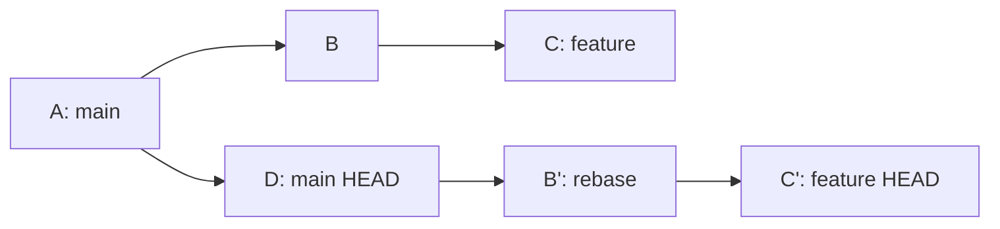
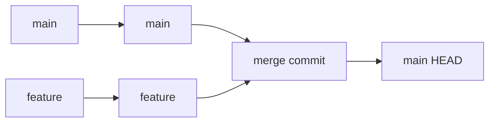
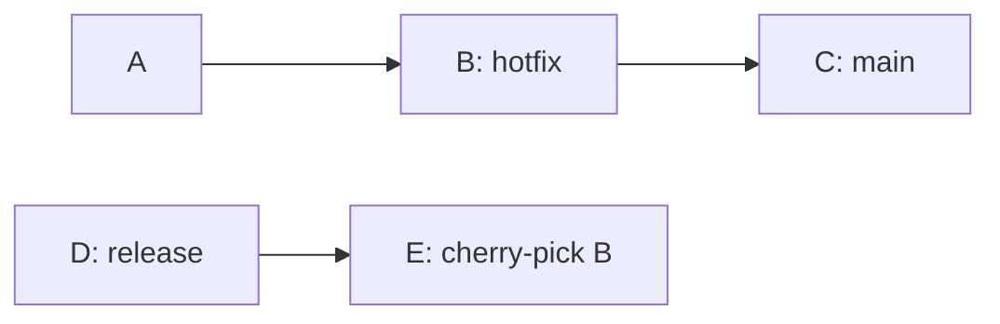
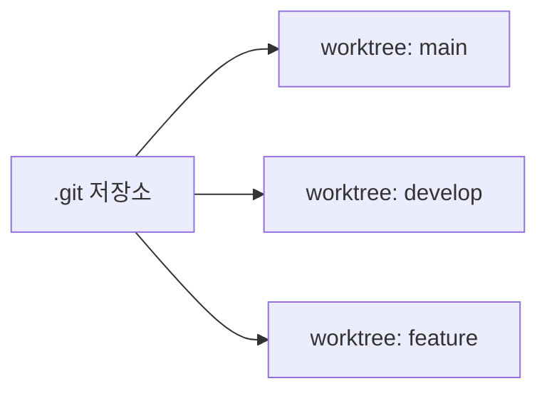
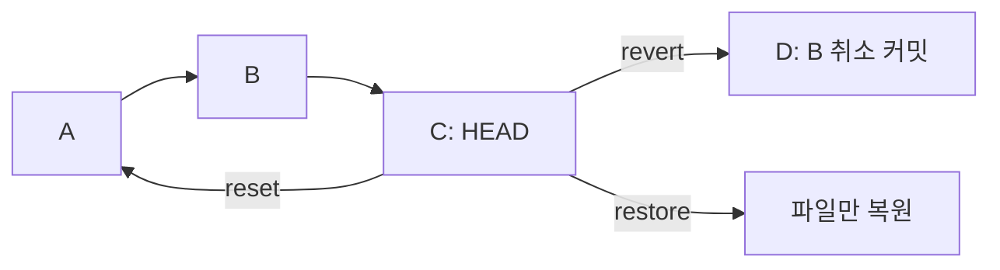
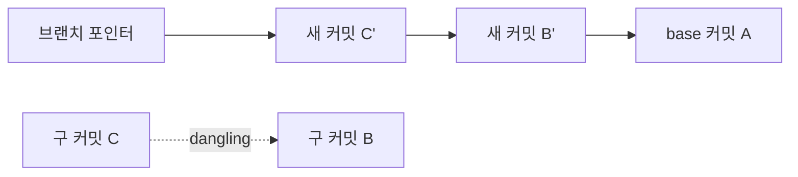
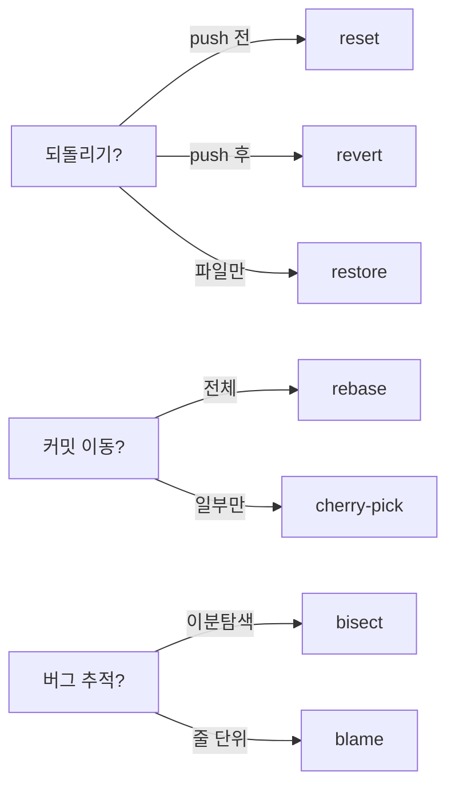

`git add`, `git commit`, `git push`만으로 버티는 시대는 끝났다. 실무에서 커밋 히스토리가 꼬이고, 핫픽스를 특정 브랜치에만 옮겨야 하고, "어제까지는 됐는데 오늘 터졌다"를 추적해야 하는 순간이 반드시 온다. 이 글에서는 **rebase, cherry-pick, bisect, reflog, stash, worktree** 등 Git 고급 명령어를 실전 시나리오 중심으로 파고든다. 각 명령어가 내부적으로 무엇을 하는지, 언제 써야 하는지, 극한 상황에서 어떻게 복구하는지까지 전부 다룬다.

> **비유로 먼저 이해하기**: Git 기본 명령어가 자동차의 액셀·브레이크·핸들이라면, 고급 명령어는 **정비 도구 세트**다. 평소에는 몰라도 되지만, 타이어가 펑크 나거나 엔진 경고등이 켜지면 이 도구 없이는 아무것도 할 수 없다.

<br>

## 1. 한 줄 요약

| 명령어 | 한 줄 설명 | 핵심 키워드 |
|--------|-----------|------------|
| `rebase` | 커밋을 다른 베이스 위에 **재배치** | 히스토리 정리 |
| `cherry-pick` | 특정 커밋만 **골라서** 적용 | 핫픽스 이식 |
| `bisect` | 이분 탐색으로 **버그 커밋** 찾기 | 자동 디버깅 |
| `reflog` | HEAD 이동 **전체 기록** 조회 | 실수 복구 |
| `stash` | 작업 중 변경사항 **임시 보관** | 컨텍스트 전환 |
| `worktree` | 하나의 저장소에서 **병렬 디렉토리** 작업 | PR 리뷰 |
| `reset` | HEAD를 **이동**시켜 되돌리기 | 로컬 수정 |
| `revert` | 되돌리는 **새 커밋** 생성 | 안전한 롤백 |
| `restore` | 작업 디렉토리/스테이지 **파일 복원** | 파일 단위 |

<br>

## 2. Rebase 심화 — 히스토리를 다시 쓴다

### 2-1. Rebase의 본질

`git rebase`는 커밋의 **부모를 바꾸는** 작업이다. 기존 커밋을 새 베이스 위에 하나씩 다시 적용(replay)하면서 **새로운 커밋 해시**를 생성한다. 원본 커밋은 사라지지 않지만 더 이상 어떤 브랜치도 가리키지 않게 된다.

> **비유**: 책의 3장~5장을 1장 뒤에 끼워넣었던 것을 빼서 7장 뒤에 다시 붙이는 작업이다. 내용(diff)은 같지만 페이지 번호(커밋 해시)는 전부 바뀐다.

```bash
# feature 브랜치를 main의 최신 커밋 위로 재배치
git checkout feature
git rebase main
```



위 다이어그램에서 B와 C는 원본, B'과 C'은 rebase 후 새로 생성된 커밋이다. 해시가 다르지만 diff 내용은 동일하다.

### 2-2. Interactive Rebase — 히스토리 편집기

`git rebase -i`는 Git에서 가장 강력한 히스토리 편집 도구다. 커밋 순서 변경, 합치기, 메시지 수정, 삭제까지 모두 가능하다.

```bash
# 최근 5개 커밋을 대화형으로 편집
git rebase -i HEAD~5
```

에디터가 열리면 아래와 같은 목록이 나타난다.

```
pick abc1234 feat: 로그인 API 추가
pick def5678 fix: 로그인 에러 수정
pick ghi9012 fix: 오타 수정
pick jkl3456 feat: 회원가입 API 추가
pick mno7890 style: 코드 포맷팅
```

각 줄 앞의 명령어를 바꿔서 히스토리를 편집한다.

| 명령어 | 동작 | 언제 사용하는가 |
|--------|------|----------------|
| `pick` | 커밋 그대로 유지 | 기본값 |
| `reword` | 커밋 메시지만 변경 | 오타 수정, 컨벤션 통일 |
| `edit` | 커밋에서 멈추고 수정 가능 | 코드 변경 필요 |
| `squash` | 이전 커밋과 합치기 (메시지 병합) | 관련 커밋 정리 |
| `fixup` | 이전 커밋과 합치기 (메시지 버림) | 사소한 수정 흡수 |
| `drop` | 커밋 삭제 | 불필요한 커밋 제거 |
| `exec` | 셸 명령어 실행 | 각 커밋마다 테스트 |

### 2-3. Squash와 Fixup — 지저분한 커밋 정리

실무에서 가장 많이 쓰는 interactive rebase 패턴이다. "WIP", "fix typo", "oops" 같은 커밋을 의미 있는 단위로 합친다.

```
pick abc1234 feat: 로그인 API 추가
fixup def5678 fix: 로그인 에러 수정
fixup ghi9012 fix: 오타 수정
pick jkl3456 feat: 회원가입 API 추가
fixup mno7890 style: 코드 포맷팅
```

위 예시를 실행하면 5개의 커밋이 **2개**로 깔끔하게 정리된다.

> **비유**: 편지를 세 번 고쳐 썼다면, 최종본만 봉투에 넣는 것이다. 고친 흔적(중간 커밋)은 필요 없다.

### 2-4. Autosquash — fixup 자동화

`--fixup` 플래그로 커밋하면 나중에 `rebase --autosquash`가 자동으로 순서를 맞춰준다.

```bash
# 작업 중 실수 발견 → fixup 커밋 생성
git commit --fixup=abc1234

# 나중에 rebase 시 자동으로 abc1234 바로 아래에 배치
git rebase -i --autosquash main
```

`git config --global rebase.autoSquash true`를 설정하면 `--autosquash`를 매번 쓰지 않아도 된다. 팀 전체가 이 설정을 쓰면 PR 히스토리가 놀랍도록 깔끔해진다.

### 2-5. Rebase vs Merge — 언제 무엇을 쓸까

두 방식 모두 브랜치를 통합하지만, 결과물의 히스토리 형태가 완전히 다르다.

| 기준 | Rebase | Merge |
|------|--------|-------|
| 히스토리 | 직선형 (linear) | 분기·합류형 (diamond) |
| 커밋 해시 | 변경됨 | 유지됨 |
| 충돌 해결 | 커밋마다 각각 | 한 번에 |
| 협업 안전성 | push 전에만 안전 | 항상 안전 |
| 적합한 상황 | 개인 feature 정리 | 공유 브랜치 통합 |



**황금 규칙**: 이미 push한 커밋은 rebase하지 않는다. 다른 사람이 그 커밋 위에 작업했을 수 있기 때문이다. 개인 브랜치에서만 rebase를 쓰고, 공유 브랜치는 merge를 사용한다.

### 2-6. 극한 시나리오: 대규모 Rebase 충돌

feature 브랜치에 50개 커밋이 있고, main과 크게 갈라진 상태에서 rebase를 시도하면 **매 커밋마다 충돌**이 터질 수 있다. 이때의 전략은 다음과 같다.

**전략 1: squash 먼저, rebase 나중에**

```bash
# 50개 커밋을 논리 단위 3~5개로 먼저 합친다
git rebase -i HEAD~50
# squash로 정리한 뒤 main 위로 rebase
git rebase main
```

커밋이 적으면 충돌도 적다. 50번 충돌 해결 대신 3~5번만 하면 된다.

**전략 2: rerere 활용**

```bash
# rerere(reuse recorded resolution) 활성화
git config --global rerere.enabled true
```

rerere는 한 번 해결한 충돌 패턴을 기억해서 같은 충돌이 다시 발생하면 **자동으로 해결**한다. 대규모 rebase에서 같은 파일이 반복적으로 충돌할 때 시간을 크게 절약한다.

**전략 3: rebase 중단과 재시작**

```bash
# 충돌이 너무 심하면 중단
git rebase --abort

# 한 커밋 충돌을 해결한 뒤 계속 진행
git add .
git rebase --continue

# 현재 커밋을 건너뛰기 (내용이 이미 적용된 경우)
git rebase --skip
```

<br>

## 3. Cherry-pick — 커밋을 골라 담는다

### 3-1. Cherry-pick의 본질

`git cherry-pick`은 특정 커밋의 diff를 현재 브랜치에 **새 커밋으로 복사**한다. 원본 커밋은 그대로 있고, 동일한 변경사항을 가진 새 커밋이 생성된다.

> **비유**: 다른 사람의 레시피 책에서 마음에 드는 레시피 한 장만 복사해 내 노트에 붙이는 것이다. 원본 책은 변하지 않는다.

```bash
# 특정 커밋 하나를 현재 브랜치에 적용
git cherry-pick abc1234

# 여러 커밋을 한 번에
git cherry-pick abc1234 def5678 ghi9012
```



### 3-2. 범위 Cherry-pick

연속된 커밋 범위를 한 번에 가져올 수 있다.

```bash
# A부터 D까지 (A는 미포함, D는 포함)
git cherry-pick A..D

# A도 포함하려면
git cherry-pick A^..D
```

주의할 점은 `A..D` 표기법에서 **A 자체는 포함되지 않는다**는 것이다. A까지 포함하려면 `A^..D` 또는 `A~1..D`를 써야 한다.

### 3-3. Cherry-pick 충돌 해결

cherry-pick 도중 충돌이 발생하면 rebase와 동일한 패턴으로 해결한다.

```bash
# 충돌 발생 시 파일 수정 후
git add <충돌파일>
git cherry-pick --continue

# 중단하고 원래 상태로
git cherry-pick --abort

# 충돌 해결을 건너뛰기
git cherry-pick --skip
```

### 3-4. 실전 시나리오: 핫픽스 백포트

가장 대표적인 cherry-pick 사용 사례다. production에서 버그를 발견하고, main에서 수정한 뒤, 이전 릴리스 브랜치에도 같은 수정을 적용해야 한다.

```bash
# 1. main에서 버그 수정 커밋 확인
git log --oneline main
# abc1234 fix: null pointer 방어 코드 추가

# 2. release/1.2 브랜치로 이동
git checkout release/1.2

# 3. 해당 커밋만 적용
git cherry-pick abc1234

# 4. 커밋 메시지에 원본 정보 남기기 (권장)
git cherry-pick -x abc1234
# → 메시지에 "(cherry picked from commit abc1234)" 추가
```

`-x` 옵션은 추적성(traceability)을 확보해준다. 나중에 "이 수정이 어디서 온 건지" 추적할 때 매우 유용하다.

### 3-5. Cherry-pick을 쓰지 말아야 할 때

cherry-pick은 강력하지만 남용하면 히스토리가 오염된다. 동일한 diff가 서로 다른 해시로 여러 브랜치에 존재하면 나중에 merge할 때 혼란이 생긴다.

**쓰지 말아야 할 때:**
- feature 브랜치 전체를 옮기려는 경우 → `rebase` 또는 `merge` 사용
- 10개 이상의 연속 커밋을 옮기려는 경우 → `rebase --onto` 사용
- 같은 커밋을 3개 이상의 브랜치에 적용하려는 경우 → 공통 베이스에 merge 후 각 브랜치에서 merge

<br>

## 4. Bisect — 이분 탐색으로 버그 찾기

### 4-1. Bisect의 본질

`git bisect`는 이진 탐색 알고리즘을 써서 **버그를 도입한 커밋**을 찾는다. 1,000개 커밋 중에서도 약 10번의 테스트로 범인을 특정할 수 있다(log₂1000 ≈ 10).

> **비유**: 1,000페이지 사전에서 단어를 찾을 때 한 페이지씩 넘기지 않는다. 중간을 펴서 앞인지 뒤인지 판단하고 절반을 버린다. bisect가 정확히 이 방식이다.

```bash
# 1. bisect 시작
git bisect start

# 2. 현재(버그 있음)를 bad로 지정
git bisect bad

# 3. 버그가 없었던 과거 커밋을 good으로 지정
git bisect good v1.0

# 4. Git이 중간 커밋으로 체크아웃 → 테스트 후 판정
git bisect good   # 버그 없음
# 또는
git bisect bad    # 버그 있음

# 5. 반복하면 범인 커밋이 특정됨
# abc1234 is the first bad commit

# 6. 종료
git bisect reset
```


### 4-2. Bisect Run — 자동화 스크립트

수동으로 매번 good/bad를 판정하는 건 번거롭다. 테스트 스크립트를 연결하면 **완전 자동화**할 수 있다.

```bash
# 테스트 스크립트: 종료 코드 0이면 good, 1~127이면 bad, 125면 skip
git bisect start HEAD v1.0
git bisect run ./test-bug.sh
```

`test-bug.sh` 예시:

```bash
#!/bin/bash
# 빌드
./gradlew build -q 2>/dev/null
if [ $? -ne 0 ]; then
    exit 125  # 빌드 실패 → skip (판정 불가)
fi

# 특정 테스트 실행
./gradlew test --tests "com.example.LoginTest" -q 2>/dev/null
if [ $? -eq 0 ]; then
    exit 0    # 테스트 통과 → good
else
    exit 1    # 테스트 실패 → bad
fi
```

종료 코드 규칙이 중요하다. **125**는 "이 커밋은 판정할 수 없으니 건너뛰라"는 의미다. 빌드 자체가 실패하는 커밋에 사용한다.

### 4-3. 실전 시나리오: "어제까지 됐는데 오늘 안 돼요"

QA팀에서 "로그인 후 프로필 페이지가 500 에러를 반환한다"고 보고했다. 지난주 금요일까지는 정상이었다. 그 사이 커밋이 87개다.

```bash
git bisect start
git bisect bad HEAD
git bisect good HEAD~87
git bisect run npm test -- --grep "profile page"
# ... 약 7번 만에 범인 특정
# commit def5678 is the first bad commit
# Author: 김개발
# Date: 월요일
# Message: refactor: 유저 세션 구조 변경
git bisect reset
```

7번의 자동 테스트로 87개 커밋 중 범인을 찾았다. 수동 디버깅으로 반나절 걸릴 작업이 **2분**에 끝난다.

<br>

## 5. Reflog — Git의 블랙박스 레코더

### 5-1. Reflog의 본질

`git reflog`는 HEAD와 브랜치 포인터의 **모든 이동 기록**을 보여준다. `git log`가 커밋 히스토리라면, `reflog`는 **내가 한 모든 Git 작업의 타임라인**이다.

> **비유**: 비행기의 블랙박스와 같다. 사고(실수)가 발생하면 블랙박스를 열어 사고 직전 상태로 되돌릴 수 있다. 다만 블랙박스는 영원하지 않다 — 기본 90일 후 만료된다.

```bash
# HEAD의 이동 기록 확인
git reflog
# abc1234 HEAD@{0}: commit: feat: 새 기능
# def5678 HEAD@{1}: rebase: squash
# ghi9012 HEAD@{2}: checkout: moving from main to feature
# jkl3456 HEAD@{3}: reset: moving to HEAD~3
# ...

# 특정 브랜치의 reflog
git reflog show feature
```

### 5-2. 삭제된 커밋 복구

`git reset --hard HEAD~3`으로 커밋 3개를 날렸다고 가정하자. `git log`에는 보이지 않지만 reflog에는 남아 있다.

```bash
# 실수: 커밋 3개 삭제
git reset --hard HEAD~3

# reflog에서 삭제 전 커밋 해시 확인
git reflog
# abc1234 HEAD@{0}: reset: moving to HEAD~3
# def5678 HEAD@{1}: commit: 중요한 작업 3
# ghi9012 HEAD@{2}: commit: 중요한 작업 2
# jkl3456 HEAD@{3}: commit: 중요한 작업 1

# 삭제 전 상태로 복구
git reset --hard def5678
```

커밋 3개가 완벽하게 복구된다. reflog가 없었다면 이 커밋들은 영영 사라진다(정확히는 GC 전까지 dangling object로 존재하지만, 찾기가 극히 어렵다).

### 5-3. 삭제된 브랜치 복구

실수로 브랜치를 삭제한 경우에도 reflog로 복구할 수 있다.

```bash
# 실수: feature 브랜치 삭제
git branch -D feature

# reflog에서 feature의 마지막 커밋 찾기
git reflog | grep "feature"
# abc1234 HEAD@{5}: checkout: moving from feature to main

# 해당 커밋에서 브랜치 재생성
git branch feature abc1234
```

### 5-4. 극한 시나리오: force push 사고 복구

팀원이 실수로 `git push --force`를 해서 원격 main 브랜치의 히스토리가 날아갔다.

```bash
# 1. 사고 발생 직후, force push를 하지 않은 팀원의 로컬에서
git reflog show main
# → force push 이전 커밋 해시 확인: abc1234

# 2. 해당 팀원이 올바른 상태를 push
git push origin abc1234:refs/heads/main --force

# 3. 또는 GitHub에서 branch protection rule이 있었다면
#    GitHub Support에 연락하여 복구 요청
```

**예방책:**
- `main`과 `release` 브랜치에 **branch protection rule** 설정
- force push 금지, PR 필수, status check 통과 필수
- `git config --global push.default current`로 실수 범위 최소화

### 5-5. Reflog 만료 설정

```bash
# 기본: 도달 가능한 항목 90일, 도달 불가능한 항목 30일
git config --global gc.reflogExpire 90.days
git config --global gc.reflogExpireUnreachable 30.days

# 중요 프로젝트에서 더 오래 보관
git config gc.reflogExpire 180.days
```

<br>

## 6. Stash — 작업을 잠시 보관한다

### 6-1. Stash의 본질

`git stash`는 현재 작업 중인 변경사항을 **스택(stack)**에 임시 저장하고 작업 디렉토리를 깨끗한 상태로 되돌린다. 급하게 다른 브랜치에서 작업해야 할 때 커밋하지 않고 컨텍스트를 전환할 수 있다.

> **비유**: 책상에서 보고서를 쓰다가 급한 전화가 왔다. 쓰던 서류를 서랍(stash)에 넣고 전화를 받은 뒤, 서랍에서 꺼내 이어서 쓰는 것이다.

```bash
# 기본 stash
git stash

# 메시지와 함께 저장 (권장)
git stash push -m "로그인 API 작업 중"

# stash 목록 확인
git stash list
# stash@{0}: On feature: 로그인 API 작업 중
# stash@{1}: WIP on main: abc1234 이전 작업

# 가장 최근 stash 복원
git stash pop

# 특정 stash 복원 (삭제하지 않음)
git stash apply stash@{1}
```

### 6-2. 고급 Stash 옵션

**--keep-index: 스테이지된 파일은 유지**

```bash
# staged 파일은 그대로 두고 unstaged만 stash
git stash push --keep-index -m "unstaged만 보관"
```

이 옵션은 "스테이징한 파일만 먼저 테스트하고 싶을 때" 유용하다. staged 변경사항으로 빌드/테스트를 돌리고, 나머지는 stash에 보관한다.

**--include-untracked: 추적되지 않는 파일도 포함**

```bash
# 새로 만든 파일까지 stash에 포함
git stash push --include-untracked -m "새 파일 포함"

# 축약형
git stash push -u -m "새 파일 포함"
```

기본 stash는 **추적 중인 파일의 변경사항**만 저장한다. 새로 만든 파일(untracked)은 빠진다. `-u` 옵션으로 함께 보관해야 작업 디렉토리가 완전히 깨끗해진다.

**--patch: 변경사항 일부만 stash**

```bash
# 변경사항을 hunk 단위로 선택하여 stash
git stash push --patch -m "일부만 보관"
```

### 6-3. Stash를 브랜치로 변환

stash를 복원할 때 충돌이 발생하면, stash 내용을 별도 브랜치로 만들 수 있다.

```bash
# stash 내용으로 새 브랜치 생성
git stash branch new-feature-from-stash stash@{0}
```

이 명령은 stash가 생성된 시점의 커밋에서 새 브랜치를 만들고, stash 내용을 적용한 뒤, stash를 삭제한다. 충돌 가능성이 0이다.

### 6-4. 실전 시나리오: 긴급 핫픽스

feature 브랜치에서 새 기능을 개발하다가 production 장애 연락이 왔다.

```bash
# 1. 현재 작업 저장
git stash push -u -m "feature/login: OAuth 연동 작업 중"

# 2. hotfix 브랜치로 이동하여 수정
git checkout -b hotfix/null-check main
# ... 수정 작업 ...
git commit -m "fix: null pointer 방어"
git push origin hotfix/null-check

# 3. 원래 작업으로 복귀
git checkout feature/login
git stash pop
# → OAuth 작업이 그대로 복원됨
```

<br>

## 7. Worktree — 병렬 작업 공간

### 7-1. Worktree의 본질

`git worktree`는 하나의 `.git` 저장소에서 **여러 개의 작업 디렉토리**를 만든다. 각 디렉토리는 서로 다른 브랜치를 체크아웃할 수 있다. clone을 여러 번 하는 것보다 디스크 공간을 절약하고, `.git` 객체를 공유하므로 fetch도 한 번이면 된다.

> **비유**: 요리사가 하나의 냉장고(저장소)를 공유하면서 **별도의 조리대(worktree)**를 두는 것이다. 각 조리대에서 다른 요리(브랜치)를 동시에 만들 수 있고, 재료(Git 객체)는 공유한다.

```bash
# main 브랜치용 워크트리 추가
git worktree add ../project-main main

# feature 브랜치용 워크트리 추가
git worktree add ../project-feature feature/login

# 워크트리 목록 확인
git worktree list
# /home/user/project          abc1234 [develop]
# /home/user/project-main     def5678 [main]
# /home/user/project-feature  ghi9012 [feature/login]

# 워크트리 제거
git worktree remove ../project-main
```



### 7-2. 실전 시나리오: PR 리뷰

코드 리뷰를 할 때 현재 작업을 stash하고 브랜치를 전환하는 건 번거롭다. worktree를 쓰면 **현재 작업을 중단하지 않고** 리뷰할 수 있다.

```bash
# PR 리뷰용 워크트리 생성
git fetch origin
git worktree add ../review-pr-42 origin/feature/payment

# 별도 터미널에서 리뷰
cd ../review-pr-42
# ... 코드 확인, 빌드, 테스트 ...

# 리뷰 끝나면 제거
git worktree remove ../review-pr-42
```

### 7-3. 실전 시나리오: 장기 브랜치 병렬 관리

release 브랜치와 develop 브랜치를 동시에 관리해야 하는 경우 각각 worktree를 만들어두면 브랜치 전환 없이 작업할 수 있다.

```bash
git worktree add ../release release/2.0
git worktree add ../develop develop
# 터미널 1: cd ../release → 핫픽스 작업
# 터미널 2: cd ../develop → 신규 기능 작업
```

<br>

## 8. Reset vs Revert vs Restore — 되돌리기 3총사 비교

이 세 명령어는 모두 "되돌리기"를 하지만 동작 방식이 완전히 다르다. 혼동하면 히스토리가 꼬인다.

### 8-1. 핵심 차이

| 구분 | reset | revert | restore |
|------|-------|--------|---------|
| 대상 | HEAD 포인터 이동 | 되돌리는 새 커밋 생성 | 파일 내용 복원 |
| 히스토리 | 변경 (커밋 삭제/이동) | 추가 (새 커밋 추가) | 변경 없음 |
| 안전성 | 위험 (push 후 사용 금지) | 안전 (공유 브랜치 OK) | 안전 (파일 단위) |
| 범위 | 커밋 단위 | 커밋 단위 | 파일 단위 |



### 8-2. Reset의 3가지 모드

```bash
# --soft: HEAD만 이동, 스테이지·작업디렉토리 유지
git reset --soft HEAD~1
# → 커밋을 취소하고 변경사항은 staged 상태로 남김

# --mixed (기본): HEAD 이동 + 스테이지 해제
git reset HEAD~1
# → 커밋을 취소하고 변경사항은 unstaged 상태로 남김

# --hard: HEAD 이동 + 스테이지 해제 + 작업디렉토리 초기화
git reset --hard HEAD~1
# → 커밋과 변경사항 모두 삭제 (reflog으로 복구 가능)
```

| 모드 | HEAD | Stage | Working Dir |
|------|------|-------|-------------|
| `--soft` | 이동 | 유지 | 유지 |
| `--mixed` | 이동 | 초기화 | 유지 |
| `--hard` | 이동 | 초기화 | 초기화 |

### 8-3. Revert — 안전한 롤백

이미 push한 커밋을 되돌려야 할 때는 반드시 `revert`를 사용한다. 원본 커밋은 히스토리에 남고, 그 변경사항을 취소하는 **새 커밋**이 추가된다.

```bash
# 특정 커밋 되돌리기
git revert abc1234

# 연속 커밋 범위 되돌리기 (각각 revert 커밋 생성)
git revert abc1234..def5678

# 하나의 revert 커밋으로 합치기
git revert --no-commit abc1234..def5678
git commit -m "revert: 잘못된 배포 롤백"
```

### 8-4. Restore — 파일 단위 복원

Git 2.23에서 도입된 명령어로, `checkout`의 파일 복원 기능을 분리한 것이다.

```bash
# 작업 디렉토리의 파일을 마지막 커밋 상태로 복원
git restore src/main.java

# 스테이지에서 내리기 (unstage)
git restore --staged src/main.java

# 특정 커밋의 파일 상태로 복원
git restore --source=abc1234 src/main.java
```

### 8-5. 실전 판단 플로우

**"이 커밋을 되돌려야 한다"**는 상황에서의 판단 기준:

1. **아직 push 안 했다** → `git reset`으로 깔끔하게 제거
2. **이미 push 했다** → `git revert`로 새 커밋 생성
3. **특정 파일만 되돌리고 싶다** → `git restore --source=<commit> <file>`
4. **스테이지만 취소하고 싶다** → `git restore --staged <file>`

<br>

## 9. Blame & Log 고급 — 코드 고고학

### 9-1. git blame — 줄마다 범인 찾기

```bash
# 파일의 각 줄이 누가, 언제, 어떤 커밋에서 작성했는지
git blame src/UserService.java

# 특정 줄 범위만
git blame -L 10,20 src/UserService.java

# 공백 변경 무시 (포맷팅 커밋 건너뛰기)
git blame -w src/UserService.java

# 코드 이동/복사도 추적 (-C -C -C)
git blame -C -C -C src/UserService.java
```

`-C` 옵션의 개수에 따라 추적 범위가 달라진다.

| 옵션 | 추적 범위 |
|------|----------|
| `-C` | 같은 커밋 내 파일 간 이동 |
| `-C -C` | 파일 생성 커밋에서의 복사 |
| `-C -C -C` | 모든 커밋에서의 복사 |

### 9-2. git log -S — "Pickaxe" 검색

특정 **문자열이 추가되거나 삭제된** 커밋을 찾는다. "이 함수는 언제 추가됐지?"를 찾을 때 사용한다.

```bash
# "calculatePrice" 문자열이 추가/삭제된 커밋 검색
git log -S "calculatePrice" --oneline

# 정규식 사용
git log -G "calculate.*Price" --oneline

# 파일 이동 추적
git log --follow -- src/utils/price.js
```

`-S`와 `-G`의 차이를 반드시 이해해야 한다.

| 옵션 | 동작 | 용도 |
|------|------|------|
| `-S` | diff에서 해당 문자열의 **출현 횟수가 변한** 커밋 | 함수 추가/삭제 시점 |
| `-G` | diff에서 해당 패턴이 **포함된 행이 변경된** 커밋 | 함수 내용 수정 추적 |

### 9-3. 실전 시나리오: "이 코드 왜 이렇게 되어 있지?"

레거시 코드에서 이상한 로직을 발견했을 때의 조사 과정이다.

```bash
# 1. 누가 이 줄을 작성했는지 확인
git blame -L 42,42 src/OrderService.java
# abc1234 (김개발 2024-03-15) if (order.getStatus() == null) return;

# 2. 해당 커밋의 전체 내용 확인
git show abc1234

# 3. 이 줄이 변경된 전체 히스토리
git log -L 42,42:src/OrderService.java

# 4. 관련 이슈나 PR 링크 찾기
git log --grep="null check" --oneline
```

### 9-4. --follow: 파일 이름 변경 추적

파일 이름을 바꾸면 기본 `git log`는 이름 변경 이전 히스토리를 보여주지 않는다.

```bash
# 이름 변경 이전 히스토리까지 추적
git log --follow -- src/service/UserService.java

# 이전 이름: src/UserService.java → src/service/UserService.java
# --follow 없이는 이름 변경 이후 커밋만 보인다
```

<br>

## 10. 실무 실수 TOP 5와 복구 방법

### 10-1. 실수 1: 잘못된 브랜치에 커밋

develop에 해야 할 커밋을 main에 해버렸다.

```bash
# 1. main에서 커밋 해시 확인
git log --oneline -1
# abc1234 feat: 새 기능

# 2. develop 브랜치에 cherry-pick
git checkout develop
git cherry-pick abc1234

# 3. main에서 해당 커밋 제거
git checkout main
git reset --hard HEAD~1
```

### 10-2. 실수 2: git reset --hard 후 코드 소실

```bash
# reflog로 즉시 복구
git reflog
# abc1234 HEAD@{1}: commit: 소중한 작업
git reset --hard abc1234
```

### 10-3. 실수 3: 커밋 메시지 오타

```bash
# 가장 최근 커밋 메시지 수정
git commit --amend -m "올바른 메시지"

# 이전 커밋 메시지 수정 (3번째 전)
git rebase -i HEAD~3
# → 해당 커밋을 reword로 변경
```

### 10-4. 실수 4: .env 파일을 커밋에 포함

민감한 파일이 커밋에 포함된 경우, 히스토리에서 완전히 제거해야 한다.

```bash
# 1. .gitignore에 추가
echo ".env" >> .gitignore

# 2. 추적에서 제거 (파일은 삭제하지 않음)
git rm --cached .env
git commit -m "chore: .env 추적 제거"

# 3. 히스토리에서도 완전 제거 (push 전이라면)
git filter-branch --force --index-filter \
  "git rm --cached --ignore-unmatch .env" \
  --prune-empty -- --all

# 또는 BFG Repo-Cleaner 사용 (더 빠르고 안전)
bfg --delete-files .env
git reflog expire --expire=now --all
git gc --prune=now --aggressive
```

**주의**: 이미 push한 경우, 시크릿이 노출된 것으로 간주하고 **즉시 키를 교체**해야 한다. 히스토리에서 제거해도 누군가 이미 clone했을 수 있다.

### 10-5. 실수 5: merge 커밋을 revert하고 다시 merge가 안 됨

merge 커밋을 revert하면, Git은 해당 브랜치의 변경사항이 "이미 적용됨"으로 판단하여 다시 merge해도 변경사항이 반영되지 않는다.

```bash
# merge 커밋 revert (parent 1번 기준으로 되돌림)
git revert -m 1 <merge-commit-hash>

# 나중에 같은 브랜치를 다시 merge하면?
# → 변경사항이 없다고 나온다!

# 해결: revert를 revert한다 (revert의 revert)
git revert <revert-commit-hash>
# 그 다음 merge
git merge feature
```

> **비유**: 택배를 받았다가 반품(revert)했다. 같은 물건을 다시 주문(merge)하면 택배사는 "이미 배송 완료"라고 한다. 반품 취소(revert의 revert)를 먼저 해야 재배송이 가능하다.

<br>

## 11. 극한 시나리오: 커밋 히스토리 오염 정리

### 11-1. 상황: 수백 개의 "WIP" 커밋이 main에 들어감

누군가 squash 없이 feature 브랜치를 main에 merge했고, "WIP", "fix typo", "oops" 같은 커밋 수백 개가 main 히스토리를 오염시켰다.

```bash
# 1. merge 커밋 직전으로 돌아가기
git log --oneline --merges -5
# abc1234 Merge branch 'feature/messy'
# def5678 Merge branch 'feature/clean'

# 2. merge를 취소하고 squash merge로 다시
git revert -m 1 abc1234
git merge --squash feature/messy
git commit -m "feat: 새 기능 (히스토리 정리)"
```

### 11-2. 상황: 대용량 바이너리가 히스토리에 존재

실수로 500MB 동영상 파일을 커밋했다가 삭제해도 `.git` 디렉토리에는 남아있다.

```bash
# 어떤 파일이 용량을 차지하는지 확인
git rev-list --objects --all |
  git cat-file --batch-check='%(objecttype) %(objectname) %(objectsize) %(rest)' |
  sort -rnk3 | head -10

# BFG로 100MB 이상 파일 제거
bfg --strip-blobs-bigger-than 100M
git reflog expire --expire=now --all
git gc --prune=now --aggressive
git push --force
```

### 11-3. 상황: rebase 도중 포기 후 꼬인 상태

rebase 도중에 `--abort`를 안 하고 다른 작업을 해버린 경우다.

```bash
# 현재 rebase 상태 확인
git status
# interactive rebase in progress; onto abc1234

# rebase가 진행 중이면 중단
git rebase --abort

# 이미 꼬였다면 reflog에서 rebase 시작 전 상태 복구
git reflog
# abc1234 HEAD@{5}: rebase: start
# def5678 HEAD@{6}: checkout: moving from feature to feature
git reset --hard def5678
```

<br>

## 12. 명령어 조합 실전 워크플로

### 12-1. PR 정리 워크플로

```bash
# 1. feature 브랜치에서 작업 완료
git checkout feature/payment

# 2. main 최신 상태 가져오기
git fetch origin main

# 3. 커밋 정리 (squash + reword)
git rebase -i origin/main

# 4. main 위로 rebase
git rebase origin/main

# 5. force push (개인 브랜치이므로 안전)
git push --force-with-lease origin feature/payment
```

`--force-with-lease`는 `--force`보다 안전하다. 원격에 예상하지 못한 커밋이 있으면 push를 거부한다. 다른 사람이 같은 브랜치에 push한 경우를 방지한다.


### 12-2. 릴리스 핫픽스 워크플로

```bash
# 1. main에서 핫픽스 커밋
git checkout main
git commit -m "fix: critical bug"
# → 커밋 해시: abc1234

# 2. release 브랜치에 cherry-pick
git checkout release/2.0
git cherry-pick -x abc1234

# 3. develop에도 반영
git checkout develop
git cherry-pick -x abc1234
```

### 12-3. 대규모 리팩토링 워크플로

```bash
# 1. worktree로 리팩토링 전용 공간 생성
git worktree add ../refactor feature/refactor

# 2. 리팩토링 작업 (별도 터미널)
cd ../refactor
# ... 작업 ...

# 3. 본래 워크트리에서는 일상 업무 계속
# (브랜치 전환 불필요)

# 4. 리팩토링 완료 후 worktree 제거
git worktree remove ../refactor
```

<br>

## 13. 자주 쓰는 Git Alias 설정

고급 명령어는 타이핑이 길다. alias를 설정하면 효율이 크게 올라간다.

```bash
git config --global alias.lg "log --oneline --graph --all --decorate"
git config --global alias.st "status -sb"
git config --global alias.unstage "restore --staged"
git config --global alias.last "log -1 HEAD --stat"
git config --global alias.amend "commit --amend --no-edit"
git config --global alias.wip "stash push -u -m"
git config --global alias.unwip "stash pop"
git config --global alias.cp "cherry-pick"
git config --global alias.ri "rebase -i"
git config --global alias.rl "reflog --format='%C(auto)%h %gd %gs %C(blue)(%cr)'"
```

```bash
# 사용 예시
git lg           # 그래프 히스토리
git st           # 간결한 상태
git unstage .    # 전체 unstage
git wip "작업중" # 이름 있는 stash
git ri HEAD~5    # interactive rebase
```

<br>

## 14. 고급 명령어 내부 동작 이해

### 14-1. Git의 객체 모델

고급 명령어를 정확히 이해하려면 Git의 내부 구조를 알아야 한다. Git은 4가지 객체로 모든 것을 관리한다.

| 객체 | 역할 | 불변성 |
|------|------|--------|
| **blob** | 파일 내용 | 불변 (SHA-1 해시) |
| **tree** | 디렉토리 구조 | 불변 |
| **commit** | 스냅샷 + 메타데이터 + 부모 포인터 | 불변 |
| **tag** | 특정 커밋에 대한 이름 | 불변 |

rebase가 "커밋을 수정한다"고 했지만, 실제로는 **기존 커밋은 그대로** 두고 **새 커밋을 생성**한 뒤 브랜치 포인터를 옮기는 것이다. 기존 커밋은 어떤 ref도 가리키지 않는 dangling 상태가 되어 나중에 GC가 정리한다.



### 14-2. reflog이 동작하는 이유

reflog은 `.git/logs/` 디렉토리에 텍스트 파일로 저장된다. HEAD가 이동할 때마다 한 줄이 추가된다.

```bash
# reflog 파일 직접 확인
cat .git/logs/HEAD
# 이전해시 이후해시 사용자 <이메일> 타임스탬프 동작설명
```

이것이 reflog가 "최후의 보루"인 이유다. 브랜치 포인터가 바뀌어도, reset으로 커밋이 사라져도, rebase로 히스토리가 재작성되어도 reflog에는 **이전 상태의 해시가 텍스트로** 기록되어 있다.

<br>

## 15. 명령어별 위험도 분류

실무에서 명령어를 쓸 때 위험도를 인식하고 있어야 한다.

| 위험도 | 명령어 | 이유 |
|--------|--------|------|
| **안전** | `log`, `reflog`, `blame`, `bisect`, `stash`, `worktree` | 히스토리를 변경하지 않음 |
| **로컬 위험** | `reset --hard`, `rebase`, `commit --amend` | 로컬 히스토리 변경, push 전 복구 가능 |
| **원격 위험** | `push --force`, `filter-branch` | 팀 전체에 영향, 복구 어려움 |

**안전 규칙:**
1. `push --force` 대신 항상 `push --force-with-lease` 사용
2. rebase는 개인 브랜치에서만
3. `reset --hard` 전에 현재 HEAD 해시를 메모
4. 공유 브랜치 되돌리기는 반드시 `revert`

<br>

## 16. 면접 포인트 5개

<details>
<summary><strong>Q1. git rebase와 git merge의 차이점은? 언제 각각을 사용하는가?</strong></summary>

**merge**는 두 브랜치의 히스토리를 보존하며 merge commit을 생성한다. 공유 브랜치(main, develop)에서 사용한다. **rebase**는 커밋을 새 베이스 위에 재배치하여 직선형 히스토리를 만든다. 개인 feature 브랜치에서 PR 전 정리용으로 사용한다.

핵심 차이는 **히스토리 보존 vs 히스토리 재작성**이다. rebase는 커밋 해시를 변경하므로 이미 push한 커밋에 사용하면 팀 전체에 혼란을 준다. 실무에서는 "push 전에는 rebase, push 후에는 merge"가 황금 규칙이다.

추가로, `--force-with-lease`를 활용하면 개인 브랜치에서 rebase 후 안전하게 force push할 수 있다. 원격에 예상치 못한 커밋이 있으면 push를 거부하여 사고를 방지한다.
</details>

<details>
<summary><strong>Q2. git reset --soft, --mixed, --hard의 차이점을 설명하라.</strong></summary>

세 모드 모두 HEAD 포인터를 이동시키지만, **스테이지 영역(index)**과 **작업 디렉토리(working tree)**에 미치는 영향이 다르다.

- `--soft`: HEAD만 이동. 변경사항이 staged 상태로 남는다. 커밋 메시지를 수정하거나 여러 커밋을 하나로 합칠 때 유용하다.
- `--mixed`(기본값): HEAD 이동 + 스테이지 해제. 변경사항이 unstaged 상태로 남는다. 커밋을 취소하되 코드는 유지하고 싶을 때 사용한다.
- `--hard`: HEAD 이동 + 스테이지 해제 + 작업 디렉토리 초기화. 변경사항이 완전히 사라진다. `reflog`으로 복구 가능하지만, 추적되지 않은 새 파일은 복구 불가능하다.

실무 팁: `reset --hard` 전에 `git stash`로 백업하는 습관이 사고를 예방한다.
</details>

<details>
<summary><strong>Q3. 이미 push한 커밋을 되돌리려면 어떻게 하는가?</strong></summary>

`git revert`를 사용한다. `revert`는 해당 커밋의 변경사항을 취소하는 **새 커밋**을 생성하므로 히스토리가 보존된다. 팀원의 작업에 영향을 주지 않는다.

`git reset`을 사용하면 히스토리가 변경되므로 `push --force`가 필요하고, 다른 팀원이 해당 커밋 위에 작업했다면 충돌이 발생한다.

merge 커밋을 revert할 때는 `-m 1` 옵션으로 parent를 지정해야 한다. 그리고 같은 브랜치를 나중에 다시 merge하려면 "revert의 revert"를 먼저 해야 한다는 점을 반드시 알아야 한다.
</details>

<details>
<summary><strong>Q4. git bisect를 실무에서 어떻게 활용하는가?</strong></summary>

`git bisect`는 이진 탐색으로 버그를 도입한 커밋을 찾는 도구다. good(정상)과 bad(버그 있음) 커밋을 지정하면 Git이 중간 커밋으로 체크아웃하고, 사용자가 판정하면 범위를 절반으로 줄인다. 1,000개 커밋도 약 10번이면 찾는다.

`git bisect run <script>`를 사용하면 완전 자동화할 수 있다. 테스트 스크립트의 종료 코드가 0이면 good, 1~124이면 bad, 125이면 skip(빌드 실패 등 판정 불가)이다.

실무에서는 CI 테스트 스크립트를 bisect run에 연결하여 "어제까지 통과하던 테스트가 오늘 실패"하는 상황을 수 분 내에 해결한다.
</details>

<details>
<summary><strong>Q5. git reflog와 git log의 차이점은? reflog로 어떤 복구가 가능한가?</strong></summary>

`git log`는 현재 브랜치에서 도달 가능한 **커밋 히스토리**를 보여준다. `git reflog`는 HEAD와 브랜치 포인터의 **모든 이동 기록**을 보여준다.

핵심 차이: `reset --hard`로 커밋을 삭제하면 `git log`에서는 사라지지만 `reflog`에는 남아 있다. 이 해시를 사용하면 삭제된 커밋을 복구할 수 있다.

복구 가능한 시나리오:
1. `reset --hard`로 삭제한 커밋 복구
2. 실수로 삭제한 브랜치 복구
3. 잘못된 rebase 이전 상태 복구
4. amend 이전의 원본 커밋 복구

단, reflog는 **로컬에만** 존재하고 기본 90일 후 만료된다. 원격 저장소에는 reflog가 없으므로 `push --force` 사고는 로컬 reflog가 있는 팀원이 있어야 복구 가능하다.
</details>

<br>

## 17. 정리: 상황별 명령어 선택 가이드



| 상황 | 최적 명령어 |
|------|------------|
| PR 전 커밋 정리 | `rebase -i` + squash/fixup |
| 핫픽스를 release에 적용 | `cherry-pick -x` |
| "언제부터 안 됐지?" | `bisect run` |
| `reset --hard` 실수 | `reflog` → `reset --hard <해시>` |
| 급한 브랜치 전환 | `stash push -u` |
| PR 리뷰하면서 내 작업 유지 | `worktree add` |
| push된 커밋 롤백 | `revert` |
| 특정 파일만 이전 상태로 | `restore --source=<커밋>` |
| 대용량 파일 히스토리 제거 | `filter-branch` 또는 BFG |
| 누가 이 코드 작성했는지 | `blame -w -C -C` |

Git 고급 명령어는 "평소에는 안 쓰지만 알면 생산성이 10배"가 되는 도구다. 특히 **reflog**는 실수를 복구하는 최후의 보루이므로 존재 자체를 반드시 기억해두어야 한다. rebase와 cherry-pick은 히스토리를 재작성하므로 push 전에만 사용하는 원칙을 지키면 사고를 예방할 수 있다. bisect는 디버깅 시간을 획기적으로 줄여주는 과소평가된 도구이므로 팀 전체가 익혀두면 좋다.
