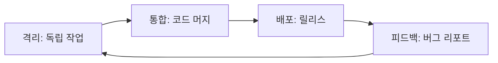
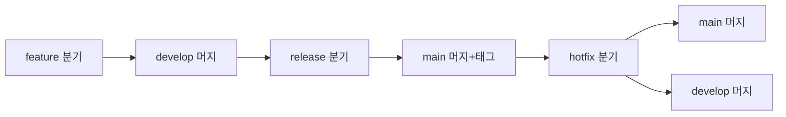
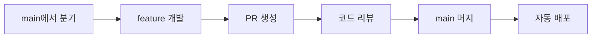
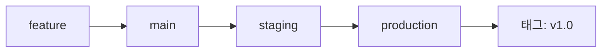
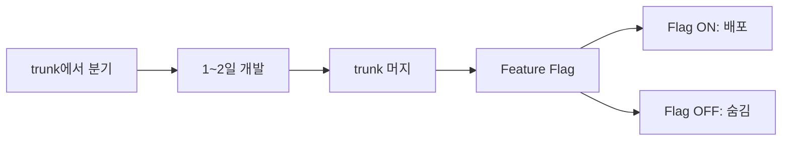
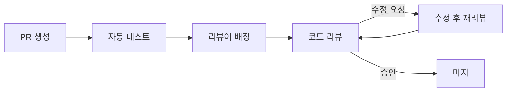
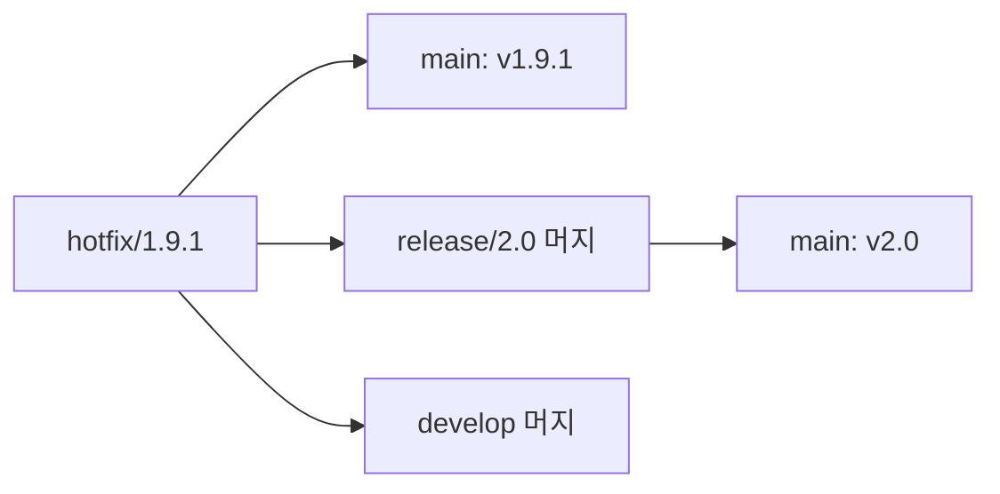
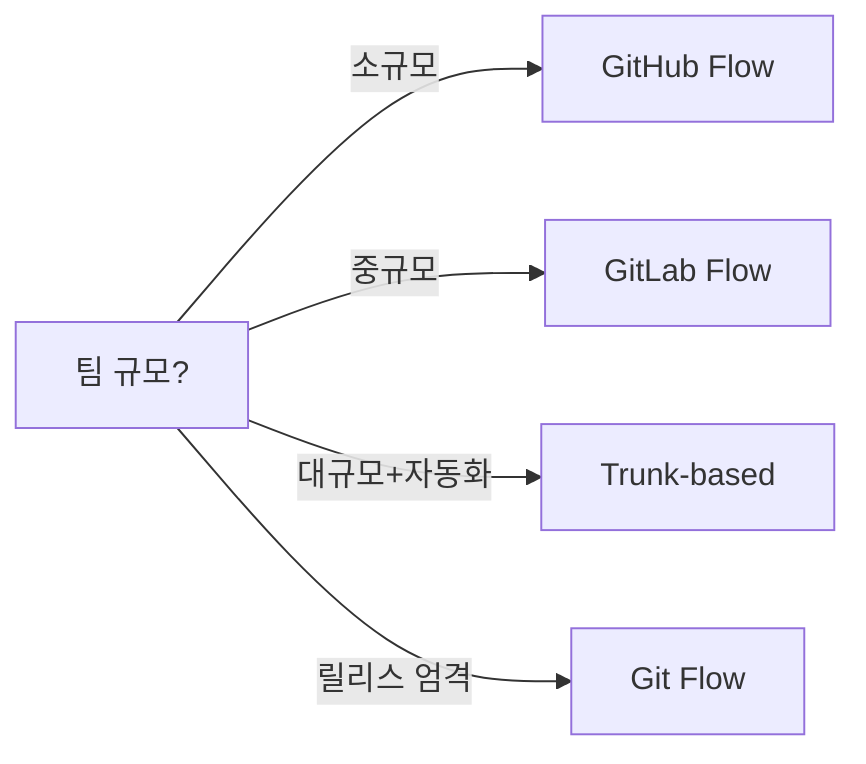

팀 규모와 릴리스 주기에 맞는 브랜치 전략을 선택하면 협업 충돌이 줄고, 배포 속도가 빨라지며, 장애 대응이 단순해진다. 이 글에서는 Git Flow, GitHub Flow, GitLab Flow, Trunk-based Development 네 가지 전략을 비유와 다이어그램으로 풀어보고, 실무 선택 기준까지 정리한다.

> **비유**: 브랜치 전략은 도시의 도로 체계와 같다. 소도시(5명 팀)에 8차선 고속도로를 깔면 낭비이고, 대도시(200명 팀)에 골목길 하나로 버티면 교통 마비가 난다. 팀의 규모와 속도에 맞는 도로를 설계해야 한다.

---

## 1. 왜 브랜치 전략이 필요한가

혼자 개발할 때는 `main` 하나로 충분하다. 하지만 팀원이 늘어나면 문제가 생긴다.

| 문제 | 원인 | 결과 |
|------|------|------|
| 코드 충돌 | 같은 파일 동시 수정 | 머지 지옥 |
| 릴리스 불안정 | 미완성 코드가 배포에 섞임 | 프로덕션 장애 |
| 핫픽스 지연 | 긴급 수정 경로가 없음 | 사용자 피해 확대 |
| 책임 불명확 | 누가 뭘 바꿨는지 추적 불가 | 디버깅 시간 폭증 |

> **비유**: 주방에서 요리사 한 명이면 동선이 겹칠 일이 없다. 하지만 요리사 10명이 하나의 조리대를 공유하면 칼이 부딪힌다. 브랜치 전략은 각 요리사에게 독립된 조리대(브랜치)를 배정하고, 완성된 요리만 서빙 테이블(main)에 올리는 규칙이다.

브랜치 전략이 해결하는 핵심 과제 세 가지는 다음과 같다.

1. **격리(Isolation)**: 개발 중인 기능이 다른 기능에 영향을 주지 않는다
2. **통합(Integration)**: 완성된 코드를 안전하게 합친다
3. **배포(Deployment)**: 언제든 안정된 버전을 릴리스할 수 있다



---

## 2. Git Flow — 정교한 5차선 도로

Vincent Driessen이 2010년에 제안한 Git Flow는 가장 체계적인 브랜치 모델이다. 5개의 브랜치 유형이 명확한 역할을 가진다.

> **비유**: Git Flow는 대형 공장의 생산 라인과 같다. 원자재 입고(feature) → 조립(develop) → 품질 검사(release) → 출하(main) → 긴급 리콜(hotfix)까지 단계별 게이트가 있다. 엄격하지만, 불량품이 소비자에게 도달할 확률이 낮다.

### 2.1 5개 브랜치 역할

| 브랜치 | 수명 | 역할 | 베이스 |
|--------|------|------|--------|
| `main` | 영구 | 프로덕션 코드, 태그 기준 | - |
| `develop` | 영구 | 다음 릴리스 통합 | main |
| `feature/*` | 임시 | 기능 개발 | develop |
| `release/*` | 임시 | 릴리스 안정화 | develop |
| `hotfix/*` | 임시 | 긴급 버그 수정 | main |

### 2.2 Git Flow 전체 흐름



### 2.3 Feature 브랜치 워크플로우

기능 개발은 항상 `develop`에서 분기한다.

```bash
# 1. feature 브랜치 생성
git checkout develop
git pull origin develop
git checkout -b feature/login-page

# 2. 기능 개발 후 커밋
git add .
git commit -m "feat: 로그인 페이지 UI 구현"

# 3. develop에 머지
git checkout develop
git merge --no-ff feature/login-page
git branch -d feature/login-page
git push origin develop
```

`--no-ff` 옵션은 머지 커밋을 강제로 생성하여 히스토리에서 feature의 시작과 끝을 명확히 보여준다.

### 2.4 Release 브랜치 워크플로우

다음 버전에 포함될 기능이 모두 develop에 머지되면 release 브랜치를 딴다.

```bash
# release 브랜치 생성
git checkout develop
git checkout -b release/1.2.0

# 버전 번호 수정, 최종 버그 수정만 허용
# 새 기능 추가 금지!

# 완료 후 main과 develop 양쪽에 머지
git checkout main
git merge --no-ff release/1.2.0
git tag -a v1.2.0 -m "Release 1.2.0"

git checkout develop
git merge --no-ff release/1.2.0
git branch -d release/1.2.0
```

### 2.5 Hotfix 브랜치 워크플로우

프로덕션 긴급 버그는 `main`에서 직접 분기한다.

```bash
# hotfix 브랜치 생성
git checkout main
git checkout -b hotfix/1.2.1

# 버그 수정
git commit -m "fix: 결제 금액 소수점 절사 오류 수정"

# main과 develop 양쪽에 머지
git checkout main
git merge --no-ff hotfix/1.2.1
git tag -a v1.2.1 -m "Hotfix 1.2.1"

git checkout develop
git merge --no-ff hotfix/1.2.1
git branch -d hotfix/1.2.1
```

### 2.6 Git Flow 장단점

**장점**
- 릴리스 단위가 명확하다
- 프로덕션과 개발 코드가 완전히 분리된다
- 버전 관리가 체계적이다
- 대규모 팀에서 역할 분담이 쉽다

**단점**
- 브랜치가 많아 복잡도가 높다
- 머지 충돌이 자주 발생한다
- CI/CD와 궁합이 좋지 않다 (긴 브랜치 수명)
- 빠른 배포 주기에 부적합하다

### 2.7 언제 쓰나

- 릴리스 주기가 1개월 이상인 프로젝트
- 여러 버전을 동시에 지원해야 하는 경우 (모바일 앱, 패키지 라이브러리)
- QA 팀이 별도로 존재하는 조직
- 규제 산업 (금융, 의료)에서 릴리스 승인 절차가 필요한 경우

> **비유**: Git Flow는 정밀한 스위스 시계다. 부품이 많고 조립이 복잡하지만, 한번 완성되면 정확하게 돌아간다. 빠른 시간 확인이 목적이라면 스마트워치(GitHub Flow)가 낫다.

---

## 3. GitHub Flow — 단순함의 철학

GitHub Flow는 Scott Chacon이 2011년에 제안한 극도로 단순한 모델이다. 브랜치는 `main`과 `feature` 두 종류뿐이다.

> **비유**: GitHub Flow는 컨베이어 벨트 초밥집이다. 요리사가 초밥을 만들면(feature) 바로 벨트에 올리고(PR), 손님이 확인하면(리뷰) 즉시 서빙된다(deploy). 중간 대기 장소가 없어 빠르지만, 품질은 요리사의 실력(테스트)에 전적으로 의존한다.

### 3.1 규칙 6가지

1. `main`은 항상 배포 가능한 상태를 유지한다
2. 새 작업은 `main`에서 설명적 이름의 브랜치를 딴다
3. 로컬에서 자주 커밋하고 리모트에 자주 푸시한다
4. 피드백이 필요하거나 머지 준비가 되면 Pull Request를 연다
5. PR이 리뷰되고 승인되면 `main`에 머지한다
6. `main`에 머지되면 즉시 배포한다

### 3.2 GitHub Flow 흐름



### 3.3 실전 워크플로우

```bash
# 1. main에서 브랜치 생성
git checkout main
git pull origin main
git checkout -b add-search-filter

# 2. 개발 및 커밋
git add .
git commit -m "feat: 검색 필터 드롭다운 추가"
git push origin add-search-filter

# 3. GitHub에서 PR 생성 (CLI)
gh pr create --title "검색 필터 기능 추가" \
  --body "## 변경 사항
- 카테고리별 필터 드롭다운
- 필터 상태 URL 파라미터 반영

## 테스트
- [ ] 필터 선택 시 목록 갱신 확인
- [ ] URL 직접 접근 시 필터 상태 복원 확인"

# 4. 리뷰 완료 후 머지
gh pr merge --squash
```

### 3.4 CI/CD가 필수인 이유

GitHub Flow에는 release 브랜치가 없다. 품질 게이트는 오직 **자동화된 테스트**와 **코드 리뷰**뿐이다.

```yaml
# .github/workflows/ci.yml
name: CI
on:
  pull_request:
    branches: [main]

jobs:
  test:
    runs-on: ubuntu-latest
    steps:
      - uses: actions/checkout@v4
      - name: Run tests
        run: |
          npm ci
          npm test
      - name: Lint
        run: npm run lint

  deploy-preview:
    needs: test
    runs-on: ubuntu-latest
    steps:
      - name: Deploy to preview
        run: echo "Preview 환경 배포"
```

PR이 열리면 자동으로 테스트가 돌고, 테스트를 통과하지 못하면 머지 버튼이 비활성화된다. 이것이 GitHub Flow의 안전망이다.

### 3.5 장단점

**장점**
- 극도로 단순하여 학습 비용이 낮다
- 빠른 배포 주기에 최적화되어 있다
- CI/CD와 자연스럽게 통합된다
- 코드 리뷰 문화를 강제한다

**단점**
- 여러 버전 동시 지원이 어렵다
- 릴리스 안정화 기간이 없다
- 대규모 기능 개발 시 장기 브랜치가 생겨 충돌 위험이 커진다
- 롤백이 복잡할 수 있다 (배포 즉시 반영)

### 3.6 언제 쓰나

- 웹 서비스처럼 단일 버전만 운영하는 프로젝트
- 1일 1회 이상 배포하는 팀
- CI/CD 파이프라인이 잘 갖춰진 환경
- 소규모~중규모 팀 (2~20명)

---

## 4. GitLab Flow — 환경 브랜치의 등장

GitLab Flow는 Git Flow의 복잡함과 GitHub Flow의 단순함 사이에서 균형을 잡는다. 핵심 아이디어는 **환경별 브랜치(Environment Branch)**다.

> **비유**: GitLab Flow는 아파트 모델하우스 시스템이다. 설계도(main)가 확정되면 모델하우스(staging)에서 먼저 시공하고, 입주자가 확인한 뒤 실제 동(production)에 적용한다. 단계별 검증이 있지만 Git Flow처럼 복잡하지 않다.

### 4.1 환경 브랜치 구조

GitLab Flow에서 코드는 한 방향으로만 흐른다: `feature` → `main` → `staging` → `production`



### 4.2 릴리스 브랜치 변형

SaaS가 아닌 패키지 배포라면 환경 브랜치 대신 릴리스 브랜치를 사용한다.

```bash
# main에서 릴리스 브랜치 생성
git checkout main
git checkout -b 1-stable

# 버그 수정은 main에서 먼저 하고, cherry-pick
git checkout main
git commit -m "fix: 메모리 누수 수정"

git checkout 1-stable
git cherry-pick <commit-hash>
```

**업스트림 퍼스트(Upstream First)** 원칙이 핵심이다. 버그 수정은 반드시 `main`에 먼저 반영한 뒤, 릴리스 브랜치에 cherry-pick한다. 이렇게 하면 수정이 누락되는 일이 없다.

### 4.3 머지 리퀘스트 + 이슈 트래킹

GitLab Flow는 이슈 번호와 브랜치를 연결하는 것을 권장한다.

```bash
# 이슈 번호를 브랜치명에 포함
git checkout -b 42-fix-login-timeout

# 커밋 메시지에 이슈 참조
git commit -m "fix: 로그인 타임아웃 30초로 변경

Closes #42"
```

`Closes #42`가 main에 머지되면 해당 이슈가 자동으로 닫힌다.

### 4.4 장단점

**장점**
- 환경별 배포 상태를 브랜치로 추적할 수 있다
- 업스트림 퍼스트로 수정 누락을 방지한다
- GitHub Flow보다 안전하고, Git Flow보다 단순하다
- 이슈 트래킹과 자연스럽게 연동된다

**단점**
- GitLab에 최적화되어 있어 다른 플랫폼에서는 설정이 필요하다
- 환경 브랜치가 늘어나면 관리 부담이 생긴다
- cherry-pick 기반이라 복잡한 변경에서 충돌 위험이 있다

### 4.5 언제 쓰나

- 스테이징/프로덕션 환경이 분리된 프로젝트
- GitLab을 사용하는 팀
- 릴리스 주기가 1~2주인 프로젝트
- 여러 환경에 순차 배포가 필요한 경우

---

## 5. Trunk-based Development — 짧은 브랜치, 빠른 통합

Trunk-based Development(TBD)는 모든 개발자가 하나의 `trunk`(main)에 직접 커밋하거나, 매우 짧은 수명의 브랜치를 사용하는 전략이다. Google, Facebook, Netflix 등이 채택하고 있다.

> **비유**: TBD는 오케스트라 리허설이다. 모든 연주자가 같은 악보(trunk)를 보며 동시에 연습한다. 각자 독립적으로 연습한 뒤 합주하면(Git Flow) 맞지 않는 부분이 많지만, 처음부터 함께 연주하면 불협화음을 즉시 잡을 수 있다.

### 5.1 핵심 원칙

1. **짧은 브랜치 수명**: feature 브랜치는 1~2일 이내에 머지
2. **작은 커밋**: 하루에 여러 번 trunk에 통합
3. **Feature Flag**: 미완성 기능을 코드에 포함하되 숨김
4. **자동화된 테스트**: 매 커밋마다 전체 테스트 실행

### 5.2 TBD 흐름



### 5.3 Feature Flag 패턴

Feature Flag는 TBD의 핵심 도구다. 미완성 기능을 trunk에 머지하면서도 사용자에게 노출하지 않을 수 있다.

```java
// Feature Flag 사용 예시
public class SearchService {
    private final FeatureFlagClient flags;

    public SearchResult search(String query) {
        if (flags.isEnabled("new-search-algorithm")) {
            // 새 알고리즘 (아직 미완성일 수 있음)
            return newSearchAlgorithm(query);
        }
        // 기존 알고리즘 (안전)
        return legacySearch(query);
    }
}
```

```yaml
# feature-flags.yml
flags:
  new-search-algorithm:
    enabled: false          # 기본 비활성
    rollout_percentage: 0   # 점진적 배포용
    allowed_users:          # 내부 테스터만 활성
      - "developer@company.com"
```

Feature Flag의 생명주기를 관리하는 것도 중요하다.

```bash
# Flag 생명주기
# 1. 생성: 기능 개발 시작
# 2. 내부 테스트: 개발팀만 활성화
# 3. 카나리 배포: 1% → 10% → 50% → 100%
# 4. 정리: 100% 도달 후 Flag 코드 제거 (기술 부채 방지)
```

### 5.4 짧은 브랜치 실전

```bash
# 1. trunk에서 분기 (이름에 날짜 포함 권장)
git checkout main
git pull origin main
git checkout -b kim/add-cache-header

# 2. 작은 단위로 커밋 (1~2일 이내 완료)
git commit -m "feat: Cache-Control 헤더 추가"
git push origin kim/add-cache-header

# 3. PR 생성 → 빠른 리뷰 → 머지
gh pr create --title "Cache-Control 헤더 추가"
# 리뷰어는 당일 리뷰 원칙

# 4. 머지 후 즉시 브랜치 삭제
git branch -d kim/add-cache-header
```

### 5.5 장단점

**장점**
- 머지 충돌이 최소화된다 (브랜치 수명이 짧으므로)
- 지속적 통합(CI)이 자연스럽다
- 코드가 항상 최신 상태다
- 배포 속도가 극대화된다

**단점**
- Feature Flag 관리 비용이 발생한다
- 높은 수준의 테스트 자동화가 전제 조건이다
- 미숙한 팀에서는 trunk을 깨뜨릴 위험이 크다
- 큰 기능을 작게 쪼개는 능력이 요구된다

### 5.6 언제 쓰나

- 하루에 수십 회 배포하는 팀 (Google, Facebook 스타일)
- 테스트 커버리지가 80% 이상인 프로젝트
- 시니어 비율이 높은 팀
- SaaS 서비스로 단일 버전만 운영하는 경우

> **비유**: TBD는 고속도로 본선 합류다. 신호 없이 바로 합류해야 하므로 운전 실력(테스트 자동화, 시니어 역량)이 뛰어나야 한다. 초보 운전자(주니어 위주 팀)에게는 신호등이 있는 교차로(Git Flow)가 안전하다.

---

## 6. 4가지 전략 비교표

### 6.1 특성 비교

| 항목 | Git Flow | GitHub Flow | GitLab Flow | Trunk-based |
|------|----------|-------------|-------------|-------------|
| 브랜치 수 | 5종류 | 2종류 | 3~4종류 | 1~2종류 |
| 복잡도 | 높음 | 낮음 | 중간 | 낮음 (운영은 높음) |
| 릴리스 주기 | 월 단위 | 일 단위 | 주 단위 | 시간 단위 |
| 롤백 난이도 | 쉬움 (태그) | 중간 | 중간 | 쉬움 (Flag OFF) |
| CI/CD 필요도 | 낮음 | 높음 | 중간 | 매우 높음 |
| 동시 버전 | 가능 | 불가 | 가능 | 불가 |
| 학습 곡선 | 가파름 | 완만 | 중간 | 완만 (Flag 제외) |
| 머지 충돌 빈도 | 높음 | 중간 | 중간 | 낮음 |

### 6.2 팀 규모별 추천

| 팀 규모 | 추천 전략 | 이유 |
|---------|-----------|------|
| 1~5명 | GitHub Flow | 오버헤드 최소, 빠른 반복 |
| 5~20명 | GitHub Flow 또는 GitLab Flow | PR 리뷰 문화 + 환경 분리 |
| 20~50명 | GitLab Flow 또는 Git Flow | 릴리스 관리 필요 |
| 50~200명 | Git Flow 또는 Trunk-based | 체계적 관리 또는 고도화된 자동화 |
| 200명+ | Trunk-based | 장기 브랜치의 충돌이 감당 불가 |

### 6.3 실제 회사 사례

#### 스타트업 (5명) — GitHub Flow 추천

```
상황: 백엔드 2명, 프론트 2명, 풀스택 1명
릴리스: 하루 2~3회 배포
인프라: Vercel + Railway 자동 배포

선택: GitHub Flow
이유:
- 별도 릴리스 관리자가 없다
- 빠른 실험과 피봇이 생명이다
- 테스트는 E2E 위주로 가볍게 운영한다
- 복잡한 브랜치 규칙을 관리할 여유가 없다
```

#### 중견 기업 (50명) — GitLab Flow 추천

```
상황: 백엔드 20명, 프론트 15명, QA 5명, DevOps 3명, PM 7명
릴리스: 2주마다 스프린트 릴리스
인프라: dev / staging / production 3개 환경

선택: GitLab Flow (환경 브랜치)
이유:
- QA 팀이 staging에서 검증한 뒤 production에 배포한다
- 환경별 배포 상태를 브랜치로 추적할 수 있다
- Git Flow보다 단순하면서도 환경 분리가 가능하다
- 이슈 트래킹과 연동하여 변경 추적이 쉽다
```

#### 대기업 (200명) — Trunk-based 추천

```
상황: 마이크로서비스 30개, 팀 40개, 공유 라이브러리 다수
릴리스: 하루 50~100회 배포 (서비스별 독립)
인프라: Kubernetes + ArgoCD + LaunchDarkly

선택: Trunk-based Development
이유:
- 200명이 Git Flow를 쓰면 머지 충돌이 일상이 된다
- Feature Flag로 미완성 코드를 안전하게 배포한다
- 각 마이크로서비스가 독립 배포하므로 릴리스 조율이 불필요하다
- 높은 테스트 커버리지와 자동화 인프라가 전제되어 있다
```

---

## 7. Release 전략

### 7.1 Semantic Versioning (SemVer)

버전 번호는 `MAJOR.MINOR.PATCH` 형식을 따른다.

| 변경 유형 | 버전 증가 | 예시 | 설명 |
|-----------|-----------|------|------|
| 호환 깨지는 변경 | MAJOR | 1.0.0 → 2.0.0 | API 시그니처 변경 |
| 하위 호환 기능 추가 | MINOR | 1.0.0 → 1.1.0 | 새 엔드포인트 추가 |
| 버그 수정 | PATCH | 1.0.0 → 1.0.1 | 오류 수정 |

> **비유**: SemVer는 아파트 주소 체계다. 동(MAJOR)이 바뀌면 완전히 다른 건물이고, 층(MINOR)이 바뀌면 같은 건물의 다른 공간이며, 호(PATCH)가 바뀌면 같은 층의 작은 수리다. 주소만 보고 변화의 크기를 짐작할 수 있다.

### 7.2 태그 기반 릴리스

```bash
# 릴리스 태그 생성
git tag -a v1.3.0 -m "Release 1.3.0: 검색 필터 추가, 성능 개선"
git push origin v1.3.0

# GitHub Release 생성 (CLI)
gh release create v1.3.0 \
  --title "v1.3.0" \
  --notes "## 새 기능
- 카테고리별 검색 필터
- 검색 결과 캐싱

## 버그 수정
- 페이지네이션 오프셋 오류 수정

## 성능
- 검색 응답 시간 40% 개선"
```

### 7.3 릴리스 자동화

```yaml
# .github/workflows/release.yml
name: Release
on:
  push:
    tags: ['v*']

jobs:
  release:
    runs-on: ubuntu-latest
    steps:
      - uses: actions/checkout@v4

      - name: Build
        run: npm run build

      - name: Run tests
        run: npm test

      - name: Create GitHub Release
        uses: softprops/action-gh-release@v2
        with:
          generate_release_notes: true
```

태그를 푸시하면 자동으로 빌드 → 테스트 → 릴리스 노트 생성까지 완료된다.

### 7.4 Changelog 자동 생성

Conventional Commits 규칙을 따르면 변경 이력을 자동 생성할 수 있다.

```bash
# Conventional Commits 형식
# feat: 새 기능
# fix: 버그 수정
# docs: 문서 변경
# refactor: 리팩토링
# test: 테스트 추가/수정
# chore: 빌드, 설정 변경

# 예시
git commit -m "feat(search): 카테고리 필터 추가"
git commit -m "fix(auth): 토큰 만료 시 무한 루프 수정"
git commit -m "docs: API 명세 업데이트"
```

---

## 8. Hotfix 프로세스

프로덕션 장애는 기다려주지 않는다. 전략별 핫픽스 경로를 정리한다.

> **비유**: 핫픽스는 수술실의 응급 수술이다. 예정된 수술(릴리스) 일정과 무관하게, 환자(프로덕션)의 상태가 위급하면 모든 것을 제쳐두고 즉시 대응한다. 단, 수술 기록(커밋 히스토리)은 반드시 남겨야 한다.

### 8.1 전략별 핫픽스 경로

| 전략 | 핫픽스 경로 | 머지 대상 |
|------|-------------|-----------|
| Git Flow | main → hotfix/* → main + develop | main, develop 양쪽 |
| GitHub Flow | main → hotfix-branch → main | main만 |
| GitLab Flow | main → fix → main → production | main, production |
| Trunk-based | trunk에 직접 커밋 또는 Flag OFF | trunk만 |

### 8.2 핫픽스 체크리스트

```bash
# 1. 장애 확인 및 원인 파악
# 2. hotfix 브랜치 생성 (main 기준)
git checkout main
git checkout -b hotfix/payment-null-check

# 3. 최소한의 수정만 적용 (관련 없는 변경 금지)
git add src/payment/PaymentService.java
git commit -m "fix: 결제 응답 null 체크 누락 수정

프로덕션에서 결제 응답이 null인 경우 NullPointerException 발생.
null 체크 추가 및 기본값 처리.

Closes #789"

# 4. 긴급 리뷰 (최소 1명)
gh pr create --title "HOTFIX: 결제 null 체크" \
  --label "hotfix,urgent"

# 5. 머지 및 배포
# 6. 장애 해소 확인
# 7. develop에도 머지 (Git Flow의 경우)
# 8. 포스트모템 작성
```

### 8.3 롤백 전략

핫픽스가 불가능할 때는 롤백이 최선이다.

```bash
# 방법 1: revert 커밋 (권장 - 히스토리 보존)
git revert <문제-커밋-해시>
git push origin main

# 방법 2: 이전 태그로 배포 (인프라 수준)
kubectl set image deployment/api api=myapp:v1.2.0

# 방법 3: Feature Flag OFF (Trunk-based)
# LaunchDarkly 대시보드에서 즉시 비활성화
```

**revert vs reset 비교**

| 방법 | 히스토리 | 협업 안전성 | 용도 |
|------|----------|-------------|------|
| `git revert` | 보존 | 안전 | 공유 브랜치 |
| `git reset --hard` | 삭제 | 위험 | 로컬 브랜치만 |

---

## 9. 코드 리뷰 & PR 워크플로우

브랜치 전략의 효과는 코드 리뷰 품질에 좌우된다.

> **비유**: PR은 원고의 교정 과정이다. 작가(개발자)가 초고(코드)를 쓰면 편집자(리뷰어)가 맞춤법(버그), 문맥(로직), 가독성(코드 품질)을 검수한다. 교정 없이 출판하면 독자(사용자)가 피해를 본다.

### 9.1 좋은 PR의 조건

```
1. 작은 크기: 400줄 이하 (이상적으로 200줄 이하)
2. 단일 목적: 한 PR에 한 가지 변경
3. 설명적 제목: "fix: 결제 null 체크" (O) / "수정" (X)
4. 충분한 설명: 왜 이 변경이 필요한지
5. 테스트 포함: 변경에 대한 테스트 코드
6. 스크린샷: UI 변경 시 before/after
```

### 9.2 PR 템플릿

```markdown
## 변경 사항
- 무엇을 왜 변경했는지

## 변경 유형
- [ ] 새 기능
- [ ] 버그 수정
- [ ] 리팩토링
- [ ] 문서 수정

## 테스트
- [ ] 단위 테스트 추가/수정
- [ ] 통합 테스트 확인
- [ ] 수동 테스트 완료

## 체크리스트
- [ ] 셀프 리뷰 완료
- [ ] 관련 문서 업데이트
- [ ] 하위 호환성 확인
```

### 9.3 리뷰 프로세스



### 9.4 리뷰 규칙 권장 사항

| 항목 | 권장 값 | 이유 |
|------|---------|------|
| 최소 승인 수 | 1~2명 | 품질과 속도의 균형 |
| 리뷰 응답 시간 | 4시간 이내 | 개발 흐름 유지 |
| PR 크기 제한 | 400줄 | 리뷰 품질 유지 |
| 자동 리뷰어 배정 | CODEOWNERS | 도메인 전문가 자동 배정 |

```bash
# CODEOWNERS 파일 예시
# .github/CODEOWNERS
*.js    @frontend-team
*.py    @backend-team
*.yml   @devops-team
/docs/  @tech-writer
```

### 9.5 머지 전략 3가지

| 전략 | 명령 | 히스토리 | 용도 |
|------|------|----------|------|
| Merge commit | `git merge --no-ff` | 모든 커밋 보존 | Git Flow |
| Squash merge | `git merge --squash` | PR당 1커밋 | GitHub Flow |
| Rebase merge | `git rebase` | 선형 히스토리 | Trunk-based |

```bash
# Squash merge 예시 (GitHub Flow 권장)
git checkout main
git merge --squash feature/login
git commit -m "feat: 로그인 기능 구현 (#42)"

# Rebase merge 예시 (Trunk-based 권장)
git checkout feature/cache
git rebase main
git checkout main
git merge feature/cache
```

---

## 10. 실무 실수 TOP 5

### 실수 1: main에 직접 push

```bash
# 잘못된 예
git checkout main
git commit -m "quick fix"
git push origin main  # 리뷰 없이 프로덕션 코드 변경!

# 방지: branch protection 설정
# GitHub > Settings > Branches > Branch protection rules
# - Require pull request reviews before merging
# - Require status checks to pass before merging
# - Do not allow bypassing the above settings
```

> **비유**: main에 직접 push하는 것은 검수 없이 제품을 출하하는 것과 같다. 한 명의 실수가 전체 사용자에게 영향을 미친다.

### 실수 2: 장기 브랜치 방치

```
feature/big-refactor (3개월째 develop에서 분리)
→ 3개월 동안 develop이 500커밋 진행
→ 머지 시도 → 충돌 200개 → 포기 → 처음부터 다시

해결:
- 큰 기능은 작은 PR로 쪼갠다
- 최소 주 1회 base 브랜치를 rebase/merge한다
- 2주 이상 된 브랜치는 팀 회의에서 논의한다
```

### 실수 3: 커밋 메시지 대충 쓰기

```bash
# 나쁜 예
git commit -m "fix"
git commit -m "수정"
git commit -m "asdf"

# 좋은 예
git commit -m "fix(auth): 토큰 갱신 시 race condition 수정

동시 요청 시 토큰이 두 번 갱신되는 문제.
mutex lock 추가로 해결.

Closes #123"
```

### 실수 4: force push로 히스토리 날리기

```bash
# 위험한 작업
git reset --hard HEAD~3
git push --force origin develop  # 다른 사람의 커밋도 삭제됨!

# 안전한 대안
git push --force-with-lease origin feature/my-branch
# --force-with-lease는 리모트가 예상과 다르면 거부한다
# 그리고 공유 브랜치(main, develop)에는 절대 force push 금지
```

### 실수 5: .gitignore 누락

```bash
# 자주 빠뜨리는 파일들
.env                    # 환경변수, 시크릿
node_modules/           # 의존성 (용량 폭발)
.idea/                  # IDE 설정
*.log                   # 로그 파일
dist/                   # 빌드 결과물
coverage/               # 테스트 커버리지

# 이미 추적 중인 파일 제거
git rm --cached .env
git commit -m "chore: .env를 tracking에서 제거"
```

---

## 11. 극한 시나리오

### 시나리오 1: 100명 동시 개발

**상황**: 100명의 개발자가 하나의 모노레포에서 동시에 작업한다. Git Flow를 사용 중인데 develop 브랜치에 하루 50개의 PR이 올라온다. 머지 큐가 쌓이고, 충돌 해결에 하루의 30%를 소비한다.

**해결 전략**:

```
1단계: Trunk-based로 전환
- feature 브랜치 수명을 2일 이내로 제한
- develop 브랜치 폐지, main에 직접 머지
- Feature Flag 인프라 구축 (LaunchDarkly, Unleash)

2단계: 머지 큐 도입
- GitHub Merge Queue 활성화
- 충돌 시 자동 rebase
- 테스트 통과한 PR만 큐에 진입

3단계: 코드 오너십 분리
- CODEOWNERS로 팀별 리뷰 범위 한정
- 모듈별 독립 테스트 파이프라인
- 모노레포 내 패키지 간 의존성 최소화
```

### 시나리오 2: 긴급 핫픽스 중 릴리스 충돌

**상황**: release/2.0 브랜치에서 QA 진행 중인데, 프로덕션(v1.9)에서 결제 장애가 발생했다. 핫픽스를 main에 머지해야 하는데 release/2.0의 변경과 충돌한다.

**해결 전략**:

```
1. 핫픽스 최우선 처리
   - main에서 hotfix/1.9.1 분기
   - 결제 버그만 최소 수정
   - main에 머지 + v1.9.1 태그 + 즉시 배포

2. release/2.0에 핫픽스 반영
   - git checkout release/2.0
   - git merge hotfix/1.9.1
   - 충돌 해결 (release 변경 기준으로)

3. develop에도 핫픽스 반영
   - git checkout develop
   - git merge hotfix/1.9.1

4. 순서 규칙: 항상 핫픽스 → 릴리스 → develop
```



### 시나리오 3: 롤백이 필요한 대규모 배포

**상황**: v2.0을 배포했는데 DB 마이그레이션 포함 배포라 단순 revert가 불가능하다. 새 테이블을 참조하는 코드가 이미 프로덕션에 올라갔다.

**해결 전략**:

```
1. Forward Fix (전진 수정) 우선 검토
   - 롤백보다 빠르게 수정할 수 있는지 판단
   - 가능하면 hotfix로 전진 수정

2. 롤백이 불가피한 경우
   a) Feature Flag OFF로 새 기능 비활성화
   b) 코드만 이전 버전으로 revert
   c) DB 마이그레이션은 유지 (backward compatible 설계 전제)
   d) 다음 배포에서 미사용 테이블 정리

3. 예방 원칙
   - DB 마이그레이션은 항상 backward compatible하게 작성
   - 컬럼 삭제는 2단계로: 첫 배포에서 코드 제거 → 다음 배포에서 컬럼 삭제
   - 배포 전 롤백 시나리오를 반드시 문서화
```

---

## 12. 면접 포인트

<details>
<summary><strong>Q1. Git Flow와 GitHub Flow의 차이를 설명하고, 각각 언제 사용하는지 말씀해주세요.</strong></summary>

**핵심 답변**: Git Flow는 main, develop, feature, release, hotfix 5개 브랜치를 사용하는 정교한 모델이다. 릴리스 주기가 길고(월 단위) 여러 버전을 동시에 지원해야 하는 모바일 앱, 패키지 라이브러리에 적합하다. GitHub Flow는 main과 feature 브랜치만 사용하며, PR 기반으로 main에 직접 머지하고 즉시 배포한다. 단일 버전 웹 서비스에서 빠른 배포가 필요할 때 사용한다.

**차별화 포인트**: "Git Flow의 release 브랜치는 QA 안정화 기간을 제공하지만, CI/CD가 성숙한 팀에서는 이 기간이 오히려 병목이 됩니다. 팀의 자동화 수준에 따라 선택해야 합니다."

</details>

<details>
<summary><strong>Q2. Trunk-based Development에서 Feature Flag의 역할과 주의점을 설명해주세요.</strong></summary>

**핵심 답변**: Feature Flag는 미완성 코드를 trunk에 머지하면서도 사용자에게 노출하지 않는 토글이다. 개발 중인 기능을 Flag OFF 상태로 배포하고, 완성 후 점진적으로 ON한다(카나리 배포). 주의점은 세 가지다. 첫째, Flag를 정리하지 않으면 기술 부채가 쌓인다. 둘째, Flag 조합이 폭발적으로 늘어나면 테스트가 어려워진다. 셋째, Flag 상태 관리를 위한 별도 인프라(LaunchDarkly 등)가 필요하다.

**차별화 포인트**: "Feature Flag의 생명주기를 관리하는 것이 중요합니다. 저는 Flag 생성 시 만료일을 설정하고, CI에서 30일 이상 된 Flag를 경고하는 린트 규칙을 적용한 경험이 있습니다."

</details>

<details>
<summary><strong>Q3. 프로덕션 장애 시 핫픽스 프로세스를 설명해주세요.</strong></summary>

**핵심 답변**: 첫째, 장애 범위를 파악하고 영향도를 평가한다. 둘째, main에서 hotfix 브랜치를 분기하여 최소한의 수정만 적용한다. 셋째, 긴급 리뷰(최소 1명)를 받고 main에 머지한다. 넷째, 태그를 찍고 즉시 배포한다. 다섯째, develop(Git Flow) 또는 release 브랜치에도 반영한다. 여섯째, 포스트모템을 작성한다.

**차별화 포인트**: "핫픽스에서 가장 중요한 것은 범위 제한입니다. 긴급 상황에서 관련 없는 수정까지 끼워 넣으면 새로운 장애를 유발합니다. 단 하나의 원인만 수정하고, 나머지는 별도 이슈로 관리해야 합니다."

</details>

<details>
<summary><strong>Q4. 머지 충돌을 최소화하는 방법을 말씀해주세요.</strong></summary>

**핵심 답변**: 다섯 가지 방법이 있다. 첫째, 브랜치 수명을 짧게 유지한다(2일 이내 권장). 둘째, PR 크기를 작게 만든다(200~400줄). 셋째, 정기적으로 base 브랜치를 rebase한다. 넷째, 코드 오너십을 명확히 하여 같은 파일을 동시에 수정하는 빈도를 줄인다. 다섯째, 모듈화된 아키텍처로 파일 간 의존성을 낮춘다.

**차별화 포인트**: "충돌은 기술적 문제가 아니라 커뮤니케이션 문제입니다. 같은 영역을 수정하려는 두 사람이 사전에 조율하면 충돌 자체가 발생하지 않습니다. CODEOWNERS와 Daily standup이 가장 효과적인 충돌 방지 도구입니다."

</details>

<details>
<summary><strong>Q5. 팀에 브랜치 전략을 도입할 때 고려해야 할 요소는 무엇인가요?</strong></summary>

**핵심 답변**: 네 가지를 고려한다. 첫째, 팀 규모와 시니어 비율. 시니어가 많으면 Trunk-based, 주니어가 많으면 Git Flow처럼 가드레일이 있는 전략이 안전하다. 둘째, 릴리스 주기. 월 단위면 Git Flow, 일 단위면 GitHub Flow, 시간 단위면 Trunk-based다. 셋째, 인프라 성숙도. CI/CD, 테스트 자동화, Feature Flag 인프라가 갖춰져야 단순한 전략을 쓸 수 있다. 넷째, 제품 특성. 모바일 앱처럼 여러 버전이 공존하면 Git Flow가 필수고, SaaS는 GitHub Flow로 충분하다.

**차별화 포인트**: "브랜치 전략은 바꿀 수 있습니다. 스타트업 초기에는 GitHub Flow로 시작하고, 팀이 성장하면 GitLab Flow로 전환하며, 자동화가 충분히 갖춰지면 Trunk-based로 진화하는 것이 자연스러운 경로입니다. 중요한 것은 현재 팀 수준에 맞는 전략을 선택하는 것입니다."

</details>

---

## 정리

네 가지 전략의 선택 기준을 한 문장으로 요약하면 다음과 같다.



| 전략 | 한 줄 요약 |
|------|-----------|
| Git Flow | 릴리스를 철저히 관리해야 하는 대규모 프로젝트 |
| GitHub Flow | 빠르게 배포하는 소규모 웹 서비스 |
| GitLab Flow | 환경별 단계 배포가 필요한 중규모 팀 |
| Trunk-based | 자동화 인프라가 탄탄한 고성능 팀 |

브랜치 전략은 팀의 규모, 릴리스 주기, 자동화 수준이라는 세 축으로 결정된다. 정답은 없다. 팀이 성장함에 따라 전략도 진화해야 한다. 가장 중요한 것은 팀 전체가 합의한 규칙을 **일관되게** 따르는 것이다.

---

## 참고 자료

- [A Successful Git Branching Model (Vincent Driessen)](https://nvie.com/posts/a-successful-git-branching-model/)
- [GitHub Flow (Scott Chacon)](https://docs.github.com/en/get-started/using-github/github-flow)
- [GitLab Flow](https://docs.gitlab.com/ee/topics/gitlab_flow.html)
- [Trunk Based Development](https://trunkbaseddevelopment.com/)
- [Semantic Versioning 2.0.0](https://semver.org/)
- [Conventional Commits](https://www.conventionalcommits.org/)
