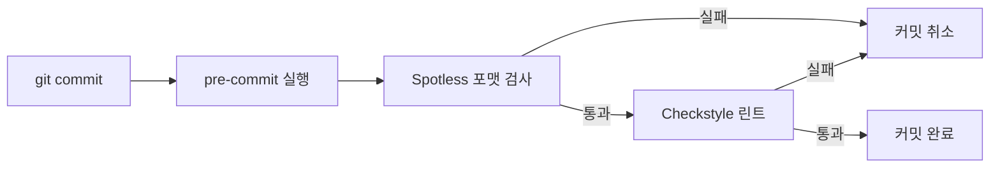
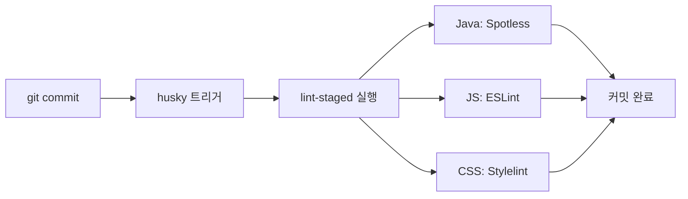
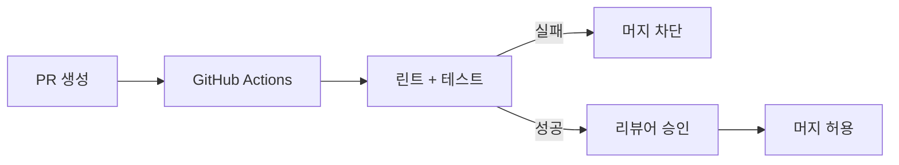
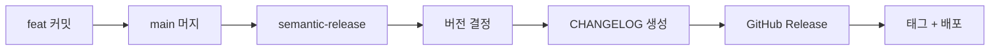

커밋 하나가 프로덕션을 망가뜨린 적이 있는가? Git Hooks는 사람의 실수를 코드가 대신 막아주는 **자동 방어선**이다. 이 글에서는 클라이언트/서버 사이드 훅의 종류부터 husky, lint-staged, Conventional Commits, CI 연동까지 실무에서 바로 쓸 수 있는 자동화 파이프라인을 완성한다.

> **비유**: Git Hooks는 공항의 보안 검색대와 같다. 탑승객(코드)이 게이트(원격 저장소)를 통과하기 전에 금속탐지기(린트), 엑스레이(테스트), 여권 확인(커밋 메시지 규칙)을 거친다. 위험한 물건을 가진 사람은 아예 비행기에 타지 못한다.

---

## 1. Git Hooks 개요

Git Hooks는 `.git/hooks/` 디렉토리에 위치하는 스크립트로, 특정 Git 이벤트가 발생할 때 자동 실행된다. 별도 설치 없이 Git만 있으면 사용할 수 있다.

### 1.1 클라이언트 사이드 훅

개발자의 로컬 환경에서 실행되는 훅이다. 커밋, 머지, 푸시 등의 이벤트에 반응한다.

| 훅 이름 | 실행 시점 | 대표 용도 |
|---------|-----------|-----------|
| `pre-commit` | `git commit` 직전 | 린트, 포맷팅, 테스트 |
| `prepare-commit-msg` | 커밋 메시지 편집기 열리기 전 | 템플릿 자동 삽입 |
| `commit-msg` | 커밋 메시지 작성 후 | 메시지 포맷 검증 |
| `post-commit` | 커밋 완료 후 | 알림 전송 |
| `pre-push` | `git push` 직전 | 통합 테스트, 빌드 확인 |
| `pre-rebase` | `git rebase` 직전 | 리베이스 제한 |
| `post-merge` | `git merge` 완료 후 | 의존성 재설치 |
| `post-checkout` | `git checkout` 완료 후 | 환경 정리 |

### 1.2 서버 사이드 훅

원격 저장소(서버)에서 실행되며, 팀 전체에 강제 적용할 수 있다.

| 훅 이름 | 실행 시점 | 대표 용도 |
|---------|-----------|-----------|
| `pre-receive` | push 데이터 수신 직후 | 전체 정책 검증 |
| `update` | 각 브랜치별 업데이트 직전 | 브랜치별 권한 제어 |
| `post-receive` | push 완료 후 | CI 트리거, 배포 |

> **비유**: 클라이언트 훅은 자기 집 현관문 잠금장치다. 나가기 전에 스스로 확인한다. 서버 훅은 아파트 경비실이다. 아무리 개인이 잠금을 해제해도, 경비실에서 출입증이 없으면 통과할 수 없다.


### 1.3 훅의 기본 동작 원리

Git Hooks는 **종료 코드**로 동작을 제어한다.

- `exit 0`: 훅 통과, 다음 단계로 진행
- `exit 1` (0이 아닌 값): 훅 실패, 해당 Git 명령 중단

```bash
#!/bin/sh
# .git/hooks/pre-commit (가장 단순한 예시)

echo "코드 검사 중..."
./gradlew checkstyleMain

if [ $? -ne 0 ]; then
    echo "Checkstyle 검사 실패! 커밋이 취소됩니다."
    exit 1
fi

exit 0
```

주의할 점은 `.git/hooks/` 내부의 파일은 **Git으로 추적되지 않는다**는 것이다. 따라서 팀원 간 훅을 공유하려면 별도의 도구(husky, pre-commit framework 등)가 필요하다.

---

## 2. pre-commit — 코드 포맷, 린트, 테스트

pre-commit 훅은 가장 많이 사용되는 훅이다. 커밋 직전에 코드 품질을 검사하여 **오염된 코드가 히스토리에 남는 것을 원천 차단**한다.

> **비유**: pre-commit은 출판사의 교정 담당자다. 작가(개발자)가 원고(코드)를 넘기면, 오탈자(린트 에러)와 문법 오류(컴파일 에러)를 잡아서 되돌려 보낸다. 교정을 통과한 원고만 인쇄(커밋)된다.

### 2.1 Spring Boot + Gradle 프로젝트에서 Checkstyle 연동

실제 Spring Boot 프로젝트에서 Checkstyle을 pre-commit과 연동하는 방법이다.

**build.gradle 설정**

```groovy
plugins {
    id 'java'
    id 'org.springframework.boot' version '3.3.0'
    id 'io.spring.dependency-management' version '1.1.5'
    id 'checkstyle'
}

checkstyle {
    toolVersion = '10.17.0'
    configFile = file("${rootDir}/config/checkstyle/checkstyle.xml")
    maxWarnings = 0  // 경고도 허용하지 않음
}

// 스테이징된 파일만 검사하는 태스크
tasks.register('checkStagedFiles') {
    group = 'verification'
    description = 'Runs checkstyle only on staged files'

    doLast {
        def stagedFiles = 'git diff --cached --name-only --diff-filter=ACM'
            .execute().text.trim().split('\n')
            .findAll { it.endsWith('.java') }

        if (stagedFiles.isEmpty()) {
            println "검사할 Java 파일 없음"
            return
        }

        println "검사 대상: ${stagedFiles.size()}개 파일"
        // Checkstyle 실행
        exec {
            commandLine './gradlew', 'checkstyleMain'
        }
    }
}
```

**pre-commit 훅 스크립트**

```bash
#!/bin/sh
# .git/hooks/pre-commit

echo "===== Pre-commit Hook 실행 ====="

# 1단계: 코드 포맷 검사 (Google Java Format)
echo "[1/3] 코드 포맷 검사..."
./gradlew spotlessCheck 2>/dev/null
if [ $? -ne 0 ]; then
    echo "포맷 오류 발견! './gradlew spotlessApply'로 자동 수정하세요."
    exit 1
fi

# 2단계: Checkstyle 린트
echo "[2/3] Checkstyle 검사..."
./gradlew checkstyleMain 2>/dev/null
if [ $? -ne 0 ]; then
    echo "Checkstyle 위반 발견! 수정 후 다시 커밋하세요."
    exit 1
fi

# 3단계: 단위 테스트
echo "[3/3] 단위 테스트..."
./gradlew test 2>/dev/null
if [ $? -ne 0 ]; then
    echo "테스트 실패! 수정 후 다시 커밋하세요."
    exit 1
fi

echo "===== 모든 검사 통과! ====="
exit 0
```

### 2.2 Spotless로 자동 포맷팅

Spotless는 Gradle 플러그인으로, Google Java Format 등의 포맷터를 통합 관리한다.

```groovy
plugins {
    id 'com.diffplug.spotless' version '6.25.0'
}

spotless {
    java {
        target 'src/*/java/**/*.java'
        googleJavaFormat('1.22.0')
        removeUnusedImports()
        trimTrailingWhitespace()
        endWithNewline()
    }
    groovyGradle {
        target '*.gradle'
        greclipse()
    }
}
```

커밋 전에 `./gradlew spotlessApply`를 자동 실행하면 포맷 논쟁이 사라진다. 탭 vs 스페이스 전쟁은 도구에게 맡기자.



---

## 3. commit-msg — Conventional Commits 강제

커밋 메시지의 품질은 프로젝트의 유지보수성을 결정한다. `commit-msg` 훅은 커밋 메시지가 **정해진 포맷을 따르는지 검증**한다.

> **비유**: commit-msg 훅은 공문서 양식 검수관이다. "보고서 제목 없음", "날짜 누락" 같은 양식 위반이 있으면 접수를 거부한다. 양식에 맞는 문서만 결재선(히스토리)에 올라간다.

### 3.1 Conventional Commits 규격

Conventional Commits는 커밋 메시지의 구조화된 포맷이다.

```
<type>[optional scope]: <description>

[optional body]

[optional footer(s)]
```

**type 종류**

| type | 의미 | 예시 |
|------|------|------|
| `feat` | 새로운 기능 | `feat(auth): 소셜 로그인 추가` |
| `fix` | 버그 수정 | `fix(order): 결제 금액 계산 오류 수정` |
| `docs` | 문서 변경 | `docs: API 명세 업데이트` |
| `style` | 코드 포맷 (기능 변경 없음) | `style: 들여쓰기 수정` |
| `refactor` | 리팩토링 | `refactor(user): 중복 검증 로직 통합` |
| `test` | 테스트 추가/수정 | `test(order): 결제 취소 테스트 추가` |
| `chore` | 빌드, 도구 설정 | `chore: Gradle 버전 업그레이드` |
| `perf` | 성능 개선 | `perf(query): N+1 쿼리 제거` |
| `ci` | CI 설정 변경 | `ci: GitHub Actions 캐시 추가` |

### 3.2 commit-msg 훅 구현

```bash
#!/bin/sh
# .git/hooks/commit-msg

commit_msg_file=$1
commit_msg=$(cat "$commit_msg_file")

# Conventional Commits 정규식
pattern="^(feat|fix|docs|style|refactor|test|chore|perf|ci|build|revert)(\(.+\))?: .{1,72}$"

# 첫 번째 줄만 검사
first_line=$(echo "$commit_msg" | head -1)

if ! echo "$first_line" | grep -qE "$pattern"; then
    echo "==================================================="
    echo "커밋 메시지가 Conventional Commits 규격에 맞지 않습니다!"
    echo ""
    echo "올바른 형식: <type>(<scope>): <description>"
    echo ""
    echo "예시:"
    echo "  feat(auth): 소셜 로그인 추가"
    echo "  fix(order): 결제 금액 계산 오류"
    echo "  docs: README 업데이트"
    echo ""
    echo "허용 type: feat, fix, docs, style, refactor,"
    echo "           test, chore, perf, ci, build, revert"
    echo "==================================================="
    exit 1
fi

# 제목 길이 검사 (72자 제한)
if [ ${#first_line} -gt 72 ]; then
    echo "커밋 메시지 제목이 72자를 초과합니다! (현재: ${#first_line}자)"
    exit 1
fi

echo "커밋 메시지 검증 통과!"
exit 0
```

### 3.3 commitlint 도구 활용 (Node.js 환경)

스크립트를 직접 작성하는 것보다 **commitlint** 도구를 사용하면 더 견고하다.

```bash
# 설치
npm install --save-dev @commitlint/cli @commitlint/config-conventional
```

```javascript
// commitlint.config.js
module.exports = {
  extends: ['@commitlint/config-conventional'],
  rules: {
    'type-enum': [
      2, 'always',
      ['feat', 'fix', 'docs', 'style', 'refactor',
       'test', 'chore', 'perf', 'ci', 'build', 'revert']
    ],
    'subject-max-length': [2, 'always', 72],
    'body-max-line-length': [1, 'always', 100],
    'scope-case': [2, 'always', 'lower-case'],
  }
};
```

---

## 4. pre-push — CI 사전 검증

pre-push 훅은 코드가 원격 저장소에 전송되기 직전에 실행된다. pre-commit보다 **무거운 검증**(통합 테스트, 빌드)을 수행하기에 적합하다.

> **비유**: pre-push는 국제선 출국 심사다. 국내선(로컬 커밋)은 간단한 신분증 확인(pre-commit)으로 탑승하지만, 국제선(원격 push)은 여권, 비자, 세관 검사(통합 테스트, 빌드)까지 통과해야 한다.

### 4.1 Spring Boot 프로젝트 pre-push 훅

```bash
#!/bin/sh
# .git/hooks/pre-push

echo "===== Pre-push Hook: 원격 전송 전 최종 검증 ====="

# 전체 빌드 (테스트 포함)
echo "[1/2] 전체 빌드 검증..."
./gradlew build 2>/dev/null
if [ $? -ne 0 ]; then
    echo "빌드 실패! push가 취소됩니다."
    exit 1
fi

# 통합 테스트 실행
echo "[2/2] 통합 테스트..."
./gradlew integrationTest 2>/dev/null
if [ $? -ne 0 ]; then
    echo "통합 테스트 실패! push가 취소됩니다."
    exit 1
fi

echo "===== 모든 검증 통과! push 진행 ====="
exit 0
```

### 4.2 보호 브랜치 강제

main/develop 브랜치에 직접 push를 차단하는 훅도 유용하다.

```bash
#!/bin/sh
# .git/hooks/pre-push

protected_branches="main develop"
current_branch=$(git symbolic-ref HEAD | sed -e 's,.*/\(.*\),\1,')

for branch in $protected_branches; do
    if [ "$current_branch" = "$branch" ]; then
        echo "직접 push 금지: $branch 브랜치에는 PR을 통해서만 머지하세요."
        exit 1
    fi
done

exit 0
```

---

## 5. husky + lint-staged 설정

husky는 Git Hooks를 **프로젝트 소스 코드에 포함**시켜 팀원 전체가 동일한 훅을 사용하게 만드는 도구다. lint-staged는 **스테이징된 파일만** 검사하여 속도를 극대화한다.

> **비유**: husky는 회사 보안 정책 배포 시스템이다. 각 직원이 개별적으로 보안 소프트웨어를 설치하는 대신, 회사에서 일괄 배포한다. lint-staged는 변경된 문서만 검수하는 효율적인 감사관이다. 1000페이지 보고서 중 수정된 3페이지만 검사한다.

### 5.1 husky 설치 및 설정

```bash
# 프로젝트 초기 설정
npm init -y
npm install --save-dev husky lint-staged

# husky 초기화
npx husky init
```

husky는 `.husky/` 디렉토리를 생성하고, `package.json`에 prepare 스크립트를 추가한다.

```json
{
  "scripts": {
    "prepare": "husky"
  },
  "devDependencies": {
    "husky": "^9.1.0",
    "lint-staged": "^15.2.0"
  }
}
```

### 5.2 husky + Gradle 프로젝트 통합

Spring Boot + Gradle 프로젝트에서도 husky를 활용할 수 있다. 프로젝트 루트에 `package.json`을 두고 훅만 관리한다.

**.husky/pre-commit**

```bash
#!/bin/sh
echo "===== husky pre-commit 실행 ====="

# Java 파일 검사는 Gradle로
STAGED_JAVA=$(git diff --cached --name-only --diff-filter=ACM | grep '\.java$')
if [ -n "$STAGED_JAVA" ]; then
    echo "Java 파일 변경 감지: Checkstyle + Spotless 실행"
    ./gradlew spotlessCheck checkstyleMain
    if [ $? -ne 0 ]; then
        echo "Java 코드 검사 실패!"
        exit 1
    fi
fi

# 프론트엔드 파일은 lint-staged로
STAGED_JS=$(git diff --cached --name-only --diff-filter=ACM | grep -E '\.(js|ts|vue)$')
if [ -n "$STAGED_JS" ]; then
    npx lint-staged
    if [ $? -ne 0 ]; then
        echo "프론트엔드 코드 검사 실패!"
        exit 1
    fi
fi

echo "===== 모든 검사 통과! ====="
exit 0
```

**.husky/commit-msg**

```bash
#!/bin/sh
npx --no -- commitlint --edit $1
```

### 5.3 lint-staged 설정

lint-staged는 스테이징된 파일의 확장자별로 다른 명령어를 실행한다.

```json
{
  "lint-staged": {
    "*.java": [
      "./gradlew spotlessApply",
      "./gradlew checkstyleMain"
    ],
    "*.{js,ts,vue}": [
      "eslint --fix",
      "prettier --write"
    ],
    "*.{css,scss}": [
      "stylelint --fix"
    ],
    "*.{json,yml,yaml,md}": [
      "prettier --write"
    ]
  }
}
```



### 5.4 극한 시나리오: 대규모 팀 훅 배포

100명 이상의 팀에서 Git Hooks를 일괄 배포할 때 발생하는 문제와 해결책이다.

**문제 1: 신규 입사자가 `npm install`을 안 한다**

husky의 `prepare` 스크립트가 `npm install` 시 자동 실행되지만, Java 전용 프로젝트에서는 npm을 사용하지 않을 수 있다.

해결: Gradle 태스크로 훅을 설치한다.

```groovy
// build.gradle
tasks.register('installGitHooks', Copy) {
    description = 'Git Hooks를 .git/hooks에 복사합니다'
    from("${rootDir}/scripts/hooks")
    into("${rootDir}/.git/hooks")
    fileMode = 0755
}

// 빌드 시 자동 설치
tasks.named('compileJava') {
    dependsOn 'installGitHooks'
}
```

**문제 2: Windows와 Mac/Linux에서 스크립트가 다르게 동작한다**

해결: Gradle Wrapper를 사용하고, 쉘 스크립트 대신 Gradle 태스크로 검증 로직을 통합한다.

```groovy
// build.gradle
tasks.register('preCommitCheck') {
    group = 'verification'
    dependsOn 'spotlessCheck', 'checkstyleMain', 'test'
    description = 'pre-commit에서 실행할 모든 검증'
}
```

```bash
#!/bin/sh
# .git/hooks/pre-commit (크로스 플랫폼)
./gradlew preCommitCheck
exit $?
```

**문제 3: 훅 실행이 너무 오래 걸려서 개발자가 `--no-verify`를 쓴다**

해결 방법은 세 가지다.

1. **lint-staged**: 변경된 파일만 검사
2. **Gradle Build Cache**: 이전 결과를 캐시
3. **병렬 실행**: `--parallel` 플래그 활용

```groovy
// gradle.properties
org.gradle.parallel=true
org.gradle.caching=true
org.gradle.daemon=true
```

---

## 6. pre-commit framework (Python 생태계)

pre-commit framework는 Python 기반이지만 **모든 언어의 프로젝트**에서 사용할 수 있는 훅 관리 도구다. YAML 설정 하나로 여러 언어의 린터를 통합 관리한다.

> **비유**: pre-commit framework는 만능 리모컨이다. TV(Java), 에어컨(Python), 오디오(JavaScript)를 각각의 리모컨으로 조작하는 대신, 하나의 리모컨으로 모든 기기를 제어한다.

### 6.1 설치 및 기본 설정

```bash
# 설치 (pip)
pip install pre-commit

# 또는 brew (macOS)
brew install pre-commit
```

**.pre-commit-config.yaml**

```yaml
repos:
  # 기본 검사 (파일 크기, trailing whitespace 등)
  - repo: https://github.com/pre-commit/pre-commit-hooks
    rev: v4.6.0
    hooks:
      - id: trailing-whitespace
      - id: end-of-file-fixer
      - id: check-yaml
      - id: check-json
      - id: check-added-large-files
        args: ['--maxkb=500']
      - id: check-merge-conflict
      - id: detect-private-key

  # Java: Checkstyle
  - repo: https://github.com/pre-commit/mirrors-checkstyle
    rev: v10.17.0
    hooks:
      - id: checkstyle
        args: ['-c', 'config/checkstyle/checkstyle.xml']

  # Kotlin: ktlint
  - repo: https://github.com/JLLeitschuh/ktlint-pre-commit-hook
    rev: v1.3.0
    hooks:
      - id: ktlint

  # YAML/JSON 포맷
  - repo: https://github.com/pre-commit/mirrors-prettier
    rev: v4.0.0
    hooks:
      - id: prettier
        types_or: [yaml, json, markdown]

  # 시크릿 감지
  - repo: https://github.com/Yelp/detect-secrets
    rev: v1.5.0
    hooks:
      - id: detect-secrets
        args: ['--baseline', '.secrets.baseline']

  # Conventional Commits 메시지 검증
  - repo: https://github.com/compilerla/conventional-pre-commit
    rev: v3.3.0
    hooks:
      - id: conventional-pre-commit
        stages: [commit-msg]
```

### 6.2 실행과 관리

```bash
# 훅 설치 (.git/hooks에 등록)
pre-commit install
pre-commit install --hook-type commit-msg

# 전체 파일 대상 수동 실행
pre-commit run --all-files

# 특정 훅만 실행
pre-commit run checkstyle

# 훅 업데이트
pre-commit autoupdate

# CI에서 실행
pre-commit run --all-files --show-diff-on-failure
```

### 6.3 husky vs pre-commit framework 비교

| 항목 | husky + lint-staged | pre-commit framework |
|------|--------------------|--------------------|
| 언어 | Node.js | Python (모든 언어 지원) |
| 설정 파일 | `package.json` + `.husky/` | `.pre-commit-config.yaml` |
| 설치 | `npm install` | `pip install` |
| 훅 생태계 | 직접 스크립트 작성 | 풍부한 공식 훅 저장소 |
| 캐싱 | 없음 | 내장 캐시 |
| Spring Boot 적합성 | 좋음 (Gradle 연동) | 매우 좋음 (언어 무관) |
| 프론트엔드 적합성 | 매우 좋음 | 좋음 |

**결론**: Spring Boot 전용 백엔드 프로젝트는 **pre-commit framework**, 프론트엔드 포함 풀스택 프로젝트는 **husky + lint-staged**가 적합하다.

---

## 7. 서버 사이드 훅 (pre-receive, update)

서버 사이드 훅은 클라이언트가 `--no-verify`로 우회하더라도 **강제 적용**된다. 팀의 최후 방어선이다.

> **비유**: 서버 사이드 훅은 건물의 스프링클러 시스템이다. 입주자가 소화기를 안 비치해도(클라이언트 훅 건너뛰기), 건물 자체에 내장된 스프링클러(서버 훅)가 화재를 감지하면 자동으로 작동한다.

### 7.1 pre-receive 훅

모든 push 데이터를 일괄 검증한다. 하나라도 실패하면 전체 push가 거부된다.

```bash
#!/bin/bash
# hooks/pre-receive (서버 측)

while read oldrev newrev refname; do
    branch=$(echo "$refname" | sed 's,.*/,,')

    # main 브랜치 강제 push 차단
    if [ "$branch" = "main" ]; then
        # force push 감지
        if [ "$oldrev" != "0000000000000000000000000000000000000000" ]; then
            is_force=$(git merge-base --is-ancestor "$oldrev" "$newrev" 2>/dev/null; echo $?)
            if [ "$is_force" -ne 0 ]; then
                echo "main 브랜치에 force push는 금지됩니다!"
                exit 1
            fi
        fi

        # 커밋 메시지 검증
        commits=$(git rev-list "$oldrev".."$newrev")
        for commit in $commits; do
            msg=$(git log --format=%s -1 "$commit")
            if ! echo "$msg" | grep -qE "^(feat|fix|docs|style|refactor|test|chore|perf|ci|build|revert)(\(.+\))?: .+$"; then
                echo "커밋 메시지 규격 위반: $msg"
                echo "Conventional Commits 형식을 사용하세요."
                exit 1
            fi
        done
    fi
done

exit 0
```

### 7.2 update 훅

브랜치별로 세분화된 제어가 가능하다. 특정 브랜치에만 규칙을 적용할 때 사용한다.

```bash
#!/bin/bash
# hooks/update (서버 측)

refname="$1"
oldrev="$2"
newrev="$3"

branch=$(echo "$refname" | sed 's,.*/,,')

# release 브랜치: 시니어만 push 가능
if echo "$branch" | grep -q "^release/"; then
    author=$(git log -1 --format='%ae' "$newrev")
    if ! echo "$author" | grep -qE "@senior\.team\.com$"; then
        echo "release 브랜치는 시니어 팀만 push할 수 있습니다."
        exit 1
    fi
fi

# 대용량 파일 차단 (10MB 초과)
max_size=$((10 * 1024 * 1024))
objects=$(git rev-list "$oldrev".."$newrev")
for commit in $objects; do
    large_files=$(git diff-tree -r --diff-filter=ACM "$commit" | while read a b c d mode type hash size file; do
        obj_size=$(git cat-file -s "$hash" 2>/dev/null)
        if [ "$obj_size" ] && [ "$obj_size" -gt "$max_size" ]; then
            echo "$file ($((obj_size / 1024 / 1024))MB)"
        fi
    done)

    if [ -n "$large_files" ]; then
        echo "10MB 초과 파일이 포함되어 있습니다:"
        echo "$large_files"
        exit 1
    fi
done

exit 0
```

### 7.3 GitLab/GitHub에서 서버 훅 적용

**GitLab (Self-hosted)**

GitLab은 서버 사이드 훅을 직접 지원한다.

```bash
# GitLab 서버 훅 경로
/opt/gitlab/embedded/service/gitlab-shell/hooks/

# 또는 프로젝트별 Custom Hook
/var/opt/gitlab/git-data/repositories/<group>/<project>.git/custom_hooks/
```

**GitHub**: 서버 훅을 직접 설치할 수 없다. 대신 **Branch Protection Rules** + **Required Status Checks** + **GitHub Actions**로 동일한 효과를 낸다.

---

## 8. GitHub Actions와 연동

클라이언트 훅만으로는 부족하다. `--no-verify` 한 줄이면 모든 훅을 우회할 수 있기 때문이다. **GitHub Actions**는 서버 측에서 자동 실행되므로 우회가 불가능하다.

> **비유**: 클라이언트 훅이 자가 진단 키트라면, GitHub Actions는 병원의 정밀 검진이다. 자가 진단(pre-commit)을 건너뛰더라도 병원 검진(CI)에서 반드시 걸린다.

### 8.1 Spring Boot CI 파이프라인


```yaml
# .github/workflows/ci.yml
name: CI Pipeline

on:
  push:
    branches: [main, develop]
  pull_request:
    branches: [main, develop]

permissions:
  contents: read
  checks: write
  pull-requests: write

jobs:
  lint-and-test:
    runs-on: ubuntu-latest

    steps:
      - name: 소스 코드 체크아웃
        uses: actions/checkout@v4

      - name: JDK 21 설정
        uses: actions/setup-java@v4
        with:
          java-version: '21'
          distribution: 'temurin'

      - name: Gradle 캐시
        uses: actions/cache@v4
        with:
          path: |
            ~/.gradle/caches
            ~/.gradle/wrapper
          key: ${{ runner.os }}-gradle-${{ hashFiles('**/*.gradle*', '**/gradle-wrapper.properties') }}
          restore-keys: ${{ runner.os }}-gradle-

      - name: 코드 포맷 검사
        run: ./gradlew spotlessCheck

      - name: Checkstyle 린트
        run: ./gradlew checkstyleMain checkstyleTest

      - name: 단위 테스트
        run: ./gradlew test

      - name: 통합 테스트
        run: ./gradlew integrationTest

      - name: 테스트 결과 리포트
        uses: dorny/test-reporter@v1
        if: success() || failure()
        with:
          name: Test Results
          path: '**/build/test-results/test/TEST-*.xml'
          reporter: java-junit

      - name: 빌드
        run: ./gradlew build -x test

  commit-lint:
    runs-on: ubuntu-latest
    if: github.event_name == 'pull_request'

    steps:
      - name: 소스 코드 체크아웃
        uses: actions/checkout@v4
        with:
          fetch-depth: 0

      - name: commitlint 설정
        uses: actions/setup-node@v4
        with:
          node-version: '20'

      - name: commitlint 실행
        run: |
          npm install @commitlint/cli @commitlint/config-conventional
          npx commitlint --from ${{ github.event.pull_request.base.sha }} --to ${{ github.event.pull_request.head.sha }}
```


### 8.2 Branch Protection Rules 설정

GitHub Settings에서 다음 규칙을 활성화한다.

1. **Require status checks to pass before merging**: CI가 통과해야만 머지 가능
2. **Require branches to be up to date**: 최신 main과 동기화 필수
3. **Require pull request reviews**: 최소 1명의 리뷰어 승인 필요
4. **Do not allow bypassing the above settings**: 관리자도 예외 없음



### 8.3 극한 시나리오: CI 파이프라인 최적화

대규모 프로젝트에서 CI가 30분 이상 걸리면 개발 생산성이 급감한다.

**전략 1: 변경 범위 기반 선택적 실행**

```yaml
# 변경된 모듈만 테스트
- name: 변경 파일 감지
  id: changes
  uses: dorny/paths-filter@v3
  with:
    filters: |
      backend:
        - 'src/main/java/**'
        - 'build.gradle'
      frontend:
        - 'frontend/**'
      docs:
        - 'docs/**'

- name: 백엔드 테스트
  if: steps.changes.outputs.backend == 'true'
  run: ./gradlew test

- name: 프론트엔드 테스트
  if: steps.changes.outputs.frontend == 'true'
  run: cd frontend && npm test
```

**전략 2: 테스트 병렬화**


```yaml
jobs:
  test:
    runs-on: ubuntu-latest
    strategy:
      matrix:
        test-group: [unit, integration, e2e]
    steps:
      - name: 테스트 실행
        run: ./gradlew ${{ matrix.test-group }}Test
```


**전략 3: Gradle Build Cache 서버**

```yaml
- name: Gradle Build Cache 설정
  run: |
    mkdir -p ~/.gradle
    echo "org.gradle.caching=true" >> ~/.gradle/gradle.properties
    echo "org.gradle.parallel=true" >> ~/.gradle/gradle.properties
```

---

## 9. Conventional Commits & Semantic Release

Conventional Commits를 도입하면 **버전 관리를 완전 자동화**할 수 있다. semantic-release는 커밋 메시지를 분석하여 SemVer 버전을 자동으로 결정하고, CHANGELOG를 생성하며, 릴리즈를 발행한다.

> **비유**: Conventional Commits + semantic-release는 자동 출판 시스템이다. 작가(개발자)가 원고에 "신규 챕터(feat)" 또는 "오탈자 수정(fix)"이라고 분류 태그를 붙이면, 출판사(semantic-release)가 자동으로 "이건 2판(Major)이군" 또는 "1쇄 2쇄(Patch)군"을 결정하고 인쇄(릴리즈)한다.

### 9.1 SemVer 자동 결정 규칙

| 커밋 type | SemVer 영향 | 예시 |
|-----------|------------|------|
| `feat` | **Minor** (0.X.0) | 새 기능 추가 |
| `fix` | **Patch** (0.0.X) | 버그 수정 |
| `feat!` / `BREAKING CHANGE` | **Major** (X.0.0) | 호환성 깨지는 변경 |
| `docs`, `style`, `refactor` 등 | 버전 변경 없음 | 내부 개선 |

### 9.2 semantic-release 설정

```json
{
  "branches": ["main"],
  "plugins": [
    "@semantic-release/commit-analyzer",
    "@semantic-release/release-notes-generator",
    "@semantic-release/changelog",
    ["@semantic-release/git", {
      "assets": ["CHANGELOG.md", "build.gradle"],
      "message": "chore(release): ${nextRelease.version} [skip ci]"
    }],
    "@semantic-release/github"
  ]
}
```

### 9.3 GitHub Actions로 자동 릴리즈


```yaml
# .github/workflows/release.yml
name: Release

on:
  push:
    branches: [main]

permissions:
  contents: write
  issues: write
  pull-requests: write

jobs:
  release:
    runs-on: ubuntu-latest
    steps:
      - name: 체크아웃
        uses: actions/checkout@v4
        with:
          fetch-depth: 0
          persist-credentials: false

      - name: Node.js 설정
        uses: actions/setup-node@v4
        with:
          node-version: '20'

      - name: 의존성 설치
        run: npm ci

      - name: semantic-release 실행
        env:
          GITHUB_TOKEN: ${{ secrets.GITHUB_TOKEN }}
        run: npx semantic-release
```


### 9.4 Gradle 버전 자동 반영

semantic-release가 결정한 버전을 `build.gradle`에 자동 반영하는 방법이다.

```groovy
// build.gradle
version = file('VERSION').text.trim()
```

```yaml
# semantic-release 플러그인 설정에 추가
["@semantic-release/exec", {
  "prepareCmd": "echo ${nextRelease.version} > VERSION"
}]
```

전체 흐름을 다이어그램으로 정리하면 다음과 같다.



---

## 10. 극한 시나리오: 훅 우회 방지

Git Hooks의 가장 큰 약점은 `--no-verify` 플래그로 쉽게 우회할 수 있다는 것이다. 팀의 코드 품질 정책을 100% 강제하려면 다층 방어가 필요하다.

### 10.1 다층 방어 전략

| 층 | 수단 | 우회 가능성 | 실행 속도 |
|----|------|------------|-----------|
| 1층 | pre-commit 훅 | `--no-verify`로 우회 가능 | 빠름 (수 초) |
| 2층 | pre-push 훅 | `--no-verify`로 우회 가능 | 보통 (수십 초) |
| 3층 | GitHub Actions CI | 우회 불가 | 느림 (수 분) |
| 4층 | Branch Protection | 우회 불가 | 즉시 |
| 5층 | pre-receive (서버) | 우회 불가 | 빠름 |

핵심 원칙: **로컬 훅은 편의(빠른 피드백), 서버 측은 강제(우회 불가)**로 역할을 분리한다.

### 10.2 --no-verify 사용 감지

GitHub Actions에서 `--no-verify` 사용을 감지하고 경고하는 방법이다.


```yaml
# .github/workflows/hook-audit.yml
name: Hook Bypass Audit

on:
  pull_request:
    types: [opened, synchronize]

jobs:
  audit:
    runs-on: ubuntu-latest
    steps:
      - uses: actions/checkout@v4
        with:
          fetch-depth: 0

      - name: 커밋 메시지 일괄 검증
        run: |
          echo "PR의 모든 커밋 메시지를 Conventional Commits 규격으로 검증합니다."

          base=${{ github.event.pull_request.base.sha }}
          head=${{ github.event.pull_request.head.sha }}

          failed=0
          for commit in $(git rev-list $base..$head); do
            msg=$(git log --format=%s -1 $commit)
            if ! echo "$msg" | grep -qE "^(feat|fix|docs|style|refactor|test|chore|perf|ci|build|revert)(\(.+\))?: .+$"; then
              echo "FAIL: $commit - $msg"
              failed=$((failed + 1))
            fi
          done

          if [ $failed -gt 0 ]; then
            echo "Conventional Commits 규격에 맞지 않는 커밋 ${failed}건 발견!"
            echo "로컬 훅을 건너뛴 것으로 보입니다."
            exit 1
          fi

          echo "모든 커밋 메시지 검증 통과!"
```


### 10.3 Git Alias로 --no-verify 차단

개발자의 `.gitconfig`에서 `--no-verify` 사용을 어렵게 만드는 방법이다. 물론 완벽한 차단은 아니지만, 실수로 사용하는 것을 방지한다.

```bash
# 팀 온보딩 스크립트에 포함
git config --global alias.ci '!f() {
    if echo "$@" | grep -q "no-verify"; then
        echo "WARNING: --no-verify는 팀 정책상 사용을 권장하지 않습니다."
        echo "정말 건너뛰시겠습니까? (y/N)"
        read answer
        if [ "$answer" != "y" ]; then
            exit 1
        fi
    fi
    git commit "$@"
}; f'
```

---

## 11. 실무 실수 TOP 5

실무에서 Git Hooks를 도입할 때 가장 자주 발생하는 실수 5가지와 해결책이다.

### 실수 1: 훅이 너무 오래 걸려서 팀원이 전부 --no-verify를 사용한다

**원인**: pre-commit에서 전체 프로젝트 빌드 + 모든 테스트를 실행한다.

**해결**: 검증을 **단계별로 분리**한다.

```
pre-commit  → 스테이징된 파일만: 포맷, 린트 (5초 이내)
pre-push    → 단위 테스트 (30초 이내)
CI          → 전체 빌드, 통합 테스트, E2E (무제한)
```

### 실수 2: .git/hooks를 직접 커밋하려고 한다

**원인**: `.git/` 디렉토리는 Git이 추적하지 않는다.

**해결**: husky 또는 `scripts/hooks/` 디렉토리를 사용하여 별도 관리하고, 빌드 스크립트로 자동 설치한다.

### 실수 3: Windows에서 훅 스크립트가 실행되지 않는다

**원인**: 리눅스/맥에서 작성한 쉘 스크립트가 Windows의 Git Bash에서 동작하지 않는 경우가 있다. 줄바꿈 문자(LF vs CRLF)도 문제를 일으킨다.

**해결**:

```bash
# .gitattributes에 추가
*.sh text eol=lf
.husky/* text eol=lf
```

```groovy
// Gradle 태스크로 통합 (OS 무관)
tasks.register('preCommitCheck') {
    dependsOn 'spotlessCheck', 'checkstyleMain'
}
```

### 실수 4: 시크릿(API 키, 비밀번호)이 커밋에 포함된다

**원인**: `.env`, `application-secret.yml` 등이 `.gitignore`에 없다.

**해결**: pre-commit 훅에서 시크릿을 자동 감지한다.

```yaml
# .pre-commit-config.yaml
- repo: https://github.com/Yelp/detect-secrets
  rev: v1.5.0
  hooks:
    - id: detect-secrets
```

```bash
# 또는 간단한 쉘 스크립트
#!/bin/sh
# 민감 패턴 검사
if git diff --cached --diff-filter=ACM | grep -iE "(password|secret|api_key|token)\s*=\s*['\"][^'\"]+['\"]"; then
    echo "WARNING: 하드코딩된 시크릿이 감지되었습니다!"
    exit 1
fi
```

### 실수 5: merge commit 때문에 commit-msg 훅이 실패한다

**원인**: `git merge`가 생성하는 기본 메시지(`Merge branch 'feature/xxx' into develop`)는 Conventional Commits 형식이 아니다.

**해결**: merge commit은 예외 처리한다.

```bash
#!/bin/sh
# .git/hooks/commit-msg

commit_msg=$(cat "$1")
first_line=$(echo "$commit_msg" | head -1)

# Merge commit은 건너뛰기
if echo "$first_line" | grep -qE "^Merge (branch|pull request|remote)"; then
    exit 0
fi

# 일반 커밋은 Conventional Commits 검증
pattern="^(feat|fix|docs|style|refactor|test|chore|perf|ci|build|revert)(\(.+\))?: .{1,72}$"
if ! echo "$first_line" | grep -qE "$pattern"; then
    echo "Conventional Commits 형식이 아닙니다!"
    exit 1
fi

exit 0
```

---

## 12. 면접 포인트 5개

<details>
<summary><strong>Q1. Git Hooks의 클라이언트 사이드 훅과 서버 사이드 훅의 차이점은?</strong></summary>

**클라이언트 사이드 훅**은 개발자의 로컬 머신에서 실행된다. `pre-commit`, `commit-msg`, `pre-push` 등이 있으며, `--no-verify` 플래그로 우회할 수 있다. `.git/hooks/` 디렉토리에 위치하며 Git으로 추적되지 않아 팀원 간 공유가 어렵다.

**서버 사이드 훅**은 원격 저장소(서버)에서 실행된다. `pre-receive`, `update`, `post-receive` 등이 있으며, 클라이언트가 우회할 수 없다. 팀 전체에 강제 적용되는 최후의 방어선 역할을 한다.

실무에서는 클라이언트 훅으로 빠른 피드백을 제공하고, 서버 훅(또는 CI + Branch Protection)으로 정책을 강제하는 **다층 방어 전략**을 사용한다.

</details>

<details>
<summary><strong>Q2. husky와 pre-commit framework의 차이점과 선택 기준은?</strong></summary>

**husky**는 Node.js 기반 도구로, `.husky/` 디렉토리에 훅 스크립트를 저장하고 `npm install` 시 자동으로 Git Hooks를 설치한다. lint-staged와 조합하면 스테이징된 파일만 검사할 수 있어 효율적이다. 프론트엔드 또는 풀스택 프로젝트에서 Node.js 생태계 도구와 자연스럽게 통합된다.

**pre-commit framework**는 Python 기반이지만 모든 언어를 지원한다. YAML 설정 파일 하나로 여러 언어의 린터를 통합 관리하며, 풍부한 공식 훅 저장소가 있다. 내장 캐시를 지원하여 반복 실행이 빠르다.

선택 기준: 프론트엔드 포함 프로젝트는 **husky**, 백엔드 전용(Java/Python/Go 등)은 **pre-commit framework**, 멀티 언어 모노레포는 **pre-commit framework**가 적합하다.

</details>

<details>
<summary><strong>Q3. Conventional Commits를 도입하면 어떤 이점이 있는가?</strong></summary>

1. **자동 버전 관리**: semantic-release와 연동하면 커밋 메시지 기반으로 SemVer 버전이 자동 결정된다. `feat` = Minor, `fix` = Patch, `BREAKING CHANGE` = Major.

2. **자동 CHANGELOG 생성**: 커밋 메시지가 구조화되어 있으므로 릴리즈 노트를 자동 생성할 수 있다.

3. **코드 리뷰 효율화**: 커밋 타입만 봐도 변경의 성격(기능 추가, 버그 수정, 리팩토링)을 즉시 파악할 수 있다.

4. **히스토리 검색 용이**: `git log --grep="^feat"` 같은 명령으로 특정 유형의 변경만 필터링할 수 있다.

5. **CI/CD 자동화**: 커밋 타입에 따라 다른 파이프라인을 트리거할 수 있다. 예를 들어, `docs` 커밋은 문서 빌드만, `feat` 커밋은 전체 테스트를 실행하는 식이다.

</details>

<details>
<summary><strong>Q4. --no-verify로 훅을 우회하는 것을 어떻게 방지하는가?</strong></summary>

클라이언트 측 훅은 본질적으로 우회 가능하므로, **서버 측에서 동일한 검증을 강제**하는 것이 핵심이다.

1. **CI 필수 통과**: GitHub Actions 등에서 린트, 테스트, 커밋 메시지 검증을 수행하고, Branch Protection Rules의 **Required Status Checks**로 CI 통과를 머지 조건으로 설정한다.

2. **서버 사이드 훅**: GitLab 등 자체 호스팅 환경에서는 pre-receive 훅으로 서버에서 직접 검증한다.

3. **감사 로그**: PR의 모든 커밋을 CI에서 일괄 검증하여 `--no-verify`를 사용한 커밋을 감지한다.

4. **팀 문화**: 훅 실행 시간을 최소화(5초 이내)하여 `--no-verify` 사용 동기를 제거한다. lint-staged로 변경 파일만 검사하고, 무거운 테스트는 pre-push나 CI로 옮긴다.

정리하면 로컬 훅은 "빠른 피드백 도구"이고, 서버 측(CI + Branch Protection)이 "강제 정책"이다. 둘 다 우회되지 않으려면 서버 측을 반드시 설정해야 한다.

</details>

<details>
<summary><strong>Q5. 대규모 프로젝트에서 Git Hooks가 느려질 때 최적화 방법은?</strong></summary>

1. **스테이징된 파일만 검사**: lint-staged를 사용하여 변경된 파일만 린트/포맷팅한다. 1000개 파일 중 3개만 수정했다면 3개만 검사한다.

2. **검증 단계 분리**: pre-commit은 5초 이내(포맷, 린트), pre-push는 30초 이내(단위 테스트), CI는 시간 제한 없이(전체 빌드, 통합 테스트) 실행한다.

3. **Gradle Build Cache**: `org.gradle.caching=true`로 이전 빌드 결과를 캐시한다. CI에서도 GitHub Actions Cache를 활용한다.

4. **병렬 실행**: `org.gradle.parallel=true`로 멀티 모듈 프로젝트의 태스크를 병렬 실행한다. CI에서도 matrix strategy로 테스트를 분산한다.

5. **변경 범위 기반 선택 실행**: `dorny/paths-filter` 같은 도구로 변경된 모듈만 테스트한다. 백엔드 코드가 변경되지 않았다면 백엔드 테스트를 건너뛴다.

6. **Gradle Daemon**: `org.gradle.daemon=true`로 JVM 워밍업 시간을 줄인다. 반복 실행 시 2~3배 빨라진다.

</details>

---

## 정리

Git Hooks는 코드 품질을 지키는 **자동화된 방어선**이다. 핵심 원칙을 정리하면 다음과 같다.

| 원칙 | 내용 |
|------|------|
| 로컬은 빠르게 | pre-commit은 5초 이내, 변경 파일만 검사 |
| 서버는 강제로 | CI + Branch Protection으로 우회 불가능하게 |
| 커밋 메시지는 규격화 | Conventional Commits로 자동화의 기반을 마련 |
| 도구로 공유 | husky 또는 pre-commit framework로 팀 전체에 배포 |
| 단계별 분리 | 빠른 검사는 로컬, 무거운 검사는 CI |

Git Hooks를 올바르게 도입하면 코드 리뷰에서 "포맷 고쳐주세요", "커밋 메시지 다시 써주세요" 같은 지적이 사라진다. 기계가 할 수 있는 검증은 기계에게 맡기고, 사람은 설계와 로직에 집중하자.


