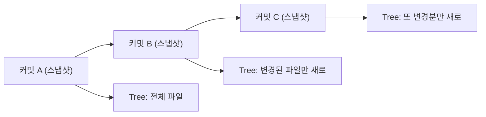
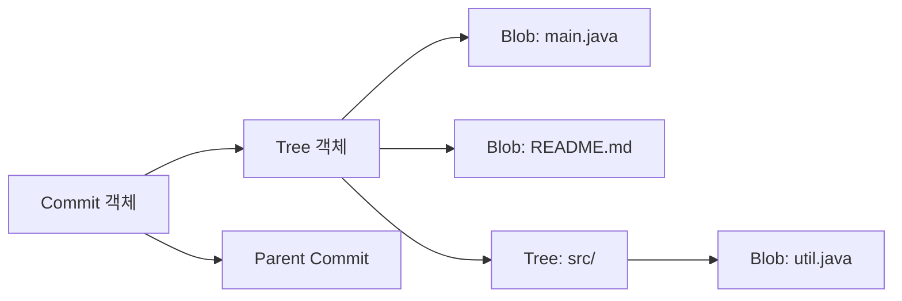
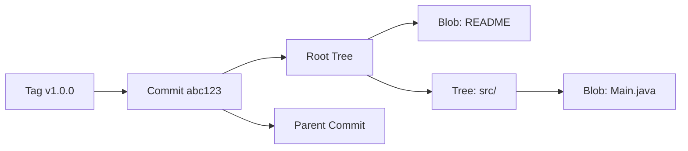
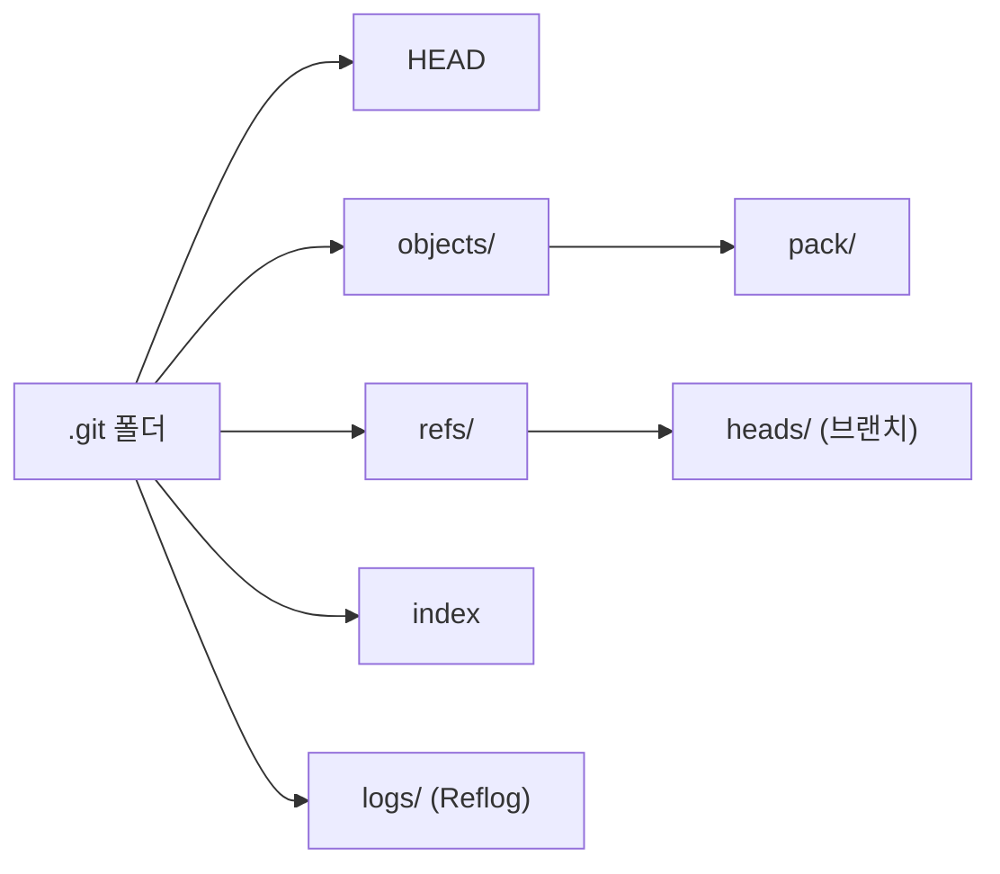
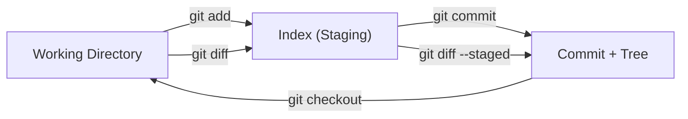
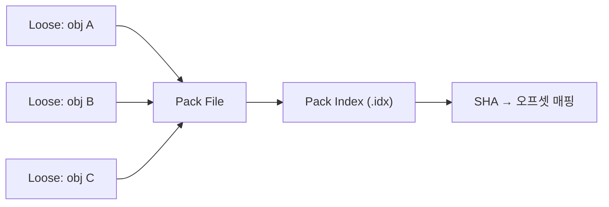
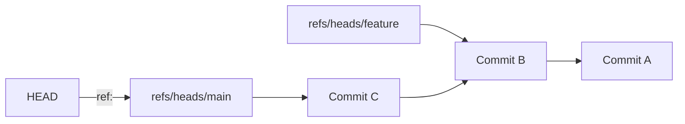

> **한 줄 요약**: Git은 파일 차이가 아닌 **스냅샷**을 SHA-1 해시로 주소화한 Content-Addressable Storage이다. Blob·Tree·Commit·Tag 4가지 Object, Index(Staging Area), Pack File 압축, 참조 시스템을 이해하면 Git의 모든 명령이 왜 그렇게 동작하는지 설명할 수 있다.

---

## 실제 장애: .git 폴더를 삭제하려다 벌어진 일

2023년 국내 한 스타트업에서 CI/CD 빌드 실패를 디버깅하던 주니어 개발자가 `.git/index` 파일이 손상되었다고 판단해 `.git` 폴더 전체를 삭제하고 `git init`으로 다시 초기화했습니다. 문제는 로컬에만 존재하는 3개월치 브랜치와 stash가 모두 사라진 것입니다. 원격에 푸시하지 않은 feature 브랜치 12개, 작업 중이던 코드 전부가 증발했습니다.

`.git` 폴더 안에 무엇이 들어 있는지, 각 파일이 어떤 역할을 하는지 알았다면 `git read-tree`나 `git reset`으로 index만 복구할 수 있었습니다. 이 포스트는 `.git` 내부를 완전히 해부하여, 위와 같은 사고를 원천 방지하는 것이 목표입니다.

---

## 1. Git은 스냅샷이다 — 사진첩 비유

대부분의 버전 관리 시스템(SVN, CVS)은 **파일 단위 변경분(delta)**을 저장합니다. 반면 Git은 커밋할 때마다 **프로젝트 전체의 스냅샷**을 찍습니다. 변경되지 않은 파일은 이전 스냅샷의 동일한 객체를 가리키므로 공간 낭비가 없습니다.

> **비유**: Git 리포지토리는 **사진첩**입니다. 매 커밋은 프로젝트의 단체 사진 한 장입니다. 사진 속 사람(파일)이 달라지지 않았다면 같은 인물 사진을 재사용하고, 옷이 바뀐 사람만 새로 촬영합니다. SVN은 "어제 대비 달라진 점" 메모만 남기는 일기장이라면, Git은 매번 전체 사진을 찍되 중복 인물은 공유하는 앨범입니다.



### 델타 vs 스냅샷의 성능 차이

스냅샷 방식 덕분에 Git은 브랜치 전환이 빠릅니다. 특정 커밋 시점의 파일 상태를 복원할 때 "최초 버전 + 변경분 N개"를 순차 적용할 필요 없이, 해당 커밋이 가리키는 Tree → Blob을 직접 읽으면 됩니다. O(N) 대신 O(1) 접근입니다.

```bash
# 커밋 간 차이를 보는 것은 Git이 "나중에" 계산하는 것
git diff HEAD~3 HEAD

# 반면 특정 커밋의 파일 내용은 즉시 꺼낼 수 있음
git show HEAD:src/main.java
```

---

## 2. 4대 Object — Blob, Tree, Commit, Tag

Git의 핵심은 `.git/objects/` 디렉토리에 저장되는 4가지 Object입니다. 모든 Object는 **내용(content)의 SHA-1 해시값**을 키(key)로 사용합니다.



### 2-1. Blob (Binary Large Object) — 파일 내용 그 자체

Blob은 **파일의 내용만** 저장합니다. 파일 이름, 경로, 권한 정보는 포함하지 않습니다. 동일한 내용의 파일이 10개 있어도 Blob은 단 하나만 생성됩니다.

> **비유**: Blob은 **사물함 안의 물건**입니다. 사물함 번호(SHA-1)만 알면 물건을 꺼낼 수 있고, 물건 자체에는 "누구 것"이라는 이름표가 붙어 있지 않습니다. 같은 물건이면 같은 사물함에 들어갑니다.

```bash
# 직접 Blob을 만들어 보자
echo "Hello Git Internals" | git hash-object -w --stdin
# 출력: 3b18e512dba79e4c8300dd08aeb37f8e728b8dad (예시)

# 저장된 Blob 확인
git cat-file -t 3b18e512
# 출력: blob

# Blob 내용 읽기
git cat-file -p 3b18e512
# 출력: Hello Git Internals
```

#### Blob의 내부 형식

Git이 실제로 저장하는 데이터는 `blob <크기>\0<내용>`을 zlib으로 압축한 것입니다.

```bash
# SHA-1 해시 계산 과정을 수동으로 재현
echo -e "blob 20\0Hello Git Internals" | shasum
# git hash-object의 결과와 동일한 SHA-1이 나옴

# .git/objects/ 디렉토리에서 실제 파일 확인
# SHA-1의 앞 2자리 = 디렉토리, 나머지 38자리 = 파일명
ls .git/objects/3b/18e512dba79e4c8300dd08aeb37f8e728b8dad
```

### 2-2. Tree — 디렉토리 구조

Tree 객체는 **디렉토리 하나**에 대응합니다. 포함 항목별로 `모드 타입 SHA-1 파일명` 형태의 엔트리를 갖습니다.

> **비유**: Tree는 **폴더의 목차**입니다. "이 폴더에는 main.java(사물함 3b18e5)와 src/ 하위 폴더(목차 a7c2d1)가 있다"라고 기록합니다. 파일 내용 자체는 Blob 사물함이 보관하고, Tree는 "어디에 뭐가 있는지"만 관리합니다.

```bash
# 현재 HEAD의 루트 Tree 확인
git cat-file -p HEAD^{tree}
# 출력 예시:
# 100644 blob a7c2d1... README.md
# 040000 tree e8b3f2... src
# 100644 blob 5d3a8c... pom.xml

# src/ 하위 Tree 탐색
git cat-file -p e8b3f2
# 100644 blob 9f2c1a... Main.java
# 100644 blob b1e4d3... Util.java
```

#### 파일 모드의 의미

| 모드 | 의미 |
|------|------|
| `100644` | 일반 파일 (not executable) |
| `100755` | 실행 가능 파일 |
| `040000` | 디렉토리 (하위 Tree) |
| `120000` | 심볼릭 링크 |
| `160000` | 서브모듈 (Gitlink) |

### 2-3. Commit — 스냅샷의 메타데이터

Commit 객체는 하나의 Tree(루트 스냅샷)를 가리키며, 부모 커밋, 작성자, 커미터, 메시지를 담습니다.

> **비유**: Commit은 **사진첩의 한 페이지에 붙인 메모**입니다. "2026년 5월 16일에 김영진이 찍은 사진(Tree)이며, 이전 페이지는 3번(parent commit)이고, '로그인 기능 추가'라는 제목을 달았다"라고 기록합니다.

```bash
# 최근 커밋 객체 내용 확인
git cat-file -p HEAD
# 출력 예시:
# tree 4b825dc642cb6eb9a060e54bf899d69f7c6a0d3e
# parent 8a1b2c3d4e5f6a7b8c9d0e1f2a3b4c5d6e7f8a9b
# author Kim YJ <yjkim@example.com> 1747353600 +0900
# committer Kim YJ <yjkim@example.com> 1747353600 +0900
#
# feat: 로그인 기능 추가
```

#### Merge Commit의 특수성

일반 커밋은 parent가 1개이지만, Merge Commit은 **parent가 2개 이상**입니다. 이것이 `git log --graph`에서 분기가 합쳐지는 지점을 표현하는 원리입니다.

```bash
# Merge Commit 확인
git cat-file -p <merge-commit-hash>
# tree ...
# parent aaa111...  ← 첫 번째 부모 (현재 브랜치)
# parent bbb222...  ← 두 번째 부모 (머지한 브랜치)
```

### 2-4. Tag (Annotated Tag) — 이름표 객체

Annotated Tag는 별도의 객체로 저장되며, 대상 객체(보통 Commit), 태거, 날짜, 메시지를 포함합니다. Lightweight Tag는 단순한 참조(ref)일 뿐 객체가 아닙니다.

> **비유**: Annotated Tag는 사진첩 특정 페이지에 붙인 **금박 북마크 스티커**입니다. "v1.0.0 릴리스"라고 쓰여 있고, 누가 언제 붙였는지 기록됩니다. Lightweight Tag는 포스트잇으로 "여기!" 정도만 표시한 것입니다.

```bash
# Annotated Tag 생성
git tag -a v1.0.0 -m "첫 번째 정식 릴리스"

# Tag 객체 확인
git cat-file -p v1.0.0
# object 8a1b2c3d...  ← 가리키는 Commit
# type commit
# tag v1.0.0
# tagger Kim YJ <yjkim@example.com> 1747353600 +0900
#
# 첫 번째 정식 릴리스
```

### 4대 Object 관계 종합 다이어그램



---

## 3. SHA-1 해시 원리 — Content-Addressable Storage

Git은 모든 Object의 주소(이름)를 **내용 기반 해시**로 결정합니다. 같은 내용이면 반드시 같은 주소가 되고, 1비트라도 다르면 완전히 다른 주소가 됩니다. 이 성질이 Git의 무결성 보장 기반입니다.

> **비유**: SHA-1은 **지문**입니다. 사람마다 고유한 지문이 있듯, 파일 내용마다 고유한 40자리 16진수 지문이 있습니다. 내용이 같으면 지문도 같고, 한 글자만 바뀌어도 지문이 완전히 달라집니다.

### 해시 계산 공식

```
SHA-1( "<type> <size>\0<content>" )
```

- `type`: blob, tree, commit, tag 중 하나
- `size`: content의 바이트 크기 (10진수 문자열)
- `\0`: NULL 바이트 구분자
- `content`: 실제 데이터

```bash
# 직접 검증: Python으로 Blob SHA-1 계산
python3 -c "
import hashlib
content = b'Hello Git Internals'
header = f'blob {len(content)}\0'.encode()
print(hashlib.sha1(header + content).hexdigest())
"
# git hash-object 결과와 동일

# Git 내장 명령으로 확인
echo -n "Hello Git Internals" | git hash-object --stdin
```

### SHA-1 충돌 가능성

SHA-1은 160비트(2^160 가지)입니다. 생일 역설(Birthday Paradox)에 의해 약 2^80개의 Object가 있으면 충돌 확률이 50%에 도달합니다. 현실적으로 전 세계 모든 Git 리포의 Object를 합쳐도 2^80에는 한참 못 미칩니다.

그러나 2017년 Google의 SHAttered 공격으로 의도적 충돌이 가능함이 입증되었습니다. Git 2.13부터는 SHAttered 탐지 로직이 추가되었고, Git은 **SHA-256으로의 마이그레이션**을 진행 중입니다(뒤에서 다룸).

---

## 4. .git 디렉토리 구조 해부

`git init`을 실행하면 생성되는 `.git` 폴더의 내부를 상세히 살펴보겠습니다.

```bash
# .git 내부 구조 확인
tree .git -L 1
# .git/
# ├── HEAD           ← 현재 체크아웃된 브랜치/커밋
# ├── config         ← 리포지토리 로컬 설정
# ├── description    ← GitWeb용 설명 (보통 사용 안 함)
# ├── hooks/         ← Git Hook 스크립트
# ├── index          ← Staging Area (바이너리)
# ├── info/          ← exclude 등 보조 정보
# ├── objects/       ← 모든 Object 저장소
# │   ├── pack/      ← Pack File
# │   └── info/      ← Pack 인덱스
# ├── refs/          ← 브랜치, 태그 참조
# │   ├── heads/     ← 로컬 브랜치
# │   ├── tags/      ← 태그
# │   └── remotes/   ← 원격 브랜치
# ├── logs/          ← Reflog
# └── packed-refs    ← 압축된 참조 파일
```



### 주요 파일 상세

| 파일/디렉토리 | 역할 | 형식 |
|---|---|---|
| `HEAD` | 현재 브랜치 참조 | 텍스트: `ref: refs/heads/main` |
| `index` | Staging Area | 바이너리 (정렬된 엔트리 배열) |
| `objects/` | Blob, Tree, Commit, Tag 저장 | zlib 압축 바이너리 |
| `refs/heads/` | 로컬 브랜치별 최신 커밋 SHA-1 | 텍스트: SHA-1 40자리 |
| `refs/tags/` | 태그가 가리키는 SHA-1 | 텍스트: SHA-1 40자리 |
| `packed-refs` | 많은 ref를 하나로 압축 | 텍스트: `SHA-1 refname` |
| `config` | 리포 로컬 설정 | INI 형식 |
| `logs/` | HEAD와 각 ref의 변경 이력 | 텍스트: old-SHA new-SHA 타임스탬프 |

```bash
# HEAD 내용 확인
cat .git/HEAD
# ref: refs/heads/main

# 브랜치가 가리키는 커밋 확인
cat .git/refs/heads/main
# 8a1b2c3d4e5f6a7b8c9d0e1f2a3b4c5d6e7f8a9b

# Detached HEAD 상태에서는 직접 SHA-1이 기록됨
git checkout HEAD~2
cat .git/HEAD
# 5f6a7b8c9d0e1f2a3b4c5d6e7f8a9b0c1d2e3f4a
```

---

## 5. Index (Staging Area) 동작 원리

Index는 `.git/index` 파일에 바이너리 형태로 저장됩니다. **다음 커밋에 포함될 파일 목록과 각 파일의 Blob SHA-1**을 관리하는 구조체입니다.

> **비유**: Index는 **출판사의 원고 데스크**입니다. 작가(Working Directory)가 작성한 원고 중 "이번 호에 실을 것"만 데스크 위에 올립니다(`git add`). 편집장이 "인쇄!"라고 외치면(`git commit`) 데스크 위의 원고가 그대로 인쇄(스냅샷)됩니다. 작가의 책상 위에 있지만 데스크에 올리지 않은 원고는 인쇄되지 않습니다.



### Index의 내부 구조

```bash
# Index 내용을 사람이 읽을 수 있는 형태로 출력
git ls-files --stage
# 100644 3b18e512dba79e4c8300dd08aeb37f8e728b8dad 0	README.md
# 100644 9f2c1a7b3e4d5f6a7b8c9d0e1f2a3b4c5d6e7f8a 0	src/Main.java

# 각 엔트리의 의미:
# 모드  Blob-SHA-1  스테이지번호  파일경로
```

#### 스테이지 번호의 비밀

평상시 스테이지 번호는 `0`입니다. 충돌(conflict)이 발생하면 하나의 파일에 대해 **3개의 엔트리**가 생깁니다.

| 스테이지 | 의미 |
|---|---|
| 1 | 공통 조상 (base) |
| 2 | 현재 브랜치 (ours) |
| 3 | 머지 대상 브랜치 (theirs) |

```bash
# 충돌 상태에서 Index 확인
git ls-files --stage --unmerged
# 100644 aaa111... 1	src/Config.java   ← base
# 100644 bbb222... 2	src/Config.java   ← ours
# 100644 ccc333... 3	src/Config.java   ← theirs
```

### git add의 실제 동작

`git add README.md`를 실행하면 내부적으로 다음이 일어납니다.

1. `README.md`의 내용으로 Blob 객체를 생성하여 `.git/objects/`에 저장
2. `.git/index`에서 `README.md` 엔트리의 SHA-1을 새 Blob의 SHA-1로 갱신
3. 파일 크기, 수정 시간 등 stat 캐시도 함께 갱신

```bash
# git add를 저수준 명령으로 재현
BLOB_SHA=$(git hash-object -w README.md)
git update-index --add --cacheinfo 100644,$BLOB_SHA,README.md
```

### git commit의 실제 동작

`git commit`을 실행하면 내부적으로 다음이 일어납니다.

1. Index의 모든 엔트리를 바탕으로 **Tree 객체 계층 구조를 생성**
2. Tree의 루트 SHA-1, 부모 커밋, 작성자/커미터 정보, 메시지를 합쳐 **Commit 객체 생성**
3. 현재 브랜치 ref(`refs/heads/main`)를 새 Commit의 SHA-1로 갱신

```bash
# git commit을 저수준 명령으로 재현
TREE_SHA=$(git write-tree)
COMMIT_SHA=$(echo "feat: 수동 커밋" | git commit-tree $TREE_SHA -p HEAD)
git update-ref refs/heads/main $COMMIT_SHA
```

---

## 6. Pack File & Delta Compression

### Loose Object의 한계

처음에 Git은 모든 Object를 개별 파일(Loose Object)로 저장합니다. 리포지토리에 Object가 수만 개 이상 쌓이면 파일시스템의 inode를 과도하게 소비하고, 네트워크 전송(push/fetch)도 비효율적입니다.

> **비유**: Loose Object는 **낱장 프린트물을 각각 봉투에 넣은 것**입니다. 1만 장이면 1만 개 봉투입니다. Pack File은 이것을 **한 권의 바인더로 묶고, 비슷한 장은 "3페이지와 같은데 2줄만 다름"이라고 압축 메모**를 남기는 것입니다.

### Pack의 동작 원리

```bash
# 수동으로 Pack 생성
git gc
# 또는
git repack -a -d

# Pack 파일 확인
ls .git/objects/pack/
# pack-abc123...def456.idx   ← 인덱스 (Object SHA → Pack 내 오프셋)
# pack-abc123...def456.pack  ← 실제 데이터
```



### Delta Compression 상세

Pack File 안에서 Git은 **비슷한 Object끼리 Delta(차이분)**를 계산합니다. 주의할 점은 이것이 커밋 순서와 무관하다는 것입니다. Git은 파일 크기와 이름이 비슷한 Object를 휴리스틱으로 찾아 Delta Base를 결정합니다.

```
Pack File 내부 구조:
┌──────────────────────────────────────────────┐
│ Pack Header: PACK + 버전(2) + Object 개수     │
├──────────────────────────────────────────────┤
│ Object 1: [type + size] [zlib(content)]       │  ← 원본
│ Object 2: [OFS_DELTA + base_offset] [delta]   │  ← Delta (오프셋 기반)
│ Object 3: [REF_DELTA + base_SHA] [delta]      │  ← Delta (SHA 기반)
│ ...                                           │
├──────────────────────────────────────────────┤
│ Pack Checksum (SHA-1)                         │
└──────────────────────────────────────────────┘
```

```bash
# Pack 내용 검사
git verify-pack -v .git/objects/pack/pack-*.idx
# SHA-1  type  size  size-in-pack  offset  depth  base-SHA
# abc12  blob  15234  3421         12      0
# def34  blob  15280  127          3445    1      abc12
# ↑ def34는 abc12를 base로 한 delta (127바이트만 저장)

# Pack 통계 확인
git count-objects -vH
# count: 0          ← Loose Object 수
# size: 0 bytes
# in-pack: 12847    ← Pack 내 Object 수
# packs: 1
# size-pack: 4.52 MiB
```

### Delta Chain Depth

Delta는 다른 Delta를 Base로 삼을 수 있어 체인이 형성됩니다. 기본 최대 깊이는 **50**입니다. 깊이가 깊을수록 압축률은 좋지만, 특정 Object 복원 시 체인 전체를 역추적해야 하므로 읽기 성능이 저하됩니다.

```bash
# Delta Chain 깊이 제한 설정
git config pack.depth 50          # 기본값
git config pack.window 250        # 비교 윈도우 크기 (기본 10)

# 큰 리포에서 repack 최적화
git repack -a -d --depth=30 --window=100
```

---

## 7. 참조 시스템 — HEAD, Branch, Tag, Remote

Git의 참조(ref)는 **SHA-1 해시를 가리키는 포인터**입니다. 40자리 해시를 외울 수 없으니 사람이 읽을 수 있는 이름을 부여한 것입니다.

> **비유**: 참조는 **도서관의 서가 라벨**입니다. "소설" 라벨(main 브랜치)은 특정 책꽂이(Commit)를 가리키고, 새 책이 들어오면 라벨 위치만 옮깁니다. 책(Object) 자체는 움직이지 않습니다. "추천 도서"(Tag)는 특정 책에 고정된 스티커입니다.

### HEAD — 현재 위치 포인터

```bash
# 일반 상태: 브랜치를 가리키는 심볼릭 참조
cat .git/HEAD
# ref: refs/heads/main

# Detached HEAD: 직접 커밋을 가리킴
git checkout abc1234
cat .git/HEAD
# abc1234567890abcdef1234567890abcdef123456
```

### Branch — 이동하는 포인터

브랜치는 `.git/refs/heads/<name>` 파일에 커밋 SHA-1 한 줄이 기록된 것입니다. 새 커밋을 만들면 이 파일의 내용이 새 커밋 SHA-1로 갱신됩니다. 브랜치 생성은 40바이트 파일 하나를 만드는 것이므로 O(1)로 극도로 가볍습니다.

```bash
# 브랜치 생성의 본질
echo "abc1234567890abcdef1234567890abcdef123456" > .git/refs/heads/feature-x

# 위와 동일한 효과
git branch feature-x abc1234
```



### Remote-Tracking Branch

`refs/remotes/origin/main`은 마지막 `fetch`/`push` 시점의 원격 main 브랜치 상태를 기록합니다. 로컬에서 수정할 수 없고, `git fetch` 시에만 갱신됩니다.

```bash
# 원격 참조 확인
cat .git/refs/remotes/origin/main
# 또는 packed-refs에서 확인
grep "refs/remotes" .git/packed-refs
```

### packed-refs — 참조 파일 통합

리포지토리에 수백 개의 태그와 브랜치가 있으면 `refs/` 아래 파일이 수백 개 생깁니다. `git pack-refs --all`은 이것을 `.git/packed-refs` 하나의 텍스트 파일로 통합합니다.

```bash
# packed-refs 내용
cat .git/packed-refs
# # pack-refs with: peeled fully-peeled sorted
# abc123... refs/heads/main
# def456... refs/tags/v1.0.0
# ^789abc...   ← Annotated Tag가 가리키는 Commit (peeled)
```

---

## 8. Reflog — 시간여행 기록

Reflog는 **HEAD와 각 브랜치 ref가 변경된 모든 이력**을 기록합니다. 커밋, 체크아웃, 리베이스, 리셋 등 모든 ref 변경이 로그됩니다.

> **비유**: Reflog는 **웹 브라우저의 방문 기록**입니다. 현재 페이지(HEAD)가 어디를 거쳐 왔는지 전부 기록됩니다. 실수로 탭을 닫아도(branch 삭제, hard reset) 방문 기록에서 복구할 수 있습니다. 단, 기본 90일이 지나면 기록이 만료됩니다.

```bash
# HEAD의 Reflog 확인
git reflog
# abc1234 HEAD@{0}: commit: feat: 로그인 추가
# def5678 HEAD@{1}: checkout: moving from feature to main
# 9ab0123 HEAD@{2}: commit: fix: 버그 수정

# 특정 브랜치의 Reflog
git reflog show main

# Reflog를 이용한 복구 — "실수로 hard reset한 커밋 복원"
git reset --hard HEAD@{2}

# 실제 Reflog 파일 위치
cat .git/logs/HEAD
# old-SHA new-SHA author timestamp message
```

### Reflog 만료 정책

```bash
# 기본 만료 기간
git config gc.reflogExpire          # 90일 (도달 가능한 항목)
git config gc.reflogExpireUnreachable  # 30일 (도달 불가능한 항목)

# 만료 기간 변경
git config gc.reflogExpire "180 days"
```

---

## 9. 가비지 컬렉션 (git gc)

Git의 가비지 컬렉션은 **참조 체인에서 도달할 수 없는(unreachable) Object를 정리**하고, Loose Object를 Pack으로 묶습니다.

> **비유**: `git gc`는 **창고 정리의 날**입니다. 사진첩(커밋 그래프)의 어떤 페이지에서도 참조되지 않는 사진(dangling Object)을 폐기하고, 낱장 사진을 앨범으로 정리합니다.

### gc가 하는 일

1. **Loose Object → Pack File** 압축 (`git repack`)
2. **Unreachable Object 제거** (`git prune`)
3. **Reflog 만료 항목 정리** (`git reflog expire`)
4. **packed-refs 정리** (`git pack-refs`)

```bash
# 수동 GC 실행
git gc

# 공격적 GC (더 높은 압축률, 느림)
git gc --aggressive

# 현재 Object 통계
git count-objects -vH

# 자동 GC 트리거 조건 확인
git config gc.auto          # 기본 6700 (Loose Object 수)
git config gc.autoPackLimit # 기본 50 (Pack 파일 수)
```

### Dangling Object와 Unreachable Object

| 용어 | 의미 |
|---|---|
| **Reachable** | HEAD, 브랜치, 태그 등 어떤 ref에서든 도달 가능 |
| **Unreachable** | 어떤 ref에서도 도달 불가능하지만 아직 삭제 안 됨 |
| **Dangling** | Unreachable이면서 다른 어떤 Object도 참조하지 않는 최상위 |

```bash
# Dangling Object 찾기
git fsck --unreachable --no-reflogs
# dangling commit abc123...
# dangling blob def456...

# 특정 dangling commit 복구
git branch recovered abc123
```

---

## 10. 극한 시나리오

### 10-1. 리포지토리 10GB+ — 모노레포의 압박

Google, Microsoft(Windows), Facebook은 수십 GB 규모의 모노레포를 운영합니다. 이 규모에서 발생하는 문제와 해결책을 정리합니다.

**문제점:**

- `git clone` 시간이 수십 분~수 시간
- `git status`가 수만 개 파일의 stat()을 호출하여 느려짐
- Pack File Index 탐색 오버헤드 증가

**해결책 1: Shallow Clone**

```bash
# 최근 1개 커밋만 클론 (히스토리 없음)
git clone --depth 1 https://github.com/large/repo.git

# 나중에 히스토리 추가 확보
git fetch --deepen=10    # 10개 커밋 추가
git fetch --unshallow    # 전체 히스토리 복원
```

> **비유**: Shallow Clone은 **사진첩의 마지막 페이지만 복사**하는 것입니다. 과거 사진은 필요할 때 추가로 복사합니다.

**해결책 2: Partial Clone (Git 2.19+)**

```bash
# Blob 없이 클론 (Tree와 Commit만)
git clone --filter=blob:none https://github.com/large/repo.git

# 특정 크기 이상 Blob 제외
git clone --filter=blob:limit=1m https://github.com/large/repo.git

# 체크아웃 시 필요한 Blob만 on-demand fetch
git checkout main  # 이 시점에 Blob을 서버에서 가져옴
```

**해결책 3: Sparse Checkout**

```bash
# 특정 디렉토리만 체크아웃
git sparse-checkout init --cone
git sparse-checkout set src/backend docs/api
# Working Directory에는 지정한 디렉토리만 존재
```

**해결책 4: FSMonitor**

```bash
# Watchman 기반 파일 변경 감시 (git status 가속)
git config core.fsmonitor true
git config core.untrackedcache true
```

### 10-2. 대용량 바이너리 — Git LFS

Git은 텍스트 파일에 최적화되어 있습니다. 수백 MB의 바이너리(동영상, 모델 파일)를 커밋하면 Pack File의 Delta Compression이 효과가 없어 리포가 급격히 비대해집니다.

```bash
# Git LFS 설치 및 설정
git lfs install
git lfs track "*.psd"
git lfs track "*.mp4"
cat .gitattributes
# *.psd filter=lfs diff=lfs merge=lfs -text
# *.mp4 filter=lfs diff=lfs merge=lfs -text

# LFS는 Blob 대신 포인터 파일을 커밋
git cat-file -p HEAD:design/logo.psd
# version https://git-lfs.github.com/spec/v1
# oid sha256:abc123...
# size 52428800
```

> **비유**: Git LFS는 **사진첩에 실물 사진 대신 "사진은 클라우드 서버 A에 있음"이라는 메모지를 붙이는 것**입니다. 앨범(리포)은 가벼워지고, 실물이 필요할 때만 클라우드에서 다운로드합니다.

### 10-3. SHA-256 마이그레이션

Git은 SHA-1에서 SHA-256으로의 전환을 단계적으로 진행 중입니다(Git 2.42+ 실험적 지원).

```bash
# SHA-256 리포 초기화 (실험적)
git init --object-format=sha256

# 현재 리포의 해시 알고리즘 확인
git rev-parse --show-object-format
# sha1 (대부분의 기존 리포)
```

**마이그레이션 전략:**

- **새 리포**: `--object-format=sha256`으로 시작
- **기존 리포**: SHA-1 ↔ SHA-256 변환 레이어를 통한 점진적 전환
- **호환성**: `extensions.objectFormat` 설정으로 하위 호환 유지
- **GitHub/GitLab**: 아직 SHA-256 리포를 공식 지원하지 않음 (2026년 기준 테스트 단계)

---

## 11. 실무 실수 TOP 5

### 실수 1: .git 폴더 삭제

**상황**: 빌드 에러를 해결하려고 `.git` 폴더를 삭제하고 `git init`으로 재초기화

**피해**: 로컬 브랜치, stash, reflog 전부 소실

**올바른 대처**: 문제의 원인을 특정해서 해당 파일만 복구

```bash
# Index가 손상된 경우
rm .git/index
git read-tree HEAD   # HEAD 커밋의 Tree로 Index 재생성
git checkout-index -a  # Working Directory 복원

# HEAD가 손상된 경우
git reflog  # 또는 .git/logs/HEAD 직접 확인
echo "ref: refs/heads/main" > .git/HEAD
```

### 실수 2: git add . 후 대용량 바이너리 커밋

**상황**: `node_modules/`나 빌드 결과물을 실수로 커밋

**해결**:

```bash
# 최근 커밋에서 제거 (아직 push하지 않은 경우)
git reset HEAD~1
echo "node_modules/" >> .gitignore
git add .gitignore
git commit -m "chore: .gitignore에 node_modules 추가"

# 이미 push한 경우 — 히스토리에서 완전 제거
git filter-branch --tree-filter 'rm -rf node_modules' HEAD
# 또는 BFG Repo-Cleaner 사용 (더 빠름)
bfg --delete-folders node_modules
git reflog expire --expire=now --all
git gc --prune=now --aggressive
```

### 실수 3: Detached HEAD에서 커밋 후 브랜치 전환

**상황**: Detached HEAD 상태에서 작업 후 `git checkout main` → 커밋이 사라짐

**복구**:

```bash
# Reflog에서 찾기
git reflog
# abc1234 HEAD@{1}: commit: 중요한 작업

# 브랜치로 살리기
git branch rescue abc1234
```

### 실수 4: force push로 팀원 커밋 덮어쓰기

**예방**:

```bash
# force push 대신 --force-with-lease 사용
git push --force-with-lease origin feature
# 원격에 예상치 못한 커밋이 있으면 push 거부

# 또는 서버에서 force push 차단
# GitHub: Settings → Branches → Branch protection rules
```

### 실수 5: 민감 정보(비밀번호, API 키) 커밋

**상황**: `.env` 파일이나 credentials을 실수로 커밋

**대처**:

```bash
# 히스토리에서 완전 제거 (모든 커밋에서)
git filter-repo --path .env --invert-paths

# 즉시 해야 할 일
# 1. 유출된 키/비밀번호 즉시 폐기 및 재발급
# 2. .gitignore에 추가
# 3. 팀원 전원 fresh clone
```

---

## 12. Object 저장 흐름 종합 실습

지금까지 배운 개념을 한 번의 커밋 과정으로 종합합니다.

```bash
# 1. 빈 리포 생성
git init demo && cd demo

# 2. 파일 생성
echo "public class App {}" > App.java
mkdir src && echo "public class Util {}" > src/Util.java

# 3. Staging — Blob 생성 + Index 갱신
git add .
git ls-files --stage
# 100644 <sha-A> 0  App.java
# 100644 <sha-B> 0  src/Util.java

# 4. Blob 내용 확인
git cat-file -p <sha-A>
# public class App {}

# 5. Commit — Tree + Commit 생성
git commit -m "initial commit"

# 6. Tree 구조 확인
git cat-file -p HEAD^{tree}
# 100644 blob <sha-A>  App.java
# 040000 tree <sha-C>  src

git cat-file -p <sha-C>
# 100644 blob <sha-B>  Util.java

# 7. Commit 객체 확인
git cat-file -p HEAD
# tree <sha-D>
# author ...
# committer ...
# initial commit

# 8. Object 파일 직접 확인
find .git/objects -type f | head -5
# .git/objects/3b/18e5...  ← Blob
# .git/objects/a7/c2d1...  ← Tree
# .git/objects/f1/2e3d...  ← Commit
```


---

## 13. 면접 포인트

<details><summary><strong>면접 포인트 1️⃣ Git은 델타 기반인가, 스냅샷 기반인가?</strong></summary>

Q. Git의 버전 저장 방식은 무엇이며, SVN과 어떻게 다릅니까?

A. Git은 **스냅샷 기반**입니다. 매 커밋 시 프로젝트의 전체 파일 상태를 Tree + Blob 객체로 기록합니다. 변경되지 않은 파일은 동일한 Blob을 재참조하므로 공간 낭비가 없습니다. SVN은 파일 단위 변경분(delta)만 저장하여 특정 시점 복원 시 최초 버전부터 모든 delta를 적용해야 합니다. 단, Git도 **Pack File 내부에서는 Delta Compression을 사용**합니다. 이는 저장 효율을 위한 것이지 개념적 모델과는 별개입니다.

</details>

<details><summary><strong>면접 포인트 2️⃣ git add와 git commit의 내부 동작을 설명하시오</strong></summary>

Q. `git add`를 하면 내부적으로 무슨 일이 일어납니까?

A. `git add <file>`은 두 가지 일을 합니다. (1) 파일 내용을 zlib 압축하여 `.git/objects/`에 **Blob 객체로 저장** (`git hash-object -w`와 동일). (2) `.git/index` 파일에 해당 파일의 경로, 모드, Blob SHA-1을 기록하거나 갱신 (`git update-index`와 동일). `git commit`은 (1) Index를 바탕으로 **Tree 객체 계층을 생성** (`git write-tree`), (2) Tree SHA-1 + parent + author + message로 **Commit 객체 생성** (`git commit-tree`), (3) 현재 브랜치 ref를 새 Commit SHA-1로 갱신 (`git update-ref`).

</details>

<details><summary><strong>면접 포인트 3️⃣ SHA-1 충돌이 발생하면 어떻게 되는가?</strong></summary>

Q. Git에서 SHA-1 해시 충돌이 발생할 가능성과 그 영향은?

A. 이론적으로 2^80개 Object에서 50% 충돌 확률입니다. 실무적으로 전 세계 Git Object를 합쳐도 이 수에 한참 못 미칩니다. 그러나 2017년 SHAttered 공격으로 의도적 충돌이 입증되었고, Git 2.13부터 **SHAttered 탐지 로직**을 내장했습니다. 장기적으로 Git은 **SHA-256으로 마이그레이션** 중이며, `git init --object-format=sha256`으로 새 리포를 SHA-256으로 생성할 수 있습니다.

</details>

<details><summary><strong>면접 포인트 4️⃣ Pack File의 Delta Compression은 무엇인가?</strong></summary>

Q. Git Pack File의 Delta Compression 원리를 설명하시오.

A. Git은 Loose Object가 많아지면 Pack File로 통합합니다. Pack 내부에서 **내용이 유사한 Object끼리 Delta(차이분)**를 계산하여 base Object + delta instruction 형태로 저장합니다. 이는 커밋 순서와 무관하게 **파일 크기와 이름 유사도** 기반 휴리스틱으로 base를 결정합니다. Delta는 체인을 형성할 수 있으며 기본 최대 깊이는 50입니다. `git verify-pack -v`로 Pack 내부의 delta chain을 확인할 수 있습니다.

</details>

<details><summary><strong>면접 포인트 5️⃣ 대규모 리포지토리 최적화 전략은?</strong></summary>

Q. 10GB 이상의 대규모 Git 리포지토리를 효율적으로 관리하는 방법은?

A. 네 가지 핵심 전략이 있습니다. (1) **Shallow Clone** (`--depth N`): 최근 N개 커밋만 클론하여 클론 시간 단축. (2) **Partial Clone** (`--filter=blob:none`): Blob 없이 Tree/Commit만 클론하고, 체크아웃 시 필요한 Blob만 on-demand fetch. (3) **Sparse Checkout**: Working Directory에 필요한 디렉토리만 체크아웃. (4) **Git LFS**: 대용량 바이너리를 별도 스토리지로 분리하여 리포 크기 관리. 추가로 **FSMonitor**(Watchman)로 `git status` 성능을 개선하고, `git gc --aggressive`로 Pack 최적화를 수행합니다.

</details>

---

## 마무리: .git을 이해하면 Git이 보인다

Git의 모든 명령은 결국 4가지 Object(Blob, Tree, Commit, Tag)를 생성하고, Index를 갱신하고, Ref를 이동시키는 조합입니다.

| 명령 | 내부 동작 |
|---|---|
| `git add` | Blob 생성 + Index 갱신 |
| `git commit` | Tree 생성 + Commit 생성 + Ref 갱신 |
| `git branch` | Ref 파일 생성 (41바이트) |
| `git checkout` | HEAD 변경 + Index/WD 갱신 |
| `git merge` | Tree 3-way 병합 + Commit(parent 2개) |
| `git rebase` | Commit 재생성 (새 SHA-1) + Ref 이동 |
| `git reset` | Ref 이동 + (옵션에 따라) Index/WD 갱신 |
| `git gc` | Loose → Pack + 정리 |

이 내부 구조를 알면 `git reflog`로 "사라진" 커밋을 복구할 수 있고, `.git/index`만 리셋하면 되는 상황에서 `.git` 전체를 날리는 실수를 하지 않습니다. Object는 불변(immutable)이고, 참조만 움직인다는 원칙을 기억하면, 어떤 Git 명령도 두렵지 않습니다.

---

> **참고 자료**
> - [Pro Git Book - Git Internals](https://git-scm.com/book/en/v2/Git-Internals-Plumbing-and-Porcelain)
> - [Git Object Format](https://git-scm.com/docs/git-hash-object)
> - [Git Pack Format](https://git-scm.com/docs/pack-format)
> - [SHAttered Attack](https://shattered.io/)
> - [SHA-256 Transition Plan](https://git-scm.com/docs/hash-function-transition)
