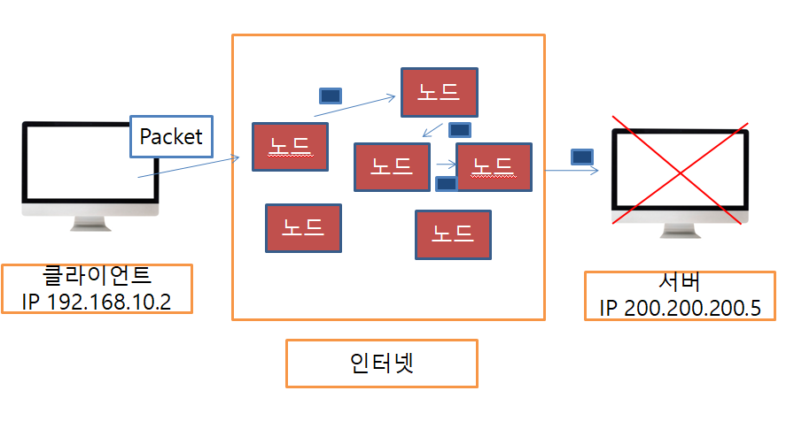
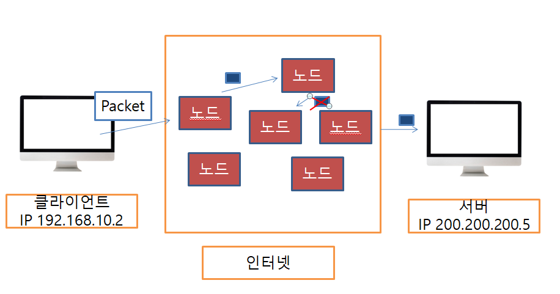
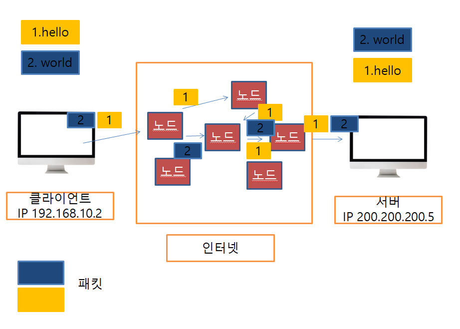
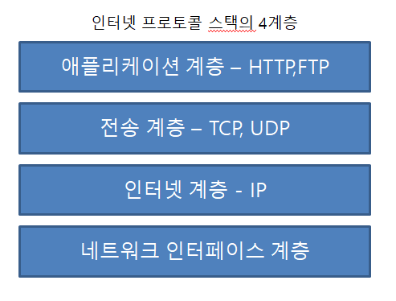
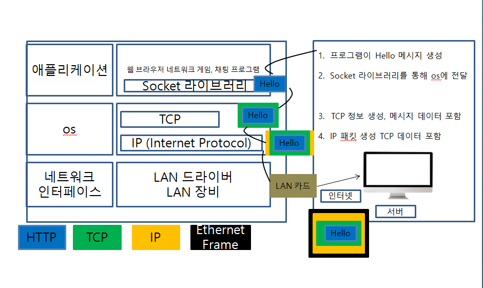
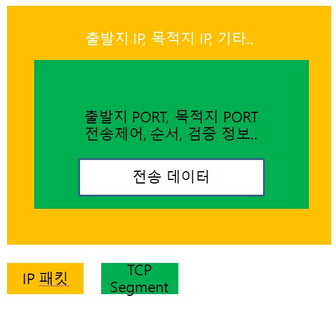
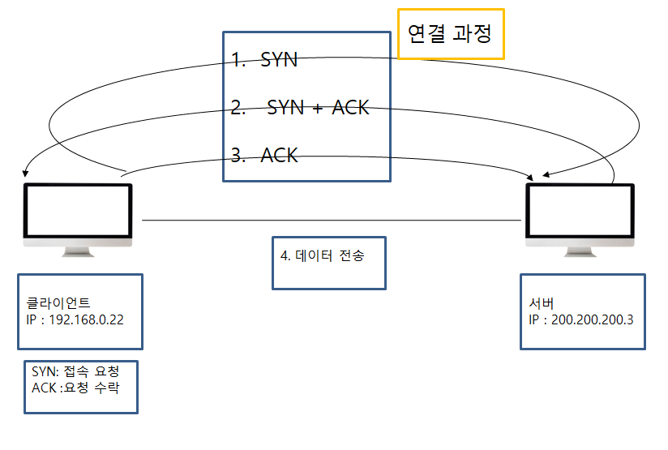
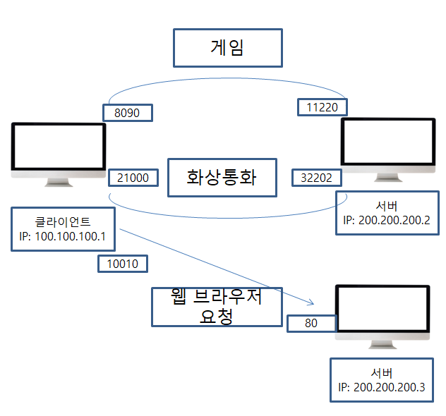
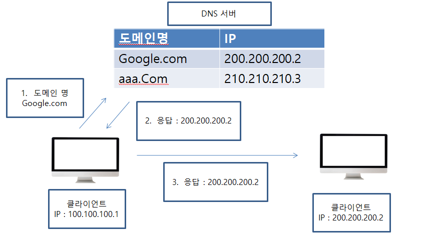

#### [인터넷 통신]

컴퓨터들 간의 인터넷 통신은 어떤원리로 이루어질까?

일반적으로 한 pc에서의 통신은 클라이언트와 서버간의 통신이 이루어진다.

하지만 여러 컴퓨터들간의 통신은 인터넷이라는 매개체를 통해 이루어진다.

###### IP [인터넷 프로토콜]

* 지정한 IP 주소에 데이터 전달 
* 패킷(Packet)이라는 통신 단위로 데이터 전달

IP 프로토콜의 한계

* 비연결성 패킷을 받을 대상이 없거나 서비스 불능 상태여도 패킷 전송 [대상 서버가 패킷을 받을 수 있는 상태인지 알 수 없다]

  

* 비신뢰성

  중간에 패킷이 사라지면? [패킷 전송 후 중간에 어떠한 이유로 패킷이 손실되도 알 수 없다.]

  

  패킷이 순서대로 안오면? [데이터 전송 시 1.Hello, 2.World 순서였지만 실제로 서버에 도착하는 순서는 다름]

* 프로그램 구분

  같은 IP를 사용하는 서버에서 통신하는 애플리케이션이 둘 이상이면?

  

  위와 같은 문제들은 IP Protocol의 한계이며 이를 해결하기 위한 방법은 TCP 프로토콜이다.

###### TCP Protocol

###### TCP  IP 패킷 정보 

TCP Segment에 전송제어, 순서제어 등을 통해 IP Protocol에서 해결이 안됬던 부분들을 해결이 가능하다.

###### TCP 특징 

###### [전송 제어 프로토콜 Transmission Control Protocol]

* 연결지향 - TCP 3 way handshake (가상 연결) [논리적 연결]

* 데이터 전달 보증 [데이터 전송시 서버에서 응답]

* 순서 보장

  클라이언트가 서버로 패킷1,2,3 순서로 전송하고 서버에 패킷1,3,2 순서로 도착하게 될 시 서버는 패킷 2부터 다시 보내도록 클라이언트에 요청

* 신뢰할 수 있는 프로토콜
* 현재는 대부분 TCP 사용

###### UDR Protocol 특징

###### 사용자 데이터그램 프로토콜 (User Datagram Protocol)

* 비연결지향
* 데이터 전달 보증 x
* 순서 보장 x
* 데이터 전달 및 순서가 보장되지 않지만, 단순하고 빠름 

###### Port [같은 IP 내에서 프로세스 구분]

하나의 PC에서 여러개의 서버에 연결해야 한다면 PORT를 이용한다

* 0 ~ 65535 할당 가능
* 0 ~ 1023 : 잘 알려진 포트 (Well known Port), 사용하지 않는 것이 좋음
* FTP - 20, 21
* TELNET - 23
* HTTP - 80
* HTTPS - 443

###### DNS [도메인 네임 시스템 (Domain Name System)]

도메인 명을 IP 주소로 변환

