> **한 줄 요약:** 인터넷에서 데이터가 목적지까지 안전하게 전달되려면 IP → TCP/UDP → PORT → DNS로 이어지는 계층적 프로토콜 구조가 필요하다.

## 비유로 이해하는 인터넷 통신

인터넷 통신을 **국제 택배**에 비유해 보겠습니다.

- **IP 주소** = 수신인 주소 (어디로 보낼지)
- **패킷** = 택배 상자 (데이터를 쪼개서 포장)
- **TCP** = 등기 택배 (배달 확인서, 분실 시 재발송)
- **UDP** = 일반 우편 (빠르지만 분실돼도 모름)
- **PORT** = 아파트 동/호수 (같은 주소 내에서 구분)
- **DNS** = 주소록 ("구글 본사"를 검색하면 실제 주소로 변환)

택배 회사(인터넷)는 중간에 여러 물류 센터(라우터)를 거쳐 패킷을 목적지로 보냅니다. 경로가 막히면 우회하고, 패킷이 손실되면 다시 요청합니다.

---

## 인터넷 통신의 기본 구조

컴퓨터 두 대가 **같은 방** 안에 있으면 직접 케이블로 연결할 수 있습니다. 하지만 서울과 뉴욕처럼 멀리 떨어진 경우에는 수많은 중간 노드(라우터, 스위치)를 거치는 **인터넷**을 통해 통신합니다.

```
클라이언트 ──→ 라우터A ──→ 라우터B ──→ ... ──→ 서버
(서울)                                        (뉴욕)
```

이 경로에서 데이터는 **패킷** 단위로 쪼개져 전송되며, 각 패킷은 서로 다른 경로로 이동할 수도 있습니다.

---

## IP (인터넷 프로토콜)

### IP의 역할

IP(Internet Protocol)는 인터넷에서 데이터를 **어디로** 보낼지 결정하는 프로토콜입니다.

- 지정한 IP 주소에 데이터를 전달
- 데이터를 **패킷(Packet)** 단위로 쪼개서 전송

### IP 패킷 구조

```
┌─────────────────────────────────┐
│  출발지 IP   │  목적지 IP        │
├─────────────────────────────────┤
│  TTL  │  프로토콜  │  체크섬    │
├─────────────────────────────────┤
│           데이터 (페이로드)      │
└─────────────────────────────────┘
```

### IP 프로토콜의 한계

IP만으로는 다음 세 가지 문제를 해결할 수 없습니다.

| 한계 | 설명 |
|------|------|
| **비연결성** | 수신 대상이 없거나 서비스 불능 상태여도 패킷을 전송해버림 |
| **비신뢰성** | 중간에 패킷이 유실되어도 송신자가 알 수 없음 |
| **순서 미보장** | 패킷이 다른 경로로 이동하면 도착 순서가 뒤바뀔 수 있음 |
| **프로그램 구분 불가** | 같은 IP의 서버에서 여러 앱이 동시에 통신할 때 구분 불가 |

**비연결성 예시:**

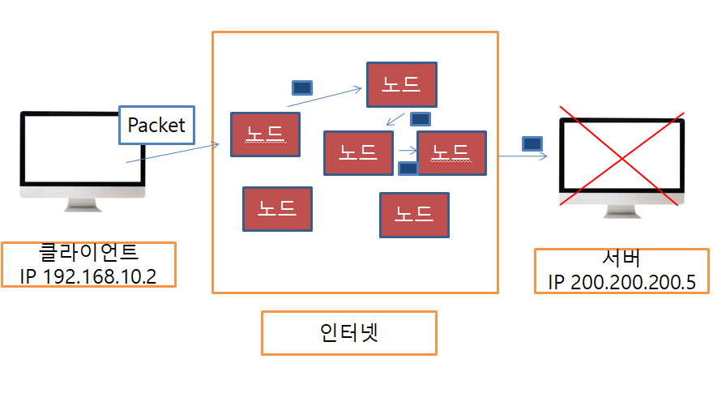

**비신뢰성 - 패킷 손실:**

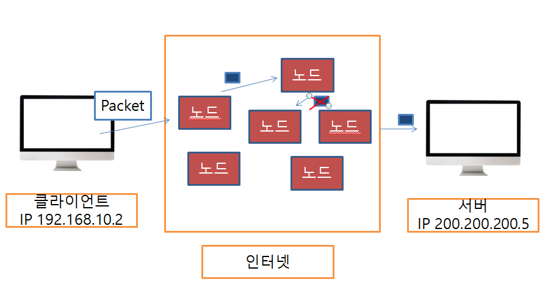

**비신뢰성 - 패킷 순서 뒤바뀜:**

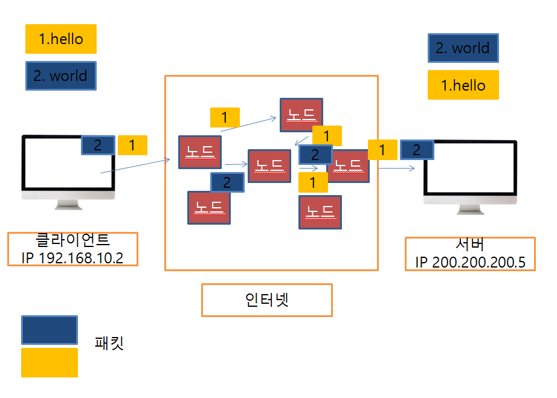

이러한 IP의 한계를 보완하기 위해 등장한 것이 바로 **TCP 프로토콜**입니다.

---

## TCP (전송 제어 프로토콜)

### 인터넷 프로토콜 스택 4계층

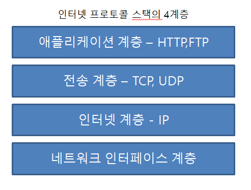

```
┌──────────────────┐
│   애플리케이션 계층  │  HTTP, FTP, DNS
├──────────────────┤
│    전송 계층       │  TCP, UDP
├──────────────────┤
│   인터넷 계층      │  IP
├──────────────────┤
│  네트워크 인터페이스 │  LAN 카드, 이더넷
└──────────────────┘
```

데이터를 보낼 때 위에서 아래로 **캡슐화**되고, 받을 때 아래에서 위로 **역캡슐화**됩니다.

### TCP/IP 패킷 구조

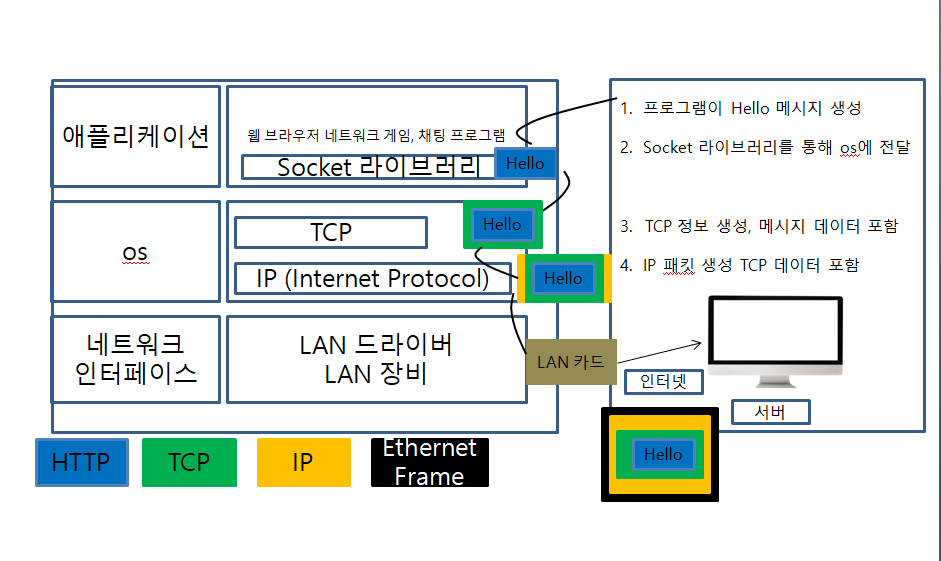

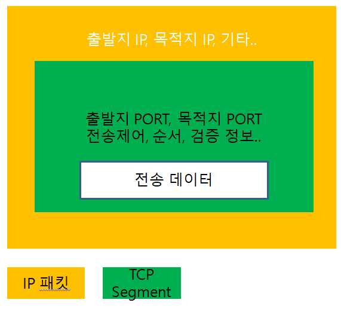

TCP 세그먼트에는 다음 정보가 포함됩니다:

```
┌──────────────────────────────────────┐
│  IP 헤더 (출발지 IP, 목적지 IP)        │
├──────────────────────────────────────┤
│  TCP 헤더 (출발지 PORT, 목적지 PORT,  │
│           시퀀스 번호, ACK 번호,      │
│           제어 플래그(SYN/ACK/FIN))  │
├──────────────────────────────────────┤
│           실제 데이터 (페이로드)       │
└──────────────────────────────────────┘
```

### TCP 주요 특징

| 특징 | 설명 |
|------|------|
| **연결 지향** | 3-way handshake로 논리적 연결을 먼저 수립 |
| **데이터 전달 보증** | 서버가 수신 확인 응답(ACK)을 전송 |
| **순서 보장** | 시퀀스 번호로 순서를 관리, 순서가 틀리면 재전송 요청 |
| **신뢰성** | 위 세 가지 특성으로 신뢰할 수 있는 통신 가능 |

### TCP 3-way Handshake

연결을 맺기 전에 수행하는 악수(handshake) 과정입니다. "내 말 들려요?" "들려요, 당신 말 들려요?" "저도 들려요!"의 3단계입니다.

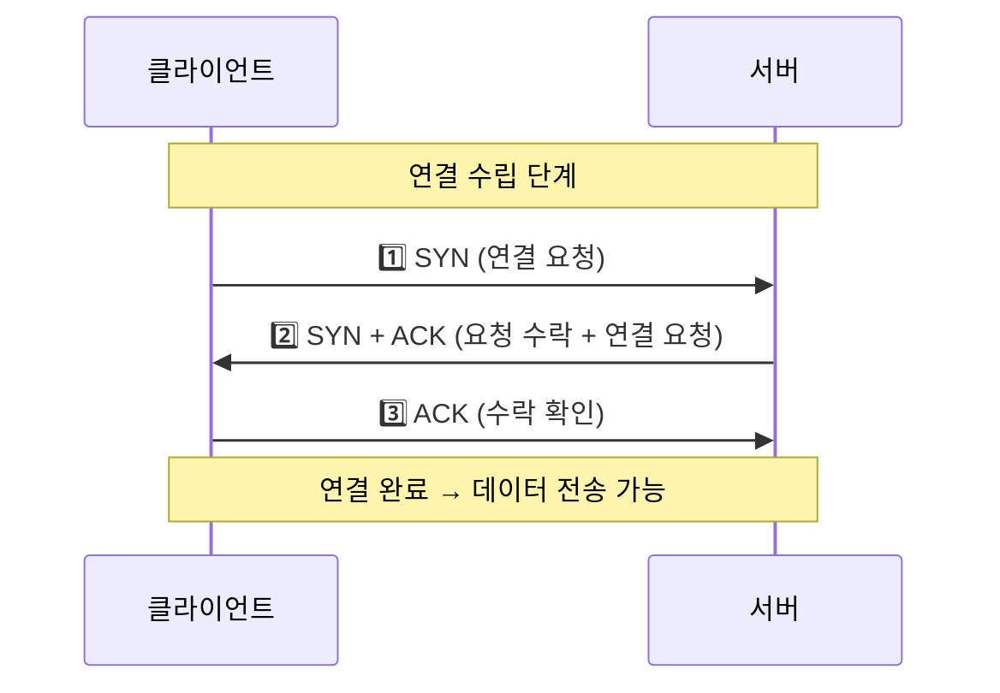
```mermaid
sequenceDiagram
    participant C as 클라이언트
    participant S as 서버

    Note over C,S: 연결 수립 단계
    C->>S: 1️⃣ SYN (연결 요청)
    S->>C: 2️⃣ SYN + ACK (요청 수락 + 연결 요청)
    C->>S: 3️⃣ ACK (수락 확인)
    Note over C,S: 연결 완료 → 데이터 전송 가능
```

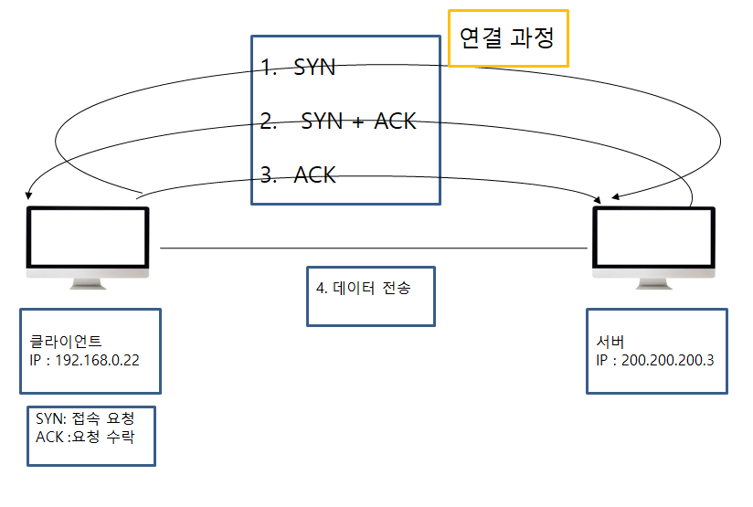

**각 단계 설명:**

1. **SYN (Synchronize):** 클라이언트가 서버에게 "연결하고 싶습니다"라고 요청
2. **SYN + ACK:** 서버가 "알겠습니다" + "저도 연결할게요"라고 응답
3. **ACK (Acknowledge):** 클라이언트가 "확인했습니다"라고 최종 확인

이 연결은 **논리적(가상) 연결**입니다. 물리적으로 전용 선이 생기는 게 아니라 서로 연결된 상태라는 사실을 인지하는 것입니다.

### 데이터 전달 보증과 순서 보장

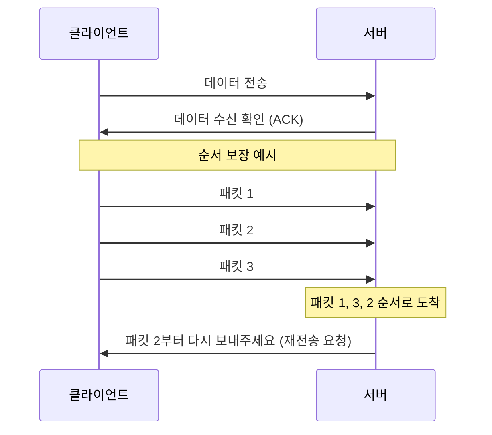
```mermaid
sequenceDiagram
    participant C as 클라이언트
    participant S as 서버

    C->>S: 데이터 전송
    S->>C: 데이터 수신 확인 (ACK)

    Note over C,S: 순서 보장 예시
    C->>S: 패킷 1
    C->>S: 패킷 2
    C->>S: 패킷 3
    Note over S: 패킷 1, 3, 2 순서로 도착
    S->>C: 패킷 2부터 다시 보내주세요 (재전송 요청)
```

---

## UDP (사용자 데이터그램 프로토콜)

### UDP의 특징

UDP는 TCP와 달리 **연결 수립 과정 없이** 데이터를 바로 전송합니다.

| 항목 | TCP | UDP |
|------|-----|-----|
| 연결 | 3-way handshake 필요 | 불필요 |
| 데이터 전달 보증 | O | X |
| 순서 보장 | O | X |
| 속도 | 느림 | 빠름 |
| 신뢰성 | 높음 | 낮음 |
| 용도 | HTTP, 파일 전송 | 스트리밍, 게임, DNS |

### UDP를 사용하는 이유

UDP는 기능이 적어 보이지만, 오히려 그것이 장점입니다:

- **속도가 빠릅니다:** handshake, ACK 과정이 없어 지연이 적음
- **커스터마이징 가능:** 애플리케이션 레벨에서 필요한 기능만 추가 가능
- **HTTP/3:** 최신 HTTP 버전은 UDP 기반의 QUIC 프로토콜을 사용

**UDP 활용 사례:**
- 실시간 화상통화 (일부 패킷 손실 허용)
- 온라인 게임 (속도가 중요)
- DNS 조회 (짧은 요청/응답)
- 스트리밍 서비스

---

## PORT (포트)

### PORT의 역할

하나의 PC에서 여러 서버와 동시에 통신할 때, IP만으로는 어떤 애플리케이션이 받아야 할 데이터인지 구분할 수 없습니다. **PORT**는 같은 IP 내에서 프로세스를 구분합니다.

**비유:** IP = 아파트 주소, PORT = 동/호수

```
내 PC (192.168.1.100)
├── :8080 → 게임 서버와 통신
├── :443  → 웹 브라우저(HTTPS)
└── :5000 → 개발 중인 앱
```

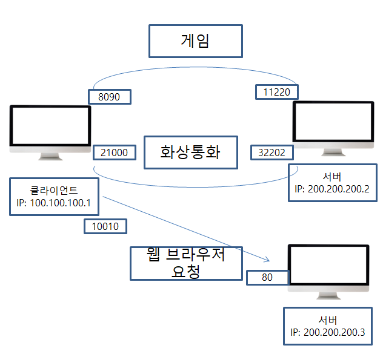

### 포트 번호 범위

| 범위 | 분류 | 설명 |
|------|------|------|
| 0 ~ 1023 | **잘 알려진 포트 (Well-known)** | 주요 서비스용, 임의 사용 비권장 |
| 1024 ~ 49151 | **등록된 포트 (Registered)** | 특정 서비스에 등록된 포트 |
| 49152 ~ 65535 | **동적/사설 포트** | 클라이언트가 임시로 사용 |

**주요 Well-known 포트:**

| 포트 | 프로토콜 | 서비스 |
|------|----------|--------|
| 20, 21 | TCP | FTP (파일 전송) |
| 22 | TCP | SSH (원격 접속) |
| 23 | TCP | Telnet |
| 25 | TCP | SMTP (이메일 발송) |
| 53 | UDP/TCP | DNS |
| 80 | TCP | HTTP |
| 443 | TCP | HTTPS |
| 3306 | TCP | MySQL |

---

## DNS (도메인 네임 시스템)

### DNS가 필요한 이유

IP 주소는 `142.250.196.68`처럼 외우기 어렵고, 서버를 이전하면 IP가 바뀌어도 클라이언트가 일일이 업데이트해야 합니다. DNS는 이 문제를 해결합니다.

**두 가지 문제:**
1. IP 주소는 기억하기 어렵다
2. IP 주소가 변경되면 접근 불가

### DNS 동작 원리

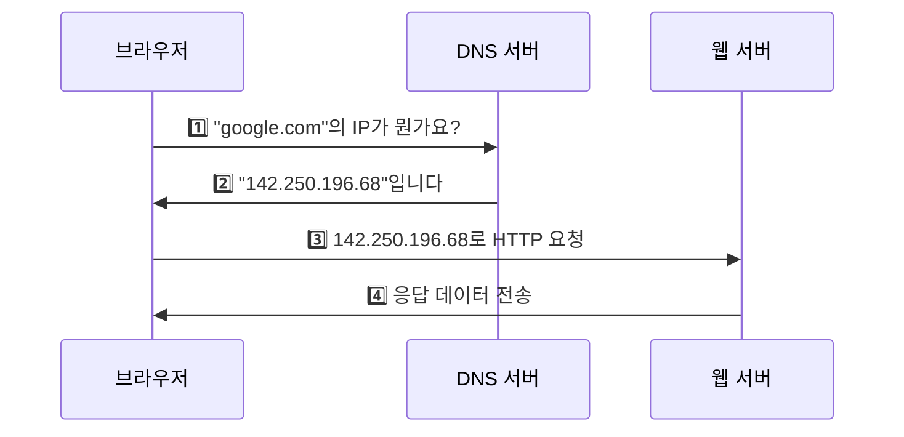
```mermaid
sequenceDiagram
    participant B as 브라우저
    participant D as DNS 서버
    participant S as 웹 서버

    B->>D: 1️⃣ "google.com"의 IP가 뭔가요?
    D->>B: 2️⃣ "142.250.196.68"입니다
    B->>S: 3️⃣ 142.250.196.68로 HTTP 요청
    S->>B: 4️⃣ 응답 데이터 전송
```

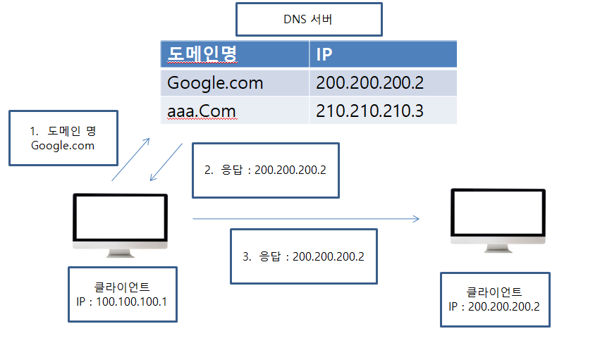

**DNS의 장점:**
- 도메인 이름(google.com)만 기억하면 됨
- 서버 IP가 바뀌어도 DNS 레코드만 업데이트하면 클라이언트는 영향 없음

---

## 전체 흐름 정리

웹 브라우저에서 `https://www.google.com`을 입력하면 다음과 같은 과정이 일어납니다:

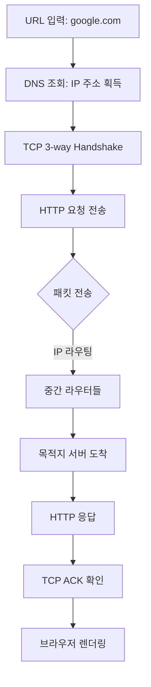
```mermaid
flowchart TD
    A["URL 입력: google.com"] --> B["DNS 조회: IP 주소 획득"]
    B --> C[TCP 3-way Handshake]
    C --> D["HTTP 요청 전송"]
    D --> E{"패킷 전송"}
    E -->|"IP 라우팅"| F["중간 라우터들"]
    F --> G["목적지 서버 도착"]
    G --> H["HTTP 응답"]
    H --> I["TCP ACK 확인"]
    I --> J["브라우저 렌더링"]
```

---

## 트래픽 시나리오

### 시나리오 1: 패킷 손실 발생

```
클라이언트 → 패킷1 전송 → 서버 (도착 O)
클라이언트 → 패킷2 전송 → [손실] → 서버 (도착 X)
클라이언트 → 패킷3 전송 → 서버 (도착 O)

서버 → 패킷2 재전송 요청 (ACK 번호로 어느 패킷인지 특정)
클라이언트 → 패킷2 재전송
```

TCP는 이처럼 **시퀀스 번호**와 **ACK**를 통해 손실된 패킷을 자동으로 재전송합니다.

### 시나리오 2: 포트 충돌

```
내 PC에서 동시에:
- Chrome이 포트 52341로 google.com:443 통신
- 게임이 포트 58892로 game-server.com:8080 통신

→ 서버 응답이 와도 포트 번호로 어느 앱인지 구분
→ 52341로 온 응답 → Chrome 전달
→ 58892로 온 응답 → 게임 전달
```

---

## 핵심 포인트 정리

| 개념 | 핵심 내용 |
|------|-----------|
| **IP** | 주소 기반 패킷 전달, 비연결·비신뢰·순서 미보장 |
| **TCP** | 3-way handshake, 전달 보증, 순서 보장, 신뢰성 |
| **UDP** | 빠르고 단순, 연결/보증/순서 없음, 커스터마이징 가능 |
| **PORT** | 같은 IP 내에서 프로세스 구분 (0~65535) |
| **DNS** | 도메인 이름을 IP 주소로 변환 |

- IP는 주소를 알아도 **신뢰할 수 없다** → TCP가 보완
- TCP는 신뢰성 있지만 **느릴 수 있다** → UDP로 대안
- PORT가 없으면 같은 IP에서 **여러 앱 구분 불가**
- DNS가 없으면 **IP 변경 시 전체 클라이언트 영향**
