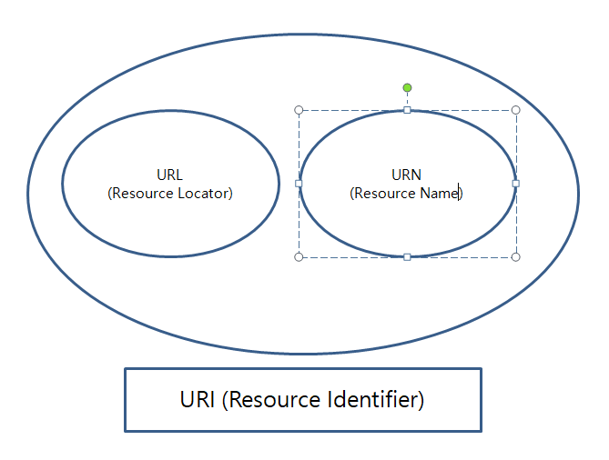
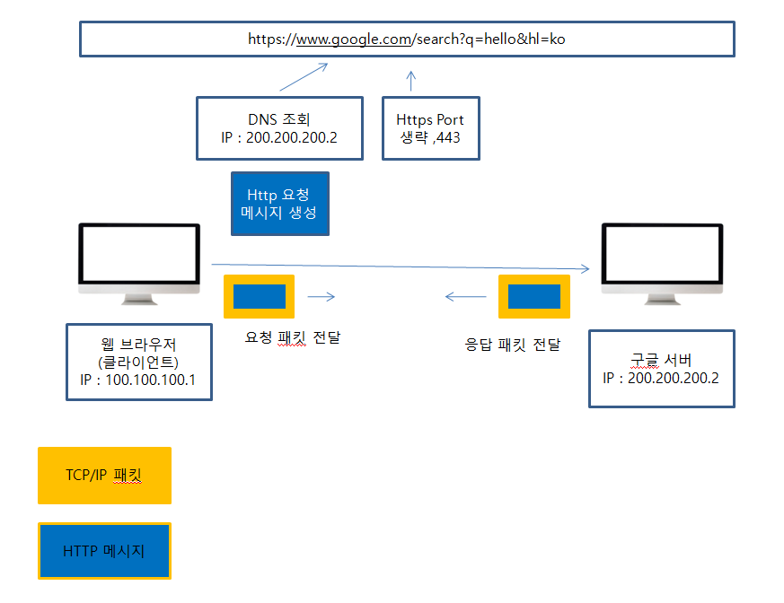

###### URI (Uniform Resource Identifier)

* Uniform : 리소스 식별하는 통일된 방식
* Resource : 자원, URI로 식별할 수 있는 모든 것
* Identifier : 다른 항목과 구분하는데 필요한 정보

대부분이 URI와 URL을 혼동하는것으로 알고 있다. (나도..)

URI는 로케이터(locatior), 이름(name) 또는 둘다 추가로 분류될 수 있다.

위 그림과 같이 URI가 좀 더 포괄적인 의미를 갖고 있다

* URL - Loction : 리소스가 있는 위치를 지정
* URN - Name : 리소스에 이름을 부여

[우리가 흔히 웹브라우저에 주소를 입력하는 것을 URL라고 한다]

거의 URL만 쓴다.. [URI를 URL과 같은 의미라고 봐도 무방하다]

###### 웹 브라우저 요청 흐름

