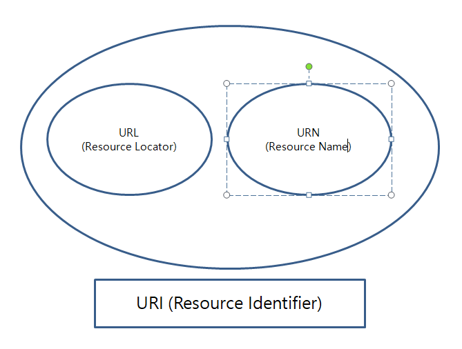
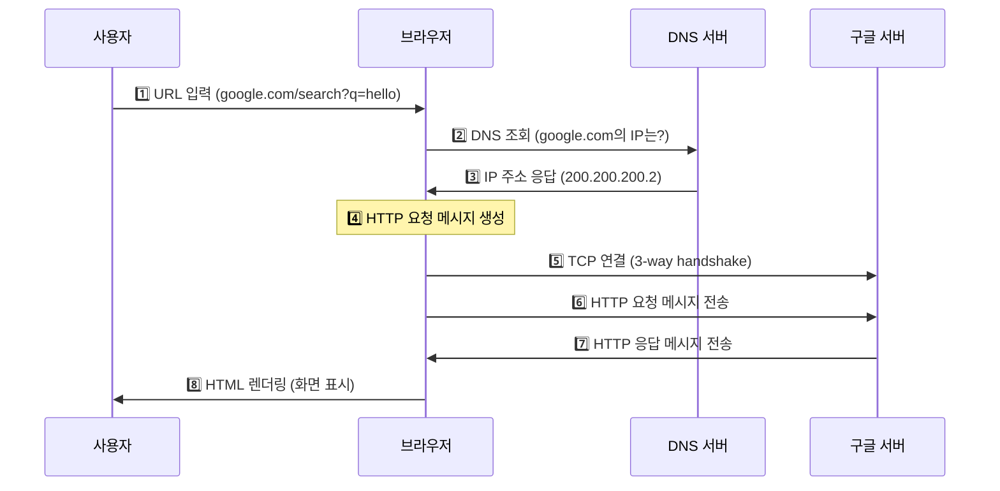
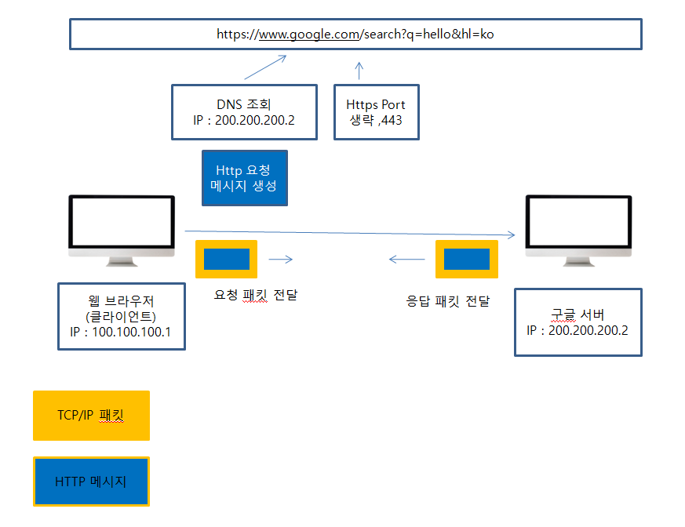
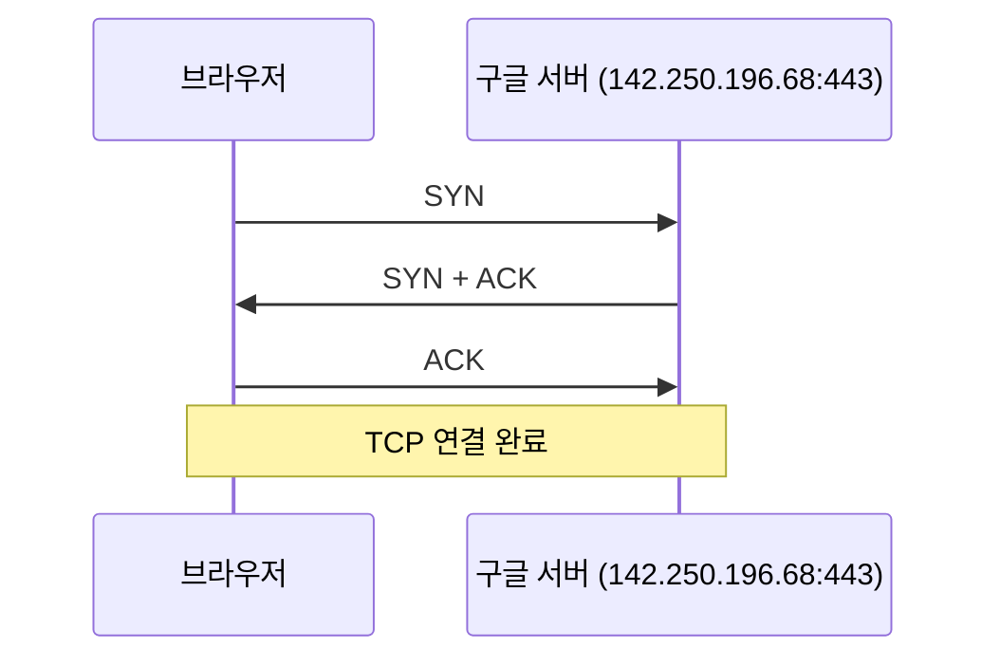

> **한 줄 요약:** URI는 인터넷 자원을 식별하는 가장 포괄적인 개념이며, URL은 그 하위 개념으로 자원의 위치를 나타낸다. 브라우저가 URL을 입력받아 서버에 응답을 받기까지의 전체 흐름을 이해하는 것이 중요하다.

## 비유로 이해하는 URI

도서관을 생각해 봅시다.

- **URI** = 책을 식별하는 모든 방법 (책 위치 or 책 이름)
- **URL** = 책이 있는 **위치** ("3층 B구역 5번 선반")
- **URN** = 책의 **고유 이름** (ISBN 번호)

우리가 도서관에서 책을 찾을 때는 보통 위치(URL)를 사용합니다. 책 이름(URN)만으로는 어디에 꽂혀 있는지 찾기 어렵기 때문입니다. 웹도 마찬가지로, 현실에서는 URL이 URI의 역할을 거의 대부분 담당합니다.

---

## URI (Uniform Resource Identifier)

### URI의 구성 요소

URI는 다음 세 단어의 조합입니다:

| 단어 | 의미 |
|------|------|
| **Uniform** | 리소스를 식별하는 **통일된** 방식 |
| **Resource** | URI로 식별할 수 있는 **모든 것** (웹 문서, 이미지, 영상 등) |
| **Identifier** | 다른 항목과 **구분**하는데 필요한 정보 |

### URI, URL, URN의 관계

```
URI (Uniform Resource Identifier)
├── URL (Uniform Resource Locator) — 위치로 식별
│       예) https://www.google.com/search?q=hello
└── URN (Uniform Resource Name)   — 이름으로 식별
        예) urn:isbn:8960777331
```



**핵심:** URI가 URL과 URN을 포함하는 더 넓은 개념입니다. 실무에서는 거의 URL만 사용하므로, URI = URL이라고 봐도 무방합니다.

### URL vs URN

| 구분 | URL | URN |
|------|-----|-----|
| 의미 | 자원의 **위치** | 자원의 **이름** |
| 예시 | `https://example.com/img.png` | `urn:isbn:0451450523` |
| 위치 변경 시 | URL 변경됨 | URN 불변 |
| 실사용 | 매우 빈번 | 거의 없음 |

URN은 자원의 위치가 변해도 이름이 바뀌지 않는 장점이 있지만, URN만으로 실제 자원을 찾아가는 방법이 보편화되지 않아 현실에서는 URL이 주로 쓰입니다.

---

## URL 상세 분석

### URL 전체 문법

```
scheme://[userinfo@]host[:port][/path][?query][#fragment]

예시:
https://www.google.com:443/search?q=hello&hl=ko#section1
  │           │          │    │        │            │
scheme      host        port  path    query      fragment
```

### 각 구성 요소 설명

#### scheme (스킴)
```
https://www.google.com/search
^^^^^
```
- 어떤 프로토콜을 사용할지 지정
- `http`, `https`, `ftp` 등
- https = http + 보안(TLS/SSL)

#### host (호스트)
```
https://www.google.com/search
        ^^^^^^^^^^^^^^
```
- 도메인 명 또는 IP 주소
- `www.google.com`, `192.168.1.1`

#### port (포트)
```
https://www.google.com:443/search
                       ^^^
```
- 생략 시 http=80, https=443이 기본값
- 일반적으로 URL에 포트를 명시하지 않음

#### path (경로)
```
https://www.google.com/search/result
                       ^^^^^^^^^^^^^
```
- 서버 내 자원의 경로
- 계층적 구조 (`/members/100/orders`)

#### query (쿼리 파라미터)
```
https://www.google.com/search?q=hello&hl=ko
                              ^^^^^^^^^^^^^^
```
- `?`로 시작, `key=value` 형식
- `&`으로 여러 파라미터 연결
- 문자열로 전달 (query parameter, query string이라고도 함)

#### fragment (프래그먼트)
```
https://docs.example.com/guide#installation
                               ^^^^^^^^^^^^^
```
- `#` 이후의 값
- 서버로 전송되지 않음
- HTML 내부 특정 위치(앵커)로 이동할 때 사용

---

## 웹 브라우저 요청 흐름

`https://www.google.com:443/search?q=hello`를 브라우저 주소창에 입력하면 어떤 일이 벌어질까요?

### 전체 흐름 다이어그램


```mermaid
sequenceDiagram
    participant U as 사용자
    participant B as 브라우저
    participant D as DNS 서버
    participant S as 구글 서버

    U->>B: 1️⃣ URL 입력 (google.com/search?q=hello)
    B->>D: 2️⃣ DNS 조회 (google.com의 IP는?)
    D->>B: 3️⃣ IP 주소 응답 (200.200.200.2)
    Note over B: 4️⃣ HTTP 요청 메시지 생성
    B->>S: 5️⃣ TCP 연결 (3-way handshake)
    B->>S: 6️⃣ HTTP 요청 메시지 전송
    S->>B: 7️⃣ HTTP 응답 메시지 전송
    B->>U: 8️⃣ HTML 렌더링 (화면 표시)
```



### 단계별 상세 설명

#### 1단계: URL 파싱

브라우저가 입력된 URL을 분석합니다:

```
https://www.google.com:443/search?q=hello
→ scheme: https
→ host: www.google.com
→ port: 443
→ path: /search
→ query: q=hello
```

#### 2단계: DNS 조회

```
브라우저 캐시 확인 → OS 캐시 확인 → DNS 서버 조회

www.google.com → 142.250.196.68 (예시)
```

DNS 조회 순서:
1. 브라우저 캐시 (이전에 방문한 적 있으면 바로 사용)
2. OS 캐시 (`hosts` 파일 포함)
3. 공유기/ISP DNS 캐시
4. 루트 DNS → TLD DNS → 권한 DNS 순으로 조회

#### 3단계: HTTP 요청 메시지 생성

브라우저가 HTTP 요청 메시지를 만듭니다:

```http
GET /search?q=hello HTTP/1.1
Host: www.google.com
User-Agent: Mozilla/5.0 (Windows NT 10.0; Win64; x64) ...
Accept: text/html,application/xhtml+xml,...
Accept-Language: ko-KR,ko;q=0.9
Accept-Encoding: gzip, deflate, br
Connection: keep-alive
```

#### 4단계: TCP 연결 수립


```mermaid
sequenceDiagram
    participant B as 브라우저
    participant S as 구글 서버 (142.250.196.68:443)

    B->>S: SYN
    S->>B: SYN + ACK
    B->>S: ACK
    Note over B,S: TCP 연결 완료
```

#### 5단계: 패킷 전송

HTTP 요청 메시지는 TCP 세그먼트에 담기고, IP 패킷으로 캡슐화되어 전송됩니다:

```
┌─────────────────────────────────────────┐
│ IP 헤더 (출발지 IP: 내 IP, 목적지: 구글)  │
├─────────────────────────────────────────┤
│ TCP 헤더 (출발지 PORT: 임시, 목적지: 443) │
├─────────────────────────────────────────┤
│ HTTP 메시지 (GET /search?q=hello ...)   │
└─────────────────────────────────────────┘
```

#### 6단계: 서버 응답

구글 서버가 요청을 받아 처리하고 응답 메시지를 보냅니다:

```http
HTTP/1.1 200 OK
Content-Type: text/html; charset=UTF-8
Content-Length: 3423

<html>
  <head>...</head>
  <body>검색 결과...</body>
</html>
```

#### 7단계: 브라우저 렌더링

브라우저가 받은 HTML을 파싱하여 화면에 그립니다. 추가로 필요한 CSS, JS, 이미지 파일은 각각 새로운 HTTP 요청을 보냅니다.

---

## 트래픽 시나리오

### 시나리오: 쿼리 파라미터 활용

검색창에 "안녕 세계"를 입력했을 때:

```
입력: 안녕 세계
URL 인코딩 후: https://www.google.com/search?q=%EC%95%88%EB%85%95+%EC%84%B8%EA%B3%84

→ 한글은 URL에서 퍼센트 인코딩(%XX)으로 변환됨
→ 공백은 + 또는 %20으로 변환됨
```

### 시나리오: 프래그먼트 이동

```
URL: https://docs.example.com/guide#installation

1. 브라우저가 서버에 GET /guide 요청
2. 서버는 #installation을 모름 (서버에는 전달 안 됨)
3. 브라우저가 HTML 받은 후
4. id="installation"인 요소를 찾아 스크롤 이동
```

---

## 핵심 포인트 정리

| 개념 | 핵심 내용 |
|------|-----------|
| **URI** | 자원을 식별하는 모든 방법의 총칭 |
| **URL** | 자원의 위치로 식별 (실무에서 URI = URL) |
| **URN** | 자원의 이름으로 식별 (거의 미사용) |
| **query** | `?key=value` 형식, 서버에 전달되는 파라미터 |
| **fragment** | `#section` 형식, 서버에 전달 안 됨, 브라우저 내부 이동 |

- URL 입력 → DNS 조회 → TCP 연결 → HTTP 요청 → HTTP 응답 → 렌더링의 순서
- 포트 생략 시 http=80, https=443이 기본값
- 쿼리 파라미터는 서버에 전달되지만, fragment는 브라우저에서만 사용
