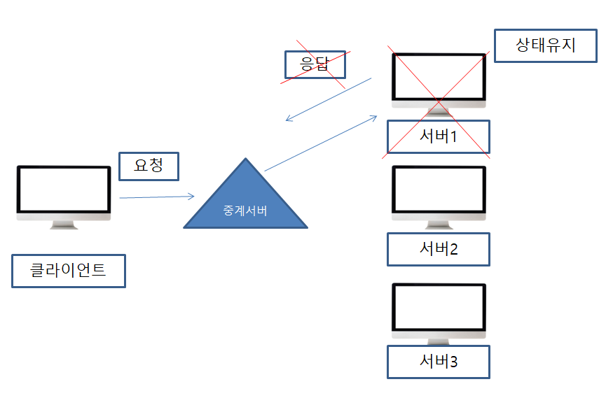
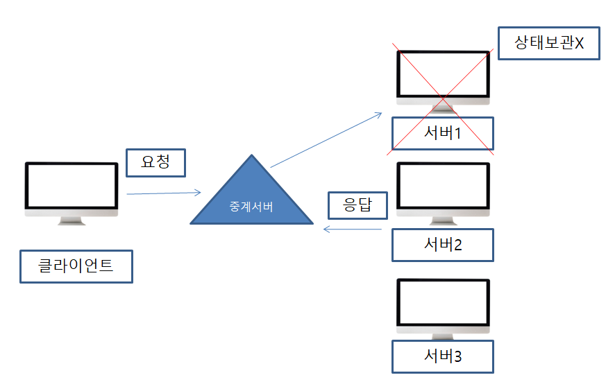
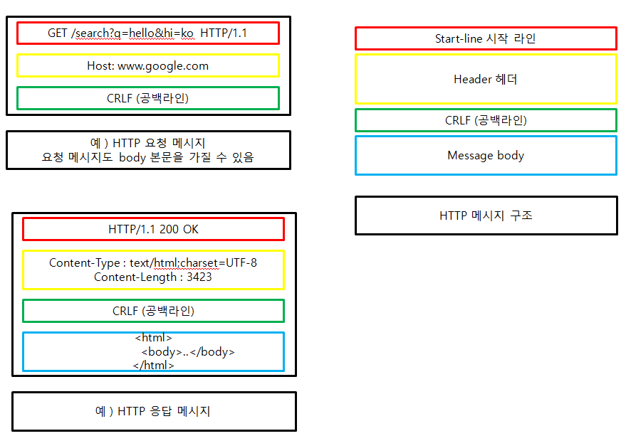

###### HTTP (HyperText Transfer Protocol)

HTTP는 W3 상에서 정보를 주고받을 수 있는 프로토콜이다. 주로 HTML 문서를 주고받는 데에 쓰인다. 주로 TCP를 사용하고 HTTP/3 부터는 UDP를 사용하며, 80번 포트를 사용한다.  [구글 정의]

###### HTTP 특징

* 클라이언트 서버 구조

  * Request Reponse 구조
  * 클라이언트는 서버에 요청을 보내고 응답을 대기
  * 서버가 요청에 대한 결과를 만들어서 응답

* 무상태 프로토콜(Stateless), 비연결성

  상태 유지 (Stateful)

  ​        항상 같은 서버가 유지되어야 한다. [ 만약 통신 중인 서버가 죽는다면 응답을 받지 못한다.]

​		

​		무상태 (Stateless) 

​		스케일 아웃 (Scale out) - 수평확장에 유리하다.

​     	비연결성

​	   	  HTTP는 기본이 연결을 유지하지 않는 모델

​			일반적으로 초 단위 이하의 빠른 속도로 응답

 	   	서버 자원을 효율적으로 사용

* HTTP 메시지

  * HTML, TEXT

  * IMAGE, 음성, 영상, 파일

  * JSON, XML

  * 거의 모든 형태의 데이터 전송 가능

  * 서버간에 데이터를주고 받을 때도 대부분 HTTP 사용

  * 메시지 구조

    

* 단순함, 확장 가능