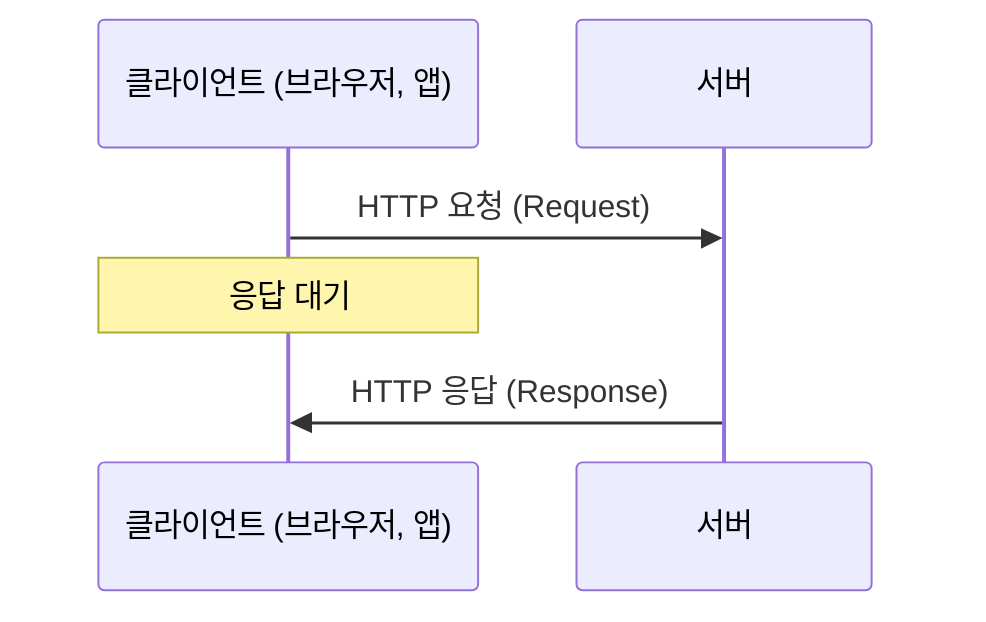
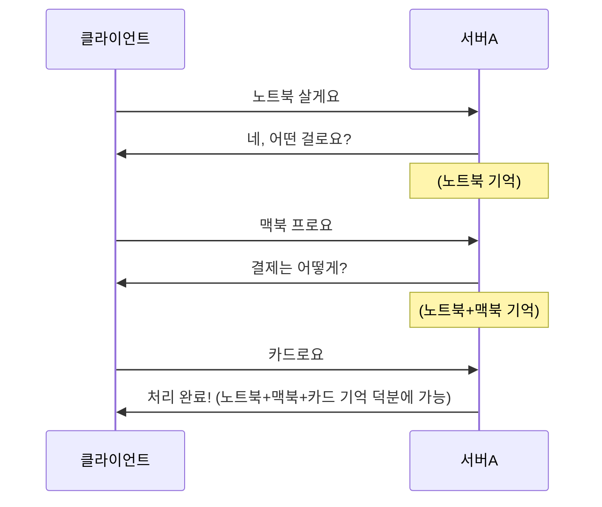
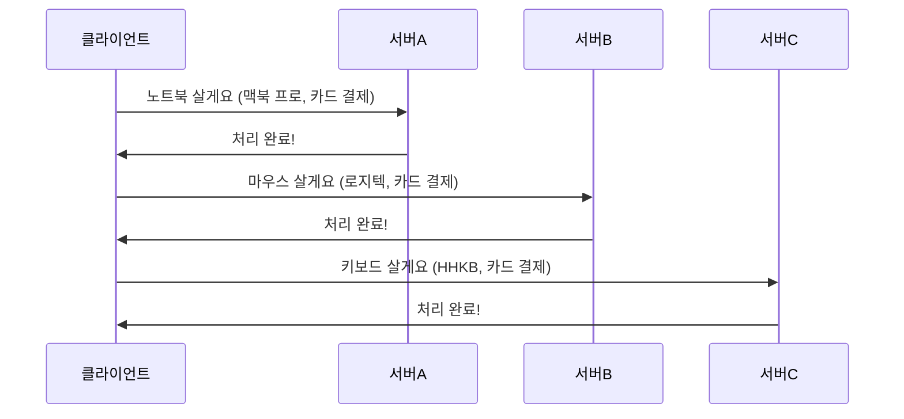
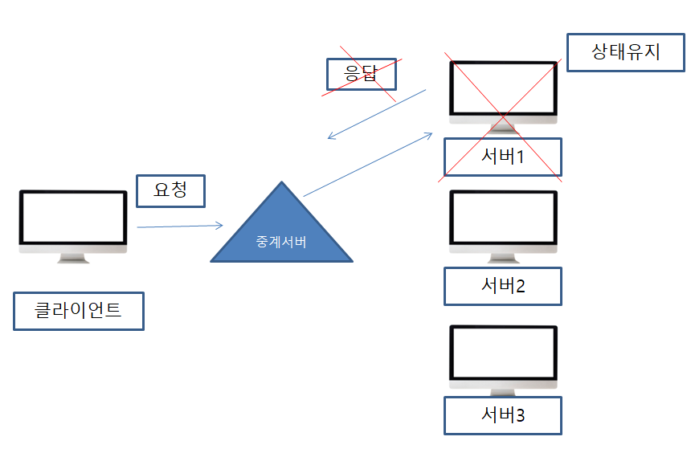
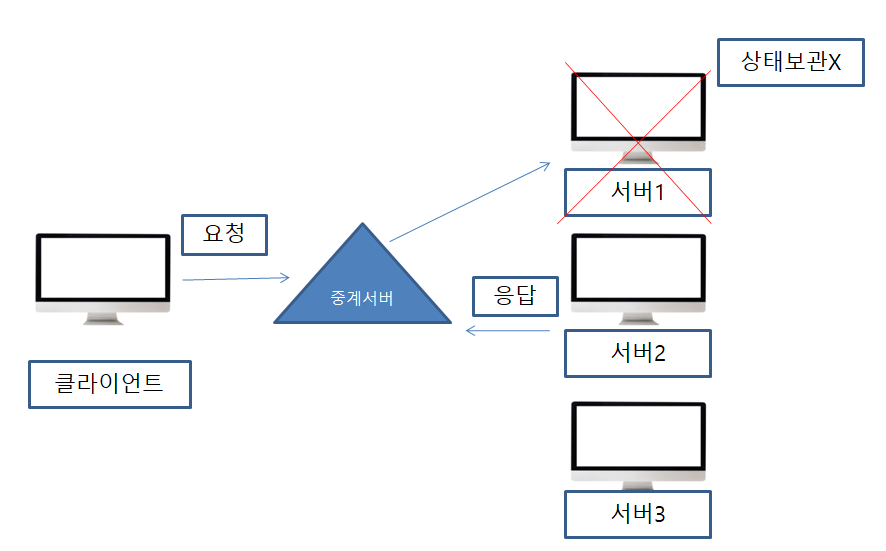
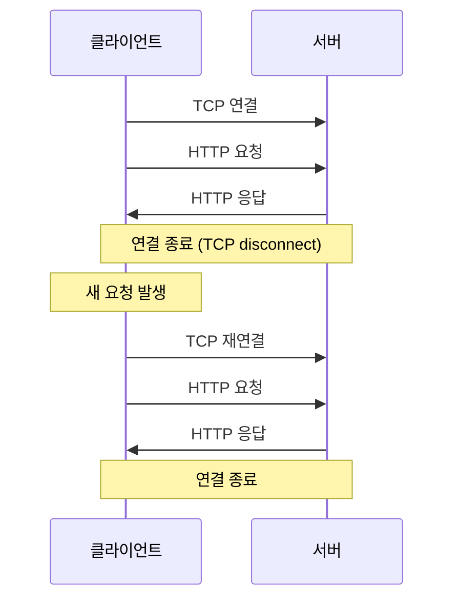
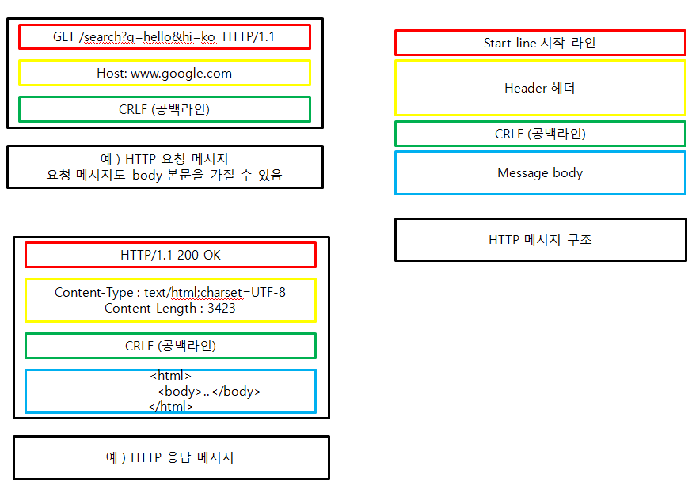

> **한 줄 요약:** HTTP는 클라이언트-서버 구조에서 동작하는 무상태(Stateless), 비연결성 프로토콜로, 거의 모든 형태의 데이터를 전송할 수 있는 단순하고 확장 가능한 프로토콜이다.

## 비유로 이해하는 HTTP

HTTP를 **식당의 주문 시스템**에 비유해 봅시다.

- **클라이언트** = 손님 (요청하는 쪽)
- **서버** = 주방 (요청을 처리하는 쪽)
- **HTTP 요청** = 주문서 ("치킨 버거 하나 주세요")
- **HTTP 응답** = 음식 서빙 ("치킨 버거 나왔습니다")
- **Stateless** = 웨이터가 손님을 기억하지 못하는 무인 주문 키오스크

Stateless 식당에서는 매번 주문할 때마다 "저 아까 치킨 버거 먹었던 사람인데요"라고 말해도 키오스크는 기억하지 못합니다. 매 주문이 완전히 독립적입니다. 불편해 보이지만, 덕분에 어떤 키오스크에서든 주문이 가능하고 키오스크를 무한히 늘릴 수 있습니다.

---

## HTTP란?

HTTP(HyperText Transfer Protocol)는 웹에서 데이터를 주고받기 위한 프로토콜입니다.

### HTTP의 역사

| 버전 | 특징 |
|------|------|
| **HTTP/0.9** (1991) | GET 메서드만 지원, HTML만 전송 |
| **HTTP/1.0** (1996) | 메서드, 헤더 추가, 버전 정보 추가 |
| **HTTP/1.1** (1997) | 현재 가장 많이 사용, 커넥션 재사용(keep-alive), 파이프라이닝 |
| **HTTP/2** (2015) | 성능 개선, 헤더 압축, 멀티플렉싱 |
| **HTTP/3** (진행 중) | TCP 대신 UDP 기반 QUIC 사용, 더 빠른 연결 |

### 전송 가능한 데이터

HTTP는 사실상 **모든 형태**의 데이터를 전송할 수 있습니다:

```
텍스트   → HTML, TEXT, JSON, XML
미디어   → 이미지(PNG, JPG), 음성(MP3), 영상(MP4)
파일     → PDF, 압축파일, 바이너리 데이터
서버 간  → API 통신, 마이크로서비스 간 데이터 교환
```

---

## HTTP 특징 1: 클라이언트-서버 구조

### 구조 설명

HTTP는 **요청(Request)-응답(Response)** 구조로 동작합니다.


```mermaid
sequenceDiagram
    participant C as 클라이언트 (브라우저, 앱)
    participant S as 서버

    C->>S: HTTP 요청 (Request)
    Note over C: 응답 대기
    S->>C: HTTP 응답 (Response)
```

- 클라이언트는 서버에 요청을 보내고 **응답을 기다립니다**
- 서버는 요청을 처리하고 **결과를 응답**합니다
- 서버가 먼저 클라이언트에게 데이터를 보내는 것은 기본 HTTP에서는 불가능

### 클라이언트-서버 분리의 장점

```
클라이언트 역할: UI, 사용자 인터페이스 담당
서버 역할:      비즈니스 로직, 데이터 담당
```

분리함으로써 얻는 이점:
- **독립적 진화:** 클라이언트와 서버를 각각 독립적으로 개발/배포
- **확장성:** 트래픽 증가 시 서버만 증설
- **전문화:** 클라이언트는 UI에, 서버는 성능에 집중

---

## HTTP 특징 2: 무상태 프로토콜 (Stateless)

### Stateful vs Stateless 비교

#### Stateful (상태 유지) 방식


```mermaid
sequenceDiagram
    participant C as 클라이언트
    participant S as 서버A

    C->>S: 노트북 살게요
    S->>C: 네, 어떤 걸로요?
    Note over S: (노트북 기억)
    C->>S: 맥북 프로요
    S->>C: 결제는 어떻게?
    Note over S: (노트북+맥북 기억)
    C->>S: 카드로요
    S->>C: 처리 완료! (노트북+맥북+카드 기억 덕분에 가능)
```

서버가 이전 상태를 **기억**합니다. 서버가 죽으면 상태가 사라지므로 **항상 같은 서버**와 통신해야 합니다.

#### Stateless (무상태) 방식


```mermaid
sequenceDiagram
    participant C as 클라이언트
    participant S1 as 서버A
    participant S2 as 서버B
    participant S3 as 서버C

    C->>S1: 노트북 살게요 (맥북 프로, 카드 결제)
    S1->>C: 처리 완료!
    C->>S2: 마우스 살게요 (로지텍, 카드 결제)
    S2->>C: 처리 완료!
    C->>S3: 키보드 살게요 (HHKB, 카드 결제)
    S3->>C: 처리 완료!
```

각 요청에 **필요한 정보를 모두 포함**해서 전송합니다. 서버가 상태를 기억하지 않아도 되므로 **어떤 서버와도** 통신 가능합니다.





### Stateless의 장단점

| 항목 | Stateless | Stateful |
|------|-----------|----------|
| **수평 확장 (Scale-out)** | 쉬움 (어떤 서버든 OK) | 어려움 (같은 서버 유지 필요) |
| **서버 장애 대응** | 유연 (다른 서버로 전환) | 취약 (상태 데이터 손실) |
| **요청 데이터 크기** | 큼 (매번 모든 정보 포함) | 작음 (이전 상태 활용) |
| **로드밸런싱** | 자유롭게 분산 가능 | 세션 친화성 필요 |

### Stateless의 한계와 극복

로그인처럼 **상태를 반드시 유지해야 하는 경우**에는 Stateless만으로는 해결이 어렵습니다.

**극복 방법:**
- **쿠키 + 세션:** 서버에 세션 저장, 클라이언트에 세션 ID 쿠키 전달
- **JWT (JSON Web Token):** 토큰에 사용자 정보를 담아 클라이언트가 보관
- **Redis 등 공유 저장소:** 여러 서버가 공유하는 세션 저장소

---

## HTTP 특징 3: 비연결성 (Connectionless)

### 비연결성이란?

HTTP는 기본적으로 요청-응답을 한 번 완료하면 **연결을 끊습니다**.


```mermaid
sequenceDiagram
    participant C as 클라이언트
    participant S as 서버

    C->>S: TCP 연결
    C->>S: HTTP 요청
    S->>C: HTTP 응답
    Note over C,S: 연결 종료 (TCP disconnect)

    Note over C: 새 요청 발생
    C->>S: TCP 재연결
    C->>S: HTTP 요청
    S->>C: HTTP 응답
    Note over C,S: 연결 종료
```

### 비연결성의 장점

- **서버 자원 효율:** 연결을 계속 유지하지 않으므로 서버 부하 감소
- **많은 클라이언트 수용:** 1시간 동안 수천 명이 사용해도 실제 동시 연결은 소수

일반적으로 HTTP 응답 속도는 **초 단위 이하**로 매우 빠릅니다. 연결을 유지하는 시간보다 끊고 기다리는 시간이 훨씬 깁니다.

### HTTP Keep-Alive: 비연결성의 단점 보완

매번 TCP 연결(3-way handshake)을 새로 맺으면 비용이 발생합니다. **HTTP/1.1부터는 기본적으로 Keep-Alive**를 사용해 연결을 재사용합니다.

```mermaid
sequenceDiagram
    participant C as 클라이언트
    participant S as 서버

    subgraph "Keep-Alive 연결 재사용"
        C->>S: TCP 연결
        C->>S: GET /index.html
        S->>C: 200 OK (HTML)
        C->>S: GET /style.css
        S->>C: 200 OK (CSS)
        C->>S: GET /image.png
        S->>C: 200 OK (이미지)
        Note over C,S: 연결 종료
    end
```

**기존 방식 vs Keep-Alive:**

```
기존: TCP연결 → 요청 → 응답 → TCP종료 → TCP연결 → 요청 → 응답 → TCP종료
K-A:  TCP연결 → 요청 → 응답 → 요청 → 응답 → 요청 → 응답 → TCP종료
```

---

## HTTP 메시지 구조

### 요청 메시지 구조

```
GET /search?q=hello HTTP/1.1       ← 시작 라인 (요청 라인)
Host: www.google.com               ← 헤더 시작
User-Agent: Mozilla/5.0
Accept: text/html
Accept-Language: ko
                                   ← 공백 라인 (헤더와 바디 구분)
                                   ← 바디 (GET은 보통 없음)
```



### 응답 메시지 구조

```
HTTP/1.1 200 OK                    ← 시작 라인 (상태 라인)
Content-Type: text/html; charset=UTF-8  ← 헤더 시작
Content-Length: 3423
Date: Mon, 27 Mar 2023 10:00:00 GMT
                                   ← 공백 라인
<html>                             ← 바디 시작
  <body>Hello World</body>
</html>
```

### 메시지 구조 상세

| 구성 요소 | 요청 | 응답 |
|----------|------|------|
| **시작 라인** | `메서드 경로 버전` | `버전 상태코드 상태문구` |
| **헤더** | Host, User-Agent, Accept 등 | Content-Type, Content-Length 등 |
| **공백 라인** | 헤더와 바디 구분 (필수) | 헤더와 바디 구분 (필수) |
| **바디** | POST/PUT 요청 본문 | 응답 데이터 (HTML, JSON 등) |

### HTTP 헤더의 역할

헤더는 HTTP 전송에 필요한 **모든 부가 정보**를 담습니다:

```
요청 헤더:
Host: www.example.com         → 어떤 서버로 보낼지
User-Agent: Chrome/100        → 어떤 브라우저인지
Accept: text/html             → 어떤 형식을 원하는지
Authorization: Bearer token   → 인증 정보

응답 헤더:
Content-Type: application/json  → 응답 데이터 형식
Content-Length: 256             → 응답 크기
Cache-Control: max-age=3600     → 캐시 정책
Set-Cookie: sessionId=abc123    → 쿠키 설정
```

---

## 트래픽 시나리오

### 시나리오 1: 대규모 트래픽 대응 (Stateless의 힘)

```
상황: 이벤트 페이지에 갑자기 10만 명 접속

Stateless 구조:
→ 서버 10대 추가 (Scale-out)
→ 모든 서버가 동등하게 요청 처리
→ 로드밸런서가 요청 분산
→ OK!

Stateful 구조:
→ 세션이 특정 서버에 묶여 있음
→ 서버 추가해도 세션 이전 문제 발생
→ sticky session 설정 필요 → 복잡
```

### 시나리오 2: HTTP/1.1 Keep-Alive 효과

```
웹 페이지 로딩 시 필요한 파일:
- index.html (1개)
- style.css (1개)
- script.js (3개)
- image.png (5개)
→ 총 10개 파일

HTTP/1.0 (비연결):
→ 10번 TCP 연결/해제 반복
→ handshake 비용 × 10

HTTP/1.1 (Keep-Alive):
→ TCP 연결 1번으로 10개 요청 처리
→ 훨씬 빠른 페이지 로딩
```

---

## HTTP의 단순함과 확장성

### 단순함

HTTP 메시지 자체는 텍스트로 이루어져 있어 사람이 읽을 수 있습니다:

```bash
# curl로 직접 HTTP 요청 보내기
curl -v https://www.google.com

# 출력 예시:
> GET / HTTP/1.1
> Host: www.google.com
> User-Agent: curl/7.84.0
>
< HTTP/1.1 200 OK
< Content-Type: text/html; charset=ISO-8859-1
< ...
```

### 확장성

HTTP 헤더를 자유롭게 추가할 수 있어 다양한 기능을 확장할 수 있습니다:

```
표준 헤더 + 커스텀 헤더 모두 가능:
X-Request-ID: req-12345        → 커스텀 요청 추적 ID
X-Forwarded-For: 123.45.67.89  → 프록시 통과 시 원본 IP
X-API-Version: 2.0             → API 버전 관리
```

---

## 핵심 포인트 정리

| 특징 | 핵심 내용 |
|------|-----------|
| **클라이언트-서버** | 요청-응답 구조, UI와 비즈니스 로직 분리 |
| **Stateless** | 서버가 상태를 저장하지 않음, 수평 확장 용이 |
| **비연결성** | 요청-응답 후 연결 종료, 자원 효율적 사용 |
| **Keep-Alive** | HTTP/1.1의 연결 재사용으로 비연결성 단점 보완 |
| **메시지 구조** | 시작라인 + 헤더 + 공백라인 + 바디 |

- Stateless는 **Scale-out(수평 확장)**의 핵심 조건
- 로그인 등 상태 유지가 필요하면 **쿠키/세션/JWT**로 해결
- HTTP 메시지는 **텍스트 기반**이라 단순하고 확장하기 쉬움
- HTTP/1.1의 Keep-Alive, HTTP/2의 멀티플렉싱으로 성능 계속 개선 중
