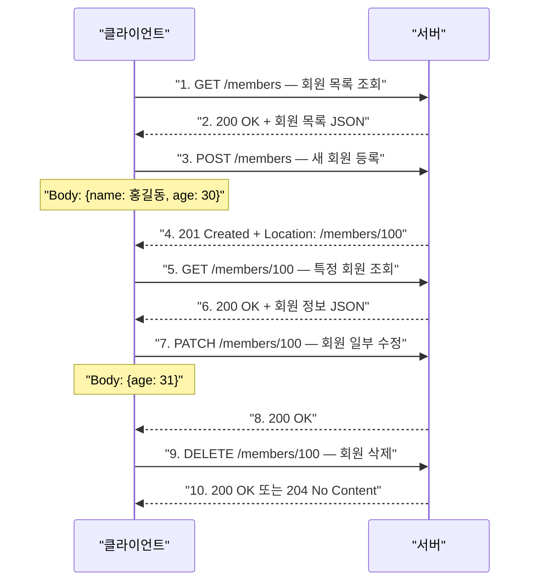

> **한 줄 요약:** 좋은 API URI 설계는 리소스(명사)를 식별하는 데 집중하고, 행위(조회/등록/수정/삭제)는 HTTP 메서드로 표현한다.

## 비유로 이해하는 URI와 HTTP 메서드

**도서관**을 생각해보자.

- **URI** = 책의 위치 정보 (예: "3층 > 컴퓨터공학 > 자바 > 312번 책")
- **HTTP 메서드** = 도서관에서 하는 행위 (책을 빌린다, 반납한다, 새 책을 등록한다)

책의 위치(URI)에 행위("빌리기", "반납하기")를 섞으면 위치 체계가 복잡해진다. 위치는 위치답게, 행위는 행위답게 분리하는 것이 좋은 설계다.

---

## API URI 설계 원칙

### 나쁜 URI 설계 예시

```
GET  /read-member-list       ← 행위(read)가 URI에 포함
POST /create-member          ← 행위(create)가 URI에 포함
PUT  /update-member          ← 행위(update)가 URI에 포함
DELETE /delete-member        ← 행위(delete)가 URI에 포함
```

URI에 행위 동사가 들어가면 문제가 생긴다. "수정하면서 조회도 해야 하면?" 같은 상황에서 URI가 폭발적으로 늘어난다.

### 좋은 URI 설계 — 리소스 중심

```
GET    /members              ← 회원 목록 조회
GET    /members/{id}         ← 특정 회원 조회
POST   /members              ← 회원 등록
PUT    /members/{id}         ← 회원 전체 수정
PATCH  /members/{id}         ← 회원 일부 수정
DELETE /members/{id}         ← 회원 삭제
```

**핵심 원칙:**
- URI는 **리소스(명사)** 만 식별한다
- **행위(동사)** 는 HTTP 메서드로 표현한다
- 리소스는 **복수형 명사**로 표현한다 (`/members`, `/orders`)

---

## URI 설계 흐름



---

## HTTP 메서드 상세

### GET — 리소스 조회

```http
GET /members/100 HTTP/1.1
Host: api.example.com
Accept: application/json
```

- 서버에서 리소스를 **조회**할 때 사용한다
- 데이터를 전달할 때는 **쿼리 파라미터(Query String)** 를 사용한다
- 메시지 바디에 데이터를 담는 것은 지원하지 않는 서버가 많아 권장하지 않는다

```bash
# 쿼리 파라미터로 검색 조건 전달
curl "https://api.example.com/members?age=30&city=서울"
```

---

### POST — 데이터 처리 (주로 등록)

```http
POST /members HTTP/1.1
Host: api.example.com
Content-Type: application/json

{
  "name": "홍길동",
  "age": 30
}
```

- **메시지 바디**를 통해 서버에 데이터를 전달한다
- 주로 새 리소스 **등록**에 사용하지만, 범용적으로 "요청 데이터 처리"에 쓸 수 있다
- 다른 메서드로 처리하기 애매한 경우 POST를 사용한다

**POST의 다양한 활용:**
```
POST /orders                  ← 주문 생성
POST /members/100/follow      ← 팔로우 (프로세스 처리)
POST /payment/validate        ← 결제 검증 (복잡한 쿼리 → POST)
```

---

### PUT — 리소스 전체 교체

```http
PUT /members/100 HTTP/1.1
Host: api.example.com
Content-Type: application/json

{
  "name": "홍길동",
  "age": 31
}
```

- 클라이언트가 **리소스의 전체 내용을 알고 URI를 직접 지정**한다 (POST와의 차이점)
- 해당 URI에 리소스가 **없으면 생성**, **있으면 전체 교체**한다
- **일부 필드만 보내면 나머지 필드가 삭제**된다

```
기존: { "name": "홍길동", "age": 30, "city": "서울" }
PUT:  { "name": "홍길동", "age": 31 }
결과: { "name": "홍길동", "age": 31 }  ← city 필드 삭제됨!
```

---

### PATCH — 리소스 부분 수정

```http
PATCH /members/100 HTTP/1.1
Host: api.example.com
Content-Type: application/json

{
  "age": 31
}
```

- 리소스의 **일부 필드만 수정**한다
- 보내지 않은 필드는 그대로 유지된다

```
기존: { "name": "홍길동", "age": 30, "city": "서울" }
PATCH: { "age": 31 }
결과: { "name": "홍길동", "age": 31, "city": "서울" }  ← city 유지
```

---

### DELETE — 리소스 삭제

```http
DELETE /members/100 HTTP/1.1
Host: api.example.com
```

- 리소스를 **삭제**한다
- 성공 시 `200 OK` 또는 `204 No Content`를 반환한다

---

## HTTP 메서드 속성 비교

### 안전성 (Safe)

호출해도 리소스를 **변경하지 않는** 메서드를 안전하다고 한다.

| 메서드 | 안전 여부 | 이유 |
|--------|---------|------|
| GET | O | 리소스 조회만 함 |
| HEAD | O | 헤더만 조회 |
| POST | X | 리소스 생성/변경 |
| PUT | X | 리소스 교체 |
| PATCH | X | 리소스 수정 |
| DELETE | X | 리소스 삭제 |

### 멱등성 (Idempotent)

**동일한 요청을 여러 번 보내도 결과가 같은** 메서드를 멱등하다고 한다.

| 메서드 | 멱등 여부 | 이유 |
|--------|---------|------|
| GET | O | 같은 데이터를 100번 조회해도 결과 동일 |
| PUT | O | 같은 내용으로 100번 교체해도 최종 결과 동일 |
| DELETE | O | 이미 삭제된 리소스를 다시 삭제해도 결과 동일 |
| POST | X | 두 번 호출하면 같은 주문이 2개 생성될 수 있음 |
| PATCH | 조건부 | `{ age: 31 }` 방식은 멱등, `{ age: +1 }` 방식은 비멱등 |

**멱등성의 실무 활용:**
- 서버가 타임아웃으로 응답을 못 줬을 때, 클라이언트가 **재요청해도 되는지 판단**하는 근거
- GET, PUT, DELETE는 재요청 가능. POST는 중복 처리 주의

### 캐시 가능성 (Cacheable)

| 메서드 | 캐시 가능 여부 |
|--------|-------------|
| GET | O (실무에서 주로 사용) |
| HEAD | O |
| POST | 이론상 가능, 실무에서는 거의 미사용 |
| PUT, PATCH, DELETE | X |

---

## 클라이언트에서 서버로 데이터 전송

### 방식 1: 쿼리 파라미터

```bash
# 정렬, 필터, 검색어 전달에 주로 사용
GET /members?age=30&city=서울&sort=name
```

### 방식 2: 메시지 바디 (application/json)

```bash
curl -X POST https://api.example.com/members \
  -H "Content-Type: application/json" \
  -d '{"name":"홍길동","age":30}'
```

### 방식 3: HTML Form 데이터

```http
POST /members HTTP/1.1
Content-Type: application/x-www-form-urlencoded

name=%ED%99%8D%EA%B8%B8%EB%8F%99&age=30
```

### 방식 4: 파일 업로드 (multipart)

```http
POST /upload HTTP/1.1
Content-Type: multipart/form-data; boundary=----boundary

----boundary
Content-Disposition: form-data; name="name"

홍길동
----boundary
Content-Disposition: form-data; name="file"; filename="photo.jpg"
Content-Type: image/jpeg

(바이너리 데이터)
```

---

## HTTP API 설계 패턴

### 컬렉션(Collection) 기반 — POST 등록

서버가 리소스 URI를 생성하고 관리한다.

```
GET    /members          회원 목록 조회
POST   /members          회원 등록 → 서버가 /members/100 URI 생성
GET    /members/{id}     특정 회원 조회
PATCH  /members/{id}     회원 수정
DELETE /members/{id}     회원 삭제
```

### 스토어(Store) 기반 — PUT 등록

클라이언트가 리소스 URI를 알고 직접 지정한다.

```
GET    /files            파일 목록
GET    /files/{filename} 파일 조회
PUT    /files/{filename} 파일 업로드 (URI 클라이언트가 지정)
DELETE /files/{filename} 파일 삭제
```

### 컨트롤 URI — 동사 사용 (불가피한 경우)

HTTP 메서드로 표현하기 어려운 행위는 동사 URI를 허용한다.

```
POST /members/{id}/follow     팔로우 처리
POST /orders/{id}/cancel      주문 취소
POST /members/{id}/change-password  비밀번호 변경
```

---

## 핵심 포인트 정리

| 메서드 | 용도 | 멱등 | 안전 |
|--------|------|:----:|:----:|
| GET | 리소스 조회 | O | O |
| POST | 데이터 처리, 등록 | X | X |
| PUT | 리소스 전체 교체 | O | X |
| PATCH | 리소스 부분 수정 | 조건부 | X |
| DELETE | 리소스 삭제 | O | X |

- URI는 **명사(리소스)**로, 행위는 **HTTP 메서드(동사)**로 표현한다
- PUT은 **전체 교체**이므로 일부 필드만 보내면 나머지가 삭제된다. 부분 수정은 PATCH를 사용한다
- **멱등성**은 네트워크 오류 시 재요청 가능 여부를 판단하는 중요한 기준이다
- POST는 다른 메서드로 처리하기 애매할 때 사용하는 **만능 메서드**이기도 하다
