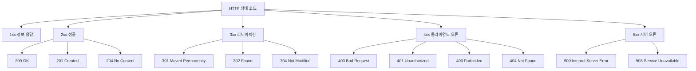
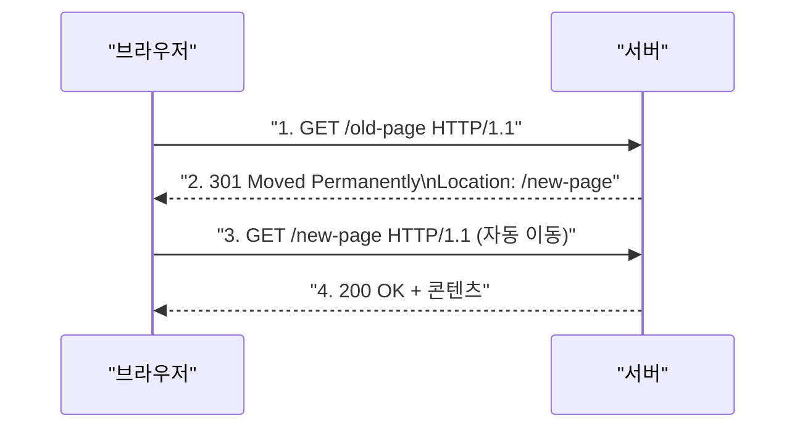
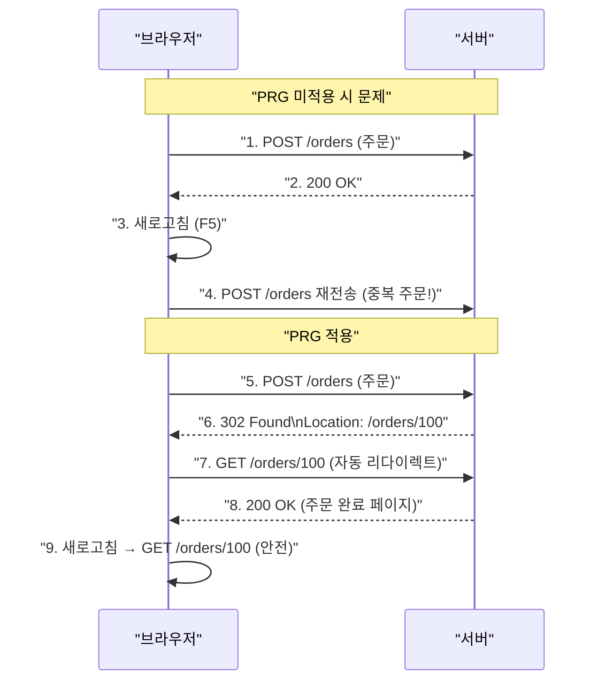
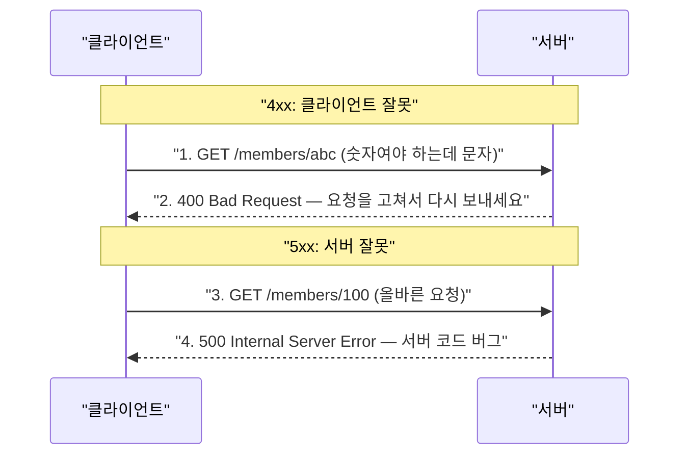

> **한 줄 요약:** HTTP 상태 코드는 서버가 클라이언트의 요청을 어떻게 처리했는지 알려주는 3자리 숫자로, 1xx~5xx 5개 대역으로 분류된다.

## 비유로 이해하는 상태 코드

**택배 배송 상태**를 생각해보자.

- 배송 중 → 아직 처리 중 (1xx)
- 배달 완료 → 성공 (2xx)
- 주소 변경으로 재발송 → 다른 곳으로 가세요 (3xx)
- 수취인 주소 오류 → 고객 잘못 (4xx)
- 택배사 시스템 오류 → 서버 잘못 (5xx)

---

## 상태 코드 전체 구조



---

## 1xx — 정보 응답 (Informational)

요청이 수신되어 처리 중임을 알린다. 실무에서는 거의 만날 일이 없다.

| 코드 | 설명 |
|------|------|
| 100 Continue | 클라이언트가 요청을 계속 보내도 된다 |
| 101 Switching Protocols | 프로토콜을 전환 중 (WebSocket 핸드셰이크 등) |

---

## 2xx — 성공 (Successful)

클라이언트의 요청이 정상적으로 처리됐다.

### 200 OK

가장 일반적인 성공 응답이다.

```http
HTTP/1.1 200 OK
Content-Type: application/json

{
  "id": 100,
  "name": "홍길동",
  "age": 30
}
```

### 201 Created

새 리소스가 생성됐다. `Location` 헤더에 생성된 리소스의 URI를 포함한다.

```http
HTTP/1.1 201 Created
Location: /members/100
Content-Type: application/json

{
  "id": 100,
  "name": "홍길동"
}
```

### 202 Accepted

요청이 접수됐지만 처리가 아직 완료되지 않았다. 배치 작업, 비동기 처리에 사용한다.

```http
HTTP/1.1 202 Accepted
Content-Type: application/json

{
  "jobId": "job-20241201-001",
  "status": "PROCESSING",
  "estimatedTime": "00:05:00"
}
```

### 204 No Content

요청은 성공했지만 응답 바디에 전달할 데이터가 없다. 저장 버튼처럼 응답 내용이 필요 없는 경우에 사용한다.

```http
HTTP/1.1 204 No Content
```

---

## 3xx — 리다이렉션 (Redirection)

요청을 완료하려면 클라이언트가 추가 행동을 해야 한다. 브라우저는 `Location` 헤더가 있으면 자동으로 해당 URL로 이동한다.

### 리다이렉션 흐름



### 영구 리다이렉션

| 코드 | 설명 | 메서드 변경 |
|------|------|-----------|
| **301** Moved Permanently | URL이 영구적으로 변경됨 | GET으로 변경될 수 있음 |
| **308** Permanent Redirect | URL이 영구적으로 변경됨 | 기존 메서드 유지 |

```
상황: /event → /new-event 로 영구 이동

301: POST /event → GET /new-event (메서드 변경)
308: POST /event → POST /new-event (메서드 유지)
```

### 일시 리다이렉션

| 코드 | 설명 | 메서드 변경 |
|------|------|-----------|
| **302** Found | URL이 일시적으로 변경됨 | GET으로 변경될 수 있음 |
| **303** See Other | 다른 URL 참조 | GET으로 변경 |
| **307** Temporary Redirect | URL이 일시적으로 변경됨 | 기존 메서드 유지 |

### PRG 패턴 (Post/Redirect/Get)

POST 요청 후 새로고침 시 중복 처리를 방지하는 패턴이다.



### 304 Not Modified

캐시를 사용하도록 지시한다. 응답 바디를 포함하지 않으며 클라이언트는 로컬 캐시를 재사용한다.

```http
HTTP/1.1 304 Not Modified
Last-Modified: Mon, 01 Jan 2024 00:00:00 GMT
ETag: "abc123"
```

---

## 4xx — 클라이언트 오류 (Client Error)

**오류의 원인이 클라이언트에 있다.** 동일한 요청을 재전송해도 같은 오류가 발생한다.

### 400 Bad Request

잘못된 요청 문법, 잘못된 파라미터, API 스펙 불일치

```http
HTTP/1.1 400 Bad Request
Content-Type: application/json

{
  "error": "INVALID_PARAMETER",
  "message": "age 필드는 0 이상의 정수여야 합니다.",
  "field": "age"
}
```

### 401 Unauthorized

인증(Authentication)이 필요하다. 응답에 `WWW-Authenticate` 헤더로 인증 방법을 명시한다.

> 이름은 Unauthorized(미인가)이지만 실제 의미는 **미인증(Unauthenticated)** 이다.

```http
HTTP/1.1 401 Unauthorized
WWW-Authenticate: Bearer realm="api"

{
  "error": "UNAUTHORIZED",
  "message": "로그인이 필요합니다."
}
```

### 403 Forbidden

인증은 됐지만 권한(Authorization)이 없다.

```http
HTTP/1.1 403 Forbidden
Content-Type: application/json

{
  "error": "FORBIDDEN",
  "message": "관리자 권한이 필요합니다."
}
```

### 401 vs 403 차이

```
401: 로그인을 안 한 상태에서 마이페이지 접근
     → "먼저 로그인하세요"

403: 일반 회원이 관리자 페이지 접근
     → "권한이 없습니다" (로그인은 됐지만 권한 부족)
```

### 404 Not Found

요청한 리소스가 서버에 없다. 또는 클라이언트에게 리소스 존재 자체를 숨기고 싶을 때도 사용한다.

```http
HTTP/1.1 404 Not Found
Content-Type: application/json

{
  "error": "NOT_FOUND",
  "message": "회원 ID 999는 존재하지 않습니다."
}
```

### 409 Conflict

요청이 현재 서버 상태와 충돌한다.

```http
HTTP/1.1 409 Conflict
Content-Type: application/json

{
  "error": "CONFLICT",
  "message": "이미 사용 중인 이메일입니다."
}
```

### 422 Unprocessable Entity

요청 형식은 올바르지만 내용의 의미적 유효성 검사를 통과하지 못했다.

```http
HTTP/1.1 422 Unprocessable Entity
Content-Type: application/json

{
  "error": "VALIDATION_ERROR",
  "errors": [
    { "field": "email", "message": "이메일 형식이 아닙니다." },
    { "field": "age", "message": "나이는 1~150 사이여야 합니다." }
  ]
}
```

---

## 5xx — 서버 오류 (Server Error)

**오류의 원인이 서버에 있다.** 서버가 복구되면 동일한 요청이 성공할 수 있다.

### 500 Internal Server Error

서버 내부에서 처리 중 예외가 발생했다. 원인을 특정할 수 없을 때 사용한다.

```http
HTTP/1.1 500 Internal Server Error
Content-Type: application/json

{
  "error": "INTERNAL_SERVER_ERROR",
  "message": "서버 오류가 발생했습니다. 잠시 후 다시 시도해주세요."
}
```

> 실무에서는 500 응답에 내부 스택 트레이스를 절대 노출하면 안 된다. 보안상 위험하다.

### 503 Service Unavailable

서버가 일시적으로 요청을 처리할 수 없다. `Retry-After` 헤더로 복구 예상 시간을 알려줄 수 있다.

```http
HTTP/1.1 503 Service Unavailable
Retry-After: 3600
Content-Type: application/json

{
  "error": "SERVICE_UNAVAILABLE",
  "message": "점검 중입니다. 1시간 후 다시 시도해주세요."
}
```

---

## 4xx vs 5xx — 실무 구분 기준



| 구분 | 4xx | 5xx |
|------|-----|-----|
| 잘못 | 클라이언트 | 서버 |
| 재시도 | 의미 없음 (요청을 고쳐야 함) | 서버 복구 후 재시도 가능 |
| 알람 | 낮은 우선순위 | **즉시 알람 필요** |

---

## Spring에서의 상태 코드 반환

```java
@RestController
@RequestMapping("/members")
public class MemberController {

    // 200 OK (기본값)
    @GetMapping("/{id}")
    public Member getMember(@PathVariable Long id) {
        return memberService.findById(id);
    }

    // 201 Created + Location 헤더
    @PostMapping
    public ResponseEntity<Member> createMember(@RequestBody MemberDto dto) {
        Member member = memberService.create(dto);
        URI location = URI.create("/members/" + member.getId());
        return ResponseEntity.created(location).body(member);
    }

    // 204 No Content
    @DeleteMapping("/{id}")
    public ResponseEntity<Void> deleteMember(@PathVariable Long id) {
        memberService.delete(id);
        return ResponseEntity.noContent().build();
    }

    // 400 Bad Request
    @ExceptionHandler(IllegalArgumentException.class)
    public ResponseEntity<ErrorResponse> handleBadRequest(IllegalArgumentException e) {
        return ResponseEntity.badRequest()
                .body(new ErrorResponse("INVALID_PARAMETER", e.getMessage()));
    }
}
```

---

## 핵심 포인트 정리

| 범위 | 의미 | 대표 코드 |
|------|------|---------|
| 1xx | 처리 중 | 거의 사용 안 함 |
| 2xx | 성공 | 200, 201, 204 |
| 3xx | 리다이렉션 | 301, 302, 304 |
| 4xx | 클라이언트 오류 | 400, 401, 403, 404 |
| 5xx | 서버 오류 | 500, 503 |

- **201 Created**는 POST 등록 성공 시 `Location` 헤더와 함께 반환한다
- **304 Not Modified**는 캐시 재사용을 지시하며 바디가 없다
- **401 vs 403:** 401은 인증 미완료, 403은 인증은 됐지만 권한 없음
- **4xx는 클라이언트** 잘못, **5xx는 서버** 잘못이다
- 5xx 응답에는 내부 에러 상세를 **절대 노출하지 않는다**
