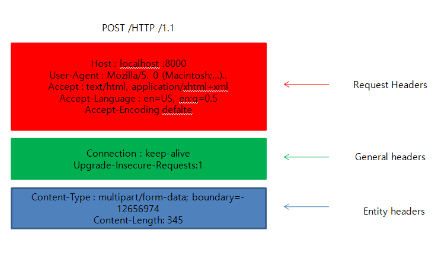
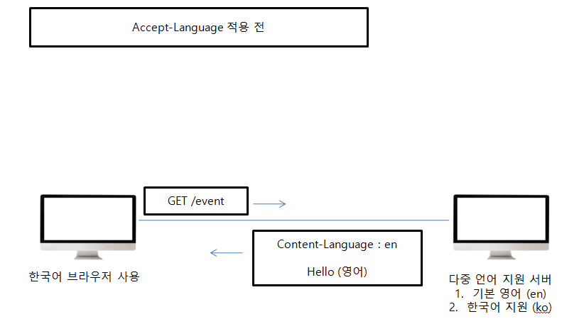
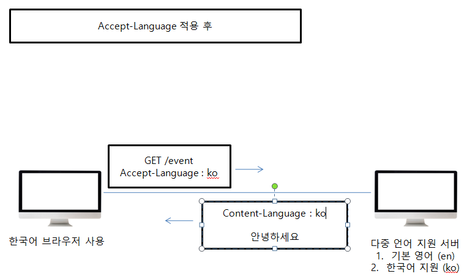
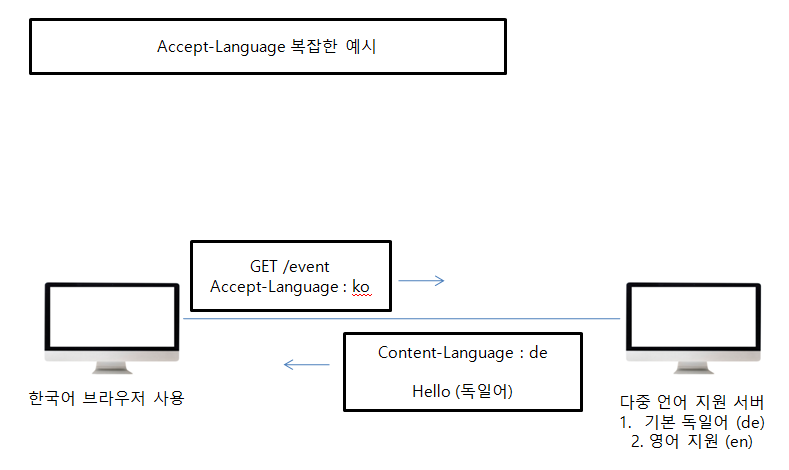

##### HTTP Header

Header 분류

* General Header : 메시지 전체에 적용되는 정보, 예) Connection: close
* Request Header : 요청정보, 예) User-Agent: Mozilla/5.0

* Response Header: 응답 정보, 예) Server: Apache

* Entity(Representation) Header: Entity 바디 정보, 
  * 예 ) Content-Type :text/html, Content-Length:3423

##### 표현 (Representation)

* Content-Type : 표현 데이터의 형식
  * Media-Type, 문자 인코딩 
  * 예) text/html; charset=utf-8, application/json, image/png
* Content-Encoding : 표현 데이터의 압축 방식
  * 표현 데이터를 압축하기 위해 사용
  * 데이터를 전달하는 곳에서 압축 후 인코딩 헤더 추가
  * 데이터를 읽는 쪽에서 인코딩 헤더의 정보로 압축 해제
  * 예) gzip, deflate, identity
* Content-Language : 표현 데이터의 자연 언어
  * 예)ko, en, en-US
* Content-Length : 표현 데이터의 길이
  * 바이트 단위
  * Transfer-Encoding(전송 코딩)을 사용하면 Content-Length를 사용하면 안됌

표현 헤더는 전송, 응답 둘다 사용

##### Content Negotiation 협상 - 클라이언트가 선호하는 표현 요청

* Accept : 클라이언트가 선호하는 미디어 타입 전달
* Accept-Charset : 클라이언트가 선호하는 문자 인코딩
* Accept-Encoding : 클라이언트가 선호하는 압축 인코딩
* Accept-Language : 클라이언트가 선호하는 자연 언어

* 협상 헤더는 요청시에만 사용

  

위의 복잡한 예시를 보면 클라이언트가 서버에서 받고자 하는 언어는 한국어지만 서버에서 제공하는 언어는 독일어, 영어이기에 영어와 독일어를 받는다. 이유는 아래와 같다.

**협상과 우선순위 1  ( Quality Values )**

* Quality Values(q) 값 사용
* 0~1, 클수록 높은 우선 순위
* 생략하면 1
* Accept-Language : ko-KR,ko;q=0.9,en-US;q=0.8,en;q=0.7
  1. ko-KR; q=1 (q생략)
  2. ko;q=0.9
  3. en-US;q=0.8
  4. en;q=0.7 

**협상과 우선순위2**

* 구체적인 것이 우선한다
* Accept: text/*, text/plain, text/plain;format:flowed, "/"
  1. text/plain;foramt=flowed
  2. text/plain
  3. text/*
  4. */*

**협상과 우선순위 3**

* 구체적인 것을 기준으로 미디어 타입을 맞춘다.

* Accept:text/*;q=0.3, text/html;q=0.7,text/html;level=1,

  text/html;level=2,q=0.4.,/*/;q=0.5

  | MediaType         | Quality |
  | ----------------- | ------- |
  | text/html;level=1 | 1       |
  | text/html         | 0.7     |
  | text/plain        | 0.3     |
  | image/jpeg        | 0.5     |
  | text/html;level=2 | 0.4     |
  | text/html;level=3 | 0.7     |

  

##### 전송방식

* 단순 전송

  * Content-Length 길이를 알 수 있을 때 사용한다.

* 압축 전송

  * Content-Encoding

* 분할 전송

  * Transfer-Encoding : chunked 
  * 서버에서 데이터를 쪼개서 보낸다.
  * Content-Length를 예상할 수 없다.

* 범위 전송

  * Range, Content-Range

  