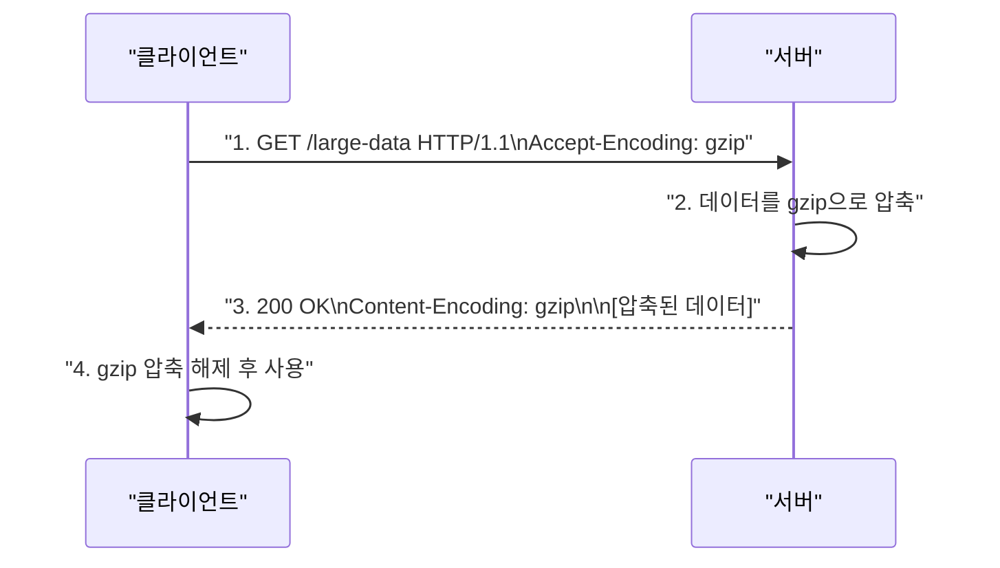
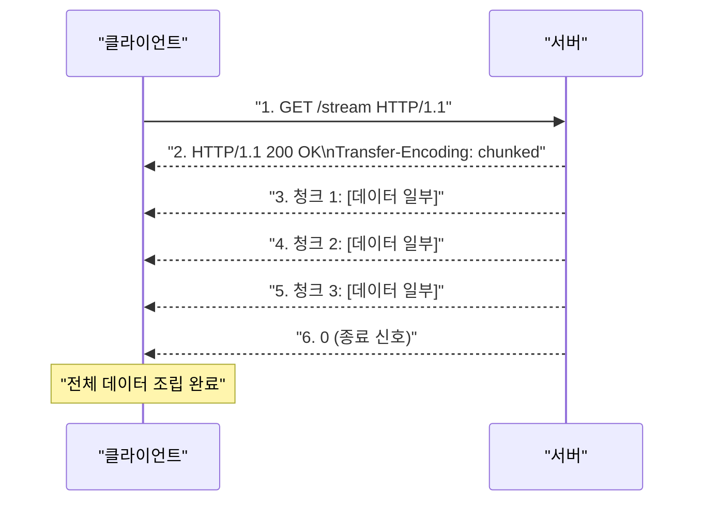

> **한 줄 요약:** HTTP 헤더는 전송에 필요한 모든 부가 정보를 담는다. 표현 헤더는 바디의 형식을 설명하고, 협상 헤더는 클라이언트가 원하는 형식을 서버에 알린다.

## 비유로 이해하는 HTTP 헤더

**택배 송장**을 생각해보자. 택배 박스 안에 물건(바디)이 들어있고, 박스 겉면 송장(헤더)에는 보내는 사람, 받는 사람, 내용물, 취급 주의 사항, 배송 방법 등 부가 정보가 적혀있다.

HTTP 헤더도 마찬가지다. 실제 데이터(바디)와 함께 그 데이터를 어떻게 처리해야 하는지에 대한 메타 정보를 담는다.

---

## HTTP 헤더 구조

```
GET /members/100 HTTP/1.1           ← 시작 라인
Host: api.example.com               ← 헤더 시작
Content-Type: application/json
Accept-Language: ko
Authorization: Bearer eyJhbG...
                                    ← 빈 줄 (헤더/바디 구분)
{ "name": "홍길동" }                 ← 바디
```

### 헤더 분류

| 분류 | 설명 | 예시 |
|------|------|------|
| **General Header** | 요청/응답 모두에 적용 | `Connection: keep-alive` |
| **Request Header** | 요청에만 사용 | `User-Agent`, `Accept` |
| **Response Header** | 응답에만 사용 | `Server`, `Set-Cookie` |
| **Representation Header** | 바디(표현 데이터) 정보 | `Content-Type`, `Content-Length` |

---

## 표현 헤더 (Representation Headers)

HTTP/1.1부터 메시지 바디를 "표현(Representation)"이라고 부른다. 표현 헤더는 바디의 **형식, 인코딩, 언어, 크기**를 설명한다.

### Content-Type — 표현 데이터의 형식

```http
Content-Type: text/html; charset=utf-8
Content-Type: application/json
Content-Type: image/png
Content-Type: multipart/form-data; boundary=----boundary
```

| 미디어 타입 | 사용 예 |
|-----------|---------|
| `text/html` | HTML 페이지 |
| `text/plain` | 일반 텍스트 |
| `application/json` | JSON API 응답 |
| `application/xml` | XML 데이터 |
| `image/png`, `image/jpeg` | 이미지 |
| `application/octet-stream` | 바이너리 파일 다운로드 |
| `multipart/form-data` | 파일 업로드 폼 |

### Content-Encoding — 압축 방식

서버가 데이터를 압축해서 보낼 때 사용한다. 클라이언트는 이 헤더를 보고 압축을 해제한다.

```http
Content-Encoding: gzip
Content-Encoding: deflate
Content-Encoding: identity    (압축 없음)
```


```mermaid
sequenceDiagram
    participant C as "클라이언트"
    participant S as "서버"

    C->>S: "1. GET /large-data HTTP/1.1\nAccept-Encoding: gzip"
    S->>S: "2. 데이터를 gzip으로 압축"
    S-->>C: "3. 200 OK\nContent-Encoding: gzip\n\n[압축된 데이터]"
    C->>C: "4. gzip 압축 해제 후 사용"
```

### Content-Language — 자연 언어

```http
Content-Language: ko
Content-Language: en-US
Content-Language: ko, en    (복수 언어)
```

### Content-Length — 데이터 크기

```http
Content-Length: 3423    (바이트 단위)
```

청크 전송(`Transfer-Encoding: chunked`) 사용 시에는 Content-Length를 사용하지 않는다.

---

## 콘텐츠 협상 (Content Negotiation)

클라이언트가 **선호하는 표현 형식을 서버에 요청**하는 헤더다. 요청 시에만 사용한다.

| 헤더 | 의미 |
|------|------|
| `Accept` | 선호하는 미디어 타입 |
| `Accept-Charset` | 선호하는 문자 인코딩 |
| `Accept-Encoding` | 선호하는 압축 방식 |
| `Accept-Language` | 선호하는 자연 언어 |

### 예시: 언어 협상

```mermaid
sequenceDiagram
    participant C as "한국 클라이언트"
    participant S as "서버 (한국어 없음, 영어/독일어만 지원)"

    C->>S: "1. GET /hello HTTP/1.1\nAccept-Language: ko"
    S->>S: "2. ko 미지원 → 기본값 de(독일어) 반환"
    S-->>C: "3. 200 OK\nContent-Language: de\n\n[독일어 콘텐츠]"

    Note over C,S: "Quality Values(q) 사용 시"
    C->>S: "4. GET /hello HTTP/1.1\nAccept-Language: ko;q=1,en;q=0.9,de;q=0.8"
    S->>S: "5. ko 미지원 → 다음 우선순위 en 지원 확인 → 반환"
    S-->>C: "6. 200 OK\nContent-Language: en\n\n[영어 콘텐츠]"
```

### 품질값(Quality Values, q)

우선순위를 0~1 사이 값으로 지정한다. 높을수록 우선이며, 생략 시 1.0이다.

```http
Accept-Language: ko-KR,ko;q=0.9,en-US;q=0.8,en;q=0.7
```

우선순위 해석:
1. `ko-KR` (q=1.0, 생략)
2. `ko` (q=0.9)
3. `en-US` (q=0.8)
4. `en` (q=0.7)

### 구체적인 것이 우선

```http
Accept: text/*, text/plain, text/plain;format=flowed, */*
```

우선순위:
1. `text/plain;format=flowed` (가장 구체적)
2. `text/plain`
3. `text/*`
4. `*/*` (가장 일반적)

---

## 전송 방식

### 단순 전송 (Content-Length)

```http
HTTP/1.1 200 OK
Content-Type: application/json
Content-Length: 152

{ "id": 1, "name": "홍길동", ... }
```

전체 크기를 알 수 있을 때 사용한다.

### 압축 전송 (Content-Encoding)

```http
HTTP/1.1 200 OK
Content-Type: application/json
Content-Encoding: gzip
Content-Length: 38

[gzip 압축된 바이너리]
```

### 분할 전송 (Transfer-Encoding: chunked)

```http
HTTP/1.1 200 OK
Transfer-Encoding: chunked

4\r\n
Wiki\r\n
5\r\n
pedia\r\n
0\r\n
\r\n
```

- 데이터를 청크(chunk) 단위로 나눠서 전송한다
- 전체 크기를 미리 알 수 없을 때 사용한다 (스트리밍, 동적 생성)
- `Content-Length` 헤더를 사용하지 않는다
- `0\r\n\r\n`으로 전송 종료를 알린다


```mermaid
sequenceDiagram
    participant C as "클라이언트"
    participant S as "서버"

    C->>S: "1. GET /stream HTTP/1.1"
    S-->>C: "2. HTTP/1.1 200 OK\nTransfer-Encoding: chunked"
    S-->>C: "3. 청크 1: [데이터 일부]"
    S-->>C: "4. 청크 2: [데이터 일부]"
    S-->>C: "5. 청크 3: [데이터 일부]"
    S-->>C: "6. 0 (종료 신호)"
    Note over C: "전체 데이터 조립 완료"
```

### 범위 전송 (Range, Content-Range)

대용량 파일을 분할 다운로드하거나 이어받기할 때 사용한다.

```http
GET /large-file.zip HTTP/1.1
Range: bytes=0-1023

---

HTTP/1.1 206 Partial Content
Content-Range: bytes 0-1023/10240
Content-Length: 1024

[0~1023 바이트 데이터]
```

---

## 실무 활용 예시

### JSON API 요청/응답

```bash
# 요청
curl -X POST https://api.example.com/members \
  -H "Content-Type: application/json" \
  -H "Accept: application/json" \
  -H "Accept-Encoding: gzip" \
  -d '{"name":"홍길동","age":30}'

# 응답 헤더 확인
HTTP/1.1 201 Created
Content-Type: application/json; charset=UTF-8
Content-Encoding: gzip
Content-Length: 89
Location: /members/100
```

### 다국어 API

```java
// Spring에서 Accept-Language에 따른 다국어 응답
@GetMapping("/greeting")
public ResponseEntity<String> greeting(
        @RequestHeader(value = "Accept-Language", defaultValue = "ko") String lang) {
    String message = switch (lang.substring(0, 2)) {
        case "ko" -> "안녕하세요!";
        case "en" -> "Hello!";
        case "ja" -> "こんにちは！";
        default -> "Hello!";
    };
    return ResponseEntity.ok()
            .header("Content-Language", lang.substring(0, 2))
            .body(message);
}
```

---

## 협상 헤더 전체 흐름

```mermaid
sequenceDiagram
    participant C as "클라이언트 (브라우저)"
    participant S as "서버"

    C->>S: "1. GET /content HTTP/1.1\nAccept: text/html,application/json;q=0.9\nAccept-Language: ko;q=1,en;q=0.8\nAccept-Encoding: gzip,br"
    S->>S: "2. 클라이언트 선호 분석:\n   - HTML 선호\n   - 한국어 선호\n   - gzip 압축 지원"
    S->>S: "3. 한국어 HTML을 gzip으로 압축"
    S-->>C: "4. 200 OK\nContent-Type: text/html; charset=utf-8\nContent-Language: ko\nContent-Encoding: gzip\n\n[압축된 한국어 HTML]"
    C->>C: "5. gzip 해제 → 한국어 HTML 렌더링"
```

---

## 핵심 포인트 정리

| 헤더 | 방향 | 역할 |
|------|------|------|
| `Content-Type` | 요청/응답 | 바디 데이터의 미디어 타입 |
| `Content-Encoding` | 응답 | 압축 방식 |
| `Content-Language` | 응답 | 자연 언어 |
| `Content-Length` | 요청/응답 | 바디 크기 (청크 전송 시 미사용) |
| `Accept` | 요청 | 클라이언트가 원하는 미디어 타입 |
| `Accept-Encoding` | 요청 | 클라이언트가 지원하는 압축 방식 |
| `Accept-Language` | 요청 | 클라이언트가 선호하는 언어 |
| `Transfer-Encoding` | 응답 | 전송 인코딩 방식 (chunked) |

- **Content-Type과 Accept**는 쌍을 이룬다. Content-Type은 보내는 쪽, Accept는 받고 싶은 쪽
- **Quality Values(q)**로 콘텐츠 협상 우선순위를 지정한다. 생략 시 q=1.0
- **청크 전송**은 크기를 모를 때 사용하며 Content-Length를 함께 쓰지 않는다
- `gzip` 압축을 적용하면 텍스트 기반 응답(JSON, HTML)의 크기를 크게 줄일 수 있다
