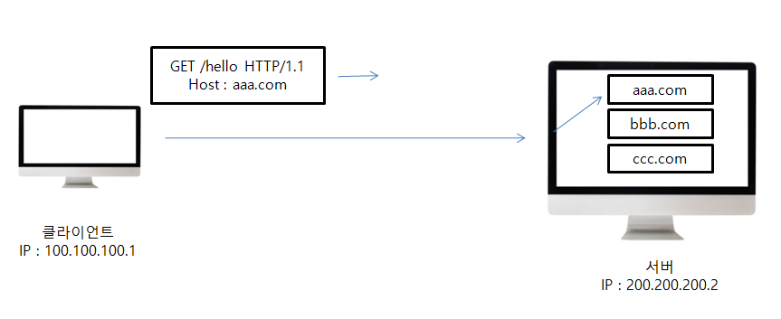

##### 일반정보

* From ( UserAgent의 이메일 정보 )
  * 일반적으로 잘 사용되지 않음
  * 검색 엔진 같은 곳에서, 주로 사용
  * 요청에서 사용

* Referer ( 이전 웹 페이지 주소 )
  *  현재 요청된 페이지의 이전 웹 페이지 주소
  * A -> B로 이동하는 경우 B를 요청할 때 Referer : A 를 포함해서 요청
  * Referer를 사용해서 유입 경로 분석 가능
  * 요청에서 사용

* User-Agent ( UserAgent 애플리케이션 정보 )
  * user-angt : Mozila/5.0 (Macintosh; Intel Mac OS X 10_15_7) AppleWebKit/537.36 (KHTML, like Gecko) Chrome/86.0.4240.183 Safari/537.36
  * 클라이언트의 애플리케이션 정보 ( 웹 브라우저 정보, 등등)
  * 통계 정보
  * 어떤 종류의 브라우저에서 장애가 발생하는지 파악 가능
  * 요청에서 사용

* Server ( 요청을 처리하는 ORIGIN 서버의 소프트웨어 정보 )
  * Server : Apache/2.2.22 (Debian)
  * server: nginx
  * 응답에서 사용

* Date ( 메시지가 발생한 날짜와 시간 )
  * Date: Tue, 15 Nov 1994 08:12:31 GMT
  * 응답에서 사용

##### 특별한 정보

* Host : 요청한 호스트 정보 (도메인)

  * 하나의 서버가 여러 도메인을 처리해야 할 때
  * 하나의 IP 주소에 여러 도메인이 적용되어 있을 때

  

* Location : 페이지 리다이렉션

  * 웹 브라우저는 3xx 응답의 결과에 Location 헤더가 있으면, Location 위치로 자동 이동 

* Allow : 허용 가능한 HTTP 메서드

  * 405 (Method Not Allowed) 에서 응답에 포함해야함
  * GET, HEAD, PU

* Retry-After : 유저 에이전트가 다음 요청 을 하기까지 기다려야 하는 시간

  