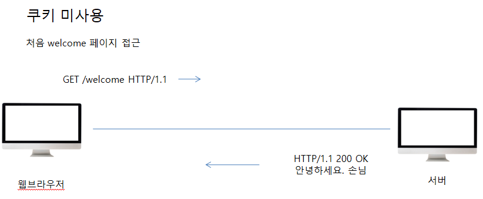
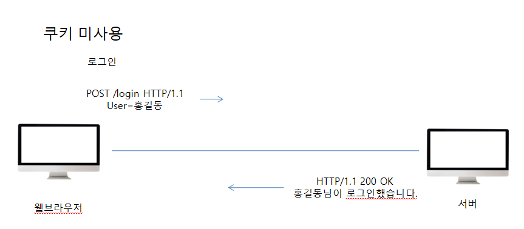
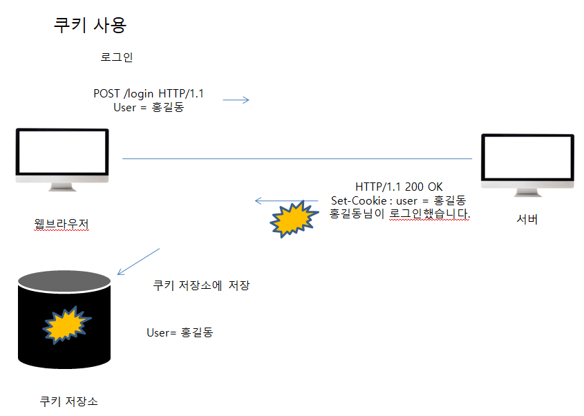
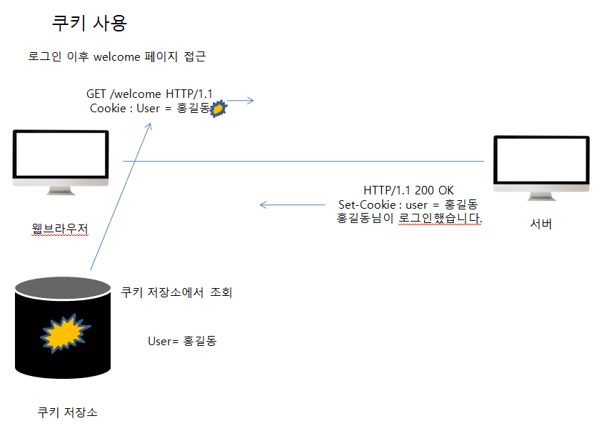

##### 인증

* Authentication : 클라이언트 인증 정보를 서버에 전달
  * Authenticataion : Basic xxxx
* WWW-Authenticate : 리소스 접근 시 필요한 인증 방법 정의
  * 401 Unauthorized 응답과 함께 사용
  * WWW-Authenticate : Newauth realm ="apps", type =1, title= "Login to \"apps", Basic realm = "simple"

##### 쿠키

* Set-Cookie : 서버에서 클라이언트로 쿠키 전달 (응답)
  * ex) set-cookie : sessionId=abcde1234; expires=Sat, 26-Dec-2020 00:00:00 GMT; path:/;  domain=.google.com;Secure
* Cookie : 클라이언트가 서버에서 받은 쿠키를 저장하고, HTTP 요청시 서버로 전달

* 사용처
  * 사용자 로그인 세션관리
  * 광고 정보 트래킹

* 쿠키 정보는 항상 서버에 전송됨
  * 네트워크 트래픽 추가 유발
  * 최소한의 정보만 사용 (sessionId, 인증 토큰)
  * 서버에 전송하지 않고, 웹 브라우저 내부에 데이터를 저장하고 싶으면 웹스토리지 사용

* 보안에 민감한 데이터는 저장하면 안됨(주민번호, 신용카드 번호 등등)

**위의 흐름처럼 쿠키 미사용 시 로그인을 하고 welcome 페이지에 접근할 때 기대하고자 하는 값은**

 **안녕하세요 홍길동님 이지만, 결과는 손님이다. 이유가 뭘까? 그것은 HTTP의 무상태성, 즉 Stateless 특성 때문에 한번의 요청 후에 연결을 끊어버리기 때문이다.** 

##### Stateless

* HTTP는 무상태(Stateless) 프로토콜이다.
* 클라이언트와 서버가 요청과 응답을 주고 받으면 연결이 끊어진다.
* 클라이언트가 다시 요청하면 서버는 이전 요청을 기억하지 못한다.
* 클라이언트와 서버는 서로 상태를 유지하지 않는다.

**위 처럼 쿠키를 사용하지 않았을 때 원하는 값을 유지시키고 싶다면, 모든 요청에 사용자 정보를 포함하는 방법이 존재한다.**

하지만... 모든 요청과 링크에 사용자 정보를 포함한다는 것은 보안의 문제 뿐만아니라 사실상 너무 귀찮은 문제이다.. 그래서 이와 같은 문제를 해결하고자 사용하는 것이 **쿠키**이다.

##### 쿠키 생명주기 (Expires, max-age)

* 만료일이 되면 쿠키 삭제
* 0이나 음수를 지정하면 쿠키 삭제
* 세션 쿠키 : 만료날짜를 생략하면 브라우저 종료시 까지만 유지
* 영속 쿠키 만료 날짜를 입력하면 해당 날짜까지 유지

##### 쿠키 보안 

* Secure
  * 쿠키는 http, https를 구분하지 않고 전송
  * Secure를 적용하면 https인 경우에만 전송
* HttpOnly
  * XSS 공격 방지
  * 자바스크립트에서 접근 불가 (document.cookie)
  * HTTP 전송에만 사용

* SameSite

  * XSRF 공격 방지
  * 요청 도메인과 쿠키에 설정된 도메인이 같은 경우만 쿠키 전송

  