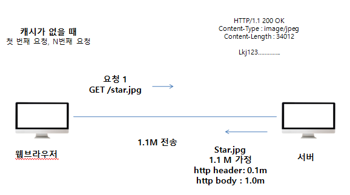
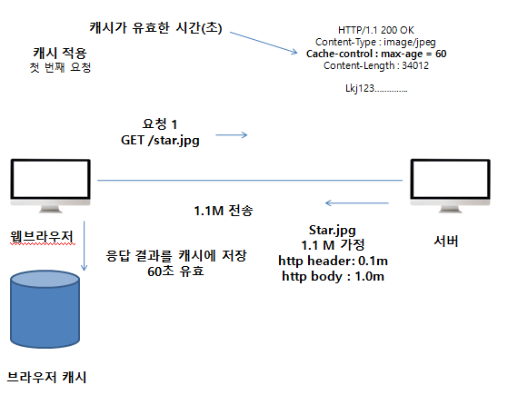
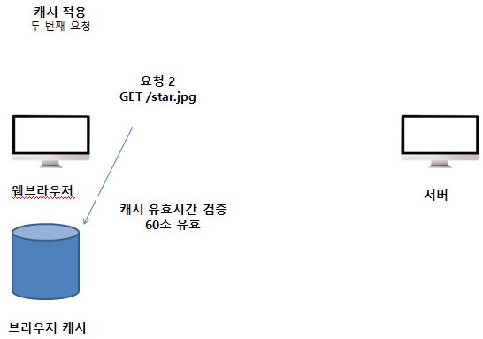

##### 캐시 기본동작

**캐시가 없을 때**

* 데이터가 변경되지 않아도 계속 네트워크를 통해서 데이터를 다운로드 받아야 한다.
* 인터넷 네트워크는 매우 느리고 비싸다.
* 브라우저 로딩 속도가 느리다.
* 느린 사용자 경험

**캐시 적용**

* 캐시 덕분에 캐시 가능 시간동안 네트워크를 사용하지 않아도 된다.
* 비싼 네트워크 사용량을 줄일 수 있다
* 브라우저 로딩 속도가 매우 빠르다
* 빠른 사용자 경험

* 캐시 유효 시간이 초과하면, 서버를 통해 데이터를 다시 조회하고, 캐시를 갱신한다.