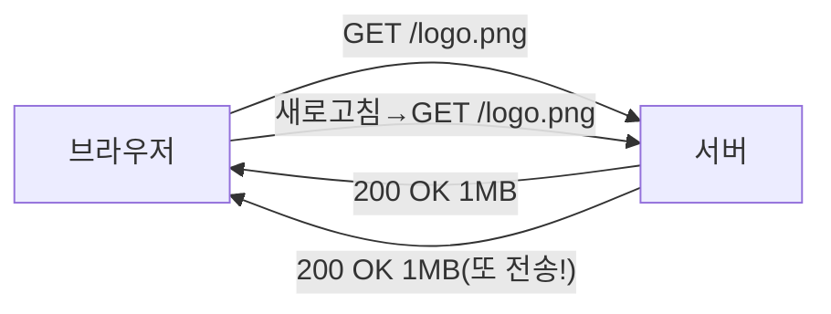
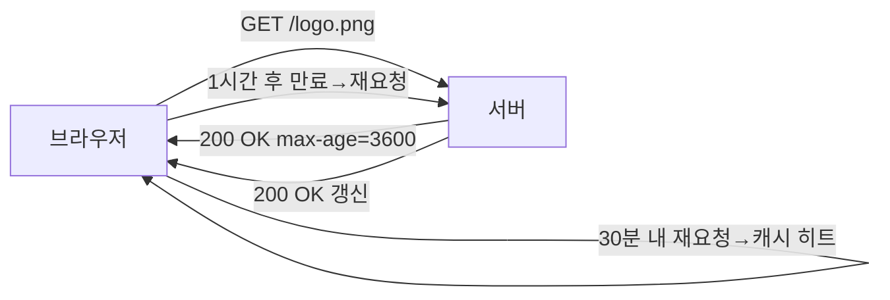
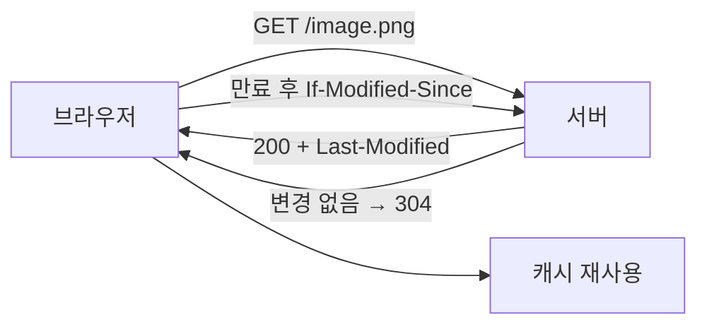
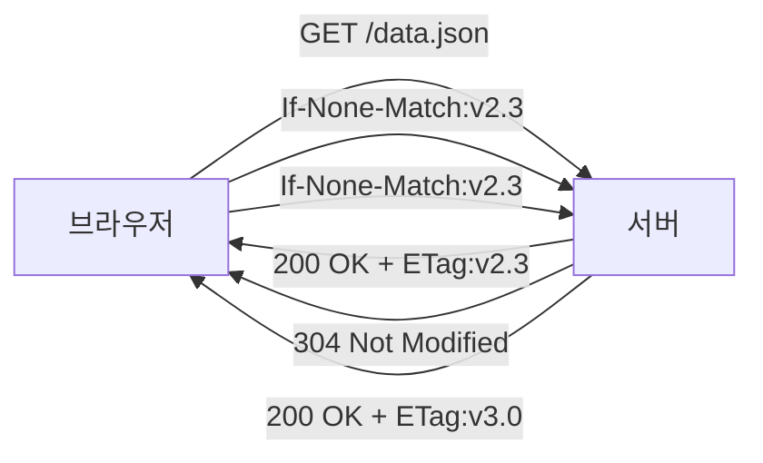

> **한 줄 요약:** HTTP 캐시는 한 번 받은 응답을 저장해 두었다가 재사용함으로써 네트워크 비용을 줄이고 응답 속도를 높이는 메커니즘이다.

## 비유로 이해하는 캐시

**편의점 냉장고**를 생각해보자. 편의점은 매번 본사 창고에서 물건을 가져오는 대신, 자주 팔리는 음료를 냉장고에 미리 채워둔다. 손님은 창고까지 가지 않아도 바로 음료를 살 수 있다.

HTTP 캐시도 마찬가지다. 서버에서 받은 데이터를 브라우저(또는 중간 서버)에 저장해두고, 같은 요청이 오면 서버까지 가지 않고 저장된 데이터를 바로 사용한다.

---

## 캐시 없을 때의 문제점


```mermaid
graph LR
    C["브라우저"] -->|"GET /logo.png"| S["서버"]
    S -->|"200 OK 1MB"| C
    C -->|"새로고침→GET /logo.png"| S
    S -->|"200 OK 1MB(또 전송!)"| C
```

**문제점:**
- 변경되지 않은 데이터도 매번 네트워크를 통해 다운로드한다
- 인터넷 비용이 낭비된다
- 브라우저 로딩 속도가 느리다
- 서버에 불필요한 부하가 발생한다

---

## 캐시 적용 — Cache-Control


```mermaid
graph LR
    C["브라우저"] -->|"GET /logo.png"| S["서버"]
    S -->|"200 OK max-age=3600"| C
    C -->|"30분 내 재요청→캐시 히트"| C
    C -->|"1시간 후 만료→재요청"| S
    S -->|"200 OK 갱신"| C
```

---

## Cache-Control 지시어

### 캐시 유효 시간

```http
# 3600초(1시간) 동안 캐시 유효
Cache-Control: max-age=3600

# 캐시하지 않음 (민감한 데이터)
Cache-Control: no-store

# 캐시는 하되, 사용 전에 반드시 서버에 검증
Cache-Control: no-cache
```

### max-age vs no-cache vs no-store

| 지시어 | 캐시 저장 | 서버 검증 | 사용 |
|--------|---------|---------|------|
| `max-age=N` | O | 만료 후 | 정적 리소스 (이미지, JS, CSS) |
| `no-cache` | O | **매번** | 자주 바뀌는 동적 콘텐츠 |
| `no-store` | X | — | 민감한 데이터 (금융 정보 등) |

### 캐시 공개 범위

```http
# public: CDN 등 중간 캐시에 저장 허용
Cache-Control: public, max-age=86400

# private: 브라우저 캐시에만 저장 (기본값)
# 중간 프록시/CDN에 저장 금지
Cache-Control: private, max-age=3600
```

---

## 캐시 만료 — Expires (구형)

```http
Expires: Mon, 01 Jan 2025 00:00:00 GMT
```

- HTTP/1.0의 캐시 방식이다
- 절대 날짜로 만료 시점을 지정한다
- `Cache-Control: max-age`와 함께 사용하면 **max-age가 우선**한다
- 현재는 `Cache-Control: max-age` 사용을 권장한다

---

## 조건부 요청 — 캐시 재검증

캐시가 만료되었지만, 서버 데이터가 변경되지 않았다면 굳이 다시 다운로드할 필요가 없다. 이때 사용하는 것이 **조건부 요청**이다.

### Last-Modified / If-Modified-Since


```mermaid
graph LR
    C["브라우저"] -->|"GET /image.png"| S["서버"]
    S -->|"200 + Last-Modified"| C
    C -->|"만료 후 If-Modified-Since"| S
    S -->|"변경 없음 → 304"| C
    C --> CACHE["캐시 재사용"]
```

**304 Not Modified 응답의 장점:**
- Body 없이 헤더만 전송 (예: 0.1KB vs 1MB)
- 네트워크 트래픽 대폭 감소

### ETag / If-None-Match

Last-Modified 방식의 한계를 보완한다.

**Last-Modified 한계:**
- 1초 미만 단위 변경 감지 불가
- 내용은 같지만 수정 날짜만 바뀐 경우 (예: 파일 재저장)
- 서버가 날짜 기반이 아닌 버전 기반으로 캐시를 관리하고 싶은 경우


```mermaid
graph LR
    C["브라우저"] -->|"GET /data.json"| S["서버"]
    S -->|"200 OK + ETag:v2.3"| C
    C -->|"If-None-Match:v2.3"| S
    S -->|"304 Not Modified"| C
    C -->|"If-None-Match:v2.3"| S
    S -->|"200 OK + ETag:v3.0"| C
```

---

## 캐시 전략 비교

```
데이터 변경 없음 + 캐시 만료:
  → 조건부 요청 → 304 Not Modified → 캐시 재사용
  → 헤더만 전송 (0.1KB) → 네트워크 절약

데이터 변경 있음 + 캐시 만료:
  → 조건부 요청 → 200 OK + 새 데이터
  → 전체 전송 (1MB) → 최신 데이터 수신
```

---

## 실무 캐시 설정 가이드

### 리소스 유형별 권장 설정

```http
# 정적 리소스 (이미지, 폰트) — 내용이 거의 안 바뀜
# 파일명에 해시 포함: logo.abc123.png
Cache-Control: public, max-age=31536000, immutable
# immutable: 유효 기간 내에는 조건부 요청도 안 보냄

# JavaScript, CSS (배포마다 파일명 해시 변경)
Cache-Control: public, max-age=31536000, immutable

# HTML 파일 — 자주 변경될 수 있음
Cache-Control: no-cache
# 매번 서버에 검증하되, 변경 없으면 캐시 재사용

# API 응답 — 동적 데이터
Cache-Control: no-store
# 또는 짧은 max-age
Cache-Control: private, max-age=60

# 민감한 데이터 (개인정보, 금융)
Cache-Control: no-store, no-cache, must-revalidate
```

### Spring에서의 캐시 헤더 설정

```java
@GetMapping("/static/image/{filename}")
public ResponseEntity<byte[]> getImage(@PathVariable String filename) throws IOException {
    byte[] imageBytes = loadImage(filename);

    return ResponseEntity.ok()
            .header(HttpHeaders.CACHE_CONTROL, "public, max-age=31536000, immutable")
            .header(HttpHeaders.CONTENT_TYPE, "image/png")
            .body(imageBytes);
}

@GetMapping("/api/members/{id}")
public ResponseEntity<Member> getMember(@PathVariable Long id,
                                         HttpServletRequest request) {
    Member member = memberService.findById(id);
    String etag = "\"" + member.getVersion() + "\"";

    // ETag 조건부 요청 처리
    String ifNoneMatch = request.getHeader("If-None-Match");
    if (etag.equals(ifNoneMatch)) {
        return ResponseEntity.status(HttpStatus.NOT_MODIFIED).build();
    }

    return ResponseEntity.ok()
            .header(HttpHeaders.ETAG, etag)
            .header(HttpHeaders.CACHE_CONTROL, "private, max-age=60")
            .body(member);
}
```

---

## 캐시 무효화 전략

캐시를 강제로 새로 받아야 할 때의 전략이다.

### 방법 1: URL에 버전/해시 포함 (가장 권장)

```html
<!-- 배포마다 파일명이 바뀌어 캐시가 자동 무효화 -->
<link rel="stylesheet" href="/css/style.a1b2c3d4.css">
<script src="/js/app.e5f6g7h8.js"></script>
```

### 방법 2: 쿼리 파라미터 버전

```html
<link rel="stylesheet" href="/css/style.css?v=2.3.1">
```

### 방법 3: Cache-Control: no-cache + ETag

```http
# 매번 서버에 검증, 변경 없으면 304로 캐시 재사용
Cache-Control: no-cache
ETag: "abc123"
```

---

## 캐시 성능 효과

```
[캐시 미적용]
사용자 10,000명 × 1MB 이미지 = 10,000MB 전송

[캐시 적용 (max-age=86400)]
최초 방문자 = 10,000MB 전송
재방문자 = 0MB 전송 (캐시 재사용)

[조건부 요청 (no-cache + ETag)]
데이터 변경 없음: 0.1KB × 10,000명 = 1MB 전송
데이터 변경 있음: 1MB × 변경된 경우만 전송
```

---

## 핵심 포인트 정리

| 헤더 | 방향 | 역할 |
|------|------|------|
| `Cache-Control: max-age` | 응답 | 캐시 유효 기간 지정 |
| `Cache-Control: no-cache` | 응답 | 캐시하되 매번 서버 검증 |
| `Cache-Control: no-store` | 응답 | 캐시 금지 |
| `Cache-Control: public` | 응답 | CDN 등 공유 캐시 허용 |
| `Cache-Control: private` | 응답 | 브라우저 캐시만 허용 |
| `ETag` | 응답 | 리소스 버전 식별자 |
| `If-None-Match` | 요청 | ETag 조건부 요청 |
| `Last-Modified` | 응답 | 최종 수정 날짜 |
| `If-Modified-Since` | 요청 | Last-Modified 조건부 요청 |

- **캐시 = 네트워크 절약 + 빠른 로딩** 의 핵심 메커니즘이다
- `no-cache`는 "캐시 안 함"이 아니다. "캐시하되 매번 서버에 검증"이다
- `no-store`가 진짜 "캐시 안 함"이다
- **ETag**는 Last-Modified보다 정밀한 검증이 가능하다
- 정적 리소스는 **파일명에 해시**를 넣고 `max-age=31536000`으로 설정하는 것이 권장 전략이다
