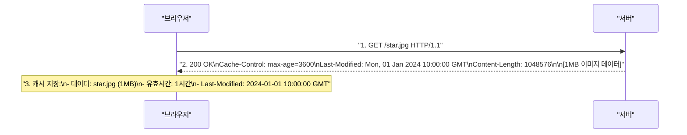
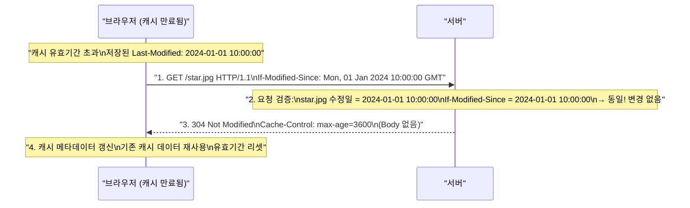
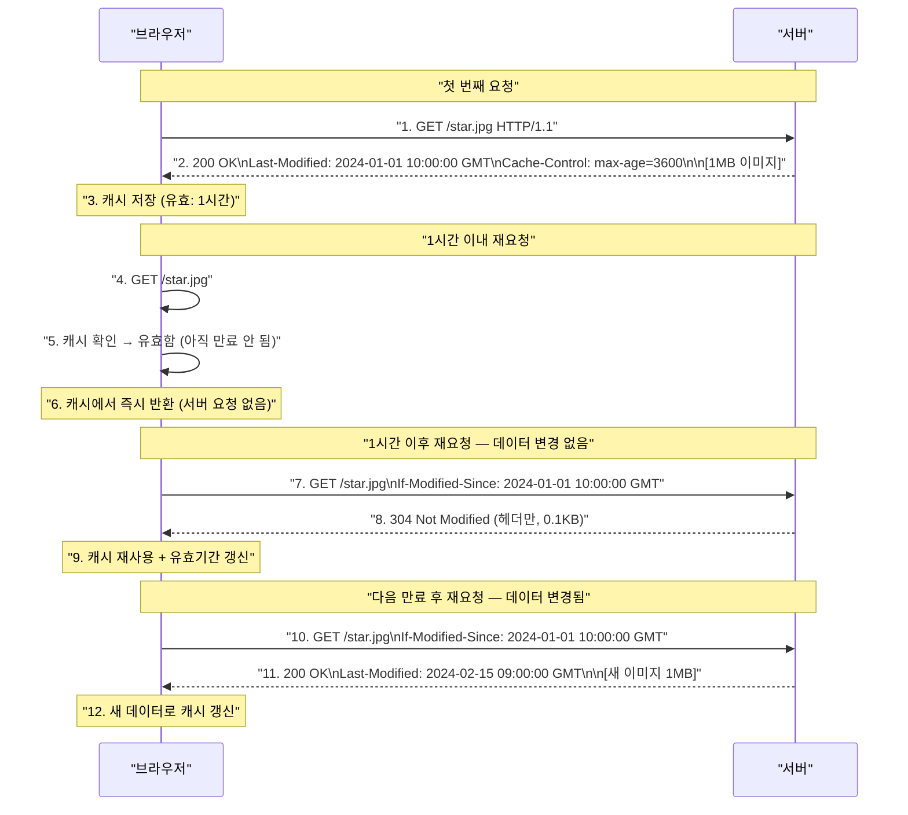
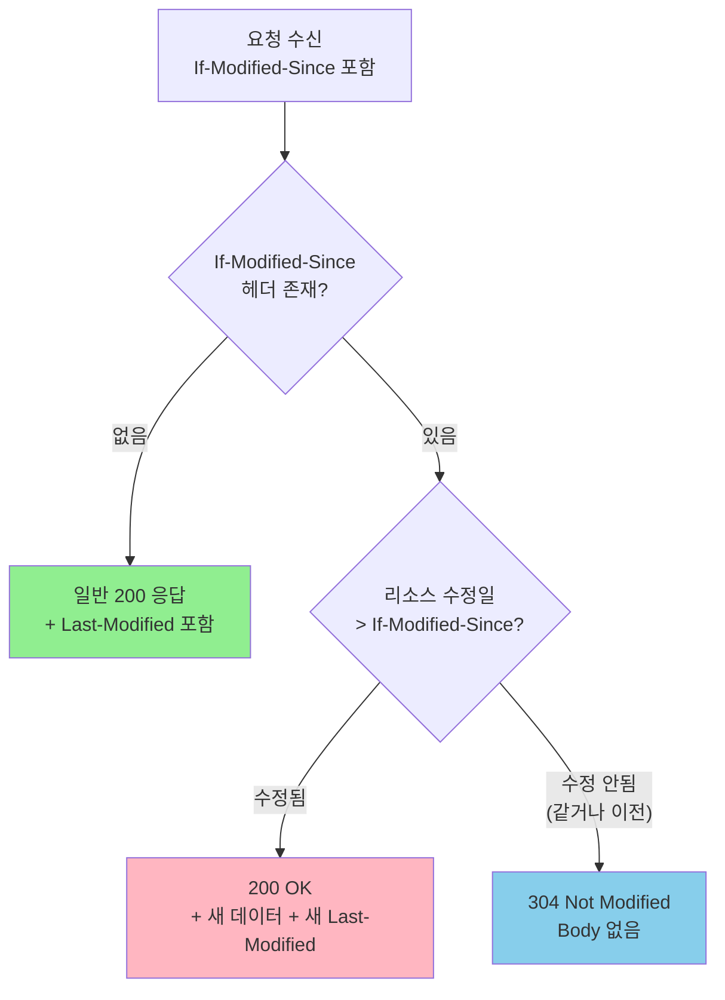
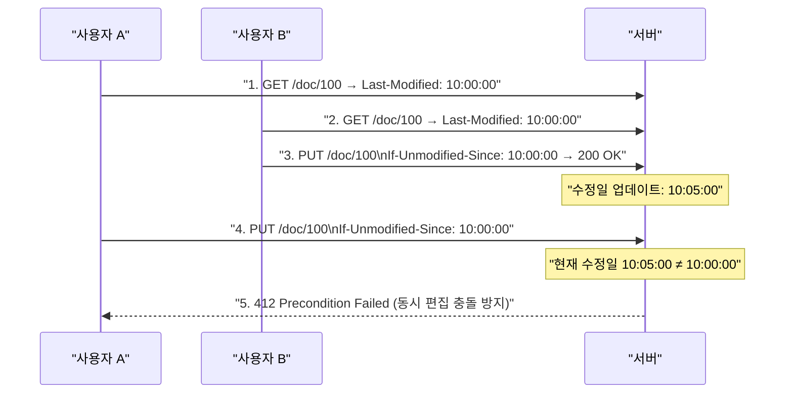

> **한 줄 요약:** 검증 헤더(Last-Modified)와 조건부 요청(If-Modified-Since)을 활용하면 캐시가 만료된 후에도 서버 데이터가 변경되지 않았다면 304 응답으로 바디 전송 없이 캐시를 재사용할 수 있다.

## 비유로 이해하는 캐시 재검증

**도서관 책 반납 시스템**을 생각해보자.

- 책을 빌렸을 때 "최종 개정일: 2024년 1월 1일"이라는 스탬프가 찍혀있다
- 반납 기한이 지나서 다시 빌리러 갔다
- 사서에게 묻는다: "2024년 1월 1일 이후로 이 책이 개정됐나요?"
- 개정이 없다면 → "그냥 계속 보세요. 반납 기한만 연장할게요" (304 Not Modified)
- 개정됐다면 → "새 판본 드릴게요" (200 OK + 새 데이터)

HTTP 조건부 요청도 동일하다. 캐시가 만료됐을 때 서버에 전체 데이터를 다시 요청하는 대신, "혹시 변경됐나요?"라고 먼저 확인한다.

---

## 캐시 시간 초과 후의 두 가지 상황

캐시 유효기간이 지나서 서버에 다시 요청하면 두 가지 상황이 발생한다.

```
상황 1: 서버에서 기존 데이터를 변경함
→ 새 데이터를 다시 다운로드해야 한다 (200 OK + 전체 바디)

상황 2: 서버에서 기존 데이터를 변경하지 않음
→ 기존 캐시를 재사용하면 된다 (304 Not Modified, 바디 없음)
```

**문제:** 브라우저 입장에서는 캐시가 만료됐을 때 서버 데이터가 변경됐는지 알 수 없다.

**해결:** 검증 헤더(Last-Modified)를 사용해 서버에 변경 여부를 확인한다.

---

## 검증 헤더 — Last-Modified

### 첫 번째 요청: 서버가 Last-Modified를 응답에 포함


```mermaid
sequenceDiagram
    participant C as "브라우저"
    participant S as "서버"

    C->>S: "1. GET /star.jpg HTTP/1.1"
    S-->>C: "2. 200 OK\nCache-Control: max-age=3600\nLast-Modified: Mon, 01 Jan 2024 10:00:00 GMT\nContent-Length: 1048576\n\n[1MB 이미지 데이터]"
    Note over C: "3. 캐시 저장:\n- 데이터: star.jpg (1MB)\n- 유효시간: 1시간\n- Last-Modified: 2024-01-01 10:00:00 GMT"
```

서버는 응답에 `Last-Modified` 헤더를 포함해 리소스의 마지막 수정 시각을 알려준다. 브라우저는 이 값을 캐시 메타데이터로 저장한다.

---

## 조건부 요청 — If-Modified-Since

### 캐시 만료 후 재요청


```mermaid
sequenceDiagram
    participant C as "브라우저 (캐시 만료됨)"
    participant S as "서버"

    Note over C: "캐시 유효기간 초과\n저장된 Last-Modified: 2024-01-01 10:00:00"

    C->>S: "1. GET /star.jpg HTTP/1.1\nIf-Modified-Since: Mon, 01 Jan 2024 10:00:00 GMT"
    Note over S: "2. 요청 검증:\nstar.jpg 수정일 = 2024-01-01 10:00:00\nIf-Modified-Since = 2024-01-01 10:00:00\n→ 동일! 변경 없음"
    S-->>C: "3. 304 Not Modified\nCache-Control: max-age=3600\n(Body 없음)"
    Note over C: "4. 캐시 메타데이터 갱신\n기존 캐시 데이터 재사용\n유효기간 리셋"
```

브라우저는 캐시에 저장된 `Last-Modified` 값을 `If-Modified-Since` 헤더에 담아 서버에 보낸다. 서버는 이를 비교해 변경 여부를 확인한다.

---

## 304 Not Modified 응답의 핵심

```http
HTTP/1.1 304 Not Modified
Cache-Control: max-age=3600
Last-Modified: Mon, 01 Jan 2024 10:00:00 GMT
```

**304 응답의 특징:**
- **Body가 없다** → 헤더만 전송 (약 0.1KB)
- 기존 1MB 파일 대신 0.1KB 헤더만 네트워크로 전송
- 브라우저는 응답 헤더를 받아 캐시 메타데이터를 갱신한다
- 기존 캐시에 저장된 데이터(1MB)를 그대로 재사용한다

```
[캐시 미적용]
매 요청마다 1MB + 0.1KB = 1.1MB 전송

[Last-Modified 조건부 요청 — 데이터 변경 없음]
최초 요청: 1MB + 0.1KB = 1.1MB 전송
이후 만료 시: 0.1KB(헤더만) 전송 → 1MB 절감 (약 91% 절감)

[Last-Modified 조건부 요청 — 데이터 변경됨]
최초 요청: 1MB + 0.1KB = 1.1MB 전송
만료 + 변경 시: 1MB + 0.1KB = 1.1MB 전송 (어쩔 수 없음)
```

---

## 전체 캐시 흐름 — 재검증 포함


```mermaid
sequenceDiagram
    participant C as "브라우저"
    participant S as "서버"

    Note over C,S: "첫 번째 요청"
    C->>S: "1. GET /star.jpg HTTP/1.1"
    S-->>C: "2. 200 OK\nLast-Modified: 2024-01-01 10:00:00 GMT\nCache-Control: max-age=3600\n\n[1MB 이미지]"
    Note over C: "3. 캐시 저장 (유효: 1시간)"

    Note over C,S: "1시간 이내 재요청"
    C->>C: "4. GET /star.jpg"
    C->>C: "5. 캐시 확인 → 유효함 (아직 만료 안 됨)"
    Note over C: "6. 캐시에서 즉시 반환 (서버 요청 없음)"

    Note over C,S: "1시간 이후 재요청 — 데이터 변경 없음"
    C->>S: "7. GET /star.jpg\nIf-Modified-Since: 2024-01-01 10:00:00 GMT"
    S-->>C: "8. 304 Not Modified (헤더만, 0.1KB)"
    Note over C: "9. 캐시 재사용 + 유효기간 갱신"

    Note over C,S: "다음 만료 후 재요청 — 데이터 변경됨"
    C->>S: "10. GET /star.jpg\nIf-Modified-Since: 2024-01-01 10:00:00 GMT"
    S-->>C: "11. 200 OK\nLast-Modified: 2024-02-15 09:00:00 GMT\n\n[새 이미지 1MB]"
    Note over C: "12. 새 데이터로 캐시 갱신"
```

---

## 서버 측 처리 로직

서버는 `If-Modified-Since` 헤더를 받으면 다음 로직으로 처리한다.


```mermaid
graph TD
    A["요청 수신\nIf-Modified-Since 포함"] --> B{"If-Modified-Since\n헤더 존재?"}
    B -- "없음" --> C["일반 200 응답\n+ Last-Modified 포함"]
    B -- "있음" --> D{"리소스 수정일\n> If-Modified-Since?"}
    D -- "수정됨" --> E["200 OK\n+ 새 데이터 + 새 Last-Modified"]
    D -- "수정 안됨\n(같거나 이전)" --> F["304 Not Modified\nBody 없음"]
    style F fill:#87CEEB
    style E fill:#FFB6C1
    style C fill:#90EE90
```

---

## Spring에서의 Last-Modified 구현

### WebRequest를 활용한 자동 처리

```java
@GetMapping("/api/articles/{id}")
public ResponseEntity<Article> getArticle(
        @PathVariable Long id,
        WebRequest request) {

    Article article = articleService.findById(id);
    long lastModified = article.getUpdatedAt().toEpochMilli();

    // checkNotModified: If-Modified-Since와 비교 후
    // 변경 없으면 자동으로 304 반환
    if (request.checkNotModified(lastModified)) {
        return null;  // Spring이 304 응답을 자동 생성
    }

    return ResponseEntity.ok()
            .lastModified(lastModified)
            .cacheControl(CacheControl.maxAge(1, TimeUnit.HOURS))
            .body(article);
}
```

### HttpServletRequest 직접 사용

```java
@GetMapping("/files/{filename}")
public ResponseEntity<byte[]> getFile(
        @PathVariable String filename,
        HttpServletRequest request) throws IOException {

    File file = storageService.getFile(filename);
    long lastModifiedMs = file.lastModified();

    // If-Modified-Since 헤더 값 가져오기 (-1이면 헤더 없음)
    long ifModifiedSince = request.getDateHeader("If-Modified-Since");

    // 초 단위로 비교 (HTTP 날짜는 초 단위 정밀도)
    if (ifModifiedSince != -1 &&
            lastModifiedMs / 1000 <= ifModifiedSince / 1000) {
        return ResponseEntity.status(HttpStatus.NOT_MODIFIED).build();
    }

    byte[] content = Files.readAllBytes(file.toPath());

    return ResponseEntity.ok()
            .header(HttpHeaders.LAST_MODIFIED, formatHttpDate(lastModifiedMs))
            .header(HttpHeaders.CACHE_CONTROL, "max-age=3600")
            .contentType(MediaType.IMAGE_PNG)
            .body(content);
}

private String formatHttpDate(long millis) {
    return DateTimeFormatter.RFC_1123_DATE_TIME
            .format(Instant.ofEpochMilli(millis).atZone(ZoneId.of("GMT")));
}
```

### 정적 리소스 자동 설정

Spring Boot는 `src/main/resources/static/` 하위 정적 파일에 Last-Modified를 자동 설정한다.

```yaml
# application.yml
spring:
  web:
    resources:
      cache:
        period: 3600
        cachecontrol:
          max-age: 3600
          must-revalidate: true
```

---

## Last-Modified 날짜 형식

HTTP 날짜는 반드시 **RFC 7231** 형식을 사용해야 한다.

```http
Last-Modified: Tue, 15 Jan 2024 10:30:00 GMT

# 형식 분해
Tue,      = 요일 3글자
15        = 일 (2자리)
Jan       = 월 (3글자 영문 약자)
2024      = 연도 (4자리)
10:30:00  = 시:분:초
GMT       = 타임존 (반드시 GMT/UTC)
```

**주의:** 한국 시간(KST = UTC+9)이 아닌 반드시 GMT(UTC)로 표현해야 한다. 잘못된 시간대를 사용하면 캐시 재검증이 오동작한다.

---

## If-Unmodified-Since — 안전한 업데이트

`If-Modified-Since`의 반대 방향으로 동작하는 헤더다. **변경되지 않았을 때만** 요청을 처리한다.

```http
PUT /documents/100 HTTP/1.1
If-Unmodified-Since: Mon, 01 Jan 2024 10:00:00 GMT
Content-Type: application/json

{"content": "수정된 내용..."}
```


```mermaid
sequenceDiagram
    participant A as "사용자 A"
    participant B as "사용자 B"
    participant S as "서버"

    A->>S: "1. GET /doc/100 → Last-Modified: 10:00:00"
    B->>S: "2. GET /doc/100 → Last-Modified: 10:00:00"
    B->>S: "3. PUT /doc/100\nIf-Unmodified-Since: 10:00:00 → 200 OK"
    Note over S: "수정일 업데이트: 10:05:00"
    A->>S: "4. PUT /doc/100\nIf-Unmodified-Since: 10:00:00"
    Note over S: "현재 수정일 10:05:00 ≠ 10:00:00"
    S-->>A: "5. 412 Precondition Failed (동시 편집 충돌 방지)"
```

이 패턴은 HTTP 레벨에서 **낙관적 잠금(Optimistic Locking)** 을 구현하는 방법이다.

---

## 네트워크 절감 효과

| 상황 | 전송 크기 | 비고 |
|------|---------|------|
| 캐시 없음 (매 요청) | 1.1MB | 헤더 0.1MB + 바디 1MB |
| 캐시 유효 (만료 전) | 0KB | 서버 요청 없음 |
| 캐시 만료 + 데이터 미변경 | 0.1KB | 헤더만 (304) |
| 캐시 만료 + 데이터 변경됨 | 1.1MB | 어쩔 수 없는 전송 |

---

## 핵심 포인트 정리

| 헤더 | 방향 | 역할 |
|------|------|------|
| `Last-Modified` | 응답 | 리소스 마지막 수정 시각 (RFC 7231 형식) |
| `If-Modified-Since` | 요청 | 해당 날짜 이후 변경 여부 확인 |
| `If-Unmodified-Since` | 요청 | 해당 날짜까지 변경 없을 때만 처리 |

- **304 Not Modified** 응답에는 Body가 없다. 헤더만 전송해 네트워크를 절감한다
- `Last-Modified`는 **초 단위** 정밀도만 가진다. 1초 이내 변경은 감지할 수 없다
- 캐시가 만료됐다고 해서 반드시 새 데이터를 내려받는 것이 아니다. **304 → 캐시 재사용**이 일반적이다
- 브라우저는 캐시와 함께 `Last-Modified` 값을 저장해뒀다가, 만료 시 `If-Modified-Since`에 담아 서버에 보낸다
- 서버는 데이터 변경 여부만 확인하고, 변경 없으면 Body 없이 304만 응답한다
