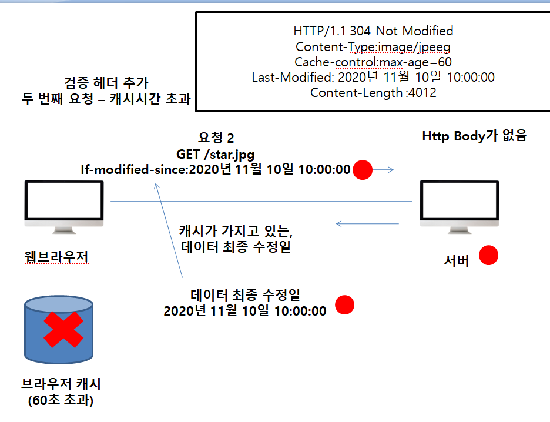

##### 캐시 시간 초과

* 캐시 유효시간이 초과해서 서버에 다시 요청하면 다음 두가지 상황이 나타난다.

  1.  서버에서 기존 데이터를 변경함

  2.  서버에서 기존 데이터를 변경하지 않음

위의 1번 상황을 해결하기 위한 방법이 검증헤더와 조건부 요청이다.

* 캐시 만료후에도 서버에서 데이터를 변경하지 않음.
* 생각해보면 데이터를 전송하는 대신에 저장해 두었던 캐시를 재사용 할 수 있다.
* 단 클라이언트의 데이터와 서버의 데이터가 같다는 사실을 확인 할 수 있는 **방법**이 필요.

이 방법이 **검증헤더**이다.

검증헤더에는 last-modified가 추가 된다.

캐시에 LastModified가 있다면 웹브라우저가 서버에 요청을 보낼때 if-modified-since라는 필드에 날짜를 붙여서 전송한다. 이때 서버는 if-modified-since에 날짜와 기존 star.jpg의 데이터 최종 수정일과 같은지 검증을 한다. 그 후 변경된게 없다면 Http header에 304 Not modified를 응답하며, Body가 존재하지 않게 된다. 클라이언트는 서버가 보낸 응답 헤더 정보로 캐시의 메타정보를 갱신하고, 캐시에 저장되어있는 데이터를 재활용한다.

결과적으로 네트워크 다운로드가 발생하지만 용랴이 적은 헤더 정보만 다운로드 하기에 네트워크 부하율을 크게 줄일 수 있다. 