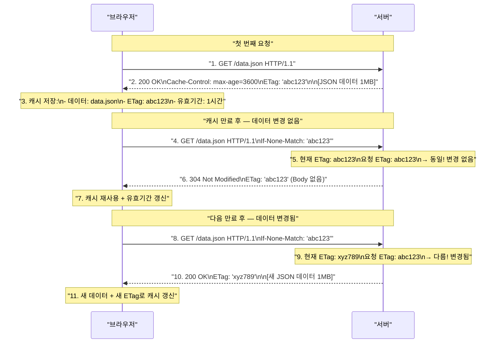
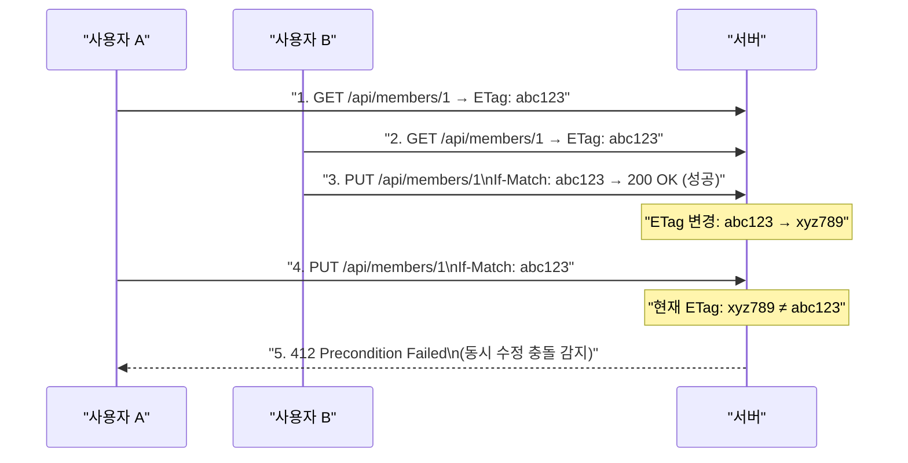

> **한 줄 요약:** ETag는 리소스의 고유한 버전 식별자로, If-None-Match 조건부 요청과 함께 사용하면 Last-Modified의 한계(초 단위 정밀도, 날짜 기반 비교)를 극복하고 정확한 캐시 재검증이 가능하다.

## 비유로 이해하는 ETag

**책의 ISBN 번호**를 생각해보자.

- ISBN은 책의 내용을 기반으로 부여되는 고유 식별자다
- 책 제목이나 출판일이 아닌 **내용 자체**에 대한 식별자다
- 내용이 조금이라도 바뀌면 ISBN이 달라진다
- 날짜와 무관하게 "이 판본이 맞나요?"를 확인할 수 있다

ETag도 마찬가지다. 리소스의 **내용**을 기반으로 생성된 해시 값으로, 내용이 변경되면 ETag가 달라진다. 날짜가 아닌 내용 기반이므로 훨씬 정밀한 검증이 가능하다.

---

## Last-Modified의 한계점

ETag가 나온 배경을 이해하려면 먼저 Last-Modified의 한계를 알아야 한다.

### 한계 1: 1초 미만 변경 감지 불가

```
상황: 0.5초 간격으로 파일이 두 번 수정됨
Last-Modified: Mon, 01 Jan 2024 10:00:00 GMT  ← 두 수정 모두 같은 초

결과: 두 번째 수정이 감지되지 않음 → 구버전 캐시 재사용 오류
```

### 한계 2: 내용은 같고 날짜만 바뀐 경우

```
상황: 파일을 열고 그냥 저장 (내용 변경 없음)
수정 전: Last-Modified = Mon, 01 Jan 2024 10:00:00
수정 후: Last-Modified = Mon, 01 Jan 2024 11:00:00

결과: 서버는 변경됐다고 판단 → 동일한 1MB 파일을 다시 전송 (불필요한 트래픽)
```

### 한계 3: 서버가 날짜 기반이 아닌 버전 관리를 하고 싶은 경우

```
상황: 이벤트 오픈 기간(3일) 동안 파일이 바뀌어도
      캐시는 유지하고 싶음

Last-Modified로는 불가능 → 파일 수정 시 날짜가 자동으로 바뀌기 때문
```

---

## ETag (Entity Tag)

### ETag란?

```http
HTTP/1.1 200 OK
Content-Type: image/png
Content-Length: 1048576
Cache-Control: max-age=3600
ETag: "33a64df551425fcc55e4d42a148795d9f25f89d4"

[이미지 데이터]
```

- `ETag`는 리소스의 특정 버전에 대한 **고유 식별자**다
- 일반적으로 파일 내용의 **해시값** 또는 버전 번호로 생성한다
- 내용이 조금이라도 달라지면 ETag가 변경된다
- 서버가 ETag 생성 방식을 완전히 제어할 수 있다

### ETag 형식

```http
# 강한 ETag (Strong ETag) — 내용이 완전히 동일할 때만 일치
ETag: "33a64df551425fcc55e4d42a148795d9f25f89d4"
ETag: "v2.3.1"
ETag: "abc123xyz"

# 약한 ETag (Weak ETag) — 의미상 동일하면 일치 (W/ 접두사)
ETag: W/"0815"
ETag: W/"v2.3"
```

---

## If-None-Match로 조건부 요청



---

## ETag vs Last-Modified 비교

| 항목 | Last-Modified | ETag |
|------|--------------|------|
| 기반 | 날짜/시간 | 내용 해시 또는 버전 |
| 정밀도 | 초 단위 | 바이트 단위 |
| 1초 이내 변경 감지 | 불가 | 가능 |
| 내용 동일, 날짜만 변경 | 불필요한 재전송 | 304 정확히 반환 |
| 서버 커스텀 로직 | 어려움 | 자유롭게 구현 가능 |
| 서버 부하 | 낮음 (파일 시스템 날짜) | 높을 수 있음 (해시 계산) |
| 복수 서버 환경 | 시간 동기화 필요 | 해시 기반이면 자연스럽게 동기화 |
| HTTP 버전 | 1.0부터 | 1.1부터 |

**권장:** 가능하면 ETag를 사용하고, Last-Modified는 하위 호환용으로 함께 제공한다.

---

## ETag 서버 구현 방식

### 방법 1: 파일 해시 기반

```java
@GetMapping("/files/{filename}")
public ResponseEntity<byte[]> getFile(
        @PathVariable String filename,
        @RequestHeader(value = "If-None-Match",
                       required = false) String ifNoneMatch) throws IOException {

    byte[] content = storageService.readFile(filename);

    // 파일 내용의 SHA-256 해시로 ETag 생성
    String etag = "\"" + computeSha256(content) + "\"";

    // If-None-Match 비교
    if (etag.equals(ifNoneMatch)) {
        return ResponseEntity.status(HttpStatus.NOT_MODIFIED)
                .header(HttpHeaders.ETAG, etag)
                .build();
    }

    return ResponseEntity.ok()
            .header(HttpHeaders.ETAG, etag)
            .header(HttpHeaders.CACHE_CONTROL, "max-age=3600")
            .contentType(MediaType.APPLICATION_OCTET_STREAM)
            .body(content);
}

private String computeSha256(byte[] data) {
    try {
        MessageDigest digest = MessageDigest.getInstance("SHA-256");
        byte[] hash = digest.digest(data);
        return HexFormat.of().formatHex(hash);
    } catch (NoSuchAlgorithmException e) {
        throw new RuntimeException(e);
    }
}
```

### 방법 2: 버전 필드 기반

```java
@GetMapping("/api/members/{id}")
public ResponseEntity<Member> getMember(
        @PathVariable Long id,
        @RequestHeader(value = "If-None-Match",
                       required = false) String ifNoneMatch) {

    Member member = memberService.findById(id);

    // DB의 version 컬럼 또는 updatedAt 기반 ETag
    String etag = "\"" + member.getVersion() + "\"";

    if (etag.equals(ifNoneMatch)) {
        return ResponseEntity.status(HttpStatus.NOT_MODIFIED)
                .header(HttpHeaders.ETAG, etag)
                .build();
    }

    return ResponseEntity.ok()
            .header(HttpHeaders.ETAG, etag)
            .header(HttpHeaders.CACHE_CONTROL, "private, max-age=60")
            .body(member);
}
```

### 방법 3: ShallowEtagHeaderFilter (Spring 자동 처리)

```java
@Configuration
public class CacheConfig {

    // 응답 바디를 자동으로 해싱해 ETag 생성 및 비교
    @Bean
    public ShallowEtagHeaderFilter shallowEtagHeaderFilter() {
        return new ShallowEtagHeaderFilter();
    }
}
```

`ShallowEtagHeaderFilter`는 응답 바디의 MD5 해시로 ETag를 자동 생성하고, `If-None-Match`와 비교해 304를 자동으로 반환한다. 단, 바디를 메모리에 버퍼링하므로 대용량 파일에는 주의가 필요하다.

---

## ETag 활용 — 서버 커스텀 캐시 로직

ETag의 가장 큰 장점은 **서버가 캐시 무효화 시점을 직접 제어**할 수 있다는 것이다.

```java
// 예시: 이벤트 오픈 기간(3일) 동안 파일이 바뀌어도 동일한 ETag 유지
@GetMapping("/event/banner")
public ResponseEntity<byte[]> getEventBanner(
        @RequestHeader(value = "If-None-Match",
                       required = false) String ifNoneMatch) {

    EventPeriod period = eventService.getCurrentPeriod();

    // 파일 내용이 아닌 이벤트 기간 ID로 ETag 결정
    // → 기간이 바뀔 때만 캐시 무효화
    String etag = "\"event-period-" + period.getId() + "\"";

    if (etag.equals(ifNoneMatch)) {
        return ResponseEntity.status(HttpStatus.NOT_MODIFIED)
                .header(HttpHeaders.ETAG, etag)
                .build();
    }

    byte[] banner = storageService.readBanner();
    return ResponseEntity.ok()
            .header(HttpHeaders.ETAG, etag)
            .header(HttpHeaders.CACHE_CONTROL, "max-age=300")
            .contentType(MediaType.IMAGE_PNG)
            .body(banner);
}
```

---

## ETag와 Last-Modified 함께 사용하기

두 헤더를 함께 사용하면 호환성과 정밀도를 모두 확보할 수 있다.

```http
HTTP/1.1 200 OK
Content-Type: application/json
Cache-Control: max-age=3600
ETag: "33a64df551425fcc55e4d42a148795d9f25f89d4"
Last-Modified: Mon, 01 Jan 2024 10:00:00 GMT

{"id": 1, "name": "홍길동"}
```

클라이언트는 두 헤더를 모두 캐시에 저장하고, 재검증 요청 시 둘 다 보낸다.

```http
GET /api/members/1 HTTP/1.1
If-None-Match: "33a64df551425fcc55e4d42a148795d9f25f89d4"
If-Modified-Since: Mon, 01 Jan 2024 10:00:00 GMT
```

서버는 두 조건 모두 확인하며, HTTP 표준에 따르면 **ETag(If-None-Match)가 우선**한다.

---

## If-Match — 낙관적 잠금 구현

`If-None-Match`의 반대 방향이다. **지정된 ETag와 일치할 때만** 요청을 처리한다.

```http
PUT /api/members/1 HTTP/1.1
If-Match: "abc123"
Content-Type: application/json

{"name": "홍길동 수정"}
```



REST API에서 동시 수정을 방지하는 표준 패턴이다. DB의 낙관적 잠금(@Version)을 HTTP 레벨로 확장한 형태다.

---

## 조건부 요청 헤더 정리

| 요청 헤더 | 쌍이 되는 응답 헤더 | 의미 | 주요 용도 |
|----------|------------------|------|---------|
| `If-None-Match` | `ETag` | ETag가 다를 때만 처리 | GET 캐시 재검증 |
| `If-Match` | `ETag` | ETag가 같을 때만 처리 | PUT/PATCH 낙관적 잠금 |
| `If-Modified-Since` | `Last-Modified` | 날짜 이후 변경 시 처리 | GET 캐시 재검증 |
| `If-Unmodified-Since` | `Last-Modified` | 날짜까지 미변경 시 처리 | PUT/PATCH 낙관적 잠금 |

---

## 핵심 포인트 정리

- **ETag**는 리소스 내용 기반의 고유 식별자다. 날짜가 아닌 내용이 바뀔 때 변경된다
- **If-None-Match** 조건부 요청으로 캐시 재검증 시 ETag가 같으면 304, 다르면 200을 반환한다
- `Last-Modified`는 초 단위 한계가 있고 재저장 시 오작동할 수 있어 **ETag가 더 정밀하다**
- 서버는 ETag 생성 로직을 완전히 제어할 수 있다 (해시, 버전 번호, 이벤트 기간 등)
- **If-None-Match와 If-Modified-Since**를 함께 보낸 경우 서버는 ETag를 우선 처리한다
- **If-Match**는 PUT/PATCH에서 낙관적 잠금을 구현하는 표준 방법이다
- Spring `ShallowEtagHeaderFilter`로 ETag 처리를 자동화할 수 있다 (소용량 리소스 권장)
