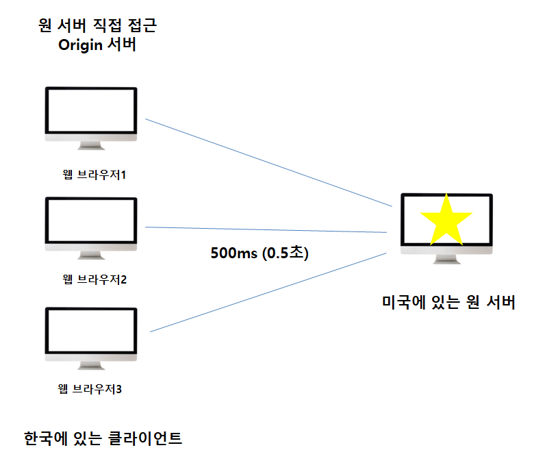
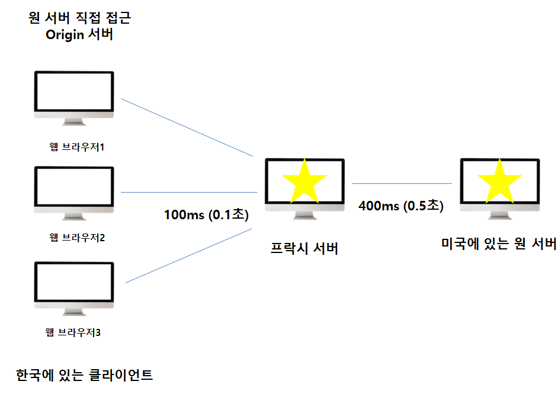
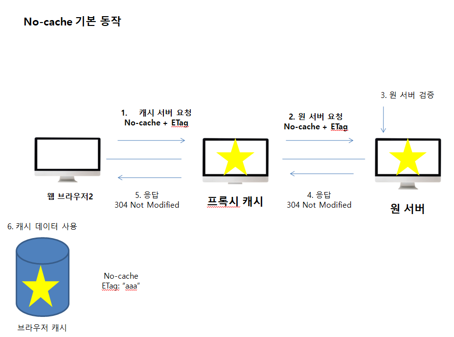
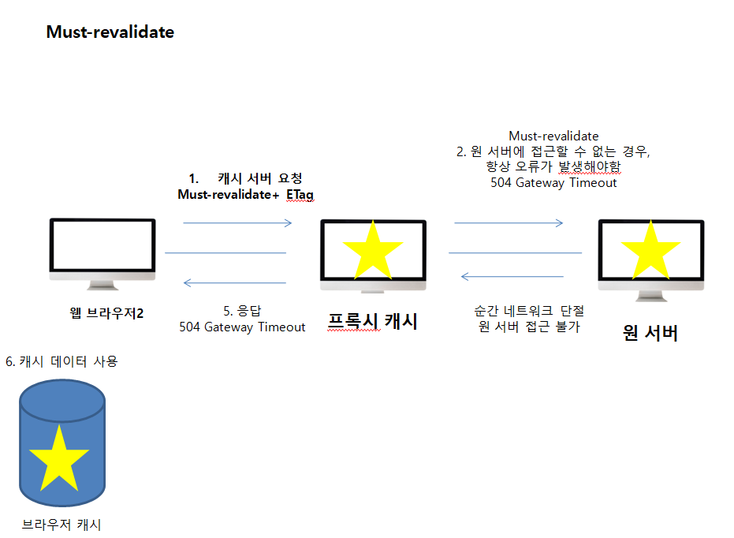

#### 캐시 제어 헤더

* **Cache-Control : 캐시 제어** 

  * Cache-Control : max-age : 캐시 유효 시간, 초단위

  * Cache-Control : no-cache : 데이터는 캐시해도 되지만, 항상 원(origin) 서버에 검증하고 사용

  * Cache-Control : no-store : 데이터에 민감한 정보가 있으므로 저장하면 안됨 

  * Cache-Control: public : 응답이 public 캐시에 저장되어도 됨

  * Cache-Control: private : 응답이 해당 사용자만을 위한 것임, private 캐시에 저장해야 함 (기본값)

  * Cache-Control: s-maxage : 프록시 캐시에만 적용되는 max-age

  * Age: 60 (HTTP 헤더) : 오리진 서버에서 응답 후 프록시 캐시 내에 머문 시간(초)

    (메모리에서 사용하고 최대한 빨리 삭제)

    

* **Pragma : 캐시 제어 (하위 호환)**

  * Pragma : no-cache

  * HTTP 1.0 하위 호환

    

* **Expires : 캐시 유효 기간 (하위 호환**) : 캐시 만료일 지정

  * expires : Mon, 01 Jan 1990 00:00:00 GMT
  * 캐시 만료일을 정확한 날짜로 지정
  * HTTP 1.0부터 사용
  * 지금은 더 유연한 Cache-Control : max-age 권장
  * Cache-Control : max-age와 함께 사용하면 Expires는 무시

#### 프록시 캐시 

미국에 있는 원서버를 통해 실제 데이터를 받으려면 한국에서 브라우저당 약 0.5초를 소요한다.

하지만 아래와 같이 프록시 캐시 서버를 한국 어딘가에 도입하게 되면 더 빠른 속도로 데이터를 받을 수 있다.

#### 캐시 무효화

확실한 캐시 무효화 응답

* **Cache-Control**

  * no-cache

    * 데이터는 캐시해도 되지만, 항상 원 서버에 검증하고 사용

  * no-store

    * 데이터에 민감항 정보가 있으므로 저장하면 안됨 (메모리에서 사용하고 최대한 빨리 삭제)

  * must-revalidate

    * 캐시 만료후 최초 조회 시 원 서버에 검증해야함
    * 원 서버 접근 실패시 반드시 오류가 발생해야함 - 504(Gateway Timeout)
    * must-revalidate는 캐시 유효 시간이라면 캐시를 사용함

    

* **Pragma : no-cache**

  * HTTP 1.0 하위 호환

만약 no-cache인 경우 순간적으로 네트워크가 단절되어 원서버에 접근이 불가한 경우에 캐시 서버 설정에 따라서 캐시데이터를 반환 할 수 있다.

