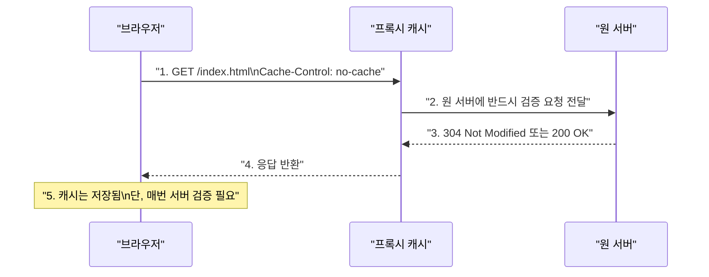
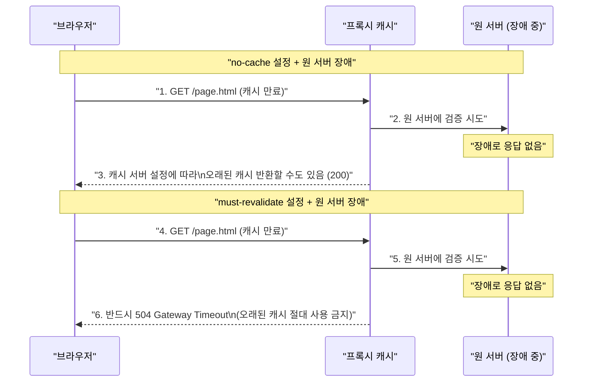
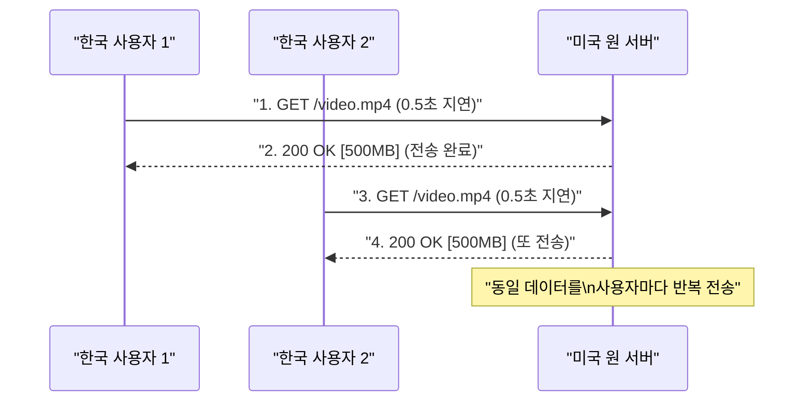
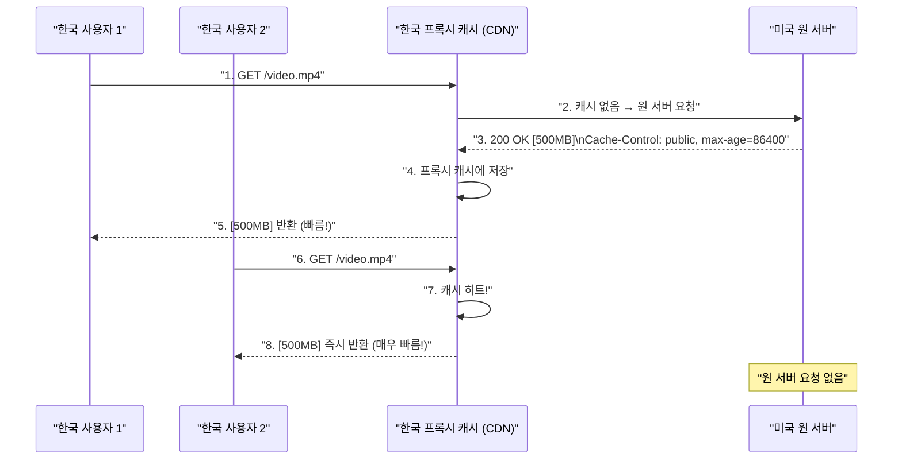
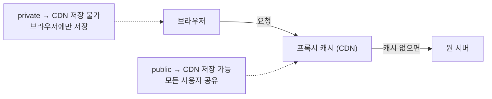
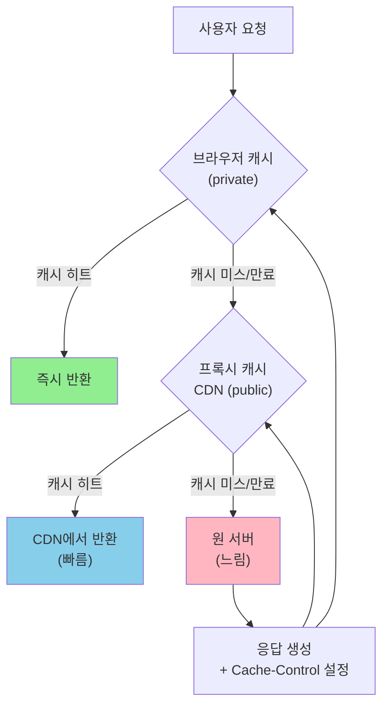

> **한 줄 요약:** Cache-Control 지시어로 캐시 유효기간과 공개 범위를 제어하고, 프록시 캐시를 활용해 글로벌 응답 속도를 높이며, must-revalidate로 만료된 캐시의 오사용을 방지한다.

## 비유로 이해하는 프록시 캐시

**편의점 물류 시스템**을 생각해보자.

- **원(Origin) 서버**: 미국 본사 창고 (거리가 멀어 배송에 0.5초)
- **프록시 캐시 서버**: 한국 물류 창고 (가까워서 0.01초)
- **브라우저 캐시**: 내 집 냉장고 (즉시 꺼내 쓸 수 있음)

미국 창고에서 직접 가져오면 느리지만, 한국 물류 창고에 자주 팔리는 상품을 미리 채워두면 훨씬 빠르게 받을 수 있다. YouTube 영상, Netflix 콘텐츠가 한국에서 빠른 이유도 이 프록시(CDN) 캐시 덕분이다.

---

## 캐시 제어 헤더 전체 목록

### Cache-Control 주요 지시어

```http
# 유효 시간 제어
Cache-Control: max-age=3600          # 3600초(1시간) 동안 캐시 유효
Cache-Control: s-maxage=86400        # 프록시 캐시에만 적용되는 max-age

# 캐시 여부 제어
Cache-Control: no-store              # 캐시 자체를 금지 (민감한 데이터)
Cache-Control: no-cache              # 캐시하되 매번 원 서버에 검증

# 공개 범위 제어
Cache-Control: public                # CDN 등 공유 캐시에 저장 허용
Cache-Control: private               # 브라우저 캐시에만 저장 (기본값)

# 재검증 강제
Cache-Control: must-revalidate       # 만료 후 원 서버에 반드시 재검증
Cache-Control: proxy-revalidate      # 프록시 캐시만 재검증 강제
Cache-Control: immutable             # 유효기간 내에는 절대 변경되지 않음
```

---

## 지시어 상세 설명

### max-age

```http
Cache-Control: max-age=3600
```

- 리소스를 받은 시점부터 **3600초(1시간)** 동안 캐시가 유효하다
- 유효기간 내에는 서버에 요청하지 않고 캐시를 바로 사용한다
- 정적 리소스(이미지, CSS, JS)에 적합하다

### no-cache

```http
Cache-Control: no-cache
```

이름에 "no-cache"가 있지만 **"캐시 안 함"이 아니다.**


```mermaid
sequenceDiagram
    participant C as "브라우저"
    participant P as "프록시 캐시"
    participant S as "원 서버"

    C->>P: "1. GET /index.html\nCache-Control: no-cache"
    P->>S: "2. 원 서버에 반드시 검증 요청 전달"
    S-->>P: "3. 304 Not Modified 또는 200 OK"
    P-->>C: "4. 응답 반환"
    Note over C: "5. 캐시는 저장됨\n단, 매번 서버 검증 필요"
```

- 캐시에 저장은 한다
- 하지만 사용할 때마다 **원 서버에 변경 여부를 반드시 확인**한다
- 자주 바뀌는 동적 콘텐츠 (HTML, API 응답)에 적합하다

### no-store

```http
Cache-Control: no-store
```

- 캐시 자체를 완전히 금지한다
- 저장도 하지 않고, 매번 서버에서 새로 받는다
- 금융 정보, 개인 데이터 등 민감한 정보에 사용한다

### must-revalidate

```http
Cache-Control: max-age=3600, must-revalidate
```

- 캐시 유효기간 내에는 정상적으로 캐시를 사용한다
- **유효기간이 지난 후** 원 서버에 재검증을 강제한다
- 원 서버에 접근할 수 없을 때 **반드시 오류(504 Gateway Timeout)** 를 반환한다

---

## no-cache vs must-revalidate — 네트워크 단절 시 차이

이 두 지시어의 중요한 차이점은 **원 서버 접근 불가 상황**에서 나타난다.


```mermaid
sequenceDiagram
    participant C as "브라우저"
    participant P as "프록시 캐시"
    participant S as "원 서버 (장애 중)"

    Note over C,S: "no-cache 설정 + 원 서버 장애"
    C->>P: "1. GET /page.html (캐시 만료)"
    P->>S: "2. 원 서버에 검증 시도"
    Note over S: "장애로 응답 없음"
    P-->>C: "3. 캐시 서버 설정에 따라\n오래된 캐시 반환할 수도 있음 (200)"

    Note over C,S: "must-revalidate 설정 + 원 서버 장애"
    C->>P: "4. GET /page.html (캐시 만료)"
    P->>S: "5. 원 서버에 검증 시도"
    Note over S: "장애로 응답 없음"
    P-->>C: "6. 반드시 504 Gateway Timeout\n(오래된 캐시 절대 사용 금지)"
```

| 상황 | no-cache | must-revalidate |
|------|---------|----------------|
| 유효기간 내 | 매번 서버 검증 | 캐시 바로 사용 |
| 만료 후 서버 정상 | 서버 검증 후 사용 | 서버 검증 후 사용 |
| 만료 후 서버 장애 | 오래된 캐시 반환 가능 | **504 오류 반환** (절대 오래된 캐시 사용 안 함) |

**결론:**
- 데이터 정합성이 매우 중요하다 → `must-revalidate`
- 일시적 서버 장애 시 오래된 데이터라도 보여줘도 된다 → `no-cache`

---

## 프록시 캐시 (CDN)

### 프록시 캐시가 없는 경우


```mermaid
sequenceDiagram
    participant K1 as "한국 사용자 1"
    participant K2 as "한국 사용자 2"
    participant S as "미국 원 서버"

    K1->>S: "1. GET /video.mp4 (0.5초 지연)"
    S-->>K1: "2. 200 OK [500MB] (전송 완료)"
    K2->>S: "3. GET /video.mp4 (0.5초 지연)"
    S-->>K2: "4. 200 OK [500MB] (또 전송)"
    Note over S: "동일 데이터를\n사용자마다 반복 전송"
```

### 프록시 캐시 도입 후


```mermaid
sequenceDiagram
    participant K1 as "한국 사용자 1"
    participant K2 as "한국 사용자 2"
    participant P as "한국 프록시 캐시 (CDN)"
    participant S as "미국 원 서버"

    K1->>P: "1. GET /video.mp4"
    P->>S: "2. 캐시 없음 → 원 서버 요청"
    S-->>P: "3. 200 OK [500MB]\nCache-Control: public, max-age=86400"
    P->>P: "4. 프록시 캐시에 저장"
    P-->>K1: "5. [500MB] 반환 (빠름!)"

    K2->>P: "6. GET /video.mp4"
    P->>P: "7. 캐시 히트!"
    P-->>K2: "8. [500MB] 즉시 반환 (매우 빠름!)"
    Note over S: "원 서버 요청 없음"
```

**프록시 캐시 효과:**
- 원 서버 부하 감소
- 사용자 응답 속도 향상 (지리적으로 가까운 캐시 서버 사용)
- 네트워크 비용 절감

### public vs private

```http
# public: CDN, 프록시 등 공유 캐시에 저장 허용
# 누구나 접근하는 공개 콘텐츠 (이미지, JS, CSS, 공개 API)
Cache-Control: public, max-age=86400

# private: 브라우저 캐시에만 저장 (개인 데이터)
# CDN이 이 응답을 캐시하면 다른 사람에게 개인정보가 노출될 위험
Cache-Control: private, max-age=3600
```


```mermaid
graph LR
    A["브라우저"] -->|"요청"| B["프록시 캐시 (CDN)"]
    B -->|"캐시 없으면"| C["원 서버"]

    D["public → CDN 저장 가능\n모든 사용자 공유"] -.-> B
    E["private → CDN 저장 불가\n브라우저에만 저장"] -.-> A
```

---

## s-maxage — 프록시 전용 유효기간

```http
Cache-Control: s-maxage=86400, max-age=3600
```

- `s-maxage`: 프록시(공유) 캐시에서의 유효기간 (86400초 = 1일)
- `max-age`: 브라우저(개인) 캐시에서의 유효기간 (3600초 = 1시간)
- 브라우저와 CDN에 **서로 다른 유효기간**을 지정할 때 사용한다

---

## Age 헤더

```http
Age: 1800
```

- 원 서버에서 응답이 생성된 후 프록시 캐시에 머문 시간(초)
- 위 예시: 원 서버에서 30분 전에 받아 프록시가 보관 중
- CDN이 자동으로 추가하는 헤더다

---

## 레거시 캐시 헤더 — Pragma, Expires

### Expires (HTTP 1.0)

```http
Expires: Mon, 01 Jan 2025 00:00:00 GMT
```

- HTTP/1.0의 캐시 방식이다
- **절대 날짜**로 만료 시점을 지정한다
- `Cache-Control: max-age`와 함께 사용하면 **max-age가 우선**한다
- 현재는 `Cache-Control: max-age` 사용을 권장한다

```
문제점:
- 서버 시간과 클라이언트 시간이 다를 수 있다
- "2025년 1월 1일"이 지나면 갱신하기 전까지 항상 만료 상태
→ max-age=3600처럼 상대적 시간이 훨씬 유연하다
```

### Pragma (HTTP 1.0)

```http
Pragma: no-cache
```

- HTTP/1.0 하위 호환용이다
- 현재는 `Cache-Control: no-cache`를 사용한다
- 구형 프록시 호환이 필요할 때만 함께 사용한다

---

## 캐시 무효화 — 확실한 설정

특정 리소스가 **절대로 캐시되어서는 안 될 때** 사용하는 완전한 무효화 설정이다.

```http
Cache-Control: no-cache, no-store, must-revalidate
Pragma: no-cache
Expires: 0
```

**각 지시어의 역할:**
- `no-cache`: 캐시하더라도 매번 서버 검증
- `no-store`: 아예 캐시에 저장 금지
- `must-revalidate`: 만료 후 서버 검증 강제
- `Pragma: no-cache`: HTTP/1.0 구형 프록시 호환
- `Expires: 0`: HTTP/1.0 구형 클라이언트 호환

---

## 리소스 유형별 캐시 전략

### 정적 리소스 — 파일명에 해시 포함

```html
<!-- 배포마다 파일명이 바뀌어 캐시가 자동 무효화됨 -->
<link rel="stylesheet" href="/css/style.a1b2c3d4.css">
<script src="/js/app.e5f6g7h8.js"></script>

```

```http
# 파일명이 바뀌면 새로운 URL이므로 캐시가 자동 무효화됨
# 따라서 유효기간을 최대로 설정해도 안전
Cache-Control: public, max-age=31536000, immutable
```

### HTML 파일 — 항상 최신 버전 확인

```http
# HTML은 정적 리소스 파일명을 참조하므로 항상 최신이어야 함
Cache-Control: no-cache
```

### API 응답 — 용도에 맞게 설정

```http
# 공개 API (누구나 같은 응답)
Cache-Control: public, max-age=60

# 사용자별 개인 API
Cache-Control: private, max-age=300

# 실시간 데이터 (항상 최신)
Cache-Control: no-store

# 자주 바뀌지만 캐시 효과 원함
Cache-Control: private, no-cache, max-age=0
```

---

## 캐시 계층 구조


```mermaid
graph TD
    A["사용자 요청"] --> B{"브라우저 캐시\n(private)"}
    B -- "캐시 히트" --> Z["즉시 반환"]
    B -- "캐시 미스/만료" --> C{"프록시 캐시\nCDN (public)"}
    C -- "캐시 히트" --> Y["CDN에서 반환\n(빠름)"]
    C -- "캐시 미스/만료" --> D["원 서버\n(느림)"]
    D --> E["응답 생성\n+ Cache-Control 설정"]
    E --> C
    E --> B

    style Z fill:#90EE90
    style Y fill:#87CEEB
    style D fill:#FFB6C1
```

---

## Spring에서의 캐시 제어 전체 설정

```java
@Configuration
@EnableWebMvc
public class WebConfig implements WebMvcConfigurer {

    @Override
    public void addResourceHandlers(ResourceHandlerRegistry registry) {
        // 정적 리소스 (해시 파일명 포함) — 1년 캐시
        registry.addResourceHandler("/static/**")
                .addResourceLocations("classpath:/static/")
                .setCacheControl(CacheControl.maxAge(365, TimeUnit.DAYS)
                        .cachePublic()
                        .immutable());

        // 일반 정적 리소스 — 1시간 캐시
        registry.addResourceHandler("/assets/**")
                .addResourceLocations("classpath:/assets/")
                .setCacheControl(CacheControl.maxAge(1, TimeUnit.HOURS)
                        .cachePublic());
    }
}

@RestController
public class ApiController {

    // 공개 데이터 — CDN 캐시 허용
    @GetMapping("/api/products")
    public ResponseEntity<List<Product>> getProducts() {
        List<Product> products = productService.findAll();
        return ResponseEntity.ok()
                .cacheControl(CacheControl.maxAge(5, TimeUnit.MINUTES).cachePublic())
                .body(products);
    }

    // 개인 데이터 — 브라우저 캐시만
    @GetMapping("/api/my/orders")
    public ResponseEntity<List<Order>> getMyOrders() {
        List<Order> orders = orderService.findByCurrentUser();
        return ResponseEntity.ok()
                .cacheControl(CacheControl.maxAge(1, TimeUnit.MINUTES).cachePrivate())
                .body(orders);
    }

    // 캐시 금지 (실시간 데이터)
    @GetMapping("/api/stock/price")
    public ResponseEntity<StockPrice> getStockPrice() {
        StockPrice price = stockService.getCurrentPrice();
        return ResponseEntity.ok()
                .cacheControl(CacheControl.noStore())
                .body(price);
    }

    // 민감 데이터 — 완전 무효화
    @GetMapping("/api/my/account")
    public ResponseEntity<Account> getAccount() {
        Account account = accountService.findByCurrentUser();
        return ResponseEntity.ok()
                .cacheControl(CacheControl.noStore()
                        .noCache()
                        .mustRevalidate())
                .body(account);
    }
}
```

---

## 캐시 제어 헤더 전체 요약

| 헤더 | 역할 | HTTP 버전 |
|------|------|---------|
| `Cache-Control` | 캐시 정책 통합 제어 | 1.1 |
| `Pragma` | 구형 프록시 하위 호환 | 1.0 |
| `Expires` | 절대 날짜로 만료 지정 | 1.0 |
| `Age` | 프록시가 보관한 시간 | 1.1 |

| Cache-Control 지시어 | 설명 |
|---------------------|------|
| `max-age=N` | N초 동안 캐시 유효 |
| `s-maxage=N` | 프록시 캐시 유효기간 (max-age 오버라이드) |
| `no-cache` | 캐시하되 매번 원 서버에 검증 |
| `no-store` | 캐시 완전 금지 |
| `public` | 공유(프록시) 캐시 저장 허용 |
| `private` | 브라우저 캐시만 허용 (기본값) |
| `must-revalidate` | 만료 후 원 서버 재검증 강제. 실패 시 504 |
| `proxy-revalidate` | 프록시에만 재검증 강제 |
| `immutable` | 유효기간 내 절대 변경 없음 (조건부 요청도 안 보냄) |

---

## 핵심 포인트 정리

- **no-cache**는 "캐시 안 함"이 아니다. "캐시하되 매번 서버 검증"이다
- **no-store**가 진짜 "캐시 안 함"이다. 민감한 데이터에 사용한다
- **must-revalidate**는 만료 후 원 서버 장애 시 504를 반환한다. no-cache는 오래된 캐시를 반환할 수 있다
- **public/private** 구분이 중요하다. 개인 데이터에 public을 설정하면 CDN이 다른 사용자에게 노출한다
- **프록시 캐시(CDN)** 는 원 서버 부하를 줄이고 지리적으로 가까운 캐시에서 빠르게 응답한다
- 정적 리소스는 **파일명에 해시**를 넣고 `max-age=31536000, immutable`로 설정하는 것이 권장 전략이다
- HTML은 `no-cache`로 설정해 항상 최신 파일명(해시 포함)을 참조하도록 한다
