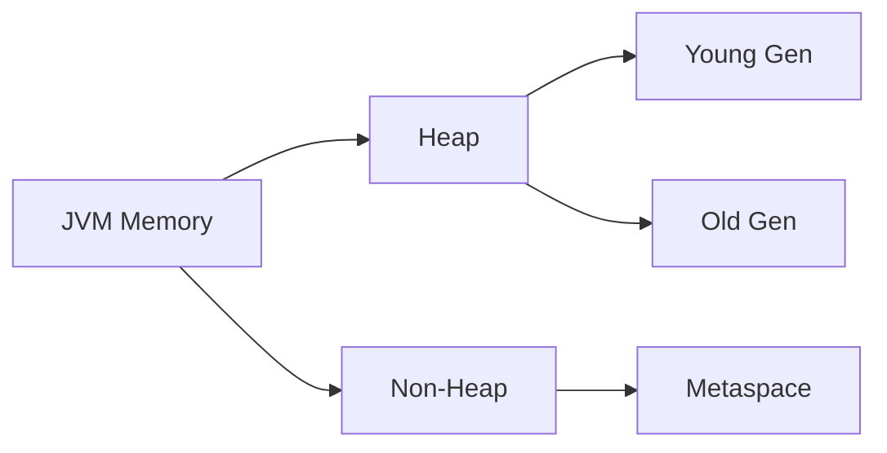
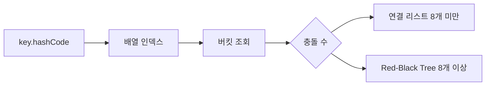

Java 면접은 단순 문법 암기가 아닙니다. JVM 내부 동작, 동시성 원리, 자료구조 내부 구조를 이해하고 있는가를 봅니다. 이 글은 시니어 Java 개발자가 실제로 받은 면접 질문 50개를 카테고리별로 정리하고, 각 질문의 실무 연결점까지 설명합니다.

---

## 1. JVM 메모리 구조 (Q1 ~ Q10)

### Q1. JVM 메모리 구조를 설명하세요

**모범 답변**

JVM 메모리는 크게 다음 영역으로 구분됩니다.



**Heap 영역:**
- **Young Generation**: Eden + Survivor(S0, S1). 새로 생성된 객체가 위치. Minor GC 발생
- **Old Generation**: Young에서 살아남은 객체가 승격. Major/Full GC 발생

**Non-Heap 영역:**
- **Metaspace** (Java 8+): 클래스 메타데이터 저장. Java 7의 PermGen을 대체. 네이티브 메모리 사용
- **Code Cache**: JIT 컴파일된 코드
- **Stack**: 스레드별 독립. 메서드 호출 프레임, 지역 변수
- **PC Register**: 현재 실행 중인 JVM 명령어 주소

> **비유:** JVM 메모리는 회사 건물입니다. Heap은 공유 사무실(모든 스레드가 접근), Stack은 개인 책상(스레드마다 독립), Metaspace는 도서관(클래스 정보 보관)

<details>
<summary>면접 포인트 펼치기</summary>

**꼬리질문:** Java 8에서 PermGen이 Metaspace로 바뀐 이유는?

PermGen은 고정 크기라 `OutOfMemoryError: PermGen space` 오류가 빈번했습니다. Metaspace는 네이티브 메모리를 사용하여 동적으로 확장됩니다. 단, 메모리 누수가 있으면 네이티브 메모리를 계속 소비합니다.

**꼬리질문:** 스택 오버플로우는 왜 발생하나요?

메서드 호출마다 스택 프레임이 쌓입니다. 무한 재귀나 깊은 재귀 호출 시 스택 크기 한계를 초과하여 `StackOverflowError` 발생. JVM 옵션 `-Xss`로 스택 크기 조절 가능.

</details>

---

### Q2. Minor GC와 Major GC의 차이는?

**모범 답변**

**Minor GC:**
- Young Generation 대상
- 빠르고 자주 발생 (밀리초 단위)
- STW(Stop-The-World) 짧음
- Eden이 가득 차면 트리거

**Major GC (Full GC):**
- Old Generation 대상 (보통 Heap 전체 포함)
- 느리고 드물게 발생 (초 단위)
- STW 길어 응답 지연 발생
- Old Gen이 가득 차거나 `System.gc()` 호출 시 트리거

**객체 승격 과정:**
1. 새 객체 → Eden
2. Minor GC 생존 → Survivor (S0 또는 S1)
3. GC 생존 횟수가 임계값(기본 15) 초과 → Old Generation

> **비유:** Minor GC는 매일 하는 분리수거, Major GC는 한 번씩 하는 대청소. 대청소할 때는 모든 가족이 청소에만 집중해야 합니다(STW).

<details>
<summary>면접 포인트 펼치기</summary>

**꼬리질문:** GC 튜닝 시 주로 어떤 옵션을 조정하나요?

- `-Xms`, `-Xmx`: Heap 초기/최대 크기 (동일하게 설정 권장 — 동적 조정 오버헤드 제거)
- `-XX:NewRatio`: Young:Old 비율
- `-XX:SurvivorRatio`: Eden:Survivor 비율
- `-XX:MaxTenuringThreshold`: 승격 임계값

</details>

---

### Q3. GC 알고리즘의 종류를 설명하세요

**모범 답변**

| GC | 특징 | 적합 환경 |
|---|---|---|
| Serial GC | 단일 스레드, 가장 단순 | 소형 앱, 테스트 |
| Parallel GC | 멀티 스레드, 처리량 중시 | Java 8 기본 (서버) |
| CMS GC | 동시 마킹, 지연 최소화 | Java 9 deprecated |
| G1 GC | Region 기반, 지연 예측 | Java 9 기본, 4GB+ Heap |
| ZGC | 초저지연 (1~15ms), 대용량 | Java 15+, 수백GB Heap |
| Shenandoah | 동시 압축, 초저지연 | RedHat 제공 |

**G1 GC 핵심 원리:**
Heap을 고정 크기 Region으로 분할. 가장 많은 가비지를 가진 Region(Garbage First)을 우선 수집. 목표 지연 시간 설정 가능(`-XX:MaxGCPauseMillis`).

> **비유:** G1 GC는 쓰레기가 가장 많은 방부터 청소하는 청소부. CMS는 집 안에서 사람들이 생활하는 중에 조용히 청소합니다.

<details>
<summary>면접 포인트 펼치기</summary>

**꼬리질문:** ZGC와 G1 GC의 선택 기준은?

G1 GC: Heap 4GB~16GB, 지연 100ms 이하 목표. 안정적이고 검증된 선택.
ZGC: Heap 수백GB, 지연 10ms 이하 필요. 트레이드오프: CPU 사용량이 다소 높습니다.

</details>

---

### Q4. 메모리 누수(Memory Leak)가 Java에서 발생하는 상황은?

**모범 답변**

GC가 있어도 메모리 누수는 발생합니다. GC는 **참조가 없는** 객체만 수집하기 때문입니다.

**주요 메모리 누수 패턴:**

1. **Static 컬렉션에 계속 추가**: `static Map`에 추가하고 제거하지 않음
2. **리스너/콜백 미해제**: 이벤트 리스너를 등록 후 제거하지 않음
3. **잘못된 equals/hashCode**: `HashSet`에 넣은 객체를 찾지 못해 중복 축적
4. **내부 클래스 참조**: 익명 클래스가 외부 클래스 인스턴스를 암묵적으로 참조
5. **ThreadLocal 미제거**: 스레드 풀 환경에서 `ThreadLocal.remove()` 누락

```java
// 위험한 패턴 — ThreadLocal 누수
private static ThreadLocal<ExpensiveObject> threadLocal = new ThreadLocal<>();

public void process() {
    threadLocal.set(new ExpensiveObject());
    try {
        // 처리
    } finally {
        threadLocal.remove(); // 반드시 제거!
    }
}
```

<details>
<summary>면접 포인트 펼치기</summary>

**꼬리질문:** 메모리 누수를 어떻게 진단하나요?

1. `jmap -heap <pid>`: Heap 현황
2. `jmap -histo <pid>`: 객체별 인스턴스 수
3. VisualVM, JProfiler: 힙 덤프 분석
4. `jcmd <pid> GC.heap_dump filename.hprof`: Heap 덤프 생성 후 MAT(Memory Analyzer Tool) 분석

</details>

---

### Q5. String Pool (String Interning)이란?

**모범 답변**

Java에서 String 리터럴은 **String Pool**(Heap 내 특수 영역)에 저장되고 재사용됩니다.

```java
String a = "hello"; // Pool에 저장
String b = "hello"; // Pool에서 재사용
String c = new String("hello"); // Heap에 새 객체 생성

System.out.println(a == b); // true (같은 객체)
System.out.println(a == c); // false (다른 객체)
System.out.println(a.equals(c)); // true (값 동일)

String d = c.intern(); // Pool로 이동
System.out.println(a == d); // true
```

> **비유:** String Pool은 도서관의 공용 도서 목록입니다. 같은 책을 여러 사람이 빌릴 때 각각 복사본을 만들지 않고 하나를 공유합니다. `new String()`은 복사본을 만드는 것입니다.

<details>
<summary>면접 포인트 펼치기</summary>

**꼬리질문:** Java 7에서 String Pool의 위치가 바뀐 이유는?

Java 6까지 String Pool은 PermGen에 있어 크기가 제한적이었습니다. Java 7부터 Heap으로 이동하여 GC 대상이 되고, 크기 제한이 완화됐습니다.

</details>

---

### Q6 ~ Q10. JVM 심화 문제

**Q6. JIT 컴파일러란 무엇인가요?**

JVM은 처음에 인터프리터로 바이트코드를 실행합니다. 자주 실행되는 코드(핫스팟)를 감지하면 JIT(Just-In-Time) 컴파일러가 네이티브 코드로 컴파일합니다. C1(클라이언트) 컴파일러: 빠른 컴파일. C2(서버) 컴파일러: 최적화 중시. Java 8+에서는 분계 컴파일(Tiered Compilation)이 기본입니다.

**Q7. Escape Analysis와 Stack Allocation이란?**

JIT가 객체 생성을 분석하여 메서드 밖으로 나가지 않는 객체를 Heap 대신 Stack에 할당합니다. GC 부담을 줄입니다. `-XX:+DoEscapeAnalysis`(기본 활성화).

**Q8. ClassLoader의 계층 구조는?**

Bootstrap ClassLoader → Extension ClassLoader → Application ClassLoader. 부모에게 먼저 로딩을 위임(Delegation Model). 이미 로딩된 클래스는 재로딩하지 않습니다.

**Q9. `finalize()` 메서드가 권장되지 않는 이유는?**

호출 시점 보장 없음, GC 사이클 추가 소모, 예외 발생 시 무시됨, 순환 참조 시 수집 지연. Java 9에서 deprecated. 대안: `try-with-resources`, `Cleaner` API.

**Q10. `System.gc()`를 직접 호출하면 안 되는 이유는?**

Full GC를 **요청**하지만 즉시 실행을 보장하지 않습니다. 운영 환경에서 예상치 않은 긴 STW를 유발할 수 있습니다. 테스트 코드 외에는 사용을 금지합니다.

---

## 2. 동시성 (Q11 ~ Q22)

### Q11. synchronized 키워드의 동작 원리는?

**모범 답변**

`synchronized`는 **모니터 락**(Monitor Lock)을 사용합니다. 모든 Java 객체는 내부에 모니터를 가집니다.

```java
// 인스턴스 메서드 — this 객체의 모니터 락
public synchronized void instanceMethod() { ... }

// 클래스 메서드 — Class 객체의 모니터 락
public static synchronized void staticMethod() { ... }

// 블록 — 명시적 락 객체
public void method() {
    synchronized (lockObject) { ... }
}
```

JVM 바이트코드에서 `MONITORENTER` / `MONITOREXIT` 명령어로 구현됩니다.

> **비유:** 모니터 락은 화장실 열쇠입니다. 들어갈 때 열쇠를 가져가고(MONITORENTER), 나올 때 반납합니다(MONITOREXIT). 다른 스레드는 열쇠가 돌아올 때까지 기다립니다.

<details>
<summary>면접 포인트 펼치기</summary>

**꼬리질문:** synchronized의 성능 문제를 어떻게 해결하나요?

1. `ReentrantLock`으로 교체 — tryLock(), 타임아웃, 공정성(fairness) 설정 가능
2. 락 범위 최소화 — 블록 동기화 사용
3. 읽기/쓰기 분리 — `ReadWriteLock` 사용 (읽기 동시, 쓰기 독점)
4. 낙관적 동기화 — `AtomicXxx` 클래스 사용

</details>

---

### Q12. volatile 키워드는 무엇을 보장하나요?

**모범 답변**

`volatile`은 두 가지를 보장합니다.

1. **가시성(Visibility)**: 한 스레드의 변경이 다른 스레드에 즉시 보임 (CPU 캐시 대신 메인 메모리에서 읽음)
2. **명령 재정렬 방지(Memory Barrier)**: JIT 컴파일러와 CPU가 명령어 순서를 바꾸지 못하도록 함

**보장하지 않는 것:** 원자성(Atomicity)

```java
volatile int count = 0;
count++; // 읽기-증가-쓰기 3단계 → 원자적 아님!
```

`count++`는 복합 연산이라 `synchronized` 또는 `AtomicInteger`가 필요합니다.

> **비유:** volatile은 공유 화이트보드와 같습니다. 누가 적어도 모두 바로 볼 수 있지만, 동시에 두 사람이 지우고 쓰면 충돌이 생깁니다.

<details>
<summary>면접 포인트 펼치기</summary>

**꼬리질문:** Double-Checked Locking 패턴에서 volatile이 필요한 이유는?

```java
private volatile static Singleton instance;

public static Singleton getInstance() {
    if (instance == null) {
        synchronized (Singleton.class) {
            if (instance == null) {
                instance = new Singleton(); // 3단계: 메모리 할당 → 초기화 → 참조 저장
            }
        }
    }
    return instance;
}
```

`volatile` 없이는 JIT가 순서를 바꿀 수 있습니다. "참조 저장 → 초기화" 순으로 재정렬되면 반쯤 초기화된 객체가 보일 수 있습니다.

</details>

---

### Q13. Java Memory Model(JMM)이란?

**모범 답변**

JMM은 멀티스레드 환경에서 변수의 읽기/쓰기 순서에 대한 규칙을 정의합니다. 핵심 개념: **happens-before** 관계.

A happens-before B이면 A의 결과가 B에게 보입니다.

주요 happens-before 규칙:
1. 프로그램 순서 규칙: 같은 스레드 내 앞선 코드 → 이후 코드
2. `volatile` 쓰기 → `volatile` 읽기
3. `synchronized` 릴리스 → 동일 모니터 획득
4. 스레드 시작(`Thread.start()`) → 스레드 코드 실행
5. 스레드 완료 → `Thread.join()` 반환

<details>
<summary>면접 포인트 펼치기</summary>

**꼬리질문:** CPU 캐시와 메인 메모리 불일치 문제를 Java에서 어떻게 해결하나요?

`volatile`, `synchronized`, `Atomic` 클래스, `java.util.concurrent.locks` 패키지를 사용합니다. 이들은 내부적으로 메모리 배리어(Memory Barrier)를 삽입하여 캐시와 메인 메모리를 동기화합니다.

</details>

---

### Q14. ThreadLocal의 사용법과 주의사항은?

**모범 답변**

`ThreadLocal`은 스레드마다 독립적인 변수 저장소를 제공합니다.

```java
private static final ThreadLocal<DateFormat> dateFormat =
    ThreadLocal.withInitial(() -> new SimpleDateFormat("yyyy-MM-dd"));

// 각 스레드가 자신만의 DateFormat 인스턴스 사용
public String format(Date date) {
    return dateFormat.get().format(date);
}
```

**주의사항:** 스레드 풀 환경에서 스레드가 재사용되므로, 사용 후 반드시 `remove()` 호출.

```java
try {
    threadLocal.set(value);
    // 처리
} finally {
    threadLocal.remove(); // 메모리 누수 방지
}
```

> **비유:** ThreadLocal은 개인 사물함입니다. 각 직원(스레드)이 자신만의 사물함을 가지고, 퇴근할 때(스레드 반환) 반드시 비워야 합니다.

---

### Q15. AtomicInteger와 synchronized의 차이는?

**모범 답변**

`AtomicInteger`는 **CAS(Compare-And-Swap)** 하드웨어 명령어를 사용합니다. 락 없이 원자적 연산이 가능합니다.

```java
AtomicInteger count = new AtomicInteger(0);
count.incrementAndGet(); // CAS로 원자적 증가
count.compareAndSet(1, 2); // 현재값이 1이면 2로 변경
```

**CAS 동작:** 메모리 값 읽기 → 원하는 값으로 교환 → 교환 시점에 메모리 값이 읽은 값과 같으면 성공, 다르면 재시도.

**선택 기준:**
- 단순 카운터, 플래그: `AtomicXxx` (락 오버헤드 없음)
- 복잡한 복합 연산: `synchronized` 또는 `ReentrantLock`

<details>
<summary>면접 포인트 펼치기</summary>

**꼬리질문:** CAS의 ABA 문제란?

값 A → B → A로 변경됐는데, CAS는 A임을 확인하고 성공합니다. 중간에 변경이 있었음을 감지 못합니다. 해결: `AtomicStampedReference`로 버전 번호(stamp)를 함께 비교.

</details>

---

### Q16. ExecutorService의 스레드 풀 설정 가이드라인은?

**모범 답변**

`ThreadPoolExecutor` 핵심 파라미터:

| 파라미터 | 설명 |
|---|---|
| corePoolSize | 기본 스레드 수 |
| maximumPoolSize | 최대 스레드 수 |
| keepAliveTime | 유휴 스레드 대기 시간 |
| workQueue | 작업 대기 큐 |
| RejectedExecutionHandler | 큐 포화 시 처리 정책 |

**작업 유형별 스레드 수 가이드:**
- CPU 집중: `Runtime.getRuntime().availableProcessors() + 1`
- I/O 집중: CPU 수 × (1 + 대기시간/처리시간)

```java
ExecutorService executor = new ThreadPoolExecutor(
    4,                       // core
    8,                       // max
    60L, TimeUnit.SECONDS,   // keepAlive
    new ArrayBlockingQueue<>(100), // 유계 큐 권장
    new ThreadPoolExecutor.CallerRunsPolicy() // 포화 시 호출자가 직접 실행
);
```

<details>
<summary>면접 포인트 펼치기</summary>

**꼬리질문:** `Executors.newFixedThreadPool`이 프로덕션에서 위험한 이유는?

내부적으로 `LinkedBlockingQueue` (무제한 큐)를 사용합니다. 큐가 무제한으로 쌓여 `OutOfMemoryError` 위험이 있습니다. 직접 `ThreadPoolExecutor`를 생성하여 유계 큐를 사용하는 것을 권장합니다.

</details>

---

### Q17 ~ Q22. 동시성 심화 문제

**Q17. CountDownLatch vs CyclicBarrier의 차이는?**

`CountDownLatch`: 1회용. N개 이벤트 완료까지 기다림. 예: 초기화 완료 대기.
`CyclicBarrier`: 재사용 가능. N개 스레드 모두 도착할 때까지 대기 후 동시 시작. 예: 일괄 처리 단계 동기화.

**Q18. ReentrantLock의 공정성(Fairness)이란?**

`new ReentrantLock(true)`: 대기 중인 스레드 중 가장 오래 기다린 스레드에게 락 부여. 기아(Starvation) 방지. 성능은 약간 낮습니다.

**Q19. 데드락 발생 조건 4가지는?**

1. 상호 배제 (Mutual Exclusion)
2. 점유 대기 (Hold and Wait)
3. 비선점 (No Preemption)
4. 순환 대기 (Circular Wait)

해결: 락 획득 순서 고정, 타임아웃 적용(`tryLock`), 락 필요성 재검토.

**Q20. CompletableFuture의 장점은?**

비동기 작업 체이닝(`thenApply`, `thenCompose`), 조합(`allOf`, `anyOf`), 예외 처리(`exceptionally`, `handle`). `Future`보다 유연한 비동기 프로그래밍.

**Q21. `ForkJoinPool`은 언제 사용하나요?**

분할 정복(Divide and Conquer) 문제에 적합합니다. 작업을 재귀적으로 분할하여 병렬 처리. `parallelStream()`의 기반 풀이기도 합니다. CPU 집중 병렬 처리에 활용합니다.

**Q22. Semaphore의 사용 시나리오는?**

동시 접근 수를 제한할 때 사용합니다. 예: DB 커넥션 풀 제한, API Rate Limiting, 파일 동시 접근 제한.

```java
Semaphore semaphore = new Semaphore(10); // 최대 10개 동시 접근
semaphore.acquire();
try { /* DB 접근 */ } finally { semaphore.release(); }
```

---

## 3. Collection 내부 구조 (Q23 ~ Q33)

### Q23. HashMap의 내부 동작 원리를 설명하세요

**모범 답변**

`HashMap`은 **배열 + 연결 리스트 + 트리** 구조입니다.

**저장 과정:**
1. `key.hashCode()` 계산
2. 배열 인덱스 결정: `(n-1) & hash`
3. 해당 버킷에 Entry 저장

**해시 충돌 처리:**
- Java 7: Separate Chaining (연결 리스트)
- Java 8+: 버킷 크기가 8 이상이면 **Red-Black Tree**로 변환 (조회 O(n) → O(log n))

**로드 팩터(Load Factor):** 기본 0.75. 전체 용량의 75% 채워지면 배열 크기를 2배로 **리해싱(Rehashing)**



> **비유:** HashMap은 우체국 PO Box 시스템입니다. 주소(해시)로 박스 번호(버킷)를 찾고, 같은 박스에 여러 편지(충돌)가 있으면 뒤적여야 합니다. 편지가 너무 많으면 색인을 만듭니다(트리).

<details>
<summary>면접 포인트 펼치기</summary>

**꼬리질문:** hashCode와 equals를 같이 구현해야 하는 이유는?

HashMap은 먼저 hashCode로 버킷을 찾고, 같은 버킷 내에서 equals로 동일 키를 찾습니다. hashCode만 같으면 같은 버킷에 쌓이지만 equals로 구분됩니다. hashCode는 다르고 equals는 true이면 HashMap에서 같은 키를 찾지 못합니다.

**꼬리질문:** 초기 용량을 미리 지정하면 좋은 이유는?

예상 크기를 알면 리해싱 비용을 줄일 수 있습니다. `new HashMap<>(예상크기 / 0.75 + 1)`로 초기 용량 설정.

</details>

---

### Q24. ConcurrentHashMap vs Hashtable vs Collections.synchronizedMap의 차이는?

**모범 답변**

| 구분 | 동기화 방식 | 성능 |
|---|---|---|
| Hashtable | 메서드 전체 synchronized | 낮음 |
| synchronizedMap | 메서드 전체 synchronized | 낮음 |
| ConcurrentHashMap | 세그먼트/버킷 단위 CAS | 높음 |

`ConcurrentHashMap` Java 8 구현:
- 쓰기: 버킷 단위로 `synchronized` 또는 CAS
- 읽기: 락 없음 (`volatile` 활용)
- `size()` 정확도가 낮을 수 있음 (ConcurrentHashMap 특성)

> **비유:** Hashtable은 한 번에 한 명만 들어갈 수 있는 창구, ConcurrentHashMap은 여러 창구가 있는 은행입니다.

<details>
<summary>면접 포인트 펼치기</summary>

**꼬리질문:** ConcurrentHashMap에서 복합 연산(check-then-act)을 안전하게 하려면?

`putIfAbsent()`, `computeIfAbsent()`, `compute()`, `merge()` 같은 원자적 복합 연산 메서드를 사용합니다. 직접 `get() + put()` 조합은 비원자적입니다.

</details>

---

### Q25. ArrayList vs LinkedList 선택 기준은?

**모범 답변**

| 연산 | ArrayList | LinkedList |
|---|---|---|
| 인덱스 조회 | O(1) | O(n) |
| 추가 (끝) | O(1) amortized | O(1) |
| 추가 (중간) | O(n) | O(1) (포인터만 변경) |
| 삭제 (중간) | O(n) | O(1) (단, 위치 찾기 O(n)) |
| 메모리 | 배열 오버헤드 | 노드당 포인터 오버헤드 |

실무에서 **대부분 ArrayList가 유리**합니다. LinkedList는 노드마다 포인터(앞/뒤)를 추가 저장하고, 메모리 비연속으로 캐시 효율이 낮습니다.

**LinkedList 사용 시나리오:** 빈번한 중간 삽입/삭제 + 인덱스 접근이 거의 없는 경우 (Deque로 사용할 때).

---

### Q26. HashSet, TreeSet, LinkedHashSet의 차이는?

**모범 답변**

| 자료구조 | 내부 구현 | 순서 | 시간 복잡도 |
|---|---|---|---|
| HashSet | HashMap | 보장 없음 | O(1) |
| LinkedHashSet | LinkedHashMap | 삽입 순서 | O(1) |
| TreeSet | Red-Black Tree | 정렬 순서 | O(log n) |

`TreeSet`은 `Comparable` 또는 `Comparator` 구현이 필요합니다.

---

### Q27. PriorityQueue의 동작 원리는?

**모범 답변**

PriorityQueue는 **이진 힙(Binary Heap)** 으로 구현됩니다. 항상 최소값(기본)이 peek/poll의 대상입니다.

- `offer()/add()`: O(log n) — 힙 위로 올리기(Sift Up)
- `poll()`: O(log n) — 루트 제거 후 재구성(Sift Down)
- `peek()`: O(1) — 루트만 반환

```java
PriorityQueue<Integer> pq = new PriorityQueue<>(); // 최소 힙
PriorityQueue<Integer> maxPq = new PriorityQueue<>(Comparator.reverseOrder()); // 최대 힙
```

---

### Q28 ~ Q33. Collection 심화 문제

**Q28. Iterator의 fail-fast vs fail-safe는?**

fail-fast: 순회 중 구조 변경 시 `ConcurrentModificationException` (ArrayList, HashMap). `modCount`로 감지.
fail-safe: 복사본을 순회하므로 예외 없음 (CopyOnWriteArrayList, ConcurrentHashMap). 최신 데이터가 아닐 수 있음.

**Q29. Arrays.sort()와 Collections.sort()의 내부 알고리즘은?**

기본 타입 배열: **Dual-Pivot QuickSort** (O(n log n) 평균). 객체 배열: **TimSort** (O(n log n), 안정 정렬). TimSort는 실제 데이터의 정렬된 구간(run)을 활용하여 거의 정렬된 데이터에서 매우 빠릅니다.

**Q30. EnumMap과 EnumSet을 사용해야 하는 이유는?**

키/값이 Enum이면 내부적으로 배열로 구현하여 HashMap보다 훨씬 빠릅니다. EnumSet은 비트 벡터로 구현하여 매우 효율적입니다.

**Q31. ArrayDeque가 Stack/Queue로 LinkedList보다 좋은 이유는?**

배열 기반으로 메모리 지역성(Locality)이 높습니다. 노드 오버헤드 없음. `Stack`, `LinkedList`보다 빠릅니다. 단, 크기 제한 없이 동적 확장합니다.

**Q32. WeakHashMap의 사용 시나리오는?**

키를 약한 참조(WeakReference)로 저장합니다. GC가 키 객체를 수집하면 자동으로 Entry가 제거됩니다. 캐시 구현에 활용. 단, GC 타이밍 비결정적이라 예측이 어렵습니다.

**Q33. Stream의 중간 연산과 최종 연산 차이는?**

중간 연산(`filter`, `map`, `sorted`): 지연 실행(Lazy), Stream 반환. 최종 연산(`collect`, `forEach`, `count`): 즉시 실행, Stream 소비. 최종 연산이 호출될 때 파이프라인 전체가 실행됩니다.

---

## 4. Stream / Functional (Q34 ~ Q40)

### Q34. Stream API와 for-loop의 차이는?

**모범 답변**

| 기준 | for-loop | Stream |
|---|---|---|
| 표현 방식 | 명령형(How) | 선언형(What) |
| 병렬 처리 | 직접 구현 | `parallelStream()` |
| 가독성 | 복잡한 중첩 시 낮음 | 파이프라인으로 높음 |
| 성능 | 단순 순회는 더 빠름 | 오버헤드 있음 |
| 재사용 | 불가 (소비 후 재사용 불가) | 불가 (최종 연산 후 종료) |

```java
// 명령형
List<String> names = new ArrayList<>();
for (Order order : orders) {
    if (order.getAmount() > 1000) {
        names.add(order.getCustomerName());
    }
}

// 선언형
List<String> names = orders.stream()
    .filter(o -> o.getAmount() > 1000)
    .map(Order::getCustomerName)
    .collect(Collectors.toList());
```

> **비유:** for-loop는 요리사가 재료를 직접 골라 다듬는 것, Stream은 "1000원 이상 주문만 고객명 뽑아줘"라는 주문서입니다.

<details>
<summary>면접 포인트 펼치기</summary>

**꼬리질문:** parallelStream()의 주의사항은?

1. ForkJoinPool.commonPool() 사용 — 공유 풀이라 다른 작업에 영향
2. 요소 순서 의존 로직이 있으면 결과 비결정적
3. I/O 집중 작업에는 비적합 (CPU 집중 작업에만 유리)
4. 작은 데이터셋에서는 오버헤드로 오히려 느림

</details>

---

### Q35. Optional의 올바른 사용법은?

**모범 답변**

`Optional`은 반환값이 없을 수 있음을 명시적으로 표현합니다. **null 대체가 목적이 아닙니다.**

**올바른 사용:**
```java
// 반환 타입으로 사용
public Optional<User> findById(Long id) { ... }

// 값 처리
user.ifPresent(u -> process(u));
String name = user.map(User::getName).orElse("Unknown");
String name = user.orElseThrow(() -> new UserNotFoundException(id));
```

**잘못된 사용:**
```java
// 필드로 사용 (직렬화 문제)
private Optional<String> name; // 안티패턴

// 메서드 파라미터로 사용
public void process(Optional<String> name) { ... } // 안티패턴

// isPresent() + get() 조합 (Optional 의미 퇴색)
if (user.isPresent()) { return user.get(); } // 안티패턴
```

<details>
<summary>면접 포인트 펼치기</summary>

**꼬리질문:** `orElse`와 `orElseGet`의 차이는?

`orElse(value)`: 항상 value 표현식이 평가됩니다. `orElseGet(() -> value)`: Optional이 비어있을 때만 람다 실행됩니다. 생성 비용이 있는 기본값은 `orElseGet`을 사용해야 합니다.

</details>

---

### Q36. 람다와 익명 클래스의 차이는?

**모범 답변**

| 구분 | 익명 클래스 | 람다 |
|---|---|---|
| this 참조 | 익명 클래스 자신 | 외부 클래스 |
| 상태 | 인스턴스 변수 가능 | 없음 |
| 사용 가능 범위 | 모든 인터페이스/추상 클래스 | 함수형 인터페이스만 |
| 컴파일 | 별도 .class 파일 생성 | invokedynamic 사용 |

람다는 내부적으로 `invokedynamic` 명령어와 `LambdaMetafactory`를 사용하여 런타임에 메서드 핸들로 변환됩니다. 익명 클래스보다 메모리 효율이 높습니다.

---

### Q37. 메서드 참조(Method Reference) 4가지 유형은?

```java
// 1. 정적 메서드: ClassName::staticMethod
Function<String, Integer> f1 = Integer::parseInt;

// 2. 인스턴스 메서드 (특정 객체): instance::method
Consumer<String> f2 = System.out::println;

// 3. 인스턴스 메서드 (임의 객체): ClassName::instanceMethod
Function<String, String> f3 = String::toUpperCase;

// 4. 생성자: ClassName::new
Supplier<ArrayList<String>> f4 = ArrayList::new;
```

---

### Q38. Collectors 주요 메서드는?

```java
// 그룹화
Map<String, List<Order>> byStatus = orders.stream()
    .collect(Collectors.groupingBy(Order::getStatus));

// 파티셔닝
Map<Boolean, List<Order>> partitioned = orders.stream()
    .collect(Collectors.partitioningBy(o -> o.getAmount() > 1000));

// 문자열 조인
String names = orders.stream()
    .map(Order::getName)
    .collect(Collectors.joining(", ", "[", "]"));

// 통계
IntSummaryStatistics stats = orders.stream()
    .collect(Collectors.summarizingInt(Order::getAmount));
```

---

### Q39 ~ Q40. 함수형 심화

**Q39. Predicate, Function, Consumer, Supplier의 차이는?**

| 인터페이스 | 시그니처 | 용도 |
|---|---|---|
| `Predicate<T>` | T → boolean | 조건 검사 |
| `Function<T,R>` | T → R | 변환 |
| `Consumer<T>` | T → void | 소비 (부수 효과) |
| `Supplier<T>` | () → T | 생성/지연 제공 |

**Q40. Stream에서 reduce 사용법은?**

```java
// 합계
int sum = numbers.stream().reduce(0, Integer::sum);

// Optional 반환 (초기값 없음)
Optional<Integer> max = numbers.stream().reduce(Integer::max);

// 복잡한 accumulator
Map<String, Long> wordCount = words.stream()
    .collect(Collectors.groupingBy(w -> w, Collectors.counting()));
```

---

## 5. 예외 처리 / Generics / 기타 (Q41 ~ Q50)

### Q41. Checked Exception과 Unchecked Exception의 차이는?

**모범 답변**

| 구분 | Checked Exception | Unchecked Exception |
|---|---|---|
| 상속 | Exception | RuntimeException |
| 컴파일 강제 | 예 (throws 선언 또는 catch 필수) | 아니오 |
| 용도 | 회복 가능한 예외 | 프로그래밍 오류 |
| 예시 | IOException, SQLException | NPE, IllegalArgumentException |

**논란:** Checked Exception이 복잡한 예외 처리를 강제하고 API 유연성을 낮춘다는 비판이 있습니다. Spring Framework 등 최신 라이브러리는 주로 Unchecked Exception을 사용합니다.

> **비유:** Checked Exception은 "이 길은 공사 중일 수 있습니다. 우회로를 준비하세요"라는 표지판. Unchecked는 예기치 않은 구덩이입니다.

<details>
<summary>면접 포인트 펼치기</summary>

**꼬리질문:** 예외를 catch해서 로깅만 하고 다시 throw하는 패턴의 문제점은?

스택 트레이스가 중복으로 기록됩니다. 예외를 감싸서 던질 때 원인(cause)을 포함해야 합니다. `throw new ServiceException("message", e)` — e를 누락하면 원인 추적 불가.

</details>

---

### Q42. 제네릭의 상한/하한 경계 와일드카드란?

**모범 답변**

```java
// 상한 경계 <? extends T> — T 또는 T의 하위 타입 읽기 전용 (PECS: Producer)
public double sumList(List<? extends Number> list) {
    return list.stream().mapToDouble(Number::doubleValue).sum();
}

// 하한 경계 <? super T> — T 또는 T의 상위 타입 쓰기 가능 (PECS: Consumer)
public void addNumbers(List<? super Integer> list) {
    list.add(42);
}
```

**PECS 원칙:** Producer Extends, Consumer Super. 데이터를 읽으면(생산) `extends`, 쓰면(소비) `super`.

> **비유:** 상한 경계는 "포도주 종류 중 무엇이든 가져와"(특정 카테고리), 하한 경계는 "이 포도주를 담을 수 있는 컵이면 무엇이든"(담을 수 있는 것)

---

### Q43. 타입 소거(Type Erasure)란?

**모범 답변**

Java 제네릭은 컴파일 타임에만 존재하고, 바이트코드에서는 제거(소거)됩니다.

```java
List<String> strings = new ArrayList<>();
List<Integer> integers = new ArrayList<>();
// 런타임에는 둘 다 List — instanceof 불가
```

결과:
1. 런타임에 제네릭 타입 정보 없음
2. `List<String>` instanceof 체크 불가
3. 제네릭 배열 생성 불가 (`new T[]` 불가)
4. 하위 호환성 유지 (Java 5 이전 코드와 공존)

<details>
<summary>면접 포인트 펼치기</summary>

**꼬리질문:** 런타임에 제네릭 타입 정보를 얻으려면?

`TypeToken` (Guava) 또는 `ParameterizedTypeReference` (Spring) 같은 슈퍼 타입 토큰 패턴을 사용합니다. 익명 클래스를 통해 컴파일러가 타입 정보를 클래스 메타데이터에 남깁니다.

</details>

---

### Q44. String, StringBuilder, StringBuffer의 차이는?

**모범 답변**

| 클래스 | 불변 여부 | 스레드 안전 | 성능 |
|---|---|---|---|
| String | 불변 | 안전 | 반복 연결 시 낮음 |
| StringBuilder | 가변 | 안전하지 않음 | 단일 스레드 최고 |
| StringBuffer | 가변 | synchronized | 멀티 스레드 |

Java 컴파일러는 `"a" + "b" + "c"` 같은 리터럴 연결을 `StringBuilder`로 최적화합니다. 그러나 루프 내 String 연결은 최적화되지 않아 `StringBuilder`를 명시적으로 사용해야 합니다.

---

### Q45. equals와 hashCode 계약은?

**모범 답변**

1. `equals`가 true이면 `hashCode`도 같아야 함
2. `hashCode`가 같아도 `equals`는 false 가능 (충돌)
3. `equals`가 false이면 `hashCode`는 다를 수도, 같을 수도 있음

```java
@Override
public boolean equals(Object o) {
    if (this == o) return true;
    if (!(o instanceof Order)) return false;
    Order order = (Order) o;
    return Objects.equals(id, order.id);
}

@Override
public int hashCode() {
    return Objects.hash(id);
}
```

**실무 주의:** JPA 엔티티의 equals/hashCode 구현 시 id 기반으로 하되, 신규 저장 전 id가 null인 경우를 처리해야 합니다.

---

### Q46 ~ Q50. Java 심화 / 최신 기능

**Q46. Java 17 주요 기능은?**

- **Sealed Class**: 상속 가능한 클래스를 명시적으로 제한 (`sealed`, `permits`)
- **Record**: 불변 데이터 클래스 간결하게 선언 (`record Point(int x, int y) {}`)
- **Pattern Matching for instanceof**: `if (obj instanceof String s)` — 캐스팅 불필요
- **Text Block**: 멀티라인 문자열 `""" ... """`

**Q47. Record의 사용 시나리오와 한계는?**

사용: DTO, Value Object, 설정 데이터. 한계: 불변 클래스라 JPA 엔티티로 사용 불가(JPA는 기본 생성자와 setter 필요). Lombok `@Data`와 비슷하지만 더 간결합니다.

**Q48. Java Virtual Thread(Project Loom)란?**

Java 21에서 정식 도입. JVM이 관리하는 경량 스레드. 수백만 개 생성 가능. 블로킹 I/O에서 OS 스레드를 점유하지 않음. Spring Boot 3.2+에서 `spring.threads.virtual.enabled=true`로 활성화.

**Q49. instanceof 패턴 매칭과 switch 패턴 매칭은?**

```java
// instanceof 패턴 매칭 (Java 16+)
if (shape instanceof Circle c) {
    return Math.PI * c.radius() * c.radius();
}

// switch 패턴 매칭 (Java 21+)
double area = switch (shape) {
    case Circle c -> Math.PI * c.radius() * c.radius();
    case Rectangle r -> r.width() * r.height();
    default -> throw new IllegalArgumentException();
};
```

**Q50. var (지역 변수 타입 추론)의 사용 가이드라인은?**

Java 10+에서 사용 가능. 사용 권장: 긴 제네릭 타입 (`var entries = map.entrySet()`), try-with-resources. 사용 비권장: 타입이 명확하지 않은 경우, `var result = getValue()` (반환 타입이 뭔지 모름). 람다 파라미터에 사용 불가.

---

## 마무리 — Java 면접 전략

Java 면접에서 차별화되는 방법:

1. **버전별 변화를 설명**: "Java 7까지는... Java 8에서... Java 21에서는..." 형식으로 역사적 맥락 제시
2. **내부 구현까지 설명**: "HashMap은 배열 + 연결 리스트 + 트리이고..."
3. **트레이드오프 언급**: 모든 선택에는 이유가 있음
4. **실제 프로젝트 경험 연결**: N+1, 메모리 누수, 데드락 등 실제 겪은 문제를 구체적으로

Java는 언어 자체보다 **JVM과 생태계를 이해하는가**가 시니어와 주니어를 가르는 기준입니다.
