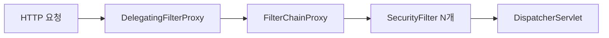

Spring 면접은 단순 암기로는 절대 통과할 수 없습니다. 면접관은 "Bean이 뭔가요?"를 물어볼 때 실은 **의존성 관리 철학을 이해하고 있는가**를 봅니다. 이 글은 시니어 개발자가 실제 면접에서 받은 질문 50개를 카테고리별로 정리하고, 면접관 관점에서 "왜 이 질문을 하는가"까지 분석했습니다.

---

## 1. DI / IoC 핵심 질문 (Q1 ~ Q10)

### Q1. IoC와 DI의 차이를 설명하세요

**모범 답변**

IoC(Inversion of Control)는 **제어의 역전** 원칙입니다. 전통적으로는 객체가 스스로 의존성을 생성하지만, IoC에서는 그 제어권을 컨테이너(Spring)에게 넘깁니다.

DI(Dependency Injection)는 IoC를 **구현하는 방법** 중 하나입니다. 컨테이너가 외부에서 의존성을 주입해 줍니다.

> **비유:** IoC는 "음식 주문을 내가 하지 않고 배달부에게 맡긴다"는 개념이고, DI는 "배달부가 문 앞까지 음식을 가져다준다"는 구체적 방법입니다.

**왜 이 질문을 하는가**

많은 지원자가 IoC = DI로 혼동합니다. 원칙과 구현의 차이를 아는지 확인합니다.

**흔한 실수**

"IoC 컨테이너가 DI를 해준다"로 끝내는 것. Service Locator 패턴도 IoC의 구현임을 모르는 경우가 많습니다.

<details>
<summary>면접 포인트 펼치기</summary>

**꼬리질문:** Service Locator 패턴과 DI의 차이는?

Service Locator는 객체가 레지스트리에서 직접 의존성을 찾아옵니다. DI는 외부에서 주입받습니다. DI가 더 테스트하기 쉽고, 의존성이 명시적으로 드러납니다.

**실무 연결:** 레거시 코드에서 `new` 키워드 남발 → IoC 도입 → 테스트 용이성 향상

</details>

---

### Q2. Spring Bean의 생명주기를 설명하세요

**모범 답변**

Bean 생명주기는 다음 순서로 진행됩니다.

```
컨테이너 시작
  → Bean 정의 로딩
  → Bean 인스턴스 생성
  → 의존성 주입
  → BeanPostProcessor (before) 실행
  → @PostConstruct 또는 InitializingBean.afterPropertiesSet()
  → BeanPostProcessor (after) 실행
  → Bean 사용
  → @PreDestroy 또는 DisposableBean.destroy()
  → 컨테이너 종료
```

> **비유:** 신입사원 입사 과정과 같습니다. 채용(인스턴스 생성) → 팀 배정(의존성 주입) → OJT(초기화) → 업무 수행(사용) → 퇴사 처리(소멸)

**왜 이 질문을 하는가**

초기화 로직 위치 선택(생성자 vs `@PostConstruct`)과 리소스 해제 타이밍을 제대로 아는지 확인합니다.

<details>
<summary>면접 포인트 펼치기</summary>

**꼬리질문:** `@PostConstruct`와 `InitializingBean`의 차이는?

`@PostConstruct`는 JSR-250 표준이라 Spring 비의존적입니다. `InitializingBean`은 Spring 인터페이스 구현이 필요해 결합도가 높습니다. 실무에서는 `@PostConstruct`를 권장합니다.

**꼬리질문:** 싱글톤 Bean에서 `@PostConstruct`가 여러 번 호출되나요?

아닙니다. 싱글톤은 컨테이너 시작 시 한 번만 초기화됩니다.

</details>

---

### Q3. @Autowired, @Resource, @Inject의 차이는?

**모범 답변**

| 애노테이션 | 출처 | 주입 우선순위 |
|---|---|---|
| `@Autowired` | Spring | 타입 → 이름 |
| `@Resource` | Java EE (JSR-250) | 이름 → 타입 |
| `@Inject` | Java EE (JSR-330) | 타입 → 이름 |

`@Autowired`는 Spring 전용이고, `@Resource`와 `@Inject`는 표준 스펙입니다. 동일 타입 Bean이 여러 개일 때 `@Qualifier`와 함께 사용합니다.

> **비유:** 편의점에서 물건 찾기 - `@Autowired`는 "음료 코너에서 콜라"(타입), `@Resource`는 "2번 선반 왼쪽 콜라"(이름) 방식

**왜 이 질문을 하는가**

Bean 충돌 상황(NoUniqueBeanDefinitionException) 해결 능력을 봅니다.

<details>
<summary>면접 포인트 펼치기</summary>

**꼬리질문:** 같은 타입 Bean이 2개일 때 해결 방법 3가지는?

1. `@Qualifier("beanName")` 명시
2. `@Primary`로 우선 Bean 지정
3. 필드/파라미터 이름을 Bean 이름과 일치시키기

</details>

---

### Q4. 생성자 주입이 권장되는 이유는?

**모범 답변**

생성자 주입이 권장되는 이유는 세 가지입니다.

1. **불변성**: `final` 필드 선언 가능 → 의존성 변경 불가
2. **순환 참조 감지**: 컴파일 타임 또는 애플리케이션 시작 시점에 즉시 에러 발생
3. **테스트 용이성**: Spring 컨텍스트 없이 `new`로 직접 생성 가능

```java
@Service
public class OrderService {
    private final PaymentService paymentService; // final 가능

    public OrderService(PaymentService paymentService) {
        this.paymentService = paymentService;
    }
}
```

> **비유:** 집을 지을 때 기초 공사(생성자)에서 전기/수도를 연결하는 것. 나중에 벽 뚫어서 배선하는 것(필드 주입)보다 훨씬 안전합니다.

**왜 이 질문을 하는가**

Spring 공식 문서도 생성자 주입을 권장합니다. 이를 이유와 함께 설명할 수 있는지 봅니다.

<details>
<summary>면접 포인트 펼치기</summary>

**꼬리질문:** 순환 의존성이 생기면 어떻게 해결하나요?

1. 설계 재검토 — 순환 자체가 설계 문제 신호
2. `@Lazy` 주입으로 지연 로딩
3. 인터페이스 분리 또는 중간 서비스 도입

Spring Boot 2.6부터 순환 의존성 기본 차단됩니다.

</details>

---

### Q5. ApplicationContext와 BeanFactory의 차이는?

**모범 답변**

`BeanFactory`는 기본 IoC 컨테이너로 지연 초기화(Lazy)가 기본입니다. `ApplicationContext`는 `BeanFactory`를 확장하여 다음을 추가 제공합니다.

- 국제화(MessageSource)
- 이벤트 발행(ApplicationEventPublisher)
- 리소스 로딩(ResourceLoader)
- AOP 통합
- 즉시 초기화(Eager) - 시작 시 모든 싱글톤 Bean 생성

실무에서는 항상 `ApplicationContext`를 사용합니다.

> **비유:** `BeanFactory`는 기본 자동차, `ApplicationContext`는 내비게이션·열선시트·후방카메라가 장착된 풀옵션 자동차

<details>
<summary>면접 포인트 펼치기</summary>

**꼬리질문:** Eager vs Lazy 초기화의 트레이드오프는?

Eager: 시작이 느리지만 실행 중 에러 없음 (Bean 설정 오류를 시작 시 발견)
Lazy: 시작이 빠르지만 첫 호출 시 지연 + 런타임 에러 위험

프로덕션에서는 Eager가 더 안전합니다.

</details>

---

### Q6. @Component, @Service, @Repository, @Controller의 차이는?

**모범 답변**

모두 `@Component`의 특수화(specialization)입니다. 기능적 차이는 거의 없지만 의미적 차이가 있습니다.

- `@Component`: 범용 컴포넌트
- `@Service`: 비즈니스 로직 레이어
- `@Repository`: 데이터 접근 레이어 — **추가 기능**: 데이터 접근 예외를 Spring `DataAccessException`으로 변환
- `@Controller`: MVC 웹 레이어 — 요청 매핑 기능 추가

`@Repository`만 실질적인 추가 동작(예외 변환)이 있습니다.

<details>
<summary>면접 포인트 펼치기</summary>

**꼬리질문:** @Repository의 예외 변환이 왜 중요한가요?

JDBC, JPA, MyBatis 등 각기 다른 DB 기술의 예외를 `DataAccessException` 계층으로 통일합니다. 상위 레이어에서 DB 기술에 무관하게 예외를 처리할 수 있습니다.

</details>

---

### Q7. @Configuration과 @Component의 차이는?

**모범 답변**

`@Configuration` 클래스는 CGLIB 프록시로 감싸집니다. 따라서 `@Bean` 메서드를 여러 번 호출해도 **항상 같은 싱글톤 인스턴스**를 반환합니다.

`@Component`에 `@Bean`을 선언하면(lite mode) 프록시 없이 일반 메서드 호출이 됩니다. 같은 `@Bean` 메서드를 두 번 호출하면 다른 인스턴스가 생성될 수 있습니다.

```java
@Configuration
public class AppConfig {
    @Bean
    public DataSource dataSource() { return new HikariDataSource(); }

    @Bean
    public JdbcTemplate jdbcTemplate() {
        return new JdbcTemplate(dataSource()); // 같은 dataSource 반환 보장
    }
}
```

<details>
<summary>면접 포인트 펼치기</summary>

**꼬리질문:** proxyBeanMethods=false는 언제 사용하나요?

Bean 간 의존이 없고 시작 성능이 중요할 때 `@Configuration(proxyBeanMethods = false)`를 사용합니다. Spring Boot Auto-configuration에서 많이 사용됩니다.

</details>

---

### Q8. Bean Scope의 종류와 사용 시점은?

**모범 답변**

| Scope | 설명 | 사용 시점 |
|---|---|---|
| singleton | 컨테이너당 1개 (기본값) | 상태 없는 서비스, Repository |
| prototype | 요청마다 새 인스턴스 | 상태를 가지는 객체 |
| request | HTTP 요청당 1개 | 웹 환경, 요청 컨텍스트 |
| session | HTTP 세션당 1개 | 로그인 사용자 정보 |
| application | ServletContext당 1개 | 앱 전역 공유 데이터 |

> **비유:** 싱글톤은 사무실 복합기(모두 공유), 프로토타입은 개인 노트(사람마다 새것), 리퀘스트는 점심 주문서(한 끼마다 새로 작성)

<details>
<summary>면접 포인트 펼치기</summary>

**꼬리질문:** 싱글톤 Bean에 프로토타입 Bean을 주입하면 무슨 문제가 생기나요?

싱글톤은 한 번 생성되므로 주입된 프로토타입도 한 번만 생성됩니다. 해결책: `ApplicationContext.getBean()`, `ObjectProvider<T>`, `@Lookup` 메서드 주입

</details>

---

### Q9. Spring에서 싱글톤 Bean은 Thread-safe한가요?

**모범 답변**

싱글톤 자체는 Thread-safe하지 않습니다. Spring은 싱글톤 인스턴스를 관리하지만 그 안의 상태(field)에 대한 동기화는 개발자 책임입니다.

**안전한 패턴:** 상태 없는(stateless) Bean 설계

```java
@Service
public class OrderService {
    // 상태 없음 → Thread-safe
    public Order process(OrderRequest request) {
        // 지역 변수만 사용
    }
}
```

**위험한 패턴:** 인스턴스 변수에 요청 데이터 저장

<details>
<summary>면접 포인트 펼치기</summary>

**꼬리질문:** 상태가 필요하면 어떻게 하나요?

1. 메서드 파라미터로 전달
2. ThreadLocal 사용 (요청 범위 데이터)
3. 프로토타입 스코프 Bean 사용
4. `synchronized` 또는 동시성 컬렉션 활용

</details>

---

### Q10. @Value와 @ConfigurationProperties의 차이는?

**모범 답변**

`@Value`는 단일 값 주입에 적합하고 SpEL을 지원합니다. `@ConfigurationProperties`는 관련 설정을 그룹화하여 타입 안전하게 바인딩합니다.

```java
// @Value 방식
@Value("${payment.timeout:5000}")
private int timeout;

// @ConfigurationProperties 방식
@ConfigurationProperties(prefix = "payment")
public class PaymentProperties {
    private int timeout = 5000;
    private String apiKey;
    // getter/setter
}
```

`@ConfigurationProperties`가 IDE 자동완성, 타입 검증, 문서화 측면에서 우수합니다.

<details>
<summary>면접 포인트 펼치기</summary>

**꼬리질문:** @ConfigurationProperties에서 검증은 어떻게 하나요?

`@Validated`와 Bean Validation 애노테이션을 함께 사용합니다.

```java
@ConfigurationProperties(prefix = "payment")
@Validated
public class PaymentProperties {
    @Min(1000) @Max(30000)
    private int timeout;
    @NotBlank
    private String apiKey;
}
```

</details>

---

## 2. AOP 핵심 질문 (Q11 ~ Q18)

### Q11. AOP의 핵심 개념을 설명하세요

**모범 답변**

| 용어 | 설명 | 예시 |
|---|---|---|
| Aspect | 횡단 관심사 모듈 | 로깅, 트랜잭션 |
| JoinPoint | Advice가 실행될 수 있는 지점 | 메서드 실행 |
| Pointcut | JoinPoint 선택 표현식 | `execution(* com.example.service.*.*(..))` |
| Advice | 실제 실행 로직 | Before, After, Around |
| Weaving | Aspect 적용 과정 | 런타임(Spring), 컴파일타임(AspectJ) |

> **비유:** AOP는 고속도로 톨게이트와 같습니다. 어떤 차가 지나가든(JoinPoint) 톨게이트(Aspect)에서 통행료를 수납합니다. 어떤 차를 검사할지 선택하는 것이 Pointcut입니다.

<details>
<summary>면접 포인트 펼치기</summary>

**꼬리질문:** Spring AOP와 AspectJ의 차이는?

Spring AOP: 런타임 프록시 방식, 메서드 실행 JoinPoint만 지원, Spring Bean에만 적용
AspectJ: 컴파일타임/로드타임 위빙, 필드·생성자 등 다양한 JoinPoint, 모든 Java 객체에 적용

성능은 AspectJ가 우수하지만, Spring AOP가 설정이 훨씬 간단합니다.

</details>

---

### Q12. @Around Advice에서 ProceedingJoinPoint.proceed()를 안 부르면?

**모범 답변**

원본 메서드가 실행되지 않습니다. `proceed()`는 체인의 다음 단계(다음 Advice 또는 실제 메서드)를 실행합니다.

```java
@Around("execution(* com.example.service.*.*(..))")
public Object around(ProceedingJoinPoint pjp) throws Throwable {
    log.info("Before");
    Object result = pjp.proceed(); // 이게 없으면 실제 메서드 실행 안 됨
    log.info("After");
    return result;
}
```

`proceed()`를 호출하지 않으면 캐시 구현, 권한 체크 후 차단 등에 활용 가능합니다.

<details>
<summary>면접 포인트 펼치기</summary>

**꼬리질문:** Around에서 반환값을 바꿀 수 있나요?

예. `proceed()`의 결과 대신 다른 값을 반환하면 됩니다. 캐시 Aspect에서 캐시 히트 시 실제 메서드 호출 없이 캐시 값을 반환하는 방식으로 사용합니다.

</details>

---

### Q13. Spring AOP 프록시 방식 두 가지를 설명하세요

**모범 답변**

1. **JDK Dynamic Proxy**: 인터페이스 기반. 대상 클래스가 인터페이스를 구현할 때 사용. `java.lang.reflect.Proxy` 활용
2. **CGLIB Proxy**: 클래스 기반. 인터페이스가 없어도 서브클래싱으로 프록시 생성

Spring Boot 2.0부터 기본값이 CGLIB입니다(`spring.aop.proxy-target-class=true`).

> **비유:** JDK Proxy는 "통역사를 통해 소통" (인터페이스 필요), CGLIB는 "말투를 흉내내는 배우" (원본 클래스 상속)

**CGLIB 제약:** `final` 클래스나 `final` 메서드에는 적용 불가.

<details>
<summary>면접 포인트 펼치기</summary>

**꼬리질문:** 같은 클래스 내에서 메서드를 호출하면 AOP가 적용되나요?

적용되지 않습니다. 프록시를 거치지 않고 직접 호출하기 때문입니다. 이를 "Self-invocation 문제"라 합니다. 해결책: `AopContext.currentProxy()` 사용, 또는 AspectJ 사용.

</details>

---

### Q14. @Transactional이 AOP와 어떻게 연결되나요?

**모범 답변**

`@Transactional`은 AOP Around Advice로 구현됩니다. 메서드 호출 전 트랜잭션을 시작하고, 정상 종료 시 커밋, 예외 발생 시 롤백합니다.

```
클라이언트 → 프록시(트랜잭션 시작) → 실제 메서드 → 프록시(커밋/롤백)
```

Self-invocation 문제: 같은 클래스 내 메서드 A → B 호출 시 B의 `@Transactional`은 무시됩니다.

<details>
<summary>면접 포인트 펼치기</summary>

**꼬리질문:** @Transactional을 private 메서드에 붙이면?

동작하지 않습니다. 프록시는 public 메서드만 오버라이드 가능합니다. Spring은 경고하지만 예외를 던지지 않아 실수하기 쉽습니다.

</details>

---

### Q15~Q18. AOP 실전 시나리오 문제들

**Q15. 로깅 Aspect에서 메서드 파라미터를 출력하려면?**

```java
@Before("execution(* com.example.service.*.*(..))")
public void logArgs(JoinPoint jp) {
    log.info("Method: {}, Args: {}",
        jp.getSignature().getName(),
        Arrays.toString(jp.getArgs()));
}
```

**Q16. Pointcut 표현식 `execution(* com.example..*Service.*(..))`의 의미는?**

`com.example` 패키지 이하(`..`) 모든 클래스 중 이름이 `Service`로 끝나는 클래스의 모든 메서드(`*`)에 적용. 반환 타입 무관(`*`), 파라미터 무관(`..`).

**Q17. @annotation Pointcut 활용 예시는?**

커스텀 애노테이션을 만들어 해당 애노테이션이 붙은 메서드에만 Aspect 적용.

```java
@Pointcut("@annotation(com.example.annotation.Audit)")
public void auditMethods() {}
```

**Q18. Advice 실행 순서가 중요한 경우 어떻게 제어하나요?**

`@Order` 애노테이션으로 Aspect 우선순위를 지정합니다. 숫자가 낮을수록 먼저 실행됩니다.

---

## 3. Transaction 핵심 질문 (Q19 ~ Q27)

### Q19. @Transactional의 propagation 옵션을 설명하세요

**모범 답변**

| Propagation | 설명 | 사용 시나리오 |
|---|---|---|
| REQUIRED (기본) | 기존 트랜잭션 사용, 없으면 생성 | 일반적인 서비스 메서드 |
| REQUIRES_NEW | 항상 새 트랜잭션 생성, 기존 일시 중단 | 감사 로그(실패해도 기록 유지) |
| NESTED | 중첩 트랜잭션(Savepoint) | 부분 롤백 필요 시 |
| SUPPORTS | 트랜잭션 있으면 참여, 없으면 비트랜잭션 | 읽기 전용 조회 |
| NOT_SUPPORTED | 트랜잭션 없이 실행, 기존 중단 | 트랜잭션 불필요한 외부 호출 |
| NEVER | 트랜잭션 있으면 예외 | 트랜잭션 금지 구간 |
| MANDATORY | 반드시 기존 트랜잭션 필요, 없으면 예외 | 서비스 내부 메서드 보호 |

> **비유:** `REQUIRED`는 택시 합승, `REQUIRES_NEW`는 별도 택시 호출, `NESTED`는 중간에 내렸다가 다시 탑승 가능한 정류장이 있는 버스

<details>
<summary>면접 포인트 펼치기</summary>

**꼬리질문:** REQUIRES_NEW 사용 시 주의사항은?

부모 트랜잭션과 자식 트랜잭션이 별개이므로, 부모가 롤백해도 자식은 커밋됩니다. 이를 이용해 감사 로그를 별도 트랜잭션으로 저장합니다. 그러나 **데드락 위험**이 있습니다 — 같은 행을 두 트랜잭션이 접근할 때.

</details>

---

### Q20. @Transactional의 isolation level을 설명하세요

**모범 답변**

| Isolation Level | Dirty Read | Non-repeatable Read | Phantom Read |
|---|---|---|---|
| READ_UNCOMMITTED | 발생 | 발생 | 발생 |
| READ_COMMITTED | 방지 | 발생 | 발생 |
| REPEATABLE_READ | 방지 | 방지 | 발생 |
| SERIALIZABLE | 방지 | 방지 | 방지 |

- **Dirty Read**: 커밋 안 된 데이터 읽기
- **Non-repeatable Read**: 같은 쿼리 두 번 실행 시 결과 다름
- **Phantom Read**: 같은 조건 쿼리 시 행 개수 다름

실무에서는 DB 기본값(MySQL InnoDB: REPEATABLE_READ)을 사용하는 경우가 많습니다.

<details>
<summary>면접 포인트 펼치기</summary>

**꼬리질문:** MySQL InnoDB에서 REPEATABLE_READ가 Phantom Read를 방지하는 방법은?

MVCC(Multi-Version Concurrency Control)를 사용합니다. 트랜잭션 시작 시점의 스냅샷을 읽으므로, 다른 트랜잭션이 행을 추가해도 보이지 않습니다.

</details>

---

### Q21. @Transactional(readOnly=true)의 효과는?

**모범 답변**

1. **플러시 비활성화**: 영속성 컨텍스트의 변경 감지(dirty checking)를 건너뜀 → 성능 향상
2. **DB 옵티마이저 힌트**: 일부 DB는 읽기 전용 트랜잭션을 최적화
3. **읽기 전용 DB 라우팅**: 리플리케이션 환경에서 슬레이브 DB로 자동 라우팅 가능

```java
@Transactional(readOnly = true)
public List<Order> findAllOrders() {
    // 변경 감지 없음, 스냅샷 불필요
    return orderRepository.findAll();
}
```

<details>
<summary>면접 포인트 펼치기</summary>

**꼬리질문:** readOnly=true인데 실수로 엔티티를 수정하면?

플러시가 발생하지 않으므로 DB에는 반영되지 않습니다. 예외가 발생하는 것이 아니라 조용히 무시됩니다. 이 점이 오히려 혼란을 줄 수 있습니다.

</details>

---

### Q22. 롤백 규칙 — checkedException은 롤백 안 되는 이유는?

**모범 답변**

Spring `@Transactional`의 기본 롤백 규칙:
- **RuntimeException, Error**: 자동 롤백
- **CheckedException**: 자동 롤백 안 됨 (커밋)

이유: EJB 설계 관례를 따른 것으로, CheckedException은 "예상 가능한 비즈니스 예외"로 간주하기 때문입니다.

```java
@Transactional(rollbackFor = Exception.class) // 모든 예외에 롤백
public void process() throws IOException { ... }

@Transactional(noRollbackFor = IllegalArgumentException.class)
public void process() { ... }
```

<details>
<summary>면접 포인트 펼치기</summary>

**꼬리질문:** 트랜잭션 내에서 예외를 catch해서 처리하면 롤백이 일어나나요?

예외가 트랜잭션 경계 밖으로 나가지 않으면 롤백이 일어나지 않습니다. 단, `TransactionAspectSupport.currentTransactionStatus().setRollbackOnly()`를 호출하면 강제 롤백 마킹이 가능합니다.

</details>

---

### Q23 ~ Q27. Transaction 실전 문제

**Q23. 트랜잭션 경계와 영속성 컨텍스트 관계는?**

기본적으로 트랜잭션과 영속성 컨텍스트 생명주기가 일치합니다(OSIV 비활성 시). 트랜잭션 시작 = PC 생성, 트랜잭션 종료 = PC 플러시 및 종료.

**Q24. TransactionSynchronizationManager의 역할은?**

현재 스레드의 트랜잭션 관련 리소스(Connection, EntityManager 등)를 ThreadLocal로 관리합니다.

**Q25. 트랜잭션 없이 JPA를 사용하면?**

조회는 가능하지만 변경은 안 됩니다. `@Transactional` 없이 `save()` 호출 시 예외 발생.

**Q26. 분산 트랜잭션(Distributed Transaction)은 어떻게 처리하나요?**

2PC(Two-Phase Commit) 또는 Saga 패턴. 마이크로서비스에서는 Saga(Choreography/Orchestration)를 주로 사용합니다.

**Q27. 낙관적 잠금 vs 비관적 잠금은?**

- **낙관적**: `@Version` 필드 사용, 충돌 시 `OptimisticLockException`, 충돌 드문 환경
- **비관적**: `SELECT FOR UPDATE`, 충돌 잦은 환경, 데드락 위험

---

## 4. JPA 핵심 질문 (Q28 ~ Q38)

### Q28. N+1 문제란 무엇이고 어떻게 해결하나요?

**모범 답변**

1건 조회 쿼리 이후 N개 연관 엔티티를 N번 추가 조회하는 문제입니다.

```java
// 문제 코드 - Order 목록 1번 + Order별 Member 조회 N번 = N+1 쿼리
List<Order> orders = orderRepository.findAll(); // 1번
orders.forEach(o -> o.getMember().getName()); // N번
```

**해결책:**

1. `JPQL fetch join`: `SELECT o FROM Order o JOIN FETCH o.member`
2. `@EntityGraph`: `@EntityGraph(attributePaths = {"member"})`
3. `@BatchSize`: 지연 로딩을 IN 쿼리로 묶음
4. DTO 프로젝션: 필요한 컬럼만 선택

> **비유:** N+1은 마트에서 계산할 때 물건 하나씩 바코드 찍는 대신, 카트째 한 번에 스캔하지 못하는 상황입니다.

<details>
<summary>면접 포인트 펼치기</summary>

**꼬리질문:** fetch join의 단점은?

1. 페이징과 함께 사용 시 경고 + 메모리에서 페이징 처리 (컬렉션 fetch join)
2. 2개 이상의 컬렉션을 동시에 fetch join 불가
3. 해결: `@BatchSize` 또는 DTO 조회

</details>

---

### Q29. 영속성 컨텍스트의 1차 캐시 동작 원리는?

**모범 답변**

영속성 컨텍스트는 `Map<@Id, Entity>` 형태의 1차 캐시를 가집니다. 같은 트랜잭션에서 같은 ID로 조회하면 DB를 거치지 않고 캐시에서 반환합니다.

```java
// 1번만 SELECT
Order order1 = em.find(Order.class, 1L);
Order order2 = em.find(Order.class, 1L); // 캐시 히트
System.out.println(order1 == order2); // true (동일 인스턴스)
```

**동일성 보장**: 같은 트랜잭션에서 같은 엔티티는 항상 같은 인스턴스입니다.

<details>
<summary>면접 포인트 펼치기</summary>

**꼬리질문:** JPQL 쿼리는 1차 캐시를 사용하나요?

JPQL은 항상 DB를 먼저 조회합니다. 조회 후 결과를 1차 캐시와 병합합니다. 같은 ID 엔티티가 있으면 DB 결과를 버리고 캐시의 인스턴스를 반환합니다.

</details>

---

### Q30. CascadeType과 orphanRemoval의 차이는?

**모범 답변**

`CascadeType.REMOVE`: 부모 삭제 시 자식도 삭제 (`em.remove(parent)` → 자식도 삭제)

`orphanRemoval=true`: 부모와의 **연관 관계가 끊어진** 자식을 자동 삭제

```java
parent.getChildren().remove(child); // orphanRemoval=true면 child DELETE 쿼리 발생
```

> **비유:** CascadeType.REMOVE는 사장이 퇴사할 때 직원도 해고, orphanRemoval은 팀장이 바뀌어 팀원이 소속 없어지면 자동 해고

<details>
<summary>면접 포인트 펼치기</summary>

**꼬리질문:** CascadeType.ALL + orphanRemoval=true를 함께 쓰는 경우는?

완전한 소유 관계(부모 없이 자식이 독립 존재 불가)일 때 사용합니다. 예: `Order` → `OrderItem` (주문 없는 주문항목은 의미 없음)

</details>

---

### Q31. @OneToMany 기본 FetchType이 LAZY인 이유는?

**모범 답변**

컬렉션은 크기를 예측할 수 없기 때문입니다. EAGER로 설정 시 단순 조회에도 모든 자식 데이터를 로딩합니다. 100개 Order를 조회하면 모든 OrderItem까지 한꺼번에 로딩되어 메모리 폭발 위험이 있습니다.

`@ManyToOne`은 단일 엔티티라 EAGER가 기본이지만, 이것도 N+1 문제를 유발하므로 명시적으로 LAZY로 변경하는 것을 권장합니다.

---

### Q32. 변경 감지(Dirty Checking) 원리는?

**모범 답변**

JPA는 엔티티를 영속성 컨텍스트에 저장할 때 **스냅샷**(최초 상태 복사본)을 함께 보관합니다. 트랜잭션 커밋 시 현재 엔티티 상태와 스냅샷을 비교하여 변경된 필드만 UPDATE 쿼리를 생성합니다.

```java
@Transactional
public void updateOrderStatus(Long orderId) {
    Order order = orderRepository.findById(orderId).get();
    order.changeStatus(OrderStatus.COMPLETED); // setter 없이도 변경 감지
    // save() 호출 없이도 트랜잭션 종료 시 UPDATE 발생
}
```

<details>
<summary>면접 포인트 펼치기</summary>

**꼬리질문:** @DynamicUpdate는 무엇인가요?

기본적으로 JPA는 변경 여부와 관계없이 모든 컬럼을 UPDATE합니다. `@DynamicUpdate`는 실제 변경된 컬럼만 UPDATE 쿼리에 포함합니다. 컬럼이 매우 많을 때 유용하지만, 쿼리 캐싱 효율이 떨어집니다.

</details>

---

### Q33 ~ Q38. JPA 심화 문제

**Q33. OSIV(Open Session In View) 패턴의 장단점은?**

장점: View에서도 지연 로딩 가능. 단점: 트랜잭션 종료 후에도 DB 커넥션 유지 → 커넥션 고갈 위험. Spring Boot 기본 활성화. 성능이 중요한 서비스에서는 비활성화 권장(`spring.jpa.open-in-view=false`).

**Q34. 프록시 초기화와 LazyInitializationException은?**

영속성 컨텍스트 종료 후 지연 로딩 시도 시 발생. 해결: 트랜잭션 안에서 초기화, fetch join, DTO 변환.

**Q35. Querydsl을 사용하는 이유는?**

타입 안전 동적 쿼리 생성. JPQL String 연결보다 컴파일 타임 오류 감지 가능.

**Q36. Spring Data JPA의 @Query와 Querydsl 선택 기준은?**

정적 쿼리: `@Query`. 동적 조건(검색 필터 등): Querydsl.

**Q37. 엔티티와 DTO를 분리해야 하는 이유는?**

엔티티는 영속성 컨텍스트와 연결됨. View에 노출 시 불필요한 연관 로딩, 순환 참조(JSON 직렬화 시) 위험. API 계약과 내부 도메인 모델 분리.

**Q38. JPA save()와 saveAndFlush()의 차이는?**

`save()`: 트랜잭션 종료 시 플러시. `saveAndFlush()`: 즉시 플러시하여 DB에 반영. 같은 트랜잭션 내에서 저장 후 즉시 조회할 때 사용.

---

## 5. Spring Security 핵심 질문 (Q39 ~ Q45)

### Q39. Spring Security의 필터 체인 구조를 설명하세요

**모범 답변**

Spring Security는 서블릿 필터 체인으로 구현됩니다. `DelegatingFilterProxy`가 Spring의 `FilterChainProxy`에 위임하고, 여기서 여러 `SecurityFilter`를 순서대로 실행합니다.

주요 필터 순서 (일부):
1. `SecurityContextPersistenceFilter` — SecurityContext 로드
2. `UsernamePasswordAuthenticationFilter` — 폼 로그인 처리
3. `BasicAuthenticationFilter` — HTTP Basic 처리
4. `ExceptionTranslationFilter` — 인증/인가 예외 처리
5. `FilterSecurityInterceptor` — 최종 권한 확인



<details>
<summary>면접 포인트 펼치기</summary>

**꼬리질문:** SecurityContext는 어떻게 스레드 간 전파되나요?

`SecurityContextHolder`가 기본으로 `ThreadLocalSecurityContextHolderStrategy`를 사용합니다. 비동기 처리 시 자식 스레드로 SecurityContext가 전파되지 않습니다. `DelegatingSecurityContextExecutor`로 해결합니다.

</details>

---

### Q40. JWT를 Spring Security에 통합하는 방법은?

**모범 답변**

커스텀 필터를 만들어 `UsernamePasswordAuthenticationFilter` 앞에 추가합니다.

```java
public class JwtAuthenticationFilter extends OncePerRequestFilter {
    @Override
    protected void doFilterInternal(HttpServletRequest request,
            HttpServletResponse response, FilterChain chain)
            throws ServletException, IOException {
        String token = extractToken(request);
        if (token != null && jwtProvider.validate(token)) {
            Authentication auth = jwtProvider.getAuthentication(token);
            SecurityContextHolder.getContext().setAuthentication(auth);
        }
        chain.doFilter(request, response);
    }
}
```

> **비유:** JWT 필터는 건물 입구 보안요원입니다. 신분증(토큰)을 확인하고 통과시키거나 차단합니다.

<details>
<summary>면접 포인트 펼치기</summary>

**꼬리질문:** JWT 토큰 만료 전 갱신 전략은?

1. Refresh Token을 별도로 발급 (DB나 Redis에 저장)
2. Access Token 만료 시 Refresh Token으로 재발급
3. Refresh Token Rotation: 갱신 시 새 Refresh Token도 발급 (구 토큰 무효화)

</details>

---

### Q41. @PreAuthorize와 @Secured의 차이는?

**모범 답변**

| | @Secured | @PreAuthorize |
|---|---|---|
| SpEL 지원 | 불가 | 가능 |
| 복잡한 조건 | 불가 | 가능 |
| 파라미터 접근 | 불가 | 가능 |

```java
@Secured("ROLE_ADMIN") // 단순 역할 체크

@PreAuthorize("hasRole('ADMIN') or #userId == authentication.name")
// 복잡한 조건 가능
public void deleteUser(@PathVariable String userId) { ... }
```

실무에서는 `@PreAuthorize`를 권장합니다.

---

### Q42 ~ Q45. Security 실전 문제

**Q42. CSRF 공격과 Spring Security의 방어 방법은?**

CSRF: 다른 사이트에서 인증된 사용자 권한으로 요청 위조. Spring Security: CSRF 토큰을 폼에 삽입, 요청 시 검증. REST API(stateless)에서는 CSRF 비활성화 가능 (`csrf().disable()`).

**Q43. PasswordEncoder를 BCrypt로 사용하는 이유는?**

솔트(Salt) 자동 생성으로 Rainbow Table 공격 방어. 작업 인수(cost factor) 조절로 해시 속도 제어 가능. 동일 비밀번호도 매번 다른 해시값 생성.

**Q44. 인증(Authentication)과 인가(Authorization)의 차이는?**

인증: "당신이 누구인가" 확인 (로그인). 인가: "당신이 무엇을 할 수 있는가" 확인 (권한 체크). Spring Security: `AuthenticationManager`(인증), `AccessDecisionManager`(인가).

**Q45. OAuth2 Resource Server와 Authorization Server의 차이는?**

Authorization Server: 토큰 발급 서버. Resource Server: 토큰으로 API 접근을 허용하는 서버. Spring Security OAuth2 Resource Server는 JWT/Opaque 토큰 검증을 자동 처리합니다.

---

## 6. WebFlux / 기타 심화 질문 (Q46 ~ Q50)

### Q46. Spring MVC vs Spring WebFlux 선택 기준은?

**모범 답변**

| 기준 | Spring MVC | Spring WebFlux |
|---|---|---|
| 모델 | 동기 블로킹 | 비동기 논블로킹 |
| 스레드 | 요청당 1스레드 | 이벤트 루프 |
| 적합 환경 | 전통적 CRUD, DB 중심 | I/O 집중, 스트리밍, SSE |
| 학습 곡선 | 낮음 | 높음 (Reactor) |

> **비유:** MVC는 레스토랑에서 테이블마다 전담 웨이터 배정, WebFlux는 한 웨이터가 여러 테이블을 비동기로 서빙

**JPA(Blocking)와 WebFlux는 잘 맞지 않습니다.** R2DBC나 MongoDB Reactive 드라이버를 사용해야 합니다.

<details>
<summary>면접 포인트 펼치기</summary>

**꼬리질문:** WebFlux에서 블로킹 코드가 섞이면 어떤 문제가 생기나요?

이벤트 루프 스레드가 블로킹되어 전체 처리량이 급감합니다. 블로킹 코드는 `Schedulers.boundedElastic()`으로 별도 스레드풀에서 실행해야 합니다.

</details>

---

### Q47. Spring Boot Actuator의 주요 엔드포인트는?

주요 엔드포인트: `/health`(헬스체크), `/metrics`(메트릭), `/info`(앱 정보), `/env`(환경변수), `/beans`(Bean 목록), `/mappings`(URL 매핑), `/httptrace`(HTTP 이력).

프로덕션에서는 `/health`와 `/metrics`만 외부 노출하고, 나머지는 보안 처리합니다.

---

### Q48. Spring Cache 추상화를 설명하세요

`@Cacheable`, `@CachePut`, `@CacheEvict`로 선언적 캐싱. 구현체로 Caffeine, Redis, EhCache 등을 교체 가능합니다.

```java
@Cacheable(value = "products", key = "#id", unless = "#result == null")
public Product findById(Long id) { ... }

@CacheEvict(value = "products", key = "#product.id")
public void update(Product product) { ... }
```

---

### Q49. Spring Batch의 구성 요소는?

`Job` → `Step` → `ItemReader` → `ItemProcessor` → `ItemWriter`. `JobLauncher`가 `Job`을 실행하고, `JobRepository`가 실행 이력을 관리합니다. 대용량 데이터 처리에 적합하고 Chunk 기반 처리로 메모리를 효율화합니다.

---

### Q50. Spring Cloud와 마이크로서비스 패턴은?

주요 컴포넌트:
- **Gateway**: API Gateway (라우팅, 필터, Rate Limiting)
- **Eureka**: 서비스 디스커버리
- **Config**: 중앙화된 설정 관리
- **OpenFeign**: 선언적 HTTP 클라이언트
- **Resilience4j**: Circuit Breaker, Retry, Bulkhead

<details>
<summary>면접 포인트 펼치기</summary>

**꼬리질문:** Circuit Breaker 패턴이 필요한 이유는?

연쇄 장애(Cascading Failure) 방지. 하나의 서비스 장애가 호출 대기로 인해 전체 시스템으로 전파되는 것을 차단합니다. CLOSED → OPEN → HALF_OPEN 상태로 자동 복구 시도합니다.

</details>

---

## 마무리 — 면접 전략

Spring 면접에서 좋은 점수를 받으려면:

1. **원리로 답하기**: "어떻게"보다 "왜"를 먼저 설명
2. **트레이드오프 언급**: 모든 기술에는 장단점이 있음을 인지
3. **실무 경험 연결**: "프로젝트에서 N+1 문제를 fetch join으로 해결했습니다"
4. **모른다면 솔직하게**: 아는 범위를 말하고 "추가로 학습하겠습니다"

이 50개 질문을 외우는 것이 목표가 아닙니다. 각 질문 뒤에 있는 **설계 의도**를 이해하는 것이 진짜 목표입니다.
