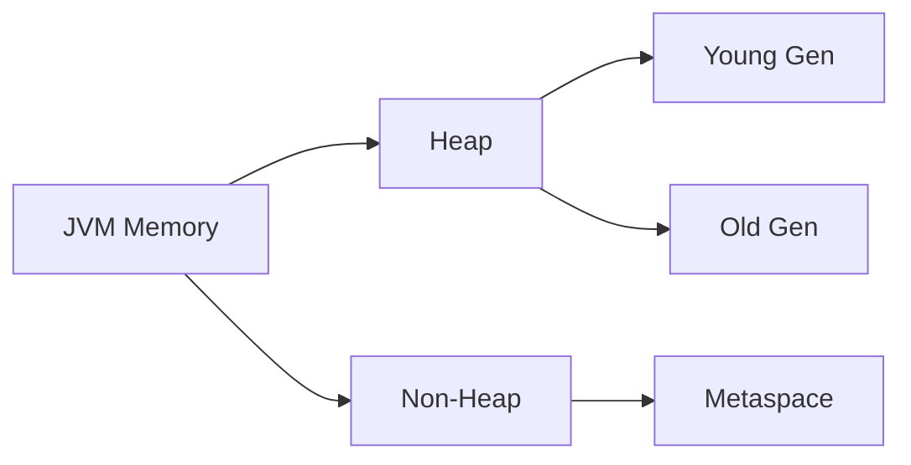

## 1. JVM 메모리 구조 (Q1 ~ Q10)

### Q1. JVM 메모리 구조를 설명하세요

**모범 답변**

JVM 메모리는 크게 다음 영역으로 구분됩니다.



**Heap 영역:**
- **Young Generation**: Eden + Survivor(S0, S1). 새로 생성된 객체가 위치. Minor GC 발생
- **Old Generation**: Young에서 살아남은 객체가 승격. Major/Full GC 발생

**Non-Heap 영역:**
- **Metaspace** (Java 8+): 클래스 메타데이터 저장. Java 7의 PermGen을 대체. 네이티브 메모리 사용
- **Code Cache**: JIT 컴파일된 코드
- **Stack**: 스레드별 독립. 메서드 호출 프레임, 지역 변수
- **PC Register**: 현재 실행 중인 JVM 명령어 주소

> **비유:** JVM 메모리는 회사 건물입니다. Heap은 공유 사무실(모든 스레드가 접근), Stack은 개인 책상(스레드마다 독립), Metaspace는 도서관(클래스 정보 보관)

<details>
<summary>면접 포인트 펼치기</summary>

**꼬리질문:** Java 8에서 PermGen이 Metaspace로 바뀐 이유는?

PermGen은 고정 크기라 `OutOfMemoryError: PermGen space` 오류가 빈번했습니다. Metaspace는 네이티브 메모리를 사용하여 동적으로 확장됩니다. 단, 메모리 누수가 있으면 네이티브 메모리를 계속 소비합니다.

**꼬리질문:** 스택 오버플로우는 왜 발생하나요?

메서드 호출마다 스택 프레임이 쌓입니다. 무한 재귀나 깊은 재귀 호출 시 스택 크기 한계를 초과하여 `StackOverflowError` 발생. JVM 옵션 `-Xss`로 스택 크기 조절 가능.

</details>

---

### Q2. Minor GC와 Major GC의 차이는?

**모범 답변**

**Minor GC:**
- Young Generation 대상
- 빠르고 자주 발생 (밀리초 단위)
- STW(Stop-The-World) 짧음
- Eden이 가득 차면 트리거

**Major GC (Full GC):**
- Old Generation 대상 (보통 Heap 전체 포함)
- 느리고 드물게 발생 (초 단위)
- STW 길어 응답 지연 발생
- Old Gen이 가득 차거나 `System.gc()` 호출 시 트리거

**객체 승격 과정:**
1. 새 객체 → Eden
2. Minor GC 생존 → Survivor (S0 또는 S1)
3. GC 생존 횟수가 임계값(기본 15) 초과 → Old Generation

> **비유:** Minor GC는 매일 하는 분리수거, Major GC는 한 번씩 하는 대청소. 대청소할 때는 모든 가족이 청소에만 집중해야 합니다(STW).

<details>
<summary>면접 포인트 펼치기</summary>

**꼬리질문:** GC 튜닝 시 주로 어떤 옵션을 조정하나요?

- `-Xms`, `-Xmx`: Heap 초기/최대 크기 (동일하게 설정 권장 — 동적 조정 오버헤드 제거)
- `-XX:NewRatio`: Young:Old 비율
- `-XX:SurvivorRatio`: Eden:Survivor 비율
- `-XX:MaxTenuringThreshold`: 승격 임계값

</details>

---

### Q3. GC 알고리즘의 종류를 설명하세요

**모범 답변**

| GC | 특징 | 적합 환경 |
|---|---|---|
| Serial GC | 단일 스레드, 가장 단순 | 소형 앱, 테스트 |
| Parallel GC | 멀티 스레드, 처리량 중시 | Java 8 기본 (서버) |
| CMS GC | 동시 마킹, 지연 최소화 | Java 9 deprecated |
| G1 GC | Region 기반, 지연 예측 | Java 9 기본, 4GB+ Heap |
| ZGC | 초저지연 (1~15ms), 대용량 | Java 15+, 수백GB Heap |
| Shenandoah | 동시 압축, 초저지연 | RedHat 제공 |

**G1 GC 핵심 원리:**
Heap을 고정 크기 Region으로 분할. 가장 많은 가비지를 가진 Region(Garbage First)을 우선 수집. 목표 지연 시간 설정 가능(`-XX:MaxGCPauseMillis`).

> **비유:** G1 GC는 쓰레기가 가장 많은 방부터 청소하는 청소부. CMS는 집 안에서 사람들이 생활하는 중에 조용히 청소합니다.

<details>
<summary>면접 포인트 펼치기</summary>

**꼬리질문:** ZGC와 G1 GC의 선택 기준은?

G1 GC: Heap 4GB~16GB, 지연 100ms 이하 목표. 안정적이고 검증된 선택.
ZGC: Heap 수백GB, 지연 10ms 이하 필요. 트레이드오프: CPU 사용량이 다소 높습니다.

</details>

---

### Q4. 메모리 누수(Memory Leak)가 Java에서 발생하는 상황은?

**모범 답변**

GC가 있어도 메모리 누수는 발생합니다. GC는 **참조가 없는** 객체만 수집하기 때문입니다.

**주요 메모리 누수 패턴:**

1. **Static 컬렉션에 계속 추가**: `static Map`에 추가하고 제거하지 않음
2. **리스너/콜백 미해제**: 이벤트 리스너를 등록 후 제거하지 않음
3. **잘못된 equals/hashCode**: `HashSet`에 넣은 객체를 찾지 못해 중복 축적
4. **내부 클래스 참조**: 익명 클래스가 외부 클래스 인스턴스를 암묵적으로 참조
5. **ThreadLocal 미제거**: 스레드 풀 환경에서 `ThreadLocal.remove()` 누락

```java
// 위험한 패턴 — ThreadLocal 누수
private static ThreadLocal<ExpensiveObject> threadLocal = new ThreadLocal<>();

public void process() {
    threadLocal.set(new ExpensiveObject());
    try {
        // 처리
    } finally {
        threadLocal.remove(); // 반드시 제거!
    }
}
```

<details>
<summary>면접 포인트 펼치기</summary>

**꼬리질문:** 메모리 누수를 어떻게 진단하나요?

1. `jmap -heap <pid>`: Heap 현황
2. `jmap -histo <pid>`: 객체별 인스턴스 수
3. VisualVM, JProfiler: 힙 덤프 분석
4. `jcmd <pid> GC.heap_dump filename.hprof`: Heap 덤프 생성 후 MAT(Memory Analyzer Tool) 분석

</details>

---

### Q5. String Pool (String Interning)이란?

**모범 답변**

Java에서 String 리터럴은 **String Pool**(Heap 내 특수 영역)에 저장되고 재사용됩니다.

```java
String a = "hello"; // Pool에 저장
String b = "hello"; // Pool에서 재사용
String c = new String("hello"); // Heap에 새 객체 생성

System.out.println(a == b); // true (같은 객체)
System.out.println(a == c); // false (다른 객체)
System.out.println(a.equals(c)); // true (값 동일)

String d = c.intern(); // Pool로 이동
System.out.println(a == d); // true
```

> **비유:** String Pool은 도서관의 공용 도서 목록입니다. 같은 책을 여러 사람이 빌릴 때 각각 복사본을 만들지 않고 하나를 공유합니다. `new String()`은 복사본을 만드는 것입니다.

<details>
<summary>면접 포인트 펼치기</summary>

**꼬리질문:** Java 7에서 String Pool의 위치가 바뀐 이유는?

Java 6까지 String Pool은 PermGen에 있어 크기가 제한적이었습니다. Java 7부터 Heap으로 이동하여 GC 대상이 되고, 크기 제한이 완화됐습니다.

</details>

---

### Q6 ~ Q10. JVM 심화 문제

**Q6. JIT 컴파일러란 무엇인가요?**

JVM은 처음에 인터프리터로 바이트코드를 실행합니다. 자주 실행되는 코드(핫스팟)를 감지하면 JIT(Just-In-Time) 컴파일러가 네이티브 코드로 컴파일합니다. C1(클라이언트) 컴파일러: 빠른 컴파일. C2(서버) 컴파일러: 최적화 중시. Java 8+에서는 분계 컴파일(Tiered Compilation)이 기본입니다.

**Q7. Escape Analysis와 Stack Allocation이란?**

JIT가 객체 생성을 분석하여 메서드 밖으로 나가지 않는 객체를 Heap 대신 Stack에 할당합니다. GC 부담을 줄입니다. `-XX:+DoEscapeAnalysis`(기본 활성화).

**Q8. ClassLoader의 계층 구조는?**

Bootstrap ClassLoader → Extension ClassLoader → Application ClassLoader. 부모에게 먼저 로딩을 위임(Delegation Model). 이미 로딩된 클래스는 재로딩하지 않습니다.

**Q9. `finalize()` 메서드가 권장되지 않는 이유는?**

호출 시점 보장 없음, GC 사이클 추가 소모, 예외 발생 시 무시됨, 순환 참조 시 수집 지연. Java 9에서 deprecated. 대안: `try-with-resources`, `Cleaner` API.

**Q10. `System.gc()`를 직접 호출하면 안 되는 이유는?**

Full GC를 **요청**하지만 즉시 실행을 보장하지 않습니다. 운영 환경에서 예상치 않은 긴 STW를 유발할 수 있습니다. 테스트 코드 외에는 사용을 금지합니다.

---


---

## 다른 파트 보기

- [Part 1: JVM 메모리 구조 (Q1~Q10)](/interview/java-interview-part1/)
- [Part 2: 동시성 (Q11~Q22)](/interview/java-interview-part2/)
- [Part 3: Collection 내부 구조 (Q23~Q33)](/interview/java-interview-part3/)
- [Part 4: Stream / Functional (Q34~Q40)](/interview/java-interview-part4/)
- [Part 5: 예외처리 / Generics (Q41~Q50)](/interview/java-interview-part5/)
