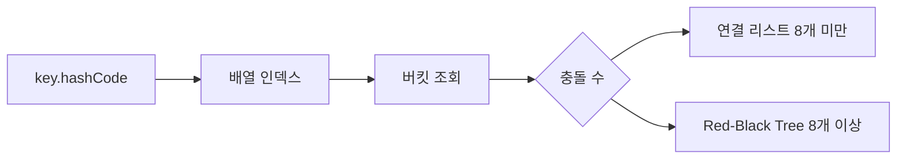

## 3. Collection 내부 구조 (Q23 ~ Q33)

### Q23. HashMap의 내부 동작 원리를 설명하세요

**모범 답변**

`HashMap`은 **배열 + 연결 리스트 + 트리** 구조입니다.

**저장 과정:**
1. `key.hashCode()` 계산
2. 배열 인덱스 결정: `(n-1) & hash`
3. 해당 버킷에 Entry 저장

**해시 충돌 처리:**
- Java 7: Separate Chaining (연결 리스트)
- Java 8+: 버킷 크기가 8 이상이면 **Red-Black Tree**로 변환 (조회 O(n) → O(log n))

**로드 팩터(Load Factor):** 기본 0.75. 전체 용량의 75% 채워지면 배열 크기를 2배로 **리해싱(Rehashing)**



> **비유:** HashMap은 우체국 PO Box 시스템입니다. 주소(해시)로 박스 번호(버킷)를 찾고, 같은 박스에 여러 편지(충돌)가 있으면 뒤적여야 합니다. 편지가 너무 많으면 색인을 만듭니다(트리).

<details>
<summary>면접 포인트 펼치기</summary>

**꼬리질문:** hashCode와 equals를 같이 구현해야 하는 이유는?

HashMap은 먼저 hashCode로 버킷을 찾고, 같은 버킷 내에서 equals로 동일 키를 찾습니다. hashCode만 같으면 같은 버킷에 쌓이지만 equals로 구분됩니다. hashCode는 다르고 equals는 true이면 HashMap에서 같은 키를 찾지 못합니다.

**꼬리질문:** 초기 용량을 미리 지정하면 좋은 이유는?

예상 크기를 알면 리해싱 비용을 줄일 수 있습니다. `new HashMap<>(예상크기 / 0.75 + 1)`로 초기 용량 설정.

</details>

---

### Q24. ConcurrentHashMap vs Hashtable vs Collections.synchronizedMap의 차이는?

**모범 답변**

| 구분 | 동기화 방식 | 성능 |
|---|---|---|
| Hashtable | 메서드 전체 synchronized | 낮음 |
| synchronizedMap | 메서드 전체 synchronized | 낮음 |
| ConcurrentHashMap | 세그먼트/버킷 단위 CAS | 높음 |

`ConcurrentHashMap` Java 8 구현:
- 쓰기: 버킷 단위로 `synchronized` 또는 CAS
- 읽기: 락 없음 (`volatile` 활용)
- `size()` 정확도가 낮을 수 있음 (ConcurrentHashMap 특성)

> **비유:** Hashtable은 한 번에 한 명만 들어갈 수 있는 창구, ConcurrentHashMap은 여러 창구가 있는 은행입니다.

<details>
<summary>면접 포인트 펼치기</summary>

**꼬리질문:** ConcurrentHashMap에서 복합 연산(check-then-act)을 안전하게 하려면?

`putIfAbsent()`, `computeIfAbsent()`, `compute()`, `merge()` 같은 원자적 복합 연산 메서드를 사용합니다. 직접 `get() + put()` 조합은 비원자적입니다.

</details>

---

### Q25. ArrayList vs LinkedList 선택 기준은?

**모범 답변**

| 연산 | ArrayList | LinkedList |
|---|---|---|
| 인덱스 조회 | O(1) | O(n) |
| 추가 (끝) | O(1) amortized | O(1) |
| 추가 (중간) | O(n) | O(1) (포인터만 변경) |
| 삭제 (중간) | O(n) | O(1) (단, 위치 찾기 O(n)) |
| 메모리 | 배열 오버헤드 | 노드당 포인터 오버헤드 |

실무에서 **대부분 ArrayList가 유리**합니다. LinkedList는 노드마다 포인터(앞/뒤)를 추가 저장하고, 메모리 비연속으로 캐시 효율이 낮습니다.

**LinkedList 사용 시나리오:** 빈번한 중간 삽입/삭제 + 인덱스 접근이 거의 없는 경우 (Deque로 사용할 때).

---

### Q26. HashSet, TreeSet, LinkedHashSet의 차이는?

**모범 답변**

| 자료구조 | 내부 구현 | 순서 | 시간 복잡도 |
|---|---|---|---|
| HashSet | HashMap | 보장 없음 | O(1) |
| LinkedHashSet | LinkedHashMap | 삽입 순서 | O(1) |
| TreeSet | Red-Black Tree | 정렬 순서 | O(log n) |

`TreeSet`은 `Comparable` 또는 `Comparator` 구현이 필요합니다.

---

### Q27. PriorityQueue의 동작 원리는?

**모범 답변**

PriorityQueue는 **이진 힙(Binary Heap)** 으로 구현됩니다. 항상 최소값(기본)이 peek/poll의 대상입니다.

- `offer()/add()`: O(log n) — 힙 위로 올리기(Sift Up)
- `poll()`: O(log n) — 루트 제거 후 재구성(Sift Down)
- `peek()`: O(1) — 루트만 반환

```java
PriorityQueue<Integer> pq = new PriorityQueue<>(); // 최소 힙
PriorityQueue<Integer> maxPq = new PriorityQueue<>(Comparator.reverseOrder()); // 최대 힙
```

---

### Q28 ~ Q33. Collection 심화 문제

**Q28. Iterator의 fail-fast vs fail-safe는?**

fail-fast: 순회 중 구조 변경 시 `ConcurrentModificationException` (ArrayList, HashMap). `modCount`로 감지.
fail-safe: 복사본을 순회하므로 예외 없음 (CopyOnWriteArrayList, ConcurrentHashMap). 최신 데이터가 아닐 수 있음.

**Q29. Arrays.sort()와 Collections.sort()의 내부 알고리즘은?**

기본 타입 배열: **Dual-Pivot QuickSort** (O(n log n) 평균). 객체 배열: **TimSort** (O(n log n), 안정 정렬). TimSort는 실제 데이터의 정렬된 구간(run)을 활용하여 거의 정렬된 데이터에서 매우 빠릅니다.

**Q30. EnumMap과 EnumSet을 사용해야 하는 이유는?**

키/값이 Enum이면 내부적으로 배열로 구현하여 HashMap보다 훨씬 빠릅니다. EnumSet은 비트 벡터로 구현하여 매우 효율적입니다.

**Q31. ArrayDeque가 Stack/Queue로 LinkedList보다 좋은 이유는?**

배열 기반으로 메모리 지역성(Locality)이 높습니다. 노드 오버헤드 없음. `Stack`, `LinkedList`보다 빠릅니다. 단, 크기 제한 없이 동적 확장합니다.

**Q32. WeakHashMap의 사용 시나리오는?**

키를 약한 참조(WeakReference)로 저장합니다. GC가 키 객체를 수집하면 자동으로 Entry가 제거됩니다. 캐시 구현에 활용. 단, GC 타이밍 비결정적이라 예측이 어렵습니다.

**Q33. Stream의 중간 연산과 최종 연산 차이는?**

중간 연산(`filter`, `map`, `sorted`): 지연 실행(Lazy), Stream 반환. 최종 연산(`collect`, `forEach`, `count`): 즉시 실행, Stream 소비. 최종 연산이 호출될 때 파이프라인 전체가 실행됩니다.

---


---

## 다른 파트 보기

- [Part 1: JVM 메모리 구조 (Q1~Q10)](/interview/java-interview-part1/)
- [Part 2: 동시성 (Q11~Q22)](/interview/java-interview-part2/)
- [Part 3: Collection 내부 구조 (Q23~Q33)](/interview/java-interview-part3/)
- [Part 4: Stream / Functional (Q34~Q40)](/interview/java-interview-part4/)
- [Part 5: 예외처리 / Generics (Q41~Q50)](/interview/java-interview-part5/)
