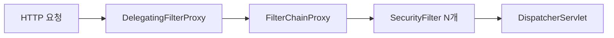

## 5. Spring Security 핵심 질문 (Q39 ~ Q45)

### Q39. Spring Security의 필터 체인 구조를 설명하세요

**모범 답변**

Spring Security는 서블릿 필터 체인으로 구현됩니다. `DelegatingFilterProxy`가 Spring의 `FilterChainProxy`에 위임하고, 여기서 여러 `SecurityFilter`를 순서대로 실행합니다.

주요 필터 순서 (일부):
1. `SecurityContextPersistenceFilter` — SecurityContext 로드
2. `UsernamePasswordAuthenticationFilter` — 폼 로그인 처리
3. `BasicAuthenticationFilter` — HTTP Basic 처리
4. `ExceptionTranslationFilter` — 인증/인가 예외 처리
5. `FilterSecurityInterceptor` — 최종 권한 확인



<details>
<summary>면접 포인트 펼치기</summary>

**꼬리질문:** SecurityContext는 어떻게 스레드 간 전파되나요?

`SecurityContextHolder`가 기본으로 `ThreadLocalSecurityContextHolderStrategy`를 사용합니다. 비동기 처리 시 자식 스레드로 SecurityContext가 전파되지 않습니다. `DelegatingSecurityContextExecutor`로 해결합니다.

</details>

---

### Q40. JWT를 Spring Security에 통합하는 방법은?

**모범 답변**

커스텀 필터를 만들어 `UsernamePasswordAuthenticationFilter` 앞에 추가합니다.

```java
public class JwtAuthenticationFilter extends OncePerRequestFilter {
    @Override
    protected void doFilterInternal(HttpServletRequest request,
            HttpServletResponse response, FilterChain chain)
            throws ServletException, IOException {
        String token = extractToken(request);
        if (token != null && jwtProvider.validate(token)) {
            Authentication auth = jwtProvider.getAuthentication(token);
            SecurityContextHolder.getContext().setAuthentication(auth);
        }
        chain.doFilter(request, response);
    }
}
```

> **비유:** JWT 필터는 건물 입구 보안요원입니다. 신분증(토큰)을 확인하고 통과시키거나 차단합니다.

<details>
<summary>면접 포인트 펼치기</summary>

**꼬리질문:** JWT 토큰 만료 전 갱신 전략은?

1. Refresh Token을 별도로 발급 (DB나 Redis에 저장)
2. Access Token 만료 시 Refresh Token으로 재발급
3. Refresh Token Rotation: 갱신 시 새 Refresh Token도 발급 (구 토큰 무효화)

</details>

---

### Q41. @PreAuthorize와 @Secured의 차이는?

**모범 답변**

| | @Secured | @PreAuthorize |
|---|---|---|
| SpEL 지원 | 불가 | 가능 |
| 복잡한 조건 | 불가 | 가능 |
| 파라미터 접근 | 불가 | 가능 |

```java
@Secured("ROLE_ADMIN") // 단순 역할 체크

@PreAuthorize("hasRole('ADMIN') or #userId == authentication.name")
// 복잡한 조건 가능
public void deleteUser(@PathVariable String userId) { ... }
```

실무에서는 `@PreAuthorize`를 권장합니다.

---

### Q42 ~ Q45. Security 실전 문제

**Q42. CSRF 공격과 Spring Security의 방어 방법은?**

CSRF: 다른 사이트에서 인증된 사용자 권한으로 요청 위조. Spring Security: CSRF 토큰을 폼에 삽입, 요청 시 검증. REST API(stateless)에서는 CSRF 비활성화 가능 (`csrf().disable()`).

**Q43. PasswordEncoder를 BCrypt로 사용하는 이유는?**

솔트(Salt) 자동 생성으로 Rainbow Table 공격 방어. 작업 인수(cost factor) 조절로 해시 속도 제어 가능. 동일 비밀번호도 매번 다른 해시값 생성.

**Q44. 인증(Authentication)과 인가(Authorization)의 차이는?**

인증: "당신이 누구인가" 확인 (로그인). 인가: "당신이 무엇을 할 수 있는가" 확인 (권한 체크). Spring Security: `AuthenticationManager`(인증), `AccessDecisionManager`(인가).

**Q45. OAuth2 Resource Server와 Authorization Server의 차이는?**

Authorization Server: 토큰 발급 서버. Resource Server: 토큰으로 API 접근을 허용하는 서버. Spring Security OAuth2 Resource Server는 JWT/Opaque 토큰 검증을 자동 처리합니다.

---

---

## 다른 파트 보기

- [Part 1: DI/IoC (Q1~Q10)](/interview/spring-interview-part1/)
- [Part 2: AOP (Q11~Q18)](/interview/spring-interview-part2/)
- [Part 3: Transaction (Q19~Q27)](/interview/spring-interview-part3/)
- [Part 4: JPA (Q28~Q38)](/interview/spring-interview-part4/)
- [Part 5: Security (Q39~Q45)](/interview/spring-interview-part5/)
- [Part 6: WebFlux (Q46~Q50)](/interview/spring-interview-part6/)
